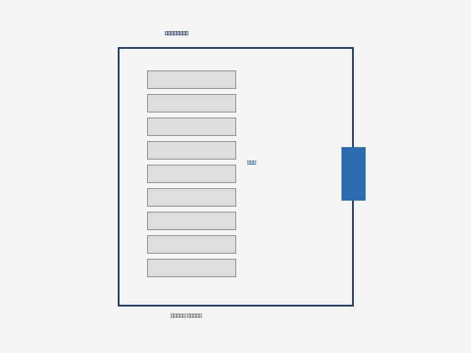

# GB 55037-2022 建筑防火通用规范实施指南

## 1 总则

### 1.0.1 编制目的

为了预防建筑火灾，减少火灾危害，保护人身和财产安全，制定本规范。本规范是建筑防火领域的基础性通用规范，具有强制约束力。

### 1.0.2 适用范围

本规范适用于下列建筑和场所的防火设计、施工及使用维护：

- 新建、扩建和改建的民用建筑
- 新建、扩建和改建的工业建筑
- 建筑室内装修装饰工程
- 既有建筑的改造和用途变更

### 1.0.3 与其他规范的关系

本规范为通用规范，当与专用规范同时适用时，应执行两者中要求较严的规定。建筑防火设计应综合考虑建筑的使用功能、建筑高度、规模和火灾危险性等因素，采取可靠的防火措施。对于临时性建筑和超出本规范适用范围的特殊建筑，可根据实际情况参照执行。

## 2 基本规定

### 2.1 建筑分类与耐火等级

建筑应根据其使用功能、建筑高度、建筑层数、单层建筑面积等因素进行分类。不同类别的建筑应满足相应的耐火等级要求。

| 建筑类别 | 高度范围 | 层数 | 最低耐火等级 |
| 超高层建筑 | >100m | — | 一级 |
| 一类高层公共建筑 | >50m | — | 一级 |
| 一类高层住宅 | >54m | >18层 | 一级 |
| 二类高层公共建筑 | 24~50m | — | 不低于二级 |
| 二类高层住宅 | 27~54m | 10~18层 | 不低于二级 |
| 多层公共建筑 | ≤24m | ≤5层 | 不低于三级 |
| 多层住宅 | ≤27m | ≤9层 | 不低于三级 |
| 单多层工业建筑 | — | — | 视火灾危险性 |

### 2.2 总平面布局

#### 2.2.1 防火间距

建筑之间的防火间距应根据建筑的耐火等级、外墙开口比例以及相邻建筑的高度等因素确定。

| 耐火等级 | 一、二级 | 三级 | 四级 |
| 一、二级 | 6m | 7m | 9m |
| 三级 | 7m | 8m | 10m |
| 四级 | 9m | 10m | 12m |

#### 2.2.2 消防车道

供消防车通行的道路净宽度和净空高度均不应小于4m。消防车道应满足消防车转弯的要求，回车场面积不应小于12m×12m。

高层建筑应至少沿一个长边设置消防车登高操作场地。登高操作场地应符合下列规定：长度和宽度分别不应小于15m和10m，场地的坡度不宜大于3%，场地与建筑之间不应设置妨碍消防车操作的树木、架空管线等障碍物。

## 3 建筑构造与装修

### 3.1 防火墙

防火墙应直接设置在建筑的基础或框架、梁等承重结构上。框架、梁等承重结构的耐火极限不应低于防火墙的耐火极限。防火墙上不宜开设门、窗、洞口，确需开设时应设置甲级防火门窗。

### 3.2 防火分区

建筑内应采用防火墙、楼板及其他防火分隔设施划分防火分区。防火分区的最大允许建筑面积应符合下表规定：

| 建筑类型 | 耐火等级 | 每个防火分区最大允许面积(m²) |
| 高层民用建筑 | 一级 | 1500 |
| 高层民用建筑 | 二级 | 1000 |
| 多层公共建筑 | 一级 | 2500 |
| 多层公共建筑 | 二级 | 2500 |
| 多层公共建筑 | 三级 | 1200 |
| 地下或半地下建筑 | 一级 | 500 |
| 厂房（甲类） | 一级 | 4000（单层） |
| 厂房（乙类） | 一级 | 5000（单层） |
| 厂房（丙类） | 一级 | 8000（单层） |
| 厂房（丁类） | 一、二级 | 不限（单层） |
| 仓库（甲类3、4项） | 一、二级 | 180 |
| 仓库（乙类1项） | 一、二级 | 500 |

注：设置自动灭火系统的防火分区，其面积可增加1.0倍；局部设置时，增加面积按局部面积的1.0倍计算。

### 3.3 建筑保温与装修

建筑外墙外保温系统不应采用燃烧性能低于B1级的保温材料。当采用B1级保温材料时，每层应设置水平防火隔离带。建筑内部装修不应降低建筑构件的燃烧性能和耐火极限。

# 4 安全疏散

## 4.1 一般规定

建筑内每个防火分区或一个防火分区的每个楼层，其安全出口的数量应经计算确定，且不应少于2个。

### 4.1.1 疏散距离

建筑内任一点至最近安全出口的直线距离不应大于表中规定的值。疏散走道在转角处宜设置消防应急标志灯。

| 建筑类别 | 位于两个安全出口之间 | 位于袋形走道两侧或尽端 |
| 一、二级耐火等级 | 40m | 22m |
| 三级耐火等级 | 35m | 20m |
| 四级耐火等级 | 25m | 15m |
| 高层医疗建筑 | 24m | 12m |
| 其他高层公共建筑 | 30m | 15m |
| 高层住宅建筑 | 40m（开门）/22m（进户门） | — |

### 4.1.2 疏散宽度

安全出口、房间疏散门的净宽度不应小于0.9m，疏散走道的净宽度不应小于1.1m，疏散楼梯的净宽度不应小于1.1m。人员密集的公共场所，其疏散门的净宽度不应小于1.4m。

## 4.2 疏散楼梯

### 4.2.1 楼梯形式

建筑的疏散楼梯应满足以下要求：

- 高层公共建筑的疏散楼梯应采用防烟楼梯间
- 建筑高度大于33m的住宅建筑应采用防烟楼梯间
- 建筑高度大于21m且不大于33m的住宅建筑应采用封闭楼梯间
- 多层公共建筑的疏散楼梯应采用封闭楼梯间

### 4.2.2 消防电梯

建筑高度大于33m的住宅建筑和一类高层公共建筑应设置消防电梯。消防电梯的载重量不应小于800kg，轿厢内净面积不应小于1.40m²。消防电梯从首层至顶层的运行时间不宜大于60s。

# 5 消防设施

## 5.1 消火栓系统

建筑高度大于21m的住宅建筑和建筑体积大于5000m³的公共建筑应设置室内消火栓系统。室内消火栓的布置应确保任何一点均有两支水枪充实水柱同时到达。

## 5.2 自动灭火系统

下列场所应设置自动灭火系统：

- 一类高层公共建筑及其地下、半地下室
- 建筑高度大于100m的住宅建筑
- 藏书量超过50万册的图书馆
- 单个防火分区建筑面积超过1500m²的展览厅
- 总建筑面积大于500m²的地下商店

## 5.3 火灾自动报警系统

建筑高度大于100m的住宅建筑应设置火灾自动报警系统。高层公共建筑应设置火灾自动报警系统。报警系统应能准确报出火灾发生部位，并能联动相关消防设施。

# 附录 规范用词说明

本规范条文中的用词，说明如下：

| 用词 | 含义 | 严格程度 |
| 应 | 表示很严格，非这样做不可 | 强制 |
| 宜 | 表示允许稍有选择，条件许可时首先应这样做 | 推荐 |
| 可 | 表示有选择，在一定条件下可以这样做 | 允许 |
| 不应 | 表示严格禁止 | 强制禁止 |
| 不宜 | 表示不推荐，但并非绝对禁止 | 不推荐 |
