# 《建筑防火通川规范

# GB 55037—2022

# 实施指南

《IlANZHU FANGHUO TONGYONG GUIFAN》 

GB 55037—2022 

SHISHI ZHINAN 

规范编制组 编著 

# 版权所有侵权必究

本书环衬使用中国计划出版社专用防伪纸，封面贴有中国计划出版社 专用防伪标，否则为盗版书。请读者注意鉴别、监督！ 

侵权举报电话：（010）63906404 

如有印装质量问题，请寄本社出版部调换（010）63906420 

# 图书在版编目（C丨P）数据

《建筑防火通用规范》GB 55037-2022实施指南／规 范编制组编著。二北京：中国计划出版社，2023.5 

ISBN 978-7-5182-1532-4 

I．①建…ⅡI．①规…II．①建筑设计-防火一建筑 规范一中国-指南 IV．①TU892-65 

中国国家版本馆CIP数据核字(2023)第084194号 

策划编辑：李颖高明 

责任编辑：高明封面设计：钟辉 

责任校对：王巍责任印制：李晨　王亚军 

中国计划出版社出版发行 

网址：www. jhpress.com 

地址：北京市西城区木樨地北里甲11号国宏大厦C座3层 

邮政编码：100038电话：（010）63906433（发行部） 

北京市科星印刷有限责任公司印刷 

$8 5 0 \mathrm { m m } \times 1 1 6 8 \mathrm { m m }$ 1/3215.25印张420千字 

年 5 月 第 1 版 2023 年 5 月 第 1 次印刷 

定价：158.00元 

# 编写人员名单

主 编：倪照鹏 

副主编：刘激扬 

撰稿人：（按姓氏笔画排序） 

王宗存 刘激扬 李 昂 胡 锐 

倪照鹏 阐 强 

# 序

按照国务院《深化标准化工作改革方案》 （国发[ 2015 13号）要求， 住房和城乡建设部印发了《深化工程建设标准 化工作改革的意见》（建标[ 2016 J 166号）， 明确提出构建 以全文强制性工程建设规范（以下简称 “工程规范")为核心， 推荐性标准和团体标准为配套的新型工程建设标准体系。 通过 制定工程规范，筑牢工程建设技术“底线”，按照工程规范规 定完善推荐性工程技术标准和团体标准， 细化技术要求， 提高 技术水平， 形成政府与市场共同供给标准的新局面， 逐步实现 与 “技术法规与技术标准相结合” 的国际通行做法接轨。 

工程规范作为工程建设的 ”技术法规＂ ， 是勘察、设计、 施工、验收、维护等建设项目全生命周期必须严格执行的技术 准则。 在编制方面， 与现行工程建设标准规定建设项目技术要 求和方法不同， 工程规范突出强调对建设项目的规模、布局、 功能、性能及关键技术措施的要求。 在实施方面， 工程规范突 出强调以建设目标和结果为导向， 在满足性能要求的前提下， 技术人员可以结合工程实际合理选择技术方法， 创新技术实现 路径。 

《建筑防火通用规范》GB 55037一2022发布后， 我部标准 定额研究所组织规范编制单位，在起草说明的基础上编制了本 工程规范实施指南， 供相关工程建设技术和管理人员在工作中 研究参考， 希望能为上述人员准确把握、正确执行工程规范提 供帮助。 

住房和城乡建设部标准定额司 

# 日立＂ 言

为适应国际技术法规与技术标准通行规则，2016年以来， 住房和城乡建设部陆续印发《深化工程建设标准化工作改革的 意见》等文件，提出政府制定强制性标准、社会团体制定自愿 采用性标准的长远目标，明确了逐步用全文强制性工程建设规 范取代现行标准中分散的强制性条文的改革任务，逐步形成由 法律、行政法规、部门规章中的技术性规定与全文强制性工程 建设规范构成的 ” 技术法规“ 体系，并分别自2021年开始陆 续批准发布了40项全文强制的工程建设规范。《建筑防火通用 规范》GB 55037-2022 (以下简称 “规范") 是其中的一项。 

为便于使用人员领会规范条文的本意，把握其实施要点， 准确执行规范，我们组织规范的主要起草人员编写了《（建筑 防火通用规范〉GB 55037— 2022实施指南》（以下简称 “本指 南")。 本指南各章节内容及编号与规范一致，除少数条文外， 按照章节和条文顺序给出了［条文要点】和［实施要点】。【条 文要点】明确了条文规定是功能、 功能目标要求，还是性能要 求，或者是关键技术措施要求。【实施要点】紧扣规范条文， 着重说明条文规定的内涵和外延，明确如何实现条文规定的功 能和性能要求及如何判定实际工程做法是否符合规范要求，并 对有关难点问题给出了【示例】。 

本指南可供从事建筑防火设计、 建筑施工或建筑专项消防 工程施工、 工程监理、 建筑消防设计施工图审查、 消防技术咨 询服务、 消防设施检测、 消防设施维护管理、 住建部门消防 审查和验收、 消防救援机构防火监督的相关人员，以及职业学 校和高等院校消防工程、 建筑与规划及土木工程专业师生等 使用。 

本指南由倪照鹏主编和审定，其他编写人员有：国家消防救 援局刘激扬高级工程师、 胡锐高级工程师，应急管理部天津消防 

研究所阐强副研究员、王宗存副研究员， 中国城市规划设计研究 院李昂工程师。 其中， 第1章至第3章由刘激扬、倪照鹏编写； 第4章、第5章由倪照鹏、胡锐编写；第6章至第8章由倪照鹏、 王宗存编写；第9章至第12章由阐强、李昂编写。 

由千时间仓促， 编者水平有限， 本指南中难免存在差错， 敬请广大读者及时指正， 以便再版时修订完善。 有关意见和建 议请发送至 nizhaopeng@sina.com。 

本指南能够在短时间内出版， 要特别感谢李丽芬女士在本 书编写过程中协助查阅资料， 感谢应急管理部沈阳消防研究所 姜学赞副研究员为本指南中消防通信指挥系统相关内容撰写提 供的帮助， 感谢大连东方华辰建筑设计有限公司谢琳高工等专 家在编写过程中提供的无私帮助， 感谢中国计划出版社李颖和 高明老师的鼓励和精心编辑， 感谢斯美特（深圳）安全技术顾 问有限公司宋小强、谢瑞云先生不辞辛苦地制作了全部插图， 丰富了本书内容。 

规范编制组 

2023年4月 

# H 次

1 总 则 .. . . . 

2 基本规定 ·· · · · · ·16 

2.1 目标与功能·· · · · · · ·16 

2.2 消防救援设施·· · · · · ·35 

3 建筑总平面布局 · · ·64 

3.1 一般规定 · · · ·64 

3.2 工业建筑 · · · · ·77 

3.3 民用建筑 · · · · ·79 

3.4 消防车道与消防车登高操作场地.... ... 

4 建筑平面布置与防火分隔 100 

4.1 一般规定 100 

4.2 工业建筑 121 

4.3 民用建筑 136 

4.4 其他工程 163 

5 建筑结构耐火 ..... 172 

5.1 一般规定 172 

5.2 工业建筑 189 

5.3 民用建筑 194 

5.4 其他工程 .. · 201 

6 建筑构造与装修 ··· 205 

6.1 防火墙 205 

6.2 防火隔墙与幕墙·· · 210 

6.3 竖井、管线防火和防火封堵... 223 

6.4 防火门、防火窗、防火卷帘和防火玻璃墙 233 

6.5 建筑的内部和外部装修 .. 251 

6.6 建筑保温 .. ,. 263 

# 7 安全疏散与避难设施 ... 278

7.1 一般规定 278 

7.2 工业建筑 336 

7.3 住宅建筑 ·· 342 

7.4 公共建筑 · ··· ····346 

7.5 其他工程 364 

# 8 消防设施 ... 374

8.1 消防给水和灭火设施 .... 374 

8.2 防烟与排烟·· · · 393 

8.3 火灾自动报警系统 ..... .400 

# 9 供暖、 通风和空气调节系统 ..… 407

9.1 一般规定 ·407 

9.2 供暖系统 ·413 

9.3 通风和空气调节系统 ··.. ·417 

# 10 电 气...... .422

10.1 消防电气 ..... .422 

10.2 非消防电气线路与设备..... 446 

# 1 建筑施工..... 453

# 12 与 ·· · · · 463

# 0 总 则

1.0.l 为预防建筑火灾、 减少火灾危害， 保障人身和财产 的安全， 使建筑防火要求安全适用、 技术先进、 经济合理， 依据有关法律、 法规， 制定本规范。 

# 【条文要点】

本条规定了本规范编制的目的和确定各类建筑的防火要求应 遵循的基本原则。 本规范规定了各类建筑在规划、 设计、 施工、 使用和维护等方面应满足的基本防火要求。 这些要求旨在建筑规 划和设计时就使建筑具备与其火灾危险性相适应的本质消防安全 性能，在施工、拆除和维护过程中能够有效预防火灾发生，使建 筑在使用过程中能够保持其设计要求具备的消防安全性能，从而 实现减少火灾危害的目的。 

# 【实施要点】

建筑防火是一个系统工程，在建筑设计、 施工和使用过程中 要注意全面考虑影响建筑消防安全的各类因素以及各种防火技术 和措施在建筑整体防火系统中的作用，并依据以下原则确定建筑 的防火措施和相关要求： 

(1)从建筑的实际火灾危险性和火灾扑救难度等具体情况出 发，使所采用的防火技术措施和防火要求既能保障建筑和人身的 安全，所采用的建筑材料、 灭火剂、 防火保护材料等在正常使用 和火灾时对环境和人体健康的影响较小，又具有较强的针对性、 有效性、 可靠性、 可实施性。 

(2)建筑的防火要求和措施应符合国家法律法规和技术规范 的规定，如住房和城乡建设部门、 消防救援机构发布的规定中有 关建筑防火的技术要求，技术规范中巳明确的技术要求和措施。 

(3)在规划、 设计时既要考虑建造的建筑（包括改造的既有 建筑）发生火灾对周围建筑和环境的危害性影响，又要考虑周围 建筑发生火灾对本建筑的不利作用。 

(4)积极采用经过工程实际应用并证明是可靠的先进技术、 新材料、新产品、新方法和新工艺。 

(5)在满足建筑应具备的消防安全性能的前提下，尽可能地 降低建筑防火的建设和管理成本，提高建筑防火的投资效益。 

1.0.2 除生产和储存民用燥炸物品的建筑外， 新建、 改建 和扩建建筑在规划、 设计、 施工、 使用和维护中的防火， 必须执行本规范。 

# 【实施要点】

本规范所规定的建筑，包括各类地上和地下的工业与民用建 筑等各类房屋建筑， 轨道交通工程， 城市交通隧道工程，公路隧 道工程，平时使用的人民防空工程， 加油站、 加气站、加氢站及 其合建站，管廊或共同沟、电缆隧道及其他市政工程与设施，各 类生产装置、 塔和筒仓等构筑物；不包括可燃气体和液体的储 罐或储罐区，可燃材料堆场， 集装箱堆场， 核电工程及其建筑， 军事建筑和工程，矿山工程， 炸药和烟火爆竹等火工品建筑和 工程。 

本规范的规定包括了各类新建、改建和扩建的建筑从规划、 设计、施工至使用和维护或拆除全生命周期的基本防火功能和性 能的要求、相关关键防火技术措施和要求，即在建筑的规划和设 计中应采取的保证建筑本质安全的防火技术措施和要求；在建筑 建造和拆除期间的施工现场应具备的基本防火性能和应采取的防 火措施；建筑在投入使用后应具备的基本防火性能和在使用期间 预防火灾或爆炸、保持建筑防火措施正常发挥作用的基本要求。 

改建建筑一般为改变使用性质或使用功能、建筑结构的建 筑；扩建建筑一般为改变建筑高度、建筑面积或建筑体积等建筑 规模的建筑。 

1.0.3 生产和储存易燃易爆物品的厂房、 仓库等， 应位于 城镇规划区的边缘或相对独立的安全地带。 

# 【条文要点】

本条规定了在建筑规划时应将具有爆炸危险性的建筑作为重 大危险源，结合城镇规划合理确定其选址和设置位置，尽量避免 

这些建筑发生的火灾和爆炸事故对周围居民生命和生产、 生活及 社会秩序等造成大的危害和影响。 

# 【实施要点】

生产和储存易燃易爆物品的厂房、 仓库等建筑在规划选址 时，一般要事先根据拟建建筑中危险源的数量、物质特性等评估 其火灾和爆炸的危害性，结合城镇总体规划和有关专项规划，将 这些建筑设置在对城镇公共安全、 水源等环境安全影响较小的城 镇边缘区域。 

城镇的相对独立的安全地带主要为在城镇边缘远离城镇水源 地、 居民聚居点、 工业区、 商业区、 文化和行政办公区、 地铁工 程和交通车站、 重要的桥梁和交通线的区域，并且通常应处于城 镇最大频率风向的下风侧。 此外，生产和储存易燃易爆物品的厂 房、 仓库等建筑的选址，还需要考虑这些建筑的规模、 发生火灾 和爆炸事故后的影响以及事故时便千应急救援的要求，如与消防 水源、 公共道路的联系等。 

对于城镇中不符合安全要求并具有火灾爆炸危险性的既有建 筑，在城镇规划和城镇改造时要根据本条规定同步改造或迁移。 1.0.4 城镇耐火等级低的既有建筑密集区， 应采取防火分 隔措施、 设置消防车通道、 完善消防水源和市政消防给水 与市政消火栓系统。 

# 【条文要点】

本条规定了老旧城镇高火灾风险区域更新改造的基本消防技 术措施。 

# ［实施要点】

城镇耐火等级低的既有建筑密集区主要为城镇中以砖木结 构、 木结构建筑等三级、 四级耐火等级建筑为主的老旧街区。 这 些街区一旦发生火灾容易导致 “火烧连营＂ 的现象，难以有效扑 救，火灾后果严重，在我国历史上曾发生过多次严重的老旧街 区火灾。 例如，1983年4月17日哈尔滨市道里区河图街发生火 灾，火势波及河清街、 河洲街、 河润街和河济街，大火持续了 15h, 延烧了5条街道，烧毁房屋215栋（其中楼房7栋），过 

火面积达 $8 . 8 \times 1 0 ^ { 4 } \mathrm { m } ^ { 2 }$ ， 共有758 户，2 856人和15个企事业单位受 灾， 导致9人死亡，10人被烧伤。2014年1月11日， 有 “月光 城＇ 之称的云南香格里拉市独克宗古城发生火灾， 经过10多个小 时才被扑灭。 过火面积约 $1 \mathrm { k m } ^ { 2 }$ , 受灾户数335 户， 烧毁房屋242 栋， 因设置防火隔离带拆除房屋43栋，拆除屋顶的房屋50栋。 

对于耐火等级低的建筑集中的老旧城区， 应根据城镇改造规 划和街区与历史建筑保护要求，采取拆除对区域消防安全影响大 的建筑，根据实际情况结合普通消防站或小型消防站建设、街区 管线改造和市政消防供水管网、市政消火栓系统、公共绿化与避 难场所等的设置，综合街区道路改造和消防站装备配备情况打通 可供消防车通行的街区道路， 采取设置防火墙、防火隔离带 等方 式限制可能发生的火灾影响范围。 对于占地面积较大、保护价值 高或发生火灾可能产生严重后果的老旧城镇街区， 要在开展相应 消防安全评估的基础上确定街区规划和改造方案。 

1.0.5 既有建筑改造应根据建筑的现状和改造后的建筑规 模、 火灾危险性和使用用途等因素确定相应的防火技术要 求， 并达到本规范规定的目标、 功能和性能要求。 城镇建 成区内影响消防安全的既有厂房、 仓库等应迁移或改造。 

# 【条文要点】

本规范适用于既有建筑使用期间的防火和既有建筑改造的 防火设计、改造和维护施工的防火。本条规定了既有建筑改造 的基本防火原则和城镇中影响区域消防安全的既有建筑的改造 要求。 

# 【实施要点］

(1)既有建筑改造一般是指不改变建筑使用用途、不增加建 筑规模， 对既有建筑安全性、功能完整性和品质提升的活动， 如 节能改造、加装电梯、无障碍改造、水暖电系统等机电设施改 造、内外部装修装饰、 房屋修缮、结构加固等。根据既有建筑的 改造范围可分为修缮和维护工程、装修工程、局部改造工程和整 体改造工程等4类。 

1)修缮和维护工程主要为对既有建筑进行维修、加固和保 

护，使其保持或恢复原貌，并满足正常使用功能要求和结构安全 的工程。 

2)装修工程主要为对建筑内部空间和屋顶及外立面进行装修 修饰和固定设施安装等，使其满足使用功能或用途要求的工程。 

3)局部改造工程主要为对建筑的内部平面布置和用途进行 局部调整，更新相应的装修装饰和设施设备、完善功能，加固和 修复局部结构，但不改变防火分区划分和分隔的工程。 

4)整体改造工程主要为对既有建筑的结构进行加固、修复 或更新，调整平面布置，更新内外部装修和设施设备，且可能改 变防火分区划分和防火分隔的工程。 

(2)既有建筑的情形十分复杂，不仅建筑的耐火性能、建 筑本身的属性相差很大，而且建造年代和建造时采用的标准有所 不同，往往难以完全按照本规范及现行国家相关消防技术标准改 造。尽管如此，既有建筑改造仍应符合本规范的规定，使改造后 的既有建筑具备本规范规定的基本消防安全性能。因此，既有建 筑改造应符合本规范和现行国家标准《消防设施通用规范》GB 55036等强制性技术规范的规定，并尽可能执行现行国家工程建 设消防技术标准。当条件不具备、执行现行强制性技术规范和技 术标准确有困难时，既有建筑改造后的消防安全性能或消防安全 水平不应低于原建造时的标准或原建造时的消防安全性能或消防 安全水平，并根据建筑的具体用途和火灾危险性等情况，结合改 造目标尽可能地改善建筑的消防安全性能，或提升建筑的消防安 全水平；当原建造时尚无相应的国家工程建设消防技术标准时， 应在消防安全评估的基础上参照现行消防技术标准确定该既有建 筑改造的消防安全要求。 

(3)既有建筑改造应采取什么防火技术措施满足建筑的基 本消防安全性能要求，可综合建筑的实际用途、规模、高度或埋 深、建筑的结构类型和耐火性能、与周围建筑的火灾相互影响、 所在区域的气候和地理环境等条件、城市消防救援应急响应能力 等因素考虑。既有建筑的改造需要在对其现状做充分的调查了解 和整体消防安全状况评估的基础上，根据改造后的火灾危险性、 

使用用途、 建筑火灾的扑救难易程度等， 确定针对性的防火技术 措施及建筑防火系统中各部分应满足的技术要求， 结合改造方案 和本规范规定的相关建筑防火目标、 功能和性能要求， 综合评估 既有建筑改造后的整体消防安全性能， 并评价其是否符合本规范 的规定。 

(4)随着社会经济发展和城镇区域的不断扩张， 城镇街区内 分布着各个历史时期建造的建筑， 建造标准不一， 不少街区存在 少数火灾危险性高的建筑， 发生火灾对周围建筑的危害性较大， 甚至可能引发火灾次生灾害。 这些建筑需结合城镇街区改造规 划， 尽可能地调整或改变其使用功能或用途、 设置防火分隔、 对 建筑进行改造或拆除等。 

1.0.6 在城市建成区内不应建设压缩天然气加气母站、 一 级汽车加油加气站及其合建站。 

# ［条文要点】

本条所规定的加油站、 加气站、 加氢站， 以及不同类型燃料 的合建站， 均为火灾危险性大、 具有较高爆炸危险性的设施， 需 要严格控制其在城市建成区内的选址。 

# ［实施要点】

(1)根据国家标准《城市规划基本术语标准》GB厅5028(}- 1998, 城市建成区简称 “建成区” ， 是指城市行政区内实际已成 片开发建设、 市政公用设施和公共设施基本具备的地区。 在城 市建成区内， 建筑和各类城市设施密度较高， 人员聚集度高， 而 压缩天然气加气母站、 一级汽车加油加气站及其合建站中可燃 气 体、 可燃液体的储存量大， 日常加油加气量也大， 具有较高的火 灾和爆炸危险性， 火灾和爆炸后果严重， 属千城市的重大危险源 之一， 应严格控制其建设选址。 

(2)本条规定的一级汽车加油加气站及其合建站， 包括一级 汽车加油站、 一级液化石油气(LPG)汽车加气站、 一级液化天 然气(LNG)汽车加气站、 一级液化－压缩天然气(L-CNG)汽 车加气站、LNG和L-CNG汽车加气合建站、 一 级汽车加氢站、 一 级汽车加油加气合建站（包括LPG、LNG、CNG、L-CNG 等 

加气方式）、 一级汽车加气加氢合建站和一级汽车加油加气加氢 合建站。 

(3)根据国家标准《汽车加油加气加氢站技术标准》GB 50156—2021第3.0.18条～第3.0.23条、 第4.0.4条～第4.0.8条 的规定和《加氢站技术规范》GB 50516一2010 (2021年版）第 3.0.2条、 第4.0.4A条的规定， 此两项国家标准有关加氢站等级 划分和相应防火间距的要求还有所不同， 应注意区别。 此外， 根 据GB 50156—2021第4.0.2条的规定， 一级汽车加油加气加氢 站、CNG加气母站不应建在城市中心区内；根据GB 50516— 2010 (2021年版）第4.0.2条的规定， 一级加氢站不应建设在 城市中心区内。 这两项标准有关规定与本规范的规定也有所差 异， 应注意区别。 在确定相关要求时， 应同时符合本规范及GB 50156—2021和GB 50516—2010 (2021年版）的规定， 当这几项 标准要求不一致时， 应符合本规范的规定。 

1.0.7 城市消防站应位于易燃易爆危险品场所或设施全年 最小频率凤向的下凤侧， 其用地边界距离加油站、 加气站、 加油加气合建站不应小于 $5 0 \mathrm { m }$ , 距离甲、 乙类厂房和易燃 易爆物品储存场所不应小于 $2 0 0 \mathrm { m }$ 。 城市消防站执勤车辆的 主出入口， 距离人员密集的大型公共建筑的主要疏散出口 不应小于 $5 0 \mathrm { m }$ 。 

# 【条文要点］

城市消防站是供消防救援人员生活、 训练和执勤的驻地， 需 要24h进驻人员并随时接警遂行应急救援任务。 城市消防站的建 设应保障驻地建筑、 人员及设施安全运行， 并具有快速、方便 出警的条件。 本条规定了城市消防站选址、 消防站出入口与邻 近建筑出入口布置的基本要求， 专职消防队站的建设可以参照 执行。 

# 【实施要点］

(1)根据我国消防救援队伍的管理体制， 消防救援队伍分 为：国家综合性消防救援队伍、政府专职消防队伍、企事业单位 专职消防队伍。 企事业单位专职消防队伍主要为在机场、 港口、 

油田、电厂（包括核电厂）、军事机构和其他火灾危险性较大的 大型企业、事业单位建立的专职消防队。 

本条规定的城市消防站属于国家综合性消防救援队伍进驻和 执勤的消防站，是保证城市安全的重要设施。 城市消防站建设应 充分保障消防站建筑和消防救援人员的安全，站址选择和出入口 布置应便于救援队伍安全、快速地紧急出动。 

(2)城市消防站由室外训练场、道路、绿地等场地和训练 设施， 业务用房、业务附属用房和辅助用房等房屋建筑， 消 防车辆（船艇、 直升机）、灭火器材、灭火药剂、抢险救援器 材、 消防员防护装备、 通信器材、训练器材、 战勤保障器材、 营具、公众消防宣传教育设施等装备构成。 因此，本条规定的 间距应按照消防站的用地边界线至相邻加油加气站的加油加气 设备和储罐的边缘、 甲类或乙类生产厂房的建筑外墙、易燃易 爆物品储存建筑的外墙、可燃气体和可燃液体储罐的罐壁、易 燃易爆危险品堆场的堆跺边缘的最近水平距离测量；当消防站 沿其用地边界线设置围栏或围墙时，应按照消防站的围栏或围 墙的外边线起算。 对于LPG加气站、LNG加气站和加油加气 合建站或加气加氢合建站中的LPG、LNG设备与消防站的距 离， 城市消防站与相关设施设备的间距还应符合现行国家标准 《汽车加油加气加氢站技术标准》GB 50156的规定。 例如，该 标准2021年版第4.0.5条和第4.0.7条规定，LPG设备和LNG 工艺设备与 “ 重要公共建筑＂ 的安全间距分别不应小千 $1 0 0 \mathrm { m }$ 和 $8 0 \mathrm { m }$ 。 参见图1-1。 

(3)本条规定的易燃易爆危险品场所或设施，包括各类可 燃液体储罐，各类可燃或助燃气体储罐，易燃易爆危险品堆场， 甲、乙类仓库， 甲、乙类厂房， 加油站、 加气站、 加油加气合 建站包括各个等级的加油站、加气站、加氢站、 加油加气合建 站、加油加氢合建站、加气加氢合建站、加油加气加氢合建站。 

(4)有关城市消防站选址的具体要求， 还应符合国家标准 《城市消防站设计规范》GB 51054—2014 第3章和建设标准《城 市消防站建设标准》（建标152—2017)第三章的规定。 

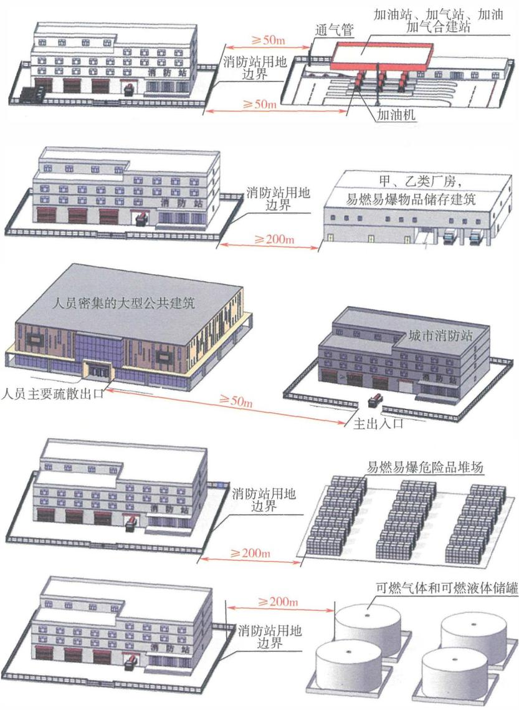

图1-1 城市消防站与相邻建筑之间的最小间距要求示意图

1.0.8 工程建设所采用的技术方法和措施是否符合本规范 要求， 由相关责任主体判定。 其中， 创新性的技术方法和 措施应进行论证并符合本规范中有关性能的要求。 

# 【条文要点］

建筑技术、建筑制品、建筑消防产品、建筑材料和工艺， 建 筑形态、功能和用途等均会随社会经济的发展不断发展和进步。 为激发社会创新、促进技术进步， 本规范重点规定了建筑防火的 基本目标、功能和性能要求， 除一些关键性技术措施和要求外， 未明确如何实现这些目标、功能和性能要求的具体措施、方法及 相关技术要求。在建筑中应采取的具体防火措施、方法及相关技 术要求， 需要规范执行者或相关责任主体根据本规范和现行国家 相关技术标准的规定以及建筑的防火实际需要确定。 本条的规定 是针对建筑防火中采用的方法、材料、技术等与本规范、国家相 关技术标准的规定不同或有特殊要求时的解决方案。 

# 【实施要点］

(1)本规范主要规定了各类建筑整体防火、各防火子系统 及其组成部分应满足的基本目标、功能和性能要求， 这些要求为 在实际建筑中确定更加合理的消防安全水平， 选用更加合理的针 对性防火措施提供了依据和准则。 本规范的规定不限制任何新技 术、新方法、新工艺、新产品和新材料在建筑中的应用。 当建筑 防火采用与本规范规定不一致的技术方法和防火措施时， 应对采 用的技术方法和措施开展专项技术论证， 以确定其功能和性能 是否满足设置目标、所需功能和性能的要求， 是否符合本规范的 有关规定。 有关技术论证工作可以由 ”相关责任主体” 负责， 但 相关技术论证结论的采用应符合国家现行有关工程建设的规定和 程序。 

(2)本条规定的 ”相关责任主体” ， 是确定建筑中采用的技 术、方法和措施的主体， 是建筑消防设计、安装、验收和使用维 护的责任主体， 可以是建设单位、设计单位、建筑消防设计施工 图审查机构、施工单位、监理单位、使用单位、第三方专业消防 技术服务机构或消防设施供应商、建筑消防设计审查部门、消防 

监督管理部门或其授权委托的个人或机构。具体的主要责任和主 体责任的主体，应根据其在建筑中采用的技术方法和措施在建筑 消防安全中发挥的作用而定。 

(3)在建筑的建造和使用过程中采取的技术方法、措施和确 定的技术要求，当符合现行国家相关技术标准的规定时，可以直 接认定其有关消防安全的功能、性能符合本规范的规定；当不符 合现行国家相关技术标准的规定时，应通过试验、实验、技术评 估和专家论证等方法确定采取的技术方法、措施和确定的技术要 求以及建筑的整体消防安全性能是否符合本规范的规定。 

# 1.0.9 违反本规范规定，依照有关法律法规的规定予以处罚。

# 【实施要点】

本规范是全文强制的工程建设消防技术国家标准，是政府相 关部门行政执法的重要技术依据，必须执行。 本条依据 《中华人 民共和国消防法》(2021年修正）（以下简称《消防法》）、《中华 人民共和国建筑法》(2019年修正）（以下简称《建筑法》）、《建 设工程质量管理条例》（国务院令 第279号，2019年修订）、 《建设工程消防设计审查验收管理暂行规定》（住建部令 第51 号，2020年） 规定了违反本规范的处罚要求。 下列摘录了这些 法规的相关主要规定。 

# (1)《消防法》有关规定如下：

第九条建设工程的消防设计、施工必须符合国家 工程建设消防技术标准。 建设、 设计、 施工、 工程监理 等单位依法对建设工程的消防设计、施工质量负责。 

笫二十六条 建筑构件、 建筑材料和室内装修、 装 饰材料的防火性能必须符合国家标准；没有国家标准 必须符合行业标准。 

人员密集场所室内装修、装饰，应当按照消防技术 标准的要求， 使用不燃、 难燃材料。 

笫二十七条 电器产品、 燃气用具的产品标准， 应 当符合消防安全的要求。 

电器产品、燃气用具的安装、使用及其线路、管路 的设计、敷设、维护保养、检测，必须符合消防技术标 准和管理规定。 

第二十八条任何单位、个人不得损坏、挪用或者 擅自拆除、停用消防设施、器材，不得埋压、圈占、遮 挡消火栓或者占用防火间距，不得占用、堵塞、封闭疏 散通道、安全出口、消防车通道。人员密集场所的门窗 不得设置影响逃生和灭火救援的障碍物。 

第五十九条违反本法规定，有下列行为之一的， 由住房和城乡建设主管部门责令改正或者停止施工，并 处一万元以上十万元以下罚款： 

（一）建设单位要求建筑设计单位或者建筑施工企 业降低消防技术标准设计、施工的; 

（二）建筑设计单位不按照消防技术标准强制性要 求进行消防设计的； 

（三）建筑施工企业不按照消防设计文件和消防技 术标准施工，降低消防施工质量的； 

（四）工程监理单位与建设单位或者建筑施工企业 串通，弄虚作假，降低消防施工质量的。 

第六十条单位违反本法规定，有下列行为之一 的，责令改正，处五千元以上五万元以下罚款： 

（一）消防设施、器材或者消防安全标志的配置、设 置不符合国家标准、行业标准，或者未保持完好有效的； 

（二）损坏、挪用或者擅自拆除、停用消防设施、 器材的； 

（三）占用、堵塞、封闭疏散通道、安全出口或者 有其他妨碍安全疏散行为的； 

（四）埋压、圈占、遮挡消火栓或者占用防火间距的； 

（五）占用、堵塞、封闭消防车通道，妨碍消防车 通行的； 

（六）人员密集场所在门窗上设置影响逃生和灭火 救援的障碍物的； 

（七）对火灾隐患经消防救援机构通知后不及时采 取措施消除的。 

个人有前款笫二项、第三项、第四项、笫五项行为 之一的， 处警告或者五百元以下罚款。 

有本条笫一款第三项、第四项、笫五项、第六项行 为， 经责令改正拒不改正的， 强制执行， 所需费用由违 法行为人承担。 

(2)《建筑法》有关规定如下： 

笫三十七条 建筑工程设计应当符合按照国家规 定制定的建筑安全规程和技术规范， 保证工程的安全 性能。 

笫五十二条 建筑工程勘察、设计、施工的质量必 须符合国家有关建筑工程安全标准的要求， 具体管理办 法由国务院规定。 

有关建筑工程安全的国家标准不能适应确保建筑安 全的要求时，应当及时修订。 

笫五十六条 建筑工程的勘察、设计单位必须对其 勘察、设计的质量负责。 勘察、设计文件应当符合有关 法律、 行政法规的规定和建筑工程质量、 安全标准、 建 筑工程勘察、 设计技术规范以及合同的约定。 设计文件 选用的建筑材料、 建筑构配件和设备， 应当注明其规 格、 型号、 性能等技术指标， 其质量要求必须符合国家 规定的标准。 

笫七十二条 建设单位违反本法规定，要求建筑设 计单位或者建筑施工企业违反建筑工程质量、 安全标 准，降低工程质量的， 责令改正， 可以处以罚款；构成 犯罪的，依法追究刑事责任。 

第七十三条 建筑设计单位不按照建筑工程质量、 安全标准进行设计的， 责令改正， 处以罚款；造成工程 

质量事故的，责令停业整顿，降低资质等级或者吊销资 质证书，没收违法所得，并处罚款；造成损失的，承担 赔偿责任；构成犯罪的，依法追究刑事责任。 

第七十四条建筑施工企业在施工中偷工减料的 使用不合格的建筑材料、建筑构配件和设备的，或者有 其他不按照工程设计图纸或者施工技术标准施工的行为 的，责令改正，处以罚款；情节严重的，责令停业整 顿，降低资质等级或者吊销资质证书；造成建筑工程质 量不符合规定的质量标准的，负责返工、修理，并赔偿 因此造成的损失；构成犯罪的，依法追究刑事责任。 

（3）《建设工程质量管理条例》有关规定如下： 

第十九条勘察、设计单位必须按照工程建设强制 性标准进行勘察、设计，并对其勘察、设计的质量负责。 

注册建筑师、注册结构工程师等注册执业人员应当 在设计文件上签字，对设计文件负责 

第六十三条违反本条例规定，有下列行为之一 的，责令改正，处10万元以上30万元以下的罚款： 

（一）勘察单位未按照工程建设强制性标准进行勘 察的； 

（二）设计单位未根据勘察成果文件进行工程设计的； 

（三）设计单位指定建筑材料、建筑构配件的生产 厂、供应商的； 

（四）设计单位未按照工程建设强制性标准进行设 计的。 

有前款所列行为，造成工程质量事故的，责令停业 整顿，降低资质等级；情节严重的，吊销资质证书；造 成损失的，依法承担赔偿责任。 

第七十二条违反本条例规定，注册建筑师、注册 结构工程师、监理工程师等注册执业人员因过错造成质 

量事故的，责令停止执业1年；造成重大质量事故的， 吊销执业资格证书，5年以内不予注册；情节特别恶劣 的，终身不予注册。 

(4)《建设工程消防设计审查验收管理暂行规定》有关规定 如下： 

第九条第（一）款规定，建设单位不得明示或者 暗示设计、施工、工程监理、技术服务等单位及其从业 人员违反建设工程法律法规和国家工程建设消防技术标 准，降低建设工程消防设计、施工质量。 

第十条第（一）款规定，设计单位应当按照建设工 程法律法规和国家工程建设消防技术标准进行设计，编 制符合要求的消防设计文件，不得违反国家工程建设消 防技术标准强制性条文。 

第十一条第（一）款规定，施工单位应当按照建设 工程法律法规、国家工程建设消防技术标准，以及经消 防设计审查合格或者满足工程需要的消防设计文件组织 施工，不得擅自改变消防设计进行施工，降低消防施工 质量；第（二）款规定，按照消防设计要求、施工技术 标准和合同约定检验消防产品和具有防火性能要求的建 筑材料、建筑构配件和设备的质量，使用合格产品，保 证消防施工质量。 

第十二条第（一）款规定，工程监理单位按照建设 工程法律法规、国家工程建设消防技术标准，以及经消 防设计审查合格或者满足工程需要的消防设计文件实施 工程监理。 

第三十八条规定，建设、设计、施工、工程监理、 技术服务等单位及其从业人员违反有关建设工程法律法 规和国家工程建设消防技术标准，除依法给予处罚或者 追究刑事责任外，还应当依法承担相应的民事责任。 

# 基本规定

# 2.1 目标与功能

2.1.1 建筑的防火性能和设防标准应与建筑的高度（埋 深）、 层数、 规模、 类别、 使用性质、 功能用途、 火灾危 险性等相适应。 

# ［条文要点】

本条规定了确定建筑防火设防标准的原则和影响建筑防火 性能和火灾风险的主要因素。 建筑是为满足人的生产和生活需要 而有目的地建造的， 其设防标准取决千建筑的火灾风险， 建筑的 火灾风险与建筑的实际使用用途等密切相关。 因此， 任何一座建 筑物或一项建设工程（以下简称建筑）的防火性能和防火设防标 准都可以与其他建筑不一样， 都需要根据建筑自身的具体情况及 其所在位置的外部条件、 建筑的火灾风险和可接受的火灾损失 确定。 

# ［实施要点】

(1)建筑的防火性能是建筑本身具备的预防发生火灾、 发 生火灾后耐受或抵抗火灾并控制火灾损失或危害的能力的综合 反映， 通过在建筑防火系统中的不同方面采取的防火技术和措施 （即设防标准）体现。 任何一座建筑均应具备与其实际火灾风险 相适应的防火性能， 均需要根据建筑的具体情况确定合适的防火 设防标准。 

(2)影响建筑火灾风险的主要因素有：建筑高度或埋深， 建 筑体积和面积，建筑的类别，建筑的使用性质及其实际使用功 能、用途，建筑的火灾危险性类别和结构类型、耐火等级高低、 火灾扑救难易程度、建筑的通风条件等反映的建筑火灾危险性等。 

1)建筑高度是针对地上的建筑， 埋深是针对位千地下的建 筑：建筑高度一般为建筑自其设计地面或可停靠消防车（即设置 

消防扑救场地、消防车登高操作场地）的地面至建筑屋面面层或 檐口的高度；建筑埋深应为地下建筑中计算楼层的室内楼地面与 室外出入口地面的高差。建筑的高度或埋深可根据现行国家标准 《建筑设计防火规范》GB 50016的相关规定确定。建筑的层数为 建筑的自然层数，当设置夹层时，具有使用功能的夹层一般应计 入建筑的总层数；对千住宅建筑，主要按照其建筑高度确定防火 标准，通常不考虑建筑的层数。 

2)建筑的规模一般采用建筑体积或总建筑面积和占地面积 表示。建筑体积应为建筑外围护面所围合的空间体积，包括建筑 地下空间的体积；建筑的总建筑面积应为建筑各自然楼层外围护 结构外围水平面积之和，包括建筑地下楼层的面积；占地面积一 般为建筑首层楼地面的水平投影面积。 

3)建筑的类别主要为工业与民用房屋建筑根据建筑高度确 定的单层、多层和高层建筑以及高层民用建筑根据其高度和火灾 危险性等确定的一类和二类高层民用建筑，交通隧道根据交通流 量、通行的机动车辆和隧道封闭段长度等确定的一、 二、三和四 类城市交通隧道和A、B、C、D类等类别的公路隧道，城市综合 管廊根据其中敷设管线的类型确定的综合管廊、 电缆管廊、燃气 管廊等或干线管廊和支线管廊等。 

4)建筑的使用性质主要为建筑的使用特性，如工业建筑、 民用建筑、城市轨道交通工程、城市管廊工程、平时使用的人民 防空工程、港口码头等。实际使用功能、用途主要为在同一种使 用性质建筑内的不同使用功能或用途，如工业建筑中的厂房和仓 库、不同生产用途的厂房、储存不同物质的仓库以及普通仓库和 物流仓库等，民用建筑中的住宅建筑和公共建筑，公共建筑中的 商店建筑、办公建筑、展览建筑等不同功能或用途。 

5)火灾危险性主要反映建筑发生火灾的可能性和火灾所产 生危害的大小及其可能性，如甲、 乙、丙、 丁、戊类工业建筑 发生火灾和爆炸的难易程度和火灾后果严重程度不同， I、 Il和 川类木结构建筑和一、 二、 三和四级耐火等级其他类型结构建 筑的火灾引燃难易程度和火灾蔓延可能导致的后果不同，公共建 

筑中幼儿园和托儿所、 老年人照料设施、 百货商店和大型商业综 合体、 大中型交通枢纽、 多线换乘的地铁车站、 建筑高度大于 $1 0 0 \mathrm { m }$ 的高层建筑的火灾容易导致群死群伤的可能性与其他民用 建筑有所差异。 

(3)尽管本条列出了在确定建筑的防火性能和设防标准时需 要考虑的主要因素，但这些因素并不是全部因素。 在实际工程建 设中还需要考虑建筑的重要程度和主要设防目标， 建筑周围的消 防救援力量及其应急响应能力， 建筑所处位置的地理、 场地等环 境条件和气象、 水文情况。 

此外， 虽然建筑的消防安全有时很难用具体的经济价值表 达，但还是存在投入与收益的平衡问题。 在确定建筑的防火性能 和设防标准时， 建筑防火的边际成本与边际效益也是应该考虑的 因素。 当为避免建筑发生意外火灾所需成本（即为保障建筑的消 防安全所需防火投入）大于火灾风险（即该建筑发生火灾的概率 与火灾后果的综合度量），可以认为建筑的设防标准高于实际需 求， 不应该再去考虑提高建筑的防火设防标准。 因此， 对一 筑的防火进行科学设防、科学管理， 是每一位设计者、 建设者和 管理者的重要职责。 

2.1.2 建筑防火应达到下列目标要求： 

1 保障人身和财产安全及人身健康； 

2 保障重要使用功能、 生产、 经营或重要设施运行的 连续性； 

3 保护公共利益； 

4 保护环境、 节约资源。 

# 【条文要点】

本条规定了建筑防火的总目标。 一座建筑在规划、 设计、 施 工、 使用和维护时的防火， 都需要根据这些总目标细化为不同防 火部分的功能或功能目标要求，在各功能或功能目标要求的基础 上确定为满足这些功能或功能目标要求应具备的防火性能， 再确 定实现这些防火性能所需技术、 方法和措施及相关要求，从而保 证建筑防火的总目标得以实现。 

# 【实施要点］

(1)不同建筑的防火目标可以不一样，也不是每一座建筑 的防火都需要满足本条规定的全部防火目标。 建筑的防火目标与 建筑的实际使用用途、规模和火灾可能产生的后果密切相关。 例 如，对于人员密集场所或经常有人使用的建筑，保障火灾时的人 身安全和人体健康是第一位的目标；对于储存物质的仓储建筑， 保障物质免受火灾作用、减少财产损失为主要目标；对千城市综 合管廊、发电站、变电站、广播电视、水厂、重要的生产厂等， 火灾时仍能保证这些设施持续运行或这些设施遭到火灾后能尽快 恢复运行，十分重要；对于通信设施、广播电视建筑和危险品仓 库等，应以减少这些设施和建筑受火作用后对社会产生的影响和 爆炸危害作用，保护公共利益作为主要目标；对千化工生产厂、 可燃液体装卸码头和化学品仓库，还应将避免发生火灾后产生的 废液和流散有害物质污染环境，尽可能保护水体和土壤不被污染 等环境安全作为防火目标之一。 

建筑的总防火目标是确定建筑防火系统中各子系统的基础。 在建筑规划和设计时，还应在根据建筑的用途和规模、 火灾危险 性等因素确定的主要目标、次要目标的基础上，进一步确定相应 的防火功能目标要求、设防标准和使用时的防火管理要求，有时 要同时考虑多个防火目标，综合设防。 

(2)有关建筑防火安全目标的含义如下： 

1)保障人身安全的目标，包括保障建筑中使用人员在火灾 时的人身安全，即建筑中的使用人员在建筑发生火灾时可以安全 疏散和逃生，也包括保障消防救援人员在灭火救援过程中的人身 安全，即消防救援人员在灭火救援过程中不会因建筑结构破坏、 火灾高温或爆炸作用等而受到伤害。 

2)保障财产安全的目标，包括减少火灾及其高温作用对建 筑中的财物和建筑本身可能造成的损失和破坏、因灭火救援活动 对建筑内的物品和建筑设施造成的损失，不包括因生产或商业等 活动中断等造成的间接经济损失。 

3)减少重要使用功能、生产、经营或重要设施运行的设施 

中断产生的影响，主要为减少以下建筑和设施受火灾影响中断运 行的时间： 

可能因火灾引发社会生活秩序混乱、大面积影响居民正 常生活和城市正常运行的建筑。 例如，交通指挥中心、发电站和 大型变电站、供水设施、城市综合管廊、燃气供气设施、铁路车 站、民用机场航站楼、交通枢纽、金融建筑等。 

产品影响面广的生产建筑、重要的实验设施、对国计民 生影响大的建筑与设施。 例如，重要的医疗检测试剂、大型电力 和供水设施，产品处千生产链上游的生产建筑，金融等重要数据 中心等。 

4)维护公共利益的目标，主要为在确定建筑的防火要求时， 应考虑对公共绿化、公共活动场地、公共水源、公共交通等的 影响。 

5)节约资源和保护人身健康的目标，主要指在建筑防火中 采用的消防设施、防火材料和建筑材料或制品本身在平时使用时 不会对人身健康产生影响，在火灾燃烧产生的物质对人体健康的 影响小。 在确定建筑的防火间距和消防救援场地、应急避难场 地、建筑消防设施、消防水源等防火技术、方法和措施时，要综 合考虑提高资源的有效利用率，提高防火措施的有效性，防止不 必要的资源浪费。 

6）保护环境的目标，是指在确定建筑消防设施和建筑防火 措施时，应考虑合适类型的灭火剂，采取适当的消防废水处理 与收集措施，尽量减小灭火药剂和消防废水对公共水源、天然水 体、土壤、大气环境（主要为对臭氧层的破坏）等可能造成的污 染，尽量降低所用建筑材料、防火材料、阻燃材料等材料的燃烧 或受热分解产物对环境产生的危害性作用；通过在建筑中设置适 用的消防设施、对重点部位采取合理的分隔措施， 提高消防设施 灭火控火的有效性，减小火灾的作用范围，尽量减小危害性物质 外泄对环境造成污染。 

# 2.1.3 建筑防火应符合下列功能要求：

l 建筑的承重结构应保证其在受到火或高温作用后， 

在设计耐火时间内仍能正常发挥承载功能； 

2 建筑应设置满足在建筑发生火灾时人员安全疏散或 避难需要的设施； 

3 建筑内部和外部的防火分隔应能在设定时间内阻止 火灾蔓延至相邻建筑或建筑内的其他防火分隔区域； 

4 建筑的总平面布局及与相邻建筑的间距应满足消防 救援的要求。 

# ［条文要点】

本条从构成建筑防火系统的主要方面对应建筑的防火总目标 规定了建筑中不同防火子系统的功能目标要求， 包括建筑的结构 在受火或高温作用时的功能目标要求、 人员安全疏散与避难的功 能目标要求、 建筑内外部防止火势蔓延的功能目标要求和建筑布 局有关消防救援的功能目标要求。 

# 【实施要点】

(1)建筑的承重结构起保持建筑稳定和保障结构安全的作 用。 建筑的承重结构或构件在受到火灾或高温作用后， 由千保护 层被破坏或脱落、 建筑材料性能退化导致承载力下降， 有的甚至 出现垮塌、 变形过大而失去承载力。任何一种建筑承重结构或构 件都具有一定的耐火性能， 都只能在一定时间内维持其承载力及 隔热、 阻火、 隔烟的性能。 建筑承重结构或构件在设计耐火时间 内正常发挥承载的功能， 一般可采用其耐火极限表示， 该耐火极 限应根据国家相关标准经火灾试验或计算确定。 例如， 国家标准 《建筑构件耐火试验方法 第1部分：通用要求》GB厅9978.1— 2008等系列标准规定了各类建筑构件、 配件或结构的耐火极限 测试方法和判定标准，《建筑钢结构防火技术规范》GB 51249— 2017等标准规定了不同材料和不同类型建筑结构或构件的耐火 极限计算或验算方法、 满足耐火极限要求可采用的防火保护方法 及相应技术要求。 

不同类型的建筑承重结构或构件在火灾或高温作用下的耐火 性能与下列因素有很大关系： 

1)结构或构件的受力特点和荷载比； 

2)结构或构件的构成材料与构造、几何特性， 例如， 长细 比、断面大小、混凝土的强度、配筋率、钢筋混凝土的骨料大小 和混凝土含水率、结构钢的品种、 保护层厚度或防火保护方法、 木材的密度等； 

3)构件的约束情况； 

4)火灾特性， 例如， 火灾热释放速率、 火灾的可能延续时 间、火灾的升温特性、 火灾的类型或强度等； 

5)空间特性或结构、 构件的受火作用情况， 例如， 单面受 火、两面受火或多面受火等。 

在确定和计算建筑承重结构或构件的耐火极限时， 要全面考 虑影响承重结构或构件耐火极限的各主要因素， 以结构的承载能 力极限状态为基础， 合理选择火灾温升条件， 按照建筑火灾发生 轰燃时的火灾作用考虑， 并对重要建筑和超高层建筑的结构、 网 架结构、预应力结构、索结构和轮辐式张拉结构等尽量采用基于 整体结构在火灾作用下的受力分析方法。对千某些特定空间场所 （如高大空间场所）， 当能够准确确定其火灾特性时， 也可以采 用实际火灾升温条件进行相应的结构耐火设计。 

(2)为人员提供疏散和避难设施是建筑防火应具备的基本功 能之一。保障建筑中使用人员在火灾时的疏散安全和消防救援人 员在灭火救援时出入建筑的安全， 是建筑疏散和避难设施的基本 功能目标要求。任何一座建筑、建筑内任何一个区域或楼层均应 具有满足人员在火灾时安全逃生或避难要求的设施， 包括疏散出 口、疏散通道或疏散走道、 疏散楼梯、 避难层或避难间、疏散照 明和疏散指示标志等， 疏散出口和疏散楼梯的设置一般应具有一 定的冗余， 即其中一个疏散出口或一部疏散楼梯被烟火阻断无法 正常使用时， 该建筑或建筑内的某区域仍具有其他的疏散出口或 疏散楼梯可以供人员疏散使用， 并能满足安全疏散的要求。 

(3)建筑是由不同功能或用途的空间构成的， 不同空间的火 灾危险性可能存在差异。在建筑内部利用防火墙、防火隔墙、楼 板等将建筑内的这些不同功能或用途的空间相互分隔， 或将一 个大的空间分隔成若干个较小的防火区域， 可以控制火灾的过火 

范围， 有效减少火灾的危害；在建筑的外立面通过窗间墙、 窗槛 墙、 防火挑檐、 层间防火封堵、 在建筑之间设置防火间距或防火 墙等， 可以控制火灾通过外立面蔓延或阻止火灾蔓延至相邻建 筑。 此外， 在同一个建筑面积较大的防火分隔区域内， 利用墙 体、 挡烟垂壁将该空间划分为多个防烟区域并将烟气和热晕排至 室外， 也可以减小高温烟气的危害作用范围。 

在建筑建造时， 使建筑在内部和外部均具有防止火灾和烟气 蔓延的功能， 可以很好地实现减小建筑火灾损失和危害的目标。 因此， 有必要针对建筑内的不同功能区域、 不同火灾危险性的区 域采取相应的防火分隔措施；根据建筑内部的防火分隔情况、 不 同场所的空间高度和面积大小采取适用的防烟和排烟措施；在选 用建筑材料或制品、 保温材料或制品、 建筑内外部装修装饰材料 时， 应限制材料或制品的燃烧性能并采取必要的防火措施， 以预 防发生火灾和防止火势增大。 

(4)建筑的火灾具有随机性和确定性的特点， 建筑在什么时 间、 什么位置、 因何原因引发什么火灾， 具有很强的随机性， 但 一旦在一个确定的空间内发生火灾， 该火灾的发展规律则可以预 测， 具有一定的确定性。 因此， 任何建筑在总平面布局时均应考 虑其发生火灾时的消防救援要求。 例如， 建筑之间的防火间距或 防火分隔， 建筑较高侧所处方位， 消防车道的设置方式和宽度、 转弯半径等，消防救援场地或消防车登高操作场地的布置位置和 场地大小， 室外消火栓或市政消火栓、 消防水泵接合器、 消防车 取水设施等建筑消防供水设施和消防水源等。 防火间距的大小除 应满足在一定时间内防止火势蔓延至相邻建筑的要求外， 还应考 虑建筑外部消防救援的要求。 在建筑内部平面布置时， 应根据不 同区域的实际用途、 人员疏散策略及其规划和控制火灾蔓延的需 要， 合理地进行防火分隔；在建筑的竖向， 应尽量采取防止火灾 跨越楼层蔓延的隔断措施和防火封堵措施。 

2.1.4 在赛事、 博览、 避险、 救灾及灾区生活过渡期间建 设的临时建筑或设施，其规划、设计、施工和使用应符合 消防安全要求。 灾区过渡安置房集中布置区域应按照不同 

功能区域分别单独划分防火分隔区域。 每个防火分隔区域 的占地面积不应大于 $2 5 0 0 \mathrm { m } ^ { 2 }$ , 且周围应设置可供消防车通 行的道路。 

# 【条文要点］

本条针对举办大型公共活动时的临时建筑或设施和灾区过 渡安置房，规定了这些建筑或设施建设和使用的原则性消防安全 要求。 临时建筑或设施的建设和使用应根据场地情况、有关活动 的火灾特点、临时建筑或设施的建设规模和层数、使用人员情 况等，设置消防给水系统和可以通行消防车的道路，配置灭火器 材和人员避难集散场地，设置清晰的疏散指示标志和防火警示标 识， 严格管理大功率电器和瓶装或罐装燃气的使用，在总平面布 局中对集中布置的临时建筑或设施采取划分必要的防火分隔区域 等措施，防止发生 “火烧连营＂ 的现象。 

# ［实施要点］

(1)奥运会、亚运会、全运会以及各省市主办的运动赛事和 各类博览、航展等大型公共活动，在活动场所搭建并仅供在赛事 或博览等活动期间使用的各类运动员检疫、休息和警卫用房、器 材存放用房、新闻媒体用房、动力设备房等辅助用房， 均应具备 基本的防火性能。 

在场地总平面布局时，应根据临时建筑或设施的规模和火 灾危险性、建设场地周围的环境条件、与相邻建筑的关系， 合理 确定不同建筑或设施的建设位置，在临时建筑或设施中配备安全 疏散设施， 采取火灾探测和灭火与控火措施、排烟措施、防火分 隔措施、电气防火措施等必要的建筑防火技术和消防安全管理措 施；在施工和使用期间严格管理现场的用火、用电和用气活动， 并采取必要的防火保护措施；将可燃、易燃建筑和施工材料存放 在库房内，或存放在相对安全的位置并采用帆布或不燃材料覆 盖，在电焊或电气切割等动火或散发火花的加工点采取防止火花 溅散或滴落至可燃物表面的防火保护措施等。 

这些临时建筑或设施的防火设计、施工和使用也应符合本规 范的规定。 有关具体防火措施和要求可以根据现行国家标准《建 

筑设计防火规范》GB 50016、《建设工程施工现场消防安全技术 规范》GB 50720等技术标准的规定确定。 

(2)在灾区生活过渡期间建设的临时建筑或设施， 主要为 山体崩塌、 滑坡、 泥石流、 地震等地质灾害、 风灾和洪灾等气象 灾害等自然灾害和特大火灾后的生活过渡用房， 有的使用时间较 长， 如地震灾害的生活过渡安置房。 对于预期供短期使用的临时 建筑或设施， 可以着重千临时建筑本身的防火和安全使用要求； 对千预期使用时间较长的临时建筑或设施， 一般要根据与永久建 筑相当的防火要求确定其设防标准， 在建设时既要考虑建筑本身 的防火和安全使用要求， 也要考虑建筑外的区域消防措施。 

为保障灾区居民的生活， 灾区过渡安置房一般是在短期突 击集中建设， 除学校等少数公共用途的设施外， 一般为小型的居 民生活建筑、 社区办事、 防疫、 医疗和商业服务等公共服务建 筑。 因此， 灾区过渡安置房的建设要根据方便生活、 满足卫生防 疫和基本的社区公共生活等方面的需要， 以防止发生大面积延烧 的重大火灾事故为原则， 按照不同的功能分区合理确定总平面布 局和不同功能区域内的布置， 不同功能区域之间应采用满足消防 车通行的道路等空间间隔分隔。 当一个功能区域的占地面积较 大（如居民生活区）时， 还应采用道路等将这些占地面积较大 的功能区域进一步划分为更小的区域或组团。 有关灾区临时用房 建设的防火和使用期间消防安全的具体要求， 可以根据现行国家 标准《灾区过渡安置点防火标准》GB 51324等技术标准的规定 确定。 

2.1.5 厂房内的生产工艺布置和生产过程控制， 工艺装置、 设备与仪器仪表、 材料等的设计和设置， 应根据生产部位 的火灾危险性采取相应的防火、 防爆措施。 

# 【条文要点】

本条明确了生产厂房除应确保建筑本身的防火性能外， 还应 考虑其生产工艺和生产过程控制的防火防爆技术要求， 通过使生 产工艺和生产过程控制具有足够的本质安全性能，预防和减少生 产建筑的火灾和爆炸危害。 

# 【实施要点］

(1)生产建筑的防火性能高低与建筑的耐火等级，建筑内部 的防火分隔情况，建筑中设置的灭火和控火措施及火灾探测与报 警设施、防烟与排烟设施，建筑外部的防火分隔情况，建筑室内 外的消防救援条件和应急响应能力，建筑的疏散和避难设施设置 情况相关。 生产建筑的消防安全性能则与建筑的防火性能、 建筑 内的生产工艺和生产过程的防火防爆性能、 建筑使用过程中的消 防安全管理状况等有关。 例如，两座防火设防标准相同的丙类厂 房，采用同样的生产工艺和生产过程控制，如果生产工艺和生产 过程控制的防火防爆措施和防火防爆性能不同，则这两座厂房的 消防安全性能就会有差别。 因此，厂房内的生产工艺和生产过程 控制的防火防爆措施，不仅可以改变建筑的整体消防安全性能， 而且完善的防火防爆措施能更好地预防发生火灾和爆炸事故，对 千减少火灾和爆炸事故往往更有效、更经济、更必要。在生产建 筑的建造中，应重视生产工艺、生产过程控制及相关设施设备的 本质防火防爆措施，如静电防护、 超温或超压保护、 事故联锁紧 急切断、 可燃气体泄漏探测报警与联动控制、强制通风、电流过 载保护等。 

(2)厂房内生产工艺布置和生产过程控制的防火防爆措施， 是一种全方位的系统性预防技术措施，需要对生产的各个环节中 可能引发火灾或爆炸的部位和工序采取相应的防火防爆措施。 例 如，管道和设备的静电防护、 可能产生可燃气体或蒸气部位的可 燃气体监测、 高压管道的管材和高压容器耐压、 耐腐蚀性能和防 泄淜措施、安全泄放措施、生产过程的事故联锁自动切断系统、 易发生火灾部位的火灾探测与灭火装置设置、 具有爆炸危险性部 位的抑爆和惰化系统设置、 合理确定电气线路及其敷设的防火性 能和防破损保护、 线路接地保护等。 

不同生产工艺、生产过程和生产的不同工序或部位的火灾危 险性千差万别，生产条件和环境要求也各不相同。在生产的工艺 和过程控制设计中，应事先研究和确定针对性的有效防火措施， 对设备采购、 安装和运行期间的维护提出要求，确保其具有与实 

际火灾危险性相适应的本质消防安全性能， 防止发生意外。 不同 生产建筑的工程建设技术标准在确定相应的防火要求时， 应重视 和明确相应生产工艺和生产过程控制的防火防爆技术要求以及具 体的保障措施。 

2.1.6 交通隧道的防火要求应根据隧道的建设位置、 封闭 段的长度、 交通流量、 通行车辆的类型、 环境条件及附近 消防站设置情况等因素综合确定。 

# 【条文要点】

本条规定了城市交通隧道、 公路交通隧道（也称公路隧 道）、铁路隧道和城市地下车库间的连通隧道的防火要求确定原 则以及影响隧道火灾危险性的主要因素。 

# ［实施要点】

(1)交通隧道根据其建设地点可分为城市交通隧道和公路交 通隧道， 根据其用途分为机动车交通隧道、 人行和非机动车交通 隧道、铁路隧道， 根据其设置位置可分为水下隧道、 地下隧道和 山体隧道， 根据其施工方式可分为盾构隧道、 沉管隧道、 明挖或 矿山法施工隧道等。 城市交通隧道是在城市规划区内建设的供机 动车、 非机动车和行人通行的交通隧道， 公路隧道是在城市规划 区外建设的主要供机动车和行人通行的交通隧道。 

不同类型的交通隧道的火灾危险性不同；封闭段长度、 交通 流量、 通行车辆的类型、 施工方式等不同的隧道， 相互间的火灾 危险性也有很大差异；地下隧道、 山体隧道、 水下隧道的防火设 防标准相互也有区别。 因此， 各类交通隧道应根据其建设位置、 封闭段的长度、 交通流量、 通行车辆的类型、 环境条件等因素合 理确定相应的防火要求， 使隧道具有与其实际火灾危险性相协调 的防火性能。 此外， 交通隧道附近的消防站设置情况等消防救援 应急响应能力也对隧道的设防标准有一定影响， 在确定隧道建设 的防火要求时还需适当考虑这些消防救援力量的作用。 

(2)隧道建设的防火要求主要包括：隧道结构的耐火性能和 防火保护、 隧道内的人员安全疏散与避难设施、 隧道内的烟气控制 和火灾自动报警设施、消防给水和灭火设施、辅助设备用房的防火 

等。 对一些特长隧道、 灾后修复难度大的隧道和重要的隧道，除应 适当提高设防标准外， 还应考虑在隧道一端或两端分别设置专职消 防救援站，配备相应的消防救援人员、 灭火救援装备和器材。 

2.1.7 建筑中有可燃气体、 蒸气、 粉尘、 纤维爆炸危险性 的场所或部位， 应采取防止形成爆炸条件的措施；当采用 泄压、 减压、 结构抗爆或防爆措施时， 应保证建筑的主要承 重结构在燃烧爆炸产生的压强作用下仍能发挥其承载功能。 

# 【条文要点】

本条针对建筑中可能发生爆炸的危险性场所或部位，要 求 应具有预防爆炸的措施， 并规定了泄爆、 防爆或抗爆设施的功 能目标要求。 

# ［实施要点】

(1)建筑中具有爆炸危险性的场所或部位， 包括各类生产 建筑、 仓库和民用建筑中在生产、 储存和使用时可能散发可燃气 体、 蒸气、 粉尘或纤维， 并可与空气混合形成爆炸性气氛的房间 或部位。 对千在生产、 储存和使用时散发的可燃气体、 蒸气、 粉 尘或纤维数量少， 与空气混合后难以形成爆炸性气氛的场所或部 位， 可以采取加强通风和除尘的措施，不需要采取防爆措施。 

居民家庭厨房等生活的燃气用气部位， 也属千建筑内具有爆 炸危险性的部位，但当该部位根据国家相关标准设置可燃气体探 测报警装置、用气部位具有良好的通风条件时，可以不按照具有 爆炸危险性的部位采取泄压、 减压或结构抗爆等措施。 例如， 国 家标准《城镇燃气设计规范》GB 50028— 2006 (2020年版）第 10.4.2条规定，居民生活用气设备严禁设置在卧室内。第10.4.3 条规定， 住宅厨房内宜设置排气装置和燃气浓度检测报警器。第 10.4.4条规定，家用燃气灶应安装在有自然通风和自然采光的厨 房内；采用无直通室外的门和窗的地上暗厨房时， 应选用带有自 动熄火保护装置的燃气灶， 并应设置燃气浓度检测报警器、 自动 切断阀和机械通风设施， 燃气浓度检测报警器应与自动切断阀和 机械通风设施连锁。第10.4.5条规定，家用燃气热水器应安装在 通风良好的非居住房间、过道或阳台内。第10.4.6条规定，单户 

住宅采用燃气的采暖和制冷系统应有熄火保护装置和排烟设施， 应设置在通风良好的走廊、阳台或其他非居住房间内。 

常规的爆炸防护措施主要有：防止可燃气体、蒸气、粉尘或 纤维与空气形成爆炸性混合物，如通风或惰化；消除潜在的点火 源，如使设备接地以防止静电放电，参见本规范第2.1.8条；限 制形成超压，如爆炸泄压或爆炸抑制。 

(2)建筑中可能散发可燃气体、蒸气、粉尘或纤维的场所或 部位，必须具备一定条件才会发生爆炸。可燃性气体混合物发生 爆炸需要具备可燃物（如可燃气体）、助燃剂（氧气、空气等）、 点火能（明火、电火花、静电放电或其他点火能）这三个基本要 素。可燃气体、蒸气与空气混合形成的气体混合物只有处千爆炸 极限范围内才可能发生爆炸。粉尘着火爆炸应具备粒度合适的可 燃性粉尘、这些粉尘在助燃性气体中充分混合并保持浮游状态、 足够能量的点火源这三个基本要素。因此，在具有爆炸危险性的 场所或部位要采取针对性的措施消除或破坏上述可能产生爆炸的 要素，防止形成爆炸危险性条件，从而实现预防爆炸的目标。这 些措施包括： 

1)建筑本身预防爆炸的措施，例如，改善通风条件、防止 可燃气体或蒸气等在室内积聚、加强除尘、采用不发火花的地 面、室内不循环使用含有爆炸性气氛的空气、采用不易积尘的光 滑墙面等。 

2)生产工艺和生产过程控制预防爆炸的措施，例如，在设 施设备和管道上采取导除静电或防止产生静电或静电放电的措 施，在可能形成爆炸性气氛的密闭容器内充装二氧化碳、氮气等 惰性气体，在可能发生可燃气体泄漏的部位设置高灵敏性可燃气 体浓度监测装置和紧急切断系统、采用本质安全或具有相应防爆 性能的防爆电气设备等。 

(3)具有爆炸危险性的建筑，或者建筑中具有爆炸危险性 的场所或部位，除应采取预防发生爆炸的措施外，还应具有一旦 发生爆炸后可以减轻爆炸作用的功能。保证建筑的主要承重结构 在受到爆炸作用后仍能发挥预定的承载功能，是建筑结构防爆或 

抗爆的基本功能目标要求，在建筑中相应部位采取的爆炸泄压措 施、在结构表面采取的减压防护措施、结构自身采用的防爆或杭 爆加强措施，均应保证能够实现这一功能目标要求。 

在建筑建造时，对千具有爆炸危险性的场所或部位，既要采 取预防在其中形成爆炸条件的事前措施，防止发生爆炸，也要考 虑一旦发生爆炸时可以减轻爆炸作用的事后措施。例如，在易发 生爆炸的部位设置泄压面积，在承重结构表面设置减压板， 采取 加强配筋、增大结构断面等方式提高承重结构的抗爆或防爆性能 等。由千建筑中爆炸危险性物质的特性、数量、爆炸危险性场所 的几何特性和密闭性等条件千差万别，而爆炸压强达到峰值并作 用于建筑结构的时间极短。因此，需要针对不同的爆炸危险性场 所的特性，在认真分析并计算爆炸危险性场所可能的爆炸作用强 度以及建筑结构可能受到的爆炸作用强度的基础上，结合该场所 的实际条件采取合理、有效的泄压、减压、防爆或抗爆措施，确 保建筑主要承重结构的安全。 

2.1.8 在有可燃气体、 蒸气、 粉尘、 纤维爆炸危险性的环 境内， 可能产生静电的设备和管道均应具有防止发生静电 或静电积累的性能。 

# ［条文要点］

防止产生静电或静电放电是防止在爆炸危险性环境内发生爆 炸的关键技术措施之一。本条规定了位千爆炸危险性环境中的设 备和管道均应具备防静电的性能，以消除静电引发爆炸的隐患。 

# 【实施要点】

流体在管道内快速流动，粉尘或纤维通过风管、除尘器和过 滤器时，均会因流体与管壁摩擦或者粉尘与粉尘、粉尘与管壁或 容器壁不断发生碰撞、摩擦而产生静电，且流速越快，产生的静 电越严重。控制管道内的流速，可以减小静电，但难以消除产生 的静电。此外，物体与墙面、 地面等不良导体发生摩擦也可能产 生静电。在这些物体上产生的静电，如不及时导除就会逐渐积累 而发生高压放电并产生火花。静电放电产生的火花能量足以引起 处千爆炸极限范围内的可燃气体、蒸气、粉尘、纤维与空气的混 

合物爆炸。 在油料装卸等可燃液体的作业场所， 或存在气体、 蒸 气、 粉尘、 纤维爆炸性混合物的场所（如生产、 使用和储存燃 气、 乙块的场所， 粉煤仓、轮载抛光车间、 面粉加工车间等可能 产生煤粉、 铝粉、 面粉、 木粉等物质的场所）， 均可能因静电火 花引起爆炸。 

在存在可燃气体、 蒸气、 粉尘、 纤维爆炸危险性的环境内， 应重视设施、 设备、 管道等的静电防护， 防止因静电放电导致爆 炸事故。 不同环境、 不同部位的静电防护措施需要根据产生静电 和形成静电积累的条件确定。 预防设备和管道产生静电的常见技 术措施有： 

(1)管道采用金属等导电性能良好的材料； 

(2)在管道的连接法兰处设置跨接导线； 

(3)在管道、 管道连接接头处及可能产生静电的设备上设置 静电接地线等； 

(4)除尘装置的金属部分要完全接地； 

(5)吸尘装置要加装金属网； 

(6)布袋滤尘器尽量采用容易吸湿和导电的天然纤维织物和 抗静电织物。 

有关静电防护的措施及技术要求， 可参见现行国家标准《防 止静电事故通用导则》GB 12158、《防静电工程施工与质量验收 规范》GB 50944等技术标准。 

2.1.9建筑中散发较空气轻的可燃气体、 蒸气的场所或部 位， 应采取防止可燃气体、 蒸气在室内积聚的措施；散发 较空气重的可燃气体、 蒸气或有粉尘、 纤维爆炸危险性的 场所或部位应符合下列规定： 

1 楼地面应具有不发火花的性能；使用绝缘材料铺设 的整体楼地面面层应具有防止发生静电的性能； 

2 散发可燃粉尘、 纤维场所的内表面应平整、 光滑、 易于清扫； 

3 场所内设置地沟时， 应采取措施防止可燃气体、 蒸 气、 粉尘、 纤维在地沟内积聚， 并防止火灾通过地沟与相 

邻场所的连通处蔓延。 

# ［条文要点】

要求建造的建筑具有防止可燃粉尘或纤维在建筑结构或构件 的表面积聚、防止产生静电火花的性能， 在建筑使用时能够防止 形成具有爆炸危险性的可燃气体或蒸气与空气的混合物、防止可 燃粉尘或纤维在建筑内积聚、消除点火源， 是防止可燃气体或蒸 气、粉尘或纤维发生爆炸的关键性技术要求。 本条规定了可能产 生可燃气体、蒸气、粉尘或纤维的场所， 建筑构造应具备的预防 形成爆炸性条件的基本性能要求。 

# ［实施要点］

(1)可燃气体或蒸气的密度不同， 在建筑内聚集的部位不 同。 相对密度大的可燃气体或蒸气容易积聚在室内的较低部位， 相对密度小的可燃气体或蒸气则会积聚在室内上部通风不良的部 位。 长时间积聚不散的可燃气体或蒸气可能在局部区域形成较高 浓度的可燃气体或蒸气与空气的混合物， 甚至达到爆炸极限。 

对于可能存在可燃气体或蒸气的场所， 当可燃气体或蒸气的 密度较空气密度小时， 应在室内空间的上部区域采取防止此类可 燃气体积聚不散的措施。例如，采用平整光滑无死角的顶棚，尽 量避免采用锯齿状或波形顶棚；在顶棚可能形成死角处设置自然 通风口；在建筑室内的上部设置自然通风口或机械通风设施；采 用外墙上部开敞并可形成对流条件的建筑等。 当可燃气体或蒸气 的密度较空气密度大时， 应在室内空间的下部采取防止可燃气体 或蒸气积聚不散的措施， 如加强下部通风等。 

对千可能产生可燃粉尘或纤维的场所， 粉尘、纤维容易在 室内凹凸不平的墙面、结构节点、设备和管道的表面、地面上积 聚。 因此， 在这些场所应设置除尘系统、经常清扫， 并采用光滑 表面等构造的墙面和设备表面， 使结构节点凹凸少。 尽管如此， 仍往往难以避免粉尘的积聚。 因此， 在此类场所采取防止产生火 花等引发粉尘爆燃条件的技术措施， 十分重要。 

应注意的是，上述产生可燃气体、蒸气、粉尘或纤维的场 所， 既包括室内场所， 也包括室外半露天场所， 如粮食、大豆的 

装卸平台，液化石油气的加油机附近等。 对于这些场所，除需要 加强通风、除尘和可燃气体浓度监测外，还要根据可燃气体或蒸 气可能积聚不散、可燃粉尘或纤维降落积存的条件，在相应部位 采取针对性的预防性技术措施，重点预防产生可能引发爆炸性混 合气体爆燃的点火源（如静电放电、火花、电弧、烘烤等），使 楼地面（包括室内场所的楼地面和室外具有类似爆炸危险性场所 的地面）具有不发火花的性能，楼地面面层使用绝缘材料整体铺 设并使其具有防止产生静电的性能，移动的设备或人员穿着的鞋 均应具有防静电措施或性能，防止移动设备或人员行走与地面、 墙面摩擦产生静电。 常见的预防性技术措施有：采用防静电活动 地板、防静电砂浆内配钢筋网接地等防静电地面和墙面，采用防 爆电气装置或设备，设备和管道应具有本规范第2.1.8条规定的性 能，采用平整、光滑的地面、墙面，减少建筑构件的凸出台面等。 

(2)当建筑内具有地沟、管沟，特别是具有连通不同防火分 隔区域或房间的地沟或管沟时，需要采取以下技术措施： 

1)采取防止密度较空气密度大的可燃气体、蒸气、粉尘或 纤维进入地沟或管沟的技术措施，例如，采用不燃材料制作的密 闭盖板封闭地沟或管沟。 

2)采取防止进入地沟或管沟的可燃气体或蒸气、粉尘或纤 维发生的爆炸或燃烧经过地沟或管沟蔓延至其他防火分隔区域 的措施，例如，将不同防火分隔区域或房间的管沟或地沟相互 分隔，使之不连通；在管沟上设置严密盖板。 在这方面曾有惨 痛教训。 例如，1987年3月15日哈尔滨亚麻厂的粉尘爆炸事故 导致58人丧生，177人受伤， $1 3 \ 0 0 0 \mathrm { m } ^ { 2 }$ 厂房被破坏。 该起爆炸 事故主要为梳麻、前纺车间设置除尘管道和三条地沟将东部换 气室与中央换气室连通在一起，且在这些管道中均缺乏独立分 段的隔离设施。 当厂房中（具体部位和原因不明）发生初次粉 尘爆炸后，这些地沟、管道成了爆炸的传播通道，一处爆炸立 即引起连锁反应，周围建筑因地处中央位置的中央换气室爆炸 而受到严重破坏。 

(3)有关预防可燃气体、蒸气、粉尘或纤维等物质发生爆炸 

的技术措施， 要根据不同可燃气体、 蒸气、 粉尘或纤维等物质的 特性确定， 如物质的最小点火能和爆炸极限。 表2-1列出了部分 可燃气体和蒸气在空气中的最小点火能， 该表引自国家标准《防 止静电事故通用导则》GB 12158—90气有关可燃气体和蒸气、 粉 尘爆炸的爆炸下限浓度和最小点火能等参数， 可参见美国消防工 程师学会SFPE Handbook of Fire Protection Engineering、 国家标准 《防止静电事故通用导则》GB 12158—90和《粉尘爆炸泄压指南》 GB厅156 05— $9 5 ^ { \textcircled { 2 } }$ 等文献。 

表2-1 部分可燃气体和蒸汽在空气中的最小点火能量 $/ \mathbf { m J }$

| 物质名称 | 最小点火能量 | 物质名称 | 最小点火能量 |
| --- | --- | --- | --- |
| 甲烷 | 0.470 | 丁酮 | 0.680 |
| 乙烷 | 0.285 | 丙酮 | 1.150 |
| 丙烷 | 0.305 | 乙酸乙醇 | 1.420 |
| 庚烷 | 0.700 | 甲醚 | 0.330 |
| 氯丙烷 | 1.080 | 乙醚 | 0.490 |
| 乙烯 | 0.096 | 异丙醚 | 1.140 |
| 丙烯 | 0.282 | 三乙胺 | 0.750 |
| 丁二烯 | 0.175 | 乙胺 | 2.400 |
| 乙炔 | 0.020 | 呋喃 | 0.225 |
| 丙炔 | 0.152 | 苯 | 0.550 |
| 甲醇 | 0.215 | 环氧乙烷 | 0.087 |
| 异丙醇 | 0.650 | 二硫化碳 | 0.015 |
| 乙醛 | 0.325 | 氢 | 0.020 |

(4)有关建筑预防形成爆炸危险性可燃气体、 蒸气与空气混 合气体、 防止粉尘和纤维积聚的措施等， 还可参见现行国家标准 《建筑设计防火规范》GB 50016、《爆炸危险环境电力装置设计规 

范》GB 50058、《粉尘防爆安全规程》GB15577等技术标准。 

# 2.2 消防救援设施

# 2.2.1 建筑的消防救援设施应与建筑的高度（埋深）、 进 深、 规模等相适应， 并应满足消防救援的要求。

# ［条文要点】

任何具有火灾危险性的建筑都有发生火灾的可能， 在建筑建 造时均应在建筑的内部和外部提供一定的供消防救援人员利用的 条件和设施。 本条规定了建筑有关消防救援设施的功能要求及其 功能目标要求。 

# ［实施要点】

(1)建筑的消防救援设施主要包括建筑外的消防车道、消防 救援场地或消防车登高操作场地、消防水泵接合器、 室外消火栓 或市政消火栓， 建筑外墙上的竖梯、消防救援口， 自建筑外进入 建筑的专用出入口或通道， 建筑内的消防电梯、消防通信系统、 室内消火栓系统、楼梯间等救援通道、消防救援电气插座、应急 排烟窗等， 建筑屋顶上的直升机停机坪或直升机救助平台等。 

(2)建筑消防救援设施的设置应考虑建筑的高度、埋深、进 深、规模以及防火间距等， 建筑所在位置的地理环境条件、 气 象条件， 消防救援人员的体能和方便、安全救援需要等因素， 使 设置的消防救援设施不仅能够满足安全、快速展开消防救援的要 求， 而且合理、有效， 有助千提高消防救援效率和灭火效果。 消 防救援设施不是为了满足规范或标准要求而设， 而是为满足消防 救援实战要求必需的设施。 

(3)建筑火灾的消防救援要求主要为： 

1)建筑外部的场地能够满足到场消防车辆展开作业、调度 的需要； 

2)建筑周围的道路和消防给水设施可以保证消防车接近建 筑， 并能满足及时取水和向建筑供水的要求， 消防车可以快速通 行、停靠、避让和进出消防救援场地； 

3)建筑之间的空间间隔能够满足消防车安全展开和救援的 

要求； 

4)消防救援人员可以从建筑立面上的消防救援口和通道进 出建筑物， 可以采用专用的外窗实施应急排烟排热， 可以通过屋 顶实施人员救助和投放消防救援人员、 物质和器材； 

5)消防救援人员能够经楼梯间或消防电梯快速到达着火区 域或楼层， 并能够在非着火层或楼梯间建立可供消防救援人员进 行救援和安全休整的阵地。 

# 2.2.2 在建筑与消防车登高操作场地相对应的范围内， 应 设置直通室外的楼梯或直通楼梯间的入口。

# ［条文要点］

本条规定是保障消防救援人员可以快速就近进出建筑的重要 要求， 是建筑保障消防救援人员在灭火过程中实施快速增援和救 援人员轮换休整、 被困人员救助以及向火场运送救援装备和器材 的功能要求。 

# 【实施要点】

(1)消防车登高操作场地主要针对各类高层工业与民用建 筑。 实际上， 地下和半地下建筑、 单层或多层工业与民用建筑也 需要消防救援场地， 只是这些场地多直接利用消防车道或建筑外 的人员集散场地或停车场等开阔场地， 本规范未强制要求设置。 因此， 严格地说， 建筑除在与消防车登高操作场地相对应的范围 内应设置可以直接进出建筑的出入口外， 在与设计用作消防救援 场地相对应的范围内， 也需要设置这样的出入口。 对千高层建 筑、 地上多层建筑、 地下多层建筑， 这些出入口应直接与建筑内 的疏散楼梯间、 消防电梯前室连通。 

(2)本条的规定不要求建筑在首层或地面的所有出入口均与 消防车登高操作场地或消防救援场地对应，但每块消防车登高操 作场地或消防救援场地在与建筑对应的范围内必须至少设置l个 可供消防救援人员安全进出建筑的出入口。 

(3)建筑中直通室外的楼梯应为室外楼梯， 或者室内楼梯间 的门口在建筑首层或在可供消防救援人员直接出入建筑的地面直 接面向室外， 不需要经过走道或大堂等室内空间连通；建筑中直 

通楼梯间的入口是针对消防车登高操作场地或消防救援场地而言， 这样的楼梯间是允许经过走道或大堂直接通向室外的室内楼梯间。 

建筑中设置的消防电梯在建筑首层或在可供消防救援人员直接 出入建筑的地面的入口， 正常情况下也应直接通向消防车登高操作 场地或消防救援场地， 或者位千距离消防车道较近的安全位置。 

2.2.3 除有特殊要求的建筑和甲类厂房可不设置消防救援 口外， 在建筑的外墙上应设置便于消防救援人员出入的消 防救援口， 并应符合下列规定： 

1 沿外墙的每个防火分区在对应消防救援操作面范围 内设置的消防救援口不应少于2个； 

2 无外窗的建筑应每层设置消防救援口， 有外窗的建 筑应自笫三层起每层设置消防救援口； 

3 消防救援口的净高度和净宽度均不应小于 $1 . 0 \mathrm { m }$ , 当 利用门时， 净高度不应小于 $1 . 4 \mathrm { m }$ , 净宽度不应小于 $0 . 8 \mathrm { m }$ ; 

4 消防救援口应易于从室内和室外打开或破拆；采用 玻璃窗时， 应采用安全玻璃； 

5 消防救援口应设置可在室内和室外识别的永久性明 显标志。 

# ［条文要点］

消防救援口是在建筑发生火灾时供消防救援人员利用的重要设 施之一。 本条规定了建筑有关消防救援口的功能和基本性能要求， 以便消防救援入员在紧急情况下利用消防救援口实施灭火救援。 

# 【实施要点】

(1)消防救援口是设置在建筑外墙上， 当建筑发生火灾时 可以供消防救援人员进出建筑的开口。 消防救援口应满足方便消 防救援人员安全进出建筑和救助人员的功能目标要求。 因此， 开 口的净高度不应小于 $1 . 0 \mathrm { m }$ , 净宽度不应小于 $1 . 0 \mathrm { m }$ , 当为圆形开 口时， 直径不应小于 $1 . 0 \mathrm { m }$ 。 消防救援口可以利用建筑中位置和 开口尺寸符合消防救援要求的既有可开启外窗和门。 经天津市红 桥区西站消防救援站组织全副武装的消防救援人员实测，参见 图2-1, 利用建筑外窗作为消防救援口时， 可保证消防救援人员 

灵活进出的最小尺寸为 $1 . 3 2 \mathrm { m } \times 0 . 8 5 \mathrm { m }$ (高度 $\times$ 宽度）。 根据门 窗的尺寸标准和人员救援需要， 当建筑外窗窗扇的可开启净高度 为 $1 . 0 \mathrm { m }$ 时， 窗扇的可开启净宽度仍要求不小千 $1 . 0 \mathrm { m }$ ; 当窗扇的 可开启净高度不小于 $1 . 4 \mathrm { m }$ 时， 窗扇的可开启净宽度可以减小至 $0 . 8 \mathrm { m }$ ; 当利用建筑外墙上的门时， 门的可开启净宽度不应小于 $0 . 8 \mathrm { m }$ , 门的开口高度通常满足人员进出要求。 

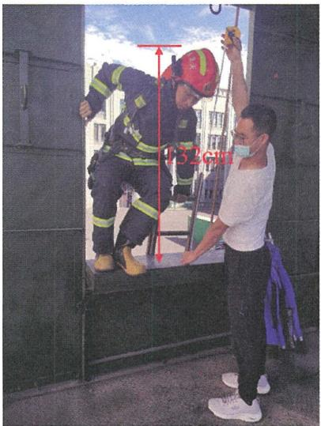

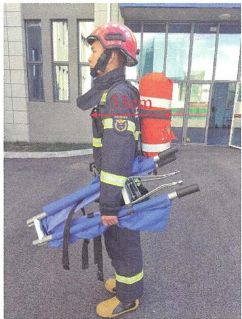

图2-1 全副武装的消防救援人员实测情景

资料来源：图片由应急管理部天津消防研究所第二研究室提供。

(2)建筑内的防火分区划分及其防火分隔方式、 每个防火分 区内的防火分隔情况， 不同使用用途的楼层有较大差异。 消防救 援口应首先在消防扑救面范围内的外墙上设置， 并且每个防火分 区在对应消防扑救面范围内的外墙上不应少千2个， 以相互作为 安全备份。 消防救援口的间距应以相邻2个消防救援口均位千登 高平台消防车或云梯消防车的安全工作幅度范围内为原则确定， 一般不大千 $2 0 \mathrm { m }$ 。 

消防救援操作面或消防扑救面是建筑中用千火灾时供消防救 

援人员进出并可以直接利用该建筑外墙上的开口实施灭火救援的 立面， 是对应消防救援场地或消防车登高操作场地一侧的建筑外 立面，包括位于救援场地范围内和位千救援场地外的同一建筑立 面。 因此，对于在建筑内部、无外墙的防火分区，可以不设置消 防救援口；对于建筑中无法设置或者未设置消防救援场地或消防 车登高操作场地一侧的外墙， 不属千消防扑救面，可以不设置消 防救援口。 

(3)消防救援口利用外门、外窗时，门、窗可开启扇的净宽 度和净高度除应分别满足消防救援口的最小尺寸要求（参见本条 【实施要点］第(1)款）外，其设置要求还需要根据建筑外墙上 外窗的设置情况， 按照以下原则确定： 

1)当建筑的每层外墙上均无外窗、外门时，该建筑应从第 一层起每层均设置消防救援口。 

2)当建筑部分楼层设置外窗、部分楼层无外窗时， 应根据 外窗的位置确定相应的消防救援口设置要求：当建筑的第一层、 第二层外墙上具有外窗或外门时，可以自建筑的第三层起每层设 置消防救援口；当第一层和第二层不设置消防救援口时，建筑的 外窗或外门的开启扇大小应满足人员逃生的要求，并要尽最满足 消防救援口的尺寸要求。 当建筑的第一层、第二层外墙上无外窗 或外门时，应自第一层起每层均设置消防救援口。 

3)当建筑的外墙上每层均设置外窗或外门时， 建筑可以自 第三层起每层设置消防救援口， 第一层和第二层可以不设置消防 救援口， 直接利用建筑既有的外窗和外门，但当第一层和第二层 不设置消防救援口时，建筑的外窗或外门的开启扇大小应满足人 员逃生的要求，并要尽量满足消防救援口的尺寸要求。 

(4)消防救援口应设置在建筑每层外墙的下部便千人员安全 出入的位置， 并应具备可以分别从建筑的内部和外部手动打开的 功能；消防救援口下沿距离楼地面要尽量小千 $1 . 2 \mathrm { m }$ , 以方便人 员安全、快速进出。 当采用固定扇的外窗或采用玻璃、围护结构 （如冷库外墙上设置消防救援口部位的保温外墙或门斗）等方式 封闭的消防救援口， 也应具备可以从建筑内部和外部手动打开或 

方便破拆的功能；当消防救援口为玻璃窗口或玻璃门时，应采用 不会产生尖锐碎片的安全玻璃；有条件的建筑，要尽量在消防救 援口处设置救援平台，以方便消防救援人员展开救援行动。 当建 筑设置外幕墙时，应同时在建筑外墙和幕墙上的对应位置设置消 防救援口，并采取保障人员安全出入的相关措施，如连接桥板等。 

根据《建筑安全玻璃管理规定》（发改运行[2003 J 2116 号）的规定，安全玻璃是指符合现行国家标准（如《建筑用安全 玻璃》GB 15763系列标准）的钢化玻璃、夹层玻璃及由钢化玻 璃或夹层玻璃组合加工而成的其他玻璃制品，如安全中空玻璃 等。 单片半钢化玻璃（热增强玻璃）、单片夹丝玻璃不属千安全 玻璃。 

(5)建筑设置的消防救援口或兼作消防救援口的外门、外 窗，均应在建筑的内部和外部相应位置采用明显的永久性标志标 示，并对需要破拆的消防救援口在设计容易破拆的位置标示破拆 点。 这些标志应具备良好的耐久性能、耐候性能、与消防救援口 的结合牢固，在受到阳光、高温和低温、雨、雪、风、腐蚀性环 境等的长期作用下不会脱落，不会产生明显褪色。 

(6)金库、生物安全实验室、散装粮仓、筒仓、特殊实验 室等有特殊要求的建筑，可以不设置消防救援口。 例如，金库 有特别的安保要求，生物安全实验室需要防止高致病性病毒外 泄，有特殊屏蔽要求或防爆要求的实验室。 此外，一些建筑中 部分特殊场所的外墙上为保证使用功能或者需要满足安全要求， 也可以不设置消防救援口。 例如，生产建筑中有特殊要求的洁 净生产区直接对应的外墙、档案馆和博物馆中重要藏品室的 外墙。 

甲类厂房大多为单层建筑，少数为多层、高层建筑。 甲类厂 房中的甲、乙类防火分区发生火灾以爆炸为主要特征，设置消防 救援口的作用不大，可以不设置消防救援口。 

甲类仓库只允许采用单层建筑，且每个防火分区或每个防火 分隔间的建筑面积较小。 尽管本条未明确甲类仓库可以不设置消 防救援口，但实际上可以直接利用库房的外门或外窗，而不需要 

设置。 同时， 消防救援人员在灭火救援时一般不需要从窗口进入 室内。 

(7)消防救援口及其标志的其他具体设置以及性能和维护要 求等， 还可参见现行国家标准《建筑设计防火规范》GB 50016和 《消防安全标志 第1部分：标志》GB 13495.l等技术标准的规定。 2.2.4 设置机械加压送风系统并靠外墙或可直通屋面的封 闭楼梯间、 防烟楼梯间， 在楼梯间的顶部或最上一层外墙 上应设置常闭式应急排烟窗， 且该应急排烟窗应具有手动 和联动开启功能。 

# 【条文要点】

本条规定了建筑室内疏散楼梯间设置应急排烟窗的基本要 求， 以便消防救援人员在灭火救援时可以根据火场情况打开应急 排烟窗排出进入并积聚在楼梯间内的烟气， 更好地保障消防救援 人员进出火场或在救援过程中休整的安全。 本条规定是疏散楼梯 间有关消防救援的功能要求。 

# 【实施要点】

(1)建筑的疏散楼梯间平时供人员竖向交通使用， 火灾时 供人员安全疏散至室外安全区域或避难层等区域， 并用作消防 救援人员进入建筑、 到达火场的主要路径， 需要保持这些楼梯 间在火灾时具有一定的防火防烟性能和防止外部溢入烟气积聚 的性能。 建筑的室内疏散楼梯间根据其防烟性能高低可以分为 敞开楼梯间、 封闭楼梯间和防烟楼梯间。 其中， 敞开楼梯间依 靠自然通风的方式防烟；封闭楼梯间主要依靠在进出楼梯间处 设置防烟门和在楼梯间内采用自然通风的方式防烟， 不满足自 然通风防烟条件的封闭楼梯间需要设置机械加压送风系统， 采 用强制送风的方式防烟， 其防烟性能高于敞开楼梯间；防烟楼 梯间采用防烟前室和在楼梯间采用强制加压送风的方式防烟， 其防烟性能高千封闭楼梯间。 

尽管设置机械加压送风系统的封闭楼梯间和防烟楼梯间在建 筑发生火灾时可以阻止烟气进入楼梯间内，但仍难以防止火场的 烟气在人员疏散，特别是在灭火救援过程中进入楼梯间内。对于 

设置机械加压送风系统并靠外墙或可以直接通向屋面的封闭楼梯 间、防烟楼梯间，在楼梯间的顶部或最上一层外墙上设置应急排 烟窗，可以在必要时打开应急排烟窗尽快排出进入其中的烟气， 避免烟气在楼梯间内积聚，这是保障消防救援人员安全的重要建 筑技术措施之一。 

(2)应急排烟窗应设置在楼梯间的顶部或最上一层的外墙上 部。 因此，无自然排烟条件并靠外墙或可以直接通向屋面的封闭 楼梯间、防烟楼梯间应设置应急排烟窗；在高层建筑核心筒内位 于避难层之间的楼梯间、地下建筑无法在地面设置排烟窗或直通 建筑内部的楼梯间等不能直通屋面或地面的疏散楼梯间，可以不 设置应急排烟窗；不靠外墙且不能直通屋面或地面的疏散楼梯间 可以不设置应急排烟窗。 

（3）应急排烟窗主要供消防救援人员在火灾发展的中后期使 用。 在建筑着火后楼梯间内的机械加压送风系统正常运行期间， 应急排烟窗应保持关闭状态，以维持楼梯间防烟所需正压或门洞 口的风速；在平时，应急排烟窗可以开启，也可以关闭，一般应 保持经常关闭的状态，以防止在楼梯间需要加压送风防烟时不能 及时关闭。 

(4)应急排烟窗应具有可靠开启、关闭的性能和便于消防 救援人员在楼梯间内现场和在消防控制室远程开启的功能。 为便 于消防救援人员根据楼梯间内的烟气聚集情况紧急开启应急排烟 窗，设置应急排烟窗的建筑应在相应的楼梯间内设置可以供消防 救援人员在现场手动开启应急排烟窗的就地开启装置。 在消防控 制室是否需要设置开启此排烟窗的消防联动控制装置，并能够利 用联动控制装置上的按钮手动控制远程开启应急排烟窗，可以视 建筑中火灾自动报警系统的设置情况和建筑规模或需要开启的应 急排烟窗的数量等具体情况确定，这些要求将由建筑防烟排烟系 统和火灾自动报警系统等专业技术标准规定。 

(5)有关应急排烟窗开启装置的设置位置、方式、标志和联 动控制等的设计、施工和维护的具体要求，可参见现行国家标准 《建筑防烟排烟系统技术标准》GB 51251和《火灾自动报警系统 

设计规范》GB 50116等技术标准的规定。 

2.2.5 除有特殊功能、 性能要求或火灾发展缓慢的场所可 不在外墙或屋顶设置应急排烟排热设施外， 下列无可开启 外窗的地上建筑或部位均应在其每层外墙和（或）屋顶上 设置应急排烟排热设施， 且该应急排烟排热设施应具有手 动、联动或依靠烟气温度等方式自动开启的功能： 

l 任一层建筑面积大于 $2 5 0 0 \mathrm { m } ^ { 2 }$ 的丙类厂房； 

2 任一层建筑面积大于 $2 5 0 0 \mathrm { m } ^ { 2 }$ 的丙类仓库； 

3 任一层建筑面积大于 $2 ~ 5 0 0 \mathrm { m } ^ { 2 }$ 的商店营业厅、 展览 厅、 会议厅、 多功能厅、 宴会厅， 以及这些建筑中长度大 于 $6 0 \mathrm { m }$ 的走道； 

4 总建筑面积大于 $1 \ 0 0 0 \mathrm { m } ^ { 2 }$ 的歌舞娱乐放映游艺场所 中的房间和走道； 

5 靠外墙或贯通至建筑屋顶的中庭。 

# ［条文要点】

本条规定了应设置应急排烟排热设施的场所及其设置要求和 基本性能， 以便消防救援人员在灭火救援时可以根据火场情况打 开应急排烟排热设施实施火场应急排烟， 更好地保障消防救援行 动和救援效果。 

# 【实施要点】

(1)本条规定应设置应急排烟排热设施的场所均需要设置 机械排烟系统， 但是机械排烟系统在排烟过程中很容易受到火 灾或烟气高温的作用而停止运行。 一般来说， 当排烟管道内的 烟气温度高于 $2 8 0 \mathrm { \% }$ 时， 相应部位的排烟防火阀将会自动关闭并 可能需要同时联动排烟风机停止运行。 此时， 室内火灾仍可能 在持续发展中， 火灾的烟气产生量还将不断增加， 室内温度持 续升高， 导致建筑结构持续受到高温作用， 烟气向建筑内其他 空间不断蔓延，极大地影响消防救援效果，威胁消防救援人员 的安全， 必须在灭火的同时尽快排出建筑内的火灾烟气和燃烧 释放的热量。 本条规定的场所应按下述要求设置应急排烟排热 设施： 

1)地上建筑中设置机械排烟系统且无外窗或外窗为不可开 启窗扇的场所，应在对应楼层的外墙上设置应急排烟排热设施。 

2)地上建筑顶层中设置机械排烟系统且无外窗或外窗为不 可开启窗扇的场所，应在这些场所对应的屋顶或外墙上设置应急 排烟排热设施。 

3)对千歌舞娱乐放映游艺场所、生产车间中的辅助用房、 仓库内的库房和辅助用房，以及其他存在房间分隔的场所，应在 每间房间的外墙或屋顶上设置应急排烟排热设施。 对于厂房中的 生产车间， 商店的营业厅， 展览建筑的展览厅，建筑中的开敞办 公区、观众厅、宴会厅等开敞空间场所，应在这些开敞区域的外 墙或屋顶上设置应急排烟排热设施。 

(2)具有特殊功能、性能要求的建筑， 主要指为满足建筑的 实际使用功能要求，不允许设置应急排烟排热设施的建筑或建筑 中的某些区域。 例如， 具有高洁净度要求的实验室、生产车间， 具有高传染性或毒性的生物安全实验室，有特殊防护要求或有高 电磁屏蔽性能要求的场所， 有特殊安保要求的金库和藏品库等。 

火灾发展缓慢的场所主要指室内可燃物的火灾主要以无焰燃 烧、阴燃为主， 或明火小且燃烧速度缓慢的场所，如煤炭储存场 所、粮食仓房等。 

(3)本条规定中的厂房和仓库主要指其中的生产车间、库 房。 例如，一座丙类生产厂房， 其中的丁、戊类生产的防火分 区， 可以不设置应急排烟排热设施。 

歌舞娱乐放映游艺场所包括歌舞厅、录像厅、夜总会、卡 拉OK厅（含具有卡拉OK功能的餐厅）、游艺厅（含电子游艺 厅）、桑拿浴室（不包括洗浴部分）、网吧等歌舞娱乐放映游艺 场所（不含剧场、电影院）， 其他类似功能场所不属千歌舞娱乐 放映游艺场所，是否需要设置应急排烟排热设施， 可以比照场所 的火灾危险性、使用人员和经营特点等以及国家相关技术标准的 要求确定，本规范不作强制要求。 

本条未规定应设置应急排烟排热设施的其他建筑或场所，可 以根据建筑的实际火灾危险性和灭火救援的实际需要以及国家相 

关技术标准确定。 

(4)为保证能够实现有效排烟排热，应急排烟排热设施应 设置在建筑每层外墙的上部或屋顶上。 当室内空间处千机械排 烟状态时， 应急排烟排热设施应处于关闭状态；在平时使用时， 应急排烟排热设施一般也应处于关闭状态。 有关应急排烟排热 设施的具体设置要求， 例如，距离楼地面的高度、 每个开口的 大小和一个区域的开口总面积、 设置间距等， 可以参见现行国 家标准《建筑防烟排烟系统技术标准》GB 51251等技术标准的 规定。 

(5)与在楼梯间上部设置的应急排烟窗一样，在建筑外墙或 屋顶上设置的应急排烟排热设施也应具有可靠的启闭性能， 并应 设置可以供消防救援人员在现场手动开启和在消防控制室远程手 动控制开启的装置。 现场的手动开启装置， 一般应能同时开启排 烟区域的全部应急排烟排热设施；在消防控制室的远程手动控制 开启装置应能远程同时手动开启排烟区域的全部应急排烟排热设 施。 当屋顶采用易熔材料作为应急排烟排热设施，并依靠烟气温 度或电加热熔化相应部位的材料排烟排热时，可以不设置就地和 远程手动开启装置，但易熔材料的燃烧性能和熔融温度应满足应 急排烟排热的要求。 

(6)有关开启装置的设置位置、 方式、 标志和联动控制等 的设计、 施工和维护的要求，应急排烟排热用易熔材料的性能和 动作温度等，可以参见现行国家标准《建筑防烟排烟系统技术标 准》GB51251等技术标准的规定。 

建筑面积的计算，参见现行国家标准《建筑工程建筑面积计 算规范》GB厅50353的规定。 本规范有关建筑面积计算的规定， 均与此相同。 

2.2.6 除城市综合管廊、 交通隧道和室内无车道且无人员 停留的机械式汽车库可不设置消防电梯外， 下列建筑均应 设置消防电梯， 且每个防火分区可供使用的消防电梯不应 少于1部： 

l 建筑高度大于 $3 3 \mathrm { m }$ 的住宅建筑； 

2 5层及以上且建筑面积大于 $3 0 0 0 \mathrm { m } ^ { 2 }$ (包括设置在其 他建筑内笫五层及以上楼层）的老年人照料设施； 

3 一类高层公共建筑， 建筑高度大于 $3 2 \mathrm { m }$ 的二类高层 公共建筑； 

4 建筑高度大于 $3 2 \mathrm { m }$ 的丙类高层厂房； 

5 建筑高度大于 $3 2 \mathrm { m }$ 的封闭或半封闭汽车库； 

6 除轨道交通工程外， 埋深大于 $1 0 \mathrm m$ 且总建筑面积大 于 $3 0 0 0 \mathrm m ^ { 2 }$ 的地下或半地下建筑（室）。 

# 【条文要点】

消防电梯是在建筑发生火灾时供消防救援人员使用的专用 电梯， 由消防救援人员控制， 是高层建筑和埋深大的地下建筑保 障消防救援的重要设施之一。 本条规定了应设置消防电梯的基本 范围和消防电梯的基本设置要求， 以减少消防救援人员的体能消 耗，尽快将消防救援人员和救援器材、 装备送达着火楼层， 将被 困人员撤离火场。 

# ［实施要点】

(1)城市综合管廊工程、 各类交通隧道工程、 地铁的地下区 间隧道和地下车站、 室内无车道且无人停留的机械式汽车库， 均 不强制要求设置消防电梯， 这些建筑可以根据实际情况和相关技 术标准的要求确定是否需要设置消防电梯。 地铁工程的地上车站 应按照相应建筑高度和建筑类别按照本条第3款的要求设置消防 电梯；国家铁路工程、 城际铁路工程等其他轨道交通工程的车站 站房， 应根据相应的建筑高度和建筑类别按照本条第3款、 第6 款的要求设置消防电梯；地上汽车库和地下汽车库应根据本条第 5款、 第6款的规定设置消防电梯。 

(2)要求设置消防电梯的老年人照料设施或设置老年人照料 设施的建筑， 本条第2款规定的建筑面积是指老年人照料设施所 在区域的建筑面积，不包括非老年人照料设施功能区域的建筑面 积。 在设置老年人照料设施的建筑中， 消防电梯可以只在老年人 照料设施所在区域设置， 但设置的消防电梯一般应能通至所在部 位的上下各层。 

(3)本条第6款规定要求设置消防电梯的地下建筑（室）、 半地下建筑（室）， 总建筑面积应为地下各层的建筑面积之和， 包括其中半地下楼层的建筑面积以及计入楼层的夹层的建筑 面积。 

(4)本条要求设置消防电梯的建筑或场所， 不强制要求建筑 中的每个防火分区均设置消防电梯， 但要保证每个防火分区均至 少有一部消防电梯可以直接到达， 而不需要经过其他防火分区。 正常情况下， 消防电梯应直接设置在每个防火分区内， 也可以设 置在相邻两个防火分区的相接处， 采用各自独立的消防电梯前 室通向对应的防火分区。 当建筑中少数防火分区确实难以直接在 防火分区内设置消防电梯时， 应采用专用的救援通道或具有防火 防烟归础的走道将这些防火分区与消防电梯前室连通。 专用的救 援通道应采用耐火极限不低于2.00h的防火隔墙和耐火极限不低 于l.OOh的楼板与其他区域分隔， 通道上不应开设除出入口门外 的其他洞口。 不同建筑如何设置消防电梯， 还需根据国家相关技 术标准的规定确定；消防电梯应具备的基本性能应符合本规范第 2.2.10条的规定， 消防电梯设置的建筑防火要求， 应符合本规范 第2.2.8条、 第2.2.9条的规定。 参见图2-2。 

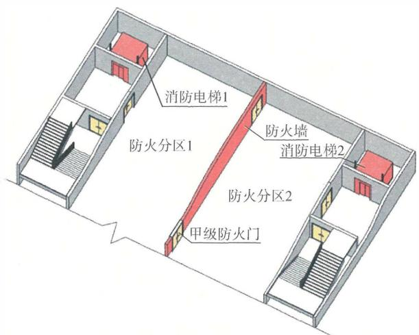

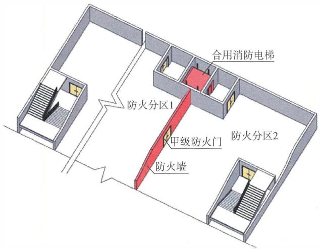

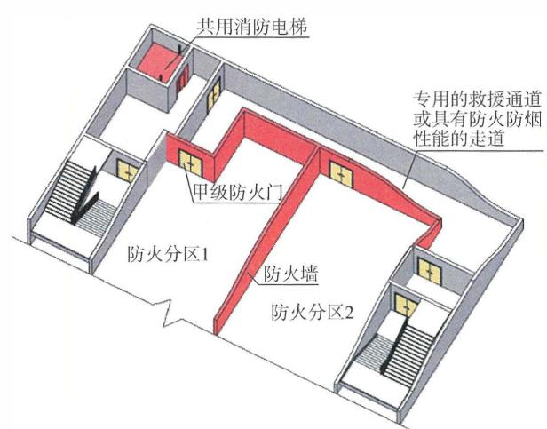

图2-2 每个防火分区的消防电梯设置示意图

(5)本规范规定的 ＂埋深“ 应按照地下建筑（室）、 半地下建 筑（室）最下一层可供人员停留的楼地面至地下建筑（室）、 半地 下建筑（室）室外出口地面的高度计算。 对于坡地建筑， 情况比 较复杂， 通常可以根据消防车道和消防救援场地的设置情况、 地 下楼层的实际埋深、 相应区域的总建筑面积确定。 参见图2—3。 

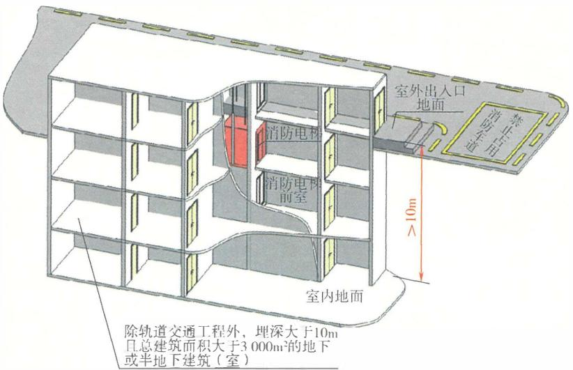

图 2-3 设置消防电梯的地下建筑（室）埋深计算起止点示意图

# ［示例2-1】消防电梯设置示例 ＠

一座建筑高度为 $3 3 \mathrm { m }$ 的住宅建筑， 设置2层地下室（局部 埋深 $1 1 \mathrm m$ ), 其中地下一层为半地下商业、 小区配套管理用房及 地下车库；地下二层平时为地下车库， 战时为人员掩蔽所；建 筑东西向为长边方向， 在建筑的北侧设置消防车道和消防救援 场地。 地下室北侧沿街部分平均埋深 $5 \mathrm { m }$ ; 地下二层划分2个防 火分区， 每个防火分区均在北侧设置2个安全出口， 并在地下一 层直通室外；消防救援人员可以经北侧的安全出口进出地下一 层和地下二层。 对千该建筑地下一层具有直通室外的安全出口并 可以供消防救援人员进出地下室的情形， 地下二层相当千地下一 层。 因此， 该建筑地下二层的实际埋深为平均 $5 \mathrm { m }$ , 可以不按照本 条规定的条件设置消防电梯。但是， 如果住宅部分设置了消防电 梯， 则这些消防电梯应自上而下通至地下各层的对应位置。 参见 图2-4。 

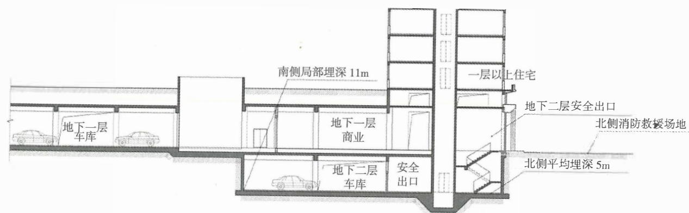

（a）剖面简图

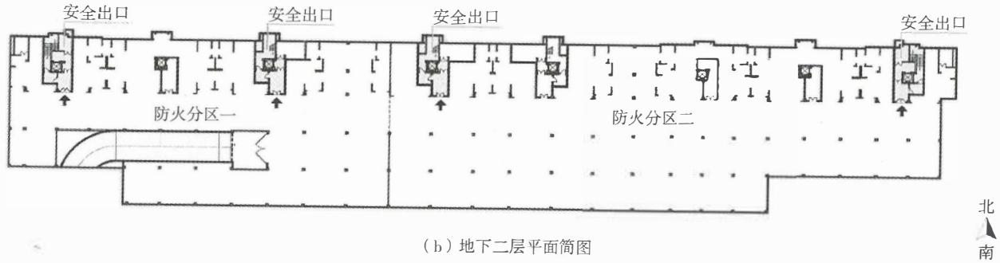

市政道路 

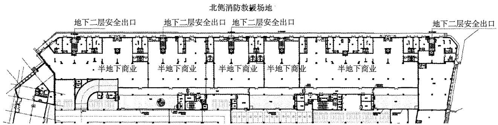

(C)地下一层平面简图

图2-4 坡地建筑地下楼层埋深确定示意图

2.2.7 埋深大于 $1 5 \mathrm { m }$ 的地铁车站公共区应设置消防专用 通道。 

# ［条文要点］

本条规定了地铁地下车站的公共区应设置消防专用通道的条 件，以保障消防救援人员安全进出火场，并方便开展救援，避免 与疏散人群冲突。地铁车站公共区包括地铁地下车站的站台公共 区和站厅公共区。 

# ［实施要点］

(1)根据本规范第2.2.6条的规定，地铁地下车站可以不设 置消防电梯。 这主要考虑到地铁工程若设置消防电梯，消防电梯 有时难以出地面或者难以在地面设置电梯机房，因而本规范没有 强制要求设置消防电梯。但是，地铁车站的设备区和公共区往往 建筑面积大，且设备区的火灾因素也较多，公共区需要疏散的人 数也较多，直接通往地面的出口少，埋深较大且有条件的地下车 站仍应考虑设置消防电梯。 对千未设置消防电梯的地铁地下车站， 当车站公共区的埋深大千 $1 5 \mathrm { m }$ 时，应设置供消防救援人员使用的 消防专用通道，使消防救援人员可以经此通道进入车站的公共区。 

(2)消防专用通道是在火灾时专门用千消防救援人员从地 面进入地铁车站的站厅、站台、区间等区域开展灭火救援的通 道。本规范规定未限制消防专用通道的具体形式，消防专用通道 可以采用坡道、 楼梯间和消防电梯，但多采用楼梯间的形式。 消 防专用通道应具备相应的防火、 防烟性能。根据本规范第7.1.10 条的规定，当地下楼层的埋深不大千 $1 0 \mathrm { m }$ 或层数为1层或2层 时，可以采用封闭楼梯间；当地下楼层的埋深大于 $1 0 \mathrm { m }$ 或层数 为3层及以上时，应为防烟楼梯间。 因此，为埋深大千 $1 5 \mathrm { m }$ 的 地铁车站公共区设置的消防专用通道采用楼梯间时，应为防烟楼 梯间，有条件的应同时设置消防电梯。 消防专用通道可以设置在 设备区，从地面经设备区进入公共区，也可以从地面直接通至车 站公共区，并要尽量能够直接进入车站的站厅和站台公共区。 

(3)本规范未规定消防专用通道的具体设置要求。 有关地 铁车站消防专用通道的出入口、 防火分隔与防烟、 内部装修、 指 

示标志和应急照明等的设置要求， 可以参见现行国家标准《地铁 设计防火标准》GB 51298的规定；有关专用救援楼梯间的防火、 防烟措施及要求， 可以参见现行国家标准《建筑设计防火规范》 GB 50016和《建筑防烟排烟系统技术标准》GB 51251有关防烟 楼梯间的规定。 

2.2.8 除仓库连廊、 冷库穿堂或筒仓工作塔内的消防电梯 可不设置前室外， 其他建筑内的消防电梯均应设置前室。 消防电梯的前室应符合下列规定： 

l 前室在首层应直通室外或经专用通道通向室外， 该 通道与相邻区域之间应采取防火分隔措施。 

2 前室的使用面积不应小于 $6 . 0 \mathrm { m } ^ { 2 }$ , 合用前室的使用 面积应符合本规范笫7.1.8条的规定；前室的短边不应小于 2.4m。 

3 前室或合用前室应采用防火门和耐火极限不低于 2.00h的防火隔墙与其他部位分隔。 除兼作消防电梯的货梯 前室无法设置防火门的开口可采用防火卷帘分隔外， 不应 采用防火卷帘或防火玻璃墙等方式替代防火隔墙。 

# ［条文要点］

根据国家标准《消防员电梯制造与安装安全规范》GB!T 26465— 2021, 消防员电梯为设置在建筑的耐火封闭结构内， 具 有前室和备用电源， 在正常情况下供普通乘客使用， 当建筑发生 火灾时其附加的保护、控制和信号等功能可专供消防救援人员使 用的电梯， 能将消防救援人员及其设备送至指定楼层。 本规范规 定的消防电梯是该标准定义的消防员电梯。 简而言之， 消防电梯 是在建筑发生火灾时专供消防救援人员使用， 并由消防救援人员 操作和控制的电梯。 本条规定了消防电梯前室的基本设置要求， 以保障在建筑发生火灾时消防救援人员的安全， 同时满足消防救 援的使用要求。 

# 【实施要点】

(1)消防电梯在建筑中受其使用要求限制， 电梯井在竖向 不能分隔。 尽管电梯层门具有一定的防火性能， 但仍难以有效阻 

止火灾的烟气进入电梯井道并经电梯井道蔓延至其他各楼层，在 建筑发生火灾后可能影响消防电梯的安全使用。在各类地上建 筑和地下建筑中设置的消防电梯均应在消防电梯前设置防烟前 室，以确保消防救援人员可以在灭火救援过程中安全使用消防 电梯。 

(2)消防电梯前室要尽量靠建筑的外墙设置，使电梯前室的 门可以直接向室外（包括下沉广场）开启，不需要经过其他空间 或走道，以便消防救援人员能从建筑首层或设置消防救援场地或 消防车登高操作场地的地面的出入口直接进入消防电梯前室；不 靠外墙设置的前室可以经过一定长度的专用走道或扩大的前室直 通室外。该专用通道或扩大的前室与相邻区域之间应采取防火分 隔措施，如采用耐火极限不低于 $2 . 0 0 \mathrm { { h } }$ 的防火隔墙、乙级防火门 与相邻区域分隔，专用通道的长度一般不应大于 $3 0 \mathrm { m }$ 。有关此专 用通道的相关防火要求和长度控制，可以参见现行国家标准《建 筑设计防火规范》GB 50016等技术标准的规定。 

(3)消防电梯的前室要尽量独立设置，也可以与防烟楼梯 间的前室合用。前室的面积既要考虑满足消防救援人员休整、存 放装备的需要，也要考虑救助建筑内被困人员和建筑内未能及时 撤离的人员在火灾时安全疏散与避难的要求。因此，消防电梯前 室主要是消防救援的前沿阵地，有时需要发挥避难间的作用，前 室的面积应尽可能增大。通常，消防电梯前室的使用面积（即净 面积）不应小于 $6 \mathrm m ^ { 2 }$ ; 当合用时，对千公共建筑、高层厂房、高 层仓库、平时使用的人民防空工程及其他地下工程，不应小于 $1 0 . 0 \mathrm { m } ^ { 2 }$ ; 对于住宅建筑，不应小于 $6 . 0 \mathrm { m } ^ { 2 }$ 。此外，消防电梯前室 在正对电梯部位的短边长度不应小千 $2 . 4 \mathrm { m }$ , 以方便救援单架或 担架床进出消防电梯。 

（4）消防电梯的前室应具有足够的防烟和防火性能，在建 筑火灾延续过程中，能阻止烟气进入前室，能有效阻挡前室外的 火势和高温的作用。前室的防烟措施及要求，可以参见现行国家 标准《建筑防烟排烟系统技术标准》GB 51251的规定。前室与 相邻走道、房间等其他区域之间应采用耐火极限不低千 $2 . 0 0 \mathrm { { h } }$ 的 

防火隔墙分隔， 从建筑内进入前室的门应采用耐火性能不低于 乙级的防火门， 对千埋深大或建筑高度高的建筑（如埋深大于 $1 5 \mathrm { m }$ 的大型地下公共场所、建筑高度大千 $1 0 0 \mathrm { m }$ 的高层建筑）， 此门应为甲级防火门。 前室的防火隔墙不应采用防火卷帘、防 火分隔水幕、防火玻璃墙等替代， 以确保该部位防火分隔的可 靠性。 

消防电梯前室的其他防火分隔、防火封堵的措施和要求，除 本规范的有关规定外， 可以参见现行国家标准《建筑设计防火规 范》GB 50016和《建筑防火封堵应用技术标准》GB叮51410等 技术标准的规定。 

2.2.9 消防电梯井和机房应采用耐火极限不低于2.00h且 无开口的防火隔墙与相邻井道、 机房及其他房间分隔。 消 防电梯的井底应设置排水设施， 排水井的容量不应小于 2m3, 排水泵的排水量不应小于IOUs。 

# ［条文要点】

本条规定了保证消防电梯在消防救援过程中能够正常使用的 关键技术措施。 

# ［实施要点】

(1)消防电梯是在建筑发生火灾时供消防救援人员使用的重 要设施， 必须保证其防火安全和在救援过程中能够正常使用。 消 防电梯的井道应独立设置， 与其他消防电梯的井道、 非消防电梯 的井道、 管道竖井和线缆竖井之间应进行防火分隔， 消防电梯的 机房也应与其他设备用房分隔， 在相互分隔的井壁、防火隔墙上 均不应设置相互连通的开口。除本条规定的耐火极限外， 有关防 火分隔的具体要求和其他防火要求还应符合本规范第6.3节的规 定， 并参见现行国家标准《建筑设计防火规范》GB 50016等标 准的规定。 对于一些特殊的建筑， 如建筑高度大千 $2 5 0 \mathrm { m }$ 的高层 建筑、火灾荷载大的仓储建筑等， 还需要根据建筑防火的需要和 消防电梯的设置位置适当提高竖井防火和竖井防火分隔的可靠性 能， 比如提高井壁和防火隔墙的耐火极限。 

(2)消防电梯的井底应设置蓄水和排水设施， 以防止电梯被 

淹失去运行性能， 排水泵的排水能力应按照不小千2支室内消火 栓的水枪出水流量（即不小千lOUs)确定。 排水泵应采用专用 泵， 并采用消防电源保障供电。 

# 2.2.10 消防电梯应符合下列规定：

1应能在所服务区域每层停靠； 

2 电梯的载重量不应小于 $8 0 0 \mathrm { k g }$ 

3 电梯的动力与控制线缆与控制面板的连接处、 控制 面板的外壳防水性能等级不应低于IPX5; 

4 在消防电梯的首层入口处， 应设置明显的标识和供 消防救援人员专用的操作按钮； 

5 电梯轿厢内部装修材料的燃烧性能应为A级； 

6 电梯轿厢内部应设置专用消防对讲电话和视频监控 系统的终端设备。 

# 【条文要点】

本条规定了消防电梯的基本性能要求， 以保证消防电梯本身 具有足够的防火性能、防水性能， 并满足消防救援人员应急操作 和开展救援的要求。 

# 【实施要点】

消防电梯不仅在建筑发生火灾后要供消防救援人员使用， 要 满足应急救援的要求， 而且电梯自身应具有良好的防火性能， 电 梯内部、向电梯供电的线路和控制线路均应具有良好的防水性 能， 在救援过程中产生的消防废水进入电梯内或淋湿线路、线路 板和电气设备后， 电气线路和电梯制作材料等可以因具备可靠的 防水、防火性能而避免产生故障， 自身不会引发火灾， 从而保证 其正常使用。 

消防电梯在建筑发生火灾后为便千消防救援人员使用和接 管， 应首先降至建筑的首层或升至消防救援人员方便抵达的地 面，并由到场消防救援人员控制其去往的楼层。由于着火楼层是 随机的， 因此消防电梯应能通过控制停靠在所有可能发生火灾和 人员需要救助的楼层、设置避难间的楼层以及避难层。 在消防电 梯的首层入口处（对千地下建筑， 有时为室外地面或地下一层下 

沉广场的电梯间）应设置供消防救援人员专用的操作按钮， 在每 层前室内的消防电梯入口处均应设置明显的标识， 以便在火场的 救援人员和平时的使用人员识别。此外， 在消防电梯轿厢内应设 置视频监控系统， 并且应将视频信号传至消防控制室， 以便现场 救援人员在必要时可以直接与消防控制室通话联系。 

消防电梯应至少能承载一个消防救援战斗班齐装满员的重 量， 消防电梯轿厢的尺寸、电气设备的防水保护及其他性能应 符合现行国家标准《消防员电梯制造与安装安全规范》GBfT 26465的规定。 

2.2.11建筑高度大于 $2 5 0 \mathrm { m }$ 的工业与民用建筑， 应在屋顶 设置直升机停机坪。 

# ［条文要点］

本条规定了建筑高度大于 $2 5 0 \mathrm { m }$ 的工业与民用建筑有关直升 机救援设施的功能要求。 

# ［实施要点］

建筑高度大千 $2 5 0 \mathrm { m }$ 的工业与民用建筑， 包括生产建筑、生 产与仓库组合的建筑、 公共建筑和居住建筑， 但主要为公共建 筑。 这些建筑无论屋顶采用什么形式均要求在屋顶设置直升机停 机坪， 以便救助被困人员， 向建筑快速投放救援人员、装备或器 材等。 直升机停机坪应尽量直接设置在屋面上， 受条件限制时， 也可以在屋顶架空设置成高架的停机坪。 

2.2.12 屋顶直升机停机坪的尺寸和面积应满足直升机安全 起降和救助的要求， 并应符合下列规定： 

1 停机坪与屋面上突出物的最近水平距离不应小于Sm; 

2 建筑通向停机坪的出口不应少于2个； 

3 停机坪四周应设置航空障碍灯和应急照明装置； 

4 停机坪附近应设置消火栓。 

# 【条文要点】

本条规定了建筑屋顶直升机停机坪的基本性能要求和关 键设置要求， 以保证直升机安全起降和停靠， 并安全展开救援 行动。 

# 【实施要点］

在建筑的屋顶上通常会设置电梯机房、 消防水箱或水池、 天 线等设施。 设置在建筑屋顶上的直升机停机坪应避开这些凸出 建筑屋顶的设施，停机坪边缘水平距离这些凸出物的最近边缘均 不应小千 $5 \mathrm { m }$ , 以保证直升机的飞行安全。 建筑通向停机坪的出 口主要指从建筑下部楼层到达屋面的出口，要求此出口不少千2 个，是要保证从建筑内至屋顶的出口不会因其中一个不能安全使 用导致无其他出口可供使用，这也是安全中的冗余设置要求。 当 在屋顶上设置高架直升机停机坪时，还应保证从屋面至停机坪的 楼梯不少于2部。 

停机坪上设置航空障碍灯和应急照明装置是飞行安全和保障 救援的基本要求。 有关航空障碍灯的具体设置要求及其他保障直 升机飞行安全的设施的设置要求，可以参见现行民用航空行业标 准《民用直升机场飞行场地技术标准》MH5013的规定。建筑通 向停机坪的出口宽度等要求，可以参见现行国家标准《建筑设计 防火规范》GB50016的规定，通常不应小千疏散门的最小净宽 度，即不应小于 $0 . 8 0 \mathrm { m }$ 。 

在停机坪上应设置消火栓、 消防软管卷盘和灭火器，以便快 速处置屋顶发生的意外火情。 一般来说，还应配备雾化水枪用千 驱散建筑火灾蔓延上来的烟雾等。 此消火栓应直接接入建筑的室 内消火栓系统，以保证水压和水量。 有关防冻等要求，可以参见现 行国家标准《消防给水及消火栓系统技术规范》GB50974的规定。 

2.2.13 供直升机救助使用的设施应避免火灾或高温烟气的 直接作用， 其结构承载力、 设备与结构的连接应满足设计 允许人数停留和该地区最大风速作用的要求。 

# 【条文要点】

本条规定了直升机救助设施设置的基本性能要求， 以保障救 助平台在建筑发生火灾时能够安全使用，平时使用期间具有足够 的耐久性能和结构安全性能。 

# ［实施要点］

需要在屋顶设置直升机停机坪的建筑，当屋顶无法满足设置 

直升机停机坪的要求时， 应设置直升机救助平台等设施， 以满足 应急救援的要求。 除本规范第2.2.12条规定外的其他建筑，当要 求在屋顶设置直升机停机坪， 但受条件限制难以设置时， 需要设 置直升机救助平台。有关需要设置屋顶直升机停机坪的其他建筑 可以参见现行国家标准《建筑设计防火规范》GB 50016等技术标 准的规定。直升机救援平台等设施一般为定型的成套产品， 多为支 承在屋顶上或凸出建筑外墙的钢结构平台。由千设置直升机救援设 施的建筑多为建筑高度大千 $1 0 0 \mathrm { m }$ 的超高层建筑，平时屋顶的风速 大，风对救助设施的作用力大。 因此，救助设施的结构以及救助设 施与建筑的固定， 不仅需要满足救助设施自身荷载、救援人员和被 救助人员的荷载需要， 而且需要考虑环境风力的作用， 确保救助设 施能够承受相应的荷载， 连接与固定能够抵抗相应的作用力。 

对千可能凸出建筑外墙的直升机救援设施， 要根据其下部的 建筑立面开口和火灾时可能受到的火焰或高温作用情况， 采用相 应的防火保护措施， 避免火灾的高温烟气或火势直接作用。一般 来说，在救助设施的下部一定范围内不应设置开口， 或开口需采 用甲级防火门窗等保护。 

有关对建筑通至屋面的出口、 航空障碍灯、 应急照明灯等的 要求， 见本规范第2.2.12条的规定及其［实施要点】。 

2.2.14 消防通信指挥系统应具有下列基本功能： 

l 责任辖区和跨区域灭火救援调度指挥； 

2 火场及其他灾害事故现场指挥通信； 

3 通信指挥信息管理； 

4 集中接收和处理责任辖区火灾、 以抢救人员生命为 主的危险化学品泄泥、 道路交通 、 地震及其次生灾害、 建筑砃塌、 重大安全生产事故、 空难、 爆炸及恐怖事件和 群众遇险事件等灾害事故报警。 

# （条文要点］

消防通信指挥系统是全国各级消防救援队伍实施减少火灾危 害，应急抢险救援， 保护人身、 财产安全， 维护公共安全的业务 信息系统。本条规定了该系统应具有的基本功能， 主要包括警情 

接收、调度指挥、现场通信及相关信息管理等功能。 

# 【实施要点】

(1)消防通信指挥系统应建设指挥子系统， 以实现责任辖 区和跨区域灭火救援调度指挥的功能。指挥子系统应具有战备值 守、作战指挥、辅助决策、跨区域调度、态势标绘、文件套打等 功能， 同时应配备移动指挥终端， 实现现场作战指挥功能。 

(2)消防通信指挥系统应建设无线通信子系统， 以实现火场 及其他灾害事故现场指挥通信的功能。无线通信子系统应是具备 独立运行管理的消防专用无线通信网， 或加入当地政府其他部门 集群无线通信系统， 应具有跨区域联合作战指挥通信的能力， 应 能保障消防辖区覆盖通信、现场指挥通信、灭火救援战斗通信， 在发生自然灾害或突发技术故障造成大范围通信中断时， 可以通 过卫星电话、北斗有源终端、短波电台等设备， 提供应急通信保 障手段， 能够利用自组网、中继等无线通信技术实现特定场所下 的语音、图像及数据的传输， 能够基千移动公众通信网络实现语 音、图像及数据的传输。 消防专用无线通信网的信道规划、设备 的工作环境及通信天线杆塔的架设， 应符合国家及当地无线电管 理部门等的规定。 

(3)消防通信指挥系统应建设数据管理子系统， 以实现通信 指挥信息管理的功能。数据管理子系统应能管理的信息主要包括： 消防实力、灾情及现场动态、值班、消防水源（消火栓、消防水 池、消防码头、天然水源）、消防安全重点单位、危险化学品、 应急物资、灭火救援有关单位、专家信息、社会救援力量、天气、 地震、地质、台风、水文等以及其他政府相关部门的数据信息等， 应能通过录入、导入或共享交换等不同方式获取上述数据， 应具 有修改、存储、处理、查询、统计、共享、发布、展示等数据管 理功能。 系统的数据标准化应符合国家现行有关标准的规定。 

(4)消防通信指挥系统应建设接处警子系统， 以实现集中 接收和处理责任辖区火灾、以抢救人员生命为主的危险化学品泄 漏、道路交通事故、地震及其次生灾害、建筑坰塌、重大安全生 产事故、空难、爆炸及恐怖事件和群众遇险事件等灾害事故报警 

的功能。 接处警子系统应具有接收报警、警情辨识、编制出动方 案、下达出动指令等功能。 同时， 接处警子系统还应能基千语音 或信息系统对接方式向应急、公安、交通、住建、供水、供电、 供气、医疗救护、水利、 气象、 环保及市政管理等灭火救援有关 单位、联动单位和相关社会专业救援力量发送警情通报， 以及实 现不同警情受理终端间警情转移管理等功能。 

(5)消防通信指挥系统及各子系统的构成功能和设备性能 等， 应符合现行国家标准《消防通信指挥系统设计规范》GB 50313等技术标准的规定。 

2.2.15 消防通信指挥系统的主要性能应符合下列规定： 

l 应采用北京时间计时， 计时最小量度为秒， 系统内 保持时钟同步； 

2 应能同时受理2起以上火灾、 以抢救人员生命为主 的危险化学品泄沥、 道路交通事故、 地震及其次生灾害、 建筑浔塌、 重大安全生产事故、 空难、 爆炸及恐怖事件和 群众遇险事件等灾害事故报警； 

3 应能同时对2起以上火灾、 以抢救人员生命为主的 危险化学品泄涡、 道路交通事故、 地震及其次生灾害、 建 筑拼塌、 重大安全生产事故、 空难、 爆炸及恐怖事件和群 众遇险事件等灾害事故进行灭火救援调度指挥； 

4 城市消防通信指挥系统从接警到消防站收到笫一出 动指令的时间不应大于45s。 

# 【条文要点】

为确保消防通信指挥系统高效运行， 满足实际接警和指挥的业 务需求， 本条规定了建成的消防通信指挥系统应具备的基本性能。 

# 【实施要点】

(1)消防通信指挥系统需建有时钟同步机制， 确保上下级或 同级系统内各子系统时间一致。 考虑到我国的地域时差情况， 为 与国家授时基准一致， 系统应采用北京时间作为基准时间计时， 计时最小量度为秒。 系统内时间必须准确且一致， 该时间还可作 为事故调查及认证的依据之一。 

(2)消防通信指挥系统应具有同时受理2起以上警情的性 能， 软件能力及受理终端硬件设备数量应与此性能要求匹配， 且 软件能力要超过硬件终端数量。 能够同时受理2起警情是系统的 基本接警能力要求， 消防通信指挥系统的建设应根据各地实际应 急救援警情， 在本条规定基础上确定合理的系统同时受理报警的 能力标准， 并适当留有余量， 以满足节假日等高峰时段的警情受 理需求。 例如， 在特大城市， 消防通信指挥系统要具备能够同时 受理4起以上警情的能力。 

(3)消防通信指挥系统应具有支持同时指挥2起以上警情的 性能， 软件能力及指挥终端硬件设备数量应与此性能要求匹配， 且软件能力要超过硬件终端数量。 能够同时指挥2起警情是系统 的基本处警能力要求， 消防通信指挥系统的建设应根据各地实际 应急救援情况， 在本条规定基础上确定合理的系统同时处警的能 力标准， 以满足动态扩展需求。 

(4)消防通信指挥系统从接警到消防救援站接到第一出动指 令不应大千45s, 这是城市消防通信指挥系统完成火警受理流程 的时间。 发生火灾及其他灾害事故时， 城市消防通信指挥中心应 具有快速反应能力， 能够在第一时间调派消防力量到灾害现场处 置。 这是接处警中可以最大限度减少人身、 财产等损失和危害的 关键环节。 

2.2.16 消防通信指挥系统的运行安全应符合下列规定： 

l 重要设备或重要设备的核心部件应有备份； 

2 指挥通信网络应相对独立、 常年畅通； 

3 系统软件不能正常运行时， 应能保证电话接警和调 度指挥畅通； 

4 火警电话呼入线路或设备出现故障时， 应能切换到 火警应急接警电话线路或设备接警。 

# ［条文要点］

本条是保障消防通信指挥系统安全、 稳定、 可靠运行和发挥 基本功能的关键措施要求， 以避免延误火灾扑救及其他灾害事故 的应急抢险救援时机， 更好地降低人身和财产的损失， 减少火灾 

对环境的影响。 

# ［实施要点】

(1)消防通信指挥系统建设的程控交换机应采用热备工作 方式，确保报警电话稳定、可靠、及时地被接入。 重要的网络交 换及安全设备的核心板卡和配件应设置备份，以备在一旦发生故 障时能够及时更换，缩短影响时间，确保整个系统稳定运行。 重 要设备的类型可以根据消防通信指挥系统的构成和各子系统的功 能，以确保消防通信指挥系统基本功能为原则确定。 有关备份设 备或部件的类型和数量，可以参见现行国家标准《消防通信指挥 系统设计规范》GB 50313的规定。 

(2)消防通信指挥系统建设需接入消防指挥调度网、政务外 网和互联网，要满足不同数据安全、稳定传输和交换的需求。 消 防通信指挥系统的主体部署在消防指挥调度网，并从政务外网和 互联网获取相关资源信息，需要根据有关安全要求建立跨网数据 交换安全机制，确保各网络相对独立，互不影响。 不同类型网络 的带宽应满足语音、数据和图像的多业务应用数据传输需求，建 立统一的安全策略、服务质量策略、流量管理策略和系统管理策 略，各网络应具有良好的扩展性能，能支持未来扩充需求。 

(3)消防通信指挥系统中各子系统建设采用松耦合的方式， 各子系统既相互关联又彼此独立，确保其中一方发生故障后对其 他关联的子系统的影响最小。 特别是在有线电话通信子系统中， 应保持最大程度的独立，即使其他软件系统都无法运行，也要确 保报警电话及时接收，指挥调度畅通。在消防通信指挥系统中， 报警电话数字中继线路应采用双路由方式与本地城市公用电话网 相连，应有报警应急接警电话线路，采用双路由方式与本地城市 公用电话网相连。 当中继线路或所连接设备出现故障时，报警电 话呼入应能切换到该报警应急接警电话线路，应能以手工或自动 方式测试接警电话线路及设备，出现故障应能及时发出警报，自 动方式测试每日不应少于2次；应具有连通上、下级消防指挥中 心的语音通信专用线路。 接警调度语音交换及语音话务管理功能 应能满足实际业务需要。 

# 3 建筑总平面布局

# 3.1 一 般规定

# 3.1.1 建筑的总平面布局应符合减小火灾危害、 方便消防 救援的要求。

# ［条文要点】

建筑的选址应满足城市规划和消防安全的要求， 本条规定是 针对建筑在选址后的总平面布局， 是建筑总平面布局的目标要求。 

# ［实施要点］

(1)建筑的总平面布局应根据建筑的使用性质和使用功能、 实际用途、 拟建高度和规模确定拟建建筑与周围建筑的相对位置 关系和防火间距， 布置消防车道、 消防救援场地或消防车登高操 作场地， 并确定相关技术要求， 确定消防车道与建筑基地内部道 路、 外部道路的连接方式和技术要求， 根据消防水源的形式确定 消防车取水的方式与保障要求。 

(2)建筑总平面布局要通过合理处理建筑之间的关系， 实现 减少建筑火灾的危害， 并方便消防救援的目标。 这也是判断建筑 的总平面布局是否合理的标准。 建筑的火灾危害主要为： 

1)拟建建筑自身发生火灾时通过热辐射、 飞火、延烧等引 燃相邻建筑， 甚至导致相邻可燃气体或可燃液体储罐等发生爆 炸、 相邻建筑 “火烧连营” 等严重后果。 

2)相邻建筑发生火灾时通过热辐射、 飞火、 延烧等引燃拟 建建筑。 

3)拟建建筑发生火灾产生的消防废水、 流散的有毒有害液 体和泄漏的有毒有害气体等物质对邻近水体、 土壤及周围环境产 生危害。 

4)拟建建筑发生火灾导致周围交通秩序混乱， 生产、 经营 和居民生活受到较大影响等。 

(3)建筑总平面布局中方便消防救援的目标， 应主要考虑： 

1)建筑基地的道路方便消防车安全、 快速通行、 会车、 环 形或快速回车， 与外部道路连接通畅。 

2)建筑周围具有满足消防车停靠、 回转、 展开安全作业的 救援场地和空间。 

3)建筑周围具有方便消防车安全取水和向建筑快捷供水的 条件。 

4)救援场地或消防车登高操作场地的布置能够较好地避免 区域环境风向对灭火救援的影响。 

3.1.2 工业与民用建筑应根据建筑使用性质、 建筑高度、 耐火等级及火灾危险性等合理确定防火间距， 建筑之间的 防火间距应保证任意一侧建筑外墙受到的相邻建筑火灾辐 射强度均低于其临界引燃辐射强度。 

# ［条文要点】

防火间距是防止着火建筑在一定时间内引燃相邻建筑， 便 于消防扑救的间隔距离。 建筑之间的防火间距是一个空间间隔。 火灾的蔓延方式有飞火、 延烧、 热传导、 热辐射等。 当可燃物 呈连续分布时， 延烧、 飞火、 热传导是火灾在可燃物之间蔓延 的主要途径；当可燃物呈离散状态分布时， 热辐射是火灾在室 内及建筑物间蔓延的主要途径。 本规范和现行国家相关技术标 准对防火间距的规定值主要基千防止火灾的热辐射作用引燃相 邻建筑。 本条根据影响建筑防火间距的主要因素规定了确定建 筑防火间距的基本原则， 并规定了判断建筑之间的防火间距是 否满足防火要求的主要性能标准。 不同建筑之间的防火间距可 以依据本条的规定确定。 

# 【实施要点】

工业与民用建筑的使用性质是指建筑可以用作的用途所 体现的属性，例如，建筑是生产厂房、仓库等工业建筑，还是住 宅、 公共建筑等民用建筑。 不同使用性质的建筑的火灾危险性不 同， 例如， 工业建筑的火灾危险性与住宅建筑有很大差异。 同一 种使用性质中不同使用功能的建筑的火灾危险性也有较大差异， 

例如，甲类生产厂房与丁、戊类生产厂房的火灾危险性差别很 大；住宅建筑与商店建筑的火灾危险性差别也不小。 同一种使用 功能、不同耐火等级或不同建筑高度的建筑防止相邻建筑火灾蔓 延的能力也不一样，例如，四级耐火等级的办公建筑就比一、二 级耐火等级的办公建筑防止相邻建筑火灾引燃的能力低很多。 不 同建筑高度的建筑对消防救援空间的要求也有所差别，例如，一 座建筑高度为 $1 8 \mathrm m$ 的民用建筑可以利用救援高度为 $3 2 \mathrm { m }$ 的消防 车，并可以直接利用消防车道展开救援；而一座建筑高度为 $1 5 0 \mathrm { m }$ 的民用建筑就需要利用救援高度大于 $5 0 \mathrm m$ 的消防车和专用的消防 车登高操作场地实施救援，消防车展开作业所需空间要较多层建 筑大，一般要求建筑之间的间距不应小于 $1 3 \mathrm { m }$ 。 由此可以看出， 不同建筑高度的两座建筑对消防车所需救援空间和建筑之间的间 距要求有明显区别。 因此，建筑的防火间距不仅要满足防止火灾 在相邻建筑之间蔓延，而且需要满足消防救援的要求，与建筑的 使用性质、火灾危险性、建筑高度、耐火等级等关系密切。 

(2)建筑之间的防火间距大小，少数建筑需要考虑飞火的 作用，但主要取决千相邻建筑在火灾时可能发射的辐射热流、火 灾持续时间、非着火建筑可以接受到的辐射热流以及辐射热的作 用时间。 建筑外墙的耐火性能、外墙构筑材料和外墙装饰材料的 燃烧性能因建筑的耐火等级和建筑需求不同而不同，一、二级耐 火等级建筑的外墙一般要求采用不燃材料，三、四级耐火等级和 木结构建筑允许采用难燃或可燃材料。 因此，对千一、二级耐火 等级的建筑，主要为外窗、阳台等部位存在被辐射热作用引燃的 可能；对千三、四级耐火等级的建筑和木结构建筑，则建筑的外 墙、外窗、阳台、屋檐等部位均存在被辐射热作用引燃的可能。 

建筑外墙及其开口处可能被引燃的物体主要为可燃固体。 可 燃固体受到辐射热作用后将发生热解产生可燃气体和碳等热解产 物，产生的可燃气体与空气混合形成可燃性混合气体，接近化学 计最的混合气体在强烈的辐射热作用下达到自燃温度后发生自燃 并进而在建筑室内或外立面形成持续燃烧和蔓延的火灾。 不同可 燃固体材料被引燃的辐射热流不同，一般采用热流密度或热通量 

表示。引燃薄型材料的最低辐射热流密度约为 $1 0 \mathrm { k W / m } ^ { 2 }$ , 厚型材 料约为 $2 0 \mathrm { k W / m } ^ { 2 }$ 。普通太阳光辐射到地球表面的热流密度一般不 会大千 $1 \mathrm { k W / m } ^ { 2 }$ , 正常情况不会引发火灾，而大部分火灾燃烧发 展后产生的热流密度可达 $1 0 { \sim } 1 0 0 \mathrm { k W / m } ^ { 2 }$ 

本条规定建筑之间的防火间距应满足相邻任意一侧建筑发生 火灾， 另一侧建筑外墙或开口处接受到的火灾辐射热强度均不会 高千其最低引燃值的要求。这一规定，可以方便在实际工作中针 对建筑的不同情形确定合理的防火间距， 或者验证既有防火间距 是否满足防火要求。本条规定的辐射热强度在实际中是采用辐射 热流密度或辐射热通量表示。 

(3)建筑之间的防火间距除本条规定的性能要求外，在建筑 之间需用作灭火救援场地的区域，该间距还应满足消防车展开与 灭火救援的要求。各类建筑之间的防火间距，除本规范有明确规 定外， 均可以根据现行国家相关技术标准的要求确定。当建筑之 间的防火间距不符合现行国家相关技术标准的规定时，可以将本 条规定的性能要求作为判定其是否满足防火要求的准则。 

木结构建筑和其他类型结构工业与民用建筑的耐火等级划 分，可以按照现行国家标准《建筑设计防火规范》GB 50016 等 技术标准的规定确定。 

# （示例3-1】防火间距与辐射热流密度的关系计算示例＠

假设相邻两座二级耐火等级的公寓，间距 $6 \mathrm { m }$ , 公寓中房间 的室内净高度为 $3 \mathrm { m }$ , 房间尺寸为 $1 0 \mathrm { m } \times 1 0 \mathrm { m } \times 3 \mathrm { m }$ , 外窗尺寸为 $1 . 8 \mathrm { m } \times 1 . 8 \mathrm { m }$ , 试通过计算分析房间发生火灾后产生的辐射热作用 引燃相邻建筑外墙或室内可燃物的可能性。 

具有足够温度的火灾烟气会对周围可燃物体产生强烈的热辐 射作用，从而引燃这些可燃物，导致火灾蔓延。以下将通过计算得 到火源周围区域的辐射热，并根据可燃物的临界引燃辐射热流密度 判断引燃相邻建筑的可能性。在工程计算中，通常根据被引燃的难 易程度将可燃物分为3类，见表3-1。考虑外窗上可能设置窗帘 

等易引燃的物质， 将临界引燃辐射热流密度确定为 $1 0 \mathrm { k W / m } ^ { 2 }$ , 用 千判断火灾是否可以蔓延至相邻建筑的标准。 

表3-1 可燃物被引燃难易程度的粗略分类

| 可燃物类别 | 单位面积可燃物表面所需临界引燃辐射热流密度/(kW/m2) |
| --- | --- |
| 易引燃的固体可燃物 | 10 |
| 一般可引燃的固体可燃物 | 20 |
| 难引燃的固体可燃物 | 40 |

(1)假设该公寓全面设置自动喷水灭火系统，自动喷水灭火 系统正常启动且有效。 

在自动喷水灭火系统的作用下， 火灾热释放速率将在灭火系 统启动和有效作用后不再增加，并在维持此时的火灾热释放速率 一定时间后随可燃物的消耗而逐渐衰减。 因此， 火灾增长至最大 热释放速率的时间可近似取喷头动作的时间。 喷头启动时间与喷 头参数、 喷头安装高度、 火灾增长速率有关， 表3-2给出了根据 本公寓设置自动喷水灭火系统的实际清况， 利用DETACT程序计 算得到的房间内洒水喷头的启动时间和启动时的火灾热释放速率。 

表3-2 火灾条件下喷头启动时间及启动时的火灾热释放速率

| 自动喷水灭火系统的设置参数和火源参数 | 热释放速率 |
| --- | --- |
| 喷头安装高度 /m | 3 |
| 喷头 RTI/ (m1/2·s1/2) | 50 |
| 环境温度 /℃ | 24 |
| 洒水喷头的动作温度 /℃ | 68 |
| 喷头间距 /m | 2.5 |
| 火灾增长系数/(kW/s2) | 0.04689 |
| 自动喷水灭火系统启动时间 /s | 161 |
| 自动喷水灭火系统启动时的火灾热释放速率(考虑1.2倍的系数)/MW | 1.5 |

(2)假设该公寓全面设置自动喷水灭火系统，自动喷水灭火 系统失效。 

房间比较小且可燃物较多，发生火灾时若自动喷水灭火系 统失效，很容易发生轰燃。一般认为，当房间热烟气层温度达到 $5 0 0 { \sim } 6 0 0 ^ { \circ } \mathrm { C }$ 时会发生轰燃，可以认为，此时火灾热释放速率达到 最大。利用托马斯轰燃公式可以计算房间发生轰燃时的热释放速 率，该公式是在室内火灾轰燃试验的基础上得到的经验公式，见 公式(3-1) : 

$$
Q _ {\mathrm {f}} = 7. 8 A _ {\mathrm {t}} + 3 7 8 A _ {\mathrm {w}} \sqrt {H _ {\mathrm {w}}} \tag {3-1}
$$

式中： $Q _ { \mathrm { f } }$ r——发生轰燃时的火灾热释放速率 $/ \mathbf { k } \mathbf { W }$ ; 

A-房间的内表面积 $/ \mathrm { m } ^ { 2 }$ 气 

$A _ { \mathrm { w } }$ 一—通风口面积 $/ \mathrm { m } ^ { 2 }$ 

$H _ { \mathrm { w } }$ $H _ { \mathrm { w } } \mathrm { - }$ 通风口高度 $/ \mathbf { m }$ 

根据房间的几何参数，可以计算出房间内发生轰燃时的火灾 最大热释放速率： $Q _ { \mathrm { f } } { = } 4 ~ 1 4 3 \mathrm { k W }$ , 保守考虑取 $Q _ { \mathrm { f } } { = } 4 5 0 0 \mathrm { k W } ,$ 。 

当着火房间内某可燃物着火后，由于火源和热烟气层的辐 射作用，会在一定时间后引燃周围的可燃物。根据火灾动力学原 理，在火源周围无遮挡的情况下，距离火源中心 $R$ 处受到的火 源辐射热流量和火源热释放速率的关系可见公式(3-2)。邻近可 燃物与火源中心的距离 $R$ 可按公式(3-3)计算： 

$$
R = \left(\frac {Q}{1 2 \pi \dot {q} ^ {\prime \prime}}\right) ^ {1 / 2} \tag {3-2}
$$

$$
R = r + L \tag {3-3}
$$

式中： $R ^ { \prime }$ ——距火源中心的距离 $/ \mathrm { m }$ 

$Q$ 一一火源热释放速率 $/ \mathbf { k } \mathbf { W }$ ; 

${ \dot { q } } ^ { \prime \prime }$ -—受辐射作用引燃可燃物的最小热流密度/( $\mathbf { k } \mathbf { W } / \mathbf { m } ^ { 2 } \mathbf { \Lambda }$ ) ; 

r一—火源的等效半径 $/ \mathrm { m }$ 

$L$ 一一－可燃物与火源边界的距离 $/ \mathbf { m }$ 。 

当着火房间室内高度较低，冷空气层较低，热烟气层温度 较高时，不能忽略热烟气层的热反馈作用。判断相邻可燃物的引 

燃状况时，除了用公式(3-2)计算火源的辐射热流量外，还要 计算热烟气层的辐射热流量。本例中的房间属千室内高度较低的 情形。 

建筑物之间火灾相互蔓延的情况还需要考虑更多的因素，如 建造材料、建筑的相对位置、相邻面开口的面积比例、气候等。 当相邻两座建筑平行布置时，若不考虑飞火和热对流的作用，其 中一座建筑发生火灾，外墙上的开口对另一座建筑的辐射热流密 度可通过下述方法计算。该方法通过引入 “角系数” 计算离开辐 射体一段距离以外某点接受的辐射热流密度。考虑表面一和表面 二两个表面，表面一是辐射能为 $E$ 的辐射体，表面二上1个小 微元面 $\mathrm { d } A _ { 2 }$ 接受的辐射热流密度可通过计算离开表面一上1个小 微元面 $\mathrm { d } A _ { 1 }$ 而到达 $\mathrm { d } A _ { 2 }$ 上的能力求得，即： 

$$
\mathrm {d} \dot {q} = I _ {\mathrm {n}} \mathrm {d} A _ {1} \cos \theta \cdot \frac {\mathrm {d} A _ {2} \cos \theta_ {2}}{r ^ {2}} \tag {3-4}
$$

千是， $\mathrm { d } A _ { 2 }$ 上的辐射热流密度 $\mathrm { d } \dot { q } ^ { \prime \prime }$ 为： 

$$
\mathrm {d} \dot {q} ^ {\prime \prime} = \frac {\mathrm {d} \dot {q}}{\mathrm {d} A _ {2}} = I _ {\mathrm {n}} \cos \theta_ {1} \cos \theta_ {2} \frac {\mathrm {d} A _ {1}}{r ^ {2}} \tag {3-5}
$$

在 $A _ { 1 }$ 上对上式积分，并代入 $\scriptstyle { \frac { E } { \pi } } = I _ { \mathrm { n } }$ 得到： 

$$
\dot {q} ^ {\prime \prime} = E \int_ {0} ^ {A _ {1}} \frac {\cos \theta_ {1} \cos \theta_ {2}}{\pi r ^ {2}} \mathrm {d} A _ {1} = \varphi E \tag {3-6}
$$

其中角系数 $\varphi$ 为： 

$$
\varphi = \int_ {0} ^ {A _ {1}} \frac {\cos \theta_ {1} \cos \theta_ {2}}{\pi r ^ {2}} d A _ {1} \tag {3-7}
$$

表3-3给出了微元面 $\mathrm { d } A _ { 1 }$ 与表面一平行相对情况下的角系数 值。由此，很容易求出图3-1 (a)所示情况下的角系数，并且 可以进一步推广求出图3-1 (b)所示情况的角系数： 

$$
\varphi_ {\text {t o t a l}} = \varphi_ {A} + \varphi_ {B} + \varphi_ {C} + \varphi_ {D} \tag {3-8}
$$

根据表3-3查角系数就可以估算出处于热辐射中的表面接受 的辐射热流密度。 

表3-3 微元面 $\mathbf { d } A _ { 1 }$ 与某一表面平行相对情况下的角系数值

| α | S |  |  |  |  |  |  |  |  |  |
| --- | --- | --- | --- | --- | --- | --- | --- | --- | --- | --- |
|  | 1 | 0.9 | 0.8 | 0.7 | 0.6 | 0.5 | 0.4 | 0.3 | 0.2 | 0.1 |
| 2.0 | 0.178 | 0.178 | 0.177 | 0.175 | 0.172 | 0.167 | 0.161 | 0.149 | 0.132 | 0.102 |
| 1.0 | 0.139 | 0.138 | 0.137 | 0.136 | 0.133 | 0.129 | 0.123 | 0.113 | 0.099 | 0.075 |
| 0.9 | 0.132 | 0.132 | 0.131 | 0.130 | 0.127 | 0.123 | 0.117 | 0.108 | 0.094 | 0.071 |
| 0.8 | 0.125 | 0.125 | 0.124 | 0.122 | 0.120 | 0.116 | 0.111 | 0.102 | 0.089 | 0.067 |
| 0.7 | 0.117 | 0.116 | 0.116 | 0.115 | 0.112 | 0.109 | 0.104 | 0.096 | 0.083 | 0.063 |
| 0.6 | 0.107 | 0.107 | 0.106 | 0.105 | 0.103 | 0.100 | 0.096 | 0.088 | 0.077 | 0.058 |
| 0.5 | 0.097 | 0.096 | 0.096 | 0.095 | 0.093 | 0.090 | 0.086 | 0.080 | 0.070 | 0.053 |
| 0.4 | 0.084 | 0.083 | 0.083 | 0.082 | 0.081 | 0.079 | 0.075 | 0.070 | 0.062 | 0.048 |
| 0.3 | 0.069 | 0.068 | 0.068 | 0.068 | 0.067 | 0.065 | 0.063 | 0.059 | 0.052 | 0.040 |
| 0.2 | 0.051 | 0.051 | 0.050 | 0.050 | 0.049 | 0.048 | 0.047 | 0.045 | 0.040 | 0.032 |
| 0.1 | 0.028 | 0.028 | 0.028 | 0.028 | 0.028 | 0.028 | 0.027 | 0.026 | 0.024 | 0.021 |
| 0.09 | 0.026 | 0.026 | 0.026 | 0.026 | 0.025 | 0.025 | 0.025 | 0.024 | 0.022 | 0.019 |
| 0.08 | 0.023 | 0.023 | 0.023 | 0.023 | 0.023 | 0.023 | 0.022 | 0.022 | 0.020 | 0.017 |
| 0.07 | 0.021 | 0.021 | 0.021 | 0.021 | 0.020 | 0.020 | 0.020 | 0.019 | 0.018 | 0.016 |
| 0.06 | 0.018 | 0.018 | 0.018 | 0.018 | 0.018 | 0.017 | 0.017 | 0.017 | 0.016 | 0.014 |
| 0.05 | 0.015 | 0.015 | 0.015 | 0.015 | 0.015 | 0.015 | 0.015 | 0.014 | 0.014 | 0.013 |
| 0.04 | 0.012 | 0.012 | 0.012 | 0.012 | 0.012 | 0.012 | 0.012 | 0.012 | 0.011 | 0.010 |
| 0.03 | 0.009 | 0.009 | 0.009 | 0.009 | 0.009 | 0.009 | 0.009 | 0.009 | 0.009 | 0.008 |
| 0.02 | 0.006 | 0.006 | 0.006 | 0.006 | 0.006 | 0.006 | 0.006 | 0.006 | 0.006 | 0.006 |
| 0.01 | 0.003 | 0.003 | 0.003 | 0.003 | 0.003 | 0.003 | 0.003 | 0.003 | 0.003 | 0.003 |

注： $\alpha = \frac { L _ { 1 } \times L _ { 2 } } { D ^ { 2 } } , S = \frac { L _ { 1 } } { L _ { 2 } } \circ$ $S { = } \frac { L _ { 1 } } { L _ { 2 } } { \circ }$ 

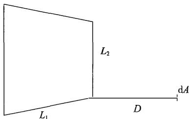

(a) 微元与平面角点相对

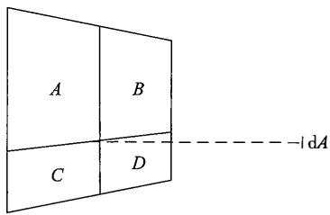

(b) 微元与平面中点相对

图3-1 角系数之间的关系示意图

一般来说， 火灾中建筑物对外辐射热的表面主要是门窗及燃 烧着的外部木质物质，当其温度达到接近 $1 \ 1 0 0 \%$ 时， 相应的最 大辐射热流密度可达到 $2 0 0 \mathbf { k W / m } ^ { 2 }$ (若辐射率 $\varepsilon = 1$ )。除非火灾 荷载很小（这种情况下火灾不能燃烧足够长的时间以达到上述温 度）， 或者是燃料控制型燃烧情况， 通常假设火灾中的辐射面具 有 $1 7 0 \mathrm { k W / m } ^ { 2 }$ 的辐射热流密度。 

分析公寓的房间发生火灾， 另一建筑正对房间受到的热辐 射作用。计算方法采用求角系数的方法。本例中着火公寓窗户外 立面图及与相邻建筑的位置关系如图3-2所示。着火公寓的窗户 (ABCD) 开口尺寸为 $1 . 8 \mathrm { m } \times 1 . 8 \mathrm { m }$ 。 

1)当房间内的自动喷水灭火系统有效时， 着火房间的火 灾在179s时达到最大热释放速率， 即l.5MW; 如此时火灾的热 释放速率大约为轰燃状态时的1/3, 向外发射的辐射热流密度取 $2 0 0 \mathrm { k W / m } ^ { 2 }$ 的1/3, 即 $6 7 \mathrm { k W } / \mathrm { m } ^ { 2 }$ o 

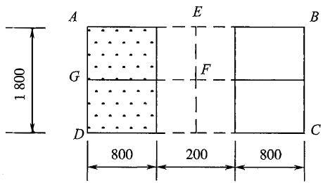

（a）着火公寓窗户外立面图

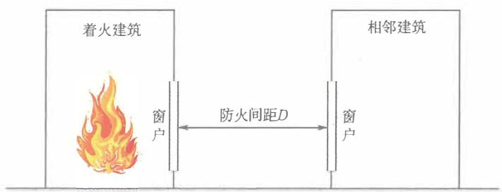

(b)着火公寓与相邻建筑的位置关系示意图

图3-2着火公寓窗户外立面图及与相邻建筑的 位置关系（单位： mm)

因为外窗中点正对位置的辐射热流密度最大，因此以外窗的 中点 $F$ 将外窗分成与AEFG相同大小的4等份。设矩形AEFG的角 系数为 $\varphi$ ，则矩形ABCD的角系数为 $4 \varphi$ ，矩形AEFG的长短边比 —L1 0.9 = ——=1。 当D= 2.5m时， a= $\frac { L _ { 1 } } { L _ { 2 } } = \frac { 0 . 9 } { 0 . 9 } = 1$ $D = 2 . 5 \mathrm { m }$ $\alpha { = } \ \frac { L _ { 1 } \times L _ { 2 } } { D ^ { 2 } } { = } \ \frac { 0 . 9 \times 0 . 9 } { 2 . 5 ^ { 2 } } { = } 0 . 1 3 0$ , 由 3-3)得 $\scriptstyle \varphi = 0 . 0 3 4 9$ ; 当 $D = 6 \mathrm { m }$ $\alpha { = } \frac { L _ { 1 } { \times } L _ { 2 } } { D ^ { 2 } } { = }$ $\frac { 0 . 9 \times 0 . 9 } { 6 ^ { 2 } } { = } 0 . 0 2 3$ ' 由角系数表得) $\scriptstyle { \varphi = 0 . 0 0 6 9 }$ 。 

因此，距离起火建筑物 $2 . 5 \mathrm { m }$ 处接受到的最大辐射热流密 度为： 

$$
\dot {q} ^ {\prime \prime} = 4 \varphi E ^ {\prime} = 4 \times 0. 0 3 4 9 \times 6 7 = 9. 3 5 (\mathrm {k W / m} ^ {2}) <   1 0 (\mathrm {k W / m} ^ {2})
$$

距离起火建筑物 $6 \mathrm { m }$ 处接受到的最大辐射热流密度为： 

$$
\dot {q} ^ {\prime \prime} = 4 \varphi E ^ {\prime} = 4 \times 0. 0 0 6 9 \times 6 7 = 1. 8 5 (\mathrm {k W / m} ^ {2}) <   1 0 (\mathrm {k W / m} ^ {2})
$$

因此，当房间内的自动喷水灭火系统有效时，在距离起火 房间 $2 . 5 \mathrm { m }$ 及6m处的相邻建筑不会被引燃，火灾蔓延的可能性 不大。 

2）当房间内的自动喷水灭火系统失效时，着火房间的火灾在 310s时达到 4.5 W 

状态， 向外发射的辐射热流密度保守取 $2 0 0 \mathrm { k W / m } ^ { 2 }$ 

因此， 距离起火建筑物 $2 . 5 \mathrm { m }$ 处接受到的最大辐射热流密 度为： 

$$
\dot {q} ^ {\prime \prime} = 4 \varphi E ^ {\prime} = 4 \times 0. 0 3 4 9 \times 2 0 0 = 2 7. 9 2 (\mathrm {k W / m} ^ {2}) > 1 0 (\mathrm {k W / m} ^ {2})
$$

距离起火建筑物6m处接受到的最大辐射热流密度为： 

$$
\dot {q} ^ {\prime \prime} = 4 \varphi E ^ {\prime} = 4 \times 0. 0 0 6 9 \times 2 0 0 = 5. 5 2 (\mathrm {k W / m} ^ {2}) <   1 0 (\mathrm {k W / m} ^ {2})
$$

因此， 当自动喷水灭火系统失效， 在距离起火房间6m处的 相邻建筑的房间也不会被引燃， 火灾蔓延的可能性不大；但距离 起火房间 $2 . 5 \mathrm { m }$ 处相邻建筑的房间可能被引燃， 并可导致火灾在 相邻建筑间蔓延。 

3.1.3 甲、 乙类物品运输车的汽车库、 修车库、 停车场与人 员密集场所的防火间距不应小于 $5 0 \mathrm { m }$ , 与其他民用建筑的防 火间距不应小于 $2 5 \mathrm { m }$ ; 甲类物品运输车的汽车库、 修车库、 停车场与明火或散发火花地点的防火间距不应小于 $3 0 \mathrm { m }$ 。 

# 【条文要点】

汽车库是用于停放由内燃机或电力驱动且无轨道的客车、货 车、 工程车等汽车的建筑物。修车库是用于保养、修理由内燃机 或电力驱动且无轨道的客车、 货车、 工程车等汽车的建（构）筑 物。停车场是用千停放由内燃机或电力驱动且无轨道的客车、 货 车、 工程车等汽车的露天场地或构筑物。 汽车库、修车库、 停 车场是一类特殊的建筑或场所， 汽车库的防火设防标准主要比照 类似火灾危险性类别的库房， 修车库的设防标准主要比照甲类 厂房确定。 汽车库、修车库、 停车场发生火灾以一辆车起火为 主， 蔓延至相邻车辆需要一定时间， 这些场所与相邻建筑的防 火间距主要取决于建筑的耐火等级和机动车运输物品的火灾危险 性类别。 本条主要规定了火灾危险性大的汽车库、修车库和停车 场与人员密集场所、 散发火花或明火地点的防火间距， 这些间 距是最小间距要求， 正常情况下不允许因采用其他替代措施而 减小。 

# 【实施要点】

(1)汽车库可以独立建造， 在符合一定防火要求的条件下， 

也可以与工业建筑或民用建筑合建。 本条规定的甲、乙类物品运 输车， 包括装载甲、乙类物品的机动车和已经用千运输甲、乙类 物品的运营机动车， 不包括新出厂用千运输甲、乙类物品且未载 货的机动车。 运输甲、乙类物品的车辆或巳用千运输甲、乙类物 品的车辆的汽车库、修车库和停车场， 均应比照甲、乙类厂房和 仓库的火灾危险性确定相应的防火间距。 

有关甲、乙类物品的火灾危险性类别划分， 可以按照现行国 家标准《建筑设计防火规范》GB 50016 的规定确定。 根据国家 标准《建筑设计防火规范》GB 50016 —2014 (2018年版）第3.1.3 条的规定， 下列物品的火灾危险性应划分为甲类： 

1)闪点小于 $2 8 \%$ 的液体， 如苯、甲苯、甲醇、乙醇、乙 酰、醋酸甲酷、汽油、丙酮等； 

2)爆炸下限小于 $1 0 \%$ 的气体， 受到水或空气中水蒸气的作 用能产生爆炸下限小于 $1 0 \%$ 气体的固体物质， 如乙快、氢、甲 烧、环氧乙烧、水煤气、液化石油气、乙烯、电石等； 

3)常温下能自行分解或在空气中氧化能导致迅速自燃或爆 炸的物质， 如硝化棉、硝化纤维胶片、赛潞硌棉等； 

4)常温下受到水或空气中水蒸气的作用， 能产生可燃气体 并引起燃烧或爆炸的物质， 如金属钾、钠、悝、钙、氢化捚、氢 化钠等；遇酸、受热、撞击、摩擦以及遇有机物或硫黄等易燃的 无机物， 极易引起燃烧或爆炸的强氧化剂， 如氯酸钾、氯酸钠、 硝酸按等； 

5)受撞击、摩擦或与氧化剂、有机物接触时能引起燃烧或 爆炸的物质， 如赤磷， 五硫化二磷， 三硫化二磷等。 

下列物品质的火灾危险性应划分为乙类： 

1)闪点不小于 $2 8 \mathrm { ‰}$ 但小千 $6 0 \%$ 的液体， 如煤油、松节 油、醋酸丁酣、溶剂油、樟脑油等； 

2)爆炸下限不小于 $1 0 \%$ 的气体， 如氨气等；不属千甲类的 氧化剂， 如硝酸、发烟硫酸、漂白粉等； 

3)不属于甲类的易燃固体， 如硫黄、 赛潞硌板（片）、樟 脑、荼等； 

4)助燃气体， 如氧气、氯气等； 

5)常温下与空气接触能缓慢氧化， 积热不散引起自燃的物 品， 如漆布、 油布、油纸及其制品等。 

(2)为使本规范具有更强的可操作性， 本规范相关规定不 再使用国家标准《建筑设计防火规范》GB 50016— 2014 (2018 年版）等标准规定的 ”重要公共建筑” 这一名词， 而采用当前 国家在消防监管方面需要严格控制的建筑类型 ”人员密集场所” 替代。 

本规范规定的 “人员密集场所” 与《消防法》第七十三条 规定的范围一致， 即 “宾馆、饭店、商场、集贸市场、客运车 站候车室、客运码头候船厅、民用机场航站楼、 体育场馆、会 堂以及公共娱乐场所， 医院的门诊楼、 病房楼， 学校的教学 楼、图书馆、食堂和集体宿舍， 养老院， 福利院， 托儿所， 幼 儿园， 公共图书馆的阅览室， 公共展览馆、 博物馆的展示厅， 劳 动密集型企业的生产加工车间和员工集体宿舍， 旅游、宗教活 动场所等。” 原 ”重要公共建筑” 中未包括在人员密集场所内 的其他建筑， 有关防火间距虽本规范不作强制要求， 但仍需要 根据建筑的重要性， 依据本规范第2.1.2条规定的防火目标合理 确定。 

(3)本条规定的 “明火或散发火花地点” ， 包括明火地点和 散发火花地点， 即室外固定的或具有经常性明火作业、电焊、金 属切割作业的地点， 室外变压器， 室外的可燃气体放空火炬， 钢 铁冶金和玻璃加工等生产建筑内具有明火和炽热高温作业的部位 或区域， 不包括民用建筑内的厨房用火或明火取暖部位。 

(4)根据本规范第5.1.5条的规定， 甲、乙类物品运输车的 汽车库、修车库的耐火等级不应低千一级。 本条规定的防火间距 是基于此耐火等级汽车库、修车库的要求。 

本条规定外其他类别火灾危险性物品运输车的汽车库、修车 库和停车场与人员密集场所、明火地点、散发火花地点的防火间 距， 不同耐火等级、不同类别和不同建筑形式的汽车库之间、修 车库之间、汽车库与修车库之间以及各类汽车库、修车库和停车 

场与其他各类工业与民用建筑之间的防火间距， 本规范不作严格 限制， 均可以按照现行国家标准《汽车库、修车库、停车场设计 防火规范》 50067等技术标准的规定确定。 

(5)汽车库、修车库和停车场的耐火等级划分， 汽车库、修 车库和停车场的类别划分， 以及不同形式汽车库（如敞开式汽车 库、机械式汽车库等）的定义， 可以按照现行国家标准《汽车 库、修车库、停车场设计防火规范》 50067等技术标准的规定 确定。 

# 3.2 工业建筑

3.2.1 甲类厂房与人员密集场所的防火间距不应小于 $5 0 \mathrm { m }$ , 与明火或散发火花地点的防火间距不应小于 $3 0 \mathrm { m }$ 。 

3.2.2 甲类仓库与高层民用建筑和设置人员密集场所的民 用建筑的防火间距不应小于 $5 0 \mathrm { m }$ , 甲类仓库之间的防火间 距不应小于 $2 0 \mathrm { m }$ 。 

3.23除乙类第5项、第6项物品仓库外，乙类仓库与高 层民用建筑和设置人员密集场所的民用建筑的防火间距不 应小于 $5 0 \mathrm { m }$ 。 

# ［条文要点】

这三条规定的甲类厂房和甲、乙类库房与人员密集场所的防 火间距、 甲类厂房与明火地点或散发火花的地点的防火间距、甲 类厂房之间的防火间距是最小间距要求， 正常情况下不允许采用 其他替代措施减小。 

# ［实施要点】

(1)尽管单层乙类仓库和建筑面积不大千 $3 0 0 \mathrm { m } ^ { 2 }$ 的独立甲、 乙类单层厂房可采用三级耐火等级的建筑，但考虑到甲、乙类工 业建筑的火灾危害性， 这三条有关防火间距的要求适用于一、二 级耐火等级的甲类厂房， 一、 二级耐火等级的甲、 乙类仓库， 三 级耐火等级的甲类厂房， 三级耐火等级的乙类仓库。 有关甲类厂 房和甲、乙类仓库的火灾危险性类别划分，可以按照现行国家标 准《建筑设计防火规范》 50016的规定确定。 其他要点可参 

见本规范第3.1.3条的［实施要点］。 

(2)本规范规定的高层民用建筑包括建筑高度大于 $2 7 \mathrm { m }$ 的 非单层住宅建筑、建筑高度大千 $2 4 \mathrm { m }$ 的非单层其他民用建筑， 单 层或多层民用建筑包括建筑高度小千或等千 $2 7 \mathrm { m }$ 的住宅建筑、建 筑高度小千或等千 $2 4 \mathrm { m }$ 的其他民用建筑。 有关民用建筑的分类， 可以按照现行国家标准《建筑设计防火规范》GB50016的规定 确定。 

(3)第3.2.2条和第3.2.3条规定的“设置人员密集场所的民 用建筑＂ ， 包括人员密集场所和人员密集场所与其他使用功能的 场所合建的建筑。 例如， 一座上部楼层为宾馆， 下部楼层为办公 场所的建筑， 就属千设置人员密集场所的民用建筑。 

3.2.4 飞机库与甲类仓库的防火间距不应小于 $2 0 \mathrm { m }$ 。 飞机 库与喷漆机库贴邻建造时， 应采用防火墙分隔。 

# 【条文要点】

飞机库是用千停放和维修飞机的建筑物， 本质上属千从事飞 机维修的厂房， 不包括喷漆机库和飞机部件喷漆间、飞机座椅维 修间、航材库、配电室、动力站等生产辅助用房。 飞机库内停放 和维修的飞机属千高价值防护对象， 本条规定了飞机库与相邻建 筑的最小间距要求。 

# 【实施要点】

飞机库的主要火灾危险性来自飞机维修过程中机舱内的可 燃物和油箱内残留的航空煤油。 其中， 航空煤油的闪点大多低千 $6 0 \%$ 飞机库的总体火灾危险性要比照乙类生产厂房考虑。 因 此， 飞机库与相邻各类建筑的防火间距不应小千乙类厂房与其他 建筑的防火间距要求。 

根据本规范第5.2.1条和第5.2.2条的规定， I类飞机库的耐 火等级应为一级， II、皿类飞机库的耐火等级不允许低千二级。 本条的规定是基千此耐火等级飞机库的要求。 尽管现行国家标准 《飞机库设计防火规范》GB50284规定的飞机库包括机棚，但鉴 千机棚属千停放和维修区为敞开或半敞开式的飞机库， 本条规定 的飞机库不包括机棚。 机棚与甲类仓库的防火间距应根据在建筑 

之间采取的防火措施适当增大， 并应符合现行国家标准《飞机库 设计防火规范》GB 50284等技术标准的规定。 

除本条规定的甲类仓库外， 飞机库之间、 飞机库与附属建筑及 其他建筑之间、 飞机库附属建筑与其他建筑之间的防火间距， 可以 按照现行国家标准《飞机库设计防火规范》GB 50284等技术标准的 规定确定。 

喷漆机库属于甲类生产厂房， 正常情况下应独立建造且不 应与其他建筑贴邻。但喷漆机库属千飞机库的生产辅助用房， 具 有较紧密的联系， 大多需要贴邻建造以满足飞机维修的要求。 因此， 在飞机库与喷漆机库之间的防火墙上允许设置一定的开 口， 但这些开口必须采取可靠的防火分隔措施， 以防止相互间 的火灾蔓延和可能的爆燃危害。 防火分隔措施一般采用设置甲 级防火门和防火卷帘， 防火墙和防火卷帘的耐火极限均不应低于 3.00h。 

# 3.3 民用建筑

3.3.1 除裙房与相邻建筑的防火间距可按单、 多层建筑确 定外， 建筑高度大于 $1 0 0 \mathrm { m }$ 的民用建筑与相邻民用建筑的 防火间距应符合下列规定： 

1 与高层民用建筑的防火间距不应小于13m; 

2 与一、 二级耐火等级单、 多层民用建筑的防火间距 不应小于9m; 

3 与三级耐火等级单、 多层民用建筑的防火间距不应 小于 $1 1 \mathrm m$ ; 

4 与四级耐火等级单、 多层民用建筑和木结构民用建 筑的防火间距不应小于 $1 4 \mathrm { m }$ 。 

# ［条文要点】

本条规定了建筑高度大千 $1 0 0 \mathrm { m }$ 的民用建筑主体与相邻民 用建筑的防火间距， 且这些间距在正常情况下均不应减小。 建 筑高度小于或等千 $1 0 0 \mathrm { m }$ 的民用建筑之间、 建筑高度小千或等千 $1 0 0 \mathrm { m }$ 建筑与其他建筑之间的防火间距， 可以按照现行国 

家现行相关技术标准的要求确定， 并在采取可靠的防止火势蔓延 的措施后和满足灭火救援所需空间的条件下， 可以按照相应标准 的要求调整。 

# ［实施要点】

建筑高度大于 $1 0 0 \mathrm { m }$ 的建筑火灾扑救难度大、 救援时到场消 防车辆多且大部分救援车辆展开救援作业所需空间和场地大， 在 确定相应的防火间距时， 不仅要考虑防止火势蔓延的需要， 而且 要满足灭火救援的要求。 

裙房是在高层建筑主体投影范围外， 与高层建筑主体相连 且建筑高度不大千 $2 4 \mathrm { m }$ 附属建筑。 建筑高度大千 $1 0 0 \mathrm { m }$ 的民用建 筑的耐火等级不应低于一级。 因此， 裙房属千一级耐火等级的 单层或多层的公共建筑。 根据防火间距的定义和确定防火间距 的原则， 主体建筑高度大千 $1 0 0 \mathrm { m }$ 的高层建筑裙房与相邻建筑的 防火间距可以按照一级耐火等级的单、 多层建筑与相邻建筑的 防火间距要求确定， 不需要按照高层主体的相应要求确定， 但 高层主体在裙房一侧的建筑立面与相邻建筑的间距仍应满足本 条规定的防火间距， 其他与消防车登高操作场地对应的建筑立 面（即建筑的消防扑救面）与相邻建筑的间距应满足消防救援的 要求。 

例如， 一座主体建筑高度为 $1 5 0 \mathrm { m }$ 的高层建筑， 裙房的建筑 高度为 $2 1 \mathrm { m }$ , 则该建筑高层主体与相邻高层民用建筑的防火间距 不应小千 $1 3 \mathrm { m }$ , 与相邻一、 二级耐火等级单、 多层民用建筑的 防火间距不应小千 $9 \mathrm { m }$ , 裙房与相邻建筑高度小千 $1 0 0 \mathrm { m }$ 的高层 民用建筑的防火间距可以按照不小千 $9 \mathrm { m }$ , 与相邻一、 二级耐火 等级单、 多层民用建筑的防火间距可以按照不小千 $6 \mathrm m$ 确定。 但 是， 如果裙房凸出高层主体的深度为 $5 \mathrm { m }$ , 则还需要满足高层主 体与相邻单、 多层民用建筑的防火间距不小千 $1 3 \mathrm { m }$ 的要求， 即 裙房与相邻一、 二级耐火等级单、 多层民用建筑的防火间距不应 小千 $8 \mathrm { m }$ 。 参见图3-3。 

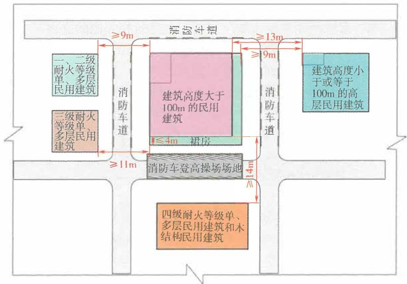

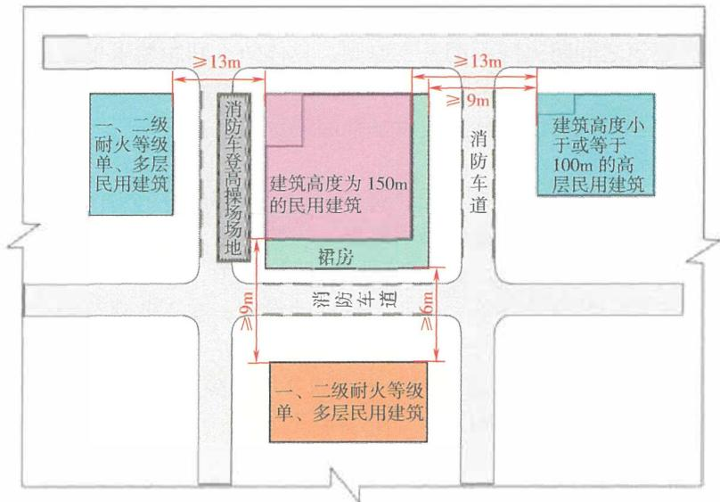

图3-3 建筑高度大千 $1 0 0 \mathrm { m }$ 的民用建筑与相邻建筑之间的 防火间距和消防救援空间要求示意图

应注意的是， 对千建筑高度大千 $1 0 0 \mathrm { m }$ 的民用建筑， 当该建 筑与单、 多层民用建筑或单、 多层工业建筑相邻侧的立面是主要 的消防扑救面时， 即消防车登高操作场地位千建筑高度大千 $1 0 0 \mathrm { m }$ 的民用建筑与相邻其他单、 多层建筑之间时， 建筑之间的间距除 应符合本条规定外， 尚不应小于 $1 3 \mathrm { m }$ ; 除建筑中消防扑救面对应 范围内的防火间距不应小千 $1 3 \mathrm { m }$ 外， 建筑中其他不用作消防扑救 面对应范围内的防火间距仍可以按照本条规定的最小值确定。 

3.3.2 相邻两座通过连廊、 天桥或下部建筑物等连接的建 筑， 防火间距应按照两座独立建筑确定。 

# ［条文要点】

在建筑之间设置连廊或天桥， 或者在多座塔楼下部设置同一 座裙楼的情形， 在现代城市建设中比较常见。 这些建筑有时在规 划上按照一座建筑考虑， 或者在建设过程中是按照一座建筑设计 和建造， 有时本身是多座不同的独立建筑，但通过连廊等连接在 一起， 在确定防火间距时， 容易产生不同意见。 本条规定了确定 此类建筑之间防火间距的基本原则， 具体防火间距要求可以按照 建筑的类别或火灾危险性类别、 建筑的耐火等级、 建筑高度等按 照本规范及现行国家相关技术标准的规定确定。 

# ［实施要点】

(1)连廊是设置在不同建筑之间连接相邻建筑的封闭或半封 闭廊道，具有一定的遮风挡雨性能，主要用于人员在不同建筑之 间的便捷通行、休息、 观光等。 在民用建筑中， 部分连廊有时还 可能布置一些文化展览、 商业经营活动设施；在工业建筑中， 连 廊有时还用千布置工艺管线或布置工艺管线并兼具人员通行的作 用。 在建筑之间的连廊大多为1层或2层， 少数具有多个楼层。 当连接不同建筑的连廊完全开敞或半开敞时， 可视为天桥，但天 桥应为只有1层的情形。 

根据建筑之间防火间距的确定原则， 无论上述何种情形的 连廊和天桥， 当在建筑与连廊或天桥的连通处采取防止火势蔓延 的措施后， 相邻建筑之间的防火间距只与建筑的高度、 耐火等级 和火灾危险性类别有关， 相应建筑的防火间距均可以按照各自独 

立的建筑确定。 在确定建筑之间的防火间距时， 要注意准确计算 建筑的高度， 即每座通过连廊或天桥连接的建筑， 建筑高度均应 分别计算， 并应自各自建筑的室外设计地面、 消防救援场地或消 防车登高操作场地的地面算至建筑的屋面面层或檐口。 有关建筑 高度的计算方法， 可以按照现行国家标准《建筑设计防火规范》 GB 50016的规定确定。 

(2)在同一座裙房或裙楼上部建设的多栋建筑， 本身属于一 座建筑， 但建筑在裙房或裙楼屋面以上的楼层或塔楼之间的防火 间距主要受相邻立面的火灾热辐射作用影响。 因此， 裙房或裙楼 屋面上部不同栋建筑之间的防火间距， 可以根据其计算建筑高度 和本条规定的原则确定。 无论裙房或裙楼的屋面是否用作消防救 援场地， 这些建筑的计算建筑高度均可以从裙房或裙楼的屋面分 别算至各栋建筑的屋面面层或檐口。 参见图3-4。 对于在地铁车 辆基地上盖上建设的建筑， 其防火间距也可以按照此原则确定。 

# 3.4 消防车道与消防车登高操作场地

3.4.1 工业与民用建筑周围、 工厂厂区内、 仓库库区内、 城市轨道交通的车辆基地内、 其他地下工程的地面出入口 附近， 均应设置可通行消防车并与外部公路或街道连通的 道路。 

# ［条文要点】

本条规定要求各类单体建筑或建筑群、 设置围墙的厂区和库 区、 采取封闭管理措施的居民小区及其他区域或场所， 在建造和 使用过程中均应考虑应急救援时消防车的快速通行要求。 

# ［实施要点】

建筑火灾的发生时间、 地点和位置具有很强的随机性和偶然 性。 因此， 任何建筑物均应考虑发生火灾时灭火救援的要求， 应 为消防车到达并接近火场提供必要的条件。 不同规模和火灾危险 性、 不同建筑高度的建筑对消防车和消防救援场地的要求可以有 所差异， 允许有不同的设防标准。 例如， 规模较小的建筑可以利 用市政道路通行消防车并兼作消防救援场地；高层建筑则要设置 

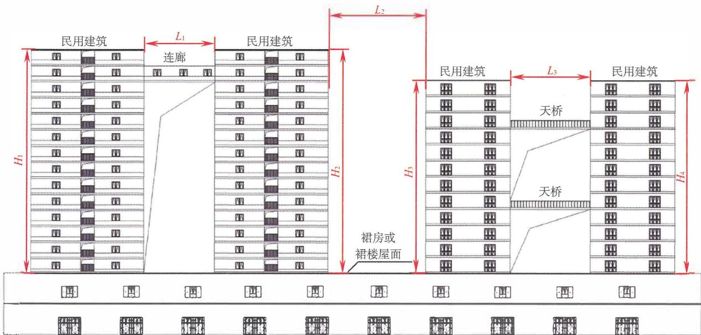

图3-4 裙房或裙楼上部建筑确定防火间距时的建筑高度计算示意图

注：防火间距 $L$ 应按照两座独立建筑确定，无论裙房或裙楼的屋面是否用作消防救援场地，这些建筑的计算建 筑高度 $H$ 均可以从裙房或裙楼的层面分别算至各栋建筑的屋面面层或檐口。

专用的消防车登高操作场地， 消防车道一般也需要专门设置， 尽 最不利于市政道路或外部道路。本条规定各类建筑和场所均应具 有满足消防车通行的道路。这些道路可以利用城市街道或公路、 建设基地的内部道路；对千按照标准规定要求设置消防车道的建 筑， 消防车道一般不应利用城市公共道路；道路（包括桥梁）的 形式不限， 但道路的宽度、 净空高度、 转弯半径和承载能力等应 满足消防车安全和快速通行的要求。道路的具体要求应符合本规 范第3.4.4条和现行国家相关技术标准的规定。 

需要用作消防车停靠并开展灭火救援的道路， 除要满足消防 车通行的要求外， 还应便于消防车接近着火建筑， 便千消防车取 水和向建筑供水， 并满足消防车展开安全作业的要求。因此， 车 道与建筑外墙、 建筑周围的消防供水设施的水平距离应合适。 

建筑周围或建设基地内的消防车道或火灾时需要用千通行消 防车的道路， 应与市政道路或公路直接连通， 且连通接口一般不 应少于2个， 相邻两个连通接口之间应保持足够的距离， 防止到 场或离场消防车发生拥堵。 

3.4.2 下列建筑应至少沿建筑的两条长边设置消防车道： 

1 高层厂房， 占地面积大于 $3 ~ 0 0 0 \mathrm { m } ^ { 2 }$ 的单、 多层甲、 乙、 丙类厂房； 

2 占地面积大于 $1 5 0 0 \mathrm { m } ^ { 2 }$ 的乙、 丙类仓库； 

3 飞机库。 

3.4.3 除受环境地理条件限制只能设置 $^ 1$ 条消防车道的公 共建筑外， 其他高层公共建筑和占地面积大于 $3 ~ 0 0 0 \mathrm { m } ^ { 2 }$ 的 其他单、 多层公共建筑应至少沿建筑的两条长边设置消防 车道。 住宅建筑应至少沿建筑的一条长边设置消防车道。 当建筑仅设置1条消防车道时， 该消防车道应位于建筑的 消防车登高操作场地一侧。 

# ［条文要点】

消防车道是保障消防救援队伍到场对建筑火灾实施灭火救 援的基本条件，是在火灾时供消防车通行的专用道路。具有一定 规模的建筑均应在建筑周围设置消防车道， 且正常情况下应在建 

筑基地范围内设置。 这两条规定了应设置至少2条消防车道或至 少沿一条建筑长边设置消防车道的建筑， 这些建筑及其他建筑的 消防车道设置要求， 还需要根据现行国家标准《建筑设计防火规 范》GB 50016等技术标准的规定确定。 

# 【实施要点】

建筑消防车道的设置受基地及其周围的地形条件影响大， 外 部气象条件等也会在一定程度上影响建筑火灾的扑救。 消防车道 的设置应充分考虑建筑的外形、 进深、 高度、 火灾危险性、 人员 疏散与集散、 周围地形条件和主导风向等因素， 以保障灭火救援 行动取得更好的效果。 

(1)这两条规定应至少设置2条消防车道的建筑， 有条件时 应尽量将这两条消防车道连成环形车道， 当难以成环状车道时， 这两条消防车道应分别与建筑基地外的公共道路连通。 建筑的进 深和高度对灭火救援的效果有较大影响， 特别是当消防救援人员 难以深入火场时， 对灭火效果的影响更大。 因此， 当建筑的占地 面积大、 进深大、 高度高时， 在建筑选址和平面布局时就应注意 结合消防车道、 消防救援场地或消防车登高操作场地的设置合理 确定建筑的方位， 使建筑具有至少可以沿其两条长边设置消防车 道的条件， 避免出现只能设置1条消防车道的情形。 

（2）建筑的长边一般可以按照建筑外形几何长度较长的边长 确定。 当建筑的外形为异形时， 建筑的长边长度一般应按照其外 形的实际几何长度计算；当建筑的外形为弧形时， 建筑的长边长 度应按照弧形的实际长度计算；当建筑的外形为不规则形状时， 应根据凸出或凹入部位的宽度和深度是否满足设置消防车道的要 求、 是否影响消防救援作业等因素确定该深度是否计入建筑的长 边长度。 如果凸出或凹入部位的深度不影响消防救援作业或对救 援高度的影响不大时， 建筑的边长可以不计入这些部位的深度。 否则， 应将这些部位的深度计入建筑的长边长度内， 并在相应部 位设置消防车道。 

(3)住宅建筑一般进深较小， 且每户大多有多个方位的外 窗， 设置1条消防车道基本可以满足外部救援要求。 本条尽管未 

严格要求高层住宅建筑沿两条长边设置消防车道或在建筑周围设 置环形消防车道，但在实际工程中要尽量在高层住宅建筑周围设 置环形消防车道或沿建筑的两条长边均设置消防车道。 当只设置 1条消防车道时，该消防车道应设置在面向住宅建筑首层出入口 一侧。 

只能设置1条消防车道的公共建筑，其周围的环境地理条件 限制主要为建筑周围地形高差大且在另一边设置消防车道的建设 成本巨大或没有条件，建筑沿江河湖海等天然水体堤岸临空建设 且难以设置高架桥作为消防车道的情形。 

(4)只设置1条消防车道的民用建筑，消防车道应位于建 筑的消防车登高操作场地一侧，或与消防车登高操作场地联合设 置，并应尽量设置在建筑所处位置常年主导风向的上风侧。 当建 筑不需要设置消防车登高操作场地时，应将此消防车道按照消防 救援场地考虑，车道与建筑外墙的水平距离、车道的坡度和宽度 均应满足消防车展开灭火救援的要求，车道上空及周围不应有可 能影响灭火救援的高大树木、 电力电信架空线路等障碍物。 尽管 第3.4.3条规定主要针对民用建筑，但也适用于只设置1条消防 车道的工业建筑。 

3.4.4 供消防车取水的天然水源和消防水池应设置消防车 道， 天然水源和消防水池的最低水位应满足消防车可靠取 水的要求。 

# 【条文要点】

本条规定了供消防车取水的消防水源保证消防车取水的基 本要求，以满足消防车向火场应急供水的需要。 有关消防水源的 水质、消防水池的容量和位置、天然水源的水最或流量、防吸水 口堵塞等技术要求，应符合现行国家标准《消防设施通用规范》 GB 55036和《消防给水及消火栓系统技术规范》GB 50974等标 准的规定。 

# 【实施要点】

供水消防车和灭火消防车前往火场时一般会装满水和灭火介 质，但消防车到达火场后受火灾持续时间影响，大多还需要就地 

利用消防水源吸水并向建筑内的消防给水管网加压供水，有的还 需要通过消防车加压实施直接灭火和防护冷却。建筑的室外消防 水源主要来自江河湖海等天然水体、 水库、 水井、单独设置的消 防水池、 市政消防给水管网等。市政给水管网通过市政消火栓、 水鹤或建筑的室外消火栓向消防车供水，消火栓或水鹤均设置在 可通行消防车的道路旁边，可以满足消防车取水的要求，不需要 设置专门的取水设施。消防水池可以通过消防水泵向室外消火栓 系统加压，以满足消防车经室外消火栓取水的需要，消防车也可 以通过取水井直接利用消防水池补水。 

消防车吸水通常是利用车载泵和车载吸水管取水，吸水 时 进水管必须保持一定的真空度才能将水吸入车载水罐。受真空作 用，消防车采用常规水带吸水难以满足要求，而车载吸水管的长 度较短，只能满足较小的真空作用，取水距离和吸水高度受限。 因此，供消防车取水的天然水源和消防水池的取水设施处应设置 道路或场地与建筑周围的消防车道或火灾时供消防车通行的道路 连通，保证消防车可以接近水源，便千快速取水；当连接消防车 道与消防水源的车道为尽端式车道时，应根据本规范第3.4.4条 的规定设置回车场地或回车道。供消防车取水的水源应设置取水 码头、 取水井等设施供消防车直接安全吸水，并应保证吸水高 度（即最低吸水水位到消防车车载水泵标准基面的垂直高度）能 够满足消防车可靠吸水和有效利用水源水量的要求 。天然水源的 最低水位应按照该水源在枯水期的最低水位确定。根据国家标准 《消防给水及消火栓系统技术规范》GB 50974—2014第4.4.5条 的规定，消防车的最大吸水高度不应超过 $6 . 0 \mathrm { m }$ 。 

我国地域广阔，西高东低，西部海拔高度较高，水泵吸上高 度小，水泵的安装位置应谨慎考虑，防止出现水泵气蚀而影响水 泵效率和运行寿命。水泵进水口的吸水高度受吸水管阻力、 气蚀 余量和大气压力的影响 。 为保证消防车可靠取水，在大气压力超 过 $1 0 \mathrm { m }$ 水柱的地区，消防车取水口的吸水高度不应大千6m; 在 大气压力低千 $1 0 \mathrm { m }$ 水柱的地区，消防车取水口的吸水高度可以 根据海拔高度计算后确定。不同海拔高度与水泵最大吸上高度的 

关系参见表3-4。 

表 3-4 不同海拔高度与水泵最大吸上高度的关系

| 海拔高度/m | 大气压/kPa | 理论吸上高度/m | 海拔高度/m | 大气压/kPa | 理论吸上高度/m |
| --- | --- | --- | --- | --- | --- |
| 0 | 101.33 | 10.27 | 2000 | 79.50 | 8.04 |
| 200 | 98.95 | 10.3 | 2200 | 77.54 | 7.84 |
| 400 | 96.61 | 9.79 | 2400 | 75.63 | 7.65 |
| 600 | 94.32 | 9.56 | 2600 | 73.75 | 7.46 |
| 800 | 92.08 | 9.33 | 2800 | 71.91 | 7.27 |
| 1000 | 89.87 | 9.10 | 3000 | 70.11 | 7.09 |
| 1200 | 87.72 | 8.88 | 3200 | 68.34 | 6.91 |
| 1400 | 85.60 | 8.67 | 3400 | 66.62 | 6.73 |
| 1600 | 83.52 | 8.45 | 3600 | 64.92 | 6.56 |
| 1800 | 81.49 | 8.25 | 3800 | 63.26 | 6.39 |

大气压下允许吸上真空高度与允许气蚀余量的关系见下式： 

$$
H _ {\mathrm {s}} = \frac {P _ {\mathrm {a}} - P _ {\mathrm {z}}}{\rho g} - N P S H + \frac {v _ {\mathrm {s}} ^ {2}}{2 g} \tag {3-9}
$$

式中： $H _ { \mathrm { s } }$ ——大气压下允许吸上真空高度 $/ \mathrm { m }$ ; 

$P _ { \mathrm { ~ a ~ } }$ P- 水泵吸入口处的压力， 对千开口容器， 为安装地点 的大气压 /Pa; 

$P _ { z }$ 不同温度下水的饱和蒸汽压（见表3-5)/Pa; 

NPSH 水泵允许气蚀余量（由水泵供应商给定） $/ \mathrm { m }$ ; 

$v _ { \mathrm { s } }$ 水泵吸水口流速/ (mis) ; 

$\rho$ 水的密度/ $\mathrm { k g / m } ^ { 3 }$ ）； 

g 重力加速度/ ( $\mathrm { m / s } ^ { 2 }$ )o 

水泵安装地点的水泵吸上真空高度， 见下式： 

$$
H _ {\mathrm {s}} ^ {\prime} = H _ {\mathrm {s}} - \left(1 0. 3 3 - \frac {P _ {\mathrm {g}}}{\rho g}\right) + \left(0. 2 4 - \frac {P _ {\mathrm {z}}}{\rho g}\right) \tag {3-10}
$$

式中： $H _ { \mathrm { s } } ^ { \prime }$ ——水泵安装地点的水泵吸上真空高度 $/ \mathrm { m }$ 

$P _ { \mathrm { { g } } } { . }$ — 水泵安装地点的大气压力（见表3-6) /Pa。 

表 3-5 不同温度下水的饱和蒸汽压

| 水温/℃ | 饱和蒸汽压/kPa | 水温/℃ | 饱和蒸汽压/kPa |
| --- | --- | --- | --- |
| 0 | 0.6 | 50 | 12.5 |
| 5 | 0.9 | 60 | 20.2 |
| 10 | 1.2 | 70 | 31.7 |
| 15 | 1.7 | 80 | 48.2 |
| 20 | 2.4 | 90 | 71.4 |
| 30 | 4.3 | 100 | 103.3 |
| 40 | 7.5 |  |  |

表 3-6 不同海拔高度的大气压力

| 海拔高度/m | 大气压力/MPa | 海拔高度/m | 大气压力/MPa |
| --- | --- | --- | --- |
| -600 | 0.113 | 700 | 0.095 |
| 0 | 0.103 | 800 | 0.094 |
| 100 | 0.102 | 900 | 0.093 |
| 200 | 0.101 | 1 000 | 0.092 |
| 300 | 0.100 | 1 500 | 0.086 |
| 400 | 0.098 | 2 000 | 0.084 |
| 500 | 0.097 | 3 000 | 0.073 |
| 600 | 0.096 | 4 000 | 0.063 |

3.4.5 消防车道或兼作消防车道的道路应符合下列规定： 

1 道路的净宽度和净空高度应满足消防车安全、 快速 通行的要求； 

2 转弯半径应满足消防车转弯的要求； 

3 路面及其下面的建筑结构、管道、 管沟等， 应满足 承受消防车满载时压力的要求； 

4 坡度应满足消防车满栽时正常通行的要求， 且不应 大于 $10 \%$ ; 兼作消防救援场地的消防车道， 坡度应满足消 防车停靠与消防救援作业的要求； 

5 消防车道与建筑外墙的水平距离应满足消防车安全 通行的要求， 位于建筑消防扑救面一侧兼作消防救援场地 的消防车道应满足消防救援作业的要求； 

6 长度大于 $4 0 \mathrm m$ 的尽头式消防车道应设置满足消防车 回转要求的场地或道路； 

7 消防车道与建筑消防扑救面之间不应有妨碍消防 车操作的障碍物， 不应有影响消防车安全作业的架空高压 电线。 

# （条文要点】

本条规定了消防车道的基本功能和性能要求， 不同建筑高 度、规模、火灾危险性的建筑发生火灾对消防车的需求不同， 不 同地区消防救援站配备的消防车的种类也各不相同， 不同类型消 防车对消防车道或兼作消防车通行的道路的技术要求也有所差 异。 保障各类建筑灭火救援并需要通行消防车的道路是否满足 到场消防车的使用需要， 可以根据本条规定和建筑的高度、规 模、火灾危险性等因素综合判定。有关消防车道性能要求的具体 指标应根据不同类型建筑或场所对消防车的需要， 在征询属地消 防救援机构意见的基础上， 按照现行国家有关技术标准的规定 经校核后确定。 国家标准 《建筑设计防火规范》GB 50016— 2014 (2018年版）第7.1.8条和第7.1.9条、《飞机库设计防火规范》 GB 50284— 2008第4.3.2条和第4.3.3条、《汽车库、 修车库、 停 车场设计防火规范》GB 50067— 2014第4.3.2条和第4.3.3条对消 

防车道的性能要求均有较详细的规定。 

# ［实施要点】

(1)消防车道是火灾时供消防车通行的应急车道， 可以是设 置用于专门通行消防车的道路， 也可以平时兼作其他机动车通行 的道路，但在任何情况下均应能保证消防车快速通行。 因此， 在 消防车道或火灾时需要通行消防车的道路上不允许设置任何影响 消防车通行的停车泊位、 构筑物、 固定隔离桩等障碍物， 也不应 设置铁桩、 石墩、 水泥墩等路障以及道路限高杆、架空管线、广 告牌等影响消防车通行的其他固定障碍物。 建筑周围的消防车通 道应根据国家和各地消防救援机构的要求设置 “消防车道禁止 占用” 等字样的明显警示标识。 

(2)城市和乡村的建设历经多个不同时期， 建筑和道路的 情况复杂。 工厂厂区和仓库库区的情况略好些。一方面， 消防救 援站的建设和城镇与乡村的改造需要结合规划和消防救援、 应急 避难等要求考虑。 另一方面， 相应区域的消防车道或火灾时供消 防车通行的道路的净宽度、 净空高度和转弯半径， 也需要根据实 际灭火救援需要和属地消防救援站的消防车配备情况合理确定。 当城镇老旧城区的道路难以改造， 只能通行小型或微型消防车 辆时， 则需要通过加密设置小型消防救援站并配备相应的消防 车辆和装备， 以满足这些区域的消防安全要求。 即使如此， 这 些道路仍应满足区域内的消防救援站所配备消防车安全、 快速 通行的基本要求。 

不同高度和规模的建筑火灾扑救所需消防车的类型不同， 因 此不同建筑对建筑周围消防车道的净宽度、 净空高度和转弯半径 的要求可以有所区别。在道路规划和建筑的建设中，要特别注意 穿过建筑物、桥梁、 城市地道的车道及地下车道需要通行消防车 时的道路净宽度和净空高度应满足消防车通行的要求。 常用消防 车的宽度为 $2 . 5 \sim 3 . 5 \mathrm { m }$ , 高度为 $2 . 5 { \sim } 4 . 2 \mathrm { m }$ , 转弯半径为 $9 \mathrm { { \sim } } 1 2 \mathrm { { m } }$ , 常 用消防车通道的净宽度和净空高度若分别不小于 $4 . 0 \mathrm { m }$ , 基本能 满足实际需要。但是， 对于建筑高度大千 $1 0 0 \mathrm { m }$ 的建筑， 要考虑 到场车辆多且到场车辆大多为大型车辆，消防车道的净宽度应满 

足消防车会车和周转通行的需要，一般不应小于 $7 . 0 \mathrm { m }$ , 净空高 度也要有所增加，一般不应小于 $4 . 5 \mathrm { m }$ 。 例如，民用机场多配备 尺寸为 $1 1 . 7 \mathrm { m } \times 3 . 2 \mathrm { m } \times 3 . 8 7 \mathrm { m }$ (长 $\times$ 宽 $\times$ 高） 的消防车。 据此， 国家标准《民用机场航站楼设计防火规范》GB 51236—2017 第 3.1.5条规定：航站楼消防车道的净宽度和净空高度均不宜小于 $4 . 5 \mathrm { m }$ , 消防车道的转弯半径不宜小于 $9 . 0 \mathrm { m }$ ; 国家标准《飞机库 设计防火规范》GB 50284—2008 第4.3.2条和第4.3.3条规定：消 防车道出入飞机库的门净宽度不应小千车宽加 $1 . 0 \mathrm { m }$ , 门净高度 不应低于车高加 $0 . 5 \mathrm { m }$ , 且门的净宽度和净高度均不应小千 $4 . 5 \mathrm { m }$ ; 消防车道的净宽度不应小千 $6 . 0 \mathrm { m }$ , 消防车道上空 $4 . 5 \mathrm { m }$ 以下范围 内不应有障碍物。 

(3)火灾时供消防车通行的道路，在建筑基地外多利用城 市道路或公路，在建筑周围大多为专用的消防车道，部分道路需 利用城市高架桥或建筑自身的高架桥（如大中型高铁车站和航站 楼的送客车道、一些仓储建筑和展览建筑的高架车道），部分道 路还直接位千地下空间的上部。 这些道路的路面及其下面的建筑 结构、管道、管沟等的承载能力，不应小于消防车满载时的轮压 作用；消防车道的坡度应满足消防车满载时正常通行的要求，一 般按照不大千 $8 \%$ 考虑，最大坡度不应大千 $1 0 \%$ 。 道路及其下部 结构的承载力应根据建筑的高度、规模、当地现役或未来可能配 备的消防车的型号和满载总重量核算。 道路的承载力核算可以 根据消防车满载时的重量，按照行业标准《城市道路工程设计 规范》CJJ 37—2012 (2016年版） 第3.6.1条规定计算标准轴压 后，再根据行业标准《城镇道路路面设计规范》CJJ 169—2012 的规定设计消防车道的路面承载力。 常见消防车满载时的重最见 表3-7。 

当建筑允许不设置专用的消防救援场地，而直接利用消防车 道开展灭火 救援时，此消防车道在建筑消防扑救面对应范围内的 承载力还应根据消防车的类型，按照其轮压或支腿的作用压强核 算道路及其下部结构的承载力，该范围内的道路坡度不能影响消 防车展开后的稳定和安全作业，一般不应大于 $3 \%$ 。 

表3-7 常见消防车的满载总重量 $\mathbf { / k g }$

| 名称 | 型号 | 满载重量 | 名称 | 型号 | 满载重量 |
| --- | --- | --- | --- | --- | --- |
| 水罐车 | SG65、SG65A | 17 286 | 泡沫车 | CPP181 | 2 900 |
|  | SHX5350、GXFSG160 | 35 300 |  | PM35GD | 11 000 |
|  | CG60 | 17 000 |  | PM50ZD | 12 500 |
|  | SG120 | 26 000 | 供水车 | GS140ZP | 26 325 |
|  | SG40 | 13 320 |  | GS150ZP | 31 500 |
|  | SG55 | 14 500 |  | GS150P | 14 100 |
|  | SG60 | 14 100 |  | 东风 144 | 5 500 |
|  | SG170 | 31 200 |  | GS70 | 13 315 |
|  | SG35ZP | 9 365 |  | GS1802P | 31 500 |
|  | SG80 | 19 000 | 干粉车 | GF30 | 1 800 |
|  | SG85 | 18 525 |  | GF60 | 2 600 |
|  | SG70 | 13 260 | 干粉-泡沫联用消防车 | PF45 | 17 286 |
|  | SP30 | 9 210 |  | PF110 | 2 600 |
|  | EQ144 | 5 000 | 登高平台车、举高喷射消防车、抢险救援车 | CDZ53 | 33 000 |
|  | SG36 | 9 700 |  | CDZ40 | 2 630 |
|  | EQ153A-F | 5 500 |  | CDZ32 | 2 700 |
|  | SG110 | 26 450 |  | CDZ20 | 9 600 |
|  | SG35GD | 11 000 |  | CJQ25 | 11 095 |
|  | SH5140GXF SG55GD | 4 000 |  | SHX5110 TTXFQJ73 | 14 500 |
| 泡沫车 | PM40ZP | 11 500 | 消防通信指挥车 | CX10 | 3 230 |
|  | PM55 | 14 100 |  | FXZ25 | 2 160 |
|  | PM60ZP | 1 900 | 火场供给消防车 | FXZ25A | 2 470 |
|  | PM80、PM85 | 18 525 |  | FXZ10 | 2 200 |
|  | PM120 | 26 000 |  | XXFZM10 | 3 864 |
|  | PM35ZP | 9 210 |  | XXFZM12 | 5 300 |
|  | PM55GD | 14 500 |  | TQXZ20 | 5 020 |
|  | PP30 | 9 410 |  | QXZ16 | 4 095 |
|  | EQ140 | 3 000 |  |  |  |

(4)消防车道应与建筑外墙保持一定的安全距离， 以便千车 辆快速通行， 同时避免建筑火灾坠落物体阻碍车辆通行， 一般不 小于 $5 \mathrm { m }$ , 具体距离还要视建筑立面形状和装饰情况确定。 例如， 建筑采用上部凸出， 下部凹进的倒金字塔立面或为球形立面时， 则最好将消防车道设置在建筑的水平投影外。 受利用消防车展开 灭火和救援时的安全俯仰操作角度限制， 位千建筑消防扑救面一 侧兼作消防救援场地的消防车道距离建筑外墙不能太近， 也不 能太远， 以免影响灭火救援能力， 该距离一般应为 $5 \mathrm { \sim } 1 0 \mathrm { m }$ , 且不 应大于 $1 0 \mathrm { m }$ 。 兼作消防救援场地的消防车道是否满足消防车伸展 救援作业的要求， 可以根据现行国家标准《建筑设计防火规范》 GB 50016的相关规定判定。 

(5)长度大千 $4 0 \mathrm m$ 的尽头式消防车道应设置消防车回车场 地或道路；长度小千或等千 $4 0 \mathrm m$ 的尽头式消防车道可以直接倒 车回转， 不严格要求设置回车场或回车道， 但有条件时， 仍要 尽量设置回车场地。 回车场或回车道的大小应视建筑所需消防车 的类型而定。 常见类型消防车所需回转场地和转弯半径的参数见 表3-8。 

表3-8 常见类型消防车所需回车场地和转弯半径参数

| 消防车类型 | 转弯半径R/m | 回车场(长×宽,m×m) | 最大允许纵坡(i)/% |
| --- | --- | --- | --- |
| 普通消防车 | ≥9 | 12×12 | i≤8 |
| 消防登高车 | ≥12 | 15×15 |  |
| 重型消防车 | ≥16 | 18×18 |  |

(6)消防车道与建筑消防扑救面之间妨碍消防车操作的障碍 物， 主要为树高且树冠大或密植的树木、 架空的电力线和通信线 路、 架空管道、 凸出建筑主体外墙大千 $4 \mathrm { m }$ 的裙房或架空道路、 占据消防扑救面所在边长较大的雨篷等。 当消防车道不兼作消防 救援场地时， 对在消防车道与建筑之间的这些物体不作要求 。 

本条规定的架空高压电线是指电压在6kV及以上的电力线路。 

3.4.6 高层建筑应至少沿一条长边设置消防车登高操作场 地。 未连续布置的消防车登高操作场地， 应保证消防车的 救援作业范围能覆盖该建筑的全部消防扑救面。 

# ［条文要点】

本条规定了高层工业与民用建筑在消防车登高操作场地方面 的功能要求。 单层和多层工业与民用建筑以及地下建筑不严格要 求设置消防车登高操作场地，但仍要视建筑的火灾危险性和火灾 扑救需要设置与否， 如多层的大型丙类仓库、 物流建筑和丙类厂 房， 大型的商业综合体、 大型的地下建筑等。各类建筑的消防车 登高操作场地， 还需根据现行国家相关技术标准的要求进一步确 定其具体设置要求。 例如，消防车登高操作场地在什么情况下需 要沿建筑的两条边设置、什么条件下需要连续设置、 消防救援场 地的总长度要求等。 

# ［实施要点］

任何建筑在建造时均应确定其消防扑救面。 一座建筑可以 将每个立面均作为消防扑救面，但至少应有一个位于建筑长边的 立面是消防扑救面。 建筑的消防扑救面对应的场地是消防救援场 地， 其中用千云梯消防车或登高平台消防车等举高类消防车展开 登高操作的场地是消防车登高操作场地。 

高层工业与民用建筑的灭火救援需要使用举高喷射消防车、 登高平台消防车或云梯消防车。 这类消防车的高度较高、载重量 较大， 通常需要较宽的场地和空间供车辆展开并支腿固定、 升出 悬臂作业，常规的消防车道往往难以满足这些消防车辆的操作要 求，应设置专用的消防车登高操作场地。 

为便于消防车根据建筑着火位置和蔓延情况就近停靠和展 开作业， 消防车登高操作场地要尽量连续布置；当消防车登高操 作场地受建筑立面形状、入口雨篷或基地场地条件等限制难以连 续布置时， 允许间隔设置，但这种间隔布置的场地要保证消防车 的回转工作范围能够完全覆盖间隔区对应的建筑消防扑救面。参 见图3-5。 尽管允许这种做法，但这样做肯定会损失消防车的救 援高度， 而我国当前举高类消防车的主要救援高度为 $5 2 \mathrm { m }$ 左右， 

少数地方配备了救援高度更高的云梯平台消防车。 因此， 当建筑 的建筑高度大千 $5 0 \mathrm { m }$ 时， 要避免间隔设置消防车登高操作场地。 

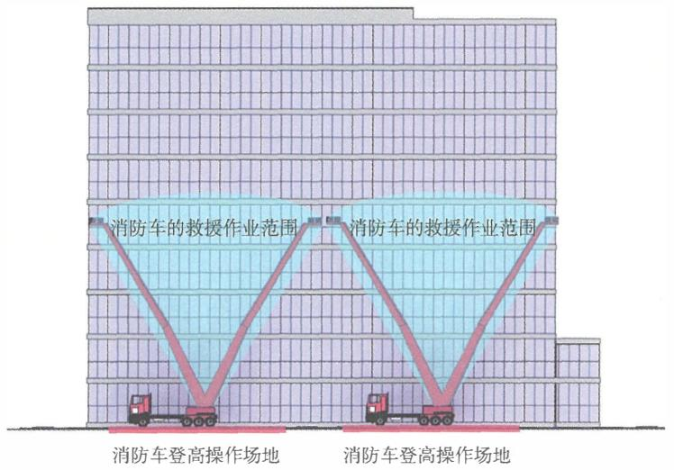

图3-5 消防车登高操作场地间隔布置时的间距确定方法示意图

有关消防车登高操作场地间隔设置的技术要求， 可参见国家 标准《建筑设计防火规范》GB50016—2014(2018年版）的规定。 例如， 该标准第7.2.1条规定， 建筑高度不大于 $5 0 \mathrm { m }$ 的建筑连续 布置消防车登高操作场地确有困难时， 可间隔布置，但间隔距离 不宜大千 $3 0 \mathrm { m }$ , 且消防车登高操作场地的总长度仍不应小千建筑 周长的1/4和一条长边的长度。 在实际工程建设中， 消防车登高 操作场地的间隔距离， 应根据建筑的高度和属地消防救援车辆配 置情况， 在征询消防救援机构意见后确定， 以更好地满足实际消 防救援的需要。 

# 3.4.7 消防车登高操作场地应符合下列规定：

1 场地与建筑之间不应有进深大于 $4 \mathrm { m }$ 的裙房及其他妨 碍消防车操作的障碍物或影响消防车作业的架空高压电线； 

2 场地及其下面的建筑结构、 管道和管沟等应满足承 受消防车满栽时压力的要求； 

3 场地的坡度应满足消防车安全停靠与消防救援作业 的要求。 

# ［条文要点］

本条规定了消防车登高操作场地的基本功能和关键性能要 求，有关性能要求不是全部的性能要求。场地与建筑外墙的水平 距离、 与建筑出入口和汽车库出入口的关系等其他性能要求和具 体参数，还应根据建筑的高度和类型等因素， 按照现行国家标准 《建筑设计防火规范》GB 50016等技术标准的要求确定。 

# 【实施要点】

消防车登高操作场地是供消防车到达火场后，为满足举高 类消防车停靠、 展开和从建筑外部实施灭火与救援行动要求而在 建筑周围设置的场地， 主要针对高层工业与民用建筑的火灾扑救 和人员救助。根据国家标准《消防车第12部分：举高消防车》 GB 79 56.12一 2015的规定，举高消防车应有上、 下车互锁功能， 臂架（梯架）在支腿展开调平并支撑可靠之前不能运动， 下车支 腿在臂架（梯架）未收回到支撑托架之前不能收回。上、 下车互 锁功能应自动实现。臂架（梯架）在运动过程中， 当任一支腿出 现不受力情况， 应有声光报警信号， 并且臂架（梯架）不能继 续向危险方向运动，但可以向安全方向运动。举高车应有支腿调 平或回转平台调平的能力， 调节范围不应小千 $5 ^ { \circ }$ 。登高平台消 防车支腿伸展、 支撑并调平的时间不应大千50s, 云梯消防车和 举高喷射消防车支腿伸展、 支撑并调平的时间不应大于 $4 0 \mathrm { s }$ 。因 此，消防车登高操作场地的宽度、 平整度和坡度应满足举高类消 防车安全停靠和展开操作的要求。 

以国产 $3 2 \mathrm { m }$ 登高平台消防车为例， 支腿架的纵向跨距不小 千 $6 \mathrm m$ , 横向跨距不小千 $5 . 7 \mathrm { m } \mathrm { _ { 6 } }$ 因此， 消防车登高操作场地的最 小长度和宽度分别不应小千 $1 5 \mathrm { m }$ 和 $8 \mathrm { m }$ , 场地的大小还要结合与 消防车道的关系、 需使用的消防车的类型、 建筑的救援高度综合 考虑， 并尽可能增大。 

消防车登高操作场地或其他消防车操作场地以及场地下面的 建筑结构、 管道和暗沟等的承载力， 应根据建筑的高度、 规模、 

当地现役或未来可能配备的消防车的型号和满载总重量，按照消 防车轮压或支腿的作用压强核算， 详见本指南第3.4.4条的【实 施要点］。在实际工程建设的规划和设计阶段， 应详细调查当地 消防救援机构装备的消防车辆的参数，并积极征询当地消防救援 机构的意见。 