# 4 建筑平面布置与防火分隔

# 4.1 一般规定

4.1.1 建筑的平面布置应便于建筑发生火灾时的人员疏散和避难，有利于减小火灾危害及控制火势和烟气的蔓延。同一建筑内的不同使用功能区域之间应进行防火分隔。 

# 【条文要点】

建筑的平面布置是针对建筑内不同功能或不同用途区域的布置与分隔、交通路线与疏散路线的规划。本条规定了建筑平面布置的基本原则和功能要求，即应综合考虑建筑不同区域、房间的用途和火灾危险性，建筑整体的耐火性能，火灾时人员的疏散路径，空间视线与室内净空高度，使用人员的密度、构成和分布等，以及其他可能影响人员疏散安全和火灾、烟气蔓延的因素，通过建筑内平面的合理布置控制火灾与烟气蔓延，提高人员疏散的安全性，有利于灭火救援和降低火灾风险。 

# 【实施要点】

（1）不同使用性质或使用功能的建筑由多种不同使用用途的空间构成，不同使用用途的场所对建筑内部空间、人员疏散和防止火灾蔓延的要求不同，仓库建筑和住宅建筑的平面布置较简单，生产性建筑和多功能的公共建筑较复杂。无论何种使用功能的建筑，建筑内部的平面布置均应满足建筑功能和消防安全的需要。 

建筑在平面布置上的消防安全主要体现在： 

1）可以降低火灾危险性大的部位或区域在发生火灾时对相邻其他区域的危害，如有利于缩短影响生产、商业经营和公用设施的持续性或恢复时间。 

2）可以减少火灾带来的经济损失，如可以更有效地将火灾的过火面积和烟气蔓延限制在较小的范围内。 

3）有利于人员疏散和消防救援人员安全进入并展开人员救助和内攻灭火，如在建筑对应救援场地的范围内设置救援通道和人员疏散通道与出口、消防救援口，并与内部疏散通道或疏散走道连通。 

（2）在建筑防火方面，建筑的平面布置一般要符合以下基本要求： 

1）火灾危险性较大的场所尽量布置在建筑的上部，或者将火灾危险性较大的场所尽量集中布置在发生火灾或爆炸时对建筑结构、人员疏散影响较小、不容易蔓延扩大和容易扑救与控制的部位。例如，在生产厂房中将甲、乙类生产工段或部位布置在建筑的上部；在存放丁类、丙类物质的仓库中，将丙类库房设置在建筑的上部；将具有爆炸危险性的生产工序布置在靠近外墙的部位。但这些布置方式又是相对的，并且还要区别火灾危险性的不同方面，综合方便和提高外部救援效果等影响进行平面布置。因为火灾危险性大的场所既包括火灾扑救难度大的场所，又包括人员疏散难度大的场所，或者两者兼具的场所。 

2）供疏散行为能力较弱的人员使用的场所、人员密集的场所（应注意区别“人员密集场所”）要尽量布置在建筑的下部或较低楼层。例如，儿童活动场所、老年人照料设施、病房、残障人员活动室等场所。这些场所除需与其他区域防火分隔外，还要尽量布置在建筑的下部楼层，并具有独立的疏散出口；建筑面积较大的会议室、多功能厅、展厅等“人员密集的场所”，以及歌舞厅、游艺厅、夜总会、卡拉OK厅、剧本杀活动室、密室逃生类场所等易引发群死群伤的高火灾风险场所，要尽量布置在建筑的下部楼层或者严格控制相应房间的大小。 

3）疏散路径应明确、顺畅，疏散出口和疏散楼梯的布置应便于人员发现和疏散。例如，将疏散出口布置在人员经常出入和火灾时易于发现的位置，疏散楼梯间尽量靠建筑的外墙布置，使疏散楼梯间具有较好的自然通风条件、疏散人员到达首层后可以直接通至室外安全地点；为疏散能力弱的人员疏散设置专用的疏散出口或疏散楼梯等。 

4）当在同一使用性质的建筑物内混合设置多种不同使用功能的场所时，应对这些场所进行防火分隔。例如，在一座商业综合体内设置影剧院或电影放映厅，则影剧院或电影放映厅应与其他功能场所分隔，并且一般需要独立划分防火分区；在一座公共建筑内，餐饮场所与办公场所之间应采取防火分隔措施，并应分别划分防火分区；在一座生产厂房内设置中间仓库，则库房应与生产区域分隔，并一般也需要独立划分防火分区。 

在同一使用功能的建筑中，火灾危险性大的房间或区域与火灾危险性小的房间或区域之间也要采取防火分隔措施。例如，在一座公共建筑内，变电站、锅炉房和柴油发电机房等用房与其他部位之间，应采用防火墙或耐火极限不低于 $2.00\mathrm{h}$ 的防火隔墙、甲级或乙级防火门分隔；在一座办公建筑内，图书室、报告厅、多功能厅与其他房间或部位之间应采用防火隔墙分隔；在一座生产厂房内，锅炉房等公用设施、辅助办公室、控制室等应采用防火隔墙或防火墙与生产区分隔。 

（3）不同使用性质的场所不能组合在同一座建筑内建造。例如，在民用建筑内不允许设置生产场所，各类火灾危险性的生产场所和仓库不应与民用建筑上、下组合或水平组合建造。但是，在民用建筑内，允许布置为满足所在建筑使用功能和方便使用的常用物品储藏室。详见本指南第4.3.1条的【实施要点】。 

直接为生产服务的办公场所、实验室等（如产品质量在线抽查、在线监控、员工临时休息等场所）可以与生产场所合建或设置在厂房内，但应符合相应的防火要求。为全厂服务的办公建筑、员工宿舍等场所，不是生产过程中必须设置在车间或厂房内的生产辅助设施，应独立建造，不应与生产场所合建。这些办公建筑、宿舍建筑等应符合民用建筑的相关防火要求。 

（4）同一使用性质的建筑由多种不同使用功能组合建造时，不同使用功能区域之间应进行防火分隔，是一项重要的防火技术要求。在同一座建筑中，不同使用功能的区域通过合理分隔后，可以结合建筑的高度和各自功能区域的实际火灾危险性确定相应区域内的防火标准。有关防火分隔应满足的要求，需要根据建筑 

中这些功能区域的规模、火灾危险性、建筑高度，以及位于地上还是地下等因素确定。例如，办公建筑与旅馆建筑组合建造，两者之间在横向可以设置防火墙，在竖向可以根据所在建筑的耐火等级对楼板的耐火性能要求采用相应耐火性能的楼板分隔，但对于三、四级耐火等级的建筑，则应相应提高分隔部位楼板的耐火性能；建筑的地上楼层与地下楼层之间应在首层采用楼板分隔，楼板的耐火性能不应低于一级耐火等级相应使用性质的建筑对楼板的耐火性能要求，且耐火极限不应低于 $1.50\mathrm{h}$ 。 

对于一些特殊的建筑，不同功能之间的防火分隔要求应相应提高。例如，国家标准《地铁设计防火标准》GB51298—2018第4.1.6条规定，在站厅公共区同层布置的商业等非地铁功能的场所应采用防火墙与站厅公共区进行分隔，相互间宜采用下沉广场或连接通道等方式连通，不应直接连通；第4.1.7条规定，车辆基地建筑的上部不宜设置其他使用功能的场所或建筑，确需设置时，车辆基地与其他功能场所之间应采用耐火极限不低于3.00h的楼板分隔，车辆基地建筑的承重构件的耐火极限不应低于3.00h，楼板的耐火极限不应低于2.00h。采用这样的防火分隔措施分隔后，地铁部分与非地铁功能部分的防火设防标准可以分别确定。又如，国家标准《建筑设计防火规范》GB50016—2014（2018年版）第5.4.10条规定，住宅建筑与除商业服务网点外的其他使用功能的建筑合建时，住宅部分与非住宅部分之间应采用耐火极限不低于2.00h且无门窗、洞口的防火隔墙和1.50h的不燃性楼板完全分隔；当住宅建筑和非住宅部分的总建筑高度大于 $24\mathrm{m}$ 时，应采用无门窗、洞口的防火墙和耐火极限不低于2.00h的不燃性楼板完全分隔。采用这样的防火分隔措施分隔后，住宅和非住宅部分的防火设防标准可以区别对待。 

4.1.2 工业与民用建筑、地铁车站、平时使用的人民防空工程应综合其高度（埋深）、使用功能和火灾危险性等因素，根据有利于消防救援、控制火灾及降低火灾危害的原则划分防火分区。防火分区的划分应符合下列规定： 

1 建筑内横向应采用防火墙等划分防火分区，且防火 

分隔应保证火灾不会蔓延至相邻防火分区； 

2 建筑内竖向按自然楼层划分防火分区时，除允许设置敞开楼梯间的建筑外，防火分区的建筑面积应按上、下楼层中在火灾时未封闭的开口所连通区域的建筑面积之和计算； 

3 高层建筑主体与裙房之间未采用防火墙和甲级防火门分隔时，裙房的防火分区应按高层建筑主体的相应要求划分； 

4 除建筑内游泳池、消防水池等的水面、冰面或雪面面积，射击场的靶道面积，污水沉降池面积，开式的外走廊或阳台面积等可不计入防火分区的建筑面积外，其他建筑面积均应计入所在防火分区的建筑面积。 

# 【条文要点】

本条规定了在各类房屋建筑内划分防火分区的基本原则和防火分区的基本功能要求。平时使用的人民防空工程，地铁工程的车站、设备区和车辆基地，隧道的辅助设备用房等建筑的防火分区划分也应符合本条的规定。 

# 【实施要点】

（1）防火分区是在建筑内部采用防火墙、楼板及其他防火分隔设施分隔而成，能在一定时间内防止火灾向同一建筑的其余部分蔓延的局部空间。在建筑内划分防火分区有利于控制火灾蔓延和减少火灾损失，是建筑防火中一项重要的被动防火技术措施。因此，防火分区是在建筑内部划分的一个用于控制火灾蔓延、减少火灾危害或损失的局部空间，用分区的建筑面积表示。 

（2）防火分区周围应采用楼板、墙体、防火门等能够防止火势和烟气蔓延的耐火构配件、结构或其他防火分隔设施围合封闭。防火分区的主要作用为： 

1）将建筑内发生的火灾控制在一个限定的空间内，以减少火灾对建筑结构、生产生活设施以及室内财产等造成的破坏或损失。 

2）为建筑内其他防火分区内的人员争取更多的疏散与逃生时间。 

3）便于组织应急救援和灭火。 

因此，建筑需要根据其内部空间的特点（如空间高度、几何形状、上下层或水平方向的连通情况）、不同空间内的功能或用途（如生产的连续性、汽车库的车道、商业的动线设计、居室的私密性等）合理地划分防火分区。 

(3) 防火分区主要有按竖向和水平方向划分两种方式, 因而防火分区也有水平防火分区和竖向防火分区两种类型。水平防火分区用以防止火灾在水平方向扩大蔓延, 竖向防火分区用以防止火灾在多层或高层建筑的层与层之间竖向蔓延。 

1）水平防火分区是指采用防火墙、防火卷帘、防火门及防火分隔水幕等分隔设施，在各楼层的水平方向分隔出的防火区域，它可以阻止火灾在楼层的水平方向蔓延。 

2）竖向防火分区是利用耐火楼板等在建筑之间划分的防火分隔区域。火灾常常沿着建筑物各种竖向井道和开口向上部或下部楼层蔓延，烟气在建筑内竖向向上蔓延的速度是水平方向蔓延速度的数倍，人员竖向的疏散速度远小于烟气竖向向上的蔓延速度，且相互逆向运动，烟气对上部楼层人员的疏散安全威胁更大。因此，竖向防火分区在多层、高层建筑防火中发挥着重要的作用。 

在建筑的竖向，不仅要采用耐火楼板分隔，而且建筑外部还通常需要采用在外墙开口处设置防火挑檐、窗槛墙等方法防止火灾经建筑外立面的开口蔓延。建筑内部设置的敞开楼梯、自动扶梯、中庭、工艺开口，以及电线电缆井、管道竖井、电梯井等，也是容易蔓延火灾和烟气的途径，需要采用防火分隔墙体等分别划分为单独的防火区域，以实现竖向防火分隔的目标。 

3）无论竖向的防火分区还是水平方向的防火分区，均要控制一个防火分区的建筑面积，确保防火分区之间分隔措施的可靠性和有效性，尽可能减少火灾的危害。防火分区的建筑面积是建筑防火的一项重要控制指标。对此，国家相关技术标准根据建筑的火灾危险性类别、建筑高度、使用功能、耐火等级或结构类型等，并区别地上建筑与地下建筑，分别规定了不同建筑中一个防 

火分区的最大允许建筑面积。在实际建筑中，除本规范有明确规定者外，各类建筑中一个防火分区的最大允许建筑面积均可以根据国家相应技术标准的规定确定。例如，国家标准《建筑设计防火规范》GB50016—2014（2018年版）第5.3.1条规定了不同耐火等级民用建筑中一个防火分区最大允许建筑面积的基本值，即不同耐火等级建筑的防火分区最大允许建筑面积应符合表4-1的要求。 

表 4-1 不同耐火等级建筑的防火分区最大允许建筑面积

<table><tr><td>名称</td><td>耐火等级</td><td>防火分区的最大允许建筑面积/m2</td><td>备注</td></tr><tr><td>高层民用建筑</td><td>一、二级</td><td>1500</td><td rowspan="2">对于体育馆、剧场的观众厅,防火分区的最大允许建筑面积可适当增加</td></tr><tr><td rowspan="3">单、多层民用建筑</td><td>一、二级</td><td>2500</td></tr><tr><td>三级</td><td>1200</td><td>-</td></tr><tr><td>四级</td><td>600</td><td>-</td></tr><tr><td>地下或半地下建筑(室)</td><td>一级</td><td>500</td><td>设备用房的防火分区最大允许建筑面积不应大于1000m2</td></tr></table>

（4）作为建筑中一项重要的被动防火措施，建筑内的人员安全疏散和消防给水排水、通风、电气等的防火设计，均与防火分区的划分和分隔方式紧密相关。在建筑内划分防火分区可以在建筑中某部位发生火灾时有效地把火灾控制在限定的防火分隔区域内，并可以为人员安全疏散、消防扑救提供有利条件。防火分区的划分应综合考虑建筑的使用性质、火灾危险性、建筑高度、耐火等级、消防设施配置等因素，并应遵循如下基本原则： 

1）应结合建筑的使用功能需要，以有利于减少火灾损失为原则划分防火分区，尽量与建筑内的使用功能分区协调，使防火分区不仅能满足防火的需要，而且能更好地满足生产、生活等使用功能的需要。在一座建筑内可能具有多种用途的场所，火灾危险性可能各不相同，因此不同使用功能或火灾危险性类别场所的防火分区允许有所区别。如建筑中商店营业厅的防火分区建筑面积允许较办公区域的防火分区大些；火灾危险性大的建筑，防火分区的面积应控制严格些。反之，可以划分得大些。如甲类生产车间的防火分区应小于丙类生产车间的防火分区。 

2）应结合区域内的火灾荷载高低、可燃物的形态和分布对火灾蔓延速度和作用范围的影响划分防火分区。火灾蔓延速度快或短时间蔓延面积大的区域、使用性质重要的建筑（如一类高层建筑）、火灾危险性类别高的场所和建筑（如甲、乙类工业建筑）、扑救难度大的建筑和场所（如地下建筑和高层建筑），防火分区的建筑面积应严格控制。 

有关建筑火灾荷载的分类、调查和统计的方法，参见国家现行消防行业标准《建筑火灾荷载调查与统计分析方法》XFT1427等标准。 

3）应结合火灾对建筑结构的作用和火灾控制难度划分防火分区。建筑的防火分区与建筑的耐火等级关系密切。建筑的耐火等级高，防火分区可以大些；建筑高度高或位于地下，火灾扑救难度大，应严格控制防火分区面积的大小。耐火等级低的建筑、难燃和可燃结构较多的建筑，有关结构的耐火性能要求较低，要控制和减小防火分区的建筑面积，使火灾的作用时间短，并便于灭火救援和控制火灾规模。如高层建筑或地下建筑的防火分区要比单、多层地上建筑的防火分区要小，三级和四级耐火等级建筑的防火分区要较一级和二级耐火等级建筑的防火分区小。 

4）自身具有较强灭火、控火能力的建筑，防火分区可以划分大些。例如，设置自动喷水灭火系统的防火分区，建筑面积允许增加。 

5）建筑内的防火分区大小与建筑的安全疏散相关，但在划 

分防火分区时不应以防火分区的建筑面积大小未超过其最大允许值而弱化疏散设施的安全性。例如，一座二级耐火等级的3层小型商店建筑，每层建筑面积为 $500\mathrm{m}^2$ ，则该商店建筑每层至少应设置2座封闭楼梯间，不能因该建筑3层的总建筑面积不大于一个防火分区的最大允许建筑面积（ $2500\mathrm{m}^2$ ）而采用敞开楼梯间。 

（5）在计算建筑中防火分区的建筑面积时，应注意以下事项： 

1）建筑内的水面、冰面和雪面所处区域、射击场的靶道、污水沉降池对火灾及其危害的贡献很小，在计算这些区域所在防火分区的最大允许建筑面积时，可以扣除建筑内游泳池和消防水池的水面面积、溜冰场的冰面面积、滑雪场的雪面面积、射击场的靶道面积、污水沉降池的面积。 

2）建筑中开式的外走廊、阳台以及天桥，属于建筑外围护结构外的区域，不属于室内空间，这些区域的面积可以不计入相应防火分区。建筑之间的连廊应视其功能和分隔情况确定是否需要单独划分防火分区，或将其建筑面积计入相邻任一建筑的防火分区。 

3）建筑内上下楼层的连通开口破坏了建筑竖向防火分区的完整性，会导致火灾在不同楼层之间蔓延。所有通过这些开口连通的区域的建筑面积，除上述第1）项中可不计入的面积外，均应叠加计算后计入同一个防火分区的建筑面积。 

4）在生产厂房内因生产工艺要求设置的局部工艺夹层、操作平台、检修平台，一般无人操作或者操作人员、检修人员的数量少。当平时在上述区域内的使用人数少于10人时，相应防火分区的建筑面积通常可以不计算这些区域的建筑面积。 

4.1.3 下列场所应采用防火门或防火窗、耐火极限不低于 $2.00\mathrm{h}$ 的防火隔墙和耐火极限不低于 $1.00\mathrm{h}$ 的楼板与其他区域分隔： 

1 住宅建筑中的汽车库和锅炉房； 

2 除居住建筑中的套内自用厨房可不分隔外，建筑内的厨房； 

3 医疗建筑中的手术室或手术部、产房、重症监护室、贵重精密医疗装备用房、储藏间、实验室、胶片室等； 

4 建筑中的儿童活动场所、老年人照料设施； 

5 除消防水泵房的防火分隔应符合本规范第4.1.7条的规定，消防控制室的防火分隔应符合本规范第4.1.8条的规定外，其他消防设备或器材用房。 

# 【条文要点】

本条规定了各类建筑中需要重点防火保护的房间应进行防火分隔，并规定了这些部位防火分隔的基本性能要求，使这些房间的火灾不会蔓延和危及其他相邻区域，或者其他区域的火灾不会影响这些房间的消防安全。 

# 【实施要点】

（1）本条规定的场所与相邻区域之间的防火隔墙和防火分隔楼板，一般应为不燃性墙体，但木结构建筑和耐火等级低的建筑也可以根据建筑相应部位的构造情况采用难燃性墙体，但耐火极限不应低于本条规定。本条未明确设置在防火隔墙上的门、窗的耐火性能要求，有关要求统一在本规范第6.4节中作了规定。在实际建筑中，这些门、窗的耐火性能应根据所在防火隔墙的耐火性能要求，按照本规范第6.4节的相关规定确定。 

（2）本条规定住宅建筑主要针对新建、改建和扩建的独立式住宅建筑、小型住宅建筑，以及既有住宅建筑的改造。这些建筑设置的汽车库和锅炉房规模小，但火灾危险性大，对建筑的火灾危害大，容易忽视而不采取防火分隔措施。因此，为住宅建筑服务的汽车库和锅炉房尽可能独立设置；需要设置在住宅建筑内时，应按照本条要求分隔。例如，国家标准《锅炉房设计标准》GB50041—2020第4.1.4条规定，住宅建筑物内不宜设置锅炉房。对于规模较大的住宅建筑，公用汽车库和锅炉房大多独立设置，或者根据本规范第4.1.5条和第4.3.2条的规定已经要求采取相应的防火分隔措施。 

（3）本条规定的居住建筑包括住宅建筑、宿舍建筑、公寓建筑等供特定人员较长时间固定居住的建筑。这些建筑中的套内或 

户内独立的自用厨房，考虑到使用方便和不同生活方式的需要，在与起居室等房间之间可以不进行防火分隔，但一般应与卧室分隔。其他工业与民用建筑内的厨房，包括居住建筑中的共用厨房，均应与其他区域分隔，相应的防火分隔要求除应符合本条规定外，还应根据厨房内使用燃料和建筑面积大小采取更加安全、可靠的防火分隔措施。例如，使用燃气部位较多的厨房，应在燃气使用部位采用防爆墙或抗爆墙与相邻场所分隔；建筑面积大的工业厨房，应适当提高防火隔墙和隔墙上门、窗的耐火极限。 

（4）医疗建筑中的手术室、手术部、产房、重症监护室，在防火分隔时要注意兼顾使用上的便利性和防止火灾蔓延的需要。相关规定还可以参见现行国家标准《综合医院建筑设计规范》GB51039、《医院洁净手术部建筑技术规范》GB50333等技术标准。这些标准均要求综合医院建筑、洁净手术部建筑以及设置洁净手术部的建筑，耐火等级不应低于二级，并且规定了在这些建筑中相应场所的防火分隔要求。 

本条规定的“贵重精密医疗装备用房”，可以根据现行国家标准《综合医院建筑设计规范》GB51039的规定确定；医疗建筑中的储藏间，主要为医疗建筑中存放医疗用品、药品的房间以及病案室等。 

（5）本条规定的场所，除明确具体用途的房间外，一般为由多个不同用途的房间构成的一个区域，不一定是一个独立的房间。在这些区域内的房间之间、房间与疏散走道之间，可以根据相应技术标准的要求采取防火分隔措施。例如，现行国家标准《建筑设计防火规范》GB 50016、现行行业标准《幼儿园、托儿所建筑设计规范》JGJ 39、《老年人照料设施建筑设计标准》JGJ 450 等技术标准的规定。 

（6）本规范规定的“儿童活动场所”均指托儿所、托育机构和幼儿园的儿童用房，用于12周岁及以下儿童游艺、校外培训等活动的场所；不包括小学学校的教学用房。 

老年人照料设施是指为老年人提供集中照料服务的设施，是老年人全日照料设施和老年人日间照料设施的统称，包括日间照 

料设施、全日照料设施。本规范规定的“老年人照料设施”均是指床位总数大于或等于20床的老年人全日照料设施、可容纳的老年人总数大于或等于20人的老年人日间照料设施；不包括床位总数少于20床的老年人全日照料设施、可容纳的老年人总数少于20人的老年人日间照料设施，也不包括老年大学、老年活动中心等其他专供老年人使用的设施或场所。 

（7）设置在建筑内的消防水泵房和消防控制室，与相邻区域的防火分隔应分别符合本规范第4.1.7条和第4.1.8条的规定。其他消防设备或器材用房，包括微型消防站、自动灭火系统的设备室（如气体灭火系统的灭火剂储瓶间、干粉灭火系统的灭火剂储瓶间）、机械加压送风防烟系统中的送风机房、机械排烟系统中的排烟风机房、消防电梯机房、应急救援器材间、除本规范有关条文规定外的应急发电机房或应急电源室等。 

应注意的是，根据国家标准《建筑设计防火规范》GB50016—2014（2018年版）第7.3.6条的规定，消防电梯机房之间除应采用耐火极限不低于 $2.00\mathrm{h}$ 的防火隔墙分隔外，设置在防火隔墙上的连通门应采用甲级防火门，而不是乙级防火门；楼板的耐火极限不应低于所在建筑的相应要求，即对于一级耐火等级的建筑，楼板的耐火极限不应低于 $1.50\mathrm{h}$ ，对于二级耐火等级的建筑，楼板的耐火极限不应低于 $1.00\mathrm{h}$ 。 

4.1.4 燃油或燃气锅炉房、可燃油油浸变压器室、充有可燃油的高压电容器和多油开关、柴油发电机房等独立建造的设备用房与民用建筑贴邻时，应采用防火墙分隔，且不应贴邻建筑中人员聚集的场所。上述设备用房附设在建筑内时，应符合下列规定： 

1 当位于人员密集的场所的上一层、下一层或贴邻时，应采取防止设备用房的爆炸作用危及上一层、下一层或相邻场所的措施； 

2 设备用房的疏散门应直通室外或安全出口； 

3 设备用房应采用耐火极限不低于 $2.00\mathrm{h}$ 的防火隔墙和耐火极限不低于 $1.50\mathrm{h}$ 的不燃性楼板与其他部位分隔， 

防火隔墙上的门、窗应为甲级防火门、窗。 

# 【条文要点】

本条规定了燃油或燃气锅炉房、可燃油油浸变压器室、充有可燃油的高压电容器室、多油开关室、柴油发电机房等具有较大火灾危险性场所单独建造和附设在建筑内时的基本防火要求。有关防火分隔的其他要求、平面布置的要求，还需要根据这些设施相应建筑设计标准的规定确定，例如，现行国家标准《锅炉房设计标准》GB50041、《民用建筑电气设计标准》GB51348、《火力发电厂与变电站设计防火标准》GB50229、《城镇燃气设计规范》GB50028等技术标准的规定。 

# 【实施要点】

（1）锅炉房的火灾危险性与丁类厂房相当，可燃油油浸变压器室、充有可燃油的高压电容器室、多油开关室、柴油发电机房等的火灾危险性大部分与丙类厂房相当。这些设备用房实际上是保证各类建筑使用功能的附属设施，不能简单地将其视为某一类别火灾危险性的生产厂房。这些设备用房当独立建造时，相应的防火设计要求可以比照相应类别火灾危险性生产厂房的要求确定；当设置在工业或民用建筑、地铁车站、隧道工程等建筑内时，应视为工业或民用建筑中的一部分，比照相应的火灾危险性采取必要的防火分隔等措施，但应控制相应的设备规模或容量，以确保建筑的消防安全。 

（2）本条规定的设备用房以及与这些设备用房火灾危险性相当的其他设备用房，均具有一定的火灾危险性，有的还具有爆炸危险性，应尽量独立建造且不与其他建筑贴邻。当受条件限制（如城市用地或地形条件不满足设置防火间距的要求等）需与其他建筑贴邻，甚至采用嵌入等方式与其他建筑合建时，需视具体部位的火灾与爆炸危险性采用抗爆墙、防爆墙或防火墙分隔，并应避开会议室、多功能厅、餐厅、营业厅、站厅、观众厅、教室等人员密集的场所；当受条件限制需布置在建筑内时，应采用防火墙或耐火极限不低于 $2.00\mathrm{h}$ 的防火隔墙、耐火极限不低于 $1.50\mathrm{h}$ 的不燃性楼板与其他部位分隔，且在正常情况下不允许直 

接设置在建筑中人员密集的场所的上一层、下一层，也不应直接与人员密集的场所相邻。这些设备用房之间的防火分隔尚应符合本规范第4.1.5条、第4.1.6条的规定。 

燃油或燃气锅炉、可燃油油浸变压器、充有可燃油的高压电容器和多油开关等在建筑内的布置，除应符合本规范的基本要求外，还应符合现行国家相关技术标准的规定。例如，国家标准《汽车库、修车库、停车场设计防火规范》GB50067—2014第4.1.11条规定，燃油或燃气锅炉、可燃油油浸变压器、充有可燃油的高压电容器和多油开关等不应设置在汽车库、修车库内。 

（3）当这些设备用房受建筑平面布置限制，不得不设置在人员密集的场所的上一层、下一层或贴邻时，应采取防止设备用房的火灾或爆炸作用危及上一层、下一层或相邻场所的措施。例如，提高分隔楼板、墙体及下部承重梁、柱的结构强度和抗爆性能，在连接处设置双层楼板隔腔或双墙体隔腔，在承重结构表面设置减压设施等吸能设施等。对于可以确定在使用过程中不存在爆炸危险性的设备用房，只需要采取不低于本条第3款规定的防火分隔措施，不需要采取防爆分隔、爆炸泄压等技术措施。 

（4）这些设备用房与其他部位的防火分隔楼板，耐火性能不应低于本条的规定，即使建筑的耐火等级低于一级，建筑允许采用耐火极限低于 $1.50\mathrm{h}$ 或难燃性的楼板时，也不允许降低防火分隔楼板的耐火极限。例如，在木结构建筑中，楼层间的防火分隔楼板允许采用难燃性楼板；在二级及以下耐火等级的其他类型结构建筑中，楼层间的防火分隔楼板允许采用耐火极限低于 $1.50\mathrm{h}$ 的不燃性或难燃性楼板，但在设置本条规定的设备用房处的上、下层防火分隔楼板，均应为耐火极限不低于 $1.50\mathrm{h}$ 的不燃性楼板。 

（5）设备用房的疏散门应直通室外或安全出口。以下疏散门均符合此要求： 

1）设备用房的疏散门直接通向室外地坪、下沉式广场或庭院的地面。 

2）设备用房的疏散门直接通向疏散楼梯间，经过疏散走道或门厅等区域，但不需要经过其他使用功能的区域就可以到达室外。 

3）设备用房的疏散门经过疏散走道或门厅等直接进入安全出口。 

因此，这些设备用房应注意结合建筑内的不同功能区域和本规范第4.1.5条的规定合理选择设置位置。 

（6）对于采用六氟化硫气体和氟碳绝缘冷却液等不燃介质绝缘的变压器，变压器的容量及相关设置位置和防火分隔等要求，本规范不作强制规定，可以按照现行国家标准《建筑设计防火规范》GB50016等技术标准的规定确定。其中，充装六氟化硫气体等介质的干式变压器尽管火灾危险性较小，但工作时易升温，仍存在一定火灾危险性，应设置在专用房间内，并使之具有良好的通风条件或设置相应的散热措施。 

4.1.5 附设在建筑内的燃油或燃气锅炉房、柴油发电机房，除应符合本规范第4.1.4条的规定外，尚应符合下列规定： 

1 常（负）压燃油或燃气锅炉房不应位于地下二层及以下，位于屋顶的常（负）压燃气锅炉房与通向屋面的安全出口的最小水平距离不应小于 $6\mathrm{m}$ ；其他燃油或燃气锅炉房应位于建筑首层的靠外墙部位或地下一层的靠外侧部位，不应贴邻消防救援专用出入口、疏散楼梯（间）或人员的主要疏散通道。 

2 建筑内单间储油间的燃油储存量不应大于 $1\mathrm{m}^3$ 。油箱的通气管设置应满足防火要求，油箱的下部应设置防止油品流散的设施。储油间应采用耐火极限不低于 $3.00\mathrm{h}$ 的防火隔墙与发电机间、锅炉间分隔。 

3 柴油机的排烟管、柴油机房的通风管、与储油间无关的电气线路等，不应穿过储油间。 

4 燃油或燃气管道在设备间内及进入建筑物前，应分别设置具有自动和手动关闭功能的切断阀。 

4.1.6 附设在建筑内的可燃油油浸变压器、充有可燃油的高压电容器和多油开关等设备用房，除应符合本规范第4.1.4条的规定外，尚应符合下列规定： 

1 油浸变压器室、多油开关室、高压电容器室均应设 

置防止油品流散的设施； 

2 变压器室应位于建筑的靠外侧部位，不应设置在地下二层及以下楼层； 

3 变压器室之间、变压器室与配电室之间应采用防火门和耐火极限不低于 $2.00 \mathrm{~h}$ 的防火隔墙分隔。 

# 【条文要点】

这两条根据燃油或燃气锅炉房、柴油发电机房、可燃油油浸变压器室、充有可燃油的高压电容器室和多油开关室的火灾危险性，进一步明确规定了这些设备用房附设在其他建筑内的具体设置位置要求以及减少相应火灾危害的关键技术措施。本规范第4.1.6条规定的变电站不包括嵌入式或贴邻式变电站，有关嵌入式或贴邻式变电站的平面布置要求应符合国家现行相关标准的规定。 

# 【实施要点】

（1）在建筑平面布置中，应严格限制燃油或燃气锅炉房、柴油发电机房、可燃油油浸变压器室、充有可燃油的高压电容器室和多油开关室在建筑内的楼层位置，尽量减小这些设施发生事故对建筑本身及相邻区域的危害性作用，同时也便于通风换气和灭火救援。其中，燃气锅炉房的设置位置还需考虑方便设置必要的泄压设施或泄压面积。 

在建筑中，可燃油油浸变压器室、充有可燃油的高压电容器室和多油开关室不应直接贴邻建筑中的疏散楼梯间（包括室外疏散楼梯、下沉式庭院或广场中通向地面的疏散楼梯等），人员密集的场所的主要疏散通道、疏散走道（包括地铁车站的出入口通道、建筑的室外疏散小巷等通道），消防救援专用出入口。 

消防救援专用出入口包括深埋地铁车站的消防专用通道的出入口、隧道工程中的消防专用通道的出入口、建筑中连接消防电梯的专用通道在建筑内和建筑外墙上的出入口。消防专用通道是建筑中供消防救援人员从地面进入建筑展开灭火救援的专用通道和楼梯间等。 

(2) 燃油锅炉房的用油量相对较大, 一般应将燃油采用储罐设置在建筑外, 并通过管道输送进锅炉房。因此, 本规范主要 

针对柴油发电机房，也包括用油量较少的小型锅炉房。考虑到有些用途的建筑中设置的柴油发电机组较多且可能比较分散的情形（如电信建筑、数据存储建筑、大中型计算中心等建筑中的应急发电机房），本规范以一座建筑在同一时间内只发生一次火灾为基础确定了相应的防火基准，因此未严格限制设置在建筑内的储油罐的总储油量，只限制单间储油间内的总储油量。 

此外，储油间在使用过程中存在可燃蒸气聚集的情形，除需要加强通风外，在储油间内不应敷设和穿过与储油间使用用途无关的其他供油管道、电气线路及其他管道。 

(3) 燃油或燃气锅炉房存在一定的爆炸危险性, 储油间和可燃油油浸变压器具有在事故时形成流淌火蔓延的危险性。因此,在平面布置中, 对储油间、油浸变压器室不仅要做好防火分隔与流散油的收集措施, 而且要限制充油量大的变压器附设在建筑内,降低火灾及其蔓延的危险性。防止逸漏的可燃液体流散的措施主要有: 设置事故油池、围堰和采用管道将收集的可燃液体外引集中处理。当事故油池容量较大时, 应采取铺设鹅卵石等隔油措施。 

有关事故油池的容量及其设置标准参见现行国家标准《3~110kV高压配电装置设计规范》GB50060、《20kV及以下变电所设计规范》GB50053和《火力发电厂与变电站设计防火标准》GB50229等技术标准的规定。例如，国家标准《3~110kV高压配电装置设计规范》GB50060—2008第5.5.2条规定，屋内单台电气设备的油量在 $100\mathrm{kg}$ 以上时，应设置贮油设施或挡油设施。挡油设施的容量应按容纳 $20\%$ 油量设计，并应有将事故油排至安全处的设施。当不能满足上述要求时，应设置能容纳 $100\%$ 油量的贮油设施。第5.5.3条规定，室外贮油和挡油设施应高出地面 $100\mathrm{mm}$ ，贮油设施内铺设的卵石层厚度不应小于 $250\mathrm{mm}$ ，卵石直径为 $50\sim 80\mathrm{mm}$ 。国家标准《火力发电厂与变电站设计防火标准》GB50229—2019第11.3.3条规定，屋内单台总油量为 $100\mathrm{kg}$ 以上的电气设备应设置挡油设施及将事故油排至安全处的设施。挡油设施的容积宜按油量的 $20\%$ 设计。第11.3.5条规定，地下变电站的变压器应设置能贮存最大一台变压器油量 

的事故贮油池。 

（4）采用管道从建筑外引入燃油或燃气的锅炉房和发电机房，具有比直接在建筑内设置储油间更高的消防安全性能。在这些管道进入锅炉房和发电机房前的室外设置应急切断阀，可以在事故时及时切断燃油或燃气供应，在设备房内的燃油或燃气输送干管上方便人员安全快速操作的位置设置应急切断阀，可以方便人员就地快速切断燃料供应。在这些位置设置切断阀均是隔断燃料源、阻止火灾进一步扩大，预防发生次生事故的有效措施。应急切断阀应具有自动和手动关闭的功能，其自动关闭功能应与设备用房内的火灾自动报警系统，或锅炉、发电机的事故应急系统联锁。 

（5）变压器室之间、变压器室与配电室之间的连通门应采用防火门。变压器室之间、变压器室与配电室之间防火隔墙和防火门的耐火性能，除应符合本规范第4.1.6条和第6.4节的规定外，还应符合国家现行相关标准的规定，且不应低于本规范的规定。 

4.1.7 消防水泵房的布置和防火分隔应符合下列规定： 

1 单独建造的消防水泵房，耐火等级不应低于二级； 

2 附设在建筑内的消防水泵房应采用防火门、防火窗、耐火极限不低于 $2.00 \mathrm{~h}$ 的防火隔墙和耐火极限不低于 $1.50 \mathrm{~h}$ 的楼板与其他部位分隔； 

3 除地铁工程、水利水电工程和其他特殊工程中的地下消防水泵房可根据工程要求确定其设置楼层外，其他建筑中的消防水泵房不应设置在建筑的地下三层及以下楼层； 

4 消防水泵房的疏散门应直通室外或安全出口； 

5 消防水泵房的室内环境温度不应低于 $5\%$ 

6 消防水泵房应采取防水淹等的措施。 

4.1.8 消防控制室的布置和防火分隔应符合下列规定： 

1 单独建造的消防控制室，耐火等级不应低于二级； 

2 附设在建筑内的消防控制室应采用防火门、防火窗、耐火极限不低于 $2.00\mathrm{h}$ 的防火隔墙和耐火极限不低于 $1.50\mathrm{h}$ 的楼板与其他部位分隔； 

3 消防控制室应位于建筑的首层或地下一层，疏散门应直通室外或安全出口； 

4 消防控制室的环境条件不应干扰或影响消防控制室内火灾报警与控制设备的正常运行； 

5 消防控制室内不应敷设或穿过与消防控制室无关的管线； 

6 消防控制室应采取防水淹、防潮、防啮齿动物等的措施。 

# 【条文要点】

消防水泵房和消防控制室是建筑发生火灾时仍需要人员坚持工作的关键场所。这两条规定了消防水泵房和消防控制室设置的基本防火要求，以及保证消防设施、设备正常运行的关键技术要求，以确保这些设备用房的消防安全，保证设置于其中的消防设备在火灾时仍能正常发挥作用。 

# 【实施要点】

（1）消防水泵房和消防控制室的布置位置应有利于防止外部火灾的危害，与相邻区域的防火分隔应保证其中的设施、设备在建筑发生火灾时仍能正常安全运行。 

消防水泵房是保障建筑消防供水的重要场所，消防控制室是建筑物内火灾自动报警和警报设施、设备联动控制设施，以及其他相关防火、灭火设施的显示、控制中心，必须保证消防水泵房和消防控制室内的设施、设备在火灾时不会受到火灾和高温的作用，使之能在消防救援时间内一直正常工作，确保火灾时需进入消防水泵房内的人员和坚持在消防控制室内的人员不会受到火灾和烟气的威胁。因此，消防水泵房和消防控制室应具备较高的耐火和防火性能。当单独建造时，消防水泵房和消防控制室的耐火等级不应低于二级；当附设在建筑内时，无论建筑自身的耐火等级高低，消防水泵房和消防控制室均应采取不低于二级耐火等级建筑相应耐火和防火性能要求的措施与相邻区域分隔。其中，防火隔墙的耐火极限不应低于 $2.00\mathrm{h}$ ，楼板的耐火极限不应低于1.50h，防火隔墙和楼板均应采用不燃性结构；防火隔墙上的门、 

窗的耐火性能应符合本规范第6.4节的规定和现行国家相关技术标准的规定，如现行国家标准《消防给水及消火栓系统技术规范》GB50974和《建筑设计防火规范》GB50016等。 

（2）消防水泵房和消防控制室的布置位置应有利于建筑发生火灾时消防救援人员和其他应急人员快速接近、安全进出。 

消防控制室要尽量设置在建筑的首层，允许设置在地下一层，不允许设置在其他楼层。对于坡地建筑，可以根据消防救援场地的设置情况确定相应的首层位置。消防控制室设置在首层时，要尽量设置直通室外的疏散门，允许消防控制室的疏散门经过扩大的前室、扩大的封闭楼梯间、疏散走道通至室外，不允许经过其他使用功能的房间或区域通至室外；设置在地下一层时，疏散门的设置应符合本指南第4.1.4条【实施要点】第（5）款的释义。 

消防水泵房可以根据建筑的高度、埋深确定合适的位置，当建筑设置多个消防水泵房时，主消防水泵房应位于便于人员进出的较低地上楼层或地下一、二层。设置在地下楼层的消防水泵房和消防控制室要尽量避免设置在最下一层，防止消防水泵房和消防控制室在灭火过程中被水淹而不能发挥作用；难以避免而必须设置在地下的最下一层时，需要采取防止水淹的措施；设置在其他楼层时，也要采取疏水和挡水措施。 

此外，根据本规范第7.1.10条的规定，层数大于或等于3层的地下建筑、埋深大于 $10\mathrm{m}$ 的地下建筑，其竖向疏散距离大，楼梯间需要采用防烟楼梯间。这种楼梯间不利于消防救援人员快速进出。对于无特殊功能要求的工业与民用建筑，消防水泵房不应设置在地下三层及以下楼层；对于水利工程、水电工程、地铁工程、隧道工程和一些科研设施工程等特殊建筑和工程，受建筑或工程建设条件本身和特殊使用功能要求的限制，允许消防水泵房设置在地下三层及以下楼层以及埋深大的其他楼层。但是，无论消防水泵房设置在地下哪个楼层，均应满足消防救援人员快速和安全到达与进出以及相应人员安全疏散的要求，满足相应水基消防设施、室内消防给水系统的消防设计流量和设计工作压力的要求。 

（3）消防水泵房和消防控制室的布置位置、室内环境，应在平时和建筑发生火灾时能保证消防水泵及其控制装置、火灾自动报警设备和消防控制设备等设施、设备正常运行。尽管水常态下的结冰临界温度为 $0\%$ ，但在 $4\%$ 时的密度最大。消防水泵房通常无人值守，大多不需要供暖。为安全起见，设置在冬季存在冰冻危险的地区且无供暖的消防水泵房，要确保消防水泵房的室内环境温度不低于 $5\%$ ，防止水和阀门、水泵等被冻结。当无法保证消防水泵房正常使用的环境温度要求时，应采取相应的供暖措施，或其他防止水和阀门、水泵等被冻结的措施。 

消防水泵房和消防控制室当设置在潮湿环境（如部分隧道工程、地下工程等）、具有一定腐蚀性的环境（如海岸附近、部分具有腐蚀性环境的工业场所等），以及电气线路和装置设置场存在被老鼠等啮齿动物撕咬的情形时，应采取相应的防护措施，以保证消防设施设备始终处于正常运行状态。 

消防控制室的位置还应注意避开强电磁干扰，当设置环境存在对火灾自动报警与控制系统、消防通信系统的有害电磁干扰且难以避开时，应采取相应的电磁屏蔽措施和保证火灾自动报警与控制系统、消防通信系统等正常运行的措施。 

# 4.1.9 汽车库不应与甲、乙类的生产场所或库房贴邻或组合建造。

# 【条文要点】

本条规定严格限制各类汽车库与甲、乙类的生产场所，甲、乙类库房贴邻或组合建造，但不限制与其他建筑贴邻或组合建造。 

# 【实施要点】

（1）汽车库与甲、乙类生产厂房或车间，甲、乙类仓库，生产厂房内靠外墙的甲、乙类中间仓库之间，应按照本规范的要求设置防火间距。本规范未明确的间距，应按照本规范确定的性能要求和现行国家相关技术标准的规定确定，如国家标准《汽车库、修车库、停车场设计防火规范》GB50067—2014第4.2节的规定。 

本条规定的甲、乙类生产场所，甲、乙类库房，不包括直接为汽车库服务且火灾危险性类别为甲、乙类的附属设施，如设置1个车位的地上非封闭喷漆间、车位数不大于2个的地上封闭喷漆间、建筑面积不大于 $200\mathrm{m}^2$ 的充电间等场所。 

（2）汽车库与其他建筑的防火间距、汽车库与其他建筑贴邻或组合建造的要求，应符合本规范和现行国家相关标准有关防火间距、防火分隔的规定。例如，国家标准《汽车库、修车库、停车场设计防火规范》GB50067—2014第4.1.4条规定，汽车库不应与托儿所、幼儿园、老年人建筑、中小学校的教学楼、病房楼等组合建造，当采用耐火极限不低于 $2.00\mathrm{h}$ 的楼板完全分隔且安全出口和疏散楼梯分别独立设置时，可设置在托儿所、幼儿园，老年人建筑，中小学校的教学楼，病房楼等的地下楼层。 

# 4.2 工业建筑

4.2.1 除特殊工艺要求外，下列场所不应设置在地下或半地下： 

1 甲、乙类生产场所； 

2 甲、乙类仓库； 

3 有粉尘爆炸危险生产场所、滤尘设备间； 

4 邮袋库、丝麻棉毛类物质库。 

# 【条文要点】

本条规定限制在地下或半地下设置甲、乙类工业场所，以控制和减小爆炸危险性生产和储存场所的火灾与爆炸危害。这些场所包括生产与储存氧气等本身不具备爆炸危险性助燃气体的场所。 

# 【实施要点】

（1）本条规定的“特殊工艺要求”，主要指生产装置或设备因工艺需要必须布置在地下、半地下才能实现生产过程，如不这样做将无法满足正常生产需要的情形。当本条规定的生产场所必须设置在地下、半地下时，应按照本规范第1.0.8条的规定经专项论证确定相应的防火技术措施和要求以及相关使用、维护管理 

的防火要求。 

（2）本条规定的甲、乙类生产场所，包括独立的甲、乙类生产厂房，各类生产厂房内的甲、乙类生产车间或部位；甲、乙类仓库包括独立的甲、乙类仓库，与其他类别火灾危险性库房合建的甲、乙类库房，设置在生产建筑内的甲、乙类中间库房，医疗建筑内附设的氧气供应间，自来水厂的加氯间等。 

（3）邮袋、丝麻棉毛类物质的燃烧发热量和产烟量均很大，并且容易发展成为深位火，此类物质的火灾扑救不仅用水量大，而且难以在短时间内有效扑灭和控制。受外部扑救进出和消防救援装备等条件的限制，这些物质的库房设置在地下会给灭火救援和有效灭火带来巨大困难，应严格限制设置在地下、半地下。 

（4）本条第3款规定的“有粉尘爆炸危险生产场所、滤尘设备间”主要指有粉尘爆炸危险生产场所的滤尘设备间，而有粉尘爆炸危险的生产场所已包含在本条第1款中；本条第4款规定的邮袋库主要为存放空邮袋的库房，丝麻棉毛类物质包括丝麻棉毛的原料、成品和半成品。 

4.2.2 厂房内不应设置宿舍。直接服务于生产的办公室、休息室等辅助用房的设置，应符合下列规定： 

1 不应设置在甲、乙类厂房内； 

2 与甲、乙类厂房贴邻的辅助用房的耐火等级不应低于二级，并应采用耐火极限不低于 $3.00\mathrm{h}$ 的抗爆墙与厂房中的爆炸危险性区域分隔，安全出口应独立设置； 

3. 设置在丙类厂房内的辅助用房应采用防火门、防火窗、耐火极限不低于 $2.00 \mathrm{~h}$ 的防火隔墙和耐火极限不低于 $1.00 \mathrm{~h}$ 的楼板与厂房内的其他部位分隔，并应设置至少 1 个独立的安全出口。 

# 【条文要点】

（1）本条规定限制在生产厂房内设置与生产过程控制、质量控制无直接关系的其他房间，特别是要限制建造住宿与生产储存、经营合用的场所，即住宿与生产、储存、经营等一种或几种用途不应混合设置在同一座建筑内，或设置在生产厂房中同一连 

通空间内。 

（2）本条明确了生产厂房内生产区域与生产辅助用房之间的防火分隔和人员安全疏散的要求。 

# 【实施要点】

（1）住宿与生产、储存、经营合建的场所，在我国发生过多起重特大火灾，教训深刻。为此，还专门制定并发布了行业标准《住宿与生产储存经营合用场所消防安全技术要求》XF703—2007，以满足既有住宿与生产、储存、经营合用场所的消防安全治理需要。因此，在新建、改建、扩建建筑中要禁止建造此类形式的建筑，既有建筑改造也不允许将类似功能组合在同一座建筑内。 

（2）本条规定的宿舍是用于保障员工生活的宿舍，不包括在车间内设置的在岗人员值班休息室。宿舍与生产车间属于不同使用性质的场所，相应的火灾危险性相差很大，因而不允许合建在同一座建筑内。宿舍建筑属于民用建筑，其防火技术要求应符合宿舍建筑的相关要求，如国家现行标准《宿舍建筑设计规范》JGJ36和《建筑设计防火规范》GB50016等标准的规定。 

（3）直接为生产服务的办公室、休息室等辅助用房，是为满足连续生产、产品质量控制所需控制与调度、在线监测、检验与检测的房间，保障生产作业人员职业健康所需临时休息室，保障生产所需设备用房等房间，属于生产性建筑中的不同用途的房间，允许与生产车间合建或直接设置在丙、丁、戊类生产厂房或车间内，不允许设置在甲、乙类生产车间或厂房内。但是，这些生产辅助用房与生产场所的火灾危险性不同，因此仍需要合理确定其布置位置、设置必要的独立安全出口，采取满足防火要求的分隔措施，以减少火灾的危害。这些生产辅助用房的设置可以按照以下情形区别对待： 

1）当生产辅助用房的建筑面积较小且分散布置时，可以视作生产过程中具有一定围护结构的工位，其防火要求与所在区域对应类别火灾危险性的生产场所相同。 

2）当生产辅助用房的建筑面积较大时，应避开生产厂房中火灾危险性较大的位置集中布置，并设置独立的安全出口。在此 

情况下，尽管这些生产辅助用房与生产厂房是组合建造的，但除设备用房和库房外，其他辅助用房的防火要求应符合相应民用建筑的相关要求。 

3）当生产厂房或车间为丁、戊类火灾危险性时，生产辅助用房无论建筑面积大小，均允许设置在生产厂房或车间内。生产辅助用房与生产区域之间的防火分隔、生产辅助用房的人员疏散设施，可以根据实际情况和国家相关技术标准的规定，按照减少火灾危害和保障火灾时的人员疏散安全为原则确定，本规范不作强制要求。 

（4）满足生产必需的辅助用房允许与甲、乙类厂房贴邻建造。此时，实际上是将本来应该按照一定防火间距布置并独立建造的生产辅助建筑，为满足生产需要而允许与甲、乙类厂房贴邻建造，但应采用防爆墙或抗爆墙分隔，一般只允许一面贴邻，不允许多面贴邻。生产辅助用房的耐火等级可以与甲、乙类厂房的耐火等级不同，但不应低于二级，甲、乙类厂房的耐火等级可以根据其规模等按照本规范第5.2节的规定确定。 

（5）所谓独立的安全出口，是指该出口不需要经过生产区域即可直接通向室外或疏散楼梯间。对于多层和高层生产厂房，当辅助用房通过单独的安全出口连通至疏散楼梯间的前室或封闭楼梯间，并与生产区域共用疏散楼梯间时，该出口可以视为独立的安全出口。但是，对于甲、乙类厂房，应在甲、乙类生产区域进入疏散楼梯间前设置防爆门斗。参见图4-1。 

4.2.3 设置在厂房内的甲、乙、丙类中间仓库，应采用防火墙和耐火极限不低于 $1.50\mathrm{h}$ 的不燃性楼板与其他部位分隔。 

# 【条文要点】

本条规定了设置在厂房内的甲、乙、丙类中间仓库的基本防火分隔要求，未规定中间仓库的布置位置、规模、建筑耐火性能、在防火墙等墙体上的开口防火措施等的具体要求，未规定丁、戊类中间仓库的设置要求。这些未规定的要求需要视建筑的具体情况，按照国家现行相关技术标准的规定确定。 

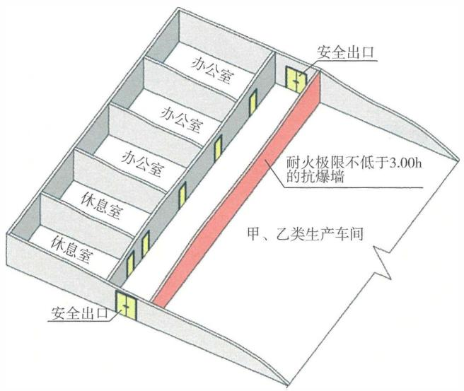

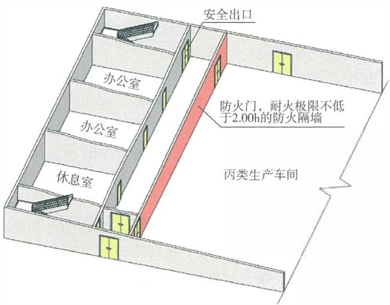

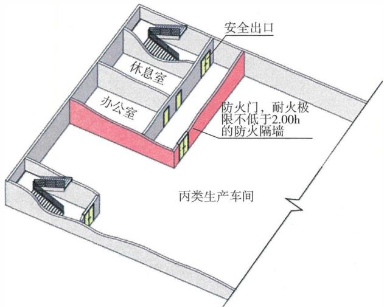

图4-1 生产厂房中辅助用房独立的安全出口设置示意图

# 【实施要点】

（1）本条规定的中间仓库，实际上是设置在厂房内的库房。中间仓库是为满足日常连续生产需要，在厂房内存放从库房或上道工序取得的原材料、半成品、辅助材料，或临时存放产品的周转场所，属于厂房的一部分。中间仓库的火灾危险性分类，可以参照现行国家标准《建筑设计防火规范》GB50016有关仓库火灾危险性分类的规定确定。 

（2）在甲、乙、丙、丁、戊类生产厂房内允许设置为满足连续生产的甲、乙、丙、丁、戊类中间库房。这些库房大多数与生产车间同层，少数与生产车间不同楼层，绝大部分是靠近厂房的外墙集中布置。不同类别火灾危险性中间仓库的布置位置、耐火等级、占地面积、建筑面积、物品储存量等，均应符合国家现行相关技术标准的规定。 

例如，国家标准《建筑设计防火规范》GB50016—2014（2018年版）第3.3.6条规定，甲、乙类中间仓库应靠外墙布置，其储量不宜超过1昼夜的需要量；仓库的耐火等级和面积应符合国家标准《建筑设计防火规范》GB50016—2014（2018年版）第3.3.2条 

和第3.3.3条的规定，即库房的耐火等级不应低于所在厂房的耐火等级，并应符合相关标准对仓库耐火等级的要求；中间仓库的占地面积和中间仓库内一个防火分区的最大允许建筑面积，应符合相关标准对相应耐火等级和相应类别火灾危险性仓库的要求。同时，中间仓库的建筑面积与所服务生产区的建筑面积之和，不应大于该中间仓库所在厂房一个防火分区的最大允许建筑面积。 

（3）本条规定了甲、乙、丙类中间仓库应采用防火墙和耐火极限不低于 $1.50\mathrm{h}$ 的不燃性楼板与生产厂房内的其他部位分隔，中间仓库内不同防火分区或不同库房之间的防火分隔应符合国家现行相关技术标准的规定，如现行国家标准《建筑设计防火规范》GB50016。根据国家标准《建筑设计防火规范》GB50016—2014（2018年版）第3.3.6条的规定，甲、乙、丙类中间仓库与厂房内其他部位分隔的防火墙、中间仓库内不同防火分区或不同库房之间的防火墙，耐火极限均不应低于 $4.00\mathrm{h}$ 。对于棉麻丝毛、橡胶及其制品等发生火灾难以有效扑灭的储存物品中间仓库，还需结合库房的内部防火分隔、每间库房的建筑面积、储存物品的数量、类型和吸水特性等情况，适当提高防火分隔楼板的耐火性能和承载力。 

对于丁、戊类中间仓库，可燃物数量少，以燃烧速度较慢的物品为主，总体火灾危险性较小。此时，主要考虑生产区的火灾对库房的危害性作用，允许采用耐火极限不低于 $2.00\mathrm{h}$ 的防火隔墙和耐火极限不低于 $1.00\mathrm{h}$ 的不燃性楼板与生产厂房内的其他部位分隔，不要求采用防火墙和耐火极限不低于 $1.50\mathrm{h}$ 的不燃性楼板。但是，当生产区内的火灾危险较高时，仍需要提高生产区与中间仓库的防火分隔要求。丁、戊类仓库内不同防火分区或不同库房之间仍要求采用耐火极限不低于 $3.00\mathrm{h}$ 的防火墙分隔。 

（4）在甲、乙类中间仓库内不同防火分区或不同库房之间的防火墙上，不允许设置任何开口。在甲、乙、丙、丁、戊类中间仓库与厂房内其他部位分隔的防火墙上，在丙、丁、戊类中间仓库内不同防火分区或不同库房之间的防火墙上，可以设置为满足方便操作要求必需的开口。这些开口的大小和防火分隔措施，均 

需要综合库房内物品的燃烧特性、状态、存放方式，库房内部的防火分隔、灭火设施设置情况、防火分隔的可靠性等因素，以有效控制火灾蔓延和减少火灾损失为目标确定。当采用防火卷帘时，要严格控制防火卷帘的使用宽度和高度，提高防火卷帘动作的可靠性，确保动作电源的可靠性；当采取防火分隔水幕时，要限制防火分隔部位的高度和宽度，保证水源和电源的可靠性，保证具有足够的用水量、分隔布水强度和厚度。 

4.2.4 与甲、乙类厂房贴邻并供该甲、乙类厂房专用的 $10\mathrm{kV}$ 及以下的变（配）电站，应采用无开口的防火墙或抗爆墙一面贴邻，与乙类厂房贴邻的防火墙上的开口应为甲级防火窗。其他变（配）电站应设置在甲、乙类厂房以及爆炸危险性区域外，不应与甲、乙类厂房贴邻。 

# 【条文要点】

本条规定了各类变电站布置和防火分隔的基本要求，明确了各类变电站与甲、乙类厂房的关系；未规定变电站与丙、丁、戊类厂房的关系，以及变电站与甲、乙类厂房分隔的防火墙、抗爆墙的具体耐火性能与构造要求。 

# 【实施要点】

（1） $10\mathrm{kV}$ 以上的变电站，无论是否专门服务于甲、乙类厂房，均应独立设置在甲、乙类厂房外，并按照相关技术标准的规定设置防火间距，不允许与甲、乙类厂房贴邻。不是专门服务于甲、乙类厂房的 $10\mathrm{kV}$ 及以下的变电站，与甲、乙类厂房之间应按照相关技术标准的规定设置防火间距，不允许设置在甲、乙类厂房内，也不允许与甲、乙类厂房贴邻。 

上述各类变电站还应位于爆炸危险性区域外。这些区域包括：受甲、乙类厂房影响而在甲、乙类厂房外形成的可燃气体、蒸气、粉尘等物质的爆炸危险性区域，因装卸、储存或充装可燃气体、可燃液体而形成的爆炸危险性区域，因装卸粮食、大豆等作业活动产生可燃粉尘而在作业期间形成的爆炸危险性区域。后两种情形可能与甲、乙类厂房有关，也可能与甲、乙类厂房无关。 

例如，在液化石油气装卸码头的可燃气体爆炸危险性区域 

内，在加油加气站内的可燃气体或可燃蒸气爆炸危险性区域内，不允许设置任何变电站。爆炸危险性区域的划分可以参考现行国家标准《爆炸危险环境电力装置设计规范》GB50058的规定。 

(2) 专门服务于甲、乙类厂房的 $10 \mathrm{kV}$ 及以下的变电站, 应设置在甲、乙类厂房外, 不允许直接设置在甲、乙类厂房内, 允许与所服务的甲、乙类厂房一面贴邻, 但不允许多面贴邻建造。 

1）当变电站与甲、乙类厂房贴邻时，相互间需要采用防火墙或抗爆墙分隔；当变电站与甲、乙类厂房之间未采用防火墙或抗爆墙分隔时，应按照国家现行相关标准的规定设置防火间距。 

2）当变电站与甲、乙类厂房贴邻时，甲、乙类厂房和变电站需要按照不同的独立建筑考虑，两者必然属于不同的防火分区。因此，根据国家标准《建筑设计防火规范》GB50016—2014（2018年版）第3.2.9条的规定，变电站与甲、乙类厂房贴邻处的防火墙和抗爆墙的耐火极限均不应低于 $4.00\mathrm{h}$ 。 

3）在与甲类厂房分隔的抗爆墙、防火墙上不允许设置任何开口。与乙类厂房贴邻的变电站采用防火墙分隔时，在防火墙上可以设置与乙类厂房相通的观察窗等窗口，但不允许设置连通门，也不允许设置其他开口，有关电气线路穿越墙体的缝隙和孔口均需要采取防火封堵措施。窗口应采用甲级防火窗。 

（3）变电站与甲、乙类厂房贴邻时防火分隔墙体的防火、防爆性能，可以根据贴邻侧变电站或厂房内的实际火灾危险性，按照下述原则确定： 

1）当甲、乙类厂房与变电站贴邻一侧的区域不具有爆炸危险性时，可以采用防火墙。 

2）当变电站贴邻甲、乙类厂房一侧的房间为无爆炸危险性的配电装置室、无功补偿装置室、干式变压器室或充装不可燃液体的变压器室时，可以采用防火墙。 

3）当甲、乙类厂房与变电站贴邻一侧的区域具有爆炸危险性，或者变电站贴邻甲、乙类厂房一侧的房间为可燃油油浸变压器室时，应采用抗爆墙，不允许采用防火墙。 

# 4.2.5 甲、乙类仓库和储存丙类可燃液体的仓库应为单、

多层建筑。 

# 【实施要点】

甲、乙类仓库内储存的物品大部分是以先爆炸后燃烧为主要表现形式的材料，少数为加速燃烧的助燃物品或快速燃烧的易燃材料；储存丙类可燃液体的仓库火灾以流散液体火为主，容易导致大面积火，有时甚至可能引发可燃蒸气爆炸的严重后果。根据现行国家标准《建筑设计防火规范》GB50016等标准的规定，上述三类仓库尽管采用防火墙分隔的每间库房或防火分区的建筑面积比较小，仓库的占地面积也控制较严格，但是库房一旦发生爆炸或火灾，往往会导致建筑结构严重受损。因此，要严格限制这些仓库的建造层数。通常，可以按照以下原则考虑： 

（1）仓库的层数应综合库房内储存物品的数量和储存方式、火灾或爆炸特性、仓库的耐火等级和结构抗爆性能、与相邻建筑的间距、便于火灾扑救等因素确定。 

（2）甲类仓库火灾事故以爆炸为主，需要采用单层建筑。 

(3) 乙类仓库存储的物品有的具有爆炸危险性, 有的不具有爆炸危险性。乙类仓库的层数可以根据储存物品的火灾或爆炸特性区别对待, 但具有爆炸危险性的乙类仓库一旦发生爆炸, 其后果与甲类仓库差别不大。因此, 乙类仓库仍要尽量采用单层建筑。 

(4) 储存丙类可燃液体的仓库大多采用中小型储罐储存润滑油、动植物油以及小包装的酒类液体，火灾荷载大。火灾多为意外泄漏或破损产生的流散可燃液体燃烧，但容易引发更多储存容器受损而导致更大的火灾，且火势发展迅速，控制难度大。储存丙类可燃液体的仓库层数需要根据储存容器的大小和存放方式、建筑上下楼层的防火分隔和防渗漏等情况考虑。储存容器容积较大的仓库、在库房内多层存放可燃液体的仓库，要尽量采用单层建筑；其他情形的仓库，可以根据建设用地情况和便于安全、有效扑救火灾的需要，按照现行国家相关技术标准的规定确定，如国家标准《建筑设计防火规范》GB 50016—2014（2018年版）第3.3.2条。 

4.2.6 仓库内的防火分区或库房之间应采用防火墙分隔，甲、乙类库房内的防火分区或库房之间应采用无任何开口 

的防火墙分隔。 

# 【条文要点】

在仓库建筑内，可以根据安全出口和疏散楼梯的设置情况，采用防火分区或防火分隔间（即每间库房）的方式将仓库划分为更小的防火区域，以减少仓库火灾的危害，参见本指南第7.2.3条的【实施要点】。本条规定了仓库中不同防火分区或不同库房之间的防火分隔措施，重点在于确保防火分隔的可靠性。 

# 【实施要点】

（1）在各类火灾危险性的仓库内，防火分区之间必须采用实体防火墙分隔，除防火墙上必需的开口外，不允许采用防火卷帘、防火分隔水幕等方式替代防火墙。对于丁、戊类仓库，每个防火分区的最大允许建筑面积大，尽管每个防火分区的总体火灾危险性小，但仍存在一定的火灾危险性，防火分区之间仍需采用防火墙分隔。 

（2）对于甲、乙类仓库，在防火分区之间的防火墙上不允许开设任何开口。对于丙、丁、戊类仓库，在防火分区之间的防火墙上尽管允许设置为便于运输、通行或满足自动化操作工艺要求的开口，但也要尽量不设置开口。这些开口除要设置在火灾时可以自动或联动关闭的甲级防火门或防火卷帘等设施外，还要严格限制每个开口的宽度、高度，以及在同一防火分隔部位上的开口总宽度；当设置防火卷帘时，应同时在防火卷帘附近设置甲级防火门作为逃生门。在平时，防火门和防火卷帘要尽量保持关闭状态。 

本条有关甲、乙类仓库内的防火墙，是指仓库中储存甲类物品的防火分区或库房之间的防火墙、储存甲类物品与储存乙、丙、丁、戊类物品的防火分区或库房之间的防火墙、储存乙类物品的防火分区或库房之间的防火墙、储存乙类物品与储存甲、丙、丁、戊类物品的防火分区或库房之间的防火墙，不包括仓库中储存丙、丁、戊类物品的防火分区或库房之间的防火墙。例如，在一座乙类仓库中，当存在储存丙、丁、戊类物品的防火分区或库房时，在储存丙、丁、戊类物品的防火分区或库房之间的防火墙上，仍然允许开设必要的开口。参见图4-2。 

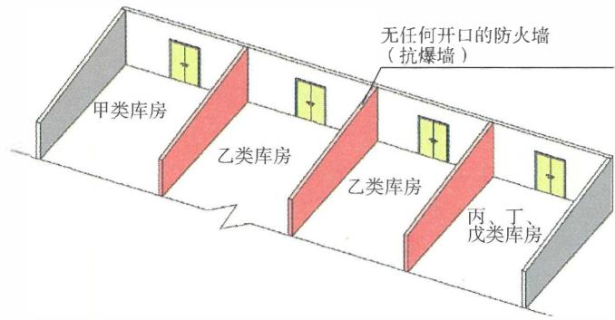

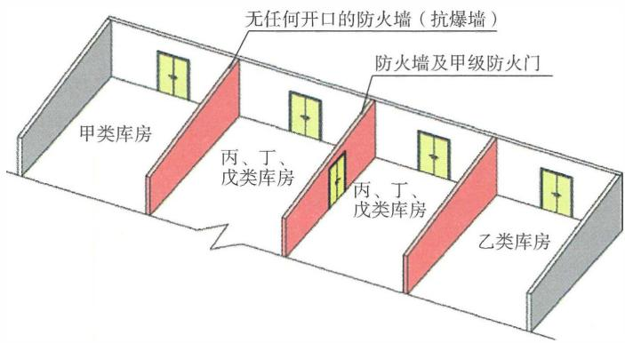

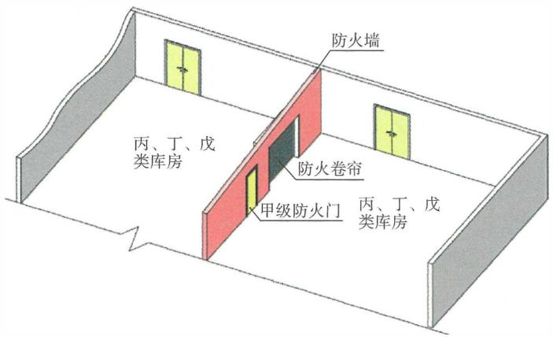

图4-2 甲、乙类库房之间及与丙、丁、戊类库房之间，丙、丁、戊类库房之间的防火墙设置要求示意图

（3）近些年，出于环保的原因，过去开敞的露天煤场正逐步被封闭式储煤仓替代，形式上属于单层的可燃固体物质仓库。随着煤库的机械化程度不断提高，一座煤库的建筑面积越来越大。考虑到煤的燃烧过程以无焰燃烧为主，火势发展、蔓延缓慢，在短时间内难以出现跨越防火分隔区域蔓延的情形，在平房式煤库或煤均化库内，允许采用空间间隔分隔为多个一定规模的储煤区作为防火分隔区域，在防火分隔区域之间可以不采用防火墙分隔，实际上是允许不严格按照其他储存物质仓库有关防火分区的要求进行分隔。因此，对于存放发生火灾后发展缓慢的物质或物品仓库，可以根据仓库内物质或物品的存放条件、操作要求、场地条件和空间特性确定其防止火灾蔓延和减小火灾损失的措施。有关技术要求可以参见国家现行相关技术标准的规定。 

4.2.7 仓库内不应设置员工宿舍及与库房运行、管理无直接关系的其他用房。甲、乙类仓库内不应设置办公室、休息室等辅助用房，不应与办公室、休息室等辅助用房及其他场所贴邻。丙、丁类仓库内的办公室、休息室等辅助用房，应采用防火门、防火窗、耐火极限不低于 $2.00\mathrm{h}$ 的防火隔墙和耐火极限不低于 $1.00\mathrm{h}$ 的楼板与其他部位分隔，并应设置独立的安全出口。 

# 【条文要点】

本条规定与本规范第4.2.2条的规定，目的和目标一致，参见本指南第4.2.2条的【条文要点】。 

# 【实施要点】

（1）设置在丙、丁类仓库内的办公室等辅助用房，允许设置与库房相通的门窗，但应采用乙级防火门和乙级防火窗分隔。为尽可能降低休息室内的火灾蔓延至库房内，或库房内的火灾危及休息室内的人员安全，休息室要尽量避免设置门与丙类库房相通。为提高辅助用房与库房之间防火分隔的可靠性，与库房相通的门要采用常闭式防火门。这些辅助用房无论建筑面积大小，均应设置独立的安全出口。参见图4-3。所谓独立的安全出口，是指该出口不需要经过库房即可直接通向室外或疏散楼梯间。对于 

多层和高层仓库，当辅助用房通过单独的安全出口连通至疏散楼梯间的前室或封闭楼梯间，并与仓库共用疏散楼梯间时，该出口可以视为独立的安全出口。 

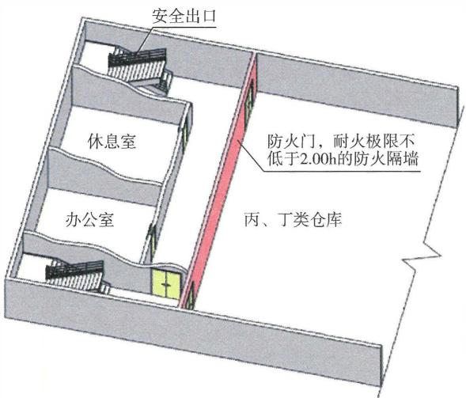

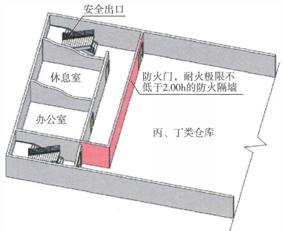

图4-3仓库中辅助用房的独立安全出口设置示意图

（2）本条的其他实施要点，参见本指南第4.2.2条的【实施要点】。 

4.2.8 使用和生产甲、乙、丙类液体的场所中，管、沟不应与相邻建筑或场所的管、沟相通，下水道应采取防止含可燃液体的污水流入的措施。 

# 【条文要点】

本条规定了各类可能存在可燃液体流散的场所，应采取防止泄漏的可燃液体经由管、沟扩散、可燃液体火灾经由管、沟蔓延引发更大灾害事故的技术措施。 

# 【实施要点】

（1）本条规定的场所包括使用和生产甲、乙、丙类液体的生产车间、生产装置区，加油站或加油加气合建站，甲、乙、丙类液体的装卸场所等室内外场所。 

（2）本条规定的管、沟，是使用和生产可燃液体场所地面下用于输送可燃液体的管道，地面下敷设各类管线并与使用和生产可燃液体场所相通的管沟，地面下与使用和生产可燃液体场所相通的其他工艺沟槽、风管、下水道、废液沟槽等。 

（3）在使用和生产甲、乙、丙类液体场所内，容易积存可燃液体或蒸气的沟槽均应按照本规范第2.19条的规定采取防止流散的可燃液体进入，防止可燃的油气在其中积聚的措施，并单独设置，不允许与其他建筑或场所连通；输送可燃液体的管道应在进入建筑室内前设置应急切断阀，不允许与其他建筑或场所相通，正常情况下不允许穿过防火墙或防火隔墙，当必须穿过防火墙或防火隔墙时，应符合国家相关技术标准的规定，并采取防止灾情扩大的相应措施。相关要点还可参见本指南第6.1.3条的【实施要点】。 

（4）在建筑的建造过程中，应结合生产工艺过程和实际使用需要，在生产或使用甲、乙、丙类液体并且容易产生可燃液体滴漏或流散的重点部位，设置收纳可燃液体的相应设施；输送可燃液体或导除可燃性废液的沟槽，应直接进出建筑或相关使用场所，并在进入下水道前设置隔油设施，避免可燃液体进入其他区域；水溶性可燃液体尽管与水混合后的火灾与爆炸危险性有所降低，但仍应根据具体使用和生产情况采取相应的排 

放处理措施。 

# 4.3 民用建筑

4.3.1 民用建筑内不应设置经营、存放或使用甲、乙类火灾危险性物品的商店、作坊或储藏间等。民用建筑内除可设置为满足建筑使用功能的附属库房外，不应设置生产场所或其他库房，不应与工业建筑组合建造。 

# 【条文要点】

本条规定了民用建筑中不允许设置经营、存放或使用甲、乙类火灾危险性物品的场所，包括操作间、加工用房、储藏室或库房、零售商店、批发商店；明确了民用建筑不允许与工业建筑竖向或水平组合建造的要求。 

# 【实施要点】

（1）本条规定的经营、存放或使用甲、乙类物品的场所，主要为各类商店、建筑的配套库房、食品等加工作坊，不包括必须设置在民用建筑内的燃气锅炉间，燃气发电机组间，使用燃气灶具的厨房，家庭内使用燃气热水器的卫生间，经营化妆品的商店，存放和经营 $38^{\circ}$ 及以上白酒（包装量为5L及以下）和医用酒精（包装量为1L及以下）的商店，不包括使用甲、乙类物品的实验室、治疗室、药房等。但在实验室、医疗建筑等民用建筑内存放和使用甲、乙类物品时，应按照国家有关化学危险品管理规定，严格控制用量或存放量，并采取相应的防护与保管措施。例如，采用危险品储存柜存放易燃易爆物品。燃气锅炉房、燃气发电机组间、居民和商业用气场所等在建筑内的设置要求、安全使用要求等，应符合燃气用户工程技术标准等标准和用气安全管理规定的要求。相关设置需要符合下述基本要求： 

1）在民用建筑内不允许设置经营除上述物品外的其他甲、乙类物品的商店，如销售油漆、稀料、燃气等物质的商店。如果需要销售此类商品，应将充装油漆、稀料或其他可燃液体、可燃气体或固体等物质的桶或罐存放在专门的单独仓储建筑内，不应存放民用建筑内。 

2）在民用建筑内不允许设置存放甲、乙类火灾危险性物品的库房，如汽油、煤油、充装燃气的储罐等。甲、乙类物品的分类和名称，可以参见现行国家标准《建筑设计防火规范》GB50016、《化学品分类和危险性公示通则》GB13690等标准。 

3）在民用建筑内不允许设置加工油漆家具、使用燃气或乙类燃油进行食品加工等类似作业的作坊或操作间。设置在民用建筑内的燃油锅炉或燃油发电机组，不应使用闪点低于 $60^{\circ}\mathrm{C}$ 的轻柴油。 

（2）在民用建筑内，允许设置为满足所在建筑使用功能和方便使用的常用物品储藏室或库房。例如，办公建筑和学校建筑内的档案室、图书室、资料室，旅馆建筑内的餐具、客房用品等的储存间，商店建筑内的商品暂存库、周转库房，医疗建筑中的药品和医疗器械库房，档案馆或图书馆建筑内的档案库、书库，博物馆的藏品库等。这些库房由于火灾荷载大，需要根据库房的建筑面积大小合理确定其位置，采取相应的防火分隔措施、设置灭火等消防设施，尽可能远离安全出口和人员密集的场所，并靠近外墙布置。图书馆、档案馆和博物馆建筑中的库房还需要根据各自用途和档案资料、图书、藏品的重要性，按照国家相关技术标准确定相应的防火分隔标准（包括库房或每个防火分区的大小）。 

（3）民用建筑与工业建筑属于不同使用性质的建筑。民用建筑不允许与各类火灾危险性的生产场所和仓库上、下组合或水平组合建造，也不允许在民用建筑内设置生产场所及与建筑使用功能无关的库房。例如，制衣车间、电子产品加工和组装车间、物流仓库、应急保障物质储备仓库等。直接为生产服务的办公、实验室等（如产品质量在线抽查、在线监控、员工临时休息等）生产辅助用房的设置，当与生产场所合建或设置在厂房内时，应符合本规范第4.2.2条和第4.2.3条的规定；为全厂服务的办公建筑等，不是生产过程中必需的设施，应独立建造，不应与生产场所合建，参见本指南第4.2.2条和第4.2.3条的【实施要点】。 

# 4.3.2 住宅与非住宅功能合建的建筑应符合下列规定：

1 除汽车库的疏散出口外，住宅部分与非住宅部分之间应采用耐火极限不低于 $2.00\mathrm{h}$ ，且无开口的防火隔墙和耐 

火极限不低于 $2.00\mathrm{h}$ 的不燃性楼板完全分隔。 

2 住宅部分与非住宅部分的安全出口和疏散楼梯应分别独立设置。 

3 为住宅服务的地上车库应设置独立的安全出口或疏散楼梯，地下车库的疏散楼梯间应按本规范第7.1.10条的规定分隔。 

4 住宅与商业设施合建的建筑按照住宅建筑的防火要求建造的，应符合下列规定： 

1）商业设施中每个独立单元之间应采用耐火极限不低于 $2.00\mathrm{h}$ 且无开口的防火隔墙分隔； 

2）每个独立单元的层数不应大于2层，且2层的总建筑面积不应大于 $300\mathrm{m}^2$ ； 

3）每个独立单元中建筑面积大于 $200\mathrm{m}^2$ 的任一楼层均应设置至少2个疏散出口。 

# 【条文要点】

本条规定了住宅与非住宅功能合建建筑有关平面布置和防火分隔的基本防火功能要求和关键防火措施。这些非住宅功能包括汽车库、非机动车库、商店等商业服务设施、办公场所、旅馆、餐饮场所等，不包括住宅建筑中保障建筑使用的设备用房、供居民自用的独立库房等场所，也不包括供一户自用的独栋住宅建筑和多户联排拼接式住宅建筑中供居民自用的汽车库。本条规定的商业服务设施的有些用途可以与商店类似或相同，但与商店建筑仍有所区别。 

# 【实施要点】

（1）本条规定的住宅与非住宅功能组合建造的建筑，包括竖向组合和水平组合两种情形。对于水平组合建造的情形，可以直接将住宅部分与非住宅部分视为两座不同建筑贴邻建造考虑各自的防火要求，但建筑的室外消防给水和室外消火栓、消防车道、消防车登高操作场地以及防火间距等的设置和要求，仍需将住宅部分和非住宅部分整体按照一座建筑，根据建筑的总规模、建筑类别和公共建筑的相应要求确定。对于竖向组合建造的情形，应 

依据本条【实施要点】第（2）款～第（6）款原则和要求确定防火设计要求。 

（2）住宅与非住宅功能竖向组合建造的建筑，主要为在多层或高层住宅建筑的下部布置商店等商业服务设施、办公场所、旅馆等非住宅功能的单层或多层公共活动场所，非住宅功能部分的建筑高度大多不大于 $24\mathrm{m}$ 。无论建筑的耐火等级为哪一级，也无论是否为木结构建筑，非住宅功能部分与住宅部分之间，在水平方向均应采用耐火极限不低于 $2.00\mathrm{h}$ 的不燃性防火隔墙分隔，在竖向应采用耐火极限不低于 $2.00\mathrm{h}$ 的不燃性楼板分隔；除不能在楼层处分隔的管线竖井、汽车库内连通住宅部分的普通电梯和消防电梯的井道外，防火隔墙和楼板上均不应设置其他任何开口，必须穿越的管线孔口和缝隙均应采取防火封堵措施。参见图4-4。 

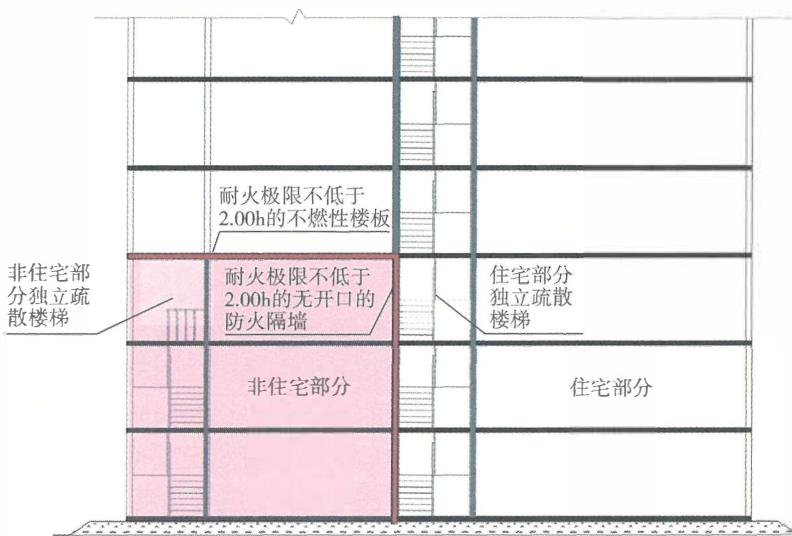

图4-4 住宅部分与非住宅部分的防火分隔与安全出口、疏散楼梯设置示意图

（3）在住宅与非住宅功能竖向组合建造的建筑中，服务于住宅部分的疏散楼梯和安全出口与服务于非住宅功能部分的疏散楼梯和安全出口应分别独立设置，不应共用。疏散楼梯间的形式、 

安全出口和疏散楼梯的净宽度可以分别按照疏散楼梯的各自服务高度、服务的楼层数、服务区域的建筑使用功能或用途，按照本规范第7章及现行国家标准《建筑设计防火规范》GB50016的规定确定。 

（4）本条规定的汽车库是为住宅服务的公共汽车库。这种汽车库的布置有三种情形，一种为布置在建筑中住宅部分下部的地上楼层，另一种为布置在建筑中住宅部分下部的地下楼层，还有一种为布置在建筑中住宅部分下部的地上和地下楼层。汽车库与住宅部分的防火分隔应符合本条第一款的规定，除地下汽车库外，汽车库与住宅部分的疏散楼梯和安全出口应各自独立设置，不应共用。地下汽车库中借用住宅部分的疏散楼梯的设置要求，应符合现行国家标准《汽车库、修车库、停车场设计防火规范》GB50067的规定。 

在住宅建筑中设置的自用汽车库，大部分为设置在独立式和联排式住宅建筑内的汽车库，个别有将汽车库设置在每层各户套内的情形。这种汽车库可以根据建筑的耐火等级和结构类型，按照现行国家标准《汽车库、修车库、停车场设计防火规范》GB50067和《建筑设计防火规范》GB50016等技术标准的规定确定相应的防火分隔要求。 

（5）在住宅与非住宅功能竖向组合建造的建筑中，为减少不同使用功能区域的火灾蔓延至其他使用功能的区域，正常情况下，供住宅部分使用的客、货电梯和消防电梯不应通至非住宅功能的楼层，供非住宅功能部分使用的客、货电梯和消防电梯不应通至住宅部分的楼层。在汽车库内，要尽量避免设置可以通至住宅部分的客、货电梯，但不禁止将住宅部分的客、货电梯通至汽车库；当在汽车库设置可以通至住宅部分的客、货电梯时，应在汽车库内采用防烟前室将电梯与汽车库分隔。住宅建筑设置的消防电梯，可以供汽车库灭火救援用，应通至汽车库各层。 

(6) 住宅与商业设施竖向组合建造的建筑，当建筑整体按照住宅建筑的防火要求建造时，应按照本条规定限制每个商业设施的大小和用途、在每个商业设施之间及商业设施与住宅之间采取 

防火分隔措施、住宅和商业设施分别设置独立的安全出口，商业设施应布置在建筑的首层或一层及二层，不应布置在其他楼层。其他防火技术要求，可以参照现行国家标准《建筑设计防火规范》GB50016中有关商业服务网点的要求确定。 

本条规定的商业设施应是为小区居民服务的各类经营性小型商业服务场所和物业管理等配套用房，包括位于住宅投影下部的商业设施和位于住宅投影外的商业设施。这些商业设施除应符合本条第4款的规定外，尚应符合本条第1款和第2款的规定。参见图4-5。 

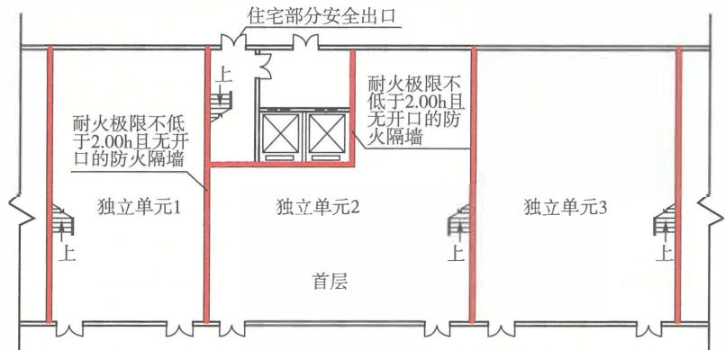

（a）商业服务设施首层平面图

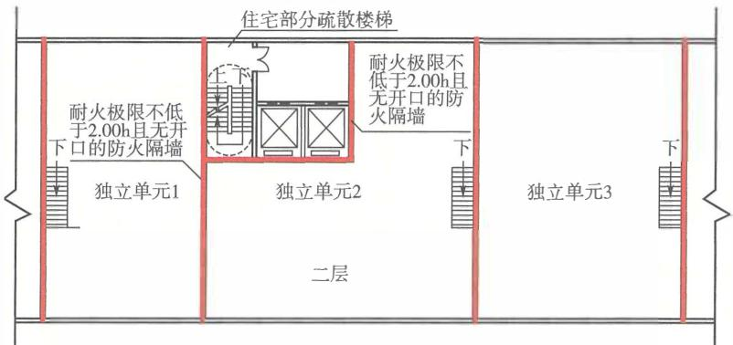

（b）商业服务设施二层平面图

图4-5 住宅与商业服务设施组合建造且建筑整体按照住宅建筑定性时的防火分隔与安全出口或疏散楼梯设置要求示意图

4.3.3 商店营业厅、公共展览厅等的布置应符合下列规定： 

1 对于一、二级耐火等级建筑，应布置在地下二层及以上的楼层； 

2 对于三级耐火等级建筑，应布置在首层或二层； 

3 对于四级耐火等级建筑，应布置在首层。 

4.3.4 儿童活动场所的布置应符合下列规定： 

1 不应布置在地下或半地下； 

2 对于一、二级耐火等级建筑，应布置在首层、二层或三层； 

3 对于三级耐火等级建筑，应布置在首层或二层； 

4 对于四级耐火等级建筑，应布置在首层。 

# 【实施要点】

（1）这两条规定了商店营业厅、公共展览厅和儿童活动场所在建筑中允许设置的楼层位置，包括商店建筑、展览建筑和儿童活动场所独立建造和设置在其他建筑内的情形。商店建筑和展览建筑中其他用途的房间或场所，应根据建筑的耐火等级和相应场所的火灾危险性，按照本规范和现行国家相关标准（如《建筑设计防火规范》GB50016）的要求确定其允许设置的楼层位置。 

（2）这两条规定包括在新建、改建和扩建的建筑和既有建筑改造中设置相关用途场所的楼层位置要求，以及在木结构组合建筑中非木结构部分的楼层内的设置楼层要求，不包括在纯木结构建筑中的设置楼层要求。 

（3）本规范规定的儿童活动场所不包括小学学校的教学用房。小学学校教学用房的设置楼层要求，可以按照现行国家标准《中小学校设计规范》GB50099的规定确定，当该标准无明确规定时，应符合本规范有关儿童活动场所的布置楼层要求。例如，对于一、二级耐火等级的建筑，允许将小学学校的教学用房布置在四层及以下各层；对于三级和四级耐火等级的建筑，小学学校教学用房的设置楼层位置应符合本条的规定。 

托儿所、托育机构和幼儿园的儿童用房的设置楼层位置，除应符合本规范的规定外，还应符合国家现行标准《托儿所、幼儿 

园建筑设计规范》JGJ 39 的规定。例如，对于一、二级耐火等级的建筑，幼儿园生活用房应布置在三层及以下。无论建筑的耐火等级高低，托儿所生活用房均应布置在首层；当托儿所生活用房布置在首层确有困难时，可将托儿所大班布置在一、二级耐火等级建筑的二层，但人数不应超过 60 人，并应符合有关防火和安全疏散的要求。 

# 4.3.5 老年人照料设施的布置应符合下列规定：

1 对于一、二级耐火等级建筑，不应布置在楼地面设计标高大于 $54 \mathrm{~m}$ 的楼层上； 

2 对于三级耐火等级建筑，应布置在首层或二层； 

3 居室和休息室不应布置在地下或半地下； 

4 老年人公共活动用房、康复与医疗用房，应布置在地下一层及以上楼层，当布置在半地下或地下一层、地上四层及以上楼层时，每个房间的建筑面积不应大于 $200\mathrm{m}^2$ 且使用人数不应大于30人。 

# 【条文要点】

本条根据老年人照料设施中主要使用人员的行为能力，规定了独立建造和与其他建筑组合建造的老年人照料设施及其部分用房有关设置楼层的基本要求，以保障老年人在建筑发生火灾时疏散的安全，并便于消防救援人员提供救助。老年人照料设施中本条未规定的其他用房，有关设置楼层的要求应符合国家相关标准，如国家现行标准《建筑设计防火规范》GB50016和《老年人照料设施建筑设计标准》JGJ450的规定。 

# 【实施要点】

（1）本条规定的老年人照料设施包括独立建造的老年人照料设施、与其他功能竖向和水平组合建造的老年人照料设施。与其他功能水平组合的老年人照料设施，当相互间采用防火墙分隔后，可以将老年人照料设施按照独立建造的建筑确定相应的防火技术要求。 

独立建造的一级和二级耐火等级的老年人照料设施，建筑高度不应大于 $54\mathrm{m}$ ；与其他功能竖向组合建造且建筑的耐火等级 

为一级或二级时，老年人照料设施应设置在距离设计地面高度小于或等于 $54\mathrm{m}$ 的楼层（即楼层的地面标高小于或等于 $54\mathrm{m}$ ）上，供老年人照料设施中工作人员集中办公的场所等不供老年人使用的房间可以设置在其他楼层上，包括楼层地面标高大于 $54\mathrm{m}$ 的楼层。 

（2）老年人居室包括公寓式的居室、住宅单元式的起居厅和卧室。休息室是指日间照料设施中供老年人静养、睡眠和休息的房间，不包括供老年人使用的阅览室、餐厅、棋牌室及其他文化娱乐和健身活动室等公共活动用房，也不包括生活单元内的起居室及供老年人休息、家属探视等用房。 

（3）老年人公共活动用房、康复与医疗用房要尽量布置在地上首层、二层、三层，不允许布置在地下二层及以下各层。当老年人公共活动用房、康复与医疗用房布置在半地下或地下一层、地上四层及以上楼层时，要严格限制每间房间的建筑面积不大于 $200\mathrm{m}^2$ ，使用人数不大于30人。这些房间内的使用人数应为平时使用时同时在房间内的人数，包括服务人员和管理人员的人数。当使用人数可能超过规定数量时，应按照设计使用人数要求采取进出人数管理和控制措施。当老年人公共活动用房、康复与医疗用房布置在地上一层至三层时，可以不限制每间房间的建筑面积和房间内的使用人数。 

（4）本条规定了一、二、三级耐火等级老年人照料设施的设置楼层要求，老年人照料设施不允许采用四级耐火等级的建筑，也不允许设置在四级耐火等级的建筑中。 

# 4.3.6 医疗建筑中住院病房的布置和分隔应符合下列规定：

1 不应布置在地下或半地下； 

2 对于三级耐火等级建筑，应布置在首层或二层； 

3 建筑内相邻护理单元之间应采用耐火极限不低于 $2.00\mathrm{h}$ 的防火隔墙和甲级防火门分隔。 

# 【实施要点】

（1）医疗建筑是为医院、卫生院、疗养院、独立门诊部、诊所、卫生所（室）等从事疾病诊断、治疗活动的机构服务的建 

筑，不包括无治疗功能的休养和疗养建筑、无治疗功能的孕妇待产和产妇与婴儿康复场所。医疗建筑中的住院病房多为行为能力受限，正在接受治疗的病人和部分护理与陪伴人员，需要建筑具有较高的消防安全性能，能在建筑发生火灾时为这些人员提供更长的安全疏散与避难时间。因此，医疗建筑中的住院病房不允许采用四级耐火等级的建筑，也不允许设置在四级耐火等级建筑中。当设置在一、二级耐火等级的建筑中时，病房的楼层位置不限。 

（2）护理单元是在住院病房楼层中由一定数量床位、设施和相对固定的护理人员组成，对同一病种住院病人进行诊断治疗和护理工作的一个病区，具有使用上的独立性。通常，一个护理单元分病室和附属房间两个部分，建筑面积约为 $1500\mathrm{m}^2$ 。病室按病情轻重，设抢救室、重危病室和普通病室；附属房间包括医生办公室、护理办公室、治疗室、处置室、换药室、配膳室、储藏室、洗漱室、厕所、医护值班及研究室等。 

当住院病房楼每层的建筑面积较大，需要划分为多个不同护理单元时，应在相邻护理单元之间采取防火分隔措施，以提高每个护理单元的消防安全性能，尽量减小火灾的危害。每个护理单元可以单独划为一个防火分区，但通常只是一个防火分区中的一个相对独立的防火分隔区域，不是独立的防火分区。考虑到护理单元的建筑面积多在 $1200\sim 2000\mathrm{m}^2$ ，要求相邻防护单元防火分隔处的连通门应采用甲级防火门，不应采用防火卷帘或其他方式替代。 

设置在疏散走道或防火分隔处的走道上的防火门，平常尽量保持关闭状态。当采用常开防火门时，防火门应具有在火灾时能与火灾自动报警系统联动自行关闭的功能和反馈相应状态信号的功能。当建筑的这些区域设置火灾自动报警系统时，这些常开防火门均应能与火灾自动报警系统联动关闭，并能监视防火门的启闭状态；当建筑的这些区域按照标准规定不需要设置且未设置火灾自动报警系统时，可以不设置专门的火灾自动报警系统以实现本条规定的常开防火门联动关闭和监视防火门启闭状态的功能。 

4.3.7 歌舞娱乐放映游艺场所的布置和分隔应符合下列规定： 

1 应布置在地下一层及以上且埋深不大于 $10\mathrm{m}$ 的楼层； 

2 当布置在地下一层或地上四层及以上楼层时，每个房间的建筑面积不应大于 $200\mathrm{m}^2$ ； 

3 房间之间应采用耐火极限不低于 $2.00\mathrm{h}$ 的防火隔墙分隔； 

4 与建筑的其他部位之间应采用防火门、耐火极限不低于 $2.00\mathrm{h}$ 的防火隔墙和耐火极限不低于 $1.00\mathrm{h}$ 的不燃性楼板分隔。 

# 【实施要点】

（1）歌舞娱乐放映游艺场所的厅、室通常需要封闭，且具有较多可燃或阻燃材料，火灾烟气毒性大，娱乐人员大多对火灾信息或火警不敏感，具有较大的火灾危险性，并在历史上发生过多起重特大火灾。因此，要严格限制这些场所的设置楼层位置，提高这些场所中每个房间之间、这些场所与建筑中其他场所之间的防火分隔的要求，提高这些场所中保障人员安全疏散设施的要求，确保这些场所内的使用人员具有良好的疏散条件，并能够及时、有效地将火灾控制在着火房间内。 

（2）歌舞娱乐放映游艺场所当采用一、二级耐火等级的独立建筑，或设置在一、二级耐火等级的其他建筑内时，要尽量设置在首层、二层和三层，但不禁止设置在建筑的其他楼层；当采用三级耐火等级的独立建筑，或设置在三级耐火等级建筑内时，应设置在首层或二层；不允许采用四级耐火等级的独立建筑，也不允许设置在四级耐火等级的其他建筑内。 

（3）在歌舞娱乐放映游艺场所内，房间之间应采用耐火极限不低于 $2.00\mathrm{h}$ 的防火隔墙分隔，在房间之间的防火隔墙上不应设置门、窗。应注意的是，在房间与疏散走道之间也应采用耐火极限不低于 $2.00\mathrm{h}$ 的防火隔墙分隔，不应采用耐火极限不低于 $1.00\mathrm{h}$ 的防火隔墙分隔，房间疏散门的耐火性能不应低于乙级防火门的相应要求。在分隔房间时，不允许将相邻几个独立使用并需要按本条规定分隔的房间合并为一个房间后再按本条规定 

分隔。参见图4-6。例如，一个总建筑面积为 $1500\mathrm{m}^2$ 的歌舞娱乐场所，设置了10间娱乐室，每间娱乐室的建筑面积为 $40\mathrm{m}^2$ 。在进行防火分隔时，不应将这10间娱乐室采用耐火极限不低于 $2.00\mathrm{h}$ 的防火隔墙分隔为2个大的区域，而应在每间建筑面积为 $40\mathrm{m}^2$ 的房间之间分别采用耐火极限不低于 $2.00\mathrm{h}$ 的防火隔墙分隔。参见图4-7。 

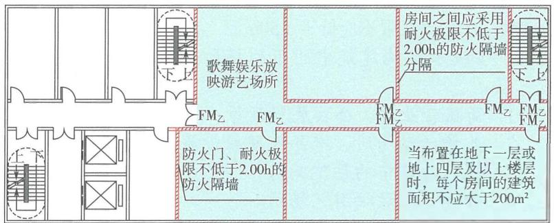

图4-6 歌舞娱乐放映游艺场所与相邻其他功能区域之间的防火分隔歌舞娱乐放映游艺场所内部不同房间的防火分隔要求示意图

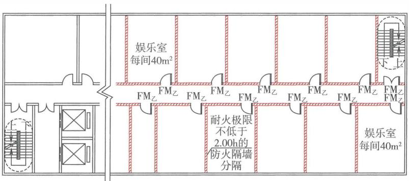

图4-7 歌舞娱乐放映游艺场所内部不同房间的防火分隔要求示意图

在歌舞娱乐放映游艺场所与建筑中其他场所之间，应按下述要求采用防火隔墙和楼板分隔： 

1）分隔墙体和门：当歌舞娱乐放映游艺场所与其他场所划 

分为不同防火分区时，应采用防火墙分隔，连通门应为甲级防火门；当歌舞娱乐放映游艺场所与其他场所划分为同一防火分区时，可以按照本条规定采用耐火极限不低于 $2.00\mathrm{h}$ 的防火隔墙分隔，连通门的耐火性能不应低于乙级防火门的相应要求。 

2）分隔楼板：当建筑的耐火等级为二级和三级时，歌舞娱乐放映游艺场所与其他场所分隔楼板的耐火极限不应低于 $1.00\mathrm{h}$ ；当建筑的耐火等级为一级时，歌舞娱乐放映游艺场所与其他场所分隔楼板的耐火极限不应低于 $1.50\mathrm{h}$ 。 

4.3.8 I级木结构建筑中的下列场所应布置在首层、二层或三层： 

1 商店营业厅、公共展览厅等； 

2 儿童活动场所、老年人照料设施； 

3 医疗建筑中的住院病房； 

4 歌舞娱乐放映游艺场所。 

4.3.9 II级木结构建筑中的下列场所应布置在首层或二层： 

1 商店营业厅、公共展览厅等； 

2 儿童活动场所、老年人照料设施； 

3 医疗建筑中的住院病房。 

4.3.10 Ⅲ级木结构建筑中的下列场所应布置在首层： 

1 商店营业厅、公共展览厅等； 

2 儿童活动场所。 

# 【条文要点】

木结构建筑的耐火等级分级独立于其他类型结构建筑的耐火等级分级体系。这三条根据木结构建筑中构件的燃烧性能、耐火等级及其整体设防标准，规定了各类场所在不同耐火等级木结构建筑中的设置楼层位置要求，未规定不同耐火等级木结构建筑的最多允许层数。不同耐火等级木结构建筑的最多允许层数应按照国家现行相关技术标准的规定确定。 

# 【实施要点】

（1）本条规定为在木结构建筑中布置商店营业厅、公共展览厅、儿童活动场所、老年人照料设施、医疗建筑中的住院病房、 

歌舞娱乐放映游艺场所等场所时的设置楼层要求，包括符合相应建筑构件耐火性能要求的纯木结构建筑和按照木结构建筑的设防标准确定防火技术要求的木结构组合建筑，不包括按照四级耐火等级要求确定的传统木结构、砖木结构建筑。 

当木结构组合建筑中的木结构部分与非木结构部分采用耐火极限不低于 $2.00\mathrm{h}$ 的不燃性楼板完全分隔后，上述场所在建筑中非木结构部分的楼层位置，可以根据非木结构部分的耐火等级和本规范第4.3.3条~第4.3.7条的规定确定；当非木结构部分的耐火等级为一、二级，层数只有1~2层，且需要同时在非木结构部分和木结构部分设置上述场所时，原则上楼层位置应符合上述三条规定的要求，不能分别考虑。只有当木结构部分的人员疏散和消防救援可以利用下部非木结构部分的屋顶，且该屋顶满足相应的人员疏散和消防救援要求时，可以分别按照本规范第4.3.3条~第4.3.7条和第4.3.8条~第4.3.10条的规定确定上述场所的楼层位置。例如，一座6层的木结构组合建筑，由下部2层的二级耐火等级钢筋混凝土结构和上部4层的I级耐火等级木结构组成。在该建筑中设置商店营业厅、儿童活动场所等场所时，设置楼层的确定有以下几种情形： 

1）当该建筑在木结构部分与钢筋混凝土结构部分之间采用耐火极限为 $2.00 \mathrm{~h}$ 的钢筋混凝土楼板分隔，木结构部分的消防救援场地和人员疏散需要利用室外设计地面时，商店营业厅、儿童活动场所等场所应设置在建筑的三层及以下楼层。 

2）当该建筑在木结构部分与钢筋混凝土结构部分之间采用耐火极限为 $2.00 \mathrm{~h}$ 的钢筋混凝土楼板分隔，且钢筋混凝土结构的屋面满足消防救援场地和人员疏散的要求，人员进出木结构部分均可以直接从钢筋混凝土结构的屋面出入，不需要经过下部钢筋混凝土结构部分的室内（包括楼梯间和电梯）时，商店营业厅等场所允许同时设置在该建筑的五层及以下楼层。 

3）无论该建筑在木结构部分与钢筋混凝土结构之间是采用耐火极限不低于 $1.00\mathrm{h}$ 还是耐火极限不低于 $2.00\mathrm{h}$ 的钢筋混凝土楼板分隔，只要该建筑是按照木结构建筑的防火技术要求建造， 

商店营业厅等场所都只允许设置在建筑的三层及以下楼层。 

（2）木结构建筑的耐火等级分类应符合现行国家标准《建筑设计防火规范》GB50016的规定。现代木结构建筑主要采用工程木、多层胶合板等构筑。采用胶合木等重型木构件的梁和柱，虽然构件为可燃材料，但在受火作用后会在木材表面形成一定厚度的炭化层，并可因此降低木材内部的烧蚀速度，构件的截面尺寸可以根据不同种类木材的炭化速率、构件的设计耐火极限和设计荷载确定，允许梁和柱采用不经防火处理的木构件。轻型木结构建筑中的框架构件和面板之间存在许多空腔，对墙体、楼板、封闭吊顶或屋顶下的密闭空间内的空腔采取防火分隔措施，可阻止因构件内某处着火产生的火焰、高温气体和烟气在这些空腔内蔓延。因此，木结构建筑主要通过构造防火措施保证建筑的耐火性能，这与传统木结构建筑有较大差异。如果构件的燃烧性能和耐火时间采用现行建筑耐火等级分级体系中的相应规定，将难以体现现代木结构建筑的真实耐火性能，也不能很好地系统规定木结构建筑的防火技术要求。为此，现行国家标准《建筑设计防火规范》GB50016在与现行国家相关标准规定协调的基础上，建立了独立的木结构建筑耐火等级分级体系。 

I级耐火等级木结构建筑的整体耐火性能略低于二级耐火等级其他类型结构建筑的耐火性能，Ⅱ级、Ⅲ级耐火等级木结构建筑的整体耐火性能与三级耐火等级其他类型结构建筑的耐火性能相当，Ⅲ级耐火等级木结构建筑的整体耐火性能低于三级、高于四级耐火等级其他类型结构建筑的耐火性能。因此，I级耐火等级木结构建筑的防火分区在竖向允许采用楼板分隔，并按照单个楼层的建筑面积划分，且不限制防火分区的长度；Ⅱ级、Ⅲ级耐火等级木结构建筑的防火分区在竖向则需要将相邻两道防火墙之间的全部楼层划入同一个防火分区，并需要限制每个防火分区的长度。这三条规定的相关场所在木结构建筑中的设置楼层要求，分别与二级、三级和四级耐火等级其他类型结构建筑的相关要求对应。 

小学学校的教学建筑，当采用I级耐火等级木结构建筑时， 

可以比照二级耐火等级其他类型结构建筑的设置楼层要求，将教学用房设置在四层及以下的楼层，不应设置在五层及以上楼层；当采用Ⅱ级、Ⅲ级耐火等级木结构建筑时，应将教学用房设置在首层和二层，不应设置在三层及以上楼层。对于组合木结构建筑，当在非木结构的楼层设置上述场所时，仍可以按照本规范第4.3.3条～第4.3.7条的规定和非木结构部分的耐火等级确定相应的楼层位置。例如，在一座6层的木结构组合建筑中，下部3层采用二级耐火等级的钢筋混凝土结构，上部3层采用Ⅱ级耐火等级纯木结构，则儿童活动场所可以设置在该建筑的三层及以下各层；老年人照料设施可以设置在该建筑的五层及以下各层；歌舞娱乐放映游艺场所可以设置该建筑的三层及以下各层，不允许设置在木结构部分的楼层中，即不允许设置在该建筑的四层及以上楼层。 

（3）考虑到Ⅱ级、Ⅲ级耐火等级木结构建筑的整体耐火性能，歌舞娱乐放映游艺场所不允许设置在Ⅱ级、Ⅲ级耐火等级的木结构建筑中。 

4.3.11 燃气调压用房、瓶装液化石油气瓶组用房应独立建造，不应与居住建筑、人员密集的场所及其他高层民用建筑贴邻；贴邻其他民用建筑的，应采用防火墙分隔，门、窗应向室外开启。瓶装液化石油气瓶组用房应符合下列规定： 

1 当与所服务建筑贴邻布置时，液化石油气瓶组的总容积不应大于 $1\mathrm{m}^3$ ，并应采用自然气化方式供气； 

2 瓶组用房的总出气管道上应设置紧急事故自动切断阀； 

3 瓶组用房内应设置可燃气体探测报警装置。 

# 【实施要点】

（1）燃气调压用房是设置调压装置并承担调节用气压力的专用建筑。本条规定的燃气调压用房是设置将较高燃气压力降至服务建筑所需较低压力的调压器及其附属设备的用房。本条规定的瓶装液化石油气瓶组用房是指配置2个以上 $15\mathrm{kg}$ 、2个及以上 $50\mathrm{kg}$ 气瓶，采用自然或强制气化方式将液态液化石油气转换为气态液化石油气后向用户供气的设施。 

燃气调压用房、瓶装液化石油气瓶组用房应设置在民用建筑外的独立房间内。当所服务建筑为居住建筑（住宅建筑、公寓建筑和宿舍建筑）、高层民用建筑、各类民用建筑中设置人员密集的场所（会议室、多功能厅、餐厅或食堂、营业厅等）时，应按照有关技术标准的要求设置防火间距，不应贴邻；服务其他建筑时，允许在其他建筑和单、多层民用建筑中的非人员密集的场所与燃气调压用房、瓶装液化石油气瓶组用房之间设置防火墙后贴邻，一般应只与一面墙贴邻。 

（2）本条规定的瓶装液化石油气瓶组的总容积应按配置气瓶间内的气瓶个数与单个气瓶的几何容积的乘积计算。例如，我国充装 $15\mathrm{kg}$ 液化石油气的气瓶以35.5L用量最多，以充装系数为 $0.42\mathrm{kg} / \mathrm{L}$ 计算，1个气瓶可以满足一般家庭一个月的正常用气需要。因此，若一间瓶装液化石油气瓶组用房内采用 $15\mathrm{kg}$ 的液化石油气气瓶，则该用房内最多允许设置28个气瓶。 

在瓶组用房的总出气管道上应设置紧急事故自动切断阀，该阀的自动切断功能应与可燃气体探测报警装置连锁。此外，紧急事故自动切断阀还应具有手动应急切断的功能。 

（3）燃气调压用房和瓶装液化石油气瓶组的设置，除应符合本条的规定外，还应符合现行国家标准《燃气工程项目规范》GB55009、《液化石油气供应工程设计规范》GB51142、《城镇燃气设计规范》GB50028和《建筑设计防火规范》GB50016等标准的规定。如《燃气工程项目规范》GB55009—2021第4.3.1条规定，液化天然气和容积大于 $10\mathrm{m}^3$ 液化石油气储罐不应固定安装在建筑物内。充气的或有残气的液化天然气钢瓶不得存放在建筑内。《城镇燃气设计规范》GB50028—2006（2020年版）第6.6.2条规定，液化石油气和相对密度大于0.75燃气的调压装置不得设于地下室、半地下室内和地下单独的箱体内。《液化石油气供应工程设计规范》GB51142—2015第7.0.4条规定了液化石油气瓶组气化站的独立瓶组间与其他民用建筑的防火间距，《建筑设计防火规范》GB50016—2014（2018年版）第5.4.17条规定了液化石油气气瓶的独立瓶组间与所服务建筑的防火间距。 

# 4.3.12 建筑内使用天然气的部位应便于通风和防爆泄压。

# 【条文要点】

本条规定了民用建筑中天然气、液化石油气、沼气、煤气等燃气使用部位的设置位置要求，以确保这些部位在一旦发生燃气泄漏时能够尽快稀释和排除，防止形成爆炸性气氛；或者在发生爆燃后及时泄压，降低对建筑其他区域的破坏性作用。 

# 【实施要点】

（1）民用建筑内使用燃气的部位，主要为住宅和公寓建筑内的厨房、燃气热水器安装部位、使用燃气取暖的部位，餐饮场所的烹饪部位，美容院和理发店的燃气热水器设置部位，机关企事业单位食堂中厨房的烹饪部位，燃气锅炉房，燃气发电机组房等。 

（2）在民用建筑中应尽量采用天然气作为燃气，并采用管道供气；采用储罐等其他方式供气时，应根据燃气的特性（如液化天然气具有超低温的特性、液化石油气具有容易积聚在低洼处的特性）设置在通风良好，避免日晒的地点，并应尽量将储罐放置在建筑外，或在建筑外单独设置储瓶间。建筑中使用燃气的部位均要尽量靠建筑的外墙布置，使其具有可开启的外窗，具有良好的直接自然通风条件，如燃气热水器设置不封闭的阳台，避免设置在通风不畅的卫生间或厨房内。考虑到建筑中使用燃气的房间大多需要采取防爆泄压措施，使用燃气的部位需要在同一楼层的平面上和在竖向楼上避开人员密集的房间、档案室、指挥调度室、贵重设备房等聚集人数多或使用性质重要的房间，墙体上用于泄压的部位要避开人员经常通行的走道或道路。 

（3）燃气用气部位的位置、燃气用具的类型、用气房间与相邻房间的分隔、防火防爆措施等要求，应符合本规范第2.1.7条、第2.1.9条、第4.1.4条、第4.1.5条和现行国家标准《燃气工程项目规范》GB55009、《城镇燃气设计规范》GB50028等标准的规定。例如，《燃气工程项目规范》GB55009—2021第2.2.7条规定，设置燃气设备、管道和燃具的场所不应存在燃气泄漏后聚集的条件。燃气相对密度大于或等于0.75的燃气管道、调 

压装置和燃具不得设置在地下室、半地下室、地下箱体、地下综合管廊及其他地下空间内。《城镇燃气设计规范》GB50028—2006（2020年版）第10.4.2条规定，居民生活用气设备严禁设置在卧室内。第10.4.4条规定，家用燃气灶应安装在有自然通风和自然采光的厨房内。利用卧室的套间（厅或利用与卧室连接的走廊作厨房时，厨房应设门并与卧室隔开；安装燃气灶的房间净高不宜低于 $2.2\mathrm{m}$ ；燃气灶与墙面的净距不得小于 $10\mathrm{cm}$ 。当墙面为可燃或难燃材料时，应加防火隔热板；燃气灶的灶面边缘和烤箱的侧壁距木质家具的净距不得小于 $20\mathrm{cm}$ ，当达不到时，应加防火隔热板；放置燃气灶的灶台应采用不燃烧材料，当采用难燃材料时，应加防火隔热板；厨房为地上暗厨房（无直通室外的门和窗）时，应选用带有自动熄火保护装置的燃气灶，并应设置燃气浓度检测报警器、自动切断阀和机械通风设施，燃气浓度检测报警器应与自动切断阀和机械通风设施连锁。第10.4.5条规定，家用燃气热水器应安装在通风良好的非居住房间、过道或阳台内；有外墙的卫生间内，可安装密闭式热水器，但不得安装其他类型热水器；装有半密闭式热水器的房间，房间门或墙的下部应设有效截面面积不小于 $0.02\mathrm{m}^2$ 的格栅，或在门与地面之间留有不小于 $30\mathrm{mm}$ 的间隙；房间净高宜大于 $2.4\mathrm{m}$ ；可燃或难燃烧的墙壁和地板上安装热水器时，应采取有效的防火隔热措施；热水器的给排气筒宜采用金属管道连接。第10.5.2条规定，商业用气设备应设置在通风良好的专用房间内，商业用气设备不得安装在易燃易爆物品的堆存处，亦不得设置在兼作卧室的警卫室、值班室、人防工程等处。 

4.3.13 四级生物安全实验室应独立划分防火分区，或与三级生物安全实验室共用一个防火分区。 

# 【实施要点】

(1) 生物安全实验室的分级应符合现行国家标准《生物安全实验室建筑技术规范》GB 50346 的规定。根据该标准的规定,生物安全实验室根据实验室处理对象的生物危害程度和采取的防护措施分为一、二、三和四级共 4 级, 一级对生物安全隔绝的要 

求最低，四级对生物安全隔绝的要求最高。三级和四级生物安全实验室处理对象对人体、动物和环境具有高度危险性。 

（2）本条只规定了四级生物安全实验室的防火分区划分，其他等级生物安全实验室的防火分区划分可以根据现行国家标准《生物安全实验室建筑技术规范》GB50346有关平面布置和分隔的要求，按照本规范第4.3.16条的规定确定，建筑的耐火等级应符合本规范、现行国家标准《建筑设计防火规范》GB50016和《生物安全实验室建筑技术规范》GB50346的规定。 

鉴于四级生物安全实验室的处理对象可通过气溶胶途径流传或流传途径不明使人染上严重的甚至是致命疾病，或对动植物和环境具有未知的、危险的致病因子，没有预防治疗的措施；三级生物安全实验室的处理对象尽管主要通过气溶胶使人染上严重的甚至是致命疾病，或对动植物和环境具有高度危害的治病因子，但往往具有预防治疗的措施，三级和四级生物安全实验室的防火必须考虑有效防止病原微生物扩散。根据本规范第5.3.1条规定和第5.3.2条的规定，四级生物安全实验室建筑的耐火等级应为一级，三级生物安全实验室建筑的耐火等级不应低于二级。因此，当四级生物安全实验室与三级生物安全实验室共用一个防火分区时，建筑的耐火等级应为一级。 

4.3.14 交通车站、码头和机场的候车（船、机）建筑乘客公共区、交通换乘区和通道的布置应符合下列规定： 

1 不应设置公共娱乐、演艺或经营性住宿等场所； 

2 乘客通行的区域内不应设置商业设施，用于防火隔离的区域内不应布置任何可燃物体； 

3 商业设施内不应使用明火。 

# 【条文要点】

本条规定了在各类交通建筑中供乘客使用的公共区、不同交通设施的换乘区和连接通道内禁止布置的设施。这些建筑的防火分区划分以及每个防火分区内不同场所的防火分隔，其他非交通功能设施与交通车站等组合建造时的布置和防火分隔，应符合本规范及国家现行有关技术标准的规定。 

# 【实施要点】

（1）本条规定交通车站、码头和机场的候车（船、机）建筑的乘客公共区，包括各种铁路、地铁、公路、水路、空路交通方式的车站或进出港建筑中供乘客使用的区域。例如，公交等市域交通车站的乘客候车区，城际或省际长途汽车交通车站的乘客候车厅和到达厅的公共区，国铁或城际铁路车站的乘客候车厅和到达厅的公共区，城市轨道交通车站等的站厅公共区、站台公共区，轮船和轮渡码头的乘客候船厅和到达厅的公共区，城市航站楼的办票和候车区，民用机场航站楼的出发厅、到达厅及候机厅等的公共区等。 

交通车站、码头和机场的交通换乘区，是主要供乘客转换不同交通工具或不同班次、不同线路交通的场所，有时是独立的换乘厅，有时与地铁站厅公共区或其他交通方式的乘客候乘区合用。交通车站、码头和机场的通道，主要包括供乘客进出站、连接候车（船、机）区域至站台或登机桥的通道，连接站台或登机桥至到达厅或迎客厅的通道，乘客转换交通方式或线路的换乘通道，交通车站、码头和机场的候车（船、机）建筑与其他功能设施或建筑的连接通道。 

（2）在上述区域内，不允许设置公共娱乐场所、演艺场所、经营性住宿场所等场所。公共娱乐场所的范围应符合《公共娱乐场所消防安全管理规定》（公安部令第39号）的规定，主要包括影剧院、录像厅、礼堂等演出、放映场所，舞厅、卡拉OK厅等歌舞娱乐场所，具有娱乐功能的夜总会、音乐茶座和餐饮场所，游艺、游乐场所和保龄球馆、旱冰场、桑拿浴室等营业性健身、休闲场所。 

（3）乘客通行的区域是指公共区、换乘厅和换乘通道内规划用于人员通行的区域。商业设施应为服务乘客出行的配套小型商铺或摊位。用于防火隔离的区域，大多称作防火隔离带，在火灾荷载较低且呈离散分布，烟气层热反馈对可燃物的作用较小的场所，可以通过此种防火隔离带阻止火灾通过热辐射作用蔓延至其他区域。用于防火隔离的区域是具有一定宽度的空间间隔，在其 

中不应有任何可燃物及其他可能传播火势的物体，在特定空间条件下可以用于替代防火墙、防火隔墙、防火卷帘、防火分隔水幕等防火分隔措施。用于防火隔离的区域应满足的要求，应根据使用场所内的可燃物分布形态、类型和数量、空间的室内高度、建筑面积、人员疏散要求等情况确定。 

（4）有关甲、乙类物品的范围，参见本指南第4.3.1条的【实施要点】。 

4.3.15 一、二级耐火等级建筑内的商店营业厅，当设置自动灭火系统和火灾自动报警系统并采用不燃或难燃装修材料时，每个防火分区的最大允许建筑面积应符合下列规定： 

1 设置在高层建筑内时，不应大于 $4000 \mathrm{~m}^{2}$ ； 

2 设置在单层建筑内或仅设置在多层建筑的首层时，不应大于 $10000\mathrm{m}^2$ 

3 设置在地下或半地下时，不应大于 $2000\mathrm{m}^2$ 。 

# 【实施要点】

（1）本条有关商店营业厅中每个防火分区的最大允许建筑面积的规定，仅限于本条规定条件下的情形。建筑中未设置自动灭火系统，或内部装修材料的燃烧性能不符合本条规定的商店营业厅，每个防火分区的最大允许建筑面积应符合本规范第4.3.16条的规定；当商店建筑为三级、四级耐火等级的独立建筑，或商店营业厅设置在三级、四级耐火等级的其他建筑内时，营业厅内每个防火分区的最大允许建筑面积应符合本规范第4.3.16条的规定。 

（2）设置在高层建筑内的商店营业厅，由于高层建筑的耐火等级不应低于二级，因此无论位于高层建筑的地上哪个楼层，也无论共有几层设置了营业厅，当设置自动灭火系统、火灾自动报警系统，并且室内装修采用不燃或难燃装修材料时，每个防火分区的最大允许建筑面积均不应大于 $4000\mathrm{m}^2$ 。 

（3）设置在多层建筑内多个楼层的商店营业厅，无论位于建筑的首层还是地上其他楼层，每个防火分区的最大允许建筑面积 

均应符合本规范第4.3.16条的规定。 

（4）设置在单层建筑内的商店营业厅、只在多层建筑中首层一个楼层设置的商店营业厅（在其他楼层未设置商店营业厅），当设置自动灭火系统、火灾自动报警系统，并且室内装修采用不燃或难燃装修材料时，每个防火分区的最大允许建筑面积不应大于 $10000\mathrm{m}^2$ 。 

（5）位于地下、半地下的商店营业厅，无论是独立的地下、半地下建筑，还是单层、多层或高层民用建筑的地下、半地下室，当设置自动灭火系统、火灾自动报警系统，并且室内装修采用不燃或难燃装修材料时，每个防火分区的最大允许建筑面积均不应大于 $2000\mathrm{m}^2$ 。 

（6）在按照本条要求确定商店营业厅中每个防火分区的最大允许建筑面积时，室内装修材料的燃烧性能应为A级或不低于 $\mathrm{B}_{1}$ 级。商店营业厅中各具体部位装修材料的燃烧性能，还应符合现行国家标准《建筑内部装修设计防火规范》GB50222有关单层、多层、高层商店建筑和地下、半地下商店建筑的规定。但是，根据现行国家标准《建筑内部装修设计防火规范》GB50222对商店营业厅中某些部位装修材料的燃烧性能要求，当允许采用低于 $\mathrm{B}_{1}$ 级的装修材料，或者允许降低相应部位装修材料的燃烧性能时，装修材料的燃烧性能仍应为A级或不应低于 $\mathrm{B}_{1}$ 级，不应降低至 $\mathrm{B}_{2}$ 或 $\mathrm{B}_{3}$ 级，且该标准要求采用A级装修材料的部位，应采用A级材料。 

4.3.16 除有特殊要求的建筑、木结构建筑和附建于民用建筑中的汽车库外，其他公共建筑中每个防火分区的最大允许建筑面积应符合下列规定： 

1 对于高层建筑，不应大于 $1500\mathrm{m}^2$ 。 

2 对于一、二级耐火等级的单、多层建筑，不应大于 $2500\mathrm{m}^2$ ；对于三级耐火等级的单、多层建筑，不应大于 $1200\mathrm{m}^2$ ；对于四级耐火等级的单、多层建筑，不应大于 $600\mathrm{m}^2$ 。 

3 对于地下设备房，不应大于 $1000\mathrm{m}^2$ ；对于地下其 

他区域，不应大于 $500\mathrm{m}^2$ 。 

4 当防火分区全部设置自动灭火系统时，上述面积可以增加1.0倍；当局部设置自动灭火系统时，可按该局部区域建筑面积的1/2计入所在防火分区的总建筑面积。 

# 【条文要点】

本条根据本规范第4.1.2条的规定，明确了各类公共建筑中每个防火分区的最大允许建筑面积。这些建筑不包括音乐厅、展览厅、剧场的观众厅、体育馆的观众厅和比赛厅等具有特殊功能要求的建筑，木结构建筑，设置在公共建筑内的汽车库，以及本规范第4.3.15条已有规定的商店营业厅。 

# 【实施要点】

（1）本条规定的有特殊要求的建筑，主要指有特殊功能要求、防火分区按照本条规定划分无法满足实际使用功能需要的建筑，受空间条件限制难以分隔的建筑，如展览建筑和歌剧院的前厅或序厅，音乐厅，剧场的观众厅和前厅或序厅，体育馆的观众厅和比赛厅，有高大空间要求的展览厅，使用功能对空间的面积和高度有特殊要求的实验室等。除商店营业厅的防火分区应符合本规范第4.3.15条的规定划分外，其他有特殊功能要求的建筑中难以按照本条规定划分防火分区的场所，可以依据本规范第1.0.8条和第2.1节的规定，经专项技术论证和合规判定后确定相应的防火分区大小、划分方法以及保障消防安全的相关技术措施。上述建筑中无特殊功能要求的其他区域仍应按照本条的规定划分防火分区。例如，剧场的设备用房等辅助用房区，商店建筑中的库房、辅助办公等区域，体育馆建筑中的设备区、训练用房、辅助办公等用房区。 

（2）木结构建筑中每个防火分区的最大允许建筑面积，应根据木结构建筑的耐火等级，按照现行国家标准《建筑设计防火规范》GB50016等标准的要求确定。根据不同耐火等级木结构建筑的耐火性能和防止火灾蔓延的性能，I级耐火等级木结构建筑中每个防火分区的最大允许建筑面积不应大于 $1200\mathrm{m}^2$ ，Ⅱ级耐火等级木结构建筑中防火墙间的最大允许总建筑面积不应大于 

$1800\mathrm{m}^2$ ，Ⅲ级耐火等级木结构建筑中防火墙间的最大允许总建筑面积不应大于 $600\mathrm{m}^2$ ，允许建筑长度应符合表4-2的要求。当设置自动喷水灭火系统时，丁、戊类地上厂房防火墙间的最大允许总建筑面积不限，其他建筑每个防火分区的最大允许建筑面积或防火墙间的最大允许总建筑面积和允许建筑长度可分别按上述数值及表4-2的规定值增加1.0倍。 

表 4-2 木结构建筑中防火墙间的允许建筑长度

<table><tr><td>耐火等级</td><td>I级</td><td colspan="3">II级</td><td colspan="2">III级</td></tr><tr><td>层数/层</td><td>1~8</td><td>1</td><td>2</td><td>3或4</td><td>1</td><td>2</td></tr><tr><td>防火墙间的允许建筑长度/m</td><td>不限</td><td>100</td><td>80</td><td>60</td><td colspan="2">60</td></tr></table>

注：体育馆等高大空间建筑的建筑高度和建筑面积可适当增加。 

对于木结构组合建筑，在采用耐火极限不低于 $2.00\mathrm{h}$ 的不燃性耐火楼板与木结构部分分隔后，非木结构部分可以根据该部分的建筑耐火等级、层数、高度和功能等确定相应的防火技术要求。 

（3）设置在民用建筑内的汽车库，每个防火分区的最大允许建筑面积可以根据所在建筑的耐火等级、汽车库的类型和设置的楼层高度，按照现行国家标准《汽车库、修车库、停车场设计防火规范》GB50067的规定确定。例如，《汽车库、修车库、停车场设计防火规范》GB50067—2014第5.1.1条规定：汽车库防火分区的最大允许建筑面积应符合表4-3的规定。其中，敞开式、错层式、斜楼板式汽车库的上下连通层面积应叠加计算，每个防火分区的最大允许建筑面积不应大于表4-3规定的2.0倍；室内有车道且有人员停留的机械式汽车库，其防火分区最大允许建筑面积应按表4-3的规定减少 $35\%$ 。设置自动灭火系统的汽车库，每个防火分区的最大允许建筑面积不应大于上述规定值的2.0倍。 

表 4-3 汽车库防火分区的最大允许建筑面积 $/{\mathrm{m}}^{2}$

<table><tr><td>耐火等级</td><td>单层汽车库</td><td>多层汽车库、 半地下汽车库</td><td>高层汽车库、 地下汽车库</td></tr><tr><td>一、二级</td><td>3000</td><td>2500</td><td>2000</td></tr><tr><td>三级</td><td>1000</td><td>不允许</td><td>不允许</td></tr></table>

（4）本条规定的地下设备房和其他地下区域，包括独立建造的半地下、地下建筑，地上建筑的半地下、地下室。位于半地下、地下的场所，除设备用房、本条规定的具有特殊功能并允许设置在半地下或地下的场所外，其他场所均应按照每个防火分区最大允许建筑面积不大于 $500\mathrm{m}^2$ 划分防火分区。 

（5）除有特殊要求的建筑、商店营业厅、木结构建筑和附建于民用建筑中的汽车库外，在公共建筑中的防火分区内全部设置自动灭火系统时，该防火分区的建筑面积允许按照本条规定的基本数值增加1.0倍；如在防火分区内只局部区域设置自动灭火系统，在与本条规定的基本数值对比时，该防火分区的建筑面积增加值应为设置自动灭火系统区域建筑面积的 $1/2$ 。例如，一个由多个设备用房组成且总建筑面积为 $1500\mathrm{m}^2$ 的地下设备区，划分一个防火分区。其中，有三个设备用房需要设置自动灭火系统且设置了细水雾灭火系统，这三个设备用房的总建筑面积为 $1000\mathrm{m}^2$ 。在校验该设备区的防火分区划分是否符合标准规定时，应将这三个设备用房总建筑面积的 $1/2$ （即 $500\mathrm{m}^2$ ）计入所在防火分区的建筑面积，即该地下设备区的防火分区校核用建筑面积为 $1000\mathrm{m}^2$ ，符合本规范规定的“不应大于 $1000\mathrm{m}^2$ ”。 

（6）本条规定的“有特殊要求的建筑”，包括一些有特殊功能要求的建筑和建筑中有特殊功能要求的场所。例如，体育馆建筑、室内运动场、剧院建筑、特殊的会议建筑或会议厅、展览建筑中的公共展览厅、博物馆建筑的地下展厅、民用机场航站楼的出发厅和到达厅、轨道交通车站的站厅公共区等。这些建筑应在满足使用功能的同时，从建筑消防安全的整体需求出发，认真 

研究与实际划分的防火分区大小相适应的防火技术措施及相关要求，确保符合本规范规定的建筑防火目标、功能和性能要求。 

4.3.17 总建筑面积大于 $20000\mathrm{m}^2$ 的地下或半地下商店，应分隔为多个建筑面积不大于 $20000\mathrm{m}^2$ 的区域且防火分隔措施应可靠、有效。 

# 【条文要点】

本条明确了规模巨大的地下、半地下商店应分隔成多个较小的区域，规定了防火分隔措施的基本性能要求。有关防火分隔的具体措施和技术要求，可以根据地下空间的构成特点，结合地面条件按照现行国家标准《建筑设计防火规范》GB50016和《人民防空工程设计防火规范》GB50098等技术标准的规定确定。 

# 【实施要点】

（1）根据本规范第4.3.15条的规定，在地下、半地下商店建筑中，商店营业厅内每个防火分区的最大允许建筑面积可达 $2000\mathrm{m}^2$ 。为保证正常的顾客流线和通行方便，满足商店经营的需要，营业厅内的防火分区往往采用大量防火卷帘进行分隔。尽管这些年来防火卷帘的质量和可靠性有所提升，建筑自动灭火系统的维护与管理水平也在不断提高，但采用防火卷帘保证不同防火分区之间防火分隔的可靠度还需进一步提高，自动灭火系统的可靠性及其控火、灭火的有效性还不能很好地满足大型地下、半地下建筑消防安全的需要，导致规模大的地下、半地下商店一旦失火往往产生严重的后果。因此，本条规定要求采用可靠、有效的防火分隔措施将总建筑面积大于 $20000\mathrm{m}^2$ 的地下、半地下商店分隔成多个相对独立的商店区域，且每个独立区域的总建筑面积均不应大于 $20000\mathrm{m}^2$ ，实现一旦其中某个区域的火灾失控后不会蔓延至其他独立的防火分隔区域。 

本条规定的商店的总建筑面积，应按照商店营业厅、配套库房、配套设备用房、配套办公用房等构成地下商店的所有用房和区域的建筑面积之和计算，包括按照本规范第4.1.2条规定允许不计入防火分区建筑面积的区域的面积。 

（2）用于分隔总建筑面积大于 $20000\mathrm{m}^2$ 的地下、半地下商店 

的措施，可以根据构成地下商店各区域的布置情况，结合地面条件确定，重点应保证防火分隔措施的可靠性和有效性。例如，当地下商店为多个楼层时，可以采用防烟楼梯间和楼板以及下沉庭院或下沉式广场分隔；当地下商店为单层时，可以采用避难走道、下沉庭院或下沉式广场、防火隔间分隔。不同防火分隔措施应满足的具体技术要求，可以参见国家标准《建筑设计防火规范》GB50016—2014（2018年版）第6.4.12条、第6.4.13条和第6.4.14条的规定，防烟楼梯间的要求应符合本规范第7.1.8条的规定。 

（3）在地下、半地下商店分隔后每个总建筑面积小于 $20000\mathrm{m}^2$ 的区域内，应按照本规范第4.1.2条和第4.3.15条的规定进一步划分防火分区，防火分区之间的防火分隔应符合本规范第4.1.2条和第6章的相关规定，其他要求可以参见现行国家标准《建筑设计防火规范》GB50016的规定，并应尽可能提高防火分区之间防火分隔措施的可靠性和有效性。 

# 4.4 其他工程

4.4.1 地铁车站的公共区与设备区之间应采取防火分隔措施，车站内的商业设施和非地铁功能设施的布置应符合下列规定： 

1 公共区内不应设置公共娱乐场所； 

2 在站厅的乘客疏散区、站台层、出入口通道和其他用于乘客疏散的专用通道内，不应布置商业设施或非地铁功能设施； 

3 站厅公共区内的商业设施不应经营或储存甲、乙类火灾危险物品，不应储存可燃性液体类物品。 

# 【实施要点】

（1）本规范规定的地铁车站，除有明确规定外，均包括地上车站和地下车站。除车站轨行区外，地铁车站主要由站台、站厅、出入口通道、换乘通道等组成。站台区包括站台公共区（即乘客候车区）和端部的设备区，站厅包括站厅公共区和站厅设备管理区，站厅公共区包括付费区和非付费区。车站的公共区由站 

台的公共区和站厅的公共区构成，供乘客候车、进出站和换乘通行用；设备区或设备管理区布置了保障列车正常运行、事故应急的设备用房和相关管理人员办公用房。公共区与设备区的火灾危险性不同，使用人员的特性和数量不同，需要分别独立划分防火分区。因此，在站台的公共区和站厅的公共区与设备区之间应采用防火墙分隔，在车站的公共区、设备区内，不同防火分区之间应采用防火墙分隔，同一防火分区内不同用房之间可以根据房间的实际火灾危险性，采用相应耐火极限的防火隔墙分隔。 

（2）在地铁车站站台的公共区和站厅的公共区内不应设置公共娱乐场所。这些场所包括向公众开放的下列场所：影剧院、录像厅、礼堂等演出、放映场所，舞厅、卡拉OK厅等歌舞娱乐场所，具有娱乐功能的夜总会、音乐茶座和餐饮场所，游艺、游乐场所，保龄球馆、旱冰场、桑拿浴室等营业性健身、休闲场所。 

（3）本条规定地铁车站中不允许布置商业设施或非地铁功能设施的区域包括：站厅的乘客疏散区（包括站厅中的付费区和非付费区）、站台层、出入口通道、车站中其他用于乘客疏散的专用通道。乘客的疏散区主要为供乘客疏散通行的区域，应根据设计的人员疏散路径和宽度等边界要求，采用明显的标志线标示。在其他区域内布置配套商业设施时，应符合现行国家标准《地铁设计防火标准》GB51298等标准的规定。在地铁车站内不应布置非地铁功能的设施，地铁车站与非地铁功能设施之间的防火分隔应符合本规范第4.4.2条的规定。 

（4）在站厅公共区内布置的配套商业设施，是为方便乘客出行的便利店，主要经营日用杂品、书报、点心、水和饮料等商品，尽量控制经营可燃物较多、容易被点燃或燃烧速度快的物品，不应经营或储存甲、乙类物品，不应储存可燃性液体类物品。配套商业设施的防火分隔措施等防火技术要求，可以根据现行国家标准《地铁设计防火标准》GB51298等标准的规定确定。 

甲、乙类物品的范围，请参见本指南第4.3.1条的【实施要点】；可燃性液体类物品的范围，请参见现行国家标准《建筑设计防火规范》GB50016有关丙类液体的分类和举例，如动植物 

油、润滑油、机油等。 

4.4.2 地铁车站的站厅、站台、出入口通道、换乘通道、换乘厅与非地铁功能设施之间应采取防火分隔措施。 

# 【实施要点】

（1）地铁车站的站厅、站台、出入口通道、换乘通道、换乘厅均为地铁车站内的功能场所，属于地铁功能设施。地铁车站的站厅公共区通常与站台公共区划分为同一个防火分区，且站厅公共区大多作为站台公共区的人员疏散安全区。出入口通道为站厅公共区安全出口外的疏散区，相当于建筑内的疏散楼梯竖井。换乘通道和换乘厅大多为连接不同车站站厅公共区或站台公共区的独立区域，换乘厅有时与站厅公共区合用。除地铁列车本身的火灾作用外，地铁车站内的这些区域主要供人员通行、候车和上下车，均为火灾危险性较小、但在车站运行时属于人员集中的场所，应与非地铁功能设施分隔。在车站站厅和站台层设置的设备用房，均为保证地铁安全、正常运行，并供地铁专用的房间，必须确保其安全，也应与非地铁功能设施分隔。 

（2）与地铁车站相邻建设的非地铁功能设施主要有商店、餐饮、旅馆等商业服务设施，办公场所，人防工程，城市综合管廊及其他市政公用设施。这些设施有的具有较大的火灾危险性，有的还同时具有人员密度大的特点。尽管其中一些设施具有与地铁车站连通的需求，以方便公众出行，提升城市设施的服务品质，但都需要考虑地铁车站与非地铁功能设施发生火灾时的相互影响，应采取相应的防火分隔措施。 

（3）地铁车站的站厅、站台与出入口通道、换乘通道、换乘厅之间的防火分隔措施及其技术要求，地铁车站内这些区域与非地铁功能设施之间的具体防火分隔措施及其技术要求，除本规范的规定外，其他要求均可以根据现行国家标准《地铁设计防火标准》GB51298等标准的规定确定。 

例如，国家标准《地铁设计防火标准》GB51298—2018规定，在站厅非付费区连通商业等非地铁功能场所的楼梯或扶梯的开口部位，应设置耐火极限不低于 $3.00\mathrm{h}$ 的防火卷帘，防火卷帘 

应能分别由地铁、商业等非地铁功能的场所控制，在楼梯或扶梯周围的其他临界面应设置防火墙。在站厅层与站台层之间设置商业等非地铁功能的场所时，站台公共区至站厅公共区的楼梯或扶梯不应与商业等非地铁功能的场所连通，楼梯或扶梯穿越商业等非地铁功能的场所的部位周围应设置无门窗洞口的防火墙。在站厅公共区同层布置的商业等非地铁功能的场所，应采用防火墙与站厅公共区进行分隔，相互间宜采用下沉广场或连接通道等方式连通，不应直接连通。下沉广场的宽度不应小于 $13\mathrm{m}$ ；连接通道的长度不应小于 $10\mathrm{m}$ 、宽度不应大于 $8\mathrm{m}$ ，连接通道内应设置两道分别由地铁和商业等非地铁功能的场所控制且耐火极限均不低于 $3.00\mathrm{h}$ 的防火卷帘。 

4.4.3 地铁工程中的下列场所应分别独立设置，并应采用防火门（窗）、耐火极限不低于 $2.00\mathrm{h}$ 的防火隔墙和耐火极限不低于 $1.50\mathrm{h}$ 的楼板与其他部位分隔： 

1. 车站控制室（含防灾报警设备室）、车辆基地控制室（含防灾报警设备室）、环控电控室、站台门控制室； 

2 变电站、配电室、通信及信号机房； 

3 固定灭火装置设备室、消防水泵房； 

4 废水泵房、通风机房、蓄电池室； 

5 车站和车辆基地内火灾时需继续运行的其他房间。 

# 【条文要点】

本条规定了地铁工程中各类在火灾时需要继续使用的重要用房的布置和基本防火分隔要求，以防止火灾危险性大的房间发生火灾危及其他场所，确保这些房间内的设施设备在建筑其他部位发生火灾时仍能满足正常工作的要求。 

# 【实施要点】

（1）地铁工程中的设备室往往设备多、建筑面积大。本条规定地铁工程中为保证地铁正常运行所需各类房间均不允许与其他用途合并设置在同一个房间内，应分别独立设置，但可以设置在其他功能的建筑内，如车站控制室允许设置在办公建筑内，通风机房允许设置在车站的设备区等。 

（2）本条规定的车站控制室、车辆基地控制室、环控电控室、站台门控制室、变电站、配电室、通信及信号机房、废水泵房、通风机房、蓄电池室等房间，均应为地铁车站和车辆基地中在火灾时需要继续运行的房间。在火灾时不需要继续运行的其他房间，可以根据其实际火灾危险性和重要性确定是否需要防火分隔。对于排烟风机，如果设置排烟风机房，则排烟风机房应按照本条规定的防火分隔要求与相邻部位或区域分隔。 

（3）设置在防火隔墙上的门大部分应采用乙级防火门，少数房间的门应采用甲级防火门。防火门的耐火、防烟等性能应符合本规范相关条文的规定。本规范未规定的，可以按照现行国家标准《地铁设计防火标准》GB51298、《建筑设计防火规范》GB50016的规定确定。 

4.4.4 在地铁车辆基地建筑的上部建造其他功能的建筑时，车辆基地建筑与其他功能的建筑之间应采用耐火极限不低于 $3.00\mathrm{h}$ 的楼板分隔，车辆基地建筑中承重的柱、梁和墙体的耐火极限均不应低于 $3.00\mathrm{h}$ ，楼板的耐火极限不应低于 $2.00\mathrm{h}$ 。 

# 【条文要点】

本条规定了利用地铁车辆基地盖上空间建设其他各类设施时的基本防火分隔和结构耐火性能要求，确保地铁车辆基地在与其他功能的建筑上、下组合建造时，各自发生的火灾不会对建筑安全产生相互危害。 

# 【实施要点】

（1）地铁车辆基地主要用于地铁列车的停放和检修，包括停车库、列检库、停车列检库、运用库、联合检修库、物资总库及易燃物品库等，是地铁车辆维修、停放、运用管理以及办公、培训的场所。地铁车辆基地占地和建筑规模一般都很大，停放车辆和储存物资多，具有一定的火灾危险性。为高效利用土地资源，我国大部分城市在地铁车辆基地的上盖建设了住宅建筑、办公建筑、旅馆建筑、商店建筑和汽车库等，设置了幼儿园、托儿所、中小学校、变电站等配套设施。 

（2）地铁车辆基地本身属于服务于地铁的配套设施，防火技术要求可以比照相应类别火灾危险性的厂房和仓库确定，但并不是严格意义的厂房，而是类似汽车库和修车库的功能。因此，在地铁车辆基地的上盖允许建设其他使用功能的设施和建筑，但地铁车辆基地与上盖建筑的消防系统、疏散设施和消防救援保障设施等需要各自完全独立设置，以保证在同一时间内各自发生至少1次火灾时的火灾控制与消防救援需要。在这方面，在地铁车辆基地的上盖建设各类建筑和设施的情形，与多种不同使用功能的设施竖向组合建造有所区别。 

（3）在地铁车辆基地与上盖建筑或设施之间，应采用耐火极限不低于 $3.00\mathrm{h}$ 的不燃性楼板分隔。当在上盖直接设置可燃油油浸变压器室等具有一定爆炸危险性的场所时，还应对相应部位的分隔楼板采取防爆或抗爆措施。例如，设置一定厚度的隔离土层，加强分隔楼板的抗爆性能，采用双层楼板设置隔离空腔等。鉴于目前有关耐火极限不低于 $3.00\mathrm{h}$ 的楼板的构造数据还不够充分，当分隔盖上与盖下的楼板要求耐火极限不低于 $3.00\mathrm{h}$ 时，该楼板的构造应根据楼板的受力情况、边界约束条件、跨度大小等经计算或火灾测试验证确定。参见图4-8。 

（4）本条规定了地铁车辆基地建筑中楼板和承重的柱、梁、墙体的最低耐火极限，上盖建筑的楼板和承重的柱、梁、墙体等建筑构配件的耐火极限仍可以根据建筑的使用性质和建筑的耐火等级对相关构件的耐火极限要求确定，如现行国家标准《建筑设计防火规范》GB50016、《汽车库、修车库、停车场设计防火规范》GB50067等标准。地铁车辆基地的建筑之间及建筑内的防火分隔、上盖建筑之间及建筑内的防火分隔，可以分别按照本规范第4.4.3条和现行国家标准《地铁设计防火标准》GB51298、《建筑设计防火规范》GB50016等标准的规定确定。 

4.4.5 交通隧道内的变电站、管廊、专用疏散通道、通风机房及其他辅助用房等，应采用耐火极限不低于 $2.00\mathrm{h}$ 的防火隔墙等与车行隧道分隔。 

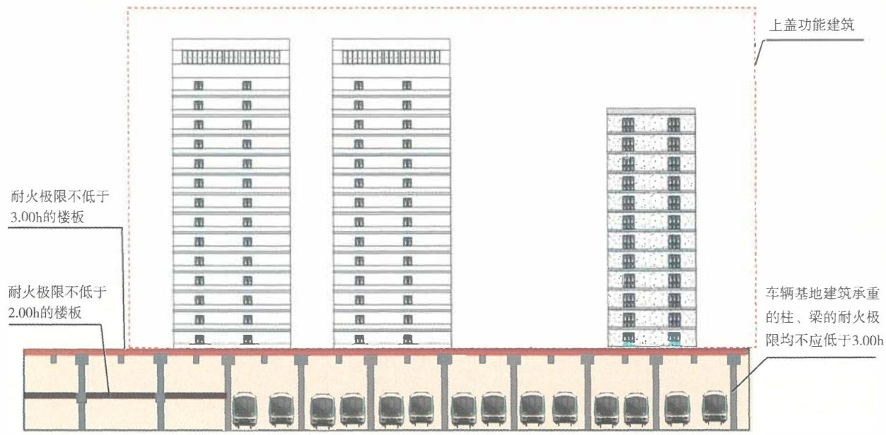

图4-8 地铁车辆基地内主要承重结构的耐火性能及与上盖建筑之间防火分隔板的耐火性能要求示意图

# 【实施要点】

（1）本条规定的交通隧道包括城市交通隧道和公路隧道，不包括铁路隧道。设置在交通隧道内的变电站、管廊、通风机房及其他辅助用房，均是服务于隧道的配套用房和电力、排水等廊道，其中的管廊还可以是借助隧道的电力管廊。专用疏散通道是设置在交通隧道中单洞双向或单向通行的车行隧道任一侧，或位于双洞单向通行的车行隧道中间，供人员在火灾及其他应急情况下疏散至隧道外的专用通道。 

（2）设置在交通隧道内的辅助用房应独立划分防火分区，防火分区的最大允许建筑面积可以根据这些用房的火灾危险性和设置位置，按照本规范和国家现行相关技术标准的要求确定。在各类辅助用房和专用疏散通道与车行隧道之间，应采用耐火极限不低于 $2.00\mathrm{h}$ 防火隔墙和乙级防火门（见本规范第6.4.3条）分隔，不应采用防火卷帘等防火分隔措施分隔。 

有关辅助用房防火隔墙的耐火极限测试条件、试验方法和判定标准，应符合现行国家标准《建筑构件耐火试验方法 第1部分：通用要求》GB/T9978.1、《建筑构件耐火试验方法 第4部分：承重垂直分隔构件的特殊要求》GB/T9978.4、《建筑构件耐火试验方法 第8部分：非承重垂直分隔构件的特殊要求》GB/T9978.8有关建筑构件耐火极限测试、判定和结果推论等的规定，可以不按照国家标准《建筑构件耐火试验可供选择和附加的试验程序》GB/T26784有关碳氢升温条件或隧道火灾RABT-ZTV升温曲线等升温条件和隧道结构的耐火极限判定标准考虑。但是，如果这些辅助用房直接设置在隧道内，并且可能受到隧道内通行车辆火灾的直接作用时，应按照相应隧道结构耐火极限的试验条件、试验方法和判定标准确定其耐火极限，即需要按照碳氢升温条件等进行测试。 

（3）当专用疏散通道设置在车行隧道的上方时，疏散通道下方的隧道结构应满足隧道结构本身的耐性性能要求；当专用疏散通道设置在车行隧道的下方时，疏散通道上方的车行道路应满足隧道结构本身的耐性性能和通行车辆的承载要求。此时， 

分隔专用疏散通道的隧道结构的耐火性能不应低于 $2.00 \mathrm{~h}$ , 相关耐火性能的试验条件、试验方法和判定标准见本条【实施指南】第（2）款。 

# 5 建筑结构耐火

# 5.1 一般规定

5.1.1 建筑的耐火等级或工程结构的耐火性能，应与其火灾危险性，建筑高度、使用功能和重要性，火灾扑救难度等相适应。 

# 【条文要点】

本条规定是对建筑结构和工程结构耐火的基本性能要求。建筑和工程的整体耐火性能是保证建筑和工程结构在火灾时不发生较大破坏或垮塌，保持建筑和工程结构功能的根本，可以由建筑结构或构件、工程结构的燃烧性能和耐火极限体现。建筑或工程的火灾危险性、建筑高度、埋深、使用功能、重要性、火灾扑救难易程度不同，相应的耐火性能要求可以有所差异，应根据建筑和工程自身的实际情况区别对待，使建筑和工程具有合理的耐火等级，并据此确定适度的防火设防标准。 

# 【实施要点】

（1）建筑的耐火等级或工程结构的耐火性能，体现了建筑或工程结构自身在无灭火干预情况下耐受火灾作用，并在火灾或高温作用下仍能正常发挥承载功能的能力，是确定相应结构、构件的耐火极限和燃烧性能、疏散设施和消防设施设置、救援保障条件等建筑防火技术要求的基础。建筑的耐火等级或工程结构的耐火性能高低，与建筑或工程的火灾危险性、建筑高度、埋深、建筑或工程的重要性、火灾扑救难度等因素关系密切，火灾危险性越高、建筑高度越高或埋深越大、建筑或工程的性质越重要、火灾扑救难度越大，建筑的耐火等级应越高或工程结构越应具备更高的耐火性能。例如，地下建筑和超高层建筑，火灾扑救十分困难，建筑的耐火等级不应低于一级；其他高层建筑的火灾扑救和疏散难度也较单、多层建筑大，耐火等级不应低于 

二级；甲、乙类厂房的火灾危险性高，耐火等级一般不应低于二级；党政机关办公楼、指挥调度中心、重要的城市公共设施等公共建筑，使用性质重要，耐火等级不应低于二级。对于水底隧道、暗埋段较长的特长隧道，火灾扑救和灾后修复的难度大，建造时应按照可能的实际火灾作用使隧道结构具有较高的耐火性能。反之，建筑的耐火等级或工程结构的耐火性能可以低一些。 

（2）建筑的整体耐火性能可以采用耐火等级表示，不同耐火等级建筑的耐火性能可以采用建筑结构、构件的燃烧性能和耐火极限衡量。除木结构建筑外，其他类型结构建筑的耐火等级可以分为一级、二级、三级和四级，木结构建筑的耐火等级可以分为I级、Ⅱ级和Ⅲ级。对于隧道和管廊等工程，结构的耐火性能与隧道的类别、管廊中敷设管线的火灾危险性相关。不同建筑、不同类别工程的结构耐火性能要求应在符合本规范的基础上，按照国家现行相关技术标准的要求确定。例如，隧道工程结构的耐火性能应按照本规范第5.4.2条规定的原则确定；建筑的耐火等级分级、不同耐火等级建筑中相应结构或构件的耐火性能要求、城市交通隧道的分类，可以按照现行国家标准《建筑设计防火规范》GB50016和《汽车库、修车库、停车场设计防火规范》GB50067等技术标准的规定确定，参见表5-1~表5-4；管廊工程中相应结构的耐火性能要求可以根据现行国家标准《城市综合管廊工程技术规范》GB50838的规定确定。 

（3）对于新建、改建、扩建的建筑和工程，只要确定了建筑的耐火等级或工程的类别，就可以确定建筑中不同部位的结构、构件或工程结构应具备的耐火极限和燃烧性能；对于既有建筑，只要能够明确既有建筑中主要受力或承重构件的耐火极限和燃烧性能，就可以确定该建筑可以达到的耐火等级，并可以进一步确定该建筑改造时的相应设防标准、结构加固与防火保护措施，以及其他消防安全保障措施。 

表 5-1 不同耐火等级工业建筑构件的燃烧性能和耐火极限 $/\mathrm{h}$

<table><tr><td rowspan="2" colspan="2">构件名称</td><td colspan="4">耐火等级</td></tr><tr><td>一级</td><td>二级</td><td>三级</td><td>四级</td></tr><tr><td rowspan="5">墙</td><td>防火墙</td><td>不燃性3.00</td><td>不燃性3.00</td><td>不燃性3.00</td><td>不燃性3.00</td></tr><tr><td>承重墙</td><td>不燃性3.00</td><td>不燃性2.50</td><td>不燃性2.00</td><td>难燃性0.50</td></tr><tr><td>楼梯间和前室的墙、电梯井的墙</td><td>不燃性2.00</td><td>不燃性2.00</td><td>不燃性1.50</td><td>难燃性0.50</td></tr><tr><td>疏散走道两侧的隔墙</td><td>不燃性1.00</td><td>不燃性1.00</td><td>不燃性0.50</td><td>难燃性0.25</td></tr><tr><td>非承重外墙、房间隔墙</td><td>不燃性0.75</td><td>不燃性0.50</td><td>难燃性0.50</td><td>难燃性0.25</td></tr><tr><td colspan="2">柱</td><td>不燃性3.00</td><td>不燃性2.50</td><td>不燃性2.00</td><td>难燃性0.50</td></tr><tr><td colspan="2">梁</td><td>不燃性2.00</td><td>不燃性1.50</td><td>不燃性1.00</td><td>难燃性0.50</td></tr><tr><td colspan="2">楼板</td><td>不燃性1.50</td><td>不燃性1.00</td><td>不燃性0.75</td><td>难燃性0.50</td></tr><tr><td colspan="2">屋顶承重构件</td><td>不燃性1.50</td><td>不燃性1.00</td><td>难燃性0.50</td><td>可燃性</td></tr><tr><td colspan="2">疏散楼梯</td><td>不燃性1.50</td><td>不燃性1.00</td><td>不燃性0.75</td><td>可燃性</td></tr><tr><td colspan="2">吊顶(包括吊顶搁栅)</td><td>不燃性0.25</td><td>难燃性0.25</td><td>难燃性0.15</td><td>可燃性</td></tr></table>

注：二级耐火等级建筑内采用不燃材料的吊顶，其耐火极限不限。 

表 5-2 不同耐火等级民用建筑构件的燃烧性能和耐火极限 $/\mathrm{h}$

<table><tr><td rowspan="2" colspan="2">构件名称</td><td colspan="4">耐火等级</td></tr><tr><td>一级</td><td>二级</td><td>三级</td><td>四级</td></tr><tr><td rowspan="6">墙</td><td>防火墙</td><td>不燃性3.00</td><td>不燃性3.00</td><td>不燃性3.00</td><td>不燃性3.00</td></tr><tr><td>承重墙</td><td>不燃性3.00</td><td>不燃性2.50</td><td>不燃性2.00</td><td>难燃性0.50</td></tr><tr><td>非承重外墙</td><td>不燃性1.00</td><td>不燃性1.00</td><td>不燃性0.50</td><td>可燃性</td></tr><tr><td>楼梯间和前室的墙、电梯井的墙、住宅建筑单元之间的墙和分户墙</td><td>不燃性2.00</td><td>不燃性2.00</td><td>不燃性1.50</td><td>难燃性0.50</td></tr><tr><td>疏散走道两侧的隔墙</td><td>不燃性1.00</td><td>不燃性1.00</td><td>不燃性0.50</td><td>难燃性0.25</td></tr><tr><td>房间隔墙</td><td>不燃性0.75</td><td>不燃性0.50</td><td>难燃性0.50</td><td>难燃性0.25</td></tr><tr><td colspan="2">柱</td><td>不燃性3.00</td><td>不燃性2.50</td><td>不燃性2.00</td><td>难燃性0.50</td></tr><tr><td colspan="2">梁</td><td>不燃性2.00</td><td>不燃性1.50</td><td>不燃性1.00</td><td>难燃性0.50</td></tr><tr><td colspan="2">楼板</td><td>不燃性1.50</td><td>不燃性1.00</td><td>不燃性0.50</td><td>可燃性</td></tr><tr><td colspan="2">屋顶承重构件</td><td>不燃性1.50</td><td>不燃性1.00</td><td>可燃性0.50</td><td>可燃性</td></tr><tr><td colspan="2">疏散楼梯</td><td>不燃性1.50</td><td>不燃性1.00</td><td>不燃性0.50</td><td>可燃性</td></tr><tr><td colspan="2">吊顶(包括吊顶搁栅)</td><td>不燃性0.25</td><td>难燃性0.25</td><td>难燃性0.15</td><td>可燃性</td></tr></table>

注：以木柱承重且墙体采用不燃材料的建筑，耐火等级应按四级确定。 

表 5-3 不同耐火等级木结构建筑构件的燃烧性能和耐火极限 $/\mathrm{h}$

<table><tr><td colspan="2">构件名称</td><td>I级</td><td>II级</td><td>III级</td></tr><tr><td rowspan="7">墙</td><td>防火墙</td><td>不燃性3.00</td><td>不燃性3.00</td><td>不燃性3.00</td></tr><tr><td>承重墙</td><td>难燃性2.00</td><td>难燃性1.00</td><td>难燃性0.50</td></tr><tr><td>非承重外墙</td><td>难燃性1.00</td><td>难燃性0.75</td><td>可燃性</td></tr><tr><td>电梯井的墙</td><td>不燃性1.00</td><td>难燃性1.00</td><td>难燃性0.50</td></tr><tr><td>楼梯间和前室的墙、住宅建筑单元之间的墙和分户墙</td><td>难燃性2.00</td><td>难燃性1.00</td><td>难燃性0.50</td></tr><tr><td>疏散走道两侧的隔墙</td><td>难燃性1.00</td><td>难燃性0.75</td><td>难燃性0.25</td></tr><tr><td>房间隔墙</td><td>难燃性0.75</td><td>难燃性0.50</td><td>难燃性0.25</td></tr><tr><td colspan="2">承重柱</td><td>可燃性2.50</td><td>可燃性1.00</td><td>可燃性1.00</td></tr><tr><td colspan="2">梁</td><td>可燃性2.00</td><td>可燃性1.00</td><td>可燃性1.00</td></tr><tr><td colspan="2">楼板</td><td>难燃性1.50</td><td>难燃性0.75</td><td>可燃性</td></tr><tr><td colspan="2">屋顶承重构件</td><td>可燃性1.00</td><td>可燃性0.50</td><td>可燃性</td></tr></table>

续表5-3

<table><tr><td>构件名称</td><td>I级</td><td>II级</td><td>III级</td></tr><tr><td>疏散楼梯</td><td>难燃性1.50</td><td>难燃性0.50</td><td>可燃性</td></tr><tr><td>吊顶</td><td>难燃性0.25</td><td>难燃性0.15</td><td>可燃性</td></tr></table>

注：1除另有规定外，当同一座Ⅱ级、Ⅲ级耐火等级木结构建筑存在不同高度的屋顶时，较低部分的屋面不应采用可燃性屋面，且Ⅱ级耐火等级木结构建筑中较低部分的屋面采用难燃性屋面时，屋面的耐火极限不应低于 $0.75\mathrm{h}$ ，屋顶承重构件的燃烧性能和耐火极限应与梁相同。 

2 轻型木屋顶除防水层、保温层及屋面板外，其余部分均应视为屋顶承重构件且不应采用可燃性构件，耐火极限不应低于 $0.50\mathrm{h}$ 。 

3 4层的Ⅱ级耐火等级木结构建筑，承重墙、承重柱、楼梯间和前室的墙、电梯井的墙、住宅建筑单元之间的墙和分户墙、疏散楼梯的耐火极限应按表中规定分别提高 $0.50\mathrm{h}$ ，楼板的耐火极限不应低于 $1.00\mathrm{h}$ 。 

4 除房间隔墙和吊顶外，I级木结构建筑的构件不应使用轻型木结构构件。 

# 5.1.2 地下、半地下建筑（室）的耐火等级应为一级。

# 【实施要点】

（1）地下、半地下建筑和建筑的地下、半地下室内的火灾，具有烟热难以排出、火场温度高、烟雾大、火灾延续时间长、疏散和扑救难度大、易造成人员伤亡或财产损失等特点，需要具备较高的耐火性能，以保证建筑结构的安全和消防救援人员的安全，保障消防救援工作顺利进行。 

对于设置地下、半地下室的建筑，建筑地面以上部分的耐火等级可以依据其地面以上的建筑高度、规模、使用功能、与相邻建筑的防火间距等因素确定，不需要与地下部分的耐火等级一致，但地下、半地下室部分的承重结构和围护结构的耐火性能应 

按照不低于一级耐火等级建筑的相应要求确定。 

（2）除本规范有专门明确地下、半地下建筑范围的条文外，本规范规定的“地下、半地下建筑”均包括地下、半地下的工业与民用建筑，平时使用的人民防空工程，地下、半地下汽车库，交通隧道和管廊工程中的地下设备用房、避难间，城市轨道交通的地下车站、地下设备用房、地下联络通道、地下风井和风道、地下变电所，地下车辆基地内各类建筑物，城际和国铁的地下车站、地下设备用房、地下出入口通道等，地下人行通道和非机动车道等。当在本规范的同一章或同一节中对不同地下、半地下建筑分别有明确规定时，不需要同时满足这些规定。 

5.1.3 建筑高度大于 $100\mathrm{m}$ 的工业与民用建筑楼板的耐火极限不应低于 $2.00\mathrm{h}$ 。一级耐火等级工业与民用建筑的上人平屋顶，屋面板的耐火极限不应低于 $1.50\mathrm{h}$ ；二级耐火等级工业与民用建筑的上人平屋顶，屋面板的耐火极限不应低于 $1.00\mathrm{h}$ 。 

# 【条文要点】

本条规定了各类工业与民用建筑上人屋面、建筑高度大于 $100\mathrm{m}$ 建筑的楼板应具备的最低耐火极限，建筑中其他构件的耐火极限应根据建筑的耐火等级要求和建筑高度，按照国家现行相关技术标准的规定确定。建筑的高度越高、火灾扑救难度越大、火灾延续时间越长，对建筑自身耐火性能的要求越高。一些特殊建筑和建筑内的一些特殊部位楼板的耐火极限，如丙类仓库、避难层等的楼板，还需根据其使用功能和防火需要提高。 

# 【实施要点】

（1）根据国家标准《民用建筑设计统一标准》GB50352—2019第3.1.2条的规定，民用建筑按地上建筑高度或层数划分为低层或多层民用建筑、高层民用建筑、超高层民用建筑。建筑高度不大于 $27.0\mathrm{m}$ 的住宅建筑、建筑高度不大于 $24.0\mathrm{m}$ 的公共建筑、建筑高度大于 $24.0\mathrm{m}$ 的单层公共建筑划分为低层或多层民用建筑；建筑高度大于 $27.0\mathrm{m}$ 的住宅建筑、建筑高度大于 $24.0\mathrm{m}$ 且不大于 $100.0\mathrm{m}$ 的非单层公共建筑，划分为高层民用建筑；建筑 

高度大于 $100\mathrm{m}$ 的民用建筑划分为超高层民用建筑。根据国家标准《建筑设计防火规范》GB50016—2014（2018年版）的规定，建筑高度大于 $27\mathrm{m}$ 的住宅建筑，建筑高度大于 $24\mathrm{m}$ 的非单层厂房、仓库和其他民用建筑，划分为高层建筑；建筑高度不大于 $27\mathrm{m}$ 的住宅建筑，建筑高度不大于 $24\mathrm{m}$ 的非单层厂房、仓库和其他民用建筑，划分为单层或多层建筑。 

由于我国当前的消防救援装备和救援能力难以很好地满足扑救建筑高度大于 $100\mathrm{m}$ 的高层工业与民用建筑火灾的需要，有必要增强建筑自身的被动防火性能，提高建筑内部和外部防止火灾蔓延的防火分隔措施的可靠性，相关防火技术要求均应较其他工业与民用建筑的要求有所提高。具体要求可以根据现行国家标准《建筑设计防火规范》GB50016等标准的规定确定。 

（2）建筑的上人平屋顶可以用于人员在火灾时疏散、临时避难、开设消防救援阵地，具有满足人员安全到达地面的设施和符合人员停留面积要求的上人平屋面，还可以作为建筑的室外安全地点。鉴于现行国家相关标准在对应一级、二级耐火等级建筑的构件耐火性能基本要求中只规定了楼板和屋顶承重结构的最低耐火极限，未规定屋面板的耐火极限要求，为确保屋面板能够满足在建筑发生火灾时安全使用的要求，规定了一级、二级耐火等级建筑上人平屋顶上屋面板的耐火极限分别不应低于国家相关标准对相应耐火等级建筑楼板和屋顶承重结构的最低耐火极限要求，且屋面板的燃烧性能应为A级，不应采用耐火极限低于1.50h或1.00h的难燃性或可燃性屋面板。当建筑的屋顶需要用作消防救援场地时，尚应符合消防车停留、展开和供水等承载与灭火救援保障的要求。 

（3）对于一些由不同功能组合建造的建筑，还应从有效防止火灾蔓延，减小火灾的相互作用考虑，适当提高竖向防火分隔楼板的耐火性能。例如，本规范第4.3.2条、第4.4.4条和第5.2.4条的规定，国家标准《建筑设计防火规范》GB50016—2014（2018年版）第11.0.12条对木结构组合建筑的竖向防火分隔要求。其他建筑也应比照此原则合理确定防火分隔楼板的耐火性能。 

5.1.4 建筑中承重的下列结构或构件应根据设计耐火极限和受力情况等进行耐火性能验算和防火保护，或采用耐火试验验证其耐火性能： 

1 金属结构或构件； 

2 木结构或构件； 

3 组合结构或构件； 

4 钢筋混凝土结构或构件。 

# 【条文要点】

本条要求对各类建筑结构、构件进行耐火性能验算或测试验证，以确保建筑的结构、构件的耐火性能满足设计要求；当耐火性能验算不满足设计要求时，应对结构、构件采取防火保护措施，并通过防火保护使建筑结构、构件达到设计要求的耐火极限。 

# 【实施要点】

（1）如前所述，建筑结构、构件的耐火极限是衡量建筑结构在火灾作用下安全性的重要指标，是建筑整体或局部耐火性能的重要体现。一方面，建筑主要承重构件、受力结构在火灾作用下的破坏实际上是由于结构或构件受到火灾、高温作用后的变形随其温度的升高而增大，导致承载力下降，结构、构件不能承受外部荷载或作用而失效破坏。另一方面，现行国家标准［如《建筑设计防火规范》GB50016—2014（2018年版）的条文说明］给出的部分建筑构件的耐火极限，均是在特定构件构造、约束条件和受力条件等状态下的试验结果。这些结果受试验条件限制，不能真实反映构件在其他构造、受力条件、荷载比、升温条件等情况下的耐火性能，更不能准确反映建筑结构整体的耐火性能。在实际工程建设中，只有当建筑构件的实际应用条件与标准或标准条文说明所列情况完全一样时，才可以直接采用标准或标准条文说明给出的数值。因此，为保证建筑结构、构件在设计耐火时间内安全承载，应根据结构、构件在建筑中的实际状态验算其耐火性能，并视验算结果采取防火保护措施。耐火性能验算一般应按照结构的耐火承载力极限状态进行。当前，不少建筑结构和构件设计未根据实际建造情形验算其耐火性能，导致增加了不必要的 

建设成本或给建筑结构的消防安全带来一定隐患。 

通常，结构、构件的耐火极限可以通过实体火灾试验测定，但受火灾试验等条件的限制，工程中大部分结构、构件的耐火极限难以完全通过实体火灾试验直接确定，而需要采用理论计算和实体火灾测试验证相结合的方法确定。当前，木结构和构件、建筑钢结构和构件（包括组合结构和构件）、钢筋混凝土结构和构件的耐火极限计算方法日趋成熟，已经发布实施了现行国家标准《建筑钢结构防火技术规范》GB51249、《木结构设计标准》GB50005、《胶合木结构技术规范》GB/T50708等标准，正在制定国家标准《建筑钢筋混凝土结构防火技术标准》，有关标准体系也正逐步完善，具备在实体火灾测试的基础上采用理论计算的方法确定建筑结构、构件耐火极限的条件。 

（2）建筑结构、构件的耐火极限验算根据验算对象和层次的不同，可以分为基于构件的耐火极限验算方法和基于建筑整体结构的耐火极限验算方法。具体采用何种方法，应根据建筑结构的重要性、结构类型及荷载特征等，根据现行国家标准《建筑钢结构防火技术规范》GB51249等技术标准的规定选择。例如，大跨度钢结构和车辐结构，局部构件失效有可能造成结构连续性破坏甚至倒塌；预应力的钢结构或钢筋混凝土结构对温度敏感性高，构件的热膨胀很可能导致预应力丧失，改变结构受力方式。这样的建筑结构有必要考虑采用基于建筑整体结构的耐火极限验算方法。 

（3）钢材等金属材料导热系数大，火灾下金属构件升温快，材料强度随温度升高而迅速降低。例如，无防火保护的钢结构耐火时间通常为 $15\sim 20\mathrm{min}$ ，与钢筋混凝土结构相比，钢结构的耐火性能较差，易在火灾作用下因力学性能退化而被破坏。为了保证建筑中金属结构的安全，必须在结构耐火极限验算的基础上对钢结构等金属结构进行科学的防火设计，采取安全可靠、经济合理的防火保护措施。另外，在钢材中添加耐高温的合金元素钼（Mo）等也可提高钢材的高温强度。耐火钢不同于耐热钢。耐火钢的合金元素含量稍高于结构钢，但比同强度级别的耐热钢低； 

耐热钢对钢的高温性能（如高温持久强度、蠕变强度等）要求严格，耐火钢只要求在构件设计耐火极限内能保持较高的强度。有关钢结构耐火极限验算准则、验算方法、防火保护措施的要求和选用原则等，可以参见现行国家标准《建筑钢结构防火技术规范》GB51249的规定。 

有些金属材料，如铝合金、不锈钢，常规的防火保护措施难以实施，或者难以保证其长期保护效应。因此，应限制这类金属结构用于高火灾危险性、金属结构距离可能的火源较近的场所，以确保金属结构承载的安全性。 

对于建筑中的金属结构，当根据现行国家标准《建筑设计防火规范》GB50016的有关规定允许不采取防火保护措施时，可以不进行耐火极限验算，并且可以不进行防火保护。例如，二级耐火等级丁、戊类厂房（仓库）中采用金属结构的梁、柱（包括斜撑）、屋顶承重结构，除其中能受到甲、乙、丙类液体或可燃气体火焰影响的部位或热辐射温度高于 $200\%$ 的部位应采取防火隔热保护措施外，其他部位可以不采取防火保护措施。当金属结构根据其所在空间可能发生的实际火灾，经耐火极限验算允许不采取防火保护措施时，也可以不对金属结构进行防火保护。 

（4）钢筋混凝土结构和构件可采用普通混凝土、高强混凝土、预应力混凝土、型钢混凝土和加固混凝土等。不同类型混凝土的结构和构件对高温作用的反应不同，在断面、荷载比和受力情况等相同的条件下表现为不同的耐火性能。例如，高强混凝土构件受高温作用发生爆裂会导致截面减小、钢筋温度和内部混凝土温度快速升高，使耐火极限降低；L形、T形、十字形等异型钢筋混凝土柱的耐火极限会因表面积明显增大而可能显著低于圆形柱和矩形柱的耐火极限。另外，受力构件的长细比、荷载比、荷载偏心率、约束条件等主要因素不同，构造钢筋伸入板内长度等构造细部因素改变，均会影响结构或构件的耐火性能。 

（5）木结构建筑中的梁、柱允许采用可燃的胶合木或重型木构件。相关火灾试验表明，胶合木、重型木构件受火作用时会在 

木材表面形成一定厚度的炭化层，并且木材的炭化速率在火灾作用下具有一定的发展规律。木构件因受热在其表面形成炭化层而使木材内部的烧蚀速度变得缓慢，因而木结构构件的耐火极限可以根据不同种类木材的炭化速率、荷载作用、结构截面尺寸等经计算确定，也可以根据木结构构件的木材种类、荷载作用和所需耐火极限等确定构件的截面尺寸。 

（6）耐火性能验算结果不满足建造要求耐火极限的结构和构件，应采取防火保护措施。防火保护的方法、材料和构造，需要根据构件或结构的形状、耐火极限要求、使用环境条件等因素合理选用，并应做到安全环保、技术先进、经济合理。采用外包覆防护保护方法时，外包覆防火保护层的厚度应经过结构或构件耐火验算确定，保证结构或构件的耐火极限满足要求。 

不同材质和不同类型的结构，防火保护方法不同，主要情况说明如下： 

1）对于建筑钢结构，主要的防火保护方法有：包覆钢结构防火涂料，包覆硅酸钙铝板、蛭石板等防火板，包覆混凝土或钢丝网砂浆，在钢结构外采用砌体保护，包覆柔性隔热材料，在钢管内充水，以及上述几种保护方法的组合。建筑钢结构的防火保护措施，应根据构件的受力方式、空间位置、环境条件，以及方便施工、易于保证施工质量等因素确定。 

2）对于木结构构件，可以采用增大构件的断面尺寸提高耐火极限，也可以采用外包覆木结构防火涂料、防火板等方法保护。 

3）对于钢筋混凝土结构或构件，可以采用增大结构断面尺寸和受力钢筋防护层厚度的方法，也可以采用外包覆混凝土防火涂料、防火板等方法保护；对于高强混凝土结构或构件，还可以采用在混凝土中联合掺加钢纤维、聚丙烯纤维等抗爆裂材料的方法提高混凝土结构和构件的耐火极限。 

（7）本条规定的建筑结构和构件验算，既包括新建、改建和扩建建筑的结构和构件，也包括既有建筑构件加固和替换构件的耐火极限验算。 

组合结构或构件主要是指钢与混凝土组合并共同受力的结构或构件，如参与受力的压型钢板与混凝土的组合楼板、钢与混凝土组合梁、钢管混凝土柱、型钢混凝土结构等，也包括钢与木组合并共同受力的结构或构件。 

# 5.1.5 下列汽车库的耐火等级应为一级：

1 I类汽车库，I类修车库； 

2 甲、乙类物品运输车的汽车库或修车库； 

3 其他高层汽车库。 

# 【实施要点】

（1）汽车库、修车库的耐火等级划分，不同耐火等级汽车库、修车库建筑构件的耐火性能要求，可以按照现行国家标准《汽车库、修车库、停车场设计防火规范》GB50067的规定确定。例如，国家标准《汽车库、修车库、停车场设计防火规范》GB50067—2014第3.0.2条规定，汽车库、修车库的耐火等级应分为一级、二级和三级，建筑构件的燃烧性能和耐火极限均不应低于表5-4的规定。 

表 5-4 汽车库、修车库建筑构件的燃烧性能和耐火极限 $/\mathrm{h}$

<table><tr><td rowspan="2" colspan="2">建筑构件名称</td><td colspan="3">对应耐火等级建筑构件的燃烧性能和耐火极限</td></tr><tr><td>一级</td><td>二级</td><td>三级</td></tr><tr><td rowspan="4">墙</td><td>防火墙</td><td>不燃性3.00</td><td>不燃性3.00</td><td>不燃性3.00</td></tr><tr><td>承重墙</td><td>不燃性3.00</td><td>不燃性2.50</td><td>不燃性2.00</td></tr><tr><td>楼梯间和前室的墙、防火隔墙</td><td>不燃性2.00</td><td>不燃性2.00</td><td>不燃性2.00</td></tr><tr><td>隔墙、非承重外墙</td><td>不燃性1.00</td><td>不燃性1.00</td><td>不燃性0.50</td></tr><tr><td colspan="2">柱</td><td>不燃性3.00</td><td>不燃性2.50</td><td>不燃性2.00</td></tr></table>

续表5-4

<table><tr><td rowspan="2">建筑构件名称</td><td colspan="3">对应耐火等级建筑构件的燃烧性能和耐火极限</td></tr><tr><td>一级</td><td>二级</td><td>三级</td></tr><tr><td>梁</td><td>不燃性2.00</td><td>不燃性1.50</td><td>不燃性1.00</td></tr><tr><td>楼板</td><td>不燃性1.50</td><td>不燃性1.00</td><td>不燃性0.50</td></tr><tr><td>疏散楼梯、坡道</td><td>不燃性1.50</td><td>不燃性1.00</td><td>不燃性1.00</td></tr><tr><td>屋顶承重构件</td><td>不燃性1.50</td><td>不燃性1.00</td><td>可燃性0.50</td></tr><tr><td>吊顶(包括吊顶格栅)</td><td>不燃性0.25</td><td>不燃性0.25</td><td>难燃性0.15</td></tr></table>

注：预制钢筋混凝土构件的节点缝隙或金属承重构件的外露部位应加设防火保护层，其耐火极限不应低于表中相应构件的规定。 

（2）汽车库、修车库的分类需要考虑停车（车位）数量和汽车库或修车库的总建筑面积，可以按照现行国家标准《汽车库、修车库、停车场设计防火规范》GB50067的规定确定。根据国家标准《汽车库、修车库、修车场设计防火规范》GB50067—2014第3.0.1条的规定，汽车库、修车库可以分别根据停车（车位）数量、汽车库或修车库的总建筑面积划分为I类、Ⅱ类、Ⅲ类和Ⅳ类。例如，机动车停车数量大于300辆的汽车库、总建筑面积大于 $10000\mathrm{m}^2$ 的汽车库，应划分为I类汽车库。 

甲、乙类物品的分类，可以按照现行国家标准《建筑设计防火规范》GB50016有关储存物品的火灾危险性分类的规定确定。 

本条规定的高层汽车库，是指独立建造且建筑高度大于 $24\mathrm{m}$ 的汽车库、设置在高层建筑中地上楼层（不包括首层或地面层）内的汽车库。 

（3）根据国家标准《汽车库、修车库、修车场设计防火规范》GB50067—2014第4.1.5条和第4.1.6条的规定，I类修车库应单独建造。甲、乙类物品运输车的汽车库、修车库应为单层建筑且应独立建造。当停车数量不大于3辆时，可与一、二级耐火等级的IV类汽车库贴邻，但应采用防火墙隔开。因此，尽管本条是对汽车库、修车库的耐火等级要求，但是，当I类汽车库设置在其他建筑内的首层和地上其他楼层时，所在建筑的耐火等级也应为一级；当汽车库仅设置在地下室时，建筑地上部分的耐火等级仍可以根据其实际功能和建筑高度确定，即使不要求也需达到一级耐火等级。甲、乙类物品运输车的汽车库或修车库应为一级耐火等级的独立建筑。 

（4）本条规定的场所不允许采用木结构建筑，但可以采用木结构与非木结构组合建造并分别按不同类型结构设防的木结构组合建筑。例如，一座由下部2层钢筋混凝土结构和上部3层木结构组合建造的木结构组合建筑，允许在首层和第二层设置各类别的汽车库。当在下部设置I类汽车库时，这两层钢筋混凝土结构的耐火性能不应低于一级耐火等级建筑的相应要求，并且应采用耐火极限不低于 $2.00\mathrm{h}$ 的不燃性楼板与上部木结构部分分隔，汽车库和木结构部分应分别符合相应使用功能和耐火等级建筑的防火技术要求。此时，木结构部分的耐火等级允许按照木结构建筑的耐火等级I级、Ⅱ级或Ⅲ级确定，不需要按照I类汽车库的耐火等级要求必须达到一级耐火等级。 

5.1.6 电动汽车充电站建筑、Ⅱ类汽车库、Ⅱ类修车库、变电站的耐火等级不应低于二级。 

# 【实施要点】

（1）电动汽车充电站是采用整车充电模式为电动汽车提供电能的场所，包括3台及以上电动汽车充电设备（至少有1台非车载充电机），以及相关供电设备、监控设备等配套设备。电动汽车是指全部或部分由电机驱动的汽车，关键部件包括动力蓄电池、电池管理系统、动力系统、车身底盘等，目前主要有纯电动汽车（BEV）、混合动力汽车（HEV）、燃料电池电动汽车 

(FCEV) 以及外接充电式混合动力汽车 (PHEV)。电动汽车在充电过程中易发生火灾，常难以控制且易蔓延扩大，应要求电动汽车充电站建筑具有较高的耐火性能。 

（2）根据国家标准《汽车库、修车库、修车场设计防火规范》GB50067—2014第3.0.1条的规定，Ⅱ类汽车库是停车数量为 $151\sim 300$ 辆，或汽车库的总建筑面积大于 $5000\mathrm{m}^2$ ，且不大于 $10000\mathrm{m}^2$ 的汽车库；Ⅱ类修车库是车位数量为6~15个，或修车库的总建筑面积大于 $1000\mathrm{m}^2$ ，且不大于 $3000\mathrm{m}^2$ 的修车库。变电站对保证社会正常生产、生活、商业经营等活动，列车或地铁运行，以及其他建筑设施正常运行十分重要。这些建筑均具有较高的火灾危险性，因此需要具备较高的耐火性能。 

上述建筑大多为独立建造的建筑，也可以设置在其他建筑内或与其他建筑组合建造。当电动汽车充电站建筑、Ⅱ类汽车库、Ⅱ类修车库、变电站采用独立建筑时，建筑的耐火等级不应低于二级。 

（3）当电动汽车充电站、Ⅱ类汽车库、Ⅱ类修车库、变电站设置在其他建筑内时，可以按照下述原则确定所在建筑的耐火等级： 

1）当仅设置在地下室时，建筑地上部分的耐火等级可以根据其实际使用功能、火灾危险性类别和建筑高度等确定，既可以采用一级、二级、三级和四级耐火等级中的任何一级，也可以采用任何一级耐火等级的木结构建筑。 

2）当设置在建筑的地上楼层时，建筑地上部分的耐火等级不应低于二级；当为水平组合建造时，可以采用符合要求的防火墙分隔后按照分别独立建造的建筑确定各自的耐火等级。对于变电站，当采用嵌入式建造时，变电站及所在建筑的耐火等级均不应低于二级。 

3）当汽车库、修车库、充电站设置在地上建筑的下部楼层且采用耐火极限不低于2.00h的楼板分隔，板上与板下建筑的疏散系统各自独立时，汽车库、修车库、充电站的耐火等级不应低于二级，板上其他功能部分的建筑耐火等级可以分别按照其 

实际使用功能、火灾危险性类别和建筑高度确定。有关木结构组合建筑的耐火等级要求，还可参见本指南第5.1.5条的【实施要点】。 

4）当汽车库、修车库、充电站设置在地上建筑的上部楼层且采用耐火极限不低于 $2.00\mathrm{h}$ 的楼板分隔，板上与板下建筑的疏散系统各自独立时，汽车库、修车库、充电站的耐火等级不应低于二级，板下其他功能部分的建筑耐火等级也不应低于二级。 

5.1.7 裙房的耐火等级不应低于高层建筑主体的耐火等级。除可采用木结构的建筑外，其他建筑的耐火等级应符合本章的规定。 

# 【实施要点】

（1）根据国家标准《建筑设计防火规范》GB50016—2014（2018年版）的规定，裙房是在高层建筑主体投影范围外，与建筑主体相连且建筑高度不大于 $24\mathrm{m}$ 的附属建筑。因此，裙房是针对高层建筑而言，作为高层建筑主体的单层或多层附属建筑，与高层建筑主体属于同一座建筑，建筑结构相互联系，一旦裙房发生结构破坏可能影响到高层建筑主体结构的安全。但是，当附属建筑的建筑高度大于 $24\mathrm{m}$ 时，该附属建筑不属于裙房，而是高层建筑主体的高层副楼或裙楼，其防火设防标准应与高层主体相同。 

在建造时，要统一考虑建筑的耐火等级，保证裙房的整体耐火性能不低于高层建筑主体的耐火性能。根据本规范第5.3.1条和第5.3.2条的规定，一类高层建筑的耐火等级不应低于一级，二类高层建筑的耐火等级不应低于二级。因此，一类高层建筑裙房的耐火等级不应低于一级，二类高层建筑裙房的耐火等级不应低于二级。 

（2）木结构建筑的耐火等级分级是独立的一套分级体系，有别于其他类型结构建筑的耐火等级分级。允许采用木结构建筑的使用功能、不同木结构建筑的耐火等级要求，可以根据现行国家标准《建筑设计防火规范》GB50016等标准的规定确定。 

本规范各章规定的耐火等级，除已明确为木结构建筑外，均指钢筋混凝土、钢结构、砌体结构等类型结构建筑的耐火等级，且建筑的耐火等级应符合本章的规定，不包括木结构建筑。本章对建筑的耐火等级无明确规定者，可以根据国家相关技术标准的规定确定；当本规范规定的建筑耐火等级低于国家有关技术标准的要求时，尚应符合相应标准的规定。当按照相关技术标准的规定允许建筑采用木结构时，建筑的耐火等级可以按照木结构建筑的耐火等级确定，不受本章相关条文的限制。 

# 5.2 工业建筑

# 5.2.1 下列工业建筑的耐火等级应为一级：

1 建筑高度大于 $50\mathrm{m}$ 的高层厂房； 

2 建筑高度大于 $32 \mathrm{~m}$ 的高层丙类仓库，储存可燃液体的多层丙类仓库，每个防火分隔间建筑面积大于 $3000 \mathrm{~m}^{2}$ 的其他多层丙类仓库； 

# 3 I类飞机库。

# 【实施要点】

（1）当前，我国消防救援车辆的救援高度主要为 $32\mathrm{m}$ 和 $52\mathrm{m}$ ，这种状况短期内难以改变。对于建筑高度较高、可燃物数量大、火灾难以扑救的建筑，应提高建筑结构的耐火性能，以确保建筑在火灾作用下的结构安全，特别是保证消防救援人员的人身安全。 

飞机库的分类可以按照现行国家标准《飞机库设计防火规范》GB50284的规定确定。根据国家标准《飞机库设计防火规范》GB50284—2008的规定，飞机库是用于停放和维修飞机的建筑物，由飞机停放、维修区及附属的生产辅助用房组成。根据飞机停放和维修区的防火分区最大允许建筑面积分为I、Ⅱ、Ⅲ类飞机库，其中I类飞机库每个防火分区的最大允许建筑面积达 $50000\mathrm{m}^2$ ，且不小于 $5000\mathrm{m}^2$ 。这类建筑内的防护对象价值昂贵，但建筑空间高大，主要承重结构为钢结构，需要提高建筑的耐火 

等级以确保结构的耐火性能。 

（2）本条规定“储存可燃液体的多层丙类仓库”包括以下几种情形： 

1）在仓库的各层均储存可燃液体。 

2）只在仓库中一个楼层或几个楼层储存可燃液体，其他楼层储存可燃固体。 

3）只在仓库中一个楼层或几个楼层储存可燃液体，其他楼层储存丙类、丁类、戊类物品，但仓库的火灾危险性类别为丙类。 

（3）本条规定的“防火分隔间”，包括仓库建筑内每个独立的防火分区、按照防火分区防火分隔要求分隔的每间库房。这些防火分隔间的防火性能与防火分区的防火性能相当，但不完全具有独立的安全出口，而是几个防火分隔间在防火分隔间外通过疏散走道共用安全出口和疏散楼梯。 

本条规定的“仓库”包括物流建筑的库房，其中，任意一个防火分隔间建筑面积大于 $3000\mathrm{m}^2$ 的单层丙类仓库，主要为存储型和综合型物流建筑的库房。这些建筑只要其中有一个库房的防火分区或防火分隔间的建筑面积符合本条规定，建筑的耐火等级就应为一级。 

对于作业型和综合型物流建筑，当建筑高度大于 $50\mathrm{m}$ 时，建筑的耐火等级也应为一级，而不能按照本规范第5.2.4条的规定采用二级耐火等级；对于多层存储型物流建筑，当库房中任意一个防火分区或防火分隔间的建筑面积大于 $3000\mathrm{m}^2$ 时，无论是否设置自动灭火系统，建筑的耐火等级均应为一级。 

5.2.2 除本规范第5.2.1条规定的建筑外，下列工业建筑的耐火等级不应低于二级： 

1 建筑面积大于 $300\mathrm{m}^2$ 的单层甲、乙类厂房，多层甲、乙类厂房； 

2 高架仓库； 

3 Ⅱ、Ⅲ类飞机库； 

4 使用或储存特殊贵重的机器、仪表、仪器等设备或 

物品的建筑； 

# 5 高层厂房、高层仓库。

# 【实施要点】

（1）建筑面积大于 $300\mathrm{m}^2$ 的单层甲、乙类厂房，多层和高层甲、乙类厂房，以及高层厂房的火灾危险性大，火灾后果严重，应具备较高的耐火性能。建筑面积小于或等于 $300\mathrm{m}^2$ 的单层甲、乙类厂房发生火灾后对周围建筑的危害较小，允许采用三级耐火等级的独立建筑。其中，建筑高度大于 $50\mathrm{m}$ 的各类别火灾危险性的高层厂房，耐火等级均应符合本规范第5.2.1条的规定，即应为一级。 

（2）本条规定的“高层仓库”，包括丁、戊类高层仓库，建筑高度小于或等于 $32\mathrm{m}$ 的高层丙类仓库（含存储型物流建筑的仓库）。高架仓库是货架高度大于 $7\mathrm{m}$ 的机械化操作或自动化控制的货架仓库，具有货架密集、货架间距小、货物存放高度高、储存物品数量大和疏散扑救困难大的特点。 

（3）根据国家标准《飞机库设计防火规范》GB50284—2008的规定，Ⅱ类飞机库是每个防火分区的最大允许建筑面积为 $5000\mathrm{m}^2$ ，且不小于 $3000\mathrm{m}^2$ 的飞机库，能停放和维修1~2架中型飞机；Ⅲ类飞机库是每个防火分区的最大允许建筑面积小于或等于 $3000\mathrm{m}^2$ 的飞机库，能停放和维修小型飞机。因此，这些飞机库的总体重要性较I类飞机库小，但仍然是存放高价值物品的建筑，建筑的耐火等级适当降低，并要求不应低于二级。有关飞机库的规定，还应参见本指南第5.2.1条的【实施要点】。 

（4）特殊贵重的设备或物品，主要指价格昂贵或稀缺的设备、物品，影响工厂或地区生产全局以及城市生命线供给的关键设施和重要设施、设备。 

# 5.2.3 除本规范第5.2.1条和第5.2.2条规定的建筑外，下列工业建筑的耐火等级不应低于三级：

1 甲、乙类厂房； 

2 单、多层丙类厂房； 

3 多层丁类厂房； 

4 单、多层丙类仓库； 

5 多层丁类仓库。 

# 【实施要点】

（1）本条规定的建筑为建筑规模小，总体火灾危险性较小的建筑。其中，甲、乙类厂房是建筑面积不大于 $300\mathrm{m}^2$ 的单层甲、乙类厂房；丙类厂房主要为每个防火分区的建筑面积小于 $3000\mathrm{m}^2$ 的单层厂房、每个防火分区的建筑面积小于 $2000\mathrm{m}^2$ 的多层厂房；丁类厂房主要为每个防火分区的建筑面积小于 $4000\mathrm{m}^2$ 的单层厂房、每个防火分区的建筑面积小于 $2000\mathrm{m}^2$ 的多层厂房。 

（2）本条规定的这些厂房和仓库的耐火等级及其允许规模，还需要符合现行国家标准《建筑设计防火规范》GB50016及其他专项工业建筑防火标准等的规定。 

（3）本条及本章其他类似条文规定的建筑耐火等级，均为强制要求建筑应具备的最低耐火性能，当建筑平面布局受限，相邻建筑的防火间距不足，或者因使用功能需要增大防火分区的建筑面积等时，均可以通过提高建筑的耐火等级予以调整。 

# 5.2.4 丙、丁类物流建筑应符合下列规定：

1 建筑的耐火等级不应低于二级； 

2 物流作业区域和辅助办公区域应分别设置独立的安全出口或疏散楼梯； 

3 物流作业区域与辅助办公区域之间应采用耐火极限不低于 $3.00\mathrm{h}$ 的防火隔墙和耐火极限不低于 $2.00\mathrm{h}$ 的楼板分隔。 

# 【条文要点】

本条规定了丙、丁类物流建筑耐火性能和平面布置的防火要求，以保障物流建筑的消防安全。物流建筑的耐火等级除应符合本条的规定外，还应符合本规范第5.2.1条的规定。 

# 【实施要点】

（1）物流建筑以丙、丁类物品收发、储存、装卸、搬运、分 

拣、物流加工等活动为主。这类建筑处理的货物主要为可燃、难燃固体，因流转和功能需要对装卸、分拣、储存等作业区域的面积要求大，且多为机械化操作，与传统的仓库相比，在储存周期、运行和管理等方面均存在一定差异。物流建筑按照功能可以分为作业型、存储型和综合型，不同类型物流建筑的防火要求也有所区别。 

作业型物流建筑的主要功能为分拣、加工等生产性质的活动，建筑内的防火分区可以根据生产加工的火灾危险性，按照相应类别火灾危险性厂房的要求划分，仓储部分的防火分区或防火分隔间可以根据中间仓库的要求确定。以仓储为主或难以区分主要功能的物流建筑，可以在将加工作业部分采用防火墙分隔后，分别按照生产作业建筑和仓储建筑对防火分区或防火分隔间的要求确定。 

（2）物流建筑的防火分区、防火分隔、平面布置等的要求，还需要按照现行国家标准《建筑设计防火规范》GB50016和《物流建筑设计规范》GB51157有关要求的较高者确定。例如，国家标准《建筑设计防火规范》GB50016—2014（2018年版）第3.3.10条规定，当物流建筑中的分拣等作业区采用防火墙与储存区完全分隔后，如储存区的防火分区最大允许建筑面积、储存区的建筑最大允许占地面积需要分别按照相应类别火灾危险性仓库的防火分区和占地面积增加3.0倍，应符合下列要求： 

1）不应采用自动化控制的丙类高架仓库，不应储存可燃液体、棉、麻、丝、毛及其他纺织品、泡沫塑料等物质和物品。 

2）储存丙类物质和物品时，建筑的耐火等级不应低于一级；储存丁、戊类物质和物品时，建筑的耐火等级不应低于二级。 

3）建筑内应全部设置自动喷水灭火系统和火灾自动报警系统。 

（3）本条第2款有关物流作业区和辅助办公区域的安全出口设置要点，可参见本指南第4.2.2条的【实施要点】；该款规定的独立疏散楼梯，应为物流作业区域、辅助办公区域分别独立设置的疏散楼梯，不允许两者共用疏散楼梯或疏散楼梯间。 

参见图5-1。本条第3款中的辅助办公区域当独立划分防火分区时，该区域与物流作业区域之间的防火隔墙应为防火墙。 

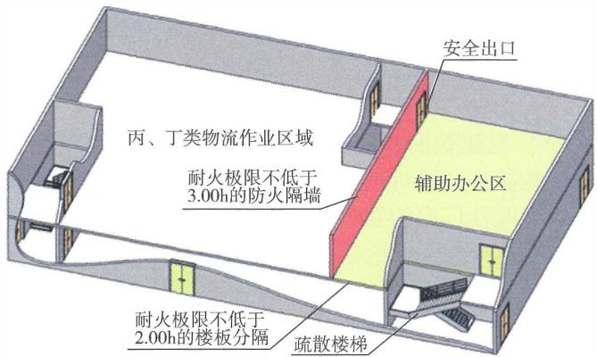

（a）平剖面透视图

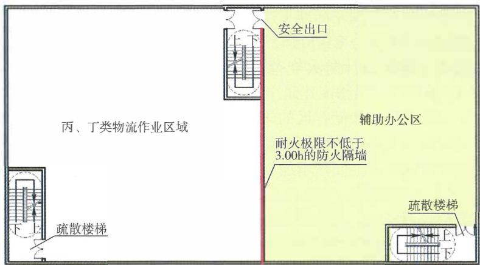

（b）二层平面图

图5-1 物流建筑中物流作业区与辅助办公区的安全出口或疏散楼梯独立设置要求示意图

# 5.3 民用建筑

# 5.3.1 下列民用建筑的耐火等级应为一级：

1 一类高层民用建筑； 

2 二层和二层半式、多层式民用机场航站楼； 

3 A类广播电影电视建筑； 

4 四级生物安全实验室。 

# 【条文要点】

本条规定了民用建筑中耐火等级应为一级的基本范围，对这些建筑的耐火等级要求从严，应按照最高设防等级确定。 

# 【实施要点】

（1）建筑的耐火等级表征了建筑结构能够抵抗火焰、高温的作用，正常发挥预定功能的性能。在城镇中心区内新建、改建、扩建的民用建筑应尽可能提高建筑的耐火等级，以防止因一座建筑发生火灾而蔓延成大规模的街区火灾，提高城镇区域减灾防灾的能力。 

高层民用建筑根据建筑高度、使用功能和楼层的建筑面积可分为一类和二类两类，具体分类标准可以参照现行国家标准《建筑设计防火规范》GB50016的规定。例如，国家标准《建筑设计防火规范》GB50016—2014（2018年版）第5.1.1条规定，一类高层民用建筑包括： 

1）建筑高度大于 $50\mathrm{m}$ 的公共建筑； 

2）建筑高度 $24\mathrm{m}$ 以上任一楼层建筑面积大于 $1000\mathrm{m}^2$ 的商店、展览、电信、邮政、财贸金融建筑和其他多种功能组合的建筑； 

3）医疗建筑、重要公共建筑、独立建造的老年人照料设施； 

4）省级及以上的广播电视和防灾指挥调度建筑、网局级和省级电力调度建筑； 

5）藏书超过100万册的图书馆、书库； 

6）建筑高度大于 $54\mathrm{m}$ 的住宅建筑（包括设置商业服务网点的住宅建筑）。 

除上述建筑外，其他高层民用建筑可以划分为二类高层民用建筑。 

（2）民用机场航站楼根据航站楼的流程一般可分为三大类： 

一层和一层半式流程的航站楼、二层和二层半式流程的航站楼、多层式流程的航站楼。 

1）一层和一层半式流程的航站楼主要用于小型机场，建筑面积较小、使用人员少。一层式流程的航站楼的陆侧道路与航站楼内离港、到港旅客办理手续在同一楼层。一层半式流程的航站楼的陆侧道路是单层的，航站楼局部两层，其中地面层具有混合到港和离港处理系统，二层是离港旅客的休息厅。出发旅客在一层办理手续后上二层登机，到达旅客在二层下机后到一层提取行李，出发和到达旅客的行李处理均在一层。一层和一层半式流程的航站楼可参见图5-2。 

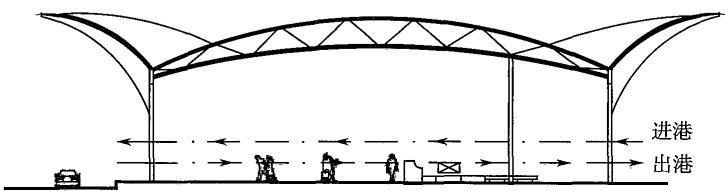

（a）一层式剖面流线图

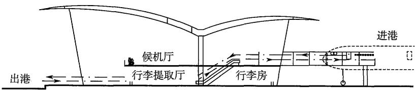

（b）一层半式剖面流线图

图5-2 一层式和一层半式流程的航站楼示意图

2）二层式流程的航站楼一般用于中型机场，二层半式流程的航站楼一般用于中型及以上机场，较一层和一层半式航站楼的建筑面积更大、使用人数更多。二层式流程的航站楼的陆侧道路及车道边为两层，旅客的出发和到达流程在剖面上分离，出发在上层，到达在下层。出发托运行李在二层办票柜台交运后通过行李系统传输设备送到一层或地下层处理，而到达的行李提取流程在一层或地下层进行。二层半式流程的航站楼是在两层式旅客流 

程的基础上，将指廊区域的出发到达旅客流程分层分流，采用到港下夹层或到港上夹层的模式。二层式和二层半式流程的航站楼可参见图5-3。 

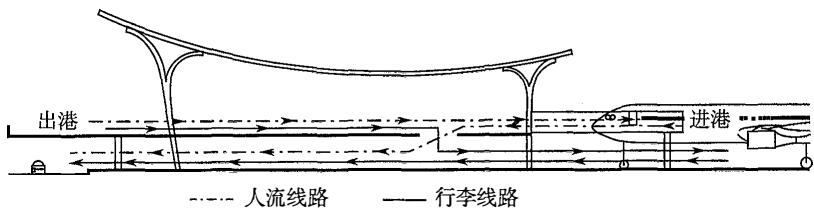

（a）二层式剖面流线图

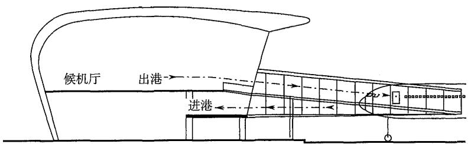

（b）二层半下夹层式指廓剖面图

图5-3 二层式和二层半式流程的航站楼示意图

3）多层式流程的航站楼规模巨大，功能复杂且综合，使用人数多，可燃物数量大、种类多，人员行走距离长，疏散路线长且复杂，主要用于枢纽航空港。如北京首都国际机场三号航站楼、北京大兴国际机场航站楼、上海浦东宝安国际机场二号航站楼、深圳宝安国际机场三号航站楼等。该类航站楼主要用于大型机场航站楼解决复杂的功能需求（旅客及行李）而采用多楼层布局的特殊情形。大部分情况为上层用于国际出发，下层用于国际到达，最下层用于国内出发和到达混流。多层式流程的航站楼可参见图5-4。 

(3) 广播电影电视建筑是用于生产、存储、监测、分发广播电影电视节目的建筑, 包括广播电视台, 传输网络中心, 中波、短波广播发射台, 电视、调频广播发射台, 广播电视卫星地球站, 广播电视微波站, 广播电视监测台 (站), 广播电视发射 

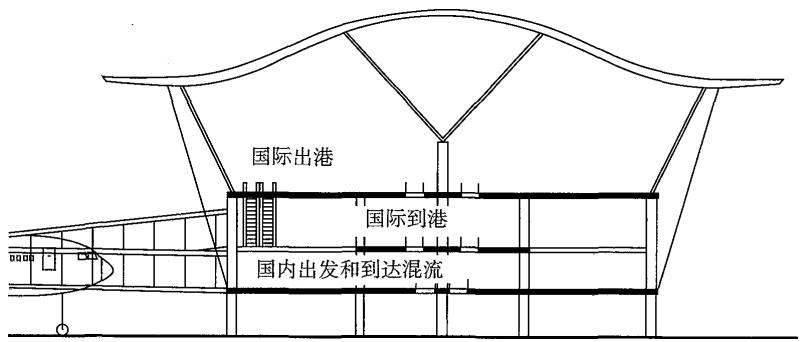

图5-4 多层式流程的航站楼示意图

塔。广播电影电视建筑应根据建筑使用功能的重要程度、建筑高度、服务范围、火灾危险性、疏散和扑救难度等因素分为A类和B类，具体分类标准可以按照国家现行标准《广播电影电视建筑设计防火标准》GY5067确定。例如，根据GY5067—2017第3.0.1条规定，A类广播电影电视建筑包括： 

1）省级及以上的广播电视台、传输网络中心； 

2）建筑高度超过 $50\mathrm{m}$ 的广播电视台、传输网络中心； 

3）省级及以上中波、短波广播发射台； 

4）总发射功率不小于 $100\mathrm{kW}$ 的中波、短波发射台； 

5）省级及以上的电视、调频广播发射台； 

6）总发射功率不小于 $10 \mathrm{~kW}$ 的电视、调频广播发射台； 

7）省级及以上的广播电视监测台（站）； 

8）省级及以上的广播电视发射塔； 

9）主塔楼屋顶离室外设计地面高度不小于 $100 \mathrm{~m}$ 的广播电视发射塔或塔下建筑高度不小于 $24 \mathrm{~m}$ 的广播电视发射塔； 

10）广播电视卫星地球站、省级及以上广播电视微波站； 

11）建筑面积不小于 $2000\mathrm{m}^2$ 的摄影棚。 

因此，A类广播电影电视建筑为服务范围、政治和社会影响大的广播影视建筑，遭受火灾将产生严重的社会影响。除上述建筑外，其他广播电影电视建筑可以划分为B类广播电影电视建筑。 

（4）■级生物安全实验室为生物安全最高级别的实验室，在发生火灾时要以保护实验人员免受感染，防止致病因子外泄为主要目标，建筑应具有最高等级的耐火性能。有关规定还可参见本指南第4.3.13条的【实施要点】。 

5.3.2 下列民用建筑的耐火等级不应低于二级： 

1 二类高层民用建筑； 

2 一层和一层半式民用机场航站楼； 

3 总建筑面积大于 $1500\mathrm{m}^2$ 的单、多层人员密集场所； 

4 B类广播电影电视建筑； 

5 一级普通消防站、二级普通消防站、特勤消防站、战勤保障消防站； 

6 设置洁净手术部的建筑，三级生物安全实验室； 

7 用于灾时避难的建筑。 

# 【实施要点】

（1）本条规定耐火等级应为二级的民用建筑，主要为发生火灾会导致较大人员伤亡、较大社会影响、较严重后果的建筑。本条规定的“人员密集场所”包括宾馆、饭店、商场、集贸市场、客运车站候车室、客运码头候船厅、民用机场航站楼、体育场馆、会堂以及公共娱乐场所等公众聚集场所，医院的门诊楼、病房楼，学校的教学楼、图书馆、食堂，养老院，福利院，托儿所，幼儿园，公共图书馆的阅览室，公共展览馆、博物馆的展示厅，学校和企事业单位的集体宿舍等建筑。有关规定还可参见本指南第3.1.3条的【实施要点】。 

（2）本条规定的“消防站”是针对城市消防救援站，即建设在城乡规划区内、由政府统一投资和管理的各类消防救援站，或由民间集资兴建、政府统一管理的多种形式的消防救援站。城市消防救援站担负着扑救火灾和抢险救援的重要任务，是城市消防基础设施的重要组成部分，根据其遂行任务和辖区大小可以分为普通消防救援站、特勤消防救援站和战勤保障消防救援站三类。其中，普通消防救援站分为一级普通消防救援站、二级普通消防救援站和小型普通消防救援站。 

普通消防救援站是有明确辖区，主要承担火灾扑救和一般灾害事故抢险救援任务的消防救援站，是城市扑救火灾和处置灾害事故的主体，在消防保卫实践中发挥着决定性的作用。特勤消防救援站是主要承担特种灾害事故应急救援和特殊火灾扑救任务的消防救援站，对有明确辖区要求的，同时承担普通消防救援站任务。战勤保障消防救援站是主要承担消防装备、器材和物资的储备、运输、维修、保养等职能，并为普通和特勤消防救援站执行任务提供应急综合保障的消防救援站。 

其他消防救援站（如小型普通消防救援站、企业消防站、民办消防站等）和有特殊功能需求的消防救援站（如航空消防救援站、水上消防救援站、搜救犬消防救援站、轨道消防救援站等），可以根据消防救援站的类别、功能、装备、用房需求和建设地点等比照城市消防救援站的耐火等级要求，确定相应的建筑耐火等级，一般不应低于二级。 

（3）“设置洁净手术部的建筑”包括独立建造的洁净手术部建筑、在建筑内部分楼层或区域设置洁净手术部的医疗建筑。有关设置要求，还可按照现行国家标准《医院洁净手术部建筑技术规范》GB50333的规定确定。 

（4）“用于灾时避难的建筑”主要为在建造时规划用于供遭受地震、海啸、台风等重大自然灾害的人员就近就地紧急疏散、避难、临时生活和集中救助的安全场所，如公共体育场、公共体育馆、全民健身中心等公共体育场馆，学校的教学建筑，区域的中心医院建筑等；不包括为满足防疫和自然灾害救援、受灾群众应急避难和过渡安置等需要，统一规划建设的灾区应急避难场所和临时聚居点的建筑。前者为功能固定的永久性建筑，后者为临时性过渡建筑。 

（5）本条第3款规定的“人员密集场所”，包括独立建造的人员密集场所和设置人员密集场所的其他建筑。人员密集场所的范围，参见本指南第3.1.3条的【实施要点】。 

（6）其他实施要点，可参见本指南第5.3.1条的【实施要点】。5.3.3 除本规范第5.3.1条、第5.3.2条规定的建筑外，下 

列民用建筑的耐火等级不应低于三级： 

1 城市和镇中心区内的民用建筑； 

2 老年人照料设施、教学建筑、医疗建筑。 

# 【实施要点】

我国幅员辽阔，各地的社会经济发展水平、地理条件、人文环境等均有一定差异，建筑的规模、高度也有较大差异。对一些建筑规模较小的民用建筑，尽管位于城市和镇中心区内，仍允许采用三级耐火等级。而老年人照料设施、教学建筑、医疗建筑有些还位于乡村，建筑规模可能较小，因而也允许采用三级耐火等级。但是，当这些建筑的规模较大，或经济条件允许时，仍要尽量将建筑的耐火等级提高至不低于二级；对于老年人照料设施、教学建筑、医疗建筑、体育运动建筑等，如在建造时还兼具应急避难场所的功能，建筑的耐火等级应符合本规范第5.3.2条的规定。当采用木结构建筑或木结构组合建筑时，应按照本规范和现行国家标准《建筑设计防火规范》GB50016等技术标准的规定确定其耐火等级。 

# 5.4 其他工程

5.4.1 地铁工程地下出入口通道、地上控制中心建筑、地上主变电站的耐火等级不应低于一级。地铁的地上车站建筑的耐火等级不应低于三级。 

# 【实施要点】

（1）地铁的地下出入口通道是出入地铁车站的安全疏散通道，属于地下车站建筑的一部分。地铁控制中心是负责一条或若干条轨道交通线路平时运营和应对灾害的调度指挥中枢。主变电站对保证线路正常运营发挥着重要作用。这些建筑的耐火等级均应严格要求。 

（2）地铁地上车站建筑的耐火等级可以按照相应规模和建筑高度的民用建筑确定，但根据《中华人民共和国消防法》（2021年修正），地铁地上车站的站厅公共区属于人员密集场所中的人员聚集场所。但为满足不同规模的地上车站建筑的建设需要，使 

规模较小的地上车站建筑可以采用钢木、砖木结构以及其他新型建筑材料，本条规定地铁地上车站的建筑耐火等级不应低于三级。本条有关地铁的地上车站建筑的耐火等级要求与现行国家标准《地铁设计防火标准》GB51298—2018的规定有所区别。 

5.4.2 交通隧道承重结构体的耐火性能应与其车流量、隧道封闭段长度、通行车辆类型和隧道的修复难度等情况相适应。 

# 【条文要点】

隧道结构不仅一旦受到破坏修复难度大，而且在火灾条件下，隧道结构安全还是保证消防救援和在灾后尽快修复隧道的重要条件，需要具备与其火灾危险性等相适应的耐火性能，并根据隧道内可能发生的火灾场景对结构的重点部位采取相应的防火保护措施。本条规定了交通隧道承重结构体应具备的耐火性能确定原则。 

# 【实施要点】

交通隧道的空间狭长且相对封闭，火灾的烟热排出困难，外部消防救援条件受限。交通隧道的类型、允许通行的车辆类型不同，则火灾类型和规模、火灾对隧道结构体的热冲击效应和热作用强度不同；隧道内的交通方式、车流量、隧道封闭段长度不同，则火灾危险性也不同；隧道的位置、施工方式、隧道的重要性等不同，则火灾对隧道结构的破坏、灾后隧道修复的要求不同。不同隧道可能的火灾规模、火灾持续时间都会有所差异。因此，隧道结构的耐火性能应考虑隧道内发生火灾后在隧道内部可能达到的最高温度、升温特性、结构体受高温作用后的力学行为，确定相适应的设定火灾规模、火灾发展过程中的温度变化与时间的关系，以保证隧道结构在可能的火灾作用下的完整性、稳定性。针对通行不同车辆和不同封闭段长度的交通隧道，对隧道结构的耐火性能要求可以不同，需要综合考虑上述因素以及隧道内外部的消防措施、外部消防救援力量、隧道的重要性、修复难度等因素合理确定。例如，通行小汽车和公共汽车的隧道，结构的耐火性能可以采用碳氢化合物（HC） 

升温曲线测试；通行运送普通物品的货车或卡车的隧道，结构的耐火性能需要采用HC升温曲线或RABT升温曲线测试；允许通行危化品或油罐车、燃气槽车的隧道，结构的耐火性能需要采用RABT升温曲线或RWS升温曲线测试。有关HC升温曲线、RABT升温曲线及隧道结构相关耐火性能的测试方法，请参见现行国家标准《建筑构件耐火试验可供选择和附加的试验程序》GB/T26784的规定。其中，RABT升温曲线是在一系列研究结果的基础上发展而来的，用于测定隧道结构耐火性能的升温曲线，详细信息请见德国联邦交通部公路建设局1995年发布的《ZTV一隧道，关于公路隧道建设补充技术条款及准则》。RWS升温曲线是1979年在荷兰TNO实验室的研究结果基础上共同研究出来的，用于测定隧道结构耐火性能的升温曲线，有关信息请参见GT-98036 98-CVB-R1161 Fire Protection for Tunnels Part1: fire test procedure cimmersed tunnels 和TNO BI-86-64/00.65.8.0020 Specifications for Temperature Resistance of Boosters and Description of Testing Method。该文件规定了隧道的火灾场景确定方法与相关消防安全工程设计方法和隧道结构的耐火测试方法。 

隧道结构的防火保护一般可采用在混凝土中添加聚丙烯纤维或在混凝土结构外安装防火绝热保护层等方法。不同类型交通隧道结构体的具体耐火性能要求、相应的隧道结构体表面防火保护措施，可以参见现行国家标准《建筑设计防火规范》GB50016等标准的规定确定。 

5.4.3 城市交通隧道的消防救援出入口的耐火等级不应低于一级。城市交通隧道的地面重要设备用房、运营管理中心及其他地面附属用房的耐火等级不应低于二级。 

# 【条文要点】

本条规定了城市交通隧道的消防救援出入口和建设在地面上的重要设备用房、运营管理中心及其他地面附属用房的最低耐火等级要求。 

# 【实施要点】

服务于城市交通隧道的设备用房，主要包括隧道的通风风机 

房、排烟风机房、水泵房、变电站、消防设备用房等；其他地面附属用房，主要包括收费站、道口检查亭和运营管理中心等。这些用房以及消防救援专用口，在火灾情况下担负着保障消防救援的重要作用，需确保用房的消防安全。 

其他交通隧道相关用房和设施的耐火等级要求，可以比照本条规定确定。设置在隧道内的设备用房、避难间等房间的耐火性能，应根据本规范有关地下、半地下建筑的耐火等级要求，按照不应低于一级耐火等级的相应要求确定。 