# 安全疏散与避难设施

# 7.1 一 般规定

7.1.1 建筑的疏散出口数量、 位置和宽度， 疏散楼梯（间） 的形式和宽度， 避难设施的位置和面积等， 应与建筑的使 用功能、 火灾危险性、 耐火等级、 建筑高度或层数、 埋深、 建筑面积、人员密度、人员特性等相适应。 

# ［条文要点】

疏散和避难功能是建筑消防安全的基本功能，任何一座建筑 均应具有供人员在火灾时疏散、 避难的设施。 疏散和避难设施应 满足人员安全疏散和安全避难的要求， 这是疏散和避难设施的功 能目标要求。 本条规定了建筑有关安全疏散、 避难的基本功能和 疏散、 避难设施的基本功能目标要求。 

# 【实施要点］

(1)安全疏散和避难是在建筑发生火灾时，使用人员能够在 火灾及其烟气达到可能危及人身安全状态之前， 全部自主或依靠 他人帮助安全疏散到安全地点区域的活动过程。 建筑的安全疏 散与避难设施在建筑发生火灾时需要用千保证人员的生命安全， 是建筑应具备的基本设施。 

建筑的安全疏散设施包括房间的疏散门、 疏散走道、 楼层或 防火分区的安全出口门、 建筑的室内和室外疏散楼梯（间）、 室 内和室外的疏散坡道、 室外场地等， 以及疏散照明和疏散指示标 志。 避难设施包括避难层、 避难间、 避难走道、 维持避难区域中 人员安全停留的支持设施等，防烟楼梯间的前室、上人屋面、下 沉式广场或庭院、 敞开式或具有良好通风与排烟条件的外走廊等 均可以作为避难场所。 

(2)影响疏散与避难设施发挥作用的关键因素包括：疏散出 口（安全出口和房间疏散门） 和疏散楼梯的数量、 布置位置和宽 

度，疏散走道的宽度和高度，疏散楼梯间的防火防烟性能，避难 层或避难间的位置、避难面积和防火防烟性能，避难走道的设置 位置和防火防烟性能，疏散指示标志和疏散照明的设置位置、大 小及其照度等。 这些因素又与建筑的竖向疏散高度或水平疏散距 离、建筑的层数、防火分区或房间的大小及内部布置、室内空间 高度、建筑的耐火等级等建筑特性，可燃物的类型和分布、火灾 荷载密度和总火灾荷载等所决定的火灾特性，人员密度和疏散人 数，使用人员的年龄、性别、不同人员的构成比例、受教育程 度、安全意识、行为习惯等人员特性关系密切。 

因此，建筑的疏散和避难设施应结合建筑中每个楼层、区域 或房间内的使用人员特性、建筑特性、火灾特性，在充分考虑影 响建筑中人员疏散与避难安全的主要因素的基础上，确定疏散策 略，合理规划疏散路线，设置与建筑的使用功能、火灾危险性、 耐火等级、建筑高度或层数、埋深、建筑面积、人员密度、使用 人员特征等相适应的疏散与避难设施。 所谓 “相适应” ，就是建 筑中的疏散与避难设施能够在建筑发生火灾时为人员疏散和避 难提供安全的保障，能够满足人员安全疏散和避难的要求，使人 员在疏散和避难过程中不会受到火灾及其烟气的危害性作用。 例 如，耐火等级高、火灾危险性低的建筑，疏散距离可以大些；建 筑高度高、火灾危险性大的建筑以及人员密集的场所、地下建 筑，疏散楼梯间的防烟性能应高些，疏散距离应短些；建筑高度 高或埋深大的建筑，疏散宽度应增大等；超高层建筑应考虑人员 避难所需避难层等，医院住院部和老年人照料设施应考虑设置避 难间等。 

(3)一般来说，建筑的疏散设施设置应遵循以下基本原则： 

1)双向疏散原则。 疏散出口和疏散楼梯的设置位置，一般 应能使人员在一个楼层、区域、房间、走道具有2个及以上的疏 散方向和出口，详见本指南第7.1.2条的【实施要点］；尽量避 免设置袋形走道。 袋形走道是只有一个出入口的走道，形如口 袋，这种走道容易导致误入其中的人员在疏散过程中增加与袋形 走道等长甚至更长的疏散距离。 

2)疏散路径的构成应简单明了、通畅， 少曲折， 尽量避免 在疏散走道和出入口处设置台阶， 不应设置影响人员安全疏散， 或减小疏散宽度的凸出物。 疏散行动是在周围环境和人的心理都 处于异常状态下进行的， 疏散设施的设置必须以这种异常状态为 基础， 尽量使疏散路线顺直， 避免多次弯曲的疏散走道、难以分 辨位置的楼梯等，疏散路线及设施的设置应考虑如何有效防止人 员在拥挤和跟随情况下发生意外， 尽可能避免通过设置诱导灯和 疏散标志来改善疏散条件。 在疏散走道、疏散楼梯间内要避免使 柱体凸出墙面， 不应放置固定或移动的大型物体或设备等。 在疏 散走道和出入口处设置台阶极易引发人员拥堵、摔倒等不利于人 员安全疏散的情形， 应予避免。 当不可避免时， 不应在出入口处 $3 \mathrm { m }$ 范围内设置台阶， 在疏散走道上设置的台阶不应少于3级， 否则应采用坡道等方式。 

3）疏散出口、疏散走道的宽度沿疏散方向不应小于所经过的 出口、走道的宽度。 例如， 当人员从房间的疏散门出来后， 疏散 走道的宽度应根据走道的长度和同时进入走道内的人数计算确定， 保证该走道具有足够的人员容量， 且疏散走道的宽度不应小于连 通该走道的任一疏散门的宽度。 同时， 从疏散走道、房间进入楼 梯间的门的宽度不应小于所连接走道或房间最大疏散距离覆盖范 围内分配的疏散宽度，楼梯间内梯段的宽度不应小于从疏散走道、 房间进入楼梯间的门的宽度。 但是， 对千疏散人数较多的场所， 也不是疏散走道、疏散楼梯的宽度越宽越好。 疏散走道、疏散楼 梯应有一个保证高效利用的合理宽度范围， 宽度过宽可能导致疏 散过程混乱， 降低疏散效率， 甚至引发踩踏事故；宽度窄则不能 满足人员安全疏散的要求， 延长疏散时间。 比如， 美国相关标准 要求超高层建筑的疏散楼梯梯段的净宽度不应大千 $1 , 4 0 \mathrm { m }$ , 最小 净宽度不应小千 $1 , 1 0 \mathrm { m }$ ; 本规范第7.1.4条第4款和澳大利亚建筑 规范均规定， 当疏散楼梯、疏散走道、疏散通道的宽度大于 $2 . 0 \mathrm { m }$ 时， 应采用栏杆隔开， 分隔后的每隔通道宽度不应大于 $2 . 0 \mathrm { m }$ 。 

4)疏散出口和疏散楼梯的位置、宽度， 楼层和区域内规划 的疏散路线应符合人在火灾中的心理和行为， 符合人的行为习 

惯，能使人员在疏散过程中沿疏散方向感到越来越安全。在建筑 发生火灾时，人的思维能力、判断能力和行动能力不可能与在 正常情况下一样，疏散很难有序进行。尽管要完全弄清应急条件 下人的心理和行为不是很容易，但是，根据国内外的大量研究成 果，人在感觉到危险时存在选择远离危险、从未知方向返回已知 方向、从暗的方向奔向明亮的方向、在大多数情况下跟随大众逃 生等特性。因此，在对应人员进出的主要出口，一般应设置足够 宽度且直通的疏散通道、疏散走道，使疏散路线与人们日常熟悉 的行走路线一致，以便在紧急情况下可以条件反射地朝向平时经 常使用的通道和疏散楼梯疏散。这样可以提高人员疏散的安全 性，尽最减小拥挤的可能。对千那些不经常使用的疏散出口和疏 散楼梯，应设置明确清晰的引导或指示标志，适当提高疏散照明 的照度值，以缓解人的恐惧心理，提高人员疏散的预期，增加安 全感。 

人员在疏散过程中往往会因前后信息不对称而引发拥挤、踩 踏事故。例如，1989年英国谢菲尔德希尔斯堡(Hillsborough) 体育场发生的踩踏事故就能充分说明这一点。该事故发生在比赛 开球后 $3 0 \mathrm { m i n }$ , 此时外面栏杆处虽然还有空间，但屋顶平台上站 满了人。在外面，数以千计的球迷推着向前挤。 由于外面非常拥 挤，情形很危险，警察决定打开体育场的一扇大门。突然，外面 的强大压力戏剧性地传入窄窄的通道，这个通道离屋顶平台最 近。后面的巨大压力将前面的人挤在栏杆上不能动弹。在此过程 中，因为后面的人可能会不知不觉地增大人群中的压力，使人群 中部、前部达到挤压状态，特别是前面的人遇到障碍突然停下来 时，会加剧挤压，而被踩踏的人又不能把自己的困境传达给后面 的人。最后这次事故导致95人因窒息或踩踏死亡，400人受伤。 

5)楼层、 区域和房间内的疏散距离应考虑人员的疏散能力， 特别是使用人员的行为能力、性别与年龄构成情况，使疏散出 口布置均匀分散，并应与建筑的室内空间高度、火灾危险性等匹 配，可参见本指南第7.13条的【实施要点】。应区别不同使用人. 群的疏散需要，特别关注行为能力较弱的人群，如病人、残障人 

员、 儿童、 老年人等的疏散需要。 一般来说， 上述人群使用的建 筑要尽量设置独立的疏散出口和疏散楼梯， 疏散路线尽量避开其 他疏散人群， 控制疏散距离。 

6)合理设置疏散照明和疏散指示标志， 疏散照明的照度、 疏散指示标志的大小和形式，应与疏散出口、 疏散走道、 疏散楼 梯的宽度， 疏散距离或人员疏散的行走距离， 室内空间高度、 开 敞区域的面积大小匹配。 

7)正常情况下， 电梯和自动扶梯不应计作安全疏散设施， 应尽量减少使用避难走道， 尽量避免采用剪刀楼梯间、 共用疏散 楼梯间作为疏散楼梯。 

7.1.2 建筑中的疏散出口应分散布置， 房间疏散门应直接 通向安全出口， 不应经过其他房间。 疏散出口的宽度和数 量应满足人员安全疏散的要求。 各层疏散楼梯的净宽度应 符合下列规定： 

1 对于建筑的地上楼层， 各层疏散楼梯的净宽度均不 应小于其上部各层中要求疏散净宽度的最大值； 

2 对于建筑的地下楼层或地下建筑、 平时使用的人民 防空工程， 各层疏散楼梯的净宽度均不应小于其下部各层 中要求疏散净宽度的最大值。 

# 【条文要点】

本条规定是在建筑内设置疏散出口的基本原则、 疏散出口和 疏散楼梯设置的基本功能目标要求和关键性能要求。 本条规定的 疏散出口包括房间的疏散门和防火分区的安全出口， 而楼层上通 向疏散楼梯的门就是安全出口， 因此本条规定的疏散出口设置要 求实际上包括疏散楼梯或疏散楼梯间的设置要求。 本规范的 “地 下建筑“ 原则上包括平时使用的人民防空工程，但为表述得更清 楚， 避免误解， 在本规范的相关条文中还是将 “平时使用的人民 防空工程” 单独列出。 

# 【实施要点】

(1)疏散出口是建筑内用千火灾时人员离开火场逃生并符合 一定要求的出口， 包括房间疏散门和安全出口。 疏散出口的设置 

要注意出口的宽度、位置的合理性和可达性。 

1)房间疏散门是建筑内的房间直接开向疏散走道的门，当 房间的疏散门直接通向室外时，可以按照安全出口考虑，并应符 合安全出口的设置要求。 对于设置套房的房间，内部套房的门不 能计作该房间的疏散门。 

2)安全出口是供人员安全疏散用的楼梯间、室外楼梯的楼 层出入口，或直通室内、室外疏散安全区的出口。 安全出口是建 筑室内人员疏散进入室内外疏散安全区的最后节点，合理设置的 安全出口能够提高人员在火灾时疏散的安全性。 安全出口的设置 应注意以下情况： 

当疏散楼梯为防烟楼梯间、室外疏散楼梯时，安全出口 应为室内区域（包括防火分区、楼层或房间）进入防烟楼梯间前 室、室外疏散楼梯的入口。 

当建筑采用避难走道疏散至室外时，安全出口应为防火 分区、楼层进入避难走道前室的入口。 

当避难间设置通往疏散楼梯间，或其他室内、室外疏散 安全区的出口时，楼层上进入避难间的入口可以作为安全出口。 

＂室内疏散安全区” 是在建筑发生火灾时能保证人员疏散安 全，并主要用于人员疏散的区域，该区域必须具备足够的防火性 能，满足火灾时可能处千该区域的全部人员安全疏散的要求。常 见的室内疏散安全区主要有：采用防火墙和甲级防火门分隔的相 邻防火分区，避难走道，封闭楼梯间，防烟楼梯间及其前室，通 向相邻建筑的室内、室外廊道，符合防火要求的换乘通道、城市 通廊，符合防火和人员安全疏散要求的有顶棚的商业步行街，符 合要求的避难间等。 当相邻防火分区在防火分隔处不是全部采用 防火墙和甲级防火门分隔时，这两个防火分区不能相互作为室内 疏散安全区。 室内疏散安全区可以兼作消防救援人员进入建筑实 施救援的安全区域。 

＂室外疏散安全区” 是在建筑火灾时能足够容纳建筑内疏散 出来并需要临时停留的全部人员，具备人员安全停留和疏散至更 安全区域的条件的室外露天、半露天场地。常见的室外疏散安全 

区主要有：室外设计地面， 露天下沉广场或庭院， 上人屋面或露 天平台， 连接相邻建筑的敞开或半敞开的天桥或连廊， 室外楼 梯， 建筑中连接疏散楼梯（间）、 相邻建筑上人屋面、 天桥的敞 开外廊等。 

3)疏散出口不一定是安全出口， 安全出口是通向防火性能 更高区域的疏散出口， 是疏散出口的一种， 主要针对建筑中的一 个楼层或一个独立的防火分区而言。 例如， 一座3层的办公楼， 在首层设置了一间大会议室， 在其他楼层设置了办公室。 则首层 大会议室直通室外的疏散出口既是会议室的安全出口， 又是会议 室的疏散出口， 而各层办公室通向疏散走道的房间门就只是这些 房间的疏散出口， 而不是安全出口， 二层和三层上经疏散走道通 向疏散楼梯间处的入口则是该楼层的安全出口。 又如， 一座3层 的商店建筑， 二层营业厅设置了4个出口， 每个出口均直接通向 封闭楼梯间。 则这4个出口既是该营业厅的安全出口， 又是其疏 散出口。 参见图7-1。 

(2)根据双向疏散原则， 在建筑中的一个防火分区、 划分一 个防火分区的一个楼层、 一个防火分区内的一个区域或房间一般 应设置2个及以上疏散出口， 且相邻两个出口之间的水平距离应 能使该区域或房间内的人员在疏散时具有至少两个不同方向的疏 

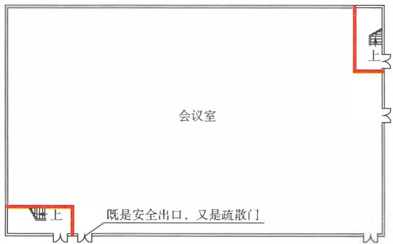

(a)首层会议室平面图

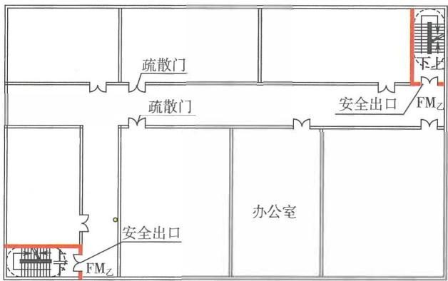

(h)二、 三层办公室平面图

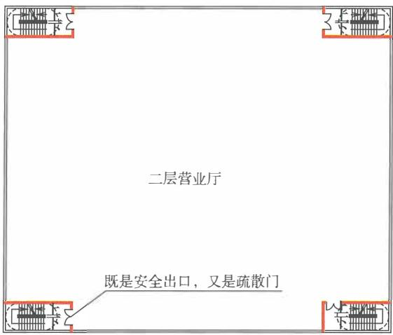

(C)二层营业厅平面图

图7-1 安全出口和房间疏散门设置示意图

散路径。 因此，疏散出口应比较均匀地分散设置在平面上的不同 方位。 如果两个疏散出口之间距离太近，在人员疏散时实际上只 相当于起到一个出口的作用，一旦这个方向的出口被烟火封堵， 这两个出口都将难以有效发挥疏散作用，使人员面临难以安全疏 散的巨大风险。 

尽管火灾的发生概率有大小之分，但疏散设计必须考虑建筑 内所有区域都有可能发生火灾的情况。 因此， 需要在建筑内任何 区域都尽可能有2个及以上方向的疏散路径。 这是疏散设施设置 的一条基本原则。 如果只能有一个方向的疏散路径时， 必须限制 疏散通道、疏散走道、出口服务区域的大小或疏散距离。 

1)疏散通道和疏散走道的双向疏散。 对于建筑内的疏散通 道和疏散走道， 在通道和走道的端部设置疏散出口， 不在疏散走 道尽端或两侧布置房间， 避免形成袋形走道， 是比较好的做法。 否则， 在疏散通道或疏散走道要尽量设置避难阳台， 连接其他建 筑屋面、楼层的天桥或连廊， 连接疏散楼梯的外廊等可以供人员 在紧急情况下逃生的设施。 

2)房间、防火分区或楼层的双向疏散。 具有一定面积的房 间、防火分区或楼层， 应设置不少于2个的疏散出口或疏散楼 梯。 设置一个疏散出口的区域或房间的面积， 应根据使用人员的 行为能力、人员密度、疏散人数、区域或房间内的火灾发展特 性、室内高度等因素所决定的疏散距离确定。 因此， 不同使用功 能的建筑， 其中不同火灾危险性、使用人数和空间特性的楼层、 区域或房间设置一部疏散楼梯或一个疏散出口的条件可以不同。 一般， 需要根据房间或区域内的火灾危险性、室内高度等因素， 通过限制人数、疏散距离来反推允许的建筑面积， 或者直接限制 其最大允许疏散距离。 

3)当一个防火分区、划分一个防火分区的一个楼层、一个 防火分区内的一个区域或房间设置多个疏散出口时， 相邻两个疏 散出口之间的间距多 大可以作为两个独立疏散方向的出口， 应视 该区域或房间的建筑面积、几何形状而定。 这在不同国家的判定 方法略有差异， 一般可以采用相邻两个出口中点之间的夹角大小 进行判定。 当一个区域或房间内的最远点至最近两个疏散出口中 点连线之间的夹角大千 $3 0 ^ { \circ }$ '最好为大千或等千 $4 5 ^ { \circ }$ '或者同侧 两个疏散出口最远边缘之间的直线距离不小于所在房间最长对角 线长度的1/2 时， 可以认为这两个疏散出口是处千两个不同疏散 方向上， 即符合双向疏散的要求。 参见图7-2。 

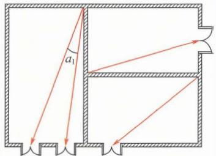

单向疏散( $a _ { 1 } < 4 5 ^ { \circ }$

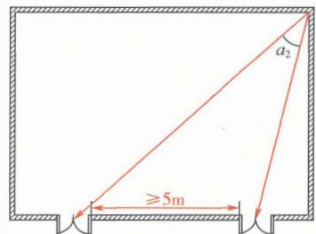

双向疏散 $a _ { 2 } \geqslant 4 5 ^ { \circ }$

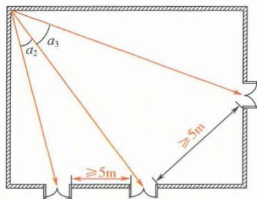

多向疏散( $a _ { 2 } \geqslant 4 5 ^ { \circ }$ $a _ { 3 } \geqslant 4 5 ^ { \circ }$

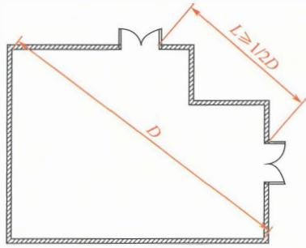

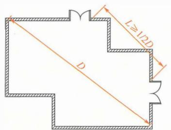

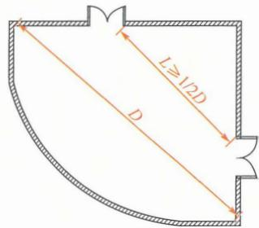

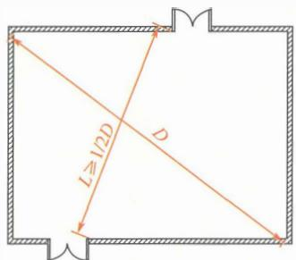

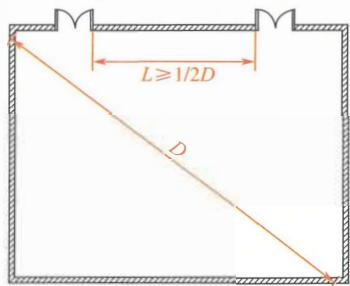

图7-2单向疏散、双向疏散、多向疏散和疏散出口分散布置示意图 $D$ 为房间内最长的对角线。

例如，英国相关标准要求设置一个出口的房间，房间内的 最大疏散距离不应大于 $7 . 5 \mathrm { m }$ 或 $9 \mathrm m$ (区别不同用途的建筑）；房 间中相邻两个安全出口中点与室内任一点连线的夹角大于或等千 $4 5 ^ { \circ }$ 时，可以将这两个出口视为2个独立的出口。 国家标准《建 筑设计防火规范》GB50016—2014 (2018年版）第5.5.2条规定， 建筑内的安全出口和疏散门应分散布置，且建筑内每个防火分区 或一个防火分区的每个楼层、 每个住宅单元每层相邻两个安全出 口、 每个房间相邻两个疏散门最近边缘之间的水平距离不应小千 $5 \mathrm { m }$ 。 国家标准《地铁设计防火标准》GB 51298 一2018第5.1.4条 规定，每个站厅公共区应至少设置2个直通室外的安全出口。 安 全出口应分散布置，且相邻两个安全出口之间的最小水平距离不 应小千 $2 0 \mathrm { m }$ 。 换乘车站共用一个站厅公共区时，站厅公共区的安 全出口应按每条线不少千2个设置。 上述关千疏散出口水平距离 的规定，使人员在建筑着火后能有多个不同方向的疏散路线可供 选择和疏散。 

(3)疏散出口的设置应满足人员安全疏散的要求，是疏散出 口设置的基本功能目标要求；疏散出口的数量和宽度应满足建筑 物内的人员在接到火警信息后，能在规定的最短时间内全部安全 疏散到安全地带的要求，是疏散出口的基本性能要求。 疏散出口 的设置与区域内的疏散距离密切相关，合理设置疏散出口可以较 好地保证区域内的疏散距离符合要求，而区域内的疏散距离要求 又能使疏散出口的布置位置更合理。 

1)疏散出口的宽度对人员通过出口的流量影响很大，而出 口的人流量直接影响人员疏散所需时间，并进而影响到人员疏散 的安全性。 由于每个人在行走时都需要占用一定的宽度和面积， 因此，当出口宽度符合通过人群的人流股数且具有适当余最时， 疏散效率高。 否则，容易产生拥挤，甚至产生起拱效应而导致疏 散混乱、 人员相互踩踏等事故。 根据我国人体的特征，每股人流 的疏散宽度可以平均按 $0 . 5 5 \mathrm { m }$ 考虑，对千特定场所，可以按照此 平均值调整。 因此，疏散出口的宽度要尽量按照每股人流 所需最 小净宽度核定，并考虑一定的边界效应后进行调整。 边界效应一 

般可以按照每侧不小于 $0 { \sim } 0 . 1 5 \mathrm { m }$ 考虑。同时，每个出口的宽度也 不应过大，宽度过大同样会产生无序疏散的现象，导致人员通过 出口的流量降低，影响疏散效率。 

此外，疏散出口宽度还应注意与出口场地条件、疏散楼梯的 类型（单跑梯或多跑梯）及其梯段宽度、廊道宽度等匹配，要避 免出现疏散出口大而疏散楼梯梯段、连接通道或走道的宽度小等 情况。否则，同样不能发挥相同宽度疏散出口的作用。 

2)合理的疏散出口数量，可以确保疏散宽度分布合理、人员 充分利用疏散出口，提高疏散速度、缩短疏散时间，使人员在疏 散过程中具有多条疏散路径可供选择。单一疏散出口或疏散人数 较多的场所，如果出口数量少，在疏散时容易产生人员集中、人 员通过出口的时间长，导致人员疏散的安全性降低等情况。但是， 疏散出口的数量要满足人员安全疏散的要求，不仅要数量、宽度 和疏散距离满足要求，而且出口设置方位、每个出口的宽度都要合 理。出口的位置应使人员具有多个不同疏散方向，出口的宽度分布 应符合该区域或楼层人员的平时使用需要和应急时的行为习惯。 

(4)每层疏散人数不相等的建筑，疏散楼梯的总净宽度应分 层计算，每层的疏散楼梯宽度应与上部楼层的楼梯宽度及需要的 疏散净宽度协调。对于具有多个楼层的建筑，无论地上建筑还是 地下建筑或建筑的地下室，建筑各层的用途和使用人数均可能不 同，各层所需疏散宽度也会有所差异。 因此，沿人员疏散顺序自 上而下或自下而上使用的疏散楼梯，从楼层上的安全出口开始至 疏散楼梯，再从这层的疏散楼梯到下一层或上一层的疏散楼梯， 每一层疏散楼梯的宽度均应依次不小千前者，以确保人员在疏散 过程中不会发生拥堵而延误安全疏散的时间。或者说，对千地上 建筑，每一层疏散楼梯的宽度均不应小于该层以上任意一层所需 疏散宽度最大一层的疏散楼梯宽度；对千地下建筑或建筑的地下 室，每一层疏散楼梯的宽度均不应小千该层以下任意一层所需疏 散宽度最大一层的疏散楼梯宽度。 

例如，一座二级耐火等级的地上6层公共建筑，第六层、第 五层的疏散人数每层最多为200人，第四层的疏散人数最多为 

400人， 第三层及以下各层的疏散人数每层最多为300人。 根据 本规范第7.4.7条的规定， 疏散楼梯的净宽度应按照每100人不 小千 $1 . 0 \mathrm { m }$ 计算确定。 经计算， 该建筑第六层和第五层安全出口、 疏散楼梯所需疏散总净宽度均分别不应小千 $2 . 0 \mathrm { m }$ , 第四层安全 出口、 疏散楼梯所需疏散总净宽度分别不应小千 $4 . 0 \mathrm { m }$ , 第三层 及以下各层安全出口、 疏散楼梯所需疏散总净宽度均分别不应小 千 $3 . 0 \mathrm { m }$ 。 如果该建筑每层设置2部疏散楼梯， 且每个楼层的安 全出口、 疏散楼梯的疏散总净宽度均取计算值， 每个安全出口、 每部疏散楼梯的宽度均匀分配。 则根据本条的规定， 该建筑各 层每部疏散楼梯的净宽度分别应为：第六层和第五层， 不应小千 $1 . 0 \mathrm { m }$ ; 第四层及以下各层， 不应小千 $2 . 0 \mathrm { m }$ 。 

7.1.3 建筑中的最大疏散距离应根据建筑的耐火等级、 火 灾危险性、 空间高度、 疏散楼梯（间）的形式和使用人员 的特点等因素确定， 并应符合下列规定： 

1 疏散距离应满足人员安全疏散的要求； 

2 房间内任一点至房间疏散门的疏散距离， 不应大于 建筑中位于袋形走道两侧或尽端房间的疏散门至最近安全 出口的最大允许疏散距离。 

# 【条文要点】

疏散距离是保证人员疏散安全和疏散出口合理分布的基本要 素， 疏散距离越短， 人员的疏散过程越安全。 本条规定是确定建 筑中安全疏散距离的基本原则、 关键性能与措施要求。 本条第2 款规定的房间不包括房间的疏散门为安全出口的情形。 

# ［实施要点】

(1)疏散距离是指建筑中某一区域或房间室内任一点至最近 房间疏散出口的距离， 是用千控制建筑中特定区域疏散门合理设 置的一个重要参数， 应区别于火灾时人员实际需要行走的步行距 离。 除相关标准专门明确为人员行走的步行距离外， 疏散距离应 按照室内任一点至最近疏散门或安全出口的直线距离测量， 包括 房间内最远一点至房间疏散门、 住宅户门或其他疏散门的直线距 离， 从房间的疏散门至最近疏散楼梯间楼层入口或其他安全出口 

的直线距离。当在疏散路线上存在墙体、固定的货架、固定的大 型家具等物体时， 应按照相应的折线距离确定；当在疏散路线上 存在低矮的柜台、固定座椅等时， 可以忽略这些物体的影响， 仍 然可以按照室内任一点至最近疏散门或安全出口的直线距离确定。 

(2)疏散距离对人员疏散所需时间、人员的疏散安全性有很 大影响， 建筑中任一区域或房间的疏散距离均应满足人员安全疏 散的需要。疏散距离长短要考虑人员疏散的安全， 并兼顾建筑功 能、室内高度、平面布置等的要求。不同使用性质、不同使用功 能的建筑，室内情况于变万化，使用人数也各不一样， 其疏散距 离也可以不完全一致。但是，疏散距离应与建筑内不同场所的室 内净高度、火灾危险性、建筑的耐火等级、建筑高度或竖向疏散 距离、使用人员的行为能力、疏散出口的形式等因素相适应。 建 筑内的疏散距离是否符合本规范要求， 是否满足人员安全疏散的 要求， 均应综合这些因素进行判定。 

(3)建筑中位于袋形走道两侧或尽端的房间的疏散门至最近安 全出口的最大允许疏散距离，是按照成年人憋一口气可以在烟气中 行走的最大安全距离为基础确定的。最大允许疏散距离因建筑的耐 火等级、房间的实际用途、火灾危险性等条件不同而有所区别。 

1)对千建筑面积较小的房间，如普通的办公室、居室、客 房、商铺、设备用房等房间， 房间内的疏散距离考虑到房间的空 间高度较低、面积较小、火灾及烟气发展快的特点， 应以建筑中 位千袋形走道两侧或尽端房间的疏散门至最近安全出口的最大允 许疏散距离为基础确定，并应区别设置至少2个疏散出口和仅设 置1个疏散出口的情形。相关说明参见本指南第7.1.1条的【实 施要点】。 

与英美等国家的标准比，本规范及我国现行标准有关疏散距 离是采甩点至点的直线测量，实际步行距离相对较大。因此， 在 实际建筑中， 应严格控制房间内的疏散距离。例如， 美国消防 协会标准NFPA 101 Life Safety Code (2021年版）规定， 具有高 火灾危险性且未设置自动灭火系统的房间，当具有2个及以上的 疏散门时， 步行疏散距离不应大千 $2 3 \mathrm { m }$ ; 当只有一个疏散门时， 

步行疏散距离 不应大千 $7 . 6 \mathrm { m }$ 。设备用房的步行疏散距离一般 不 应大千 $1 5 \mathrm { m }$ 。英国建筑法规Building Regulations 2010的Approved Document $B$ (2013年版）规定一般的公共场所的步行疏散距离为： 设置一个疏散出口时，不应大千 $1 8 \mathrm m$ ; 设置多个疏散出口时，不应 大千 $4 5 \mathrm { m }$ ; 特殊危险性场所和公寓的步行疏散距离为：设置一个疏 散出口时，不应大于 $9 \mathrm m$ ; 设置多个疏散出口时，不应大千 $1 8 \mathrm m$ 。 

2)对于营业厅、展览厅、观众厅、证券交易大厅、报告厅、 乘客候车（船、机）厅等开敞的场所，由千不同用途的场所，室 内空间净高度和火灾危险性相差较大，可以根据这些场所的建筑 特性、火灾特性和人员特性等因素，结合控制火灾危险源、火灾 规模、火灾和烟气蔓延等措施，以满足本规范有关建筑疏散设施 的设置原则、功能目标要求和性能要求为基础，按照国家现行相 关技术标准的规定确定。 

3)本条第2款的房间不包括下述房间疏散出口为安全出口 的房间或场所：营业厅、展览厅、观众厅、乘客候车（船、机） 厅、开敞式办公区等开敞的场所，地铁车站站厅、换乘厅等，生 产厂房中的开敞生产车间；也不包括仓库建筑中的库房。 

(4)各类建筑中的疏散距离确定原则： 

1)民用建筑的室内净高通常较低，疏散人数相差有时较大， 不同用途场所的疏散距离有一定差别。在民用建筑中，疏散距离 一般以健康的成年人憋一口气可以在烟气中行走的最大安全距离 约为 $2 0 \mathrm { m }$ 为基础，综合影响疏散距离的主要因素进行确定。 

例如，国家标准《民用机场航站楼设计防火规范》GB 51236一201 7 第3. 4 .2条规定，航站楼的公共区内任一点均应至 少有2条不同方向的疏散路径。当公共区的室内平均净高小于 $6 . 0 \mathrm { m }$ 时，公共区内任一点至最近安全出口的直线距离不应大于 $4 0 . 0 \mathrm { m }$ ; 当公共区的室内平均净高大于 $2 0 . 0 \mathrm { m }$ 时，可为 $9 0 . 0 \mathrm { m }$ ; 其 他情形，不应大于 $6 0 . 0 \mathrm { m }$ 。这一规定不仅考虑了人在正常火灾和 烟气蔓延情况的最大安全行走距离，而且综合考虑了室内高度对 烟气蔓延和沉降的影响、烟气对人员疏散安全的影响、人在疏散 时的视线条件，以及航站楼公共区的可能火灾规模及其发展情况 

等因素。 

2)厂房中生产车间每个防火分区的安全出口、 疏散楼梯绝 大部分是直接设置在车间内， 少数通过疏散门经疏散走道至疏散 楼梯间进行疏散。 因此，厂房主要控制车间内最远点至最近疏散 出口的直线距离。 当车间设置疏散门经疏散走道疏散时， 人员经 过疏散走道的疏散距离应计入车间的疏散距离内。 由于生产车间 的室内净高较高、 面积较大， 疏散人员行为能力较强， 因此其疏 散距离往往较民用建筑的大。 

3)建筑内的疏散走道、 地铁工程的区间隧道、 交通隧道工 程中的封闭段隧道、 管廊工程等建筑的疏散距离， 应根据建筑的 使用功能、 具体用途、 空间净高和疏散人数， 并综合火灾烟气对 疏散过程的影响、 疏散人员的行为能力、 人员密度、 人员对疏散 路线的熟悉程度等因素确定。 

4)在不同类别的建筑中， 人员的安全疏散距离可以根据上 述原则和现行国家标准《建筑设计防火规范》GB 50016、《地铁 设计防火标准》GB 51298等技术标准的规定确定。 

7.1.4 疏散出口门、 疏散走道、 疏散楼梯等的净宽度应符 合下列规定： 

1 疏散出口门、 室外疏散楼梯的净宽度均不应小于 $0 . 8 0 \mathrm { m }$ ; 

2 住宅建筑中直通室外地面的住宅户门的净宽度不应 小于 $0 . 8 0 \mathrm { m }$ , 当住宅建筑高度不大于 $1 8 \mathrm { m }$ 且一 边设置栏杆 时， 室内疏散楼梯的净宽度不应小于 $1 . 0 \mathrm { m }$ , 其他住宅建筑 室内疏散楼梯的净宽度不应小于 $1 . 1 \mathrm { m }$ ; 

3 疏散走道、 首层疏散外门、 公共建筑中的室内疏散 楼梯的净宽度均不应小于 $1 . 1 \mathrm { m }$ ; 

4 净宽度大于 $4 . 0 \mathrm { m }$ 的疏散楼梯、 室内疏散台阶或坡 道， 应设置扶手栏杆且分隔为宽度均不大于 $2 . 0 \mathrm { m }$ 的区段。 

7.1.5 在疏散通道、 疏散走道、 疏散出口处， 不应有任何 影响人员疏散的物体， 并应在疏散通道、 疏散走道、 疏散 出口的明显位置设置明显的指示标志。 疏散通道、 疏散走 

道、 疏散出口的净高度均不应小于 $2 . 1 \mathrm { m }$ 。 疏散走道在防火 分区分隔处应设置疏散门。 

# 【条文要点】

这两条规定了建筑内疏散出口门、 疏散楼梯、 疏散走道的最 小净宽度、 净高度等关键技术要求，以确保这些设施满足人员快 速、 安全疏散，方便消防救援快速进出。 

# 【实施要点】

(1)本规范规定的疏散出口门的净宽度，应按照下述方法测量， 参见图7-3: 

1)对于单扇疏散出口门，门的净宽度应为门扇开启 $9 0 ^ { \circ }$ 或 最大时，从门侧柱或门框边缘至门表面的最小水平净距。 

2)对千双扇疏散出口门，门的净宽度应为两扇门分别开启 $9 0 ^ { \circ }$ 或最大时，相对两扇门表面之间的最小水平净距。 

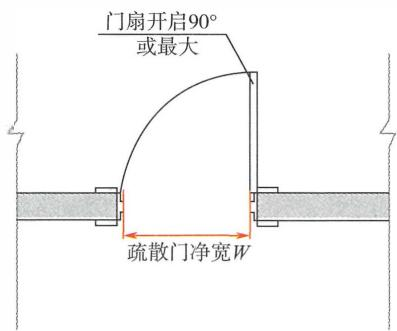

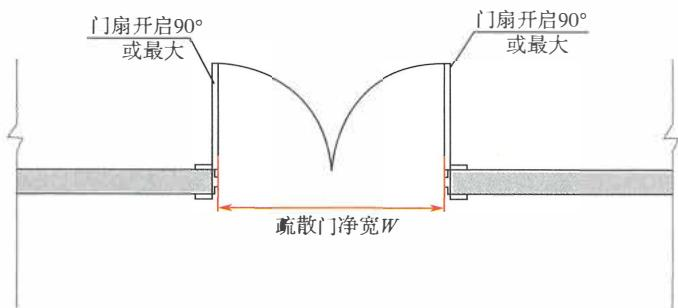

图7-3 疏散门的净宽度测量方法示意图

(2)疏散走道的净宽度应按照下述方法测量， 参见图7-4: 

1)当疏散走道两侧为墙体时， 应为走道两侧完成墙面之间 的最小水平净距。 

2)当疏散走道一侧为栏杆或有扶手、 另一侧为墙体时， 应 为走道一侧完成墙面与栏杆或扶手内侧之间的最小水平净距。 

3)当疏散走道两侧均设置栏杆或扶手时， 应为其两侧栏杆 或扶手内侧之间的最小水平净距。 

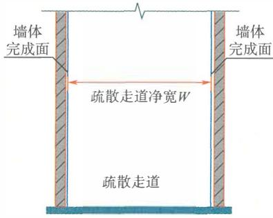

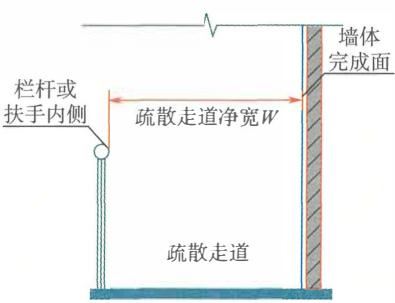

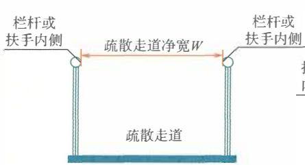

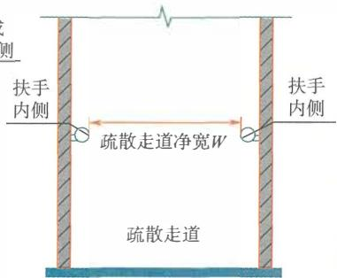

图7-4 疏散走道的净宽度测量方法示意图

4)当上述情况有多个计算值时， 应为其中的较小者。 

(3)疏散楼梯的净宽度应按照下述方法测量， 参见图7-5: 

1)当疏散楼梯两侧均为墙体而无扶手时， 应为两侧完成墙 面之间的最小水平净距。 

2)当疏散楼梯有一侧为墙体、 另一侧为扶手或栏杆时， 应 

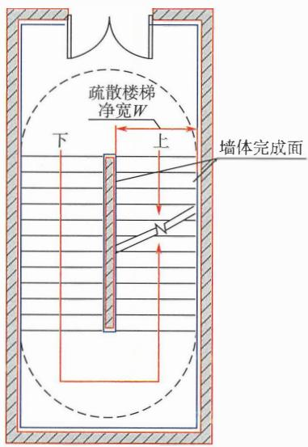

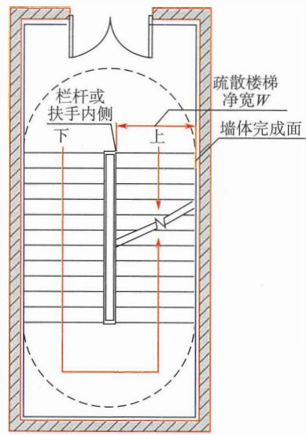

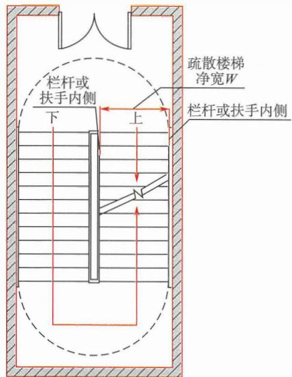

图7-5疏散楼梯的净宽度测量方法示意图

为完成墙面到栏杆或扶手内侧的最小水平净距。 

3)当疏散楼梯两侧均设置栏杆或扶手时，应为两侧栏杆或 扶手相对内表面之间的最小水平净距。 

4)当上述情况有多个计算值时，应为其中的较小者。 

(4)本规范规定的 ＂疏散走道” 是指连接房间门至楼层上 进入疏散楼梯、疏散楼梯间或防烟楼梯间前室的入口，直接通向 室外的出口等安全出口的廊道。疏散走道是建筑内连接房间疏散 门与楼层安全出口的交通联系通道，在火灾时用于人员疏散，要 求具有一定的防火、防烟性能。因此，疏散走道与其他室内空间 之间应采取防火、防烟分隔措施，保证人员在疏散走道内疏散时 不会受到火灾和烟气的影响。例如，在疏散走道两侧的防火隔墙 上，除必须布置用于交通联系的门外，不应开设其他窗洞口；当 必须开设其他窗洞口时，应采取相应的防烟防火措施或使之具有 一定的防烟性能，对千门上的亮窗，因面积较小，可以不考虑。 

在实践中，应注意 ＂疏散走道” 与 “疏散通道” 的区别。疏 散通道的防火性能与所在房间或区域的安全性相同，较疏散走道 的安全归E低。疏散走道是防火、防烟性能较进入疏散走道前的 室内空间（包括疏散通道）更安全的区域。在火灾情况下，人员 从房间等部位向外疏散，要经过疏散通道或疏散门到达疏散走 道、室外或其他室内外疏散安全区。 

疏散走道汇聚了多个房间的疏散人数。为提高人员的通行速 度，疏散走道应能够至少满足2股人流疏散的要求。根据我国人 体的特点，供日常主要交通用楼梯的梯段净宽应根据通过楼梯的 人流股数确定，并且不应少于两股人流。每股人流宽度宜根据建 筑的使用功能按 $0 . 5 5 \mathrm { m } +$ (0~0.15) $\mathbf { m }$ 考虑。因此，厂房、住宅建 筑、单层和多层公共建筑的疏散走道、公共疏散楼梯的最小净宽 度按照每股人流宽度不小千 $0 . 5 5 \mathrm { m }$ 考虑，通常不应小于 $1 . 1 0 \mathrm { m }$ 。 当疏散人数较多时，疏散走道等的净宽度应根据疏散人数按照每 百人的最小所需净宽度经计算后确定，对千人员密集的场所，要 尽量按照通过的人流股数校核调整。 

通常，建筑的地下楼层和地上楼层的疏散楼梯在建筑的首层， 

应直通室外或者通过各自独立的疏散走道直通室外， 可以通过扩 大的封闭楼梯间、防烟楼梯间的扩大前室通至室外。但在实际工 程中， 往往在疏散楼梯到达建筑首层后难以直通室外， 存在多部 疏散楼梯需要利用同一条疏散走道通至室外的情形。在这种情形 下， 疏散走道的净宽度应充分考虑合流的疏散人数因降低疏散速 度， 导致疏散时间延长而对疏散楼梯间内疏散人员可能带来的压 力， 以及在该疏散走道内产生的不安全因素， 并通过加大此疏散 走道的宽度、 提高疏散照明的照度、改进疏散指示标志及其设置 高度和间距等措施， 保证人员疏散的安全。 

(5)疏散楼梯或室内外疏散台阶、 坡道应在临空侧设置栏杆 或扶手， 以防止人群疏散时失稳跌倒而导致踩踏等意外发生。 当 这些设施的宽度大千 $4 . 0 \mathrm { m }$ 时， 将出现5~7股人流并行的情形， 很容易出现混乱失序， 引发意外踩踏等事故， 必须在中间用栏杆 分开。 当两侧均设置扶手时， 疏散楼梯或室内外疏散台阶、 坡 道的宽度不应大千 $2 . 0 \mathrm { m }$ ; 当仅一侧设置扶手时， 宽度不宜大千2 股人流通行的要求， 一般不宜大千 $1 . 4 \mathrm { m }$ 。 

(6)为避免对疏散路线产生阻力， 减轻人员的不安全感， 疏 散通道和疏散走道应简捷明确、通畅、 连续， 符合人的行为习 惯和使用要求， 避免疏散通道和疏散走道在通向疏散出口的路线 上发生宽度、疏散方向的较大变化， 地面上要尽量采用坡道连接 不同高差的楼面， 避免有死角， 避免在疏散路线上设置门槛或阶 梯。 在疏散通道和疏散走道两侧的人员疏散行动高度以下， 以及 疏散出口附近， 不应有凸出墙面的柱体、 门跺等凸出物， 也不应 存放影响人员疏散的物品。 此外， 疏散通道和疏散走道的地面粗 糙度应适中， 避免太光滑导致人员在疏散过程中因摩擦力小而引 发摔倒、踩踏。 

对千人员密集的场所， 开向疏散走道的房间疏散门不应影响 疏散走道的设计疏散宽度。 疏散走道两侧的隔墙上不宜将窗扇直 接开向疏散走道， 开向疏散走道的窗扇不应影响人员安全疏散， 不应减小疏散走道的设计疏散宽度。 

合理设置疏散指示标志， 可以更好地帮助人员快速、安全地 

疏散。 在疏散通道上、疏散走道内、疏散 出口处设置的疏散指示 标志要有针对性，便千人们辨认，符合一般人行走时目视前方的 习惯，能起到诱导人员朝向更安全区域的作用，但其设置位置应 能够避免被建筑构配件和火灾烟气遮挡。 

(7)第7.1.4条第2款中 “其他住宅建筑室内疏散楼梯” 是 指除住宅建筑高度不大千 $1 8 \mathrm m$ 且一边设置栏杆的室内疏散楼梯 外， 住宅建筑中的其他室内疏散楼梯。 例如， 一座建筑高度为 $1 8 \mathrm m$ , 设置两部室内疏散楼梯的住宅建筑，其中一部疏散楼梯一 侧设置栏杆、另一侧为墙体， 另一部疏散楼梯两侧为墙体、不设 置栏杆， 则设置栏杆的疏散楼梯的宽度不应小千 $1 . 0 \mathrm { m }$ , 未设置 栏杆的疏散楼梯的净宽度不应小于 $1 . 1 \mathrm { m }$ 。 一座建筑高度为 $2 7 \mathrm { m }$ 的住宅建筑， 无论建筑中的室内疏散楼梯两边是否设置栏杆，其 净宽度均不应小千 $1 . 1 \mathrm { m }$ 。 这主要考虑到设置栏杆的疏散楼梯对 人行走过程中摆动的限制较小。 

(8)疏散通道、疏散走道等用于人员疏散通行的空间和疏散 出口， 净高度不应小于 $2 . 1 \mathrm { m }$ 。 对于疏散出口应为出口处门口的 净高度， 即门框至地面的净高度。 参见图7-6。 

应注意的是， 国家标准《民用建筑通用规范》GB 55031— 一 》GB 50352一 9规定了多个 不同部位的净高。 例如，地下室、局部夹层、走道等有人员正常 活动的最低处净高， 以及避难层、有人员正常活动的架空层、楼 梯平台上部及下部过道处的净高均不应小千 $2 . 0 \mathrm { m }$ , 梯段净高不 应小于 $2 . 2 \mathrm { m }$ 。室内净高应按楼地面完成面至吊顶、楼板或梁底 面之间的垂直距离计算；当楼盖、屋盖的下悬构件或管道底面影 响有效使用空间时，应按楼地面完成面至下悬构件下缘或管道底 面之间的垂直距离计算。 

但是，建筑中疏散走道的净高度和疏散楼梯平台上部及下部 过道处的净高度均要按照不小于 $2 . 1 \mathrm { m }$ 确定， 而不能按照 $2 . 0 \mathrm { m }$ 确 定。 建筑中不用千人员疏散的架空层、楼梯、走道、坡道，架空 层的净高度、公共楼梯休息平台上部及下部过道处等部位的净高 度可以按照不小于 $2 . 0 \mathrm { m }$ 考虑。 

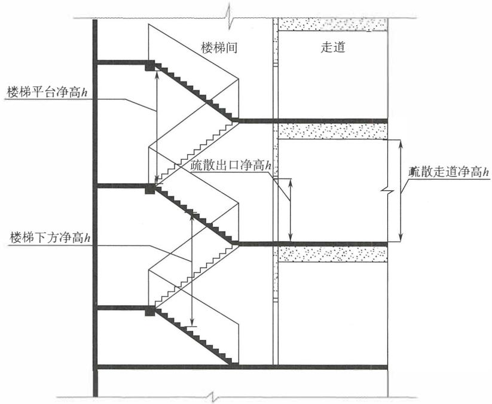

图7-6 疏散通道、 疏散走道、 疏散门等的净高度测量示意图

7.1.6 除设置在丙、 丁、 戊类仓库首层靠墙外侧的推拉门 或卷帘门可用于疏散门外， 疏散出口门应为平开门或在火 灾时具有平开功能的门， 且下列场所或部位的疏散出口门 应向疏散方向开启： 

1 甲、 乙类生产场所； 

2 甲、 乙类物质的储存场所； 

3 平时使用的人民防空工程中的公共场所； 

4 其他建筑中使用人数大于60人的房间或每桂门的 平均疏散人数大于30人的房间； 

5 疏散楼梯间及其前室的门； 

6 室内通向室外疏散楼梯的门。 

7.1.7 疏散出口门应能在关闭后从任何一侧手动开启。 开 向疏散楼梯（间）或疏散走道的门在完全开启时， 不应减 

少楼梯平台或疏散走道的有效净宽度。 除住宅的户门可不 受限制外， 建筑中控制人员出入的闸口和设置门禁系统的 疏散出口门应具有在火灾时自动释放的功能， 且人员不需 使用任何工具即能容易地从内部打开， 在门内一侧的显著 位置应设置明显的标识。 

# ［条文要点】

建筑中的人员在火灾时的疏散时间主要取决千所在场所的 人员密度和人群通过疏散门的时间， 并且大多数情况下受制于人 群通过疏散门的时间。 这两条规定了疏散门的基本功能和性能要 求，以确保在人员能够快速通过疏散门， 并且不会因疏散门设置 不合理导致人员疏散受阻、拥挤， 甚至发生人身伤害事故。 

# 【实施要点】

(1)疏散门是设置在疏散出口的门， 包括房间的疏散门和安 全出口门。疏散门在人员应急疏散时应处千平开状态，人们直接 推拉门把手就可以向内或向外开启，从而节省疏散时间， 且不会 出现人群将门挤压住的情形。 因此，疏散门一般应为平开门。在 平时使用时为旋转、电动、推拉状态的门， 如一些商店、旅馆、 办公楼等公共建筑的大堂出入口旋转门， 老年人照料设施和残障 人员使用场所的推拉或电动房间门， 应能在火灾时与火灾自动报 警系统或其他联动转换装置联动并转换为平开状态， 即这些门应 具有在火灾时转为平开状态的功能。 

侧拉门、 卷帘门、旋转门、电动门，包括帘中门，在紧急疏 散情况下由于人群惊慌、拥挤而压紧内开门扇使门无法开启， 不 能保证人群安全、快速疏散。但是，丙、丁、戊类仓库中使用人 数通常较少， 且发生火灾后发展相对较慢。 因此，除设置在丙、 丁、戊类仓库首层靠墙外侧的推拉门或卷帘门可以用作库房的疏 散门外， 侧拉门、卷帘门、旋转门、电动门， 包括帘中门均不允 许用作疏散门。 

在仓库建筑首层的疏散门主要是单层仓库建筑中每间库房为 方便装卸和物品出入库，在库房外墙外侧设置的侧向推拉门、卷 帘门。对千在不同楼层设置了车辆装卸平台的多层仓库建筑，此 

装卸平台一般可以视为库房内的人员疏散的安全区， 直接通向装 卸平台的库房疏散门也可以按照仓库建筑首层的疏散门考虑。 

(2)在室内发生火灾时， 人们总是从室内向室外疏散， 因 此疏散门通常应向疏散方向开启。 对千安全出口的门， 在疏散时 将汇聚多个房间或一个较大区域的人员， 疏散人数往往较多， 人 们除比较熟悉自己所在的办公室、 工作场所的房间门的开启方向 外， 对其他出口门的开启方向往往不太注意， 也不熟悉， 容易在 应急情况下出现不能安全疏散的情况。 特别是甲、 乙类火灾危险 性的场所， 由千发生事故往往是以爆燃为主， 无论人员对场所 情况熟悉与否， 在应急疏散状态下往往急于往外逃生， 难以顾及 门的开启方向。 因此， 安全出口的门均要求向疏散方向开启。除 安全出口外，本规范第7.1.6条规定的各类场所的房间疏散门也 均要求向疏散方向开启；第7.1.6条规定外的其他房间的疏散门， 可以根据有利千人员快速、 安全疏散的原则，以及使用人员对环 境的熟悉程度和室内实际火灾危险性等情况确定其开启方向，不 作强制要求，但也要尽量向疏散方向开启。 

(3)本规范第7.1.6条第4款规定的门主要为房间的疏散门， 而不是房间的安全出口门。 考虑到房间的疏散门向疏散方向开启 时，存在需要设置门斗，或直接开向走道会减小疏散走道宽度和 影响人员疏散的情形，本规范允许房间中每膛疏散门负担的疏散 人数不大千30人时， 疏散门的开启方向不限，但有条件时仍应尽 量向疏散方向开启。 其他建筑中使用人数小于或等千60人的房间 允许疏散门的开启方向不限， 这些房间是指只能设置且允许设置 1膛疏散门的房间。 例如， 位千疏散走道尽端的房间；当房间具 备设置2个或多个疏散出口的条件， 或应设置2个或多个疏散出 口时， 不应仅设置一个疏散出口， 疏散出口门的开启方向应根据 每膛疏散门的平均疏散人数是否大千30人确定。参见图7-7。 

(4)疏散门不仅应方便人们平时进出， 而且需要满足在火灾 时人们从室内向室外应急疏散，以及消防救援人员从室外向室内， 或从室内向室外展开人员救助、 灭火作战的要求。 因此， 疏散门 必须具备在火灾时能够由人员手动从室内或室外任何一侧开启的 

功能，不能为满足平时的管理需要而锁闭或采用门禁系统限制，导 致疏散人员和消防救援人员不能在火灾时及时从室内或从室外开启。 

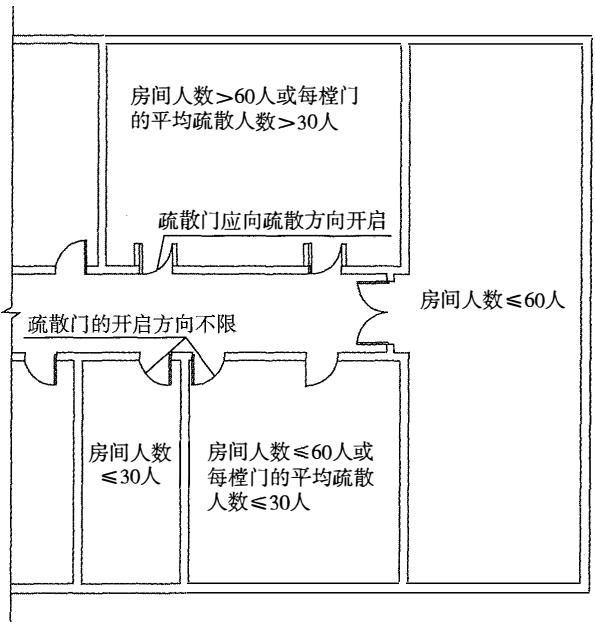

图7-7 房间疏散门开启方向示意图

对千住宅建筑中的每个套房，使用人数少且熟悉户门的开启 方法，除户内自身发生火灾外，在建筑其他部位发生火灾时，人 们还需根据实际火情决定疏散与否。 因此，住宅的户门可以不受 本规范第7.1.7条有关门禁系统和开启方向要求的限制，不要求具 备在火灾时能从室内外任何一侧开启和在火灾时自动解禁的功能。 

对千住宅建筑中公共区域的疏散门、 其他建筑中设置门禁 系统的疏散门，均应具备与火灾自动报警系统、安防系统或其他 应急控制系统联动控制解禁的功能，确保在火灾时能及时自动解 禁，不需要使用钥匙、斧头或其他破拆工具等即能手动推动门从 内部打开。 例如，仓库中的库房门，商店建筑中供员工出入的疏 散门或不常用的应急疏散门，金融建筑、广播电视建筑、图书馆 建筑、博物馆建筑、 办公建筑等建筑中设置门禁系统的疏散门， 

交通建筑中用作疏散出口的乘客出入口闸机。设置门禁系统的疏 散门、 人员聚集场所的疏散门、 安全出口的疏散门，均应在显著 位置设置提示开启门的方法和明显的门禁系统标识。 例如，在推 门式门的门扇内侧上标示门的开启方法，在设置门禁系统的疏散 门的门扇内侧上有说明正常情况下处千锁闭状态、 火灾时处千解 禁状态的文字，以及门的开启方法或位置、 开启方向的明确标示。 

(5)向疏散方向开启的门，会因门不能完全开启至与墙体 平行状态，导致门扇占用疏散楼梯间平台、 疏散走道的宽度。 因 此，开向疏散楼梯间、 疏散走道的疏散门，在设计时应考虑门开 启后对疏散楼梯、 疏散走道的宽度的影响；在安装时应注意调整 门的安装位置，使其能够完全开启；在使用时应防止采取不当行 为限制其开启至最大位置。 

尽管本规范第7.1.7条规定的是疏散门处千完全开启状态时 不应减少楼梯平台、 疏散走道的有效净宽度，但当疏散楼梯平 台、 疏散走道的宽度大于所需疏散净宽度要求时，仍要避免疏散 人员的行动受到开向楼梯间、 疏散走道内的门的影响。 疏散楼梯 平台、 疏散走道的有效净宽度，是指疏散楼梯平台、 疏散走道负 担设计疏散人数所需最小疏散净宽度。 

# 7.1.8 室内疏散楼梯间应符合下列规定：

1 疏散楼梯间内不应设置烧水间、 可燃材料储藏室、 垃圾道及其他影响人员疏散的凸出物或障碍物。 

2 疏散楼梯间内不应设置或穿过甲、 乙、 丙类液体管道。 

3 在住宅建筑的疏散楼梯间内设置可燃气体管道和可 燃气体计量表时， 应采用敞开楼梯间， 并应采取防止燃气 泄漏的防护措施；其他建筑的疏散楼梯间及其前室不应设 置可燃或助燃气体管道。 

4 疏散楼梯间及其前室与其他部位的防火分隔不应使 用卷帘。 

5 除疏散楼梯间及其前室的出入口、 外窗和送风口， 住宅建筑疏散楼梯间前室或合用前室内的管道井检查门外， 疏散楼梯间及其前室或合用前室内的墙上不应设置其他门、 

窗等开口。 

6 自然通风条件不符合防烟要求的封闭楼梯间， 应采 取机械加压防烟措施或采用防烟楼梯间。 

7 防烟楼梯间前室的使用面积， 公共建筑、 高层厂 房、 高层仓库、 平时使用的人民防空工程及其他地下工程， 不应小于 $6 . 0 \mathrm { m } ^ { 2 }$ ;住宅建筑， 不应小于 $4 . 5 \mathrm { m } ^ { 2 }$ o 与消防电梯 前室合用的前室的使用面积， 公共建筑、 高层厂房、 高层 仓库、 平时使用的人民防空工程及其他地下工程， 不应小 于 $1 0 . 0 \mathrm { m } ^ { 2 }$ 勹住宅建筑， 不应小于 $6 . 0 \mathrm { m } ^ { 2 }$ 勹 

8 疏散楼梯间及其前室上的开口与建筑外墙上的其他 相邻开口最近边缘之间的水平距离不应小于 $1 . 0 \mathrm { m }$ 。 当距离 不符合要求时， 应采取防止火势通过相邻开口蔓延的措施。 

# 【条文要点］

疏散楼梯间是在建筑内用千人员疏散和消防救援的主要垂直 交通空间， 也是建筑内供人员疏散和消防救援人员进出建筑楼层 的安全区域， 应防止在疏散楼梯间内发生火灾；对千服务层数多 或服务的建筑高度高、 火灾危险性大， 或同一时间使用人数多的 疏散楼梯间， 还应防止火灾和烟气进入疏散楼梯间。本条的规定 是室内疏散楼梯间的通用防火性能和关键技术措施要求。 

# ［实施要点】

(1)室内疏散楼梯间是建筑的室内疏散安全区， 是人员在火 灾时疏散的重要通道， 疏散楼梯的防火、防烟性能和疏散能力， 直接影响人员疏散的安全、消防救援人员的行动安全和救援效 果。因此， 不仅疏散楼梯的结构需要具有较高的耐火性能， 疏散 楼梯间需要具有较高的防火、防烟性能， 而且疏散楼梯间自身不 应存在引发火灾的危险。疏散楼梯间的防烟性能应根据建筑的建 筑高度和具体用途确定。 

疏散楼梯间根据其封闭情况和防烟性能可以分为敞开楼梯 间、 封闭楼梯间、防烟楼梯间；根据其设置位置可以分为室内疏 散楼梯间和室外疏散楼梯。疏散楼梯根据其构造可以分为多跑楼 梯和单跑楼梯。在剪刀楼梯间内设置的楼梯属于单跑楼梯。 

1)敞开楼梯间。敞开楼梯间是指在楼梯周围具有三面封闭 围护、 一面开敞的楼梯间， 开敞面与疏散走道等直接相通。这种 楼梯间可以充分利用天然采光和自然通风， 人员疏散直接，但也 是火势和烟气在建筑内蔓延的竖向通道之一， 主要用千火灾危险 性较低的多层建筑。敞开楼梯间应注意与敞开楼梯区别。敞开楼 梯是开口宽度较大， 或楼梯周围两面及以上无分隔墙体， 或围护 结构不符合防火要求的楼梯。除室外楼梯外， 敞开楼梯不能用作 建筑的室内疏散楼梯， 见图7-8。 

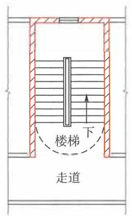

顶层平面

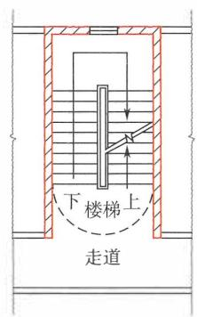

中间层平面

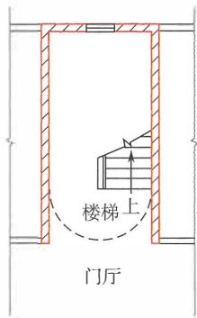

首层平面

(a)敞开楼梯间平面示意图

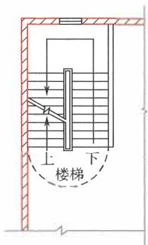

两面敞开楼梯

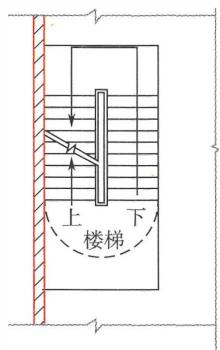

三面敞开楼梯

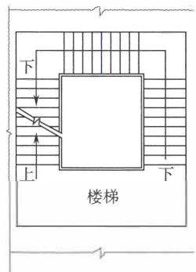

全敞开楼梯

(b)敞开楼梯平面示意图

图7-8 敞开楼梯间与敞开楼梯示意图

2)封闭楼梯间。封闭楼梯间是在楼梯间入口处设置门， 以 防止火灾的烟和热气进入的楼梯间。封闭楼梯间在楼层入口处应 设置防烟门， 楼梯间具有一定的防烟性能。封闭楼梯间入口处的 防烟门可以为防火门， 也可以为双向弹簧门。对于高层建筑（包 括工业建筑和民用建筑）， 人员密集的公共建筑， 甲、 乙类厂 房， 人员密集的丙类厂房， 封闭楼梯间的防烟门应为甲级或乙级 防火门。尽管其他建筑的封闭楼梯间防烟门可以不采用防火门， 但为满足楼梯间的防烟要求， 此门应具有在火灾时能自行关闭 的功能， 并尽量采用防火门。对千平时人员经常出入处的楼梯间 门， 可以采用平时保持常开状态、 在火灾时能与火灾自动报警系 统联动关闭的门。 

封闭楼梯间在建筑的首层难以直通室外时， 可以将人员进入 首层疏散需经过的区域扩大到封闭楼梯间内， 但应注意将相邻区 域的走道、 房间与扩大的封闭楼梯间分隔， 即应采用耐火性能不 低于楼梯间分隔墙耐火性能的防火隔墙和甲级或乙级的防火门、 窗分隔， 见图7-9。 

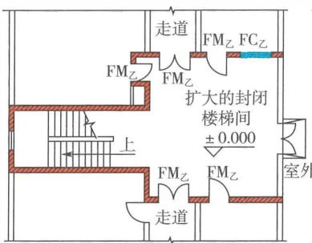

（a）封闭楼梯间首层平面（一）

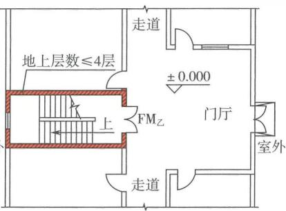

（b）封闭楼梯间首层平面（二）

图7-9 在建筑首层扩大的封闭楼梯间示意图

3)防烟楼梯间。防烟楼梯间是在楼梯间入口处设置防烟的 前室、 开敞式阳台或凹廊（统称前室）等设施， 且通向前室和楼 梯间的门均为防火门， 以防止烟和热气进入的楼梯间。防烟楼梯 间由楼梯间和防烟前室组成， 主要用千建筑高度高或埋深大的建 

筑，以减小因人员在楼梯间内需要的疏散时间长导致火灾及其烟 气给人员疏散安全带来的危害性作用。防烟楼梯间也可用于替代 难以靠建筑外墙布置，且自然排烟条件不满足要求的封闭楼梯 间，以提高疏散楼梯间的防烟性能。 

防烟楼梯间按前室的封闭情况可分为开敞型和封闭型防烟 楼梯间，开敞型防烟楼梯间以开敞的阳台、凹廊作前室，当烟随 疏散人流侵入阳台、凹廊时，室外环境能将烟气稀释，这种靠自 然条件排烟的效果好，不受设备和造价的限制，因而安全性和经 济性较好。封闭型防烟楼梯间的前室采用封闭结构，属于室内空 间，其特点是既可以靠外墙设置，又能设置在建筑内部，平面布 置灵活。此外，前室还可起到缓冲疏散人群的作用，并为不能及 时进入楼梯间内的人员提供临时避难场所。 

防烟楼梯间在建筑的首层难以直通室外时，可以将人员进 入首层疏散需经过的区域扩大到防烟楼梯间的前室内。但是，扩 大的前室与相连通的走道、其他房间之间应采用耐火极限不低于 2.00h的隔墙和甲级或乙级的防火门、窗分隔，不允许采用防火 卷帘等分隔，见图7-10。 

# （2）室内疏散楼梯间的通用防火构造要求如下：

1）在建筑发生火灾时，各楼层的人员可能需要同时进入疏 散楼梯间，导致楼梯间内的人员密度大，疏散速度受到影响。为 了保证人员在其中能够快速、顺畅地通过，避免人员在应急疏散 时发生摔倒、踩踏等事故，各类建筑（包括工业与民用建筑、平 时使用的人民防空工程、轨道交通工程、隧道工程、城市综合管 廊工程等）内的公共疏散楼梯、楼梯平台的宽度、踏步的宽度和 高度均应与该区域使用人员的构成和特性相适应（相关要求应符 合国家标准《民用建筑通用规范》GB55031—2022等标准的要 求），符合相应的人体工程学尺寸；在疏散楼梯间、疏散楼梯间 的前室内不应存在任何影响疏散行动的凸出物或其他障碍物；不 应设置烧水间、可燃材料储藏室、垃圾道；内部装修装饰和疏散 门开启后不应减少必需的楼梯平台和梯段的宽度。如，凸出墙 面的柱体，存放自行车、家具和其他物体。 

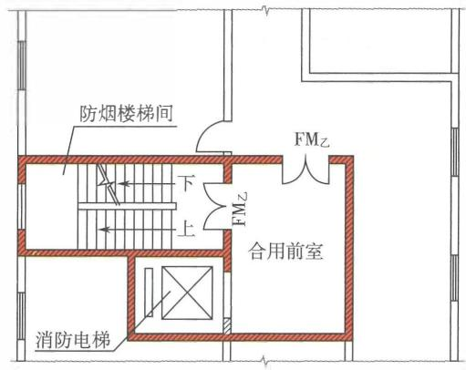

(a)防烟楼梯间楼层平面示意图

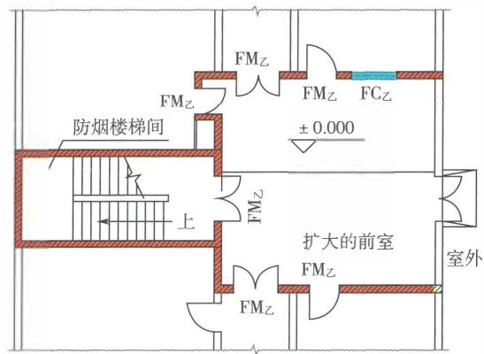

(b)首层扩大的前室平面示意图

图7-10 防烟楼梯间平面示意图

建筑中的公共疏散楼梯、建筑内供特定人员自用的疏散楼梯 （如住宅建筑中的自用疏散楼梯、 其他建筑中复式房间内的疏散 楼梯）应避免采用螺旋楼梯和扇形踏步；确需采用时， 踏步上、 下两级所形成的平面角度不应大于 $1 0 ^ { \circ }$ ' 且每级离扶手 $2 5 0 \mathrm { m m }$ 处的踏步深度不应小于 $2 2 0 \mathrm { m m }$ 。 疏散楼梯采用螺旋楼梯和楼梯 采用扇形踏步的条件， 还应符合国家现行有关技术标准的规定。 

2)楼梯间内不应敷设或穿越输送甲、 乙、 丙类液体和可燃 

气体、助燃气体的管道，在楼梯间及其前室内不应穿越或设置排 烟管道，以确保楼梯间自身没有火灾危险性，也不能因在楼梯间 内设置其他管道而引入建筑中其他区域的火灾。 

当在住宅建筑的楼梯间内必须敷设或穿越可燃气体管道、设 置燃气计量装置时，疏散楼梯间应为敞开楼梯间，且应在进入楼 梯间的燃气管道上设置切断阀，采取防止燃气泄漏和积聚的可靠 措施。 例如，提高燃气管道的压力、耐腐蚀性能或防腐蚀等级， 在楼梯间上部设置通风开口等。 对千不允许采用敞开疏散楼梯间 的住宅建筑，在楼梯间内不允许敷设或穿越可燃气体管道，也不 允许在楼梯间、前室内设置燃气计量装置，即当住宅建筑的疏散 楼梯采用封闭楼梯间、防烟楼梯间时，不允许在楼梯间、前室内 敷设或穿越可燃气体管道，也不允许设置燃气计量装置。 

3)疏散楼梯间（包括防烟楼梯间的前室、合用前室、共用 前室）应采用防火隔墙与周围区域分隔，防火隔墙的耐火极限和 燃烧归胚应根据建筑的耐火等级、建筑类型确定，不应采用防火 卷帘、防火分隔水幕等替代防火隔墙，尽量避免采用防火玻璃墙替 代。 当疏散楼梯间为封闭楼梯间、防烟楼梯间时，还应在楼层的入 口处设置防烟门、防火门等防止烟气进入楼梯间、前室的设施。 

疏散楼梯间既要满足火灾时的人员疏散、保障消防救援人员 安全进出火场实施灭火救援的要求，在大多数建筑中也要考虑阻 止火灾在建筑内部通过楼梯间跨越楼层蔓延。 因此，在疏散楼梯 间及其前室的围护结构上，除必须设置的开口，如疏散门、自然 排烟的外窗、机械加压送风口外，不应设置其他门、窗等开口， 不应将其他房间的门直接开向疏散楼梯间。 

对千住宅建筑，在疏散楼梯间的前室或合用前室内允许设置 管井检查门，但应根据管井的火灾危险性、建筑高度采用足够耐 火性能的检查门，不允许在楼梯间内设置管井检查门。 当户门直 接开向疏散楼梯间、防烟楼梯间的前室时，应符合相应的防火要 求，具体要求可以参见现行国家标准《建筑设计防火规范》GB 50016等标准的规定。 

建筑发生火灾后，楼梯间任意一侧房间的火灾及其烟气都有 

可能通过楼梯间外墙上的开口蔓延至楼梯间内。 因此， 楼梯间的 外窗（包括楼梯间的前室或合用前室外墙上的开口）与两侧其他 用途房间的门、窗、洞口之间要保持必要的水平间距， 确保火灾 的烟、 火不会侵入疏散楼梯间。 因此， 靠外墙设置的楼梯间、前 室， 在外墙上的窗口与两侧建筑中其他房间的门、窗、洞口最近 边缘的水平距离不应小千 $1 . 0 \mathrm { m }$ , 见图7-11。 无论楼梯间与楼梯 间两侧房间的门、窗、洞口是处千同一立面位置， 还是处千转角 处等不同立面位置， 该距离都是外墙上的开口与楼梯间开口之间 的最近水平距离， 含折线距离。 

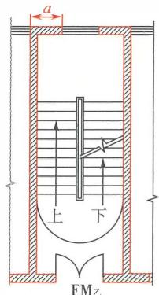

（a）封闭楼梯间

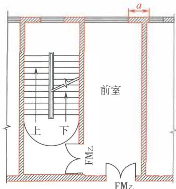

(b)防烟楼梯间（一）

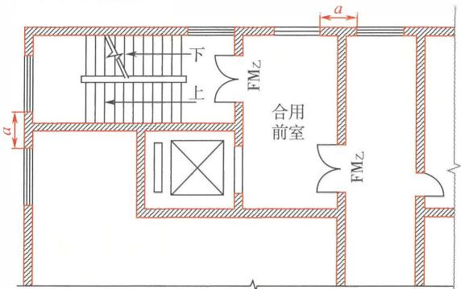

(C)防烟楼梯间（二）

图7-11 封闭、 防烟楼梯间 图

注：图中 $a \geqslant 1 . 0 \mathrm { m }$

4)楼梯间要尽最靠外墙布置，使其具有天然采光和自然通风 条件。 当建筑允许采用敞开楼梯间时，该楼梯间每层均应具有可 开启的外窗；当建筑允许采用封闭楼梯间时，该封闭楼梯间在各 层的可开启外窗设置情况应满足自然排烟的要求。 不具备自然通 风条件或自然通风条件不能满足排烟要求的封闭楼梯间、防烟楼梯 间及其前室，应采取设置、防烟前室、机械加压送风 设施等防烟 措施。 封闭楼梯间内的自然通风条件是否满足要求，可以根据相 关专项技术标准确定 。 例如，国家标准《建筑防烟排烟系统技术 》GB51251 20178第3.2.1条规定，采用自然通风方式防烟 的封闭楼梯间、防烟楼梯间，应在最高部位设置面积不小千 $1 . 0 \mathrm { m } ^ { 2 }$ 的可开启外窗或开口；当建筑高度大千 $1 0 \mathrm { m }$ 时， 尚应在楼梯间 的外墙上每5 层内设置总面积不小千 $2 . 0 \mathrm { m } ^ { 2 }$ 的可开启外窗或开口， 且布置间隔不大千3 层。 第3.2.2条规定，前室采用自然通风方式 防烟时，独立前室可开启外窗或开口的面积不应小于 $2 . 0 \mathrm { m } ^ { 2 }$ , 共 用前室、 合用前室可开启外窗或开口的面积不应小千 $3 . 0 \mathrm { m } ^ { 2 }$ 勹 

5 )疏散楼梯间在首层的出口应直通室外。 当多层民用建筑 的层数不大于4层时，疏散楼梯间可以设置在直线距离直通室外 的建筑外门不大于 $1 5 \mathrm { m }$ 处。 当建筑内设置自动灭火系统时，该 距离仍不应大千 $1 5 \mathrm { m }$ 。 层数大千4层的建筑中不能直通室外的封 闭楼梯间、层数小千或等千4层的建筑中距离建筑外门大千 $1 5 \mathrm { m }$ 的封闭楼梯间，均可以在首层采用扩大的封闭楼梯间，或专用疏 散走道通至室外。 专用疏散走道或扩大的封闭楼梯间内的最大疏 散距离不应大千 $3 0 \mathrm { m }$ 。 专用疏散走道应是直接连接楼梯与对外出 口的走道，不能与其他房间共用，即此专用疏散走道相当于封闭 楼梯间的延伸。 在建筑首层不能直通室外的防烟楼梯间的前室， 可以在首层采用扩大的前室，相关防火要求和疏散距离可以比照 扩大的封闭楼梯间的要求确定。 

6)建筑屋面可能受到火灾及其烟气的影响较小，通常可作 为建筑内疏散人员的应急避难场所，如能将建筑内的疏散楼梯通 至屋顶，可以在建筑下部条件难以满足人员安全逃生要求时为人 们提供另一条逃生路径，有利千人员临时避难，并利用其他部位 

的疏散楼梯或其他屋面至地面的楼梯等方式逃生。疏散楼梯间通 向屋面的门应朝向屋面一侧开启。因此，建筑中能够通至屋顶的 疏散楼梯间，要尽量在屋顶开口，使该疏散楼梯间能通至屋面， 楼梯间通向屋面的门应向外开启。为方便人员识别和选择，在每 层疏散梯入口处应设置标明楼梯可否通达屋面的明显标识，并在 楼梯间内标示所在楼层位置。当建筑内的部分疏散楼梯间通至屋 面时，屋面上应具有满足人员安全避难，并能从屋面向地面安全 疏散的设施，或者能够与建筑内其他住宅单元、其他防火分区内 的疏散楼梯间连通。 

7)为提高和保障封闭楼梯间的防火性能，除楼梯间的疏散 门、外窗、楼梯间内的加压送风口、首层扩大的封闭楼梯间内分 隔其他部位的防火门、防火窗外，在封闭楼梯间的分隔墙上不应 开设其他任何开口，如管井的检查门、其他房间的门或窗。由于 设置封闭楼梯间的建筑楼层数较少，机械防烟系统可采用直灌式 机械加压送风方式实现，在楼梯间内基本不需要再开设送风口。 

8)防烟楼梯间通过在进入楼梯间前设置防烟前室、在楼梯 间内采取防烟措施提高楼梯间的防烟性能，缓冲因多个楼层上的 人员进入楼梯间后可能导致的人员拥挤，或避免人员在楼层上处 于火灾和烟气的危险环境内。通常，前室还可以视为楼层的避难 间。由此可以看出，前室的防烟和使用面积对保障火灾时建筑内 的人员疏散安全，十分重要。因此，防烟楼梯间的前室应满足一 定的面积要求。对于与消防电梯前室合用的前室，还要考虑救援 人员灭火准备、休整和人员救助等的需要。 

前室的面积大小，要根据建筑的用途、楼层上的使用人数、 建筑高度，在本规范和相关技术标准规定的使用面积基础上合理 确定。前室内可供使用的净面积：公共建筑、高层厂房、高层仓 库、平时使用的人民防空工程及其他地下工程，不应小千 $6 . 0 \mathrm { m } ^ { 2 }$ 住宅建筑，不应小千 $4 . 5 \mathrm { m } ^ { 2 }$ 。与消防电梯前室合用时，合用前室 内可供使用的净面积：公共建筑、高层厂房、高层仓库、平时 使用的人民防空工程及其他地下工程，不应小于 $1 0 . 0 \mathrm { m } ^ { 2 }$ 气住宅建 筑，不应小千 $6 . 0 \mathrm { m } ^ { 2 }$ 。 

除在建筑首层（或坡顶层、 坡底层）采用扩大的前室或扩大 的合用前室外， 防烟楼梯间在楼层的前室有仅供一个防烟楼梯间 独立使用的前室、 剪刀楼梯间内两座楼梯共用的前室、 防烟楼梯 间的前室与消防电梯前室合用的前室、 剪刀楼梯间的共用前室与 消防电梯前室合用的前室四种形式， 见图7-12。 

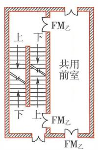

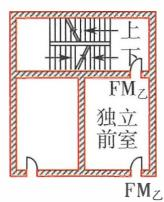

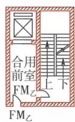

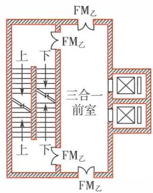

图7-12 防烟楼梯间楼层前室示意图

7.1.9 通向避难层的疏散楼梯应使人员在避难层处必须经 过避难区上下。除通向避难层的疏散楼梯外，疏散楼梯 （间）在各层的平面位置不应改变或应能使人员的疏散路线 保持连续。 

# 【条文要点］

为确保人员的疏散过程连续、 畅通、 快捷、 安全， 不会误入 其他区域， 避免疏散人员产生或加剧恐慌心理， 影响安全疏散， 本条规定了疏散楼梯在水平和竖向位置的关键技术要求。 为避免 有停留和避难需要的人员错过避难层， 本条规定了设置避难层的 建筑应通过改变疏散楼梯间在避难层的位置，或强制断开，使人 员必须经过避难层才能往上或往下疏散。 

# 【实施要点】

(1)对千设置避难层的建筑， 主要为建筑高度大千 $1 0 0 \mathrm { m }$ 的 建筑， 人员在疏散楼梯间内的竖向疏散距离和用时均较长， 加之 在楼梯间内的人员密度高， 行走速度受到较大影响， 更会加剧人 

们的焦虑情绪。 而避难层不仅为在疏散过程中需要停留的人员提 供了条件， 而且当避难层下部楼层和疏散楼梯受到火灾和烟气封 堵， 人员难以进一步往下疏散时， 还可以为人员提供等待救助和 避难的场所。 另外， 避难层在某种意义上是将建筑在竖向分隔成 了若干个相对独立的防火区段， 提高了建筑整体的消防安全性 能。 因此， 疏散楼梯间应在进出避难层处错位或断开， 以强制引 导疏散人员必须经过避难层， 同时提高阻止火灾和烟气通过楼梯 间进一步向下或向上蔓延的可靠性。 疏散楼梯间在避难层处上下 断开和错位布置示意图， 见图7-13和图7-14。 

(2)疏散楼梯间除在避难层处必须错位布置、 地上楼层与地 下楼层必须分隔外， 在建筑每层上的平面位置应上下一致， 保持 不变。 这样将能更好地保证人员连续不断地自上而下或自下而上 快速疏散， 不会因楼梯突然改变位置增加人们的恐慌， 导致找不 到出口、 迷失方向而贻误宝贵的逃生时间， 也不会使人员走错地 方、 误入其他不安全的区域而陷入危险而造成人员伤亡。 

当建筑内个别部位的疏散楼梯受建筑的平面布置、 建筑形 状、 上下楼层面积不同等原因的限制， 在上、 下楼层不得不错位 布置时， 上下楼层的疏散楼梯间应在需要改变位置的楼层上采用 专用疏散走道直接连通。 该专用疏散走道的设置应确保人员在 进入并经过该走道时疏散方向是唯一的， 不会被导向或误入其 他区域， 该走道与相邻区域之间应采用不低千疏散楼梯间防火分 

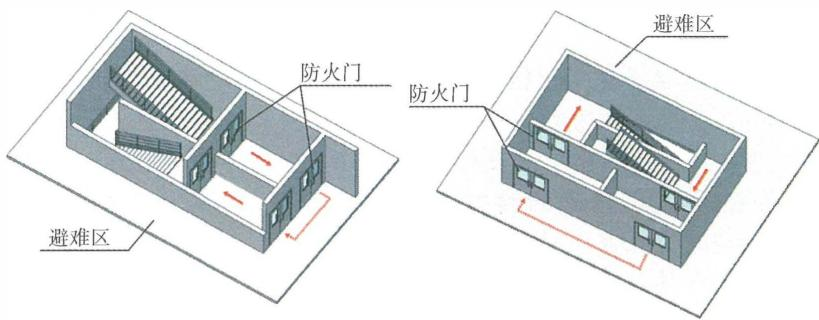

图7-13 疏散楼梯间在避难层上下断开布置示意图

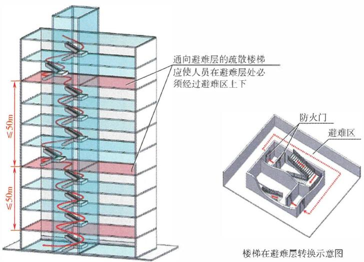

图7-14 疏散楼梯间在避难层错位布置示意图

隔性能的防火隔墙分隔， 除进出楼梯间、 疏散安全区的疏散门、 外墙上的自然排烟窗外， 在走道的两侧墙体上不应设置通向其他 区域的门及其他开口。 

7.1.10 除住宅建筑套内的自用楼梯外， 建筑的地下或半地 下室、 平时使用的人民防空工程、 其他地下工程的疏散楼 梯间应符合下列规定： 

1 当埋深不大于 $1 0 \mathrm { m }$ 或层数不大于2层时， 应为封闭 楼梯间； 

2 当埋深大于 $1 0 \mathrm { m }$ 或层数不小于3层时， 应为防烟楼 梯间； 

3 地下楼层的疏散楼梯间与地上楼层的疏散楼梯间， 应在直通室外地面的楼层采用耐火极限不低于2.00h且无 开口的防火隔墙分隔； 

4 在楼梯的各楼层入口处均应设置明显的标识。 

# 【条文要点】

本条规定了各类地下、 半地下建筑， 包括工业建筑、 民用建 

筑、 平时使用的入民防空工程、综合管廊工程、隧道工程，以及 地上建筑的地下、 半地下室等建筑中疏散楼梯间的基本形式及其 设置的关键技术要求。 

# 【实施要点】

(1)地下、半地下建筑在火灾时的疏散路径有限，除可以水 平向相邻防火分区、 下沉式广场或庭院、避难走道等疏散外，竖 向只能通过室内疏散楼梯疏散。 地下、半地下建筑的疏散楼梯间 应具有一定的防烟性能。 人员在疏散楼梯间的竖向疏散高度与建 筑的埋深相关，埋深越大，竖向疏散高度越大，对疏散楼梯间的 防烟性能要求越高。 因此，地下、 半地下建筑的疏散楼梯间应根 据其实际服务区域的埋深确定相应的防烟性能。 例如， 一座埋深 为 $1 2 \mathrm { m }$ 的地下建筑，共3层， 每层层高为 $4 \mathrm m$ , 则该地下建筑的 疏散楼梯间应为防烟楼梯间。 如果在该地下建筑内的地下一层和 二层有一个防火分区设置独立的疏散楼梯间， 这些楼梯间不供地 下三层及地下一、 二层的其他区域使用， 则该防火分区的疏散楼 梯间可以采用封闭楼梯间。 参见图7-15。 

(2)除部分允许设置中庭的场所外， 建筑的地下、 半地下 楼层与地上楼层实际上是两个具有不同设防标准的建筑空间。 为 保证建筑的地上楼层与地下楼层的疏散系统各自相对独立，防止 火灾和烟气通过疏散楼梯间相互蔓延，避免人员在应急疏散过程 从地下楼层上来后误入地上楼层的楼梯间继续上行， 或从上部楼 层下来的疏散人员误入地下室，建筑的地上楼层不应与地下楼层 共用疏散楼梯间。 地上楼层与地下楼层确需共用疏散楼梯竖井 时，相互间应在首层采用耐火极限不低于 $2 . 0 0 \mathrm { h }$ 的防火隔墙和甲 级、 乙级防火门完全分隔， 使地下楼层和地上楼层的疏散楼梯间 出口在首层位千不同位置，并尽可能分别直接通向室外。 建筑地 下楼层与地上楼层的疏散楼梯间在首层的防火分隔方式， 参见 图7-16。 

(3)本条中有关 “平时使用的人民防空工程” 是针对设置公 共活动场所的人民防空工程。 

# 7.1.11 室外疏散楼梯应符合下列规定：

8

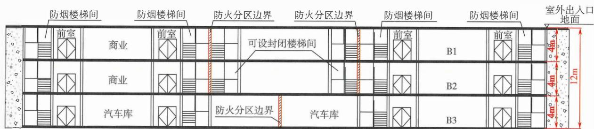

地下室剖面示意图

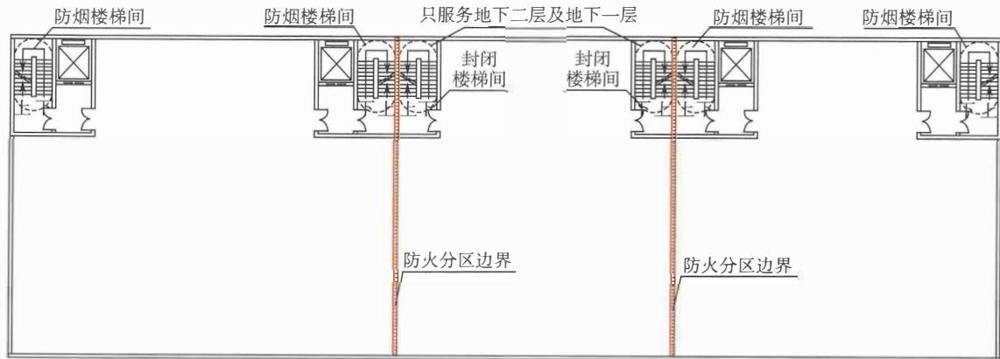

地下二层平面示意图

图7-15不同埋深或层数地下建筑（室）的疏散楼梯间形式示意图

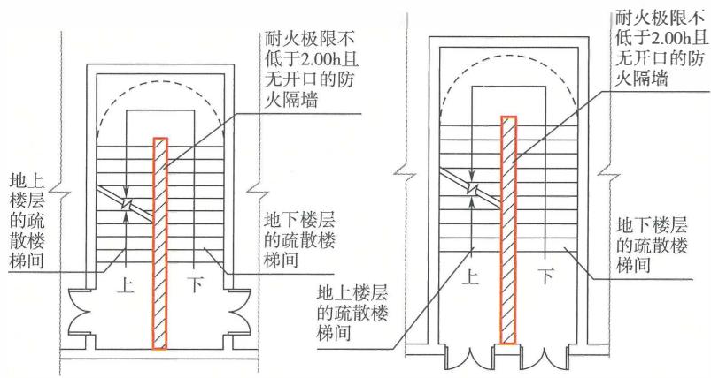

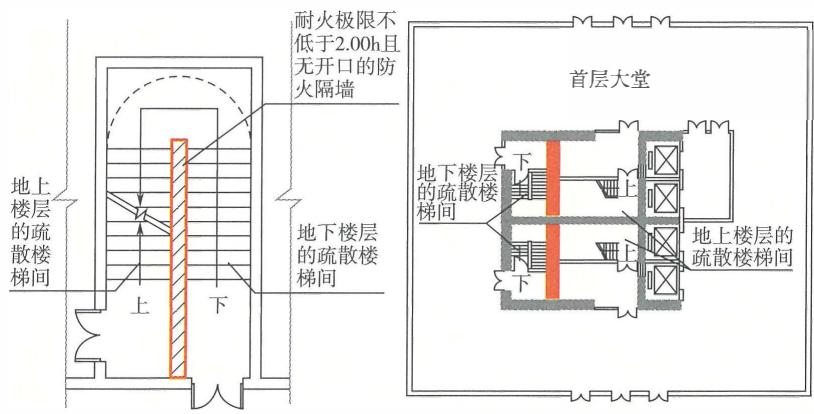

7-16 建筑地下楼层与地上楼层的疏散楼梯间在 首层的防火分隔示意图

1 室外疏散楼梯的栏杆扶手高度不应小于 $1 . 1 0 \mathrm { m }$ , 倾 斜角度不应大于45° 

2 除3层及3层以下建筑的室外疏散楼梯可采用难燃 性材料或木结构外， 室外疏散楼梯的梯段和平台均应采用 不燃材料； 

3 除疏散门外， 楼梯周围 $2 . 0 \mathrm { m }$ 内的墙面上不应设置 其他开口， 疏散门不应正对梯段。 

# 【条文要点】

本条规定了建筑室外疏散楼梯的基本性能和关键技术措施。 符合要求的室外疏散楼梯可视为与防烟楼梯间、 封闭楼梯间具 有基本相同的防烟性能， 可用千人员应急逃生和消防救援人员 直接从室外进入建筑， 到达着火层开展消防救援。 本条规定的 室外疏散楼梯不包括工业建筑及其他建筑中用作应急逃生的金 属梯。 

# 【实施要点】

(1)室外疏散楼梯是楼梯一边或两边靠建筑外墙布置， 各楼 梯段、 楼梯休息平台均位千室外， 临空部位均设置防护设施， 用 千人员疏散的楼梯， 见图7-17。 室外疏散楼梯一般用千工业建 筑或疏散人数较少的场所（如设备平台、 设备用房等）， 也可以 用于住宅等其他各类建筑中的人员疏散。 

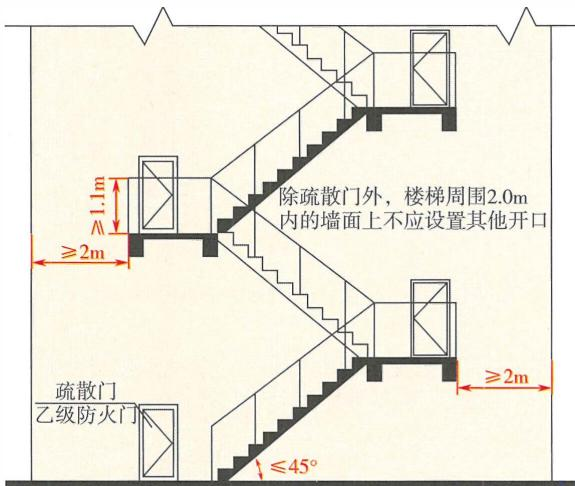

7-17 室外疏散楼梯示意图

(2)室外疏散楼梯多面开敞， 在火灾中能比较好地防止烟 气积聚， 可以视为建筑的室外疏散安全区。 为保证人员疏散的安 全， 室外楼梯的结构承载能力、 防火性能应能够满足人员在疏散 过程中安全行走的要求， 楼梯平台和梯段的净宽度、 踏步的高度 

和宽度、栏杆扶手或栏板的高度等均应符合现行国家标准 《民用 建筑设计统一标准》GB 05 35 2、《建筑设计防火规范》GB 00165 等标准的规定，楼梯平台及梯段下的净空高度不应小于 $2 . 1 \mathrm { m }$ 。 

由于室外疏散楼梯位于建筑的外墙外，在建筑发生火灾时可 能会受到来自从建筑外墙上的开口溢出的火势和烟气的作用，这 些开口包括楼层通向楼梯的疏散门、楼梯下部或附近外墙上的外 窗等开口，见图7-17。 因此，室外疏散楼梯的设置位置和材料 应防止火焰从门内窜出而将楼梯烧坏或烟气直接作用于疏散楼 梯，并能避免和抵抗来自建筑外墙开口处的火势和烟气威胁。除 通向疏散楼梯平台的疏散门外，不允许在楼梯平台和梯段的正下 方及周围 $2 \mathrm { m }$ 范围内设置任何其他开口。 楼层开向室外疏散楼梯 的疏散门应为甲级或乙级防火门，门的耐火性能可以根据楼梯设 置部位建筑对应楼层内的火灾危险性确定。 

(3)室外疏散楼梯应采用不燃性材料，或燃烧性能不低于所 在建筑楼板燃烧性能的材料制作，与楼层疏散门相通的平台应具 有不低于建筑楼板要求的耐火性能。例如，对于一、二级耐火等 级的建筑，楼板的燃烧性能应为不燃性，则室外疏散楼梯也应采 用不燃材料制作；对于1级、I1级木结构建筑中楼板允许采用难 燃性木结构，则室外疏散楼梯可以采用难燃性木结构制作；四级 耐火等级建筑和Ⅲ级木结构建筑中楼板允许采用可燃性木结构， 则室外疏散楼梯可以采用可燃性木结构制作。对于3层及3层以 下的建筑，或者服务3层和3层以下楼层的室外疏散楼梯，由于 垂直疏散距离较短，无论建筑的耐火等级高低，均允许采用难 燃、可燃的木结构和其他难燃性材料制作。 

室外疏散楼梯的平台、各层的结构梁和柱的耐火极限，可以 根据所在建筑的耐火等级和室外疏散楼梯的服务高度或楼层数确 定，一般不应低千楼梯平台的燃烧性能和耐火极限，即建筑楼板 要求的耐火极限。 

(4)在建筑发生火灾时，人员进入室外疏散楼梯后会本能地 快速向下行走，在楼梯上的人数随楼梯增加而增多，有时同一楼 层进入楼梯的人数也较多，应避免楼梯梯段的倾斜度过大、楼梯 

过窄、栏杆扶手过低引发人员坠落等安全事故， 同时应能够使行 走慢或 需要休息的人员能够避让他人通过。 因此， 在楼梯的临空 处应设置净高不小千 $1 . 1 0 \mathrm { m }$ 的防护栏杆或栏板， 楼梯的净宽度不 应小千 $0 . 9 0 \mathrm { m }$ 。 楼梯的防护栏杆或栏板应采用与梯段制作材料燃 烧性能相同的材料。 

栏杆、栏板的高度应为 楼梯平台地面或 踏步表面至栏杆、栏 板扶手顶面的垂直高度。 楼梯的净宽度应为栏杆、栏板扶手相对 内侧之间的最小水平净距；当在靠外墙一侧 不设置扶手时， 应为 外侧栏杆、栏板扶手内侧至外墙完成面的最小水平净距。 

(5)室外疏散楼梯的倾斜角度要根据疏散楼梯所服务场所内 的疏散人数、 疏散人员的特性确定， 且倾斜角度不应大千 $4 5 ^ { \circ }$ 。 例如， 对千人员聚集的场所、 儿童活动场所、 老年人使用场所， 倾斜角度应小些；对于钢铁厂房， 倾斜角度则可大些。 

(6)本条仅规定了室外疏散楼梯应具备的基本性能和保证安 全疏散的关键技术要求， 并非室外疏散楼梯应具备的全部性能。 室外疏散楼梯的其他性能和技术要求， 应符合本规范及现行国家 标准《建筑设计防火规范》GB50016、《民用建筑设计统一标准》 GB 50352等标准的规定。 例如， 梯段的最小净宽度应符合本规 范第7.1.4 条的规定， 楼梯平台和梯段的耐火性能、 防积水和防 滑性能、 楼梯踏步的宽度和高度、 结构承载力等应符合现行国家 标准《建筑设计防火规范》GB50016、《民用建筑设计统一标准》 GB 50352等标准的规定。 

# 7.1.12 火灾时用于辅助人员疏散的电梯及其设置应符合下 列规定：

1 应具有在火灾时仅停靠特定楼层和首层的功能； 

2 电梯附近的明显位置应设置标示电梯用途的标志和 操作说明； 

3 其他要求应符合本规范有关消防电梯的规定。 

# 【条文要点】

本条规定了在火灾时需用千辅助人员疏散的电梯的基本功能 和性能、 电梯设置部位的建筑防火要求， 未规定哪些建筑需要设 

置此类电梯。 一座建筑是否需要设置此类电梯，应综合建筑的高 度、 建筑中使用人员的行为能力、 疏散人数、 消防救援难易程度 等因素确定， 也可以直接按照现行国家相关技术标准确定。 这些 建筑主要有：医疗建筑、医院手术部、 老年人照料设施、 残障人 员使用的建筑、 建筑高度大千 $1 5 0 \mathrm { m }$ 的高层民用建筑等。 本规范 没有采用 ＂辅助疏散电梯＇ 的用词， 主要为避免将此类电梯作为 一种专用电梯产品。 

# 【实施要点】

(1)在火灾时需用千辅助人员疏散的电梯， 是在应急状态 下应由专人控制， 并用于辅助疏散建筑内人员的电梯。 有关在建 筑发生火灾时利用电梯疏散的问题， 我国和其他一些国家均曾做 过研究， 尽管还存在一定争议， 但对在一定条件下可以使用电梯 辅助人员疏散的认识基本一致。 目前， 英国、 美国、 加拿大、新 加坡等国家的建筑标准对高层建筑利用电梯辅助人员疏散有较详 细的规定。 我国在一些超高层建筑中设置了火灾时用千辅助人 员疏散的电梯， 并积累了一定的工程实践经验， 如上海中心大 厦、 上海环球金融中心、 深圳平安国际金融中心、 天津周大福金 融中心、 北京中国尊等。 该用途的电梯不同千普通电梯，在火灾 等紧急情况下如不按照事先规定的程序和要求操作， 反而会带来 一定的安全隐患。 在实际建筑中，用于辅助人员疏散的电梯不仅 其本身要求具有较高的防火性能，在设置上能够在火灾时保证电 梯的安全性，而且需要事先制订明确且针对性强的消防应急预案 与操作管理规程， 在火灾时由专人操作和控制， 以确保其安全 使用。 

(2)火灾时用于辅助人员疏散的电梯，平时可以兼作普通 的客梯、 货梯等，但在火灾等紧急情况下应只允许停靠在特定楼 层， 不能由楼层上的疏散人员自行控制在任意楼层停靠，以避免 发生拥挤、 过载， 保证载运需要救助的特定人员需要。 因此， 此 类电梯在火灾时仅停靠在特定楼层和首层是其必须具备的基本 功能。 

需停靠的特定楼层，主要为设置避难间的楼层、 避难层、 按 

照预案在火灾时需要停靠的指定楼层。例如，手术部和重症监护 病房所在楼层、老年人照料设施中老年人生活的楼层等。 

(3)建筑内普通的客梯和货梯一般不具备防烟、防火、防水 性能，电梯井在火灾时可能会成为加速火势蔓延扩大的通道。当 电梯用千辅助人员疏散时，电梯的防火性能、电气设备的防护 等级、应急电源保证等，应满足消防电梯的相关性能要求，以保 证该用途的电梯能够安全运行，发挥应急救助作用。该类电梯的 运行速度既要尽可能快、一次载运人数尽可能多，也要考虑到电 梯运行速度对救助人员身体的影响，兼顾平时使用和建筑布置 等的要求。因此，此类电梯的载重性能、运行速度可以根据实际 需要和疏散人员身体的具体情况确定，不要求与消防电梯的性能 一样，载重能力一般不应小千消防电梯的载重能力。此类电梯的 控制设备、配电设备的防水性能或保护措施，应符合现行国家标 准《消防员电梯制造与安装安全规范》GBfT 26465有关 “电气设 备的防水保护＂ 的要求。当采用外壳防护时，外壳的防护等级不 应低千现行国家标准《外壳防护等级(IP代码）》GB 4208中对 IPX5的要求。 

(4)此类电梯的设置要确保在火灾时免千火灾及其烟气的 作用，设置部位的防火要求应与消防电梯设置的建筑防火要求相 同。例如，应设置前室、前室应满足相应的净面积和最小净宽度 要求、电梯井底应设置排水设施等。当建筑中存在需要救助的人 数较多的楼层时，前室的使用面积还应根据相应楼层的设计救助 人数适当增大。 

下面引述新加坡有关医疗建筑及老年人照料设施等建筑要求 设置的用于病床疏散的电梯做法气供参考。 

1)两层及以上的建筑应设置至少2部病床疏散电梯，电梯 应分散布置并靠近疏散楼梯。每个避难区域应设置至少1部病床 疏散电梯。当存在至少2部消防电梯时，消防电梯可以兼作病床 

疏散电梯，但至少要有1部电梯是专用消防电梯。兼作病床疏散 电梯的消防电梯尺寸应符合相应规定。 

2)病床疏散电梯应设置在受保护的竖井内，在建筑结构上 应符合有关规定。 

3)在病床疏散电梯和疏散楼梯入口处应设置前室。病床疏 散电梯的最小尺寸为 $2 . 8 \mathrm { m } \times 1 . 8 \mathrm { m }$ , 前室的最小尺寸为 $5 \mathrm { m } \times 4 \mathrm { m }$ , 如果前室兼作防烟楼梯间或消防电梯的前室，该前室的建筑面积 应满足足够容纳规定数最的病床和其他人员通过前室疏散及使用 的需要。 

4)病床疏散电梯外部应当设置标识，标明 “病床疏散电梯＂。 

5)病床疏散电梯在首层的疏散走道应采用耐火极限不低千 l.OOh的防火隔墙与其他区域分隔，该走道应直接通向室外安全 区域。 

6)如果病床疏散电梯直接开向外廊，电梯门靠近疏散楼梯， 且在电梯层门水平 $3 \mathrm { m }$ 范围内不设置无保护的开口时，不需要设 置前室。符合上述条件的病床疏散电梯可视为普通病床电梯，供 同一楼层的多个防火分区使用。 

7)病床疏散电梯应具有由紧急发电设备提供的第二电源； 应在最终出口楼层靠近电梯层门的地方设置按钮，并且在按钮 上张贴标签，标明 “病床疏散电梯＂ ，应急人员可以通过该按钮 （该按钮的操作要求应与消防电梯按钮的要求一致，如果建筑只 有2层，可以不设置该按钮）控制电梯；除2层的建筑外，应 当设置通信系统，以便处于每个电梯口的人都能与电梯内的操 作员进行通信；病床疏散电梯的安装应符合新加坡标准 ss 550 Code of Practice for Installation, Operation and Maintenance of Electric Passenger and Goods Lifts的规定。 

# 7.1.13 设置在消防电梯或疏散楼梯间前室内的非消防电 梯， 防火性能不应低于消防电梯的防火性能。

# 【条文要点】

为避免非消防电梯发生火灾影响消防电梯、 疏散楼梯间的安 全使用，本条要求设置在消防电梯、 疏散楼梯间前室内的非消防 

电梯应具备不低于消防电梯的防火性能。 

# 【实施要点】

通常， 普通的客梯、 货梯、 观光梯等非消防电梯不具备与消 防电梯相当的防火性能， 不应与消防电梯设置在同一个前室内， 也不应设置在防烟楼梯间的前室内。但是， 在建筑中受平面局限 难以独立设置时， 允许这些电梯设置在消防电梯前室、 防烟楼梯 间的前室内， 但电梯的防火性能应与消防电梯的防火性能相当， 或高于消防电梯的防火性能。 如果这些电梯不用于火灾时辅助人 员疏散，电梯的其他性能不作专门要求，但应符合现行国家标准 《电梯技术条件》GBff 10058、《电梯制造与安装安全规范》GB 7588系列标准、《杂物电梯制造与安装安全规范》GB 25194等标 准的规定。 

7.1.14建筑高度大于 $1 0 0 \mathrm { m }$ 的工业与民用建筑应设置避难 层， 且笫一个避难层的楼面至消防车登高操作场地地面的 高度不应大于 $5 0 \mathrm { m }$ 。 

7.1.15 避难层应符合下列规定： 

1 避难区的净面积应满足该避难层与上一避难层之间 所有楼层的全部使用人数避难的要求。 

2 除可布置设备房外， 避难层不应用于其他用途。 设 置在避难层内的可燃液体管道、 可燃或助燃气体管道应集 中布置， 设备管道区应采用耐火极限不低于3.00h的防火 隔墙与避难区及其他公共区分隔。 管道井和设备间应采用 耐火极限不低于2.00h的防火隔墙与避难区及其他公共区 分隔。 设备管道区、 管道井和设备间与避难区或疏散走道 连通时， 应设置防火隔间， 防火隔间的门应为甲级防火门。 

3 避难层应设置消防电梯出口、 消火栓、 消防软管卷 盘、 灭火器、 消防专线电话和应急广播。 

4 在避难层进入楼梯间的入口处和疏散楼梯通向避难 层的出口处， 均应在明显位置设置标示避难层和楼层位置 的灯光指示标识。 

5 避难区应采取防止火灾烟气进入或积聚的措施， 并 

应设置可开启外窗。 

6 避难区应至少有一边水平投影位于同一侧的消防车 登高操作场地范围内。 

# 【条文要点】

这两条规定了应设置避难层的工业与民用建筑的基本范围、 避难层的基本性能和关键防火技术要求。本规范第71. 1. 4条是建 筑高度大千 $1 0 0 \mathrm { m }$ 的工业与民用建筑有关消防避难的功能要求。 除本规范第7.1.15条的规定外， 避难层和避难区的其他防火技术 要求， 应符合现行国家标准《建筑设计防火规范》GB 50016等技 术标准的规定。其他建筑是否需要设置避难层， 可以综合建筑的 疏散人数、使用人员的特性、火灾危险性、建筑高度等因素确定。 

# ［实施要点】

(1)避难层是超高层建筑中主要供人员在火灾时临时避难 使用的楼层， 一般在建筑中间相隔一定楼层设置。高层建筑， 尤 其是超高层建筑， 楼层多，难以设置更多数量的疏散楼梯， 疏散 人员不仅容易在楼梯间内发生拥挤、行动速度慢，而且消耗体力 大、疏散时间长， 逃生困难。根据有关单位组织在役消防救援 人员在上海金茂大厦所做试验的结果，从建筑的第八十五层往下 跑， 最快跑出大厦的一名消防员用时35min。另外， 尽管防烟楼 梯间具有较高的防火防烟性能，但并非绝对安全， 加之出现意外 的人员阻塞，人员需要中途调整、休息， 建筑在某个楼层可能封 堵下行通道等原因，人员只能向上疏散或进入避难区域避难， 等 候救援。此外， 避难层也可以用作开辟消防救援阵地， 供消防救 援人员休整、灭火进攻准备和应急庇护。因此，有必要在超高层 建筑中设置避难层，为人员临时避难、中间停留休息并为继续沿 楼梯疏散的人员让出通道、为消防救援提供临时庇护所。 

实际上， 避难层在客观上还将超高层建筑在竖向划分成了多 个相对独立的防火分段，有利于提高建筑防止火灾竖向蔓延的性 能。但如果在避难层外设置具有空腔的幕墙，将会因此类构造有 利千火势和烟气在建筑层间的竖向蔓延而将其引入避难层，并且 幕墙结构也不利于消防救援破拆。因此， 应注意避免在避难区对 

应位置的外墙处设置可能影响灭火救援和导致火势蔓延的幕墙构 造， 建筑的外幕墙应在避难区对应楼层的上、下楼层分隔处整体 断开。 如果确需在避难区对应的外墙处设置幕墙， 要采取能有效 防止火势和烟气通过幕墙内的空腔进入避难层的措施， 并设置容 易开启的外窗、门和连通至避难区的通道等构造， 以方便消防救 援人员可以直接进入避难层。 

(2)根据开敞程度， 避难层可分为敞开式避难层、半敞开式 避难层、封闭式避难层三类。 

1)敞开式避难层无围护结构， 为全敞开式， 一般设置在建 筑的顶层或屋顶上。 避难区采用自然通风排烟方式， 结构处理比 较简单，但不能保证不受烟气侵害， 也不能阻挡雨、雪、风的侵 袭。这种避难层适用千我国华南等气候温暖的地区。 

2)半敞开式避难层四周设置外墙， 墙体高度不低千 $1 . 2 \mathrm { m }$ , 上部设置可开启的封闭窗， 窗口多用金属百叶窗封闭， 避难区可 以采用自然通风排烟方式， 能较好地防止烟火的侵入。这种避难 层比较适用千华南、华东和西南等气候较温暖的地区。 

3)封闭式避难层周围设置耐火的围护结构， 在避难区内设 置独立的防烟设施， 门、窗为甲级防火门、窗， 可以很好地防止 烟火侵入。这种避难层适用千各种气候条件的地区。 为便于救援 和应急时的排烟、通风， 避难区应设置可开启的外窗， 且外窗要 尽量设置在不同朝向的外墙上。 

(3)第一个避难层以上相邻两个避难层之间的间隔楼层或高 度应合理， 要充分考虑人员上、下楼层的体力消耗、行为能力、 使避难人数尽量分散等情况和要求。 根据常人上、下楼梯的体 力消耗情况， 避难层的楼地面沿建筑高度方向的间距一般不宜大 于 $5 0 \mathrm { m }$ , 即10~13层。 在实践中， 要尽量将上部两个避难层之间 的高度控制在 $5 0 \mathrm { m }$ 以内， 如受楼层层高影响， 可以控制在 $5 0 \mathrm { m }$ 左右， 相差1个楼层高度的范围内。 

(4)避难层上的避难区至少应有一个外立面面向消防车登高 操作场地一侧， 以充分发挥消防救援场地的作用。 根据我国各地 消防车的有效施救高度，建筑下部设置的避难层，特别是自下而 

上第一个避难层的设置高度应与我国消防装备的有效救援高度相 适应， 通常不应大千 $5 0 \mathrm { m }$ 。 

(5)避难区的使用面积应满足全部避难人数的避难停留需 要。 避难层要根据在火灾时需要避难的人数确定其中避难区的 净面积， 再按该建筑平面布置要求确定相应的尺寸。 因此， 前 室、避难区均应采用其使用面积进行测量并判定是否符合要求， 而不是建筑面积。 避难层中避难区的使用面积， 应满足设计避难 人数的避难停留要求。 正常情况下， 每人平均占用面积不应小于 $0 . 2 5 \mathrm { m } ^ { 2 }$ 

在第一个避难层以上其他避难层内避难的人数， 应按照避难 层与上一避难层之间所有楼层上的全部疏散人数计算确定。 在计 算或核定避难区的使用面积时， 不应将避难层上避难区与疏散楼 梯或电梯的连接走道、疏散楼梯间及前室、消防电梯前室的建筑 面积或使用面积计入避难区。 

(6)除可布置为设备用房外， 避难层不应用千其他用途。 当 住宅建筑的避难层所需避难区使用面积较小， 不需要整个楼层 作为避难区时， 可采用其中的局部区域作为避难区，但避难区与 其他区域之间应采用无任何开口（包括甲级防火门）的防火墙分 隔。 避难区至少应有两个立面靠外墙， 并至少有一个立面位千与 该建筑消防车道或消防车登高操作场地对应的一条长边上。 其他 建筑如满足此条件， 也可以将其中局部区域分隔出来用作其他用 途，但不允许将避难层改成避难间使用。 通常， 其他功能区占用 的面积不应大千避难层建筑面积的 $5 0 \%$ 。 

（7）避难区应采取防止火灾、烟气进入或在避难层积聚的措 施。 对于敞开式避难层和半敞开式避难层， 不需要采取单独的防 烟措施；对千封闭式避难层， 避难区可以设置可开启外窗自然排 烟， 也可以设置独立的机械加压送风系统。 有关自然排烟口和机 械加压送风系统的技术要求， 可以按照现行国家标准《建筑防烟 排烟系统技术标准》GB51251等技术标准的规定确定。 

(8)避难层内应设置消防电梯出口、室内消火栓、消防软管 卷盘、灭火器、 消防专线电话和应急广播。 除消防电梯出口外， 

室内消火栓等上述其他消防设施应设置的范围包括：避难区、 避 难层上的设备和管道区、 避难区以外未采用无任何开口的防火墙 完全分隔的其他区域。 

# 7.1.16 避难间应符合下列规定：

1 避难区的净面积应满足避难间所在区域设计避难人 数避难的要求； 

2 避难间兼作其他用途时， 应采取保证人员安全避难 的措施； 

3 避难间应靠近疏散楼梯间， 不应在可燃物库房、 锅 炉房、 发电机房、 变配电站等火灾危险性大的场所的正下 方、 正上方或贴邻； 

4 避难间应采用耐火极限不低于2.00h的防火隔墙和 甲级防火门与其他部位分隔； 

5 避难间应采取防止火灾烟气进入或积聚的措施， 并 应设置可开启外窗， 除外窗和疏散门外， 避难间不应设置 其他开口； 

6 避难间内不应敷设或穿过输送可燃液体、 可燃或助 燃气体的管道； 

7 避难间内应设置消防软管卷盘、 灭火器、 消防专线 电话和应急广播； 

8 在避难间入口处的明显位置应设置标示避难间的灯 光指示标识。 

# 【条文要点】

本条规定了避难间的基本功能、 性能和关键防火技术要求， 未规定需要设置避难间的建筑或楼层。 除本规范第7.4.8条规定的 建筑外， 其他建筑或一座建筑中的哪些楼层需要设置避难间， 应 根据建筑或楼层的实际用途、 火灾时人员的疏散能力及避难需要 确定。 通常， 可以按照现行国家标准《建筑设计防火规范》GB 50016等技术标准的规定确定。 例如， 老年人照料设施、 医院手 术部、 儿童病房楼层、产妇住院楼层、肢体伤残病人和其他危重 病人的住院病房楼层等， 一般需要考虑在相应的楼层设置避难间。 

# 【实施要点］

(1)避难间是各类建筑中供人员在火灾时临时避难使用的房 间。 避难间一般设置在建筑楼层上靠近疏散楼梯间等方便人员就 近疏散至其他安全区域的位置，供无法在火灾或烟气危及人身安 全前及时疏散至安全区的人员临时停留、等待救援使用。 例如， 医院手术部中正在手术的人员、医院住院部的重症监护病人、老 年人照料设施中无法自理的老年人等，在建筑发生火灾时往往难 以同时自主快速疏散，需要等待他人帮助，或者疏散行动缓慢难 以正常通过疏散楼梯等疏散，或者正处千手术中还不能立即疏 散。 上述人员使用的建筑或楼层，需要考虑设置可以满足这些人 员安全避难要求的场所。 例如，国家标准《建筑设计防火规范》 GB 50016一2014 (2018年版）第5.5.24A条规定，3层及3层以 上总建筑面积大千 $3 \ : 0 0 0 m ^ { 2 }$ (包括设置在其他建筑内三层及以上 楼层）的老年人照料设施，应在二层及以上各层老年人照料设施 部分的每座疏散楼梯间的相邻部位设置l间避难间。 

(2)避难间要尽量单独设置，当条件不允许时，可以利用楼 层上一些火灾危险性较低，并能够满足人员安全避难要求的房间 兼作避难间，也可以采用方便避难人员就近到达的室外安全区域。 例如，护士站、药品备品库房、医护人员休息室、档案室、管理 员值班室、开敞式外廊。对千在火灾时建筑中需要避难的人数较 少的楼层，可以利用防烟楼梯间的前室或消防电梯的前室，通过 适当增加前室的净面积为人员提供避难场所，而不需要单独设置 避难间。 为避免影响消防救援行动，不应利用消防电梯与防烟楼 梯间的合用前室、消防专用通道的楼梯间前室兼作楼层的避难间。 例如，在老年人照料设施中，避难间可以直接利用与疏散楼梯或 安全出口直接连通的开敞式外廊、与疏散走道直接连通且符合人 员避难要求的室外平台等。 老年人照料设施避难间的布置，参见 图7-18。 

(3)避难间内避难区的净面积是可以供避难人员及相关辅助 设施停留的面积，如病床、轮椅、救生器材和设备等。 避难区的 净面积可以按照下述原则确定： 

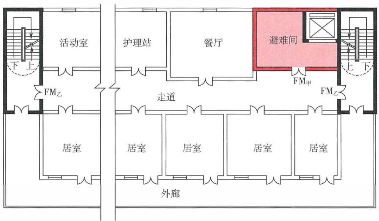

图7-18 老年人照料设施避难间布置示意图

1)对于仅供人员停留的避难间， 一般可以按照所在楼层或 该避难间服务区域中所需避难人数和每人平均占用面积不小千 $0 . 2 5 \mathrm { m } ^ { 2 }$ 计算确定。 

2)当有利用轮椅或病床疏散的人员，或者避难人员的体力 较弱时， 应根据使用轮椅或病床的人数和每把轮椅或每个病床 占用面积，以及其他避难人员的人数和每人平均占用面积不小于 $0 . 2 5 \mathrm { m } ^ { 2 }$ 计算确定，并考虑必要的设施设备占用面积。 

3)当利用前室兼作避难间时， 前室的净面积应在本规范和 国家有关技术标准对相应建筑前室使用面积要求的基础上，按照 避难人数和每人平均占用面积增加。 

因此，病房区、 手术部、 老年人照料设施等场所的避难间的 使用面积， 与其他公共建筑的避难间的使用面积要求有所不同。 例如， 医疗建筑中的避难间主要供危重病人，或因手术要求不能 及时疏散的病人及相关人员应急避难用，避难区的使用面积仅需 要满足少数人的使用要求，但所占面积还需考虑轮椅和病床所占 面积，一般每个护理单元不小于 $2 5 \mathrm { m } ^ { 2 }$ 。即每个护理单元的床位 数一般为40~60床，建筑面积为 $1 ~ 2 0 0 { \sim } 1 ~ 5 0 0 \mathrm { m } ^ { 2 }$ , 如按3人间病 房、 疏散着火房间和相邻房间的患者共9人，每个床位为 $2 \mathrm { m } ^ { 2 }$ 计 

算，共需要 $1 8 \mathrm m ^ { 2 } .$ , 再加上消防救援人员和医护人员、家属占用 的面积。 

4)避难人数应根据避难间服务区域的使用人员身体条件和 总疏散人数确定。在美国消防协会标准NFPA 101 Life Safety Code 2021年版） 中，用于辅助疏散人员的电梯的前室净面积应按 照服务区域的使用人数的 $2 5 \%$ (对于空管塔台建筑，不应小千 $5 0 \%$ )和每人平均占用面积不小于 $0 . 2 8 \mathrm { m } ^ { 2 }$ 计算确定，并加上轮椅 的占用面积。轮椅的占用面积按照每50人一把，每把轮椅的占 用面积按照 $7 6 0 \mathrm { m m } \times 1 ~ 2 2 0 \mathrm { m m }$ 计算。在我国，公共建筑中每个前 室的避难人数建议按照该前室服务区域总疏散人数的 $10 \%$ 计算。 

5)在住宅建筑中，主要提高套房本身的防火防烟性能，使 在火灾时不能及时疏散的人员可以直接利用套内房间作为避难 间，但该房间应至少有一面外墙靠消防车登高操作场地一侧。因 此，这种用于火灾时临时避难的房间不同千其他建筑中的公共避 难间。住宅建筑套内兼作应急避难的房间，平时 可以用千正常的 居住或其他家居用途，火灾时只能用千户内人员自身的避难，房 间的面积只要满足居住人员避难要求即可，不需要单独核算。 

(4)为方便外部消防救援和设置可开启的外窗，避难间应 至少具有一面外墙，并尽量位于消防车登高操作场地或消防救 援场地一侧。避难间、疏散楼梯、消防电梯等的平面布置示意如 图7-19所示。为防止建筑中高火灾危险性房间的火灾直接作用， 或通过外墙的窗口等开口溢出的火势和烟气危及避难间的安全， 避难间不应位千可燃物库房（包括档案库、资料库、图书库）、 锅炉房、发电机房、变配电站等火灾危险性大的场所的 正下方、 正上方或贴邻，并应尽量保持一定距离。 

（5）避难间属于火灾时仍需继续使用的场所，其防火分隔不 应低千其他类似功能房间的防火分隔要求，即应采用耐火极限不 低于 $2 . 0 0 \mathrm { { h } }$ 的防火隔墙和甲级或乙级防火门与其他部位分隔。当 建筑高度大千 $1 0 0 \mathrm { m }$ 时，应采用甲级防火门。在防火隔墙上，除 通向疏散梯间、消防电梯前室的门、房间门和建筑外窗外，不应 设置任何其他开口。 

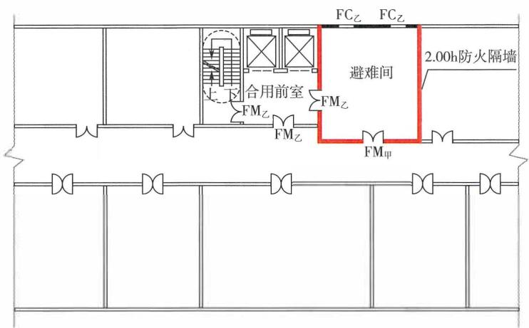

(a)专用避难间通向消防电梯与疏散楼梯间的合用前室

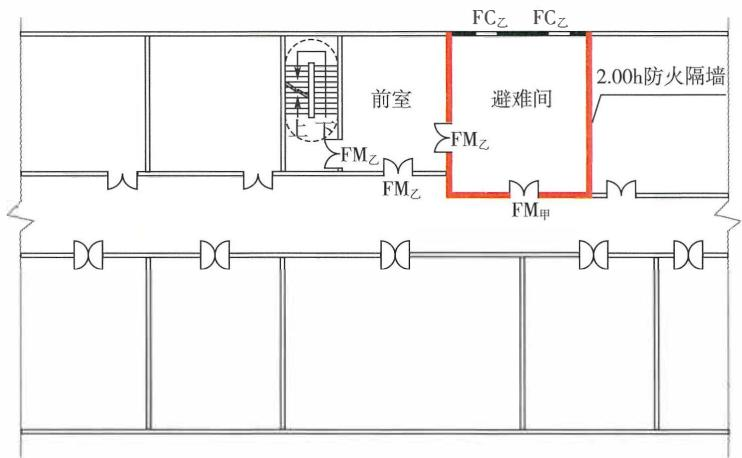

(b)专用避难间通向防烟楼梯间的前室

图7-19 避难间平面布置示意图

对住宅建筑中户内兼作避难用途的房间的相关要求应符合现 行国家标准《建筑设计防火规范》GB 50016等技术标准的规定。 例如， 房门要尽量采用甲级或乙级防火门， 或至少具有1.00h的 耐火完整性能；房间应具有可开启的外窗， 并应具有一定的耐火 完整性能， 耐火极限不宜低于 $1 . 0 0 \mathrm { h }$ 。 

(6)避难间的其他技术要求， 参见本规范第7.1.15条有关避 难区的［实施要点】。 

7.1.17 汽车库或修车库的室内疏散楼梯应符合下列规定： 

1 建筑高度大于 $3 2 \mathrm { m }$ 的高层汽车库， 应为防烟楼梯间； 

2 建筑高度不大于 $3 2 \mathrm { m }$ 的汽车库， 应为封闭楼梯间； 

3 地上修车库， 应为封闭楼梯间； 

4 地下、 半地下汽车库， 应符合本规范笫7.1.10条的 规定。 

7.1.18 汽车库内任一点至最近人员安全出口的疏散距离应 符合下列规定： 

1 单层汽车库、 位于建筑首层的汽车库， 无论汽车库 是否设置自动灭火系统， 均不应大于 $6 0 \mathrm { m }$ 。 

2 其他汽车库， 未设置自动灭火系统时， 不应大于 45m; 设置自动灭火系统时， 不应大于 $6 0 \mathrm { m }$ 。 

# ［条文要点］

这两条规定了汽车库和修车库室内疏散楼梯间的基本形式、 汽车库内的允许最大安全疏散距离， 以确保汽车库内人员的疏散 安全， 便于灭火救援。 

# ［实施要点］

(1)汽车库和修车库内的主要火灾危险性来自汽车本身。无 论何种原因引起的汽车火灾， 均以可燃固体火灾为主， 同时伴 有部分可燃液体或可燃气体火灾，主要可燃物为车内的座垫、轮 胎、 泡沫塑料等塑料、 燃油、 燃气和悝电池等。除悝电池引发的 火灾能很快引燃相邻汽车外，汽车发生火灾后的燃烧以自身燃烧 为主， 需经 $5 { \sim } 1 5 \mathrm { m i n }$ 后蔓延至相邻汽车，但产烟量巨大。 

修车库的可燃物还包括一定数量的甲、 乙类可燃液体， 火灾 危险性较汽车库高，但修车库的建筑面积通常较汽车库小，停车 数最少， 多为单层。 

（2）考虑到汽车库的室内净高较低的实际情况，初期的烟 气水平扩散速度为 $0 . 5 { \sim } 0 . 8 \mathrm { m / s }$ 。在火灾初期的环境能见度和汽 车库正常照明照度条件下， 人在水平地面上的正常疏散速度为 

$0 . 8 { \sim } 1 . 0 \mathrm { m } / \mathrm { s }$ , 人员在lmin左右的时间内均可疏散离开汽车库而进 入疏散楼梯间， 最大行走距离约为 $6 0 \mathrm { m }$ 。 但是， 汽车库的疏散距 离不仅是保证人员安全疏散的重要参数， 而且是核查安全出口和 疏散楼梯间设置位置是否合理的重要依据。 

根据汽车库的火灾和烟气蔓延特点， 建筑高度大千 $3 2 \mathrm { m }$ 的 高层汽车库， 疏散楼梯间应采用防烟楼梯间；建筑高度小千或等 千 $3 2 \mathrm { m }$ 的汽车库， 疏散楼梯间应采用封闭楼梯间。 修车库不允 许设置在地下， 也不允许采用高层建筑， 因此修车库应为单层和 多层建筑， 多层修车库的疏散楼梯间可以采用封闭楼梯间。 对千 地下、半地下汽车库， 应根据其埋深或层数按照本规范第7.1.10 条的规定确定， 当汽车库设置在建筑的地下室时， 疏散楼梯间还 应与地上疏散楼梯间分隔。 

汽车库疏散楼梯间的其他设置要求， 本规范未规定的， 均可 以按照现行国家标准《汽车库、修车库、停车场设计防火规范》 GB 50067等技术标准的规定确定。 

汽车库的疏散距离不能只考虑人员疏散需要， 还应考虑火灾 时消防救援人员进出火场的需要。 汽车库的最大疏散距离应按照 不大千 $6 0 \mathrm { m }$ 控制： 

1)对千单层汽车库、位千建筑首层的汽车库， 无论汽车库 是否设置自动灭火系统， 疏散距离均不应大于 $6 0 \mathrm { m }$ 。 

2)对千地下、半地下汽车库， 位于地上建筑中其他楼层的 汽车库， 疏散距离均不应大千 $4 5 \mathrm { m }$ ; 当汽车库内设置自动灭火系 统时， 疏散距离不应大千 $6 0 \mathrm { m }$ 。 

# 7.2 工业建筑

7.2.l 厂房中符合下列条件的每个防火分区或一个防火分 区内的每个楼层， 安全出口不应少于2个： 

l 甲类地上生产场所， 一个防火分区或楼层的建筑面 积大于 $1 0 0 \mathrm m ^ { 2 }$ 或同一时间的使用人数大于5人； 

2 乙类地上生产场所， 一个防火分区或楼层的建筑面 积大于 $1 5 0 \mathrm { m } ^ { 2 }$ 或同一时间的使用人数大于10人； 

3 丙类地上生产场所， 一个防火分区或楼层的建筑面 积大于 $2 5 0 \mathrm { m } ^ { 2 }$ 或同一时间的使用人数大于20人； 

4 丁、 戊类地上生产场所， 一个防火分区或楼层的建 筑面积大于 $4 0 0 \mathrm { m } ^ { 2 }$ 或同一时间的使用人数大于30人； 

5 丙类地下或半地下生产场所， 一个防火分区或楼层 的建筑面积大于 $5 0 \mathrm m ^ { 2 }$ 或同一时间的使用人数大于15人； 

6 丁、 戊类地下或半地下生产场所， 一个防火分区或楼 层的建筑面积大于 $2 0 0 \mathrm { m } ^ { 2 }$ 或同一时间的使用人数大于15人。 

# ［条文要点］

本条规定了生产厂房内地上、 地下每个防火分区或一个防 火分区内的每个楼层安全出口设置的基本要求。 除本条规定条件 外的其他防火分区或楼层， 可以设置一个安全出口。 本条规定的 “地下生产场所” ， 包括在平时使用的人民防空工程中设置的生 产场所。 

# 【实施要点）

(1)本条各款规定均针对不同类别火灾危险性的生产场所， 确定了其中一个防火分区、 只划分一个防火分区的一个楼层、 多 个楼层位千同一个防火分区的每个楼层安全出口的设置数量要 求， 而不是针对一座厂房建筑的规定。 即一座具有多种不同类别 火灾危险性的多层、 高层生产建筑， 尽管建筑的火灾危险性类别 只有一种，但建筑内不同类别火灾危险性的防火分区或楼层， 其安 全出口仍可以根据该防火分区或楼层的实际火灾危险性类别确定。 

例如， 一座3层的甲类生产厂房， 第三层为甲类生产场所， 第二层为丙类生产场所， 第一层为戊类生产场所， 每层建筑面积 均为 $2 0 0 \mathrm { m } ^ { 2 }$ 。 则这座建筑每层均可以分别划分为一个防火分区。 根据本条的规定， 第三层应设置至少2个安全出口， 第二层应设 置至少1个安全出口， 第一层应设置至少1个安全出口。 根据本 规范第7.12. 条的规定， 则该建筑每层应至少设置2座封闭楼梯 间， 并在第一层直通室外。但是， 第二层可以设置2个安全出口 连通至第三层下来的两座疏散楼梯间， 也可以设置1个安全出口 通至第三层下来的两座疏散楼梯间中的任何一座， 另一座疏散楼 

梯间在第二层可以不开口。 

又如，一座3 层的乙类生产厂房，每层建筑面积为 $2 0 0 0 \mathrm { m } ^ { 2 }$ o 第三层划分2个防火分区，一个防火分区为乙类生产场所，建筑 面积为 $1 ~ 0 0 0 \mathrm { m } ^ { 2 }$ , 另一个防火分区为丙类生产场所，建筑面积为 $1 ~ 0 0 0 \mathrm { m } ^ { 2 }$ ; 第二层划分一个防火分区，为丙类生产场所；第一层 划分一个防火分区，为丁类生产场所。 则根据本条的规定，这座 建筑第三层应设置至少4个安全出口，第二层和第一层分别应设 置至少2个安全出口。 根据本规范第7.1.2条的规定，该建筑每 层应至少设置4座封闭楼梯间，并在第一层直通室外。但是，第 二层可以设置4个安全出口通至第三层下来的四座疏散楼梯间， 也可以设置2个安全出口通至第三层下来的四座疏散楼梯间中的 任意两座，另外两座疏散楼梯间在第二层可以不开口。 

(2)当一个乙类生产的防火分区或楼层的建筑面积小于或等 千 $1 5 0 \mathrm m ^ { 2 }$ 且同一时间的使用人数少于或等千10人时，该防火分 区或楼层允许设置1个安全出口；当一个乙类生产的防火分区或 楼层的建筑面积小于或等于 $1 5 0 \mathrm m ^ { 2 }$ , 但同一时间的使用人数大于 0人时，该防火分区或楼层应设置至少2个安全出口；当一个 乙类生产的防火分区或楼层的建筑面积大千 $1 5 0 \mathrm m ^ { 2 }$ , 同一时间的 使用人数少于或等于10人时，该防火分区或楼层应设置至少2 个安全出口；当一个乙类生产的防火分区或楼层的建筑面积大于 $1 5 0 \mathrm m ^ { 2 }$ , 且同一时间的使用人数大千10人时，该防火分区或楼层 应设置至少2个安全出口。 同理，其他类别火灾危险性的防火分 区或楼层也可以根据此原则确定相应的安全出口数量。 

(3 )对千设置在生产厂房内的辅助生产用房，如配套的办 公、控制、质检、化验、休息和设备用房等配套用房，当这些房 间不靠墙分散布置在生产车间内并需要通过生产车间疏散时，这 些房间的疏散门可以根据房间的建筑面积和所在生产车间的最大 允许安全疏散距离要求确定。 此时，房间内任一点的疏散距离应 为从这些房间内最远点经过房间疏散门至所在生产车间最近安全 出口的直线距离。当这些房间集中布置在生产车间外，或靠外墙 设置在生产车间内时，这些房间应设置直通室外或疏散走道的疏 

散门， 使之具有独立的安全出口或疏散楼梯。此时， 房间内任一 点的疏散距离应为从房间内最远一点至该房间疏散出口的直线距 离， 房间疏散门的数量可以分别参照相应民用建筑中公共活动场 所和设备用房疏散门的设置要求确定。 

(4)尽管本条规定了不同类别火灾危险性防火分区、楼层至 少应设置的安全出口数量， 但一个防火分区、一个楼层的安全出 口的数量和设置位置， 还需要根据实际生产工艺情况、楼层数及 现行国家标准《建筑设计防火规范》GB 50016等技术标准有关最 大安全疏散距离、最小疏散净宽度的要求， 经计算后合理确定。 

7.2.2 高层厂房和甲、 乙、 丙类多层厂房的疏散楼梯应为 封闭楼梯间或室外楼梯。 建筑高度大于 $3 2 \mathrm { m }$ 且任一层使用 人数大于10人的厂房， 疏散楼梯应为防烟楼梯间或室外楼梯。 

# 【条文要点】

本条规定了各类火灾危险性和不同建筑高度的地上生产厂房 中疏散楼梯间的基本形式。 地下生产厂房的疏散楼梯设置要求， 应符合本规范第7.1.10条的规定。 

# 【实施要点】

(1)高层厂房和甲、 乙、丙类厂房的火灾危险性较大， 普通 客（货）用电梯无防烟、防火等性能和措施要求， 在建筑发生火 灾时难以保证人员疏散的安全， 不能用千人员的疏散。 对千高度 较高的建筑， 竖向疏散距离长， 人员疏散需要时间长， 应使疏散 楼梯间具有更高的防烟性能， 疏散楼梯间的形式要综合建筑的火 灾危险性、建筑高度、设置位置等因素确定。 丁、戊类多层厂房 的疏散楼梯间形式可以根据建筑各层的实际火灾危险性确定。 

(2)本条规定允许采用封闭楼梯间的高层厂房主要是针对 乙、丙、丁、 戊类高层厂房， 包括建筑高度小千或等千 $3 2 \mathrm { m }$ 的 高层厂房， 建筑高度大千 $3 2 \mathrm { m }$ 且任一楼层使用人数为10人及以下 的高层厂房。对千必须采用高层建筑的甲类厂房， 疏散楼梯间的形 式应根据其实际火灾危险性、生产过程中的每层使用人数、人员疏 散的安全需要、楼梯间的防护措施等情况经技术论证后确定。 

本条规定应采用防烟楼梯间的高层厂房， 是考虑到生产厂房 

内不同防火分区之间的分隔因生产需要往往不能完全采用防火墙 分隔的情形。当一座厂房每层具有多个防火分区、每层的防火分 区之间采用防火墙和甲级防火门完全分隔，且每个防火分区的疏 散楼梯间独立设置时，也可以按照每个防火分区的使用人数确定 疏散楼梯间的形式。例如，一座建筑高度为 $3 4 \mathrm { m }$ 的5层丙类高层 厂房，每层均采用防火墙和甲级防火门划分为2个防火分区，每 个防火分区的使用人数均为10人，每个防火分区均分别设置2座 独立的疏散楼梯间，则该厂房的疏散楼梯可以采用封闭楼梯间。 当其中任一层（如第三层）的防火分区之间不能采用防火墙和防 火门分隔时，则应将该层2个防火分区的使用人数之和作为一个 防火分区的使用人数考虑，该厂房的疏散楼梯应采用防烟楼梯间。 

（3）室外疏散楼梯具有较好的防止烟气积聚的性能，可以视 作具有与封闭楼梯间或防烟楼梯间基本相当的防烟性能。有关要 求参见本指南第7.1.11条的【实施要点】。 

$3 0 0 \mathrm { m } ^ { 2 }$ 的地上仓库，安全出口不应少 $1 0 0 \mathrm m ^ { 2 }$ 出口不应少于2个。仓库内每个建筑面积大于 $1 0 0 \mathrm m ^ { 2 }$ 的房 

# 【条文要点】

本条规定了地上、地下仓库建筑安全出口设置、建筑内每个 防火分区或防火分隔间（以下简称库房）疏散出口设置的基本要 求。本条规定的地下仓库，包括在平时使用的人民防空工程中设 置的仓库。 

# 【实施要点】

（1）仓库内库房的防火分隔要求较高，仓库的安全出口一般 应按照防火分区设置。当一座仓库采用分间库房，且库房通过共 用疏散走道、共用疏散楼梯间布置时，可以不要求按照防火分区 设置安全出口或疏散楼梯，但每间库房仍应按照本条规定的建筑 面积确定相应的疏散出口数量。这些疏散出口可以是直通室外的 疏散门，也可以是通向楼层上疏散走道的疏散门，该疏散走道应 直接连通至疏散楼梯间。 

为降低库房内火灾蔓延至其他楼层的危险性， 多层、 高层仓 库建筑中的安全出口应尽量设置在每间库房外， 通过公共的疏散 走道连通至室内疏散楼梯间或室外疏散楼梯。 

(2)由于在不同类别火灾危险性仓库中库房的建筑面积均有 一定限制， 且甲、 乙类仓库主要为单层建筑， 每间库房均可以设 置直通室外的安全出口。 因此， 本条有关仓库的安全出口设置不 再区别库房的火灾危险性类别。 

(3)本条规定的 “每个建筑面积大千 $1 0 0 \mathrm m ^ { 2 }$ 的房间” 是指仓 库中储存物质或物品的库房， 不包括辅助用房及设备房。 这些用 房的疏散出口数量可以根据相应的设置楼层位置和使用用途按照 本规范及现行国家相关技术标准的规定确定。 

# 7.2.4 高层仓库的疏散楼梯应为封闭楼梯间或室外楼梯。

# 【条文要点］

本条规定了高层仓库建筑中疏散楼梯间的基本形式。 地下仓 库的疏散楼梯设置要求， 应符合本规范第7.1.10条的规定。 

# 【实施要点】

(1)高层仓库是2层及2层以上且建筑高度大千 $2 4 \mathrm { m }$ , 用千 储存物质的建筑。 尽管本条规定高层仓库允许采用封闭楼梯间， 但对于丙类、 丁类储存物品的库房， 疏散楼梯间应尽最设置在库 房外， 当直接设置在库房内且无疏散走道时， 应尽量采用防烟楼 梯间。 当一座建筑由生产车间和库房组合建造时， 其中上、 下楼 层共用的疏散楼梯间应分别按照本规范的规定确定不同用途部分 的疏散楼梯间形式， 再按其中防烟性能要求较高者确定疏散楼梯 间的形式。 

例如， 一座建筑高度为 $3 8 \mathrm { m }$ 的5层建筑， 每层均划分为1 个防火分区， 第一层至第三层为丙类生产车间， 每层层高为 $8 \mathrm { m }$ ; 第四层和第五层为丙类库房， 每层层高为 $7 \mathrm { m }$ 。 根据本条和本规 范第72. 2条的规定，. 仓库部分的疏散楼梯可以采用封闭楼梯间， 生产部分也可以采用封闭楼梯间。 因此， 该建筑允许采用封闭楼 梯间。 如果该建筑第一层至第四层为丙类生产车间， 每层层高为 $8 . 5 \mathrm { m }$ , 且第三层和第四层的使用人数均为30人， 第五层为丙类 

库房，层高为 $4 \mathrm { m }$ 。 则该建筑第五层的疏散楼梯可以采用封闭楼 梯间，生产部分应采用防烟楼梯间。 因此，该建筑第一层至第五 层的所有疏散楼梯间均应为防烟楼梯间。 

(2)多层仓库的疏散楼梯间形式不限，但考虑到乙类、 丙类 仓库的可燃物数量大，丁类仓库也可能存在一定数量可燃物的情 况，敞开楼梯间不应直接设置在建筑中的每间库房内。 

# 7.3 住宅建筑

7.3.1 住宅建筑中符合下列条件之一的住宅单元， 每层的 安全出口不应少于2个： 

1 任一层建筑面积大于 $6 5 0 \mathrm m ^ { 2 }$ 的住宅单元； 

2 建筑高度大于 $5 4 \mathrm { m }$ 的住宅单元； 

3 建筑高度不大于 $2 7 \mathrm { m }$ , 但任一户门至最近安全出口 的疏散距离大于 $1 5 \mathrm { m }$ 的住宅单元； 

4 建筑高度大于 $2 7 \mathrm { m }$ 、 不大于 $5 4 \mathrm { m }$ , 但任一户门至最 近安全出口的疏散距离大于 $1 0 \mathrm { m }$ 的住宅单元。 

# 【条文要点】

住宅建筑形式多样，不同形式住宅建筑安全出口的设置要 求不同。本条规定了单元式、塔式住宅建筑安全出口设置的基本 要求，除本条规定条件外的其他单元式、塔式住宅建筑的住宅单 元，可以设置一个安全出口。单户独栋式、 多户联排拼接式等独 立设置安全出口或疏散楼梯的住宅建筑，住户或套房沿共用疏散 走道布置的通廊式住宅建筑等其他形式的住宅建筑， 可以根据住 户或套房和公共交通设施的布置方式、楼层建筑面积，按照疏散 距离控制要求和类似公共建筑的安全出口设置要求确定。 

# 【实施要点］

(1)在单元式住宅建筑中，每个单元中的住户或套房均围绕 楼梯和电梯等竖向交通设施布置，楼层上的疏散路线简洁，住户 或套房和楼层的公共区布置紧凑。单元式住宅建筑是我国住宅建 筑的主要形式，受楼层平面布置限制，在保证人员疏散安全的情 况下，需要考虑一定的经济性。根据本条第1款的规定，住宅建 

筑中每个楼层建筑面积小千或等千 $6 5 0 \mathrm m ^ { 2 }$ 的住宅单元， 每层可以 设置一个安全出口；当仅首层的建筑面积大于 $6 5 0 \mathrm m ^ { 2 }$ 时， 可以仅 在首层设置2个安全出口；当第二层及以上各楼层中任一楼层的 建筑面积大于 $6 5 0 \mathrm m ^ { 2 }$ 时， 该建筑每层均应设置2个安全出口。 

塔式住宅建筑相当千只有一个单元的住宅建筑。 因此， 塔式 住宅建筑的安全出口应按照本条规定设置。 

(2)本条第3款和第4款规定的疏散距离， 应为楼层上任一 住户或套房的户门至疏散楼梯间、 楼梯间前室入口的最近水平距 离。当该疏散距离大千本条规定时， 应设置2个安全出口；当楼 层设置2个安全出口时， 单元中户门至楼层安全出口的疏散距离 不受本条规定的限制。 下列情形的单元不需要再增设安全出口或 疏散楼梯： 

1)对千建筑高度不大千 $2 7 \mathrm { m }$ 的住宅建筑， 当单元中每个楼 层设置2个安全出口时， 楼层上任一户门至最近安全出口的疏散 距离允许大千 $1 5 \mathrm { m }$ 。但是， 楼层上安全出口的数量还应根据疏散 距离的控制要求确定是否增设。 

2)对于建筑高度大于 $2 7 \mathrm { m }$ , 但不大于 $5 4 \mathrm { m }$ 住宅建筑， 当单 元中每个楼层设置2个安全出口时， 楼层上任一户门至最近安全 出口的疏散距离允许大千 $1 0 \mathrm { m }$ 。但是， 楼层上安全出口的数量还 应根据疏散距离的控制要求确定是否增设。 

(3)住宅建筑的疏散楼梯间形式和楼层上的允许最大疏散距 离， 应根据建筑的高度、 建筑的结构类型和耐火等级、 楼梯的防 烟性能要求， 以保证火灾时的人员疏散安全、便于建筑的日常管 理和使用为原则， 按照本规范第7.3.2条和现行国家标准《建筑 设计防火规范》GB50016等标准的规定确定。 

# 7.3.2 住宅建筑的室内疏散楼梯应符合下列规定：

l建筑高度不大于 $2 1 \mathrm { m }$ 的住宅建筑， 当户门的耐火完 整性低于1.00h时， 与电梯井相邻布置的疏散楼梯应为封 闭楼梯间； 

2 建筑高度大于 $2 1 \mathrm { m }$ 、 不大于 $3 3 \mathrm { m }$ 的住宅建筑， 当户 门的耐火完整性低于l.OOh时， 疏散楼梯应为封闭楼梯间； 

3 建筑高度大于 $3 3 \mathrm { m }$ 的住宅建筑， 疏散楼梯应为防烟 楼梯间， 开向防烟楼梯间前室或合用前室的户门应为耐火 性能不低于乙级的防火门； 

4 建筑高度大于 $2 7 \mathrm { m }$ 、 不大于 $5 4 \mathrm { m }$ 且每层仅设置1部 疏散楼梯的住宅单元， 户门的耐火完整性不应低于l.OOh, 疏散楼梯应通至屋面； 

5 多个单元的住宅建筑中通至屋面的疏散楼梯应能通 过屋面连通。 

# 【条文要点】

本条规定了不同建筑高度住宅建筑中疏散楼梯间的基本形 式， 以及疏散楼梯间通至屋面的设置要求。 本条只规定了户门的 耐火完整性能， 是对门体的部分耐火性能要求， 但不是非隔热防 火门。 在实际建筑中， 是采用隔热还是非隔热防火门， 需要根据 具体情况和国家相关技术标准确定。 

# 【实施要点】

(1)本条规定的户门耐火完整性能， 是门体的某一面受火 时， 在一定时间内阻止火焰和热气穿透， 或在背火面出现火焰的 能力， 户门的耐火完整性能测定应符合现行国家标准《建筑门窗 耐火完整性试验方法》GB厅38252的规定。 与本规范规定的防火 门不同， 耐火完整性能不低于1.00h的户门不是隔热防火门， 也 不是耐火极限不低于 $1 . 0 0 \mathrm { h }$ B类和C类非隔热防火门， 这类门 可以采用相应耐火性能的B类 或C类非隔热防火门， 但不是防 火门产品， 只是对门需要具备的专门耐火性能的要求， 不需要 按照消防产品进行管理， 而本规范规定的防火门均为隔热防火 门，需要纳入消防产品监管。有关防火门的释义，请见本指南第 6.4.1条的［实施要点】。 

(2)建筑高度小千或等千 $2 1 \mathrm { m }$ 的住宅建筑， 疏散楼梯允许 采用敞开楼梯间。 为减小户内火灾烟气经电梯井蔓延对楼梯间的 影响， 住宅单元在每层的疏散楼梯位置要尽量远离电梯井， 或提 高户门的耐火性能。 当户门采用普通门， 或户门的耐火完整性能 低千1.00h时， 与电梯井相邻布置的疏散楼梯间， 或设置电梯的 

疏散楼梯间，应采用封闭楼梯间。 本条规定的 ”相邻布置” ，包 括疏散楼梯与电梯井正对布置的情况。 

(3)建筑高度大于 $2 1 \mathbf { m }$ , 且小千或等千 $3 3 \mathrm { m }$ 的住宅建筑，疏 散楼梯应采用封闭楼梯间。 当户门为防火门，或户门的耐火完整 性能不低于1.00h时，单元中的疏散楼梯也可以采用敞开楼梯间。 当然，从消防的安全性、工程的经济性和使用的方便性考虑，按 照户门采用普通门，疏散楼梯采用封闭楼梯间的方式建造更好。 

(4)建筑高度大于 $3 3 \mathrm { m }$ 的住宅建筑，无论户门的耐火性能 高低，疏散楼梯均应采用防烟楼梯间。 为保证疏散楼梯间和消防 电梯的安全使用，户门应避免直接开向疏散楼梯间前室或合用前 室，不允许直接开向疏散楼梯间。 当受楼梯平面局限，户门必须 开向防烟楼梯间前室或合用前室时，应严格限制开向前室或合用 前室的户门数量，且开向前室或合用前室的户门应为甲级或乙级 防火门。 有关允许开向前室或合用前室的户门数量，应符合现行 国家标准《建筑设计防火规范》GB50016 等技术标准的规定。 

(5)对于建筑高度大于 $2 7 \mathrm { m }$ , 且小于或等于 $5 4 \mathrm m$ 的住宅建筑， 其中任一户门至最近安全出口的疏散距离小千或等千 $1 0 \mathrm m$ 的住宅 单元，每个楼层均允许设置1个安全出口，该单元允许设 疏散楼梯。但是，这些建筑在竖向的疏散距离较长，属千二类高 层住宅建筑，正常情况下需要设置2部疏散楼梯，在楼层上要尽 量具备两个独立的安全出口，以保证人员在火灾时具有相互备用 的竖向疏散通道。 当住宅单元仅设置1部疏散楼梯时，为保证人 员在应急时具有两个不同的疏散方向，该疏散楼梯应通至屋面， 并且应提高户门的防火、防烟性能，使户门的耐火完整性能不低 于1.00h; 当住宅单元设置1部疏散楼梯，且疏散楼梯不通至屋面， 或者户门的耐火完整性能低于l.OOh时，该住宅单元应设置至少2 座独立的疏散楼梯间，在每个楼层上应具有2个独立的安全出口。 

(6)当一座住宅建筑由多个住宅单元组成时，每个住宅单元 中通至屋面的疏散楼梯均应能通过屋面连通至相邻单元或其他单 元的疏散楼梯间。 当相邻住宅单元的建筑高度不同时，应通过能 保证人员安全的室外楼梯或竖梯连通。 在实际建筑中，不一定要 

求一座住宅建筑中每个住宅单元的疏散楼梯均需要通至屋面。 一 座住宅建筑中不同住宅单元的疏散楼梯是否需要通至屋面， 应 根据本条第 4 款和现行国家标准《建筑设计防火规范》GB 50016 等标准的规定确定。但是， 如果要求建筑中一个住宅单元的疏散 楼梯通至屋面时， 该建筑中的其他住宅单元应至少有一个住宅单 元的疏散楼梯通至屋面， 并且这两个通至屋面的疏散楼梯应能通 过屋面连通；当该建筑有多个住宅单元的疏散楼梯通至屋面时， 这些疏散楼梯均应能通过屋面与其他通至屋面的疏散楼梯连通。 

# 7.4 公共建筑

7.4.1 公共建筑内每个防火分区或一个防火分区的每个楼 层的安全出口不应少于2个， 仅设置1个安全出口或1部 疏散楼梯的公共建筑应符合下列条件之一 ： 

l 除托儿所、 幼儿园外， 建筑面积不大于 $2 0 0 \mathrm m ^ { 2 }$ 且人 数不大于50人的单层公共建筑或多层公共建筑的首层； 

2 除医疗建筑、 老年人照料设施、 儿童活动场所、歌 舞娱乐放映游艺场所外， 符合表7.4.1规定的公共建筑。 

表7.4.1 仅设置l个安全出口或1部疏散楼梯的公共建筑

<table><tr><td>建筑的耐火等级或类型</td><td>最多层数</td><td>每层最大建筑面积/m2</td><td>人数</td></tr><tr><td>一、二级</td><td>3层</td><td>200</td><td>第二、三层的人数之和不大于50人</td></tr><tr><td>三级、木结构建筑</td><td>3层</td><td>200</td><td>第二、三层的人数之和不大于25人</td></tr><tr><td>四级</td><td>2层</td><td>200</td><td>第二层人数不大于15人</td></tr></table>

# 【条文要点］

本条规定了公共建筑内每个防火分区、 只划分一个防火分 区的一个楼层、 多个楼层位千同一个防火分区的每个楼层安全出 

口的最少设置数量， 以及设置一个安全出口或一部疏散楼梯的条 件。 这些公共建筑包括地上公共建筑及其地下、半地下室， 独 立的地下、半地下公共建筑， 平时使用的人民防空工程中的公共 场所。 公共建筑疏散楼梯间的形式应符合本规范第7.4.4条和第 45条的规定。 

# ［实施要点】

(1)本条要求为各类公共建筑、公共活动场所中每个防火 分区， 或者只划分一个防火分区的每个楼层应设置安全出口的最 少数量。 一个防火分区或一个楼层的安全出口数量， 还应根据不 同用途场所的实际使用人数、相应室内高度允许的最大安全疏散 距离等因素，并根据本规范第7.4.4条和现行国家标准《建筑设 计防火规范》GB 50016等标准有关每100 人所需最小疏散净宽 度的要求， 经计算并合理布置后确定。 参见本指南第7.1.2条的 【实施要点］。 

(2)对于疏散人数较少的场所或建筑， 人员的疏散时间主 要由场所的室内高度、 室内至最近疏散出口的疏散距离、楼层至 室外的疏散距离决定。 人员安全疏散所需时间是本条和本规范第 条确定允许仅设置l个疏散门、安全出口，1部疏散楼梯的 建筑的高度和建筑面积的基础。 

本条第1款允许仅设置l个安全出口的公共建筑、 第2款中 的木结构建筑， 均不区分建筑的耐火等级。 本条第2款规定的允 许仅设置1个安全出口或1部疏散楼梯的公共建筑， 当首层的建 筑面积和使用人数符合本条第1款的规定时，首层的安全出口数 量仍可以按照本条第1款的规定确定。 

当一座建筑存在多个符合本条表7.4.1中规定条件的区域， 每个区域相互间采用防火隔墙分隔且安全出口、疏散楼梯分别独 立设置时，这些区域安全出口、疏散楼梯的数量也可以按照本条 第2款的规定确定。 本条规定的使用人数均为所在区域、房间在 使用时可以采取人数控制措施控制的核定经营人数；当不能核定 或不能控制使用人数时， 应根据这些场所的实际用途， 按照国家 相关技术标准规定的人员密度经计算确定。 

例如， 一座二级耐火等级 的高层办公建筑， 在建筑的首层设 置了5间建筑面积均小千 $2 0 0 \mathrm { m } ^ { 2 }$ 且使用人数均为30人的办公室， 相互间均采用耐火极限不低千2.00h的防火隔墙分隔， 安全出口 均分别独立设置， 则这些办公室每间均可以设置1个安全出口。 但是， 根据本规范第7.4.2条的规定， 每间建筑面积大千 $1 2 0 \mathrm m ^ { 2 }$ 的办公室应设置不少于2个疏散门的要求， 因此位于首层的这些 办公室中建筑面积大千 $1 2 0 \mathrm m ^ { 2 }$ 的独立办公室仍应至少设置2个安 全出口。 参见图7-20。 

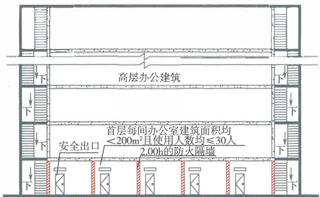

（a）剖面示意图

(b)平面示意图

图7-20 建筑面积小千或等千 $2 0 0 \mathbf { m } ^ { 2 }$ 的公共建筑的疏散门和 安全出口设置要求示意图（ 一 ）

又如， 一座二级耐火等级的6层办公建筑， 在建筑的下部 3层设置了5个建筑面积均小千 $2 0 0 \mathrm { m } ^ { 2 }$ 的办公区域， 每层每个相 互分隔的独立办公区的使用人数均为15人， 相互间均采用耐火 极限不低千2.00h的防火隔墙分隔， 疏散楼梯及首层的安全出口 均独立设置。 根据上述原则， 该建筑下部每个独立的办公区均 可以设置1座疏散楼梯间， 在首层可以设置1个安全出口。 疏 散楼梯间在首层应直通室外， 不应经过首层的办公室， 但可以 经过长度不大千 $1 5 \mathrm { m }$ 的疏散走道通向室外。 同时， 每层每间办 公室的疏散门设置数量仍应符合本规范第7.4.2条的规定。 参见 图7-21。 

(a)剖面示意图

(b)二层平面示意图

(C)首层平面示意图

图 7-21 建筑面积小千或等千 $2 0 0 \mathrm { m } ^ { 2 }$ 的公共建筑的疏散门和 安全出口设置要求示意图（二）

(3)本条规定的医疗建筑不包括无治疗功能的疗养院及其他 康养建筑。 无治疗功能的疗养院及其他康养建筑应按照旅馆建筑 考虑其防火技术设防标准。 本条规定的小型公共建筑中房间疏散 门的设置数量， 应符合本规范第7.4.2条 的规定。 例如， 一座二 级耐火等级且每层建筑面积为 $2 0 0 \mathrm { m } ^ { 2 }$ 的3层办公建筑， 每层设置 4个办公室， 每间办公室的建筑面积均小于 $5 0 \mathrm m ^ { 2 }$ 并通过疏散走 道连通至疏散楼梯间， 每层的总使用人数为20人。 则该建筑允 许设置1座疏散楼梯间， 每间办公室允许设置1个疏散门。 如果 该建筑的首层 不分隔， 是一个建筑面积为 $2 0 0 \mathrm { m } ^ { 2 }$ 的开敞区域， 则 首层应按照一个房间设置疏散门的要求设置2个直通室外的疏散 门。 参见图7—22。 

共三层， 每层建筑面积为 $2 0 0 \mathrm { m } ^ { 2 }$ , 每层的总使用入数为20人

（a）三层办公室立面示意图

(b) 二、 三层平面示意图

(C)首层平面示意图

图7-22 建筑面积小千或等千 $2 0 0 \mathrm { m } ^ { 2 }$ 的公共建筑的疏散门和 安全出口设置要求示意图（三）

(4)除托儿所、幼儿园外，医疗建筑、老年人照料设施、儿 童活动场所、歌舞娱乐放映游艺场所的安全出口设置数量，应结 合本条第1款和本规范第7.4.2条有关疏散门的设置数量 要求确 定，除符合本条第1款规定的条件外，均应设置至少2个安全出 口或2部疏散楼梯。 

(5)民用建筑的地下、半地下室，独立的地下、半地下公共 建筑，平时使用的人民防空工程中的公共场所设置1个安全出口 或1部疏散楼梯的条件或要求，除本条的规定外，还需要符合现 行国家标准《建筑设计防火规范》GB 50016和《人民防空工程 设计防火规范》GB 50098等标准的规定。 例如，国家标准《建 筑设计防火规范》GB 50016—2014 (2018年版） 第5.5.5条规定， 除 歌舞娱乐放映游艺场所外，防火分区建筑面积不大于 $2 0 0 \mathrm m ^ { 2 }$ 的 地下、半地下设备间，防火分区建筑面积不大千 $5 0 \mathrm m ^ { 2 }$ 且经常停 留人 数不超过15人的其他地下或半地下建筑（室），可设置1 个安全出口或1部疏散楼梯。国家标准《人民防空工程设计防火 

规范》GB50098—2009第5.1.1条第4款规定， 建筑面积不大于 $2 0 0 \mathrm { m } ^ { 2 }$ , 且经常停留人数不超过3人的防火分区， 可只设置1个 通向相邻防火分区的防火门。 

7.4.2 公共建筑内每个房间的疏散门不应少于2个；儿童 活动场所、 老年人照料设施中的老年人活动场所、 医疗建 筑中的治疗室和病房、 教学建筑中的教学用房， 当位于走 道尽端时， 疏散门不应少于2个；公共建筑内仅设置1个 疏散门的房间应符合下列条件之一 ： 

1 对于儿童活动场所、 老年人照料设施中的老年人活 动场所， 房间位于两个安全出口之间或袋形走道两侧且建 筑面积不大于 $5 0 \mathrm m ^ { 2 }$ 气 

2 对于医疗建筑中的治疗室和病房、 教学建筑中的教 学用房， 房间位于两个安全出口之间或袋形走道两侧且建 筑面积不大于 $7 5 \mathrm { m } ^ { 2 }$ 飞 

3 对于歌舞娱乐放映游艺场所， 房间的建筑面积不大 于 $5 0 \mathrm m ^ { 2 }$ 且经常停留人数不大于15人； 

4 对于其他用途的场所， 房间位于两个安全出口之间 或袋形走道两侧且建筑面积不大于 $1 2 0 \mathrm m ^ { 2 }$ 飞 

5 对于其他用途的场所， 房间位于走道尽端且建筑面 积不大于 $5 0 \mathrm m ^ { 2 }$ 气 

6 对于其他用途的场所， 房间位于走道尽端且建筑面 积不大于 $2 0 0 \mathrm { m } ^ { 2 }$ 、 房间内任一 点至疏散门的直线距离不大 于15m、 疏散门的净宽度不小于 $1 . 4 0 \mathrm { m }$ 。 

# 【条文要点］

本条规定了公共建筑内每个房间的疏散门的最少设置数量， 以及一个房间允许设置1个疏散门的条件。 本条规定的房间包括 地上公共建筑及其地下、 半地下室， 独立的地下、 半地下公共建 筑， 平时使用的人民防空工程中的各类公共用途房间， 不包括设 备用房。 

# ［实施要点】

(1)公共建筑中每个房间的疏散门设置数量， 均应根据房间 

内的使用人数、 允许的最大安全疏散距离，按照疏双向疏散的原 则确定，使房间内的人员 在房间内发生火灾时能够至少具有一个 疏散方向，且当其中一个疏散门不能被利用时，其他疏散门仍能 满足该房间内全部人员安全疏散的需要。 

(2)袋形走道是只有一个疏散方向的走道。位千袋形走道两 侧和尽端的房间，难以满足双向疏散的要求，不利千人员的安全 疏散，但与位千走道尽端的房间仍有所区别。本条规定的房间疏 散门，包括房间直通室外或疏散楼梯间的安全出口。例如，商店 营业厅内的疏散门有时就是直通疏散楼梯间的安全出口；位于袋 形走道尽端的房间中直通疏散走道的门为疏散门，另一个直通室 外或室外疏散楼梯的疏散门就是安全出口。 

(3)对千儿童活动场所、老年人照料设施中的老年人活动 场所、 医疗建筑中的治疗室和病房、教学建筑中的教学用房，应 避免布置在走道的尽端；当布置在尽端时，应 至少设置2个疏散 门，若不能满足此要求，则不能将此类用途的房间布置在走道的 尽端。这样的规定可以进一步限制这些房间布置在走道的尽端， 或布置在较高的楼层。 

(4)对千歌舞娱乐放映游艺场所，无论房间位千袋形走道 的两侧和尽端，还是位千两个安全出口之间，当房间的建筑面积 大千 $5 0 \mathrm m ^ { 2 }$ , 或者使用人数大千15人时，均应设置至少2个疏散 门。本条第3款规定的 “经常停留人数” 是每间房间经营核定的 使用人数，不同千计算所需疏散净宽度时的疏散人数，但可以按 照相关标准中有关这些场所的人员密度要求核定。 

例如，一个设置10间卡拉OK房间的KTV 经营场所，其中 5间建筑面积均为 $3 0 \mathrm m ^ { 2 }$ , 另外 5间建筑面积均为 $4 0 \mathrm m ^ { 2 }$ 。根据国 家标准《建筑设计防火规范》GB 50016—2014 (2018年版）第 5.5.21条的规定，建筑面积为 $3 0 \mathrm { m } ^ { 2 }$ 的房间疏散人数为15人，建 筑面积为 $4 0 \mathrm m ^ { 2 }$ 的房间疏散人数为20人。如不能确定其实际经营 的核定人数时，则这些房间应按照此方法计算的疏散人数确定其 平时使用人数。即5间建筑面积为 $3 0 \mathrm m ^ { 2 }$ 的房间允许设置1个疏 散门，另外5间建筑面积为 $4 0 \mathrm m ^ { 2 }$ 的房间应设置至少2个疏散门。 

(5)本条第4款、第5款和第6款规定的 “其他用途的场 所” ， 不包括儿童活动场所、老年人照料设施中的老年人活动场 所、医疗建筑中的冶疗室和病房、教学建筑中的教学用房、歌舞 娱乐放映游艺场、设备用房， 是除上述用途房间外的其他公共用 途的房间， 如办公室、营业厅、展览厅、会议室、宿舍居室、图 书阅览室、观众厅、旅馆客房、餐厅、厨房等。 

(6)当商业步行街等商店建筑中的商铺之间采取防火隔墙分 隔， 且每间商铺单独设置疏散门时， 每间商铺的疏散门设置数量 应符合本条的规定。 

(7)本条规定是针对房间疏散门先通向疏散走道， 再通向 疏散楼梯间的情形。 当建筑中的房间疏散门就是安全出口时， 可 以按照本规范第7.4.1条的规定确定其设置数量， 参见本指南第 7.4.1条的［实施要点】。 

(8)有关设备用房以及上述允许设置在地下、半地下（包括 平时使用的人民防空工程）的房间， 疏散门设置数量还需要符合 现行国家标准《建筑设计防火规范》GB50016和《人民防空工 程设计防火规范》GB50098等标准的规定。 例如， 国家标准《建 筑设计防火规范》GB50016—2014 (2018年版）第5.5.5条规定， 除该标准另有规定外， 建筑面积不大千 $2 0 0 \mathrm { m } ^ { 2 }$ 的地下、半地下设 备间，建筑面积不大于 $5 0 \mathrm m ^ { 2 }$ 且经常停留人数不超过15人的其他 地下、半地下房间， 可设置1个疏散门。 国家标准《人民防空工 程设计防火规范》GB50098—2009第5.1.1条也有类似规定。 

# 7.4.3 位于高层建筑内的儿童活动场所， 安全出口和疏散 楼梯应独立设置。

# ［条文要点】

儿童的行为能力较成人弱， 对疏散楼梯的构造要求也区别 千其他用途的建筑。 本条规定了儿童活动场所的安全出口和疏 散楼梯设置的关键技术要求， 主要为防止成人与儿童混用疏散设 施， 尽量避免与其他用途的场所混合建造；进一步从技术上限制 将儿童活动场所设置在高层建筑内， 以提高儿童在火灾时疏散的安 全性。 

# ［实施要点］

儿童活动场所设置在高层建筑内时， 儿童活动场所的安全出 口和疏散楼梯应全部独立设置， 不应与其他楼层或场所的安全出 口、 疏散楼梯合用；设置在多层建筑内时， 儿童活动场所的安全 出口和疏散楼梯要尽量全部独立设置， 当未全部独立设置时， 应 至少设置l个独立的安全出口或1部独立的疏散楼梯。 该独立的 安全出口不允许通向与其他用途或功能区域共用的疏散楼梯间。 

由千儿童活动场所不允许设置在地下、 半地下建筑（室） 内， 因此在儿童活动场所中独立设置的疏散楼梯， 可以根据其 实际服务楼层数量、 楼层所处位置的建筑高度， 按照本规范第 7.4.4条和第7.4.5条的规定确定楼梯间的防烟性能要求。 有关儿童 活动场所的安全出口、 疏散楼梯的具体设置要求， 可以参见现行 国家标准《建筑设计防火规范》GB 50016和《人民防空工程设计 防火规范》GB 50098等标准的规定， 疏散楼梯的构造要求可以参 见现行国家标准《民用建筑设计统一标准》GB50352的相关规定。 

7.4.4 下列公共建筑的室内疏散楼梯应为防烟楼梯间： 

l 一类高层公共建筑； 

2 建筑高度大于 $3 2 \mathrm { m }$ 的二类高层公共建筑。 

7.4.5 下列公共建筑中与敞开式外廊不直接连通的室内疏 散楼梯， 均应为封闭楼梯间： 

l 建筑高度不大于 $3 2 \mathrm { m }$ 的二类高层公共建筑； 

2 多层医疗建筑、旅馆建筑、 老年人照料设施及类似 使用功能的建筑； 

3 设置歌舞娱乐放映游艺场所的多层建筑； 

4 多层商店建筑、 图书馆、展览建筑、 会议中心及类 似使用功能的建筑； 

5 6层及6层以上的其他多层公共建筑。 

# 【条文要点】

这两条规定了地上各类公共建筑中服务不同建筑高度、 层 数的室内疏散楼梯的基本形式， 以满足不同火灾危险性场所或建 筑、 不同特性的使用人员安全疏散的需要。 

# ［实施要点】

(1)一类高层公共建筑无论建筑高度多少，室内疏散楼梯间 均应采用防烟楼梯间。 一类和二类高层公共建筑的分类标准，应 符合现行国家标准《建筑设计防火规范》GB 50016的规定。 

(2)建筑中直接与敞开式外廊连通的疏散楼梯间，具有较好 的通风条件，能防止烟气进入或在楼梯间内积聚。 当要求该建筑 设置封闭楼梯间时，该疏散楼梯间可以采用敞开楼梯间。 

(3)本规范第7.4.5条第2款和第4款规定的 ＂类似使用功 能的建筑＂ ， 是指设置医疗场所、 旅馆、 老年人照料设施、商 店、 图书馆、展览厅等类似功能的建筑， 以及使用功能与前述建 筑或场所类似，且疏散人数、使用人员的特性、 建筑的火灾特性 与前述场所类似的建筑。 第5款规定的 “其他多层公共建筑"' 为用千除本条第2款～第4款规定的功能和用途外的其他使用功 能和用途的建筑。 

(4)本规范或相关技术标准规定疏散楼梯间应采用封闭楼梯 间、防烟楼梯间的建筑，无论楼层的建筑面积大小或层数多少， 除与敞开式外廊连通的封闭楼梯间可以采用敞开楼梯间外， 均不 应采用敞开楼梯间，也不应因这些楼层的总建筑面积不大于一个 防火分区的最大允许建筑面积而将敞开楼梯间视为上、下层的连 通开口后，将要求设置封闭楼梯间的疏散楼梯改为敞开楼梯间。 因此， 这两条要求的疏散楼梯间形式，不能与该建筑是否可以将 多个楼层划分为同一防火分区混淆。 例如，一座二级耐火等级 的 3层商店建筑， 每层建筑面积为 $1 \ 2 0 0 \mathrm { m } ^ { 2 }$ , 设置自动喷水灭火 系统。 按照本规范第4.3.16条有关防火分区的最大允许建筑面积 要求，该建筑的第一层～第三层可以划分为同一个防火分区， 即 允许采用中庭等室内竖向开口连通， 且中庭等开口周围可以不分 隔，但疏散楼梯仍应采用封闭楼梯间。 

(5)当建筑中的疏散楼梯间只服务千局部楼层的场所时， 这 些场所的疏散楼梯间防烟性能要求可以根据其实际服务的高度或 层数、使用功能或用途按照本规范第7.4.4条和第7.4.5条的规定 确定。 例如，一座一类高层公共建筑，在其下部第一层和第二层 

设置了2层商店，商店区域的疏散楼梯独立设置，不与该建筑的 其他楼层和区域共用，则这两层商店的疏散楼梯可以采用封闭楼 梯间，而不需要采用防烟楼梯间。 如果将这两层商店改为办公场 所，则这两层办公区域的独立疏散楼梯可以采用敞开楼梯间。 

7.4.6 剧场、 电影院、 礼堂和体育馆的观众厅或多功能厅 的疏散门不应少于2个， 且每个疏散门的平均疏散人数不 应大于250人；当容纳人数大于 2 000 人时， 超过 2 000 人 的部分， 每个疏散门的平均疏散人数不应大于400 人。 

# ［条文要点】

本条针对剧场、电影院、礼堂和体育馆建筑中观众厅、多功 能厅的建筑空间、平面布置和使用人数等特点，规定了观众厅、 多功能厅的疏散出口设置基本要求，以避免出现疏散人员拥堵出 口、延误疏散时间、影响疏散安全的情况。 本条规定主要针对独 立的剧场、电影院、礼堂和体育馆建筑，也包括与其他建筑合建 的剧场、电影院、礼堂和体育馆。 

# 【实施要点】

(1)剧场、电影院、礼堂和体育馆的观众厅、多功能厅通常 使用人数多，在火灾情况下的疏散容易在疏散出口处发生起拱效 应。 这种效应不仅延长了疏散时间，而且一旦拱发生坰塌，很容 易导致人员摔倒被踩踏，引发人员伤亡和阻塞疏散出口。 因此， 这类人员密集的场所应通过合理设置疏散出口的数量、宽度和位 置予以避免。 

（2）火灾是具有突发性的意外事件，伴有大火、浓烟、强烈 的热辐射、噪声和有毒气体，常会在短时间内给人带来巨大的伤 害。 身处火场的人们往往需要承受巨大的心理压力，可能引发各 种各样的异常行为。 但是，如果在火灾情况下能保持良好的心理 状态，保持有序疏散，将大幅缩短疏散时间，提高疏散的安全性。 因此，本条通过限制每个疏散门负担的疏散人数，使疏散出口的 布置位置更合理，在疏散过程中能够更充分地利用观众座位的分 区和疏散通道，避免人员因不必要的过度集中而产生不利的心理 变化。 另外，对于设置在其他建筑内的剧场、电影院等的观众厅、 

多功能厅，即使疏散人数较少，每个厅的疏散出口宽度和设置位 置也要在满足安全疏散距离的基础上均匀分布，以提高疏散效率。 

(3)剧场、 电影院、 礼堂和体育馆的观众厅、 多功能厅的 疏散门，有的直通室外、 有的需要经过厅外的疏散走道集散或前 厅等区域通向室外、 疏散楼梯。 在疏散时，疏散通道或疏散走道 内的人员密度、 行走速度、 人员通过出口的流量三者的关系通常 可以表达为：出口流量 $=$ 行走速度 $\times$ 人员密度 $\times$ 出口宽度。 因 此，疏散出口的设置位置和宽度，除要考虑本条规定的疏散人数 外，还应优化出口外人员疏散区域的条件，使疏散出口与出口外 的疏散区域、 疏散楼梯的宽度相互匹配，以提高疏散出口的流量， 不会因出口外部疏散条件不畅而降低人员的疏散速度。 

(4)对千设置在其他建筑内的剧场、 电影院等的观众厅、 多 功能厅，其疏散人数在竖向上容易与其他功能区域的疏散人数混 流，疏散出口的设置不仅要考虑楼层上的平面疏散情形，还应考 虑竖向疏散的安全性，尽量设置独立的安全出口和疏散楼梯。 

7.4.7 除剧场、 电影院、礼堂、 体育馆外的其他公共建筑， 疏散出口、 疏散走道和疏散楼梯各自的总净宽度， 应根据 疏散人数和每100人所需最小疏散净宽度计算确定， 并应 符合下列规定： 

1 疏散出口、 疏散走道和疏散楼梯每100人所需最小 疏散净宽度不应小于表7.4.7的规定值。 

表7.4.7 疏散出口、 疏散走道和疏散楼梯每100人所需最小 疏散净宽度( $m / 1 0 0$ 人）

<table><tr><td rowspan="2" colspan="2">建筑层数或埋深</td><td colspan="3">建筑的耐火等级或类型</td></tr><tr><td>一级 二级</td><td>三级、木结构建筑</td><td>四级</td></tr><tr><td rowspan="3">地上楼层</td><td>1~2层</td><td>0.65</td><td>0.75</td><td>1.00</td></tr><tr><td>3层</td><td>0.75</td><td>1.00</td><td>-</td></tr><tr><td>不小于4层</td><td>1.00</td><td>1.25</td><td>-</td></tr></table>

7.4.7

<table><tr><td rowspan="2" colspan="2">建筑层数或埋深</td><td colspan="3">建筑的耐火等级或类型</td></tr><tr><td>一、二级</td><td>三级、木结构建筑</td><td>四级</td></tr><tr><td rowspan="3">地下、半地下楼层</td><td>埋深不大于10m</td><td>0.75</td><td>-</td><td>-</td></tr><tr><td>埋深大于10m</td><td>1.00</td><td>-</td><td>-</td></tr><tr><td>歌舞娱乐放映游艺场所及其他人员密集的房间</td><td>1.00</td><td>-</td><td>-</td></tr></table>

2 除不用作其他楼层人员疏散并直通室外地面的外门 总净宽度， 可按本层的疏散人数计算确定外， 首层外门的 总净宽度应按该建筑疏散人数最大一层的人数计算确定。 

3 歌舞娱乐放映游艺场所中录像厅的疏散人数， 应根 据录像厅的建筑面积按不小于 $1 . 0 \wedge / \mathrm { m } ^ { 2 }$ 计算；歌舞娱乐放 映游艺场所中其他用途房间的疏散人数， 应根据房间的建 筑面积按不小于0.5人 $/ \mathrm { m } ^ { 2 }$ 计算。 

# 【条文要点】

剧场、 电影院、札堂、体育馆中观众厅和多功能厅的疏散出 口、 疏散走道和疏散楼梯所需疏散净宽度应根据本规范第7.4.6 条规定的疏散人数分配要求， 综合每个疏散出口的合理的人流股 数、 人员安全疏散出观众厅和多功能厅等场所的时间等因素确 定。 本条规定了除上述建筑外的其他各类公共建筑疏散出口、 疏 散走道和疏散楼梯所需疏散净宽度的确定方法。 本条规定的疏 散净宽度和疏散人数确定标准， 适用千地上、 地下各类公共建 筑的疏散出口、 疏散走道和疏散楼梯的净宽度计算， 以及地上、 地下公共建筑中的各类公共活动场所和房间疏散出口的净宽度 计算， 包括平时使用的人民防空工程。 

# 【实施要点】

(1)在建筑发生火灾时， 人员疏散的安全性与人员通过疏 

散出口、 疏散走道和疏散楼梯的时间直接相关， 其中， 人员在楼 梯间内的竖向疏散时间影响较大。公共建筑中每层的疏散人数较 多， 在从不同房间汇入疏散走道， 再从疏散走道或直接从疏散出 口汇入疏散楼梯间的过程中， 人员的密度会不断增加， 加之在 不同区域的疏散速度不同， 导致疏散速度和整体疏散时间受到影 响。因此， 通过调整不同场所的疏散出口和疏散走道的宽度、 服 务建筑中不同层数或竖向疏散高度的疏散楼梯的宽度， 可以改变 人员的疏散速度和疏散时间。在住宅建筑中， 通廊式住宅建筑 内的人员疏散过程和人员集中度与某些公共建筑类似， 其疏散出 口、 疏散走道和疏散楼梯所需净宽度， 可以参照公共建筑的相关 要求确定。 单元式、 塔式住宅建筑受每层的户数限制， 每层的疏 散人数较公共建筑要少很多， 通过直接规定住宅建筑中每个单元 的疏散出口、 疏散走道和疏散楼梯的净宽度， 就可以满足人员安 全疏散的要求。 

(2)通常， 人员在建筑发生火灾时安全疏散的空间过程如 图7-23所示。 

图7-23 人员疏散的空间过程示意图

在人员疏散的空间过程中， 影响人员疏散速度、 疏散时间 的关键因素是其中人员通过流量较小的部位，如疏散出口、楼梯 间等。对于疏散人数较多的场所， 在这些部位经常出现人员聚集 和滞留的现象， 应通过增大宽度， 或使后者的宽度较前者大予以 疏解。另外， 对千行为能力基本相同的疏散人群和相同的照度条 件， 人在水平地面上的疏散速度一般大千在坡道上的上行疏散速 度，在坡道上的上行疏散速度大于在楼梯等阶梯式通道上的上行 速度；人在水平地面上的疏散速度与在坡道上的下行疏散速度相 当， 但大千在楼梯等阶梯式通道上的下行速度。因此， 在断面通 

过人流量相同的情况下， 疏散门、 安全出口、 疏散走道、 疏散楼 梯的最小净宽度， 在顺人员疏散方向一般要求后者的疏散宽度不 小千前者。但实际上， 人员通过相同宽度的疏散出口、 疏散走道 和疏散楼梯的流量往往难以达到一样， 要求依次增大疏散走道和 疏散楼梯的宽度在实际建筑中有时难以实现。 因此， 对千疏散人 数多的楼层， 还需要结合疏散人员的行为能力， 适当考虑设置必 要的避难间， 或在疏散楼梯间前设置一定面积的前室， 以保证火 灾时人员疏散的安全。 

(3)本条表7.4.7中关千 “歌舞娱乐放映游艺场所及其他人 员密集的房间＂ 疏散出口、 疏散走道和疏散楼梯每100人所需最 小疏散净宽度的要求， 与这些场所的楼层位置和地下埋深大小无 关， 均要不小于 $1 . 0 0 \mathrm { m }$ 。 歌舞娱乐放映游艺场所的疏散人数， 可 以根据该场所内具有娱乐功能的各厅、 室的建筑面积和场所内的 人员密度计算后确定。在计算该场所的相关建筑面积时， 可以不 计入该场所内疏散走道、 卫生间等辅助用房的建筑面积。 

(4)准确确定不同房间或场所的疏散人数， 是疏散出口、 疏 散走道和疏散楼梯的宽度设置能否满足实际疏散需要的关键。 任 一场所和房间的疏散人数均应根据其用途和楼层位置， 结合当 地类似场所的实际使用人数、 节假日使用人数等因素合理估计 确定。 

(5)当疏散出口仅用于建筑内某一独立的区域或场所时， 该 疏散出口可以仅按照所服务区域或场所的疏散人数、 用途、 所在 楼层位置对应的层数或埋深确定其所需疏散净宽度。当疏散楼梯 仅用千服务建筑中某些楼层或区域时， 该疏散楼梯可以根据其实 际服务的楼层数和这些区域的疏散人数确定其所需疏散净宽度。 有关要求可参见本指南第7.4.4条和第7.4.5条［实施要点】的第 (5)款的规定。 

# 7.4.8 医疗建筑的避难间设置应符合下列规定：

1 高层病房楼应在笫二层及以上的病房楼层和洁净手 术部设置避难间； 

2　楼地面距室外设计地面高度大于 $2 4 \mathrm { m }$ 的洁净 

及重症监护区， 每个防火分区应至少设置1间避难间； 

3 每间避难间服务的护理单元不应大于2个， 每个护 理单元的避难区净面积不应小于 $2 5 . 0 \mathrm { m } ^ { 2 }$ 

4 避难间的其他防火要求， 应符合本规范笫7.1.16条 的规定。 

# ［条文要点】

为满足医疗建筑中的病房楼、 医院手术部等场所中在火灾时 难以及时疏散的人员避难的需要， 本条规定了医疗建筑有关楼层 的避难间设置要求。 有关避难间的防火防烟性能、 在楼层上的设 置位置、 为满足应急救援要求应设置的相关设施等， 应符合本规 范第7.1.16条及国家相关专项标准的规定。 

# ［实施要点］

(1)医疗建筑是指医院、 卫生院、 疗养院、 门诊部、 诊所、 卫生所、 卫生室等从事疾病诊断、 治疗活动的机构使用的建筑。 医疗建筑中的病人住院部或病房楼中的人员， 特别是洁净手术 部、 重症监护病房中的人员在火灾时有的不允许马上疏散， 有的 不能与其他行为能力较强的人同时疏散， 都需要就近避难， 或经 避难场所停留准备后再疏散。 本条规定高层病房楼应在第二层及 以上的病房楼层和洁净手术部设置避难间， 即病房和洁净手术部 位于高层医疗建筑的第二层及以上楼层时， 应在相应的楼层或区 域设置避难间。 

(2)本条规定的洁净手术部是由洁净手术室、 洁净辅助用房 和非洁净辅助用房等一部分或全部组成的独立的功能区域， 可以 是独立的建筑， 也可以是设置在医疗建筑中的一个或多个楼层。 重症监护区是收治各类危重病患者， 并实施集中的加强治疗和护 理的场所。 当这些场所设置在非病房楼的医疗建筑内， 楼地面距离 设计地面大千 $2 4 \mathrm { m }$ 的楼层时， 洁净手术部和重症监护区所在防火分 区应设置避难间，且每个防火分区不应少千l间。参见图7-24。 

(3)避难间可以利用供平时使用的其他用途房间， 如每层 的监护室、 器材室、 护理人员休息室等， 也可以利用消防电梯前 室， 但不应利用消防电梯与防烟楼梯间的合用前室， 以防止病床 

(a)剖面示意图

(b)平面示意图

（c）洁净手术部及重症监护区剖面示意图

（d）洁净手术部及重症监护区平面示意图

图7-24医疗建筑避难间设置示意图

影响人员通过楼梯疏散。避难间内可供避难的面积，应考虑病床 或病人、医护人员、家属、消防救援人员以及相关治疗设备停放 所需净面积。 

# 其 他 工 程

7.5.1地铁车站中站台公共区至站厅公共区或其他安全区域 的疏散楼梯、自动扶梯和疏散通道的通过能力，应保证在远 

期或客流控制期中超高峰小时最大客流量时， 一列进站列 车所载乘客及站台上的候车乘客能在4min内全部撤离站台， 并应能在6min内全部疏散至站厅公共区或其他安全区域。 

# 【条文要点】

本条规定了地铁车站不同公共区有关疏散设施的功能要求， 以及这些疏散设施的功能目标要求和基本性能要求， 即地铁车站 应设置疏散设施， 疏散设施应满足本条规定的人员疏散要求。 本 条规定是根据地铁车站的具体情况确定和校核公共区的安全出 口、 疏散楼梯、 出入口通道等疏散设施或场地设置是否合理， 是 否能够满足人员安全疏散要求的依据。 

# 【实施要点】

(1)地铁车站多为地下车站， 也有部分地上车站。 对千地下 车站， 通常采用站台在下、 站厅在上的布置方式， 站厅公共区与 站台公共区大多划分为一个防火分区， 且站台公共区的人员在大 多数情况下需要经过站厅疏散至室外。 此时， 站厅公共区相对站 台公共区而言是人员疏散的室内安全区域，但当站台或车站轨行 区发生火灾时， 仍会有烟气进入站厅公共区， 而且站厅公共区本 身也存在一定的火灾危险性， 仍不是人员疏散的最后安全区， 站 厅公共区内的人员和从站台进入其中的人员还需要经过最终的安 全出口疏散至室外。 对于地上车站， 通常采用站台在上、 站厅在 下的布置方式， 人员可以经过站厅疏散， 也可以直接从站台疏 散。 由千站台的火灾主要来自列车本身， 火灾规模较大， 因此无 论哪种形式的车站， 均要求人员能够尽快脱离站台。 

(2)受站台长度和宽度等平面尺寸的限制， 站台公共区往往 难以设置足够数量的疏散楼梯和直通地面的出口， 需要充分利用 自动扶梯的疏散能力。 

本条规定综合考虑了站台和站厅公共区的高度、 火灾后的 烟气蔓延与控制措施、 需要疏散的人数、 疏散楼梯和安全出口的 设置条件、 人员疏散的安全性等因素， 要求站台公共区内的全 部候车人员和一列进站列车满载人员全部脱离列车、 站台并全 部进入疏散楼梯、 疏散用自动扶梯的时间不应大千 $4 \mathrm { { m i n } }$ , 人员 

从站台上的疏散楼梯、疏散用自动扶梯处全部到达站厅公共区 或者站厅出入口通道、疏散楼梯间内的时间不应大千 2min。 因 此， 车站站台公共区内的全部人员到达站厅公共区或者站厅出入 口通道、疏散楼梯间内的时间（包括全部乘客从列车上下至站台 的时间）不应大千 6min。 在车站发生火灾时， 站厅公共区的人 员需要同时进行疏散， 如果该车站站台公共区的全部人员能在 6min时间疏散完毕， 就能保证站厅公共区的全部人员安全疏散 完毕。 

(3)从目前国内巳建成的部分地铁线路看，地铁车站的远 期超高峰小时最大客流量通常大于初、近期超高峰小时最大客流 最，但也存在少数站近期超高峰小时最大客流量大千其远期超高 峰小时最大客流量的情形。 因此，本条规定的疏散人数应考虑不 同时期预测客流晕的最大值， 并以超高峰小时最大断面客流量为 基础确定。 

(4)对千多线换乘的共用站厅， 也应按照本条规定的时间确 定站台公共区至站厅公共区、站厅公共区至其他线路站厅公共区 的安全出口、疏散楼梯、疏散出入口通道的设置位置、数量、宽 度和下沉式广场等的面积和尺寸。 

(5)本条规定的 “其他安全区域“ 包括地面， 下沉式广场、 下沉庭院， 符合人员安全疏散要求的城市通廊、连廊、天桥、换 乘通道等。 可以参见本指南第7.5.2条【条文要点】。 

# 7.5.2 地铁车站的安全出口应符合下列规定：

1 车站每个站厅公共区直通室外的安全出口不应少于 2个； 

2 地下一层与站厅公共区同层布置侧式站台的车站， 每侧站台直通室外的安全出口不应少于2个； 

3 位于站厅公共区同方向相邻两个安全出口之间的水 平净距不应小于 $2 0 \mathrm { m }$ ; 

4 设备区的安全出口应独立设置， 有人值守的设备和 管理用房区域的安全出口不应少于2个， 其中有人值守的 防火分区应至少有1个直通室外的安全出口。 

# 【条文要点】

本条规定了地铁车站公共区、设备区设置安全出口的基本要 求。 对千设备区， 地铁车站的安全出口主要为设备区通向直通室 外的疏散楼梯间的入口、设备区内防火分区之间防火墙上通向相 邻防火分区的疏散门、 设备区通向站台或站厅公共区的疏散门、 通向符合人员疏散要求的下沉庭院或下沉式广场的入口；对千站 厅公共区和站台公共区， 地铁车站的安全出口主要为公共区通向 直通室外的出入口通道的入口、公共区通向直通室外的疏散楼梯 间的入口、公共区通向符合人员疏散安全要求的下沉庭院或下沉 式广场的入口、公共区通向符合人员疏散安全要求的城市通廊或 换乘通道的入口。 

# 【实施要点】

(1)本条规定的地铁车站包括地上车站和地下车站。 站厅公 共区根据车站的设置地点、连接线路数量、 与相邻国铁或城际铁 路等交通设施的车站连通和换乘情况不同有较大差别。 地铁车站 大多采用单线车站站厅， 部分为两线共用站厅， 少数为更多线路 共用站厅。 站厅公共区的建筑面积一般不大千 $5 ~ 0 0 0 \mathrm { m } ^ { 2 }$ , 少数大 千 $1 0 \ 0 0 0 \mathrm { m } ^ { 2 }$ , 因此， 本条规定的站厅公共区直通室外的安全出口 数量为基本要求， 实际工程还需要根据站厅的建筑面积、疏散距 离控制要求和服务线路数量增设安全出口。 有关疏散距离应根据 本规范第7.1.3条规定的原则和现行国家标准《地铁设计防火标 准》GB51298等标准的规定进行控制。 地下车站和地上高架车 站的公共区难以完全按照一般民用建筑的要求设置直接到达地面 的安全出口和疏散楼梯，考虑到地铁车站建造地点的特殊情况以 及地铁车站公共区的实际火灾危险性较小的特点，车站公共区的 安全出口设置与其他地下、 地上民用建筑的相关要求有所区别， 主要体现在疏散距离控制、 安全出口的数量和净宽度要求上。 例 如， 国家标准《地铁设计防火标准》GB51298—2018第5.1.10 条 规定， 站厅公共区和站台计算长度内任一点到疏散通道口和疏散 楼梯口或用千疏散的自动扶梯口的最大疏散距离不应大千 $5 0 \mathrm { m }$ 。 该条规定的站厅公共区包括地下、 地上地铁车站的站厅公共区。 

在国家标准《地铁设计防火标准》GB 51298— 2018中，安全出 口和疏散楼梯的净宽度则是按照疏散时间控制间接进行控制。 

站厅的建筑面积一般较大，为保证站厅公共区内的人员具有 多个不同的疏散方向，设置在站厅公共区同一侧的安全出口，应 保持足够的间距，防止出现人员在出入口处发生拥堵，或者发生几 条出入口通道同时受到火灾烟气作用而影响人员疏散安全的情况。 

(2)本条第1款规定的站厅公共区的安全出口设置数量，主 要是对服务一条线路的站厅公共区的要求。对于多线共用站厅 （即换乘车站共用一个站厅公共区），还应根据站厅的防火分隔 情况增设相应的安全出口，以确保共用站厅中的一条线路发生火 灾时，不应影响其他线路的安全运行和人员疏散安全。 一般情况 下，共用站厅的安全出口数量要按照每条线路不少2个考虑。例 如，当为两条线路换乘的车站共用一个站厅公共区时，该站厅公 共区的安全出口数量不应少千4个；当为三条线路换乘站共用一 个站厅公共区时，该站厅公共区的安全出口数量不应少千6个。 

对千分离式站厅，站厅公共区分为两个通过站台连通的独立 部分，每个站厅公共区有自己独立的付费区和非付费区。 因此， 每个独立的站厅公共区也应分别设置至少2个安全出口。 

本条第3款规定的间距应为相邻两个安全出口的开口或门口 最近边缘之间的水平距离。 

(3)对千只有地下一层并采用侧式站台的地下车站，实际上 基本不存在站厅公共区，只有面积较小的 服务区域供乘客付费和 检票用，或者站台公共区与站厅公共区同层布置。此时，如为单 线车站，站厅公共区和站台公共区是共用安全出口；如为多线车 站，站厅公共区为换乘区域，站台与站厅公共区之间应划分为不 同的防火分区，以确保不同线路的火灾不会影响其他线路的安全 运行，不同线路的站台公共区应分别设置独立的安全出口，站厅 公共区的安全出口可以与站台公共区的安全出口共用。 上述情况 的安全出口数量均应符合本条第1款的规定。此外，当站台公共 区不经过站厅公共区疏散而单独设置安全出口时，站台公共区的 安全出口设置应符合本条第1款的规定。但考虑到站台本身的尺 

寸和出口设置条件，不强制要求其中相邻两个安全出口或疏散楼 梯之间的间距，但应尽量满足本条第3款的要求。 

对于与站厅同层布置的侧式站台，站厅可以根据实际情况在 站厅公共区与站台公共区之间设置防火隔墙，将站厅与站台分隔 成两个不同的防火区域，也可以不设置防火隔墙。但是，无论分 隔为几个防火分隔区域，通常站厅的公共区与站台的公共区均为 同一个防火分区。 当在站厅公共区与站台公共区之间设置防火隔 墙时，人员的疏散过程相当千站台在下、站厅在上的正厅形式。此 时，可以按照本条要求设置安全出口。 当在站厅公共区与站台公共 区之间未设置防火隔墙时，站厅公共区相当于站台公共区的一部 分。此时，不仅要按照本条要求设置安全出口，而且应根据本规范 第7.5.1条的要求按照站台公共区和站厅公共区内的全部人员和一 列列车的全部乘客疏散完毕的时间不应大千6min进行校核。 

(4)车站设备管理区的安全出口和设备用房的疏散出口设 置，可以根据设备用房的位置分别按照现行国家标准《建筑设计 防火规范》GB50016有关地上或地下设备用房（区）的安全出 口设置要求确定。除需要独立设置的安全出口外，设备管理区的 其他安全出口可以利用设置在通向相邻防火分区的防火墙上的 甲级防火门，但这两个防火分区在该防火分隔处应采用防火墙分 隔，不应采用其他方式分隔， 不应通向车站站厅公共区和相邻非 地铁功能区。 对于无人值守的设备区，如风机房、水泵房、变电 站，可以设置至少1个直通室外的安全出口，其他安全出口可以 利用通向相邻区域的出口。例如，无人值守的站台设备管理区可 以利用设备管理区的外走道通过站台端门经站台公共区疏散。 本 条规定的设备区主要为集中布置的设备管理区或设备层，不包括 站台端部的无人值守设备管理区或设备管理用房。 

(5)车站出入口通道、换乘通道的安全出口设置要求应根 据通道的长度、实际用途、地面条件、通道的断面大小、配置的 消防设施等情况确定，并可以按照现行国家标准《地铁设计防火 标准》GB51298、《地铁设计规范》GB50157等标准的规定确定。 其他非共用站厅公共区的换乘厅等场所应按照本规范有关地下民 

用建筑的要求设置安全出口， 并区别是否兼作人民防空工程， 按 照现行国家标准《建筑设计防火规范》 GB 50016、《人民防空工 程设计防火规范》 50098等标准确定相应的设置要求。 

# 7.5.3 两条单线载客运营地下区间之间应设置联络通道， 载客运营地下区间内应设置纵向疏散平台。

# ［条文要点】

本条针对具有两条独立区间隧道的地铁线路， 规定了在地铁区 间相邻隧道之间设置可供人员疏散和救援人员进入的联络通道；针 对地铁区间隧道， 规定了在区间隧道内设置应急疏散平台的要求。 

# 【实施要点】

(1)地铁区间隧道的长度， 即车站之间的隧道长度， 一般综 合列车追踪时间、 列车正常运行速度、 运行区间的流最和地理条 件等因素确定， 大多在 $1 { \sim } 2 \mathrm { k m }$ , 少数更长。 因此， 经区间隧道进 行人员疏散和实施灭火救援的难度很大， 当地铁列车发生火灾时， 应将列车行驶到前方车站进行处置和疏散人员。但是， 从安全考 虑， 地铁工程应该为列车在地下区间发生火灾且不能牵引到相邻 车站时的人员疏散与救援提供条件，使乘客能够就近弃车疏散， 消防救援人员能够通过相邻区间隧道进入着火隧道实施灭火救援。 

为尽可能提高人员经区间隧道疏散的安全性， 积极利用相邻 区间疏散和实施救援， 应在相邻区间隧道之间设置联络通道， 将 乘客疏散到另一条非着火区间内， 并在每条区间隧道内靠车站站 台一侧沿线路设置纵向疏散平台， 以便人员通向联络通道和前后 方车站进行疏散。 

(2)相邻两条联络通道的间距， 应综合隧道的几何条件、 通 风与排烟条件、 隧道建造方式、 隧道位置、 隧道长度等因素， 按 照现行国家标准《地铁设计防火标准》 51298等标准的规定 确定。有关联络通道出人口设置及其技术要求，联络通道内部的 疏散指示和疏散照明设置、 防烟措施及其技术要求， 可以根据隧 道的结构形式、 建造方式和联络通道的场地等因素， 根据国家现 行相关技术标准的要求确定。 

（3）纵向疏散平台的宽度、耐火性能，以及制作材料、设置 

高度、栏杆和扶手、 疏散指示标志和疏散照明等的设置要求，可 以按照现行国家标准《地铁设计防火标准》GB 51298等标准的 规定确定。 

7.5.4 地铁工程中的出入口控制装置， 应具有与火灾自动 报警系统联动控制自动释放和断电自动释放的功能， 并应 能在车站控制室或消防控制室内手动远程控制。 

# ［条文要点］

为保证人员在火灾时逃生和疏散的安全，本条规定了在地铁 工程出入口处设置的人员出入控制装置应具备解禁功能，并明确 了解禁方式。 

# ［实施要点】

(1)地铁工程是重要的城市公共交通系统， 大多同时兼具人 民防空工程的功能，除车站的付费区与非付费区之间需要设置人 员出入控制设施外，在设备区等场所的人员应急出入口处，因平 时不供人员出入， 也需要设置门禁系统。 由千火灾的不确定性， 在地铁工程中设置的出入口都是为人员在火灾情况下疏散和逃生 提供的不同路径。 设置门禁系统的不常用出入口在火灾时同样应 能够保证人员快速脱离火场， 不会限制或影响人员疏散与逃生， 并应满足本规范第7.1.7条规定的基本要求。 即设置门禁系统的 疏散门应具有在火灾时自动解禁的功能，且人员不需使用任何工 具即能容易地从建筑内部打开，在门内一侧的显著位置应设置清 晰、 明显的标识。 

(2)地铁工程均要求设置火灾自动报警系统、 消防控制中心 或消防控制室，地铁工程的相关设施具备与火灾自动报警系统联 动控制的条件。 因此，地铁工程中的出入口控制装置应同时具有 与火灾自动报警系统联动控制自动释放和断电自动释放的功能， 并应能在车站控制室或消防控制室内手动远程控制。 无论是火灾 自动报警系统发出火警信号， 还是因发生火灾切断控制装置的正 常供电，均可以联动释放这些出入口的门禁装置。 同时，在人员 发现火情及其他应急情况下，即使没有发出火警信号或者没有断 电， 也应能够通过车站控制室或消防控制室的联动控制装置远程 

手动控制释放门禁装置， 以满足人员的应急疏散需要。 

(3)本条规定的 ”出入口“ 包括：地铁车站站厅公共区的出 入口或站厅出入口通道在地面的出口、 站台公共区的出入口或站 台出入口通道在地面的出口、 付费区与非付费区之间的进出口闸 机、 设备区的出入口、 消防专用出入口等。 

7.5.5 城市综合管廊工程的每个舱室均应设置人员逃生口 和消防救援出入口。 人员逃生口和消防救援出入口的尺寸 应方便人员进出， 其间距应根据电力电缆、 热力管道、 燃气 管道的敷设情况， 管廊通风与消防救援等需要综合确定。 

# ［条文要点】

本条规定了城市综合管廊工程不同舱室的人员逃生口和消防 救援出入口的设置要求， 以及确定这些出入口尺寸和设置间距的 原则。 

# 【实施要点】

(1)城市综合管廊工程是建于城市地下， 用千容纳两类及以 上城市工程管线的构筑物及附属设施， 按容纳的管线类型分为干 线综合管廊、 支线综合管廊和缆线管廊。 城市综合管廊的干线综 合管廊一般敷设电力电缆、 天然气管道、热力管道、 通信线缆、 污 水管道、 中水管道、给水管道等管道。其他类型的管廊根据服务区 域情况设置相应的管线。在城市综合管廊中， 天然气管道、 电力电 缆、热力管道大多采用单独舱室，其他管线采用共用舱室的综合舱， 舱室之间采用耐火极限不低千2.00h的结构分隔，参见图7-25。 

图 7-25 城市综合管廊舱室分隔示意图

城市综合管廊突破了传统管线的敷设方式，可以集约利用地 下空间，更好地发挥城市道路的交通功能，确保城市生命线的稳 定、安全，增强城市的防灾抗灾能力。但城市综合管廊同样存在 火灾危险，需要考虑检修人员、安装人员的应急逃生、发生火灾 等应急状况的消防救援需要，必须在每个舱室均分别设置必要的 人员逃生口和消防救援出入口，以方便受困人员及时从管廊中逃 生，消防救援人员可以从安全的位置进入管廊，并根据救援现场 情况及时撤出。 

(2)城市综合管廊的火灾危险性主要来自泄漏的燃气、线 缆、热力管道的保温隔热材料以及少数难燃管道。 城市综合管廊 具有空间封闭、出入口少、火灾不易被发现、 空间狭小、施救较 困难的特点，且不同舱室的火灾危险性不同，燃气管道舱、热力 舱和电力电缆舱具有较高火灾危险性，其他舱室的火灾危险性很 低，主要考虑检修期间可能发生的小火。 因此，不同舱室的人员 逃生口和消防救援出入口，其设置间距可以根据舱室的实际火灾 危险性、建设位置的外部条件等因素确定。 例如，国家标准《城 市综合管廊工程技术规范》GB 50838一2015第5.4.4条规定，在 综合管廊中，敷设电力电缆的舱室，逃生口间距不宜大千 $2 0 0 \mathrm { m }$ ; 敷设天然气管道的舱室，逃生口间距不宜大千 $2 0 0 \mathrm { m }$ ; 敷设热力 管道的舱室，逃生口间距不应大于 $4 0 0 \mathrm { m }$ , 当热力管道采用蒸汽 介质时，逃生口间距不应大千 $1 0 0 \mathrm { m }$ ; 敷设其他管道的舱室，逃 生口间距不宜大千 $4 0 0 \mathrm { m }$ 。 

3)消防救援出入口的尺寸应符合本规范第2.2.3条 防救援口的要求；人员逃生口的尺寸可以参考消防救援出入口的 尺寸确定，一般不应小千 $0 . 8 \mathrm { m } \times 0 . 8 \mathrm { m }$ , 也可以根据现行国家标 准《城市综合管廊工程技术规范》GB 50838等标准的规定确定。 例如，国家标准《城市综合管廊工程技术规范》GB 50838一2015 第5.4.4条规定，综合管廊逃生口的尺寸不应小于 $1 \mathrm { m } \times 1 \mathrm { m }$ , 当 为圆形时，内径不应小于 $1 \mathrm m$ 。 通常，城市综合管廊的消防救援 出入口可以利用人员逃生口。 