# 浙江省消防技术规范难点问题 操作技术指南

（2025 版） 

2025 年 12 月 

# 前 言

自 2002 年以来，我省就定期对国家消防技术标准规范执行中的 难点问题进行研讨，明确执行的具体技术要求，统一了全省消防设计、 审查、验收的执行标准。《浙江省消防技术规范难点问题操作技术指 南》历经多次修订，每一次修订都汇聚了市场主体的需求，凝练了我 省消防工程领域专家的集体智慧，反映了其对于公共政策的支持价值。 2025 年，根据《消防救援机构与住房城乡建设主管部门建设工程消 防安全监督管理工作协作机制》的有关要求，浙江省住房和城乡建设 厅会同浙江省消防救援总队组织浙江大学建筑设计研究院有限公司、 浙江省工业设计研究院有限公司、浙江省建筑设计研究院有限公司等 单位对 2020 年编制的《浙江省消防技术规范难点问题操作技术指南 （2020 版）》（以下简称《指南（2020 版）》）进行了修订，在充 分征求意见、研讨修改的基础上形成了《浙江省消防技术规范难点问 题操作技术指南（2025 版）》（以下简称本《指南》），并经国家 标准规范管理组有关专家评审同意。主要内容包括：第一章 建筑分 类和耐火等级；第二章 总平面布局；第三章 防火分区和建筑结构、 构造；第四章 安全疏散和救援；第五章 消防给水；第六章 消防电 气；第七章 防烟、排烟及供暖、通风和空气调节；第八章 热能动力； 第九章 特殊建筑和场所；附录A、B。 

本次修订主要新增条文：第 1.3.4、1.5.4、2.1.2、2.2.2、3.1.8、 3.2.6、3.2.8、3.4.12、3.4.13、3.4.14、3.5.1、3.5.2、3.5.3、4.1.11、4.1.12、 4.1.36、4.1.37、4.1.38、4.2.14、4.2.20、5.1.12、5.1.13、5.1.14、5.2.3、 5.3.2、5.4.4、5.4.6、6.1.2、6.1.5、6.1.7、6.2.2、6.2.3、6.3.3、6.3.8、 7.1.4、7.1.11、7.1.19、7.2.2、7.2.5、7.2.22、7.2.24、7.2.35、7.5.2、 8.1.4、9.7.6、9.7.7、9.7.8、9.7.9 条。 

本《指南》的具体解释工作由《浙江省消防技术规范难点问题操 作技术指南》管理组负责，执行过程中如有意见、建议和问题，请联 系：《浙江省消防技术规范难点问题操作技术指南》管理组秘书处— 浙江大学建筑设计研究院有限公司（地址：杭州市天目山路148号浙 江大学西溪校区东一楼；联系人：颜晓强；邮箱：zjxfzn@qq.com）。 

主编单位：浙江大学建筑设计研究院有限公司 

参编单位（排名不分先后）： 

浙江省工业设计研究院有限公司 

浙江省建筑设计研究院有限公司 

中国联合工程有限公司 

温州设计集团有限公司 

杭州市建筑设计研究院有限公司 

宁波市建筑设计研究院有限公司 

杭州市城乡建设委员会 

宁波市住房和城乡建设局 

温州市住房和城乡建设局 

杭州市消防救援支队 

宁波市消防救援支队 

温州市消防救援支队 

主要起草人：王 健 郑经友 黄亚东 吕敬建 王靖华 

赖庆林 程 澍 王伶剑 任 涛 颜晓强 

许世文 项志峰 姜传鉷 郭晓晖 方小军 

邵剑文 何 江 周展浩 方 黎 刘 莹 

李 平 林 鑫 余俊祥 李光华 金华飞 

赵香囡 钟惠芬 应 振 杨 彤 陈 华 

李兴起 吴邱晨 黄东丰 袁 斌 陈 亮 

李超群 卓承军 

主要审查人：王宗存 黄晓家 丁宏军 何学超 刘松涛 

# 目 录

# 第一章 建筑分类和耐火等级.

1.1 建筑高度和定性 3 

1.2 台阶式地坪 . 

1.3 厂房（仓库）相关问题. .8 

1.4 部分建筑、场所的消防设计定性 C 

1.5 高层建筑与裙房 11 

# 第二章 总平面布局. .14

2.1 消防车道与消防车登高操作场地 .14 

2.2 消防救援口 .22 

2.3 防火间距 .. ..24 

# 第三章 防火分区和建筑结构、构造. .37

3.1 防火分区 . ..37 

3.2 防火卷帘、中庭 . ..39 

3.3 外墙保温 ..44 

3.4 建筑结构、构造 . ..45 

3.5 应急排烟窗、应急排烟排热设施 ..46 

# 第四章 安全疏散和救援. .48

4.1 安全出口、疏散宽度与疏散距离 ..48 

4.2 疏散楼梯 . .59 

4.3 消防电梯和屋顶直升机停机坪 ..65 

# 第五章 消防给水. ..67

5.1 消防水源 . ..67 

5.2 消防水泵 . .69 

5.3 室内外消火栓系统 ..69 

5.4 自动灭火系统. ..70 

5.5 其他灭火系统. .72 

# 第六章 消防电气.. .73

6.1 消防电源及其配电 .73 

6.2 消防应急照明和疏散指示系统. ..76 

6.3 火灾自动报警系统 ..76 

# 第七章 防烟、排烟及供暖、通风和空气调节. .78

7.1 防烟系统 . .78 

7.2 排烟系统 . .89 

7.3 系统控制 . ..104 

7.4 施工、调试和验收 ..104 

7.5 暖通空调系统. ..105 

第八章 热能动力.. .106 

8.1 锅炉房、柴油发电机房 .. 106 

第九章 特殊建筑和场所.. .107 

9.1 电影厅、法院审判厅等场所 ..107 

9.2 儿童活动场所 . .. 107 

9.3 菜市场 . ..108 

9.4 体育馆、游泳馆. .109 

9.5 商业服务网点及类似功能建筑 ..110 

9.6 消防控制室. 111 

9.7 其他特殊建筑和场所. .. 112 

附录 A 本次修订时删除的《浙江省消防难点问题操作技术指南（2020 版）》条 文及说明.. .. 118 

附录B 本指南部分用词和概念的说明. .122 

# 第一章 建筑分类和耐火等级

# 1.1 建筑高度和定性

1.1.1 《建筑设计防火规范》GB 50016-2014（2018 年版）（以下简称《建 筑设计防火规范》）附录 A“建筑高度和建筑层数的计算方法”中，“室 内高度”应按建筑层高计算；“室内顶板面高出室外设计地面的高度不大 于 $1 . 5 \mathrm { m }$ 的地下或半地下室”“设置在建筑底部且室内高度不大于 $2 . 2 \mathrm { m }$ 的 自行车库、储藏室、敞开空间”可累计不计入层数，对于住宅建筑可累计 不计入建筑高度。 

〔说明〕新建住宅建筑应按实际建筑高度计算后，确定其消防设计要求。例如，当 按照《住宅项目规范》设计的住宅层高超过 $3 \mathrm { m }$ 时，9 层住宅的建筑高度将超过 $2 7 \mathrm { m }$ ， 18层住宅的建筑高度将超过 $5 4 \mathrm { m }$ 。 

1.1.2 建筑屋面为坡屋面时，建筑高度应按建筑室外设计地面至檐口（按 照建筑外墙面起坡处起算）与屋脊的平均高度（H1）或建筑室外设计地面 至屋顶最高使用夹层的楼面的高度（H2）取较大值。（附图1.1.2） 

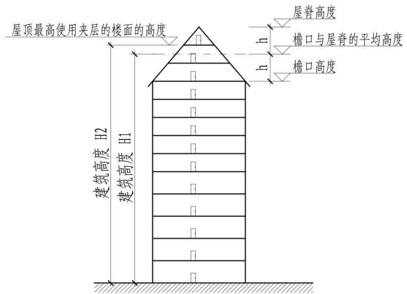

附图1.1.2 坡屋顶建筑高度计算

〔说明〕本次修订删除了《指南（2020版）》第1.1.2条内容。鉴于空间较高的闷 顶层后续多存在会被利用的潜在风险，新建工程的闷顶空间应按国家和浙江省相关规定 计算高度和层数。既有建筑改造时建筑高度认定确有困难时，应进行专项分析研究，提 出合理的方案。本条中坡屋面下方的使用夹层为可利用的功能空间，非闷顶。商业服务 网点为坡屋面时的建筑高度计算应按本《指南》第9.5.1条执行。 

1.1.3 住宅建筑单元平-坡结合的屋面，应按照最高屋面计算建筑高度，当 平屋顶部分占屋面面积（按照建筑外墙面起坡处投影线起算围合面积）不 大于1/4的，可按第1.1.4 条规定计算建筑高度。（附图1.1.3） 

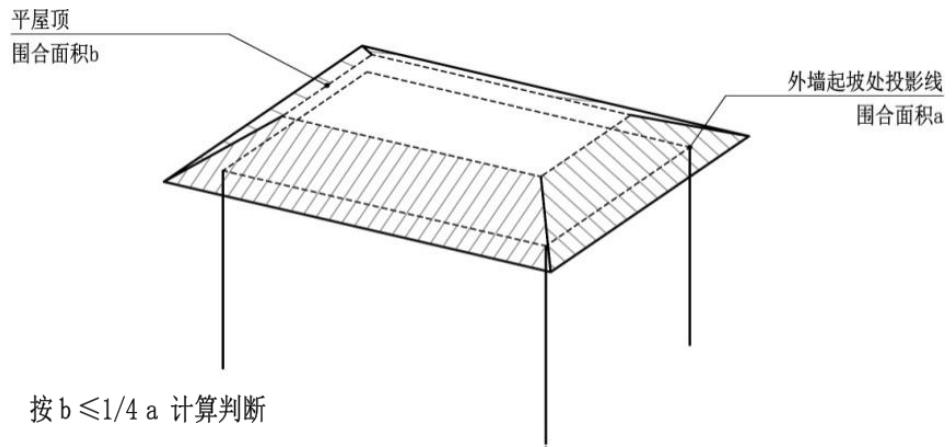

附图1.1.3 平-坡结合屋顶建筑高度计算

1.1.4 建筑屋面坡度不大于 $3 \%$ 时，建筑高度计算时，屋面面层算至靠外 墙处的屋面最低点。工业建筑和公共建筑（含商业和住宅组合建筑）屋面 面层算至屋面的建筑完成面（包含绿化层、保温层等屋面构造厚度）；住 宅（含设置商业服务网点的住宅）屋面面层可算至屋面结构板面。（附图 1.1.4） 

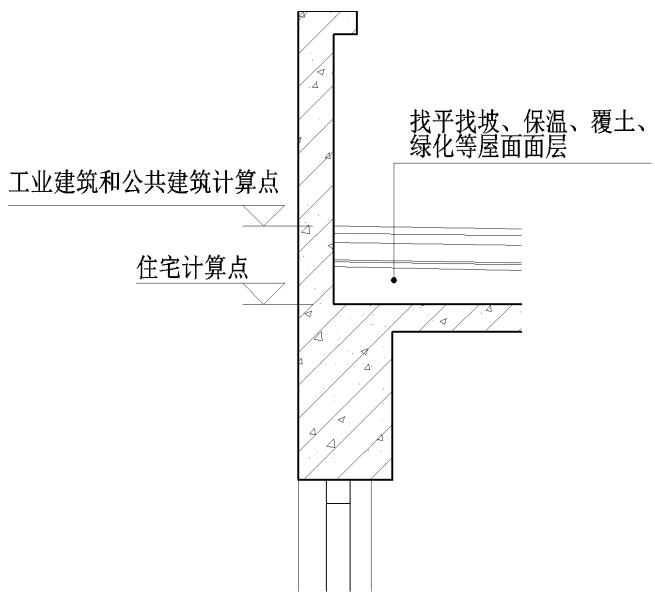

附图 1.1.4 屋面面层计算

1.1.5 建筑高度超过 $2 4 \mathrm { m }$ 的单层厂房可按单层厂房设计。 

1.1.6 除《建筑防火通用规范》GB 55037-2022（以下简称《建筑防火通用 规范》）《建筑设计防火规范》等国家标准、本《指南》中明确为“不开 

设门窗洞口的防火墙”“防火墙不能用防火卷帘、防火分隔水幕等措施替 代”以及设于防火间距不限处的防火墙外，其余涉及 防火墙 的开口部位， 均可按规范要求采用甲级防火门（窗）、符合《建筑设计防火规范》第 6.5.3 条规定的特级防火卷帘等防火分隔措施。 

除特别注明外，本《指南》条文中涉及设置“防火分隔措施”，指“耐 火极限不低于 2.00h 的防火隔墙、乙级防火门（窗）、符合《建筑设计防 火规范》第6.5.3 条规定的防火卷帘和耐火极限不低于1.50h 的不燃性楼板。 

〔说明〕《指南（2020 版）》第 3.4.1 条调整至此并增加对防火分隔措施的描述。 

# 1.2 台阶式地坪

对于台阶式地坪，当位于不同高程地坪上的同一建筑无法满足分别计 算各自建筑高度的条件时，应按下列原则计算建筑高度： 

1.2.1 按规范需要设置环形消防车道的建筑，当其较低室外地坪和较高地 坪形成环形消防车道或沿建筑的两个长边设置贯通式或尽头式消防车道时， 可按较高或较低室外地坪（与应设置的消防登高操作场地的标高应一致） 起算建筑高度；按规范要求受条件限制不能沿两个长边设置消防车道，实 际只沿建筑的一个长边设置消防车道的建筑，其最大进深不宜大于 $5 0 \mathrm { m }$ ， 可按消防车道的相应室外地坪（与应设置的消防登高操作场地的标高应一 致）起算建筑高度；其余按照《建筑设计防火规范》未要求设置消防车道 的建筑，可按照实际室外地坪情况确定起算建筑高度。（附图1.2.1） 

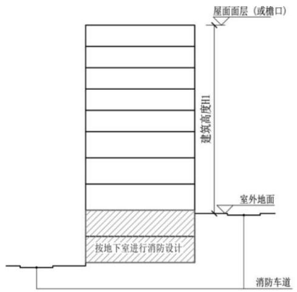

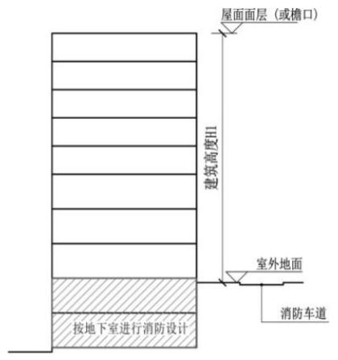

附图1.2.1 按较高的室外地坪起算建筑高度

# 1.2.2 低于较高地坪的房间应根据实际情况确定消防设计：

1 当按较高的室外地坪起算建筑高度时，低于较高地坪的房间地面与 较高地坪的高差不小于其层高的 1/3 时，应按地下室进行消防设计，当建 筑内部空间距外墙临空处进深不大于 $3 0 \mathrm { m }$ 且具备自然采光通风条件时，该 空间可按地上部分设置防火分区；如有部分空间进深大于 $3 0 \mathrm { m }$ 时，与进深 不大于 $3 0 \mathrm { m }$ 的空间应采用防火墙分隔，该防火墙上需开设连通口时，应采 用下沉式广场等室外开敞空间、避难走道、防火隔间或防烟前室连接，不 得采用防火卷帘；（附图1.2.2-1） 

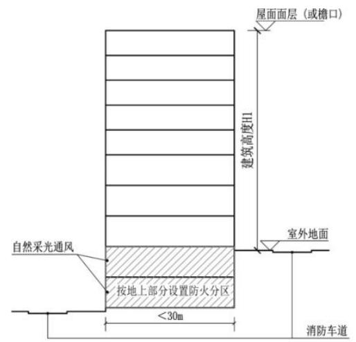

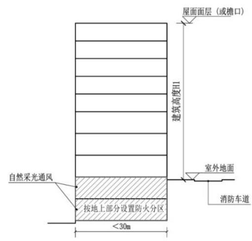

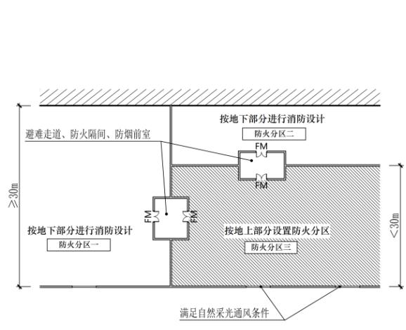

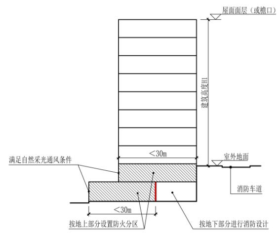

附图1.2.2-1 按较高的室外地坪起算建筑高度

2 当按较高的室外地坪起算建筑高度时，低于较高地坪的房间地面与 较高地坪的高差小于其层高的 1/3 时（从较高地坪起算为地上房间），可 按地上部分进行消防设计；（附图1.2.2-2） 

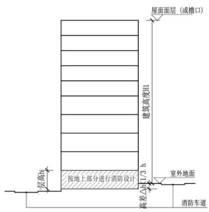

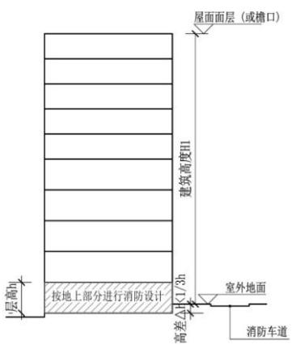

附图1.2.2-2 与较高地坪高差较小的房间

3 当按较低的室外地坪起算建筑高度时，低于较高地坪的房间，可按 地上部分进行消防设计；但当建筑内部空间距外墙临空处进深大于 $3 0 \mathrm { m }$ 或 不具备自然采光通风条件时，该空间应按照地下室进行消防设计，且与按 地上部分进行消防设计的部分之间应采取防火墙、防火门、防火卷帘分隔 划为不同的防火分区。（附图1.2.2-3） 

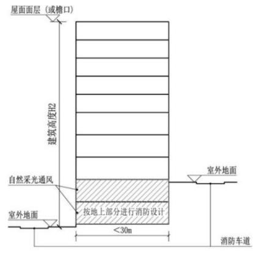

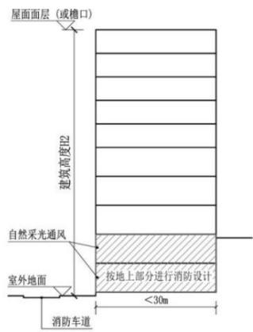

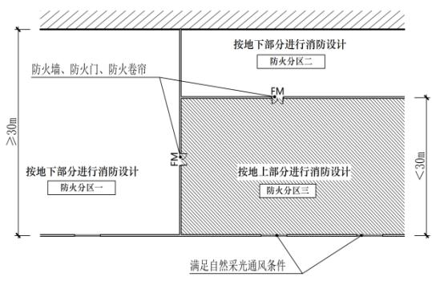

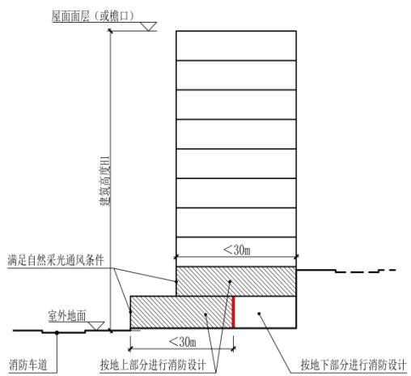

附图1.2.2-3 按较低的室外地坪起算建筑高度

〔说明〕本条第1款，主要是为解决山地酒店类项目的下挂餐厅等大空间的防火分 区面积问题而进行的明确。 

# 1.3 厂房（仓库）相关问题

1.3.1 《建筑防火通用规范》第8.1.8 条第2 款规定的类似用途的厂房，《建 筑设计防火规范》第 8.3.1 条第 2 款规定的类似生产厂房、第 8.4.1 条第 1 款规定的类似用途的厂房和第 10.3.1 条第 5 款规定的人员密集的厂房，是 指单体建筑任一生产加工车间或防火分区内，同一时间的生产、作业人数 超过 50 人，且人均建筑面积小于 $2 0 ~ \mathrm { { m } } ^ { 2 }$ 的具有丙类火灾危险性的生产制造 类企业的厂房和物流建筑的分拣、加工等作业区。 

〔说明〕参考《重大火灾隐患判定规则》GB 35181-2025中“劳动密集型企业”的 定义修订部分内容。 

1.3.2 对民用爆破器材工程和烟花爆竹工程的建筑内部工艺与布置、危险 品储存与运输等设计内容应当执行现行国家标准《民用爆炸物品工程设计 安全标准》GB 50089 和《烟花爆竹工程设计安全标准》GB 50161。上述标 准中关于建筑之间的防火间距、消防车道等建筑外部的消防设计要求不应 低于现行国家标准《建筑防火通用规范》GB 55037、《建筑设计防火规范》 GB 50016 的规定。 

〔说明〕修订部分标准的名称。 

1.3.3 火力发电厂的消防车登高操作场地和消防车道设置、电子工业洁净 厂房、地下污水处理厂的防火分区面积控制等因特殊工艺要求无法符合《建 筑防火通用规范》《建筑设计防火规范》的相关规定时，可按其行业专项 的标准执行。 

1.3.4 厂房各生产场所防火分区的火灾危险性类别应按《建筑设计防火规 范》第3.1.2 条确定。厂房各部分为独立防火分区时，可根据各自的火灾危 险性类别确定各自部分的防火设计，除甲、乙类的生产场所外，可在同一 幢厂房建筑内相邻布置或上下楼层布置。该厂房的防火间距等消防设计应 以整幢厂房为单位按火灾危险性类别最高的防火分区定性。 

〔说明〕新增条文。厂房内可能会存在不同火灾危险性等级的生产场所，当划分为 不同的防火分区时，允许在一定情况下组合建造。 

# 1.4 部分建筑、场所的消防设计定性

1.4.1 除规划部门认可按照成套住宅功能设置的建筑以外，其他宿舍楼的 消防设计应符合规范有关公共建筑的规定。 

公寓式办公楼应按办公楼的要求进行消防设计，公寓式酒店、酒店式 公寓应按旅馆的要求进行消防设计，但上述用房与对外营业的商业场所（含 营业厅、餐饮、棋牌、桑拿、足疗等）不应在同层及上下层共用疏散楼梯。 

〔说明〕修订条文内容。宿舍用房的疏散设计按宿舍建筑相关规范执行。 

公寓式办公和公寓式酒店、酒店式公寓的管理模式和使用模式仍有别于办公楼和旅 馆、酒店，更类似于住宅功能，所以加强独立安全出口的要求。 

1.4.2 无治疗功能的休养性质的月子护理中心，应按照旅馆建筑的要求进 行消防设计，但疏散距离应按医疗建筑的病房部分要求执行。 

无治疗功能的体检中心、美容（不含 SPA、足疗）店可不按医疗建筑 进行设计；有治疗功能的体检中心、美容店应按现行国家标准《建筑防火 通用规范》GB 55037、《建筑设计防火规范》GB50016中有关医疗建筑的 要求进行消防设计。 

〔说明〕新增部分内容。有治疗功能的上述场所（如体检中心的肠胃镜检查）， 般包含有手术、麻醉等情况，人员可能处于不完全行动能力的状态，因此应按照医疗建 筑的要求进行消防设计。 

1.4.3 用于教学的实训楼，如技工学校中的汽车检修教室、卫生职业技术 学院中的老年人护理、医学院中的模拟病房、商贸学院中的模拟酒店客房 等用房，可按照教学实验建筑的要求进行消防设计。 

1.4.4 保龄球、台球、棒球、蹦床、飞镖、真人CS、室内电动卡丁车场等 场所属于公共娱乐场所，可不按歌舞娱乐放映游艺场所设计，与其它功能 用房之间应采取防火分隔措施。 

密室逃生、剧本杀等剧本经营娱乐场所，除满足现行国家标准《建筑 防火通用规范》GB 55037、《建筑设计防火规范》GB 50016 外，尚应按国 家消防救援局 文化和旅游部文件《剧本娱乐经营场所消防安全指南（试行）》 消防〔2023〕26 号的规定进行设计。 

〔说明〕调整文字内容，关于防火分隔措施的具体要求统一在本《指南》第 1.1.6 条进行明确。 

1.4.5 考虑到足疗店的业态特点与桑拿浴室休息室或具有桑拿服务功能客 房基本相同，其消防设计应按照歌舞娱乐放映游艺场所的要求执行。 

1.4.6 歌舞娱乐放映游艺场所内设置的配套营业用房应按歌舞娱乐放映游 艺场所的要求进行消防设计，配套的办公、卫生间、储藏室和建筑面积不 超过 $1 0 0 \mathrm { ~ m } ^ { 2 }$ 的小卖部等除外。该配套用房与歌舞娱乐放映游艺场所处于同 楼层不同防火分区且疏散完全独立或者处于不同楼层不同防火分区时，可 按其实际功能进行消防设计。 

1.4.7 监狱建筑的消防设计，《建筑设计防火规范》与《监狱建设标准》 建标 139、《监狱建筑设计标准》JGJ 446 在相关规定中出现不一致情况 时，可按《监狱建设标准》建标 139、《监狱建筑设计标准》 JGJ 446 执 行。 

1.4.8 《汽车库、修车库、停车场设计防火规范》GB 50067-2014（以下简 称《汽车库、修车库、停车场设计防火规范》）第2.0.5条规定的净高为从 汽车库地面计算至上部楼板底的高度。半地下汽车库的消防设计应按地下 汽车库的要求执行。 

1.4.9 摩托车库应按内燃机驱动的汽车库的消防设计要求执行。摩托车库 应按照每 $4 0 ~ \mathrm { { m } } ^ { 2 }$ 折算成 1 个汽车车位确定其防火分类，折算时余数不足 $4 0 ~ \mathrm { { m } } ^ { 2 }$ 的按1 个汽车车位考虑。 

〔说明〕汽车库内设置或预留电动汽车充电设施时应按本《指南》第9.7.7条执行。 

1.4.10 《建筑内部装修设计防火规范》GB 50222-2017 第 4.0.8 条涉及的“无 窗房间”可按照以下要求执行： 

1 电影院的观众厅属于高大的室内空间场所，且一般设置有放映窗， 不属于该条文规定的无窗房间范畴； 

2 房间内如果安装了能够被击破的窗户、外部人员可通过该窗户观察 到房间内部情况，则该房间可不被认定为无窗房间； 

3 采用防火卷帘和中庭分隔的商铺，当其疏散门无可观察窗时，应认 定为无窗房间。 

〔说明〕本次修订补充针对中庭商铺的要求。《建筑内部装修设计防火规范》GB 50222-2017 第 4.0.8 条“无窗房间”的认定，主要是内部装修时，从材料的燃烧性能和 火灾负荷方面考虑，而《建筑设计防火规范》第 8.5.4 条中“无窗房间”的规定，主要 是确定消防排烟方面的考虑，两者针对的不同应用场景，概念不同，要求也不同。 

# 1.5 高层建筑与裙房

1.5.1 当高层建筑的主体投影范围内与裙房为同一防火分区时，裙房的疏 散楼梯可采用封闭楼梯间；除规范另有规定外，裙房可不设置消防电梯。 

〔说明〕本条针对设计、审查时在标准理解上的歧义，加以明确。“规范另有规定” 如：《建筑防火通用规范》第2.2.6条、《建筑设计防火规范》第7.3.1条规定“5层及 以上且建筑面积大于 $3 0 0 0 ~ \mathrm { m } ^ { 2 }$ 的老年人照料设施”应设置消防电梯。 

1.5.2 当裙房与主体之间在高层建筑主体投影范围外（含投影线）采取防 火墙分隔时，该裙房的疏散楼梯形式和防火分区可按单、多层建筑的要求 确定；当该防火墙开口部位采用甲级防火门，不采用防火卷帘替代时，该 裙房的疏散距离也可按单、多层建筑的要求确定。（附图1.5.2） 

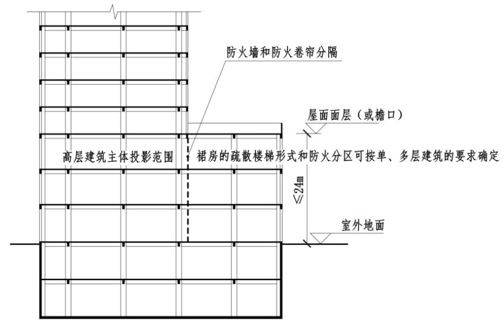

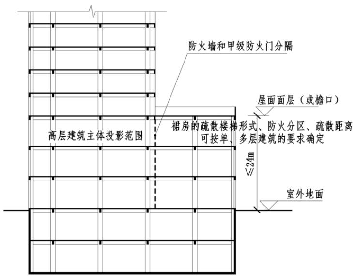

附图1.5.2 裙房的疏散楼梯形式和防火分区

〔说明〕局部修订，上半条要求的“防火墙”可按照本《指南》第 1.1.6 条要求采 用防火卷帘。 

1.5.3 除住宅与其他使用功能建筑合建以外的多种功能组合的高层公共建 筑下部的附属部分，当同时符合下列 1~3 款规定时，主体建筑与附属部分 的安全疏散和消防电梯设置可根据各自的高度分别按规范执行；当附属部 分同时符合下列 1~4 款规定时，主体建筑与附属部分的安全疏散、消防电 梯和防火分区的设置可根据各自的高度分别按规范执行：（附图1.5.3） 

1 与主体建筑相连且建筑高度不大于 $2 4 \mathrm { m }$ ； 

2 与主体建筑的疏散完全独立； 

3 与主体建筑之间采用不开设门窗洞口（通风井道井壁不得开口，强、 弱电、给排水管井井壁检修门采用甲级防火门）及无通风管道穿越的防火 墙和不开设洞口（消防电梯井、上下管道井除外）且耐火极限不低于2.50h 的楼板分隔； 

4 与主体建筑相接处外墙上、下层开口之间的实体墙高度和两侧的门、 窗、洞口最近边缘之间的实体墙宽度均不应小于 $4 \mathrm { m }$ 。 

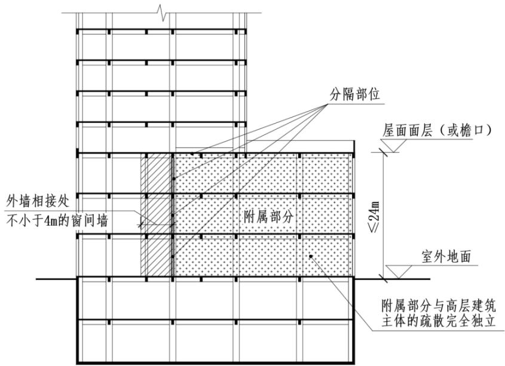

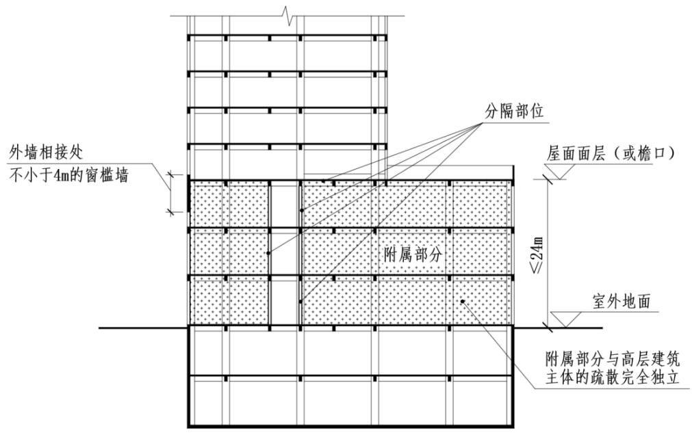

附图1.5.3 多种功能组合的高层建筑下部的附属部分

1.5.4 符合本《指南》第1.5.3 条的多种功能组合的高层公共建筑下部的附 属部分内符合该条第 2~3 款的区域，可根据疏散楼梯的服务高度确定该疏 散楼梯间的形式；符合该条第 2~3 款的建筑地下、半地下室区域，可作为 地下附属部分，其安全疏散和消防电梯设置可根据自身埋深按规范执行。 

〔说明〕新增条文。本条所述的区域或附属部分，在计算服务高度或自身埋深时， 均应从首层疏散出口的标高算起。 

# 第二章 总平面布局

# 2.1 消防车道与消防车登高操作场地

2.1.1 按《建筑防火通用规范》第 3.4.2 条及第 3.4.3 条要求设置消防车道 的建筑，其消防车道距离建筑外墙不宜小于 $5 \mathrm { m }$ 、不应大于 $3 0 \mathrm { m }$ ，距离最不 利防火分区的主要出入口不应大于 $6 0 \mathrm { m }$ ；对于其余建筑，其可供消防车通 行的道路距离最不利防火分区（住宅的最不利单元）的主要出入口不应大 于 $8 0 \mathrm { m }$ 。 

贴邻建筑的 $5 \mathrm { m }$ 范围内不应布置架空线路和影响消防车操作的障碍物。 

消防救援路径上不应设置影响救援的绿化、水面、挡墙等障碍物，救 援路径总长度应符合本条对距离的要求。（附图2.1.1） 

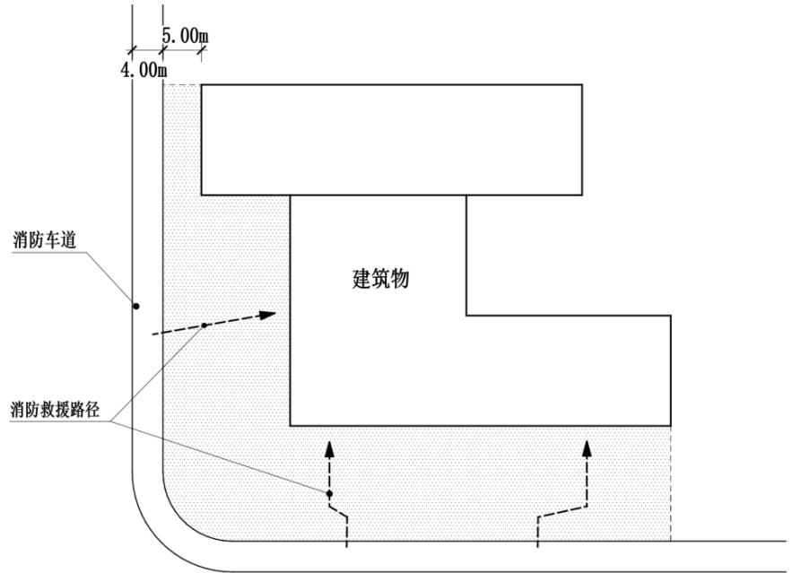

附图2.1.1 消防车道与建筑之间的障碍物

〔说明〕修订部分文字。《建筑防火通用规范》第 3.4.3 条中“占地面积大于 3000 ㎡”指的是单幢公共建筑的占地面积，通过仅用于人员通行的连廊相连的多幢建筑可分 别计算各自的占地面积；占地面积不大于 3000 ㎡的其他单多层公共建筑的消防车道的 设置，可按本条执行。 

# 2.1.2 住宅建筑的消防车道应沿长边方向设置。

建筑高度不大于 $2 7 \mathrm { m }$ 的住宅建筑，消防车道距离最不利单元主要出入 口的消防救援路径长度不应大于 $6 0 \mathrm { m }$ ；当沿建筑短边同时设有消防车道时， 可按短边方向的消防车道距离最不利单元主要出入口的消防救援路径长度 

不大于 $4 0 \mathrm { m }$ 控制，同时长边方向的消防车道距离最不利单元主要出入口的 消防救援路径长度不应大于 $8 0 \mathrm { m }$ 。（附图 2.1.2) 

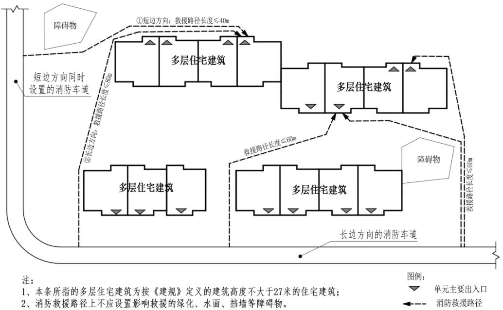

附图2.1.2 多层住宅消防车道设置要求

〔说明〕新增条文，明确住宅建筑消防车道设置要求。高层住宅建筑的消防车道应 沿长边方向设置，住宅的长边是指能救援更多的住户所对应的建筑立面。 

2.1.3 高层、多层建筑的消防车道转弯半径应分别不小于 $1 2 \mathrm { m }$ 、 $9 \mathrm { m }$ ，可采 用作图法进行校核。（附图2.1.3） 

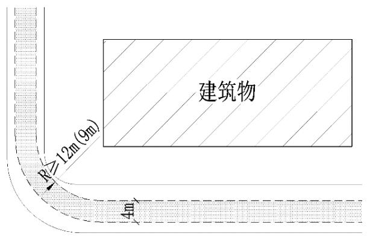

附图2.1.3 消防车道转弯半径

2.1.4 丁字形，Y 字型等满足消防车回车要求的不规则场地可作为消防回 车场地；丁字形，Y字型场地从交叉点起算的车道长度不应小于 $1 2 \mathrm { m }$ 。（附 图 2.1.4） 

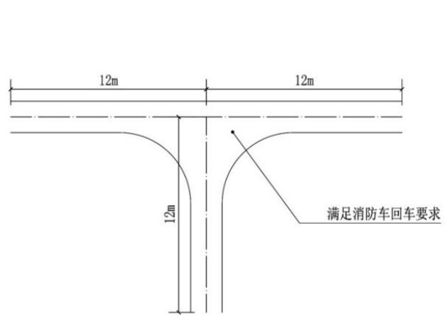

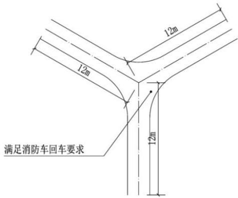

附图2.1.4 不规则的消防回车场地

〔说明〕调整行文表述，内容和要求不变。

# 2.1.5 消防车道、消防车登高操作场地应采用硬质铺装面层；在满足消防 车道、消防车登高操作场地承载能力的硬质基层上方可铺设塑胶面层。

消防车登高操作场地应采用明显标识。 

消防车道沿途标志和标线标识应按本《指南》第2.1.11条执行。 

〔说明〕补充明确场地要求。 

# 2.1.6 高层建筑消防车登高操作场地的设置应符合下列规定：

1 消防车登高操作场地的总长度不应小于高层主体的长边长度；消防 车登高操作场地对应建筑立面两侧各延伸不大于 $1 5 \mathrm { m }$ 范围为消防登高操作 面；消防车登高操作场地应与消防登高操作面对应，登高操作场地之间应 通过消防车道连通； 

2 确有困难时，消防车登高操作场地可分段设置，消防登高操作面可 不连续，但应保证主登高操作面连续，且主登高操作面的长度不应小于长 边长度的1/2；（附图2.1.6-1、2.1.6-2、2.1.6-3） 

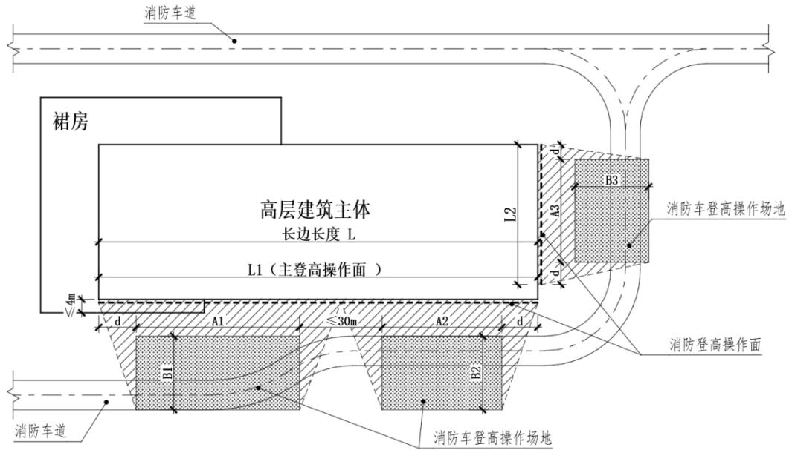

注：(1) $\mathbf { d } { \leqslant } 1 5 \mathbf { m }$

(2) $\mathtt { A 1 + A 2 + A 3 } \ \geqslant \ \mathtt { L }$ ，L1 ≥ 0.5L;

（3）A1～A3、B1～B3的尺寸应符合规范最小尺寸的规定;

附图 2.1.6-1 

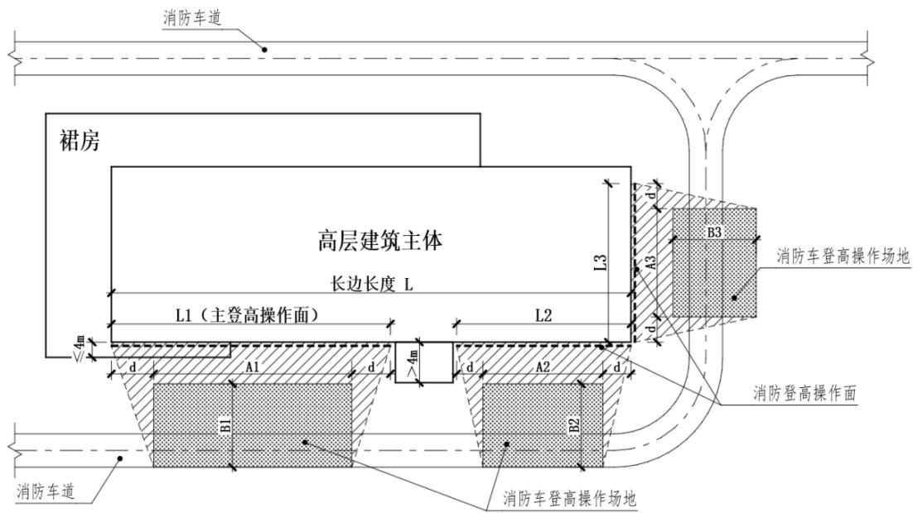

注：(1) $\mathsf { d } \leqslant 1 5 \mathrm { m }$

(2) $\mathrm { A } 1 ~ + ~ \mathrm { A } 2 ~ + ~ \mathrm { A } 3 ~ \geq ~ \mathrm { L }$ 且L1 ≥0.5L;

(3) $\mathsf { A 1 } \sim \mathsf { A 3 }$ 、B1～B3的尺寸应符合规范最小尺寸的规定；

附图 2.1.6-2

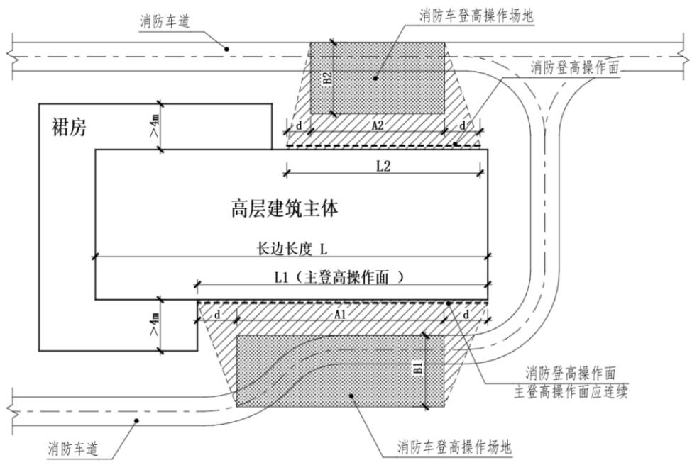

注：(1) $\mathsf { d } \leqslant 1 5 \mathsf { m }$ ;

(2)A $1 ~ + ~ { \tt A } 2 ~ \geq ~ { \tt L }$ 且L1 ≥0.5L;

(3) $\mathsf { A } 1 \sim \mathsf { A } 2$ 、B1～B2的尺寸应符合规范最小尺寸的规定；

附图 2.1.6-3

3 各段消防车登高操作场地的最小尺寸、场地坡度及其与建筑外墙的 距离均应符合规范的规定；消防登高操作范围内不应有高度大于5m的高大 树木等影响消防救援的障碍物； 

4 高层住宅建筑的消防车登高操作场地可按照住宅各个单元连续布 置；高层住宅建筑端头底部设置商业服务网点和按商业服务网点要求设置 的、总高度（建筑层高之和）不超过 $7 . 8 \mathrm { m }$ 的变配电房、垃圾房等住宅配套 用房时，当其与住宅的交接部位长度不大于 $1 0 \mathrm { m }$ 且消防车登高可到达至该 单元的楼梯间或每户时，该住宅可视作满足消防车登高操作场地的设置要 求；（附图2.1.6-4）消防车登高操作场地满足回车场要求时，可不设置穿 过建筑物的消防车道。 

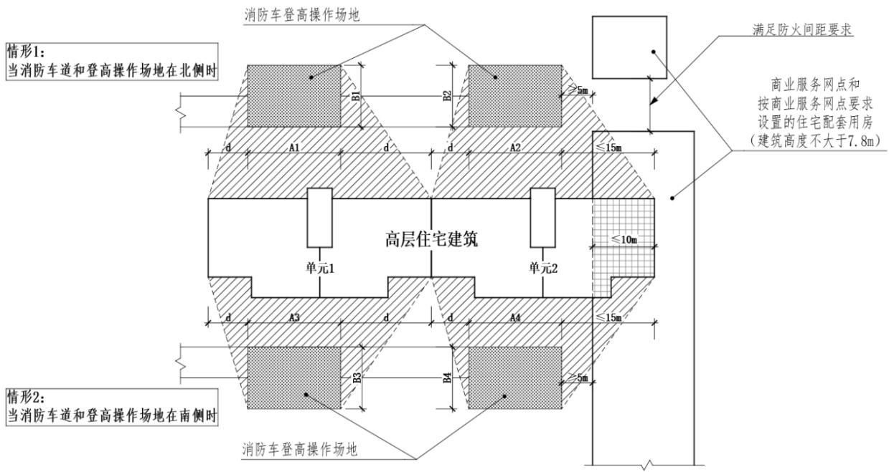

注：（1）d≤15m; （2）A1～A4、B1～B4的尺寸应符合规范最小尺寸的规定；

附图 2.1.6-4

〔说明〕修订条文，明确高层建筑（包括工业建筑和民用建筑）的登高操作场地和 消防登高操作面的要求。本条第4款的情况下住宅单元的数量不宜过多、建筑长度不宜 超过 $1 5 0 \mathrm { m }$ ，避免因不设穿过的车道而影响消防救援到达、展开救援。 

2.1.7 建筑物与消防车登高操作场地相对应的范围，即消防车登高操作场 地及其两侧 $1 5 \mathrm { m }$ 对应的建筑外立面范围内，应设置直通室外的疏散楼梯或 直通楼梯间的入口，入口可为通往楼梯间的门厅、走道。（附图2.1.7） 

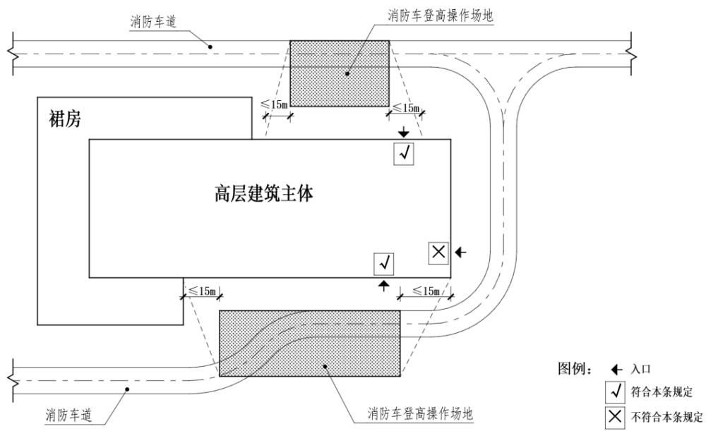

附图 2.1.7

〔说明〕部分文字调整，新增附图。 

2.1.8 消防车登高操作场地的设置应能满足消防登高车可以覆盖到工业建 筑、公共建筑设置的消防车登高操作场地对应的每个消防救援口。 

〔说明〕住宅建筑的救援口设置按本《指南》第2.2.4条的要求。 

2.1.9 《建筑设计防火规范》第7.2.2条第1款规定的“车库出入口”不包括非 机动车出入口。消防车登高操作场地与登高操作面的建筑外墙之间不应设 置汽车库（坡道）出入口。当设有在建筑投影范围内的汽车库（坡道）出 入口时，建筑外墙与消防车登高操作场地的距离不应小于6m，用于汽车疏 散且不应影响消防车的通行；汽车库（坡道）出入口两侧应设置长度不小 于6m的不开设门窗洞口的防火墙，汽车库坡道应设置自动喷水灭火系统， 汽车库应设置排烟设施，且坡道出入口应设置高度不小于 $1 . 0 \mathrm { m }$ 的挡烟垂壁。 （附图2.1.9） 

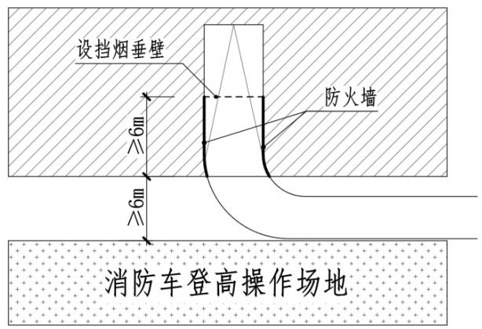

附图2.1.9 建筑投影范围内的汽车库（坡道）出入口

〔说明〕修订部分文字和附图，避免歧义。明确汽车库应设置排烟设施，且不利用 坡道排烟。 

2.1.10 消防车登高操作场地原则上应设置在用地红线内，如设置在红线外 时，应征得相关主管部门的书面认可，还应确保登高操作场地范围与建筑 之间无高大乔木、行道树及架空线路等影响登高操作的障碍物。 

〔说明〕调整部分文字表述。消防车道布置确有困难时，可利用基地周边的城市道 路。 

2.1.11 消防车道沿途标志和标线标识 

新建公共建筑及住宅建筑场地内的消防车道应设置沿途标志和标线标 识，并符合下列规定： 

1 在消防车道两侧的侧缘石立面和顶面应施划黄色禁止停车标线。 

2 无侧缘石的道路应当在路面上施划禁止停车标线，标线为黄色单实 线，距路面边缘 $3 0 \mathrm { c m }$ ，线宽 $1 5 \mathrm { c m }$ 。 

3 消防车道沿途在路面中央施划黄色方框线（不得与消防车登高操作 面划线重叠），在方框内沿行车方向标注内容为“消防车道 禁止占用”的警 示字样。黄色方框线长宽不小于 $2 . 0 \mathrm { m } { \times } 1 . 5 \mathrm { m }$ （若受条件限制，无法满足醒 目度要求，应按4∶3 比例加大标志的尺寸）。标识间隔距离，可结合小区 消防车道实际情况设置，但应保持视觉连续，无视觉盲区。 

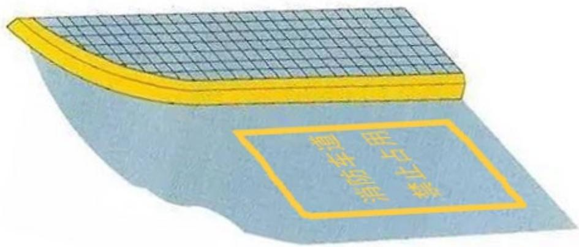

附图2.1.11-3：消防车道路侧禁停标线及路面警示标志示例

4 场地内的消防车道出入口路面，按照消防车道净宽施划禁停标线， 标线为黄色网状实线，外边框线宽 $2 0 \mathrm { c m }$ ，内部网格线宽 $1 0 \mathrm { { c m } }$ ，内部网格 线与外边框夹角 $4 5 ^ { \circ }$ ，标线中央位置沿行车方向标注内容为“消防车道 禁止 占用”的警示字样。禁停标线长宽不小于 $2 . 0 \mathrm { m } { \times } 1 . 5 \mathrm { m }$ （若受条件限制，无法 满足醒目度要求，应按4∶3 比例加大标志的尺寸）。 

附图2.1.11-4：消防车道出入口禁停标线及路面警示标志示例

5 场地内的消防车道出入口处应设置醒目的警示标牌，提示严禁占用 消防车道，违者将承担相应法律责任等内容。警示标牌长宽不小于 $1 . 0 \mathrm { m } { \times } 0 . 6 \mathrm { m }$ （若受条件限制，无法满足醒目度要求，应按 5∶3 比例加大标 志的尺寸），底边离地高度不低于 $2 . 0 \mathrm { m }$ 。 

附图2.1.11-5：消防车通道禁止占用警示牌示例

6 住宅区内实行人车分流的区域，可仅按第5款设置警示标牌。 

# 2.2 消防救援口

2.2.1 厂房、仓库和商店建筑的每个防火分区至少应设置两个直通走道、 公共区域（可利用公共卫生间、楼梯间及前室的开口）或大空间区域的消 防救援口。（附图2.2.1-1） 

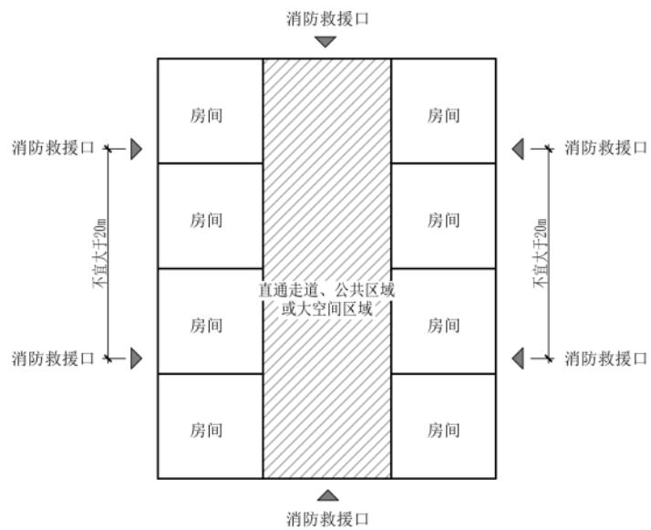

附图 2.2.1-1

当确有困难时，不靠外墙的防火分区，至少应设置两个通向相邻设有 消防救援口防火分区的走道、公共区域或大空间区域的连通口（此连通口 

不得采用防火卷帘）。（附图2.2.1-2） 

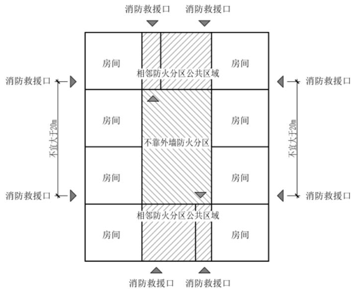

附图 2.2.1-2

〔说明〕合并《指南（2020版）》第2.2.2条至本条。需要注意的是，消防救援口 应沿建筑外墙周圈设置，并非仅需设置在消防登高操作场地侧。 

# 2.2.2 消防救援口尺寸应按不小于 $1 . 0 \mathrm { m } { \times } 1 . 0 \mathrm { m }$ 或 $0 . 8 \mathrm { m }$ （净宽度 $\mathrm { w } ) \times 1 . 4 \mathrm { m }$ （净高度h）设计。

〔说明〕新增条文。门或窗作为救援口时，均可按本条净尺寸设计。救援口净尺寸 范围内，不应有门框、窗框、栏杆等影响救援进入的构件。当门作为消防救援口，尺寸 应为门 $9 0 ^ { \circ }$ 开启后的净宽和净高。 

# 2.2.3 各类建筑物各层直通室外的门、窗或设有门、窗的敞开外廊、阳台 可以作为消防救援口使用。每个商业服务网点的各层均应设消防救援口。

〔说明〕本条为《指南（2020版）》第2.2.4条的内容调整个别文字。 

# 2.2.4 住宅建筑每户应设置消防救援口。当设有消防车登高操作场地时， 应在外墙适当位置设置可供消防救援人员进入的消防救援口，并应与场地 相对应。（附图 2.2.4-1、2.2.4-2）

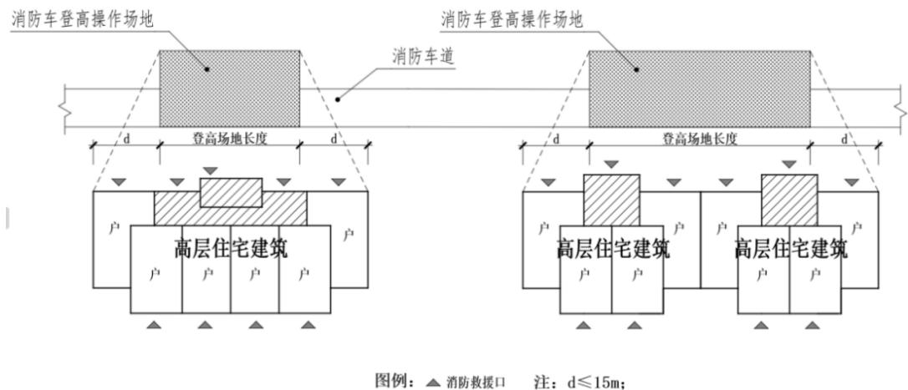

附图2.2.4-1 高层住宅建筑救援口设置（1）

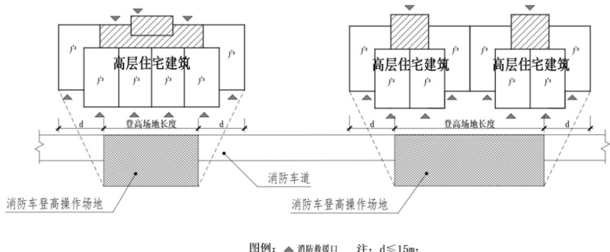

附图2.2.4-2 高层住宅建筑救援口设置（2）

〔说明〕本条为《指南（2020版）》第2.2.3 条的内容进行修订，明确住宅建筑消 防救援口的设置要求。 

# 2.3 防火间距

2.3.1 相邻两座建筑之间通过设置防火墙以满足防火间距不限的条件时， 当两座相邻建筑形成夹角小于 180 度时，最近的门窗洞口间距不应小于相 应的防火间距要求；当两座相邻建筑形成夹角不小于 180 度时，紧靠防火 墙两侧的门、窗、洞口之间最近边缘的水平距离应不小于 $2 \mathrm { m }$ 。（附图 2.3.1） 

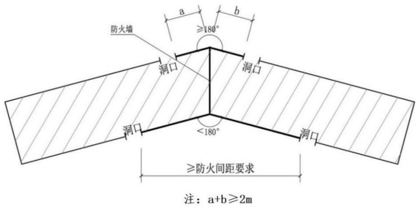

附图 2.3.1

〔说明〕本条明确的是缩小间距时的问题。当需要界定为两幢建筑而缩小建筑规模 时，两部分建筑结构应断开，且交界处的防火墙应为两道。 

# 2.3.2 一、二级耐火等级的建筑屋顶和地下室顶板上设置采光、自然通风、 自然排烟等开口时，应符合下列规定：

1 当为自然排烟口以及未采取防火分隔措施的采光、自然通风开口时， 该开口与上部建筑开口之间的直线距离不应小于6m，且水平距离不应小于 $4 \mathrm { m }$ ；当采光、自然通风开口部位设置固定防火玻璃顶或火灾时自动关闭的 甲级或乙级防火窗（与所在顶板的耐火极限要求匹配）或与所在顶板耐火 极限要求匹配的防火玻璃顶时，该开口与上部建筑开口之间的距离不限； （附图 2.3.2-1） 

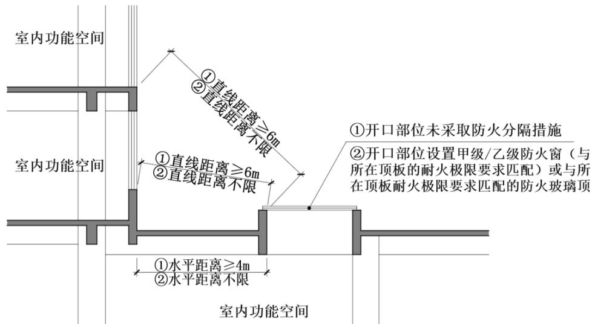

注：图中①②两种情况和要求分别对应

附图 2.3.2-1

2 当上部建筑开口设置乙级防火窗或特级防火卷帘等防火分隔措施 时，该开口与上部建筑开口之间的距离不限；（附图2.3.2-2） 

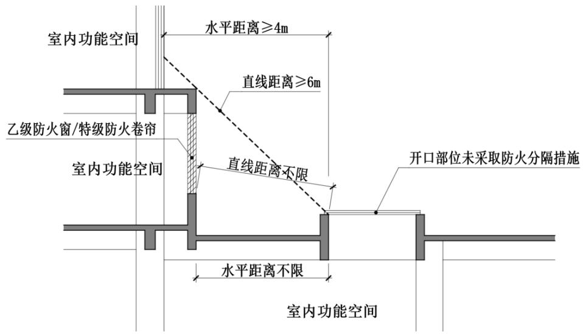

附图 2.3.2-2

3 屋顶或地下室顶板上开设多个开口时，分属不同防火分区的开口间 最近水平距离按 $2 \mathrm { m }$ 控制；距离不足时，开口应按本条第2款设置防火分隔 措施； 

4 当采光、自然通风、自然排烟开口为侧向开口且背向建筑物时，其 与上部建筑的距离可不限（参照本《指南》第2.3.3 条附图2.3.3-1所示）， 此时开口与两侧相邻房间开口的水平距离应符合规范有关相邻房间在外墙 上开口距离的规定； 

5 对于住宅建筑，本条“上部建筑开口”为上部其他户的开口。 

〔说明〕修订条文，更新附图；细化与上部建筑开口的间距和防火分隔措施要求。 本条有关屋顶或地下室顶板上开设的开口或管井的规定，主要是从防止火灾蔓延角度的 要求，地下车库、地下室有污染性的排风口等的设置，尚应符合现行国家相关标准的规 定。 

# 2.3.3 一、二级耐火等级的建筑屋顶和地下室顶板上设置机械通风、机械 排烟管井开口时，应符合下列规定：

1 当机械通风、机械排烟开口背向建筑物时，其与上部建筑的距离可 不限；此时，通风开口与同方向立面两侧相邻房间开口的水平距离也可不 限，排烟开口与同方向立面两侧相邻房间开口的水平距离不应小于1m；开 口在外墙交接部位均应采取防火封堵措施；（附图2.3.3-1） 

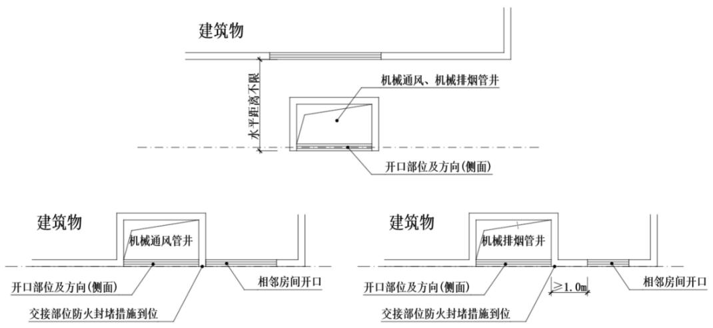

附图 2.3.3-1

2 机械排烟开口不宜面向建筑，当确有困难，排烟开口面向建筑物时， 其与上部建筑开口之间的直线距离不应小于 6m，且水平距离不应小于 $4 \mathrm { m }$ ； （附图 2.3.3-2） 

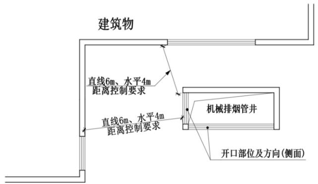

附图 2.3.3-2

3 当机械通风（不含排烟）的风机设置在机房（含吊装机房）内、自 风机房至管井通风开口的风管采用耐火极限不低于 1.00h 的防火风管且风 管上设有 $7 0 \mathrm { { } ^ { \circ } C }$ 防火阀（耐火极限不低于 $1 . 5 \mathrm { h } )$ ）时，该机械通风（不含排烟） 开口与上部建筑开口的水平距离可不限。当防火分隔措施不符合本款规定 时，应按本条第2款的距离控制。（附图2.3.3-3） 

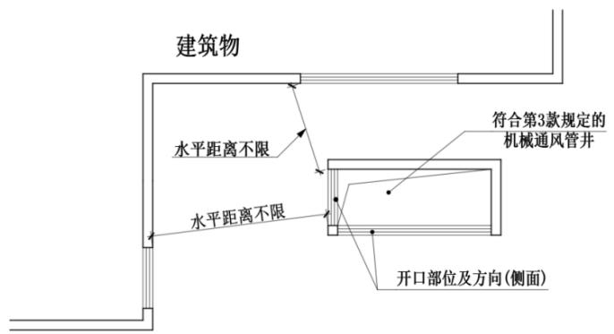

附图 2.3.3-3

本条所述距离可不限的情况中，当机械通风开口两侧相邻开口为疏散 楼梯间或各类前室的开口时，尚应按《建筑防火通用规范》第7.1.8 条第8 款的规定控制。 

〔说明〕在原条文的基础上，补充、完善了建筑屋顶和地下室顶板上开设排烟、进 风、排风开口时的相应间距要求。本条有关屋顶或地下室顶板上开设的开口或管井的规 定，主要是从火灾蔓延角度的要求，地下车库、地下室有污染性的排风口等的设置，尚 应符合现行国家相关标准的规定。 

2.3.4 当地下汽车库、非机动车库的坡道出入口不作为排烟口使用时，坡 道出入口与上部建筑物的距离可不限；但当属于本《指南》第2.3.5 条规定 的情况时，应按该条的规定执行。 

〔说明〕调整部分文字表述。 

2.3.5 地下汽车库与托儿所、幼儿园、中小学校的教学楼、老年人建筑、 病房楼等组合建造时，应符合下列要求： 

1 汽车库与上部建筑应采用耐火极限不低于 2.00h 的楼板完全分隔； 

2 疏散楼梯应分别独立设置，可按照附图2.3.5 执行； 

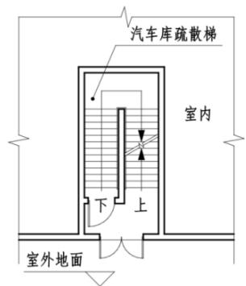

X

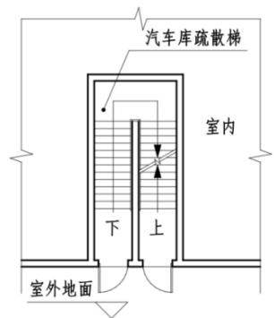

<

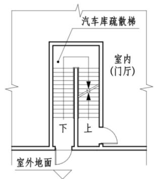

<

附图2.3.5 疏散楼梯独立设置

3 汽车库的开口部位（楼梯间开口除外）与组合建造的上部建筑的外 墙开口之间的直线距离不应小于6m（且水平距离不应小于4m）； 

4 上部建筑的电梯可通至地下汽车库，但应设候梯厅并采用耐火极限 不低于3.00h 的防火隔墙和甲级防火门分隔，不得采用防火卷帘替代。 

〔说明〕修订附图。根据实际情况明确电梯可通至地下车库。 

2.3.6 下沉式广场、庭院等室外开敞空间，仅作为绿化景观、人员通行使 用时，该空间顶部开口与上部建筑物的距离可不限，但应符合下列规定： 

1 该空间周围外围护结构按建筑外墙的要求设计，外墙的上、下层开 

口间实体墙高度应符合《建筑设计防火规范》第6.2.5 条的规定； 

2 该空间四周外墙上门、窗开口（设置防火卷帘或防火门、窗的除外） 的最低底边的埋深高度 h 和下沉空间短边长度 L 的尺寸控制，应符合下列 规定： 

（1）当 $\mathrm { h } { \leqslant } 6 \mathrm { m }$ 时，短边长度 L 不应小于 h； 

（2）当 $_ { \mathrm { h } > 6 \mathrm { m } }$ 时，短边长度 L 不应小于 0.75h 且不应小于 6m；（附 图 2.3.6） 

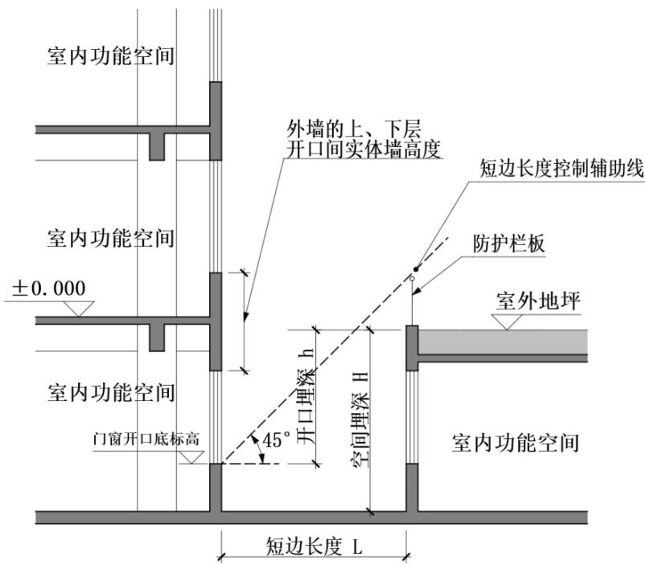

附图 2.3.6

3 当该空间四周设置房间，且属于不同防火分区时，其内转角两侧外 墙上的普通门、窗、洞口之间最近边缘的水平距离不应小于 $4 \mathrm { m }$ ，相对两翼 外墙上的普通门、窗、洞口之间的距离还应符合按空间埋深H确定的建筑高 度相应的防火间距要求。 

〔说明〕修订条文内容，明确下沉式广场、庭院的设置要求，以满足该下沉空间作 为采光、通风开口的功能。附图中防护栏板为透空栏杆时，短边长度控制辅助线可控制 至栏杆底部实体位置。第3款当空间埋深H超过 $2 4 \mathrm { m }$ 时，间距不应小于 $1 3 \mathrm { m }$ 。 

2.3.7 设置在建筑周边，用于停放小型机动车的沿地面道路设置的停车位， 可不按地面停车场认定，但应满足以下要求：（附图2.3.7） 

1 停车位应分组布置，每组的停车数量不应超过5 辆，组与组之间的 防火间距应大于6m； 

2 停车位的布置不应影响消防救援，每个消防救援口对应的6m范围 

内不得布置停车位； 

3 与道路对侧的小型车停车位的间距应大于 6m。 

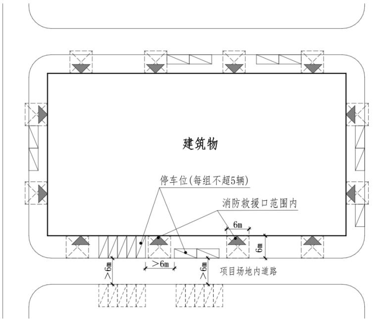

附图 2.3.7

〔说明〕修订条文内容并更新附图。 

2.3.8 住宅小区地面配套的小型机动车停车位除可按本《指南》第2.3.7 条 布置外，还可采用沿小区道路单排布置的方式，单排停车数量可不限，可 不按地面停车场认定，但其道路正对面不应再布置其他机动车停车位。（附 图 2.3.8） 

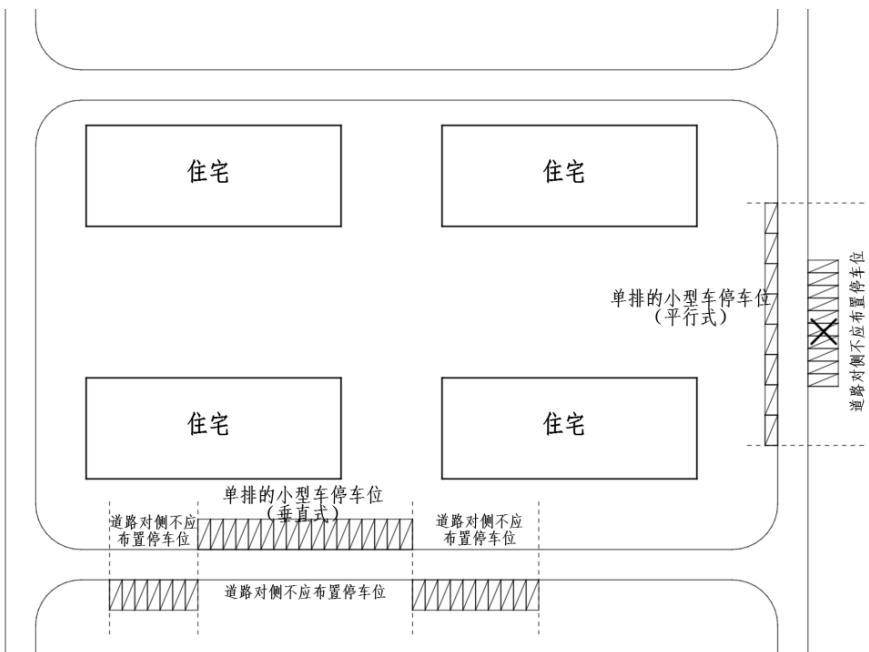

附图 2.3.8

〔说明〕条文内容修订，附图更新。 

2.3.9 屋顶停车场的汽车坡道按地上汽车库要求设置。 

2.3.10 有围护结构的地面机械车库应按汽车库控制防火间距；无围护结构 的机械式停车装置，高度 $1 0 \mathrm { m }$ 及以下的可按停车场控制防火间距，高度 $1 0 \mathrm { m }$ 以上的与一、二级耐火等级建筑的防火间距不应小于 $1 0 \mathrm { m }$ ，当相邻建筑外 墙为无门窗洞口的防火墙或比最高停车部位高 $1 5 \mathrm { m }$ 范围以下的外墙为无门 窗洞口的防火墙时，防火间距可不限。 

〔说明〕根据《汽车库、修车库、停车场设计防火规范》第 4.2.3 条及条文说明， 补充明确防火间距要求。 

2.3.11 供教学、科研的高层建筑中的实验室日常使用的少量甲、乙类气体 的储藏间，可贴邻建筑设置，但应满足以下要求： 

1 当充气压力不大于15 MPa时，甲、乙类气体的总储存量不应大于 $0 . 2 4 ~ \mathrm { m } ^ { 3 }$ ； 

2 存放可燃气体储罐的储藏间，应设置在建筑的首层靠外墙部位且应 采用耐火极限不低于 3.00h 的不开设门窗洞口的防火隔墙、耐火极限不低 于2.50h的楼板与建筑的其他部分分隔；门应直接开向室外。 

〔说明〕明确充气压力。 

2.3.12 建筑、构筑物和设备设施与明火散发地点的防火间距应按产生明火 的固定点进行控制。 

2.3.13 当相邻建筑通过连廊、天桥或底部的建筑物等连接时，其间距不应 小于两个建筑防火间距的要求，连廊、天桥宽度不宜大于 $6 . 0 \mathrm { m }$ ；当连廊、 天桥为封闭时，应设置防火分隔措施。两个连廊或天桥之间的距离不应小 于 $6 . 0 \mathrm { m }$ 。 

2.3.14 多层住宅建筑在建筑外侧加建电梯时，当电梯井道未采用耐火极限 不低于 $2 . 0 0 \mathrm { h }$ 的隔墙时，电梯井道距离原建筑（敞开楼梯间除外）两侧门、 窗、洞口最近边缘的水平距离不应小于 $1 . 0 \mathrm { m }$ 。 

〔说明〕明确当电梯井道采用玻璃幕墙等不满足耐火极限要求的围护结构时的要求。 

2.3.15 同一座回字形、U型、L型公共建筑两翼属于不同防火分区时，其 内转角两侧墙上的门、窗、洞口之间最近边缘的水平距离不应小于 $4 . 0 \mathrm { m }$ ， 回字形公共建筑相对的两翼距离应符合防火间距要求，U 型公共建筑相对 的两翼的防火间距不应小于 $6 . 0 \mathrm { m }$ ，确有困难，可在两窗之间“U”形底边 

处设置垂直防火隔墙（耐火极限不应低于1.00h），该隔墙的外端应与相对 的两个窗的最外边平齐。（附图2.3.15） 

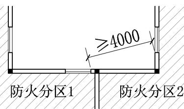

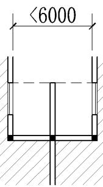

附图2.3.15 不同防火分区U型、L型公共建筑防火间距

2.3.16 当建筑高度大于 $2 4 \mathrm { m }$ 时，回字形公共建筑相对的两翼属于同一防 火分区时，相对的两翼最近的门、窗、洞口间距应不小于按照内天井的空 间高度确定的相应防火间距要求。（附图2.3.16） 

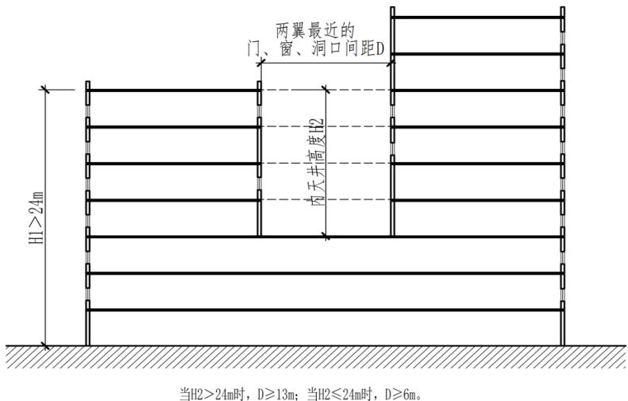

附图2.3.16 同一防火分区回字形公共建筑防火间距

2.3.17 住宅建筑的形体内凹处和各层天井（含天井底部）均应设置成U型 外敞天井（以下简称U型天井），并应符合下列规定： 

1 U型天井内天井宽度A和开口宽度B宜对应设置，尺寸计算和控 制应符合： 

（1）当 $\mathrm { A } < 2 \mathrm { m }$ 时， $\mathbf { B } \geqslant \mathbf { A }$ 

（2）当 $2 \mathrm { m } { \leqslant } \mathbf { A } { < } 1 2 \mathrm { m }$ 时， $\mathrm { B } { \geqslant } 0 . 8 \mathrm { A }$ 且 $\geqslant 2 \mathbf { m }$ ；若计算得到的 $\mathrm { B } { > } 6 \mathrm { m }$ 时， B 可取 $6 \mathrm m$ ； 

（3）当 $\mathrm { A } \geq 1 2 \mathrm { m }$ 时， $\mathrm { B } { > } 0 . 5 \mathrm { A }$ 

当A、B未对应设置时，可采用作图法控制开口宽度：绘制宽度为 B 的 内接矩形，线段 ab 应在U型天井上空范围内，线段 bc 与 ad 不应与外 墙相交；（附图 2.3.17-1） 

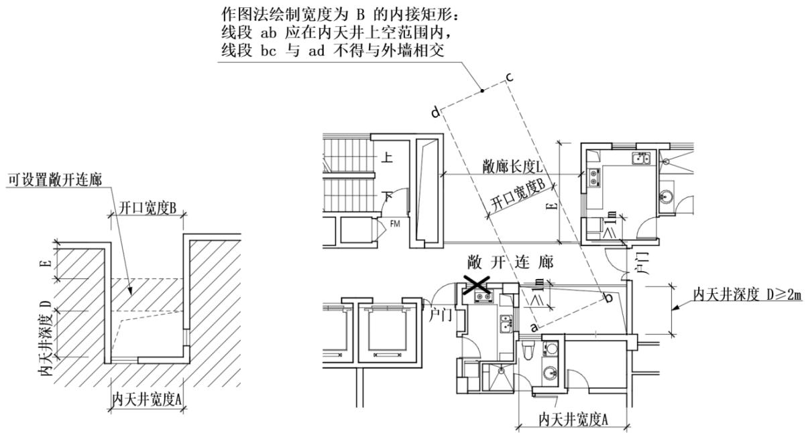

附图 2.3.17-1

2 U型天井内如需设置连廊时，应为内外两侧敞开的连廊（以下简称 敞廊）；该敞廊兼作前室或者合用前室时，与疏散无关的门、窗不得直接 开向敞廊；开向天井的门窗洞口距离敞廊不得小于 $1 . 0 \mathrm { m }$ ；敞廊内侧的内天 井深度D不应小于 $2 . 0 \mathrm { m }$ ；开向敞廊的户门数量可超过3樘； 

3 U型天井内天井宽度A和内天井深度D的尺寸计算和控制应符合： 

（1）U型天井敞廊外侧部分深度计为E，当E大于 $3 . 0 \mathrm { m }$ 时，超出 $3 . 0 \mathrm { m }$ 的深度值应计入下列（2）~（4）式中的D值； 

（2）当 $\mathrm { A } { \leqslant } 3 \mathrm { m }$ 时， $\mathrm { D } { \leqslant } \mathbf { A }$ ； 

（3）当 $3 \mathrm { m } { < } \mathrm { A } { \leqslant } 6 \mathrm { m }$ 时， $\mathrm { D } { \leqslant } 2 \mathrm { A } { - } 3$ ； 

（4）当 $\mathrm { A } > 6 \mathrm { m }$ 时， $\mathrm { D } { \leqslant } 1 . 5 \mathrm { A }$ ； 

（5）当U型天井仅用于卫生间采光通风时，D值不限； 

4 当住宅建筑的2个安全出口（疏散楼梯）分散设置距离不小于5m 且敞廊长度L不小于 $4 \mathrm { m }$ 时，之间连通的敞廊上可不设防火门，可不按照 三合一前室考虑；（附图2.3.17-4） 

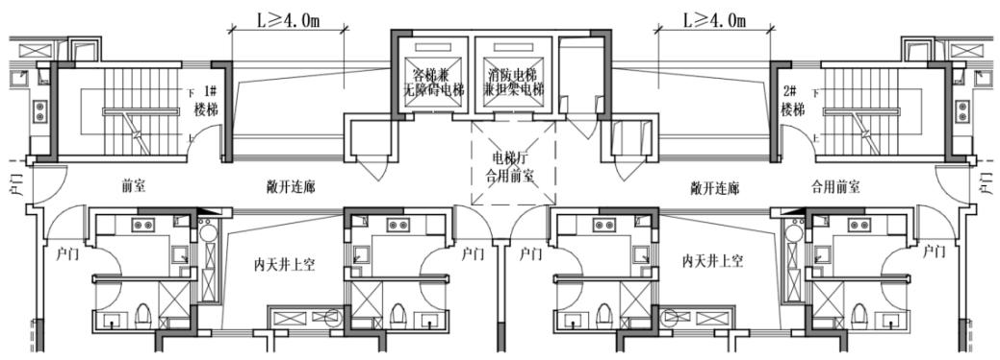

附图 2.3.17-4

5 U型天井顶部不应设置封闭顶盖；确需设置防雨顶盖时，防雨顶盖 不应封闭，四周开口部位应均匀布置，开口的面积不应小于U型天井被遮盖 部分水平断面面积的 $50 \%$ ，且开口高度不应小于 $1 . 0 \mathrm { m }$ ；开口设置百叶时， 百叶开口的有效排烟面积不应小于开口部位面积的 $60 \%$ ； 

6 敞廊的立面透空面积比率不应小于 $50 \%$ ，计算方法见附图2.3.17-6； 当柱宽不大于 $0 . 6 \mathrm { m }$ 可不考虑遮挡，但应考虑设置在敞廊处的空调室外机对 敞开率的影响； 

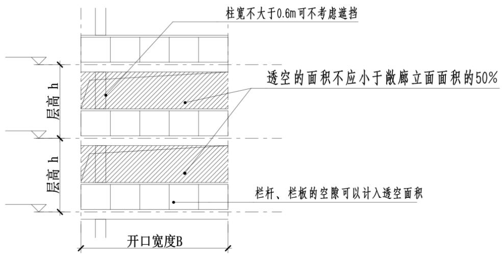

(1)当B $< 6 , 0 \mathrm { { r } }$ m时，透空面积比率s $=$ 透空面积／ $\mathbf { \Omega } ( \mathbf { B } \ \times \ \mathbf { h } )$

（2）当 $\mathtt { B } \geqslant 6 , 0 \mathtt { n }$ 时，透空面积比率s=透空面积／ $( 6 . 0 ~ \times ~ \mathrm { ~ h ~ }$

附图 2.3.17-6

7 当两个以上U型天井的内天井连通时，每段开口对应的内天井应分 别计算和控制，满足本条的规定；（附图2.3.17-7） 

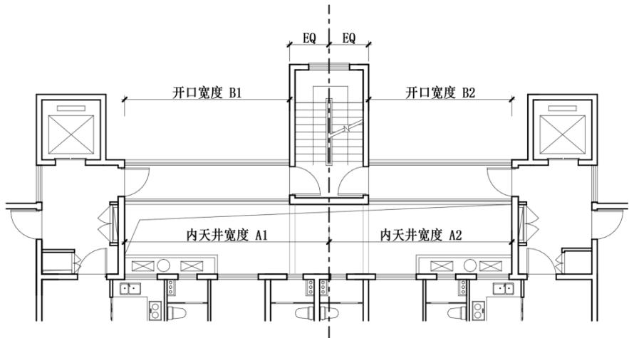

附图 2.3.17-7

8 开向 U 型天井的窗的耐火完整性均不应低于 1.00h。 

〔说明〕修订条文内容及附图，加强对住宅 U 型天井的设置要求。U 型天井是一 种建筑布局形式，当其中设置敞开连廊后，则形成了U型天井的内天井。 

第4款的情况，不论敞廊上是否设置防火门，前室（含合用前室）防烟系统的设计 仍应符合规范的规定。 

第5款中，U型天井地面面积和U型天井水平断面面积不一致时，应取较大值。 

第8款提高了窗的耐火完整性要求。通常情况下当住宅户内没有人时，关窗的概率 比较大；有人时，在火灾情况下可手动关窗。 

2.3.18 符合本《指南》第2.3.17 条的住宅建筑U型天井，内天井部位可设 置不超过2 处且宽度不大于 $1 . 2 \mathrm { m }$ 的不燃性挑板或设备平台；同时应满足内 天井宽度A和内天井深度D，在设置挑板（设备平台）的方向扣除挑板（设 备平台）宽度后净尺寸不小于 $2 . 0 \mathrm { m }$ 。（附图 2.3.18） 

当 $\mathrm { A } { > } 6 . 0 \mathrm { m }$ 时，可设置 3 处挑板（设备平台）。当挑板（设备平台） 的轮廓与敞廊的间距小于 $1 . 0 \mathrm { m }$ 时，其与敞廊间应设置耐火完整性不低于 1.00h的防火分隔措施。 

作图法绘制宽度为B 的内接矩形： 线段 ab 应在内天井上空范围内， 线段 bc 与 ad 不得与外墙相交 

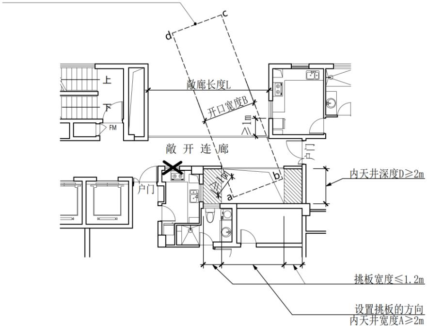

作图法绘制宽度为 B 的内接矩形; 线段 ab 应在内天井上空范围内， 线段 bc 与 ad 不得与外墙相交 

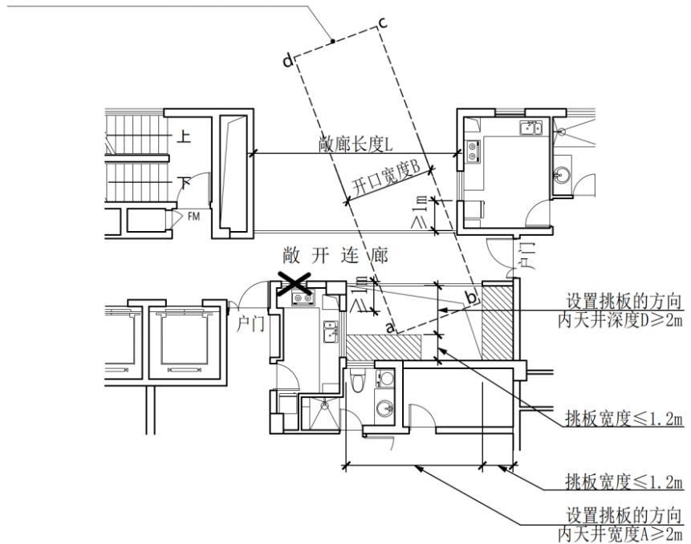

注：斜线填充区域为挑板或设备平台示意。

附图2.3.18 住宅建筑U型天井挑板

〔说明〕明确住宅内天井挑板的宽度限制。本次修订细化挑板设置要求。 

# 第三章 防火分区和建筑结构、构造

# 3.1 防火分区

3.1.1 地下商业与同层汽车库之间应采用不开设门窗洞口的防火墙分隔， 若有连通口时，应采用下沉式广场等室外开敞空间、避难走道、防火隔间 或防烟前室连接。 

3.1.2 地下汽车库同一层停车区域建筑面积大于 $5 0 0 0 0 \ \mathrm { m } ^ { 2 }$ 时，应分隔成若 干个停车区，停车区之间（主车道处除外）应采用不开设门窗洞口的防火 墙分隔，在主车道处可利用防火隔间相连，防火隔间两侧应为不开设门窗 洞口的防火墙，两端可为特级防火卷帘，防火卷帘之间的间距不应小于 $4 \mathrm { m }$ 。 防火隔间可不设置防排烟设施。 

〔说明〕本条所指的同一层停车区域，不包括单独划分防火分区的设备机房、非机 动车库等功能。 

3.1.3 当汽车坡道设置防火墙、特级防火卷帘与汽车库及相邻其他功能空 间进行防火分隔时，该坡道部位可不计入防火分区建筑面积、可不考虑疏 散距离。但该坡道部位应结合长度设置至少一个通向相邻空间的甲级防火 门或直通室外的出口。该坡道部位应设置火灾自动报警系统、自动灭火系 统、消防应急照明和疏散指示系统。 

仅供地下汽车库单一楼层使用的直通室外地面的汽车坡道，当该坡道 两侧采用防火墙与其他区域分隔，且不作排烟用并设置自动灭火系统时， 坡道口可不设置防火卷帘，坡道部分的建筑面积可不计入汽车库防火分区。 

〔说明〕根据《建筑防火通用规范》的新规定修订条文内容。防火分区面积的计算 除按《建筑防火通用规范》第 4.1.2 条第 4 款执行外，本条明确汽车库坡道不计防火分 区面积时的要求以及消防设施配置要求。 

3.1.4 金融机构内部使用的地下金库防火分区最大允许建筑面积为 $1 0 0 0 ~ \mathrm { m } ^ { 2 }$ ， 当设置自动灭火系统时可增加1.0倍。金融机构金库可设一个安全出口。 

3.1.5 符合《建筑设计防火规范》第5.3.4 条规定的设置在高层建筑及地下 室中的商店营业厅、展览厅防火分区内，可附设餐饮用房，但不得设置使 用燃油、燃气作为燃料的明火厨房。 

〔说明〕调整部分文字。附设餐饮用房的建筑面积通常不应超过本防火分区面积的 $50 \%$ 。无明火的餐饮场所与同一防火分区间的其他商业场所之间可不采取防火分隔。无 明火采用电加热方式的厨房可不作防火分隔，但应设厨房灭火装置。 

3.1.6 学校建筑中设置在地下室或半地下室无观众席的体育馆（含游泳馆）、 风雨操场，防火分区最大允许面积为 $1 0 0 0 ~ \mathrm { m } ^ { 2 }$ ；当其设置自动灭火系统时可 增加 1.0 倍。该防火分区内自然排烟口的面积不应小于其室内地面面积的 $20 \%$ ，或者防火分区应有至少1/4 的周长面向室外，同层直接通向室外地面 的设计疏散总净宽度不应小于该防火分区所需疏散总净宽度的 $70 \%$ 。该场 所疏散人数应按实际人数和按4 ㎡/人计算后的较大值进行设计。 

〔说明〕修订条文，提高对此类场所的设置要求及疏散人数的计算方法。通常学校 的体育场馆会用作集会，所以应加强疏散人数取值。 $4 \mathrm { \ m } ^ { 2 } /$ 人的人数计算取自《全民健身 活动中心管理服务要求》GB/T 34280-2017 第 5.4.3 条。 

3.1.7 根据《建筑设计防火规范》第5.3.5 条关于总建筑面积大于 $2 0 0 0 0 \ \mathrm { m } ^ { 2 }$ 的地下或半地下商店计算时，应计入与地下室连通的中庭地上各层中庭回 廊建筑面积。当计入计算后总建筑面积大于 $2 0 0 0 0 \mathrm { ~ m ~ } ^ { 2 }$ 时，地下或半地下层 应按照《建筑设计防火规范》第5.3.5 条进行消防设计、采取防火分隔措施。 

当该连通的中庭无可燃物并满足以下要求时，地上各层中庭回廊的建 筑面积可不计入地下商业总建筑面积： 

1 在中庭开口部位的地下部分应采用特级防火卷帘与中庭分隔，且中 庭周围地下各商铺面积均不应大于 $2 0 0 ~ \mathrm { { m } } ^ { 2 }$ ； 

2 面向中庭应采用耐火极限不低于1.00h的防火玻璃墙或防火卷帘分 隔，各商铺之间应采用耐火极限不低于2.00h的防火隔墙分隔； 

3 第2款要求设置的商铺面向中庭回廊的防火分隔措施与第1款要求 设置的中庭防火卷帘之间的距离不应小于 $3 \mathrm { m }$ 。 

〔说明〕修订内容，补充说明计算方法、加强了防火分隔要求，中庭的地下部分应 设置两道防火分隔措施。当地下或半地下商店建筑面积已经大于 $2 0 0 0 0 \ \mathrm { m } ^ { 2 }$ 时，应严格按 《建筑设计防火规范》第5.3.5条4款的防火分隔方式。 

3.1.8 对于采用敞开外廊进行疏散的建筑，防火分区在敞开外廊处可按附 图3.1.8 划分，防火墙两侧的门、窗、洞口之间最近边缘的水平距离不应小 于 $2 . 0 \mathrm { m }$ ，防火分区在敞开外廊上可不设置防火分隔措施。 

商业建筑的敞开外廊，凡有顶的区域应计算疏散人数。 

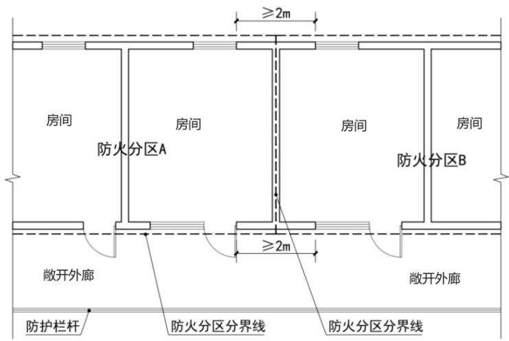

附图3.1.8 采用敞开外廊疏散的建筑防火分区划分

〔说明〕新增条文。根据《建筑防火通用规范》第 4.1.2 条第 4 款规定，开敞式外 走廊可不计入防火分区面积，同时，外廊敞开，其排烟、通风采光、降温等情况较好， 对安全疏散有利。 

# 3.2 防火卷帘、中庭

3.2.1 《建筑设计防火规范》第6.5.3条中防火分隔部位是指相邻两个防火 分区相接的部位。 

当汽车库防火分区之间仅在行车道开口部位设置特级防火卷帘分隔， 其他防火分隔部位采用防火墙和甲级防火门分隔时，防火卷帘的宽度可不 按《建筑设计防火规范》第6.5.3 条第1 款的规定计算；当其他防火分隔部 位也采用了防火卷帘分隔时，汽车库防火分区间防火卷帘的总宽度应按《建 筑设计防火规范》第6.5.3 条第1 款的规定执行。 

〔说明〕修订条文，细化了汽车库防火分区间分隔部位设置防火卷帘的宽度控制要 求。不鼓励非车道区域设置防火卷帘，如果车位之间设有卷帘，要加上车道上的卷帘， 总宽度符合建规的要求。 

3.2.2 不应使用水平、侧向等开启方式的防火卷帘和弧形、L 型等不规则 型的防火卷帘。 

防火卷帘的尺寸不宜超过 $9 \mathrm { m }$ （宽度） $\times 6 \mathrm { m }$ （高度）。 

当防火卷帘尺寸超过 $9 \mathrm { m }$ （宽度） $\times 6 \mathrm { m }$ （高度）时，应同时提供3m（宽 度） $\times 3 \mathrm { m }$ （高度）的防火卷帘型式检验报告和生产企业提供的与产品规格 一致的整体合格报告（含卷轴、卷门机及控制器等）。 

〔说明〕修订条文，明确大尺寸防火卷帘的使用要求。 

通常的防火卷帘型式检验报告为 $3 \mathrm { m }$ （宽度） $\times 3 \mathrm { m }$ （高度）。当防火卷帘尺寸超过 9m（宽度） $\times 6 \mathrm { m }$ （高度）时，需同时提供 3m（宽度） $\times 3 \mathrm { m }$ （高度）的防火卷帘型式 检验报告和生产企业提供的与产品规格一致的整体合格报告（含卷轴、卷门机及控制器 等），并进行专项分析研究，提出合理的方案，验证后方可使用。 

3.2.3 中庭四周作为上下层防火分区划分使用的防火卷帘，应结合建筑结 构靠近中庭开口设置，可按《建筑设计防火规范》第6.5.3 条中关于中庭的 要求设计防火卷帘的长度。（附图3.2.3） 

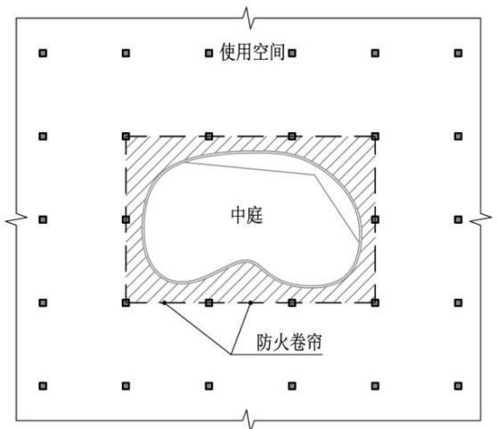

附图3.2.3 中庭卷帘设置

3.2.4 中庭的防火卷帘设在同层防火分区间的隔墙上时，其长度不计入防 火分区间隔墙的总长度和隔墙上防火卷帘的长度。（附图3.2.4） 

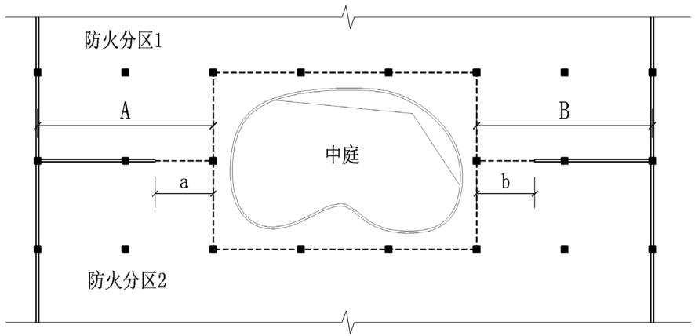

附图3.2.4 不计入中庭卷帘长度（应满足 $\mathbf { a + b } { \leqslant } \left( \mathbf { A + B } \right) / 3 )$ ）

3.2.5 当中庭无可燃物时，中庭的上部各层回廊与中庭间的防火卷帘可不 考虑耐火隔热性。 

〔说明〕局部文字修订。考虑到中庭上部各层回廊与中庭开口区域均无可燃物，卷 帘可不考虑耐火隔热性。 

3.2.6 中庭区域在各层的范围，应按距上一层中庭开口（中庭顶层按天窗 开口）边界投影线不超过 $1 5 \mathrm { m }$ 的范围界定（在此范围内设置防火分隔措施 时，算至防火分隔措施处）。（附图3.2.6） 

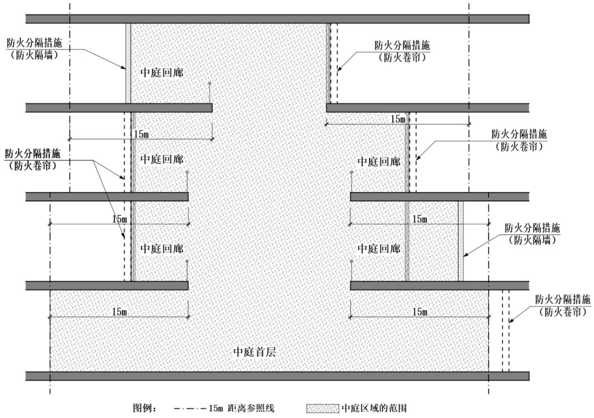

附图3.2.6 中庭区域在各层的范围

〔说明〕新增条文。原则上超过 $1 5 \mathrm { m }$ 的部位不应作为中庭区域，卷帘应按照《建 筑设计防火规范》第6.5.3条关于防火卷帘的宽度要求执行。 

3.2.7 当中庭内设有未采取防火分隔措施的商业、服务等使用功能，或回 廊的宽度大于6m时，应符合下列规定： 

1 该中庭区域按其首层和上、下各层相连通的建筑面积叠加计算后， 不得大于一个防火分区面积； 

2 确有需要设置的自动扶梯、敞开楼梯平台的宽度可不计入回廊宽度； 

3 该中庭区域应设置安全出口并满足安全疏散要求；确有困难时，可 利用相邻防火分区（不含相邻的其他中庭区域）疏散走道上的甲级防火门 进行疏散，但应根据中庭区域内每层的商业、服务等使用功能的建筑面积 （S1）和回廊中 宽度大于6m部分的建筑面积（S2）相加后的规模（S）设 置匹配的自有安全出口数量，并应符合下列规定： 

（1）中庭区域内单个商业、服务功能房间建筑面积不应大于 $1 0 0 \mathrm { ~ m } ^ { 2 }$ ， 房间之间应设置防火分隔措施； 

（2）当 $\mathbf { S } > 1 0 0 0 \mathrm { ~ m } ^ { 2 }$ 时，自有的安全出口数量不应少于2 个；利用相邻 非中庭区域防火分区的疏散宽度比例不应大于 $50 \%$ ； 

（3）当 $5 0 0 \ \mathrm { m } ^ { 2 } < \mathrm { S } \leqslant 1 0 0 0 \ \mathrm { m } ^ { 2 }$ 时，自有的安全出口数量不应少于 1 个， 利用相邻非中庭区域防火分区的疏散宽度比例不应大于 $50 \%$ ； 

（4）当 $\mathrm { S } { \leqslant } 5 0 0 ~ \mathrm { m } ^ { 2 }$ 时，中庭区域的安全出口均可利用相邻防火分区（不 含相邻的其他中庭区域）疏散走道上的甲级防火门进行疏散，数量不应少 于 2 个； 

（5）每个楼层总的疏散宽度应满足规范的要求； 

4 第 3 款所述的甲级防火门至疏散走道连接的最近安全出口的直线 距离不应大于 $3 0 \mathrm { m }$ 或袋型走道的疏散要求；该疏散走道两侧隔墙的耐火等 级不应低于2.00h，开向该疏散走道的门均应为甲级防火门。（附图3.2.7） 

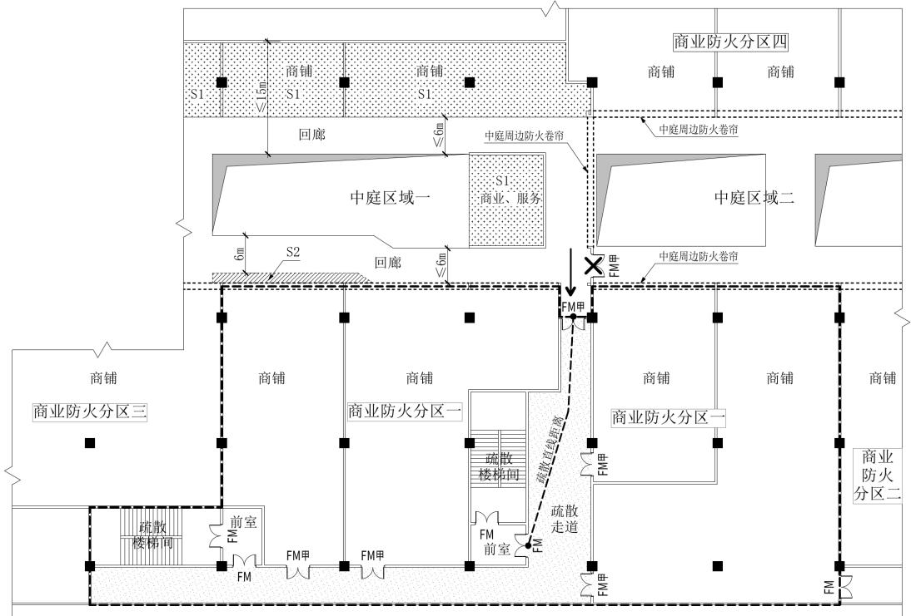

附图3.2.7 中庭利用相邻防火分区疏散

〔说明〕修订《指南（2020版）》第3.2.6条，细化中庭区域的设置范围和疏散要 求。 

中庭区域宜优先设置自有的安全出口或疏散楼梯，或采用共用疏散楼梯间等的方式 进行疏散。本条所述的中庭内未采取防火分隔措施的设置商业、服务功能及回廊中宽度 大于6m 部分的位置应位于本《指南》第3.2.6条规定的中庭区域范围内。 

3.2.8 当中庭内不设置商业、服务等使用功能，且回廊宽度不大于6m，同 时符合《建筑设计防火规范》第5.3.2条各项规定时，中庭区域按其首层和 上、下各层相连通的建筑面积叠加计算后可大于一个防火分区的面积。确 有困难时，可利用相邻防火分区（不含相邻的其他中庭区域）疏散走道上 的甲级防火门进行疏散，但应符合下列规定： 

1 当面积叠加计算后不大于一个防火分区的面积时，中庭区域的安全 出口均可利用相邻防火分区（不含相邻的其他中庭区域）疏散走道上的甲 级防火门进行疏散，数量不应少于2个； 

2 当面积叠加计算后大于一个防火分区的面积时，中庭区域应根据中 庭区域每层的建筑面积（S）设置匹配的自有安全出口数量，并应符合下列 规定： 

（1）当 $\mathbf { S } > 1 0 0 0 \mathbf { m } ^ { 2 }$ 时，自有的安全出口数量不应少于2个；利用相邻非 中庭区域防火分区的疏散宽度比例不应大于 $50 \%$ ； 

（2）当 $5 0 0 \mathrm { m } ^ { 2 } < \mathrm { S } \leqslant 1 0 0 0 \mathrm { m } ^ { 2 }$ 时，自有的安全出口数量不应少于1个，利 用相邻非中庭区域防火分区的疏散宽度比例不应大于 $50 \%$ ； 

（3）当 $\mathbf { S } { \leqslant } 5 0 0  { \mathrm { m } } ^ { 2 }$ 时，中庭区域的安全出口均可利用相邻防火分区（不 含相邻的其他中庭区域）疏散走道上的甲级防火门进行疏散，数量不应少 于2个； 

（4）每个楼层总的疏散宽度应满足规范的要求； 

3 本条所述的甲级防火门至疏散走道连接的最近安全出口的直线距 离不应大于 $3 0 \mathrm { m }$ 或袋型走道的疏散要求；该疏散走道两侧隔墙的耐火等级 不应低于2.00h，开向该疏散走道的门均应为甲级防火门。 

〔说明〕新增条文，明确不设置商业、服务功能的中庭区域的疏散要求。 

3.2.9 自动扶梯、敞开楼梯、大堂、门厅等上、下层相连通的开口部位， 可参照中庭要求设计防火卷帘。 

〔说明〕本条仅用于明确防火卷帘的宽度计算。但当上述开口部位设置在本《指南》 第 4.2.2 条所述“火灾危险性低且仅作为人员通行的门厅”内时，防火卷帘的设置要求 应按该条的规定执行。 

3.2.10 根据《建筑设计防火规范》第5.4.7 条第1 款规定，剧场、电影院、 礼堂确需设置在其他民用建筑内时，应采用耐火极限不低于 $2 . 0 0 \ \mathrm { h }$ 的防火 隔墙和甲级防火门与其他区域分隔，当该部位为防火分区的界限时，应采 

用防火墙和甲级防火门；该分隔部位不得用防火卷帘替代。采用中庭与其 他区域分隔时，允许在中庭周围设置防火卷帘。 

当卡拉 OK 厅或电玩游戏厅采用中庭与其他区域分隔时，允许在中庭 周围设置防火卷帘，设置防火卷帘的位置应同时设置钢化玻璃墙（门）。 

〔说明〕修订条文，新增卡拉OK厅或电玩游戏厅通过中庭和其他区域分隔时的要 求。 

# 3.3 外墙保温

3.3.1 《建筑防火通用规范》第 6.6.9 条第 2 款以及《建筑设计防火规范》 第6.7.2 条第1 款规定的场所不包括住宅建筑中的厨房。 

3.3.2 住宅建筑与基层墙体、装饰层之间无空腔的建筑外墙外保温系统， 其保温材料应符合下列规定：建筑高度大于 $2 7 \mathrm { m }$ ，但不大于 $5 4 \mathrm { m }$ 时，保温 材料的燃烧性能不应低于 $\mathrm { B } _ { 1 }$ 级，宜为 A 级；建筑高度大于 $5 4 \mathrm { m }$ 时，保温 材料的燃烧性能应为A级。 

〔说明〕增加部分文字明确要求，对于高层建筑宜提高燃烧性能的要求。 

3.3.3 住宅建筑与其他使用功能的建筑合建，当符合《建筑设计防火规范》 第5.4.10条第1、2款规定时，住宅部分和非住宅部分的建筑外墙外保温系 统，可根据各自的建筑高度分别按照《建筑设计防火规范》有关住宅建筑 和公共建筑的规定执行；商业服务网点的建筑外墙外保温系统应根据住宅 建筑的总高度执行。 

〔说明〕明确住宅建筑的外保温系统设计要求。 

3.3.4 岩棉板等A级外墙外保温材料外包覆厚度不大于 $0 . 5 \mathrm { m m }$ 的防水透气 膜时，可以作为A级材料使用。 

# 3.4 建筑结构、构造

3.4.1 工业建筑中，当防火墙设置在钢框架、钢梁等承重结构上时，钢框 架、钢梁及支撑构件应采用不燃烧体包覆，保证其整体耐火极限应满足防 火墙耐火极限要求。 

3.4.2 当单、多层丁、戊类厂房（仓库）的梁、柱（包括斜撑）、屋顶承 重构件采用无防火保护的金属构件时，该构件可视为满足二级耐火等级的 要求；厂房生产中能受到甲、乙、丙类液体或可燃气体火焰影响的部位或 热辐射温度高于 $2 0 0 \mathrm { { ‰} }$ 的部位，应采取防火隔热保护措施。 

〔说明〕修订条文表述和要求，限定此类厂房应为非高层丁、戊类厂房。 

3.4.3 《建筑设计防火规范》第6.2.5规定的“住宅建筑外墙上相邻户开口 之间墙体宽度不应小于 $1 . 0 \mathrm { m }$ 。”当任一侧开口部位采用乙级及以上的防火 门、窗时，开口之间 $1 . 0 \mathrm { m }$ 的间距为未采取防火保护措施的普通门、窗开口 之间的距离。 

〔说明〕修改文字表述。 

3.4.4 住宅建筑同一户内的外墙上、下层开口之间的实体墙高度可不作要 求。 

3.4.5 住宅建筑封闭阳台外墙上、下层开口之间的实体墙高度应按照《建 筑设计防火规范》第 6.2.5 条执行；相邻户开口之间实体墙宽度不应小于 $1 . 0 \mathrm { m }$ 。 

〔说明〕加强对封闭阳台部位外墙的要求。 

3.4.6 住宅套内自用的电梯与疏散楼梯相邻布置时，可不设置封闭楼梯间。 

3.4.7 住宅建筑开向楼梯间、前室或合用前室的户门，开启方向可不限。 

3.4.8 《建筑设计防火规范》第 5.5.32 条第 1 款规定的可开启外窗的有效 开启面积不应小于 $0 . 7 \mathrm { m } ^ { 2 }$ 。 

〔说明〕修订条文，调整开启面积要求。 

3.4.9 地下汽车库地面装修材料的燃烧性能等级不应低于《建筑内部装修 防火规范》GB 50222-2017 表 5.3.1 规定的 $\mathrm { B } _ { 1 }$ 级。 

〔说明〕明确地下汽车库地面材料的燃烧性能等级要求。 

3.4.10 施涂于A级基材上，湿涂覆比小于 $0 . 5 \mathrm { k g } \mathrm { ~ / ~ m } ^ { 2 }$ ，且涂层干膜厚度不 

大于 $0 . 2 \mathrm { m m }$ 的合成树脂乳液内墙涂料（俗称“内墙乳胶漆”），可作为 A 级 装修材料使用。 

3.4.11 电商网店内附设临时仓储功能的，仓储部分与电子商务部分应采取 耐火极限不低于2.00h 的不燃烧体隔墙、乙级防火门进行防火分隔。 

3.4.12 建筑内的每个电梯井均应各自独立设置；电梯井的井壁除设置电梯 门，安全逃生门和通气孔洞外，不应设置其他开口。 

〔说明〕新增条文。根据《建筑防火通用规范》的规定明确相关内容。 

3.4.13 连通汽车库的电梯间、候梯厅应设置耐火极限不低于3.00h 的防火 隔墙、甲级防火门与汽车库分隔，不应采用防火卷帘替代。 

〔说明〕《指南（2020版）》第4.3.1条文要求低于《建筑防火通用规范》第6.4.2 条的要求，进行修订整合并入本《指南》第3.4节。 

3.4.14 通至汽车库内的自动扶梯周围应设置耐火极限不低于3.00h的防火 隔墙和特级防火卷帘与汽车库空间分隔，防火卷帘总长度不应超过 $9 \mathrm { m }$ ，防 火卷帘部位应同时设置钢化玻璃墙（门）。 

〔说明〕新增条文，明确自动扶梯厅在汽车库的设置要求。 

# 3.5 应急排烟窗、应急排烟排热设施

3.5.1 楼梯间设置加压送风时，其应急排烟窗的设置应符合下列规定： 

1 楼梯间靠外墙或直通屋面时，应按《建筑防火通用规范》第2.2.4 条 规定于其顶部或最上一层外墙上设置可开启外窗面积不小于 $1 . 0 \mathrm { ~ m } ^ { 2 }$ 常闭式 应急排烟窗；靠外墙的防烟楼梯间可不按《建筑防烟排烟系统技术标准》 GB 51251-2017（以下简称《防排烟标准》）第3.3.11条规定在其外墙上每 5 层设置 $2 . 0 \ \mathrm { m } ^ { 2 }$ 的固定窗； 

2 当楼梯间在屋面直通室外的门具有《建筑防火通用规范》规定的手 动和联动功能时，该门可作为其应急排烟窗使用，可不另设置应急排烟窗； 

3 靠外墙的地下室楼梯间，其首层直通室外的疏散门具有《建筑防火 通用规范》规定的手动和联动功能时，该门可作为其应急排烟窗使用。 

〔说明〕根据《建筑防火通用规范》《防排烟标准》的规定，调整、补充并完善了 楼梯间应急排烟窗设置的相关要求。 

3.5.2《建筑防火通用规范》第 2.2.5条中，无可开启外窗是指建筑无外窗、 设置了固定的外窗，或可开启外窗的设置（包括面积、位置）不符合《防 排烟标准》第 4.4.15 条有关固定窗的规定（其中顶层的可开启外窗面积小 于该场所地面面积 $1 \%$ ）。 

当设置应急排烟排热设施时，其具体设置要求应符合《防排烟标准》 第 4.4.14 条~第 4.4.17 条固定窗的有关规定。 

〔说明〕楼梯间应急排烟窗的设置要求在第 3.5.1 条中已明确，本条主要对《建筑 防火通用规范》第 2.2.5 条中应急排烟排热设施设置的相关要求进行明确和补充。相关 建筑或部位的应急排烟排热设施应设置在该建筑每层外墙或屋顶上，具体设置要求（包 括面积、位置）应符合《防排烟标准》第4.4.15条的规定，建议优先设置在公共区域的 外墙上，其中靠外墙布置的走道部位必须设置。 

3.5.3 应急排烟窗应能现场手动开启、消防控制室远程电信号开启；应急排 烟排热设施应能现场手动开启、消防控制室远程电信号开启，或依靠烟气 温度自动开启。 

〔说明〕楼梯间应急排烟窗的设置要求在本《指南》第 3.5.1 条中已明确，本条主 要对应急排烟窗及应急排烟排热设施的控制要求进行补充。 

# 第四章 安全疏散和救援

# 4.1 安全出口、疏散宽度与疏散距离

4.1.1 《建筑防火通用规范》《建筑设计防火规范》及本《指南》相关条文 中，涉及要求“设置独立的安全出口或疏散楼梯”“安全出口或疏散楼梯 独立设置”的，当场所为电影院、儿童活动场所时，该独立设置的安全出 口或疏散楼梯，在同层以及上下层均不应与其他场所共用。 

涉及住宅的独立设置安全出口的规定按《建筑防火通用规范》《建筑 设计防火规范》的相关规定执行。 

其他场所除特别注明外，“设置独立的安全出口或疏散楼梯”，一般 指在同层不应与其他场所共用，上下层可共用。 

涉及“疏散完全独立”的要求，安全出口和疏散楼梯在同层以及上下 层均不应与其他场所共用。 

〔说明〕修订并新增条文。根据规范组对《办公建筑设计标准》《商店建筑设计规 范》的解释，不在同一楼层的商场、娱乐、餐饮、办公、酒店等可共用垂直疏散楼梯， 《办公建筑设计标准》允许设值班办公室。 

4.1.2 餐饮场所的营业面积是指餐厅面积，不包括厨房面积；商店建筑中 的餐厅应明确餐厨布置，当餐厅未设置固定座位时，应以餐厅面积（含厨 房、前厅、点菜、吧台区域）按商店营业厅的人员密度计算确定；当餐厅 设置固定座位或有独立隔间（用固定构件分隔）的包厢时，其疏散人数可 按实际座位数的1.1倍计算。 

酒店中的宴会厅、餐厅疏散人数计算应按《旅馆建筑设计规范》JGJ 62 的规定执行。 

〔说明〕修订条文内容。本条第一段主要针对的是附设在商店建筑中的餐饮场所。 

4.1.3 有固定座位的场所，其疏散人数可按实际座位数的 1.1 倍计算，该 场所为电影厅时，其疏散人数应为影厅内座位数、工作人员数和候场人数 之和，每层候场人数应按该层各厅平均座位数且不小于该层各厅总座位数 的 $20 \%$ 计算。 

4.1.4 办公场所的疏散人数可按建筑面积 $9 . 3 \mathrm { ~ m } ^ { 2 } / .$ 人计算。 

4.1.5 歌舞娱乐放映游艺场所计算最大容纳人数时，应按厅室建筑面积计 算，连接厅室的公共走道面积不计入在内。其中桑拿浴室的疏散人数可按 照更衣柜数量的 1.1 倍计算，当桑拿浴室中设有不经过更衣室直接进出的 使用功能时，应根据实际情况核算人数。 

〔说明〕桑拿浴室中如另设有不经过更衣可直接进出的使用功能时（如足疗、客房 等），应根据实际情况计算疏散人数。 

4.1.6 健身房、游泳池、溜冰场的疏散人数可按照更衣（鞋）柜数量的1.1 倍计算。 

4.1.7 除下列部位外，当人员需要通过相邻防火分区疏散时，相邻两个防 火分区之间应采用防火墙（甲级防火门）分隔，开口部位不应采用防火卷 帘、防火分隔水幕等措施替代： 

1 相邻两个防火分区之间的中庭四周的防火卷帘； 

2 汽车库行车道上设置的防火卷帘。 

〔说明〕调整表述，并整合《指南（2020版）》第4.1.8条车道处设置卷帘的要求。 

4.1.8 除地下室非人员密集场所所在防火分区不可利用通向相邻人员密集 场所所在防火分区的门作为安全出口外，地下室其余场所之间可按《建筑 设计防火规范》第 5.5.9 条的规定执行。 

〔说明〕部分内容调整与合并，本条明确是否可借用疏散的原则。《建筑设计防火 规范》第 5.5.9 条并未禁止非人员密集场所防火分区利用人员密集场所防火分区的甲级 防火门作为安全出口，本《指南》对地下室提高要求。汽车库为非人员密集场所。 

4.1.9 在地下汽车库防火分区满足 2 个安全出口的条件下，人员可利用相 邻汽车库防火分区或其他非人员密集场所防火分区的防火墙上的甲级防火 门疏散，车道处可设防火卷帘。 

〔说明〕本条主要解决汽车库防火分区局部疏散问题，允许利用相邻汽车库分区或 其他非人员密集场所防火分区进行疏散，但不得利用相邻人员密集场所防火分区进行疏 散。疏散距离计算到开向相邻防火分区的甲级防火门即可。此处的“2个安全出口”含 符合本《指南》第4.1.21条要求的共用疏散楼梯。 

4.1.10 地下商业可利用通往避难走道的门作为任一防火分区的安全出口 使用，但应满足以下要求： 

1 地下商业每层疏散总宽度应符合规范要求，通向下沉式广场等室外 开敞空间的门以及疏散楼梯的宽度计入疏散总宽度； 

2 通向避难走道门的宽度不应计入疏散总宽度；避难走道直通地面的 不大于避难走道净宽度的楼梯、台阶宽度可计入疏散总宽度； 

3 任一防火分区设有通往下沉式广场等室外开敞空间或疏散楼梯时， 可利用避难走道作为第二安全出口，但通往避难走道的疏散宽度不应大于 该防火分区疏散总宽度的 $30 \%$ ； 

4 避难走道内任一点至室外、疏散楼梯或下沉式广场等室外开敞空间 的距离不应大于 $6 0 \mathrm { m }$ ； 

5 避难走道不能用于人员疏散外的其他用途；其顶板应为耐火极限不 低于 1.50h 的不燃烧体，顶板下不得穿越通风（空调）风管、排烟管道及 无关的电缆桥架等管道和线路； 

6 避难走道的其余设计应符合现行国家标准《建筑防火通用规范》GB 55037 和《建筑设计防火规范》GB 50016 的规定。 

〔说明〕统一标准名称。 

4.1.11 住宅建筑架空层仅作为景观、人员通行使用时，疏散外门至架空层 投影外边缘的水平距离不应大于 $1 5 . 0 \mathrm { m }$ ；当该架空层范围内设置电动自行 车停车区域时，与其他区域之间应采取防火分隔措施。距离架空层投影外 边缘的6m水平距离范围内可设置进风口。 

〔说明〕《指南（2020 版）》第 4.1.34 条后半部分内容调整至本条，并明确与电 动自行车停车区域的防火分隔要求。 

4.1.12 建筑的架空层、下沉式广场的回廊、敞开外廊等空间，当符合下列 规定时，相应区域可视为安全区域，该安全区域内可设置疏散出口和进风 口：（附图 4.1.12） 

1 该空间应仅作为人员通行使用； 

2 当层高 $\mathrm { H s } { \leqslant } 6 . 0 \mathrm { m }$ 时，该区域的进深Ls不应大于 $6 . 0 \mathrm { m }$ ；当层高Hs＞ $6 . 0 \mathrm { m }$ 时，该区域的进深Ls不应大于Hs。进深大于 $6 . 0 \mathrm { m }$ （层高 $\mathrm { H s } { \leqslant } 6 . 0 \mathrm { m }$ 时） 或大于Hs（层高 $\mathrm { H s } { > } 6 . 0 \mathrm { m }$ 时）的部分应按室内要求进行消防设计，与其外 侧安全区域之间应设置防火分隔措施或挡烟垂壁； 

3 当安全出口位于该进深过大部分时，应设置疏散走道通至本条所述 的安全区域，走道两侧防火隔墙耐火极限不低于2.00h。 

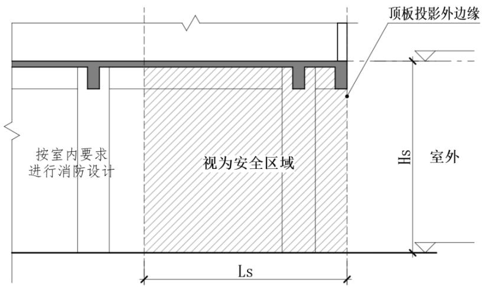

(1）Hs $\leqslant ~ 6 . ~ 0 \mathrm { m }$ 时，Ls ≤6.0m

(2）Hs $> ~ 6 , 0 \mathrm { m }$ 时，Ls $\leqslant$ Hs

附图4.1.12 架空层、下沉式广场的回廊、敞开外廊等空间的安全区域

〔说明〕《指南（2020 版）》第 4.1.34 条内容调整后新增本条文。空间的进深是 指计算至架空层、回廊、外廊顶部投影外边缘的水平距离。当结构梁高大于该区域层高 $20 \%$ 时应考虑其对该区域净高的影响。 

# 4.1.13 下沉式广场等室外开敞空间（以下简称“下沉广场”）的消防设计， 除应符合《建筑设计防火规范》的相关规定外，尚应满足下列要求：

1 地下室朝向“下沉广场”的外墙与“下沉广场”之间回廊的进深不超 过 $6 \mathrm m$ ，且回廊区域仅作为人员通行使用时，可不划分防火分区，不计入防 火分区面积；当回廊进深超过 6m 时，应按本《指南》第 4.1.12 条相应规 定执行； 

2 “下沉广场”用于疏散的净面积不应小于 $1 6 9 ~ \mathrm { m } ^ { 2 }$ ，且该敞开空间的露 天开口部位的短边不应小于 $1 3 \mathrm { m }$ ； 

3 当“下沉广场”用于地下或半地下商业 $2 0 0 0 0 \ \mathrm { m } ^ { 2 }$ 之间的分隔时，分隔 后不同区域通向“下沉广场”的开口最近边缘之间的水平距离不应小于 $1 3 \mathrm { m }$ ， 同一区域内不同防火分区通向“下沉广场”的门窗之间的距离应满足《建筑 设计防火规范》第6.1.3 条、第6.1.4 条的有关规定。 

〔说明〕本条为《指南（2020版）》第4.1.11 条，本次修订回廊的部分要求。“下 沉广场”通向地面的露天台阶可设置在第2款规定的“露天开口部位” 

# 4.1.14 符合《建筑设计防火规范》第 6.6.4 条规定满足安全出口条件的天 桥、连廊，通过该连廊、天桥向相邻建筑的疏散宽度不应大于相邻建筑与 连廊相连通的防火分区疏散总宽度的 $30 \%$ 。

〔说明〕本条为《指南（2020 版）》第 4.1.12 条提高要求。通常认为连廊的消防 

疏散是需要考虑的。宽度小于6m 的两个建筑之间的连廊（封闭或不封闭）仅用于交通 联系不用于疏散时，防火分区面积可以不计。修改提高了需要向相邻建筑疏散时自身的 疏散要求，相邻建筑的管理情况、开放时间等问题会直接影响到疏散。 

4.1.15 除规范和本《指南》另有规定外，当民用建筑内的场所设置自动喷 水灭火系统时，其疏散直线距离可增加 $2 5 \%$ 。 

〔说明〕本条为《指南（2020版）》第 4.1.14条修订，删除有关行走距离的表述。 直线距离是针对内部布置不确定或者明确有隔墙的情况下的距离控制，疏散用直线距离 计算时，对于没有内部布置时相当于画圆的半径，对于设置有各类隔墙（或高货架等固 定障碍物）时，则应按照任一点到隔墙上开口（或绕开高货架等固定障碍物）再到安全 出口的折线距离控制，不得穿越实体墙、中庭上空等非物理可通行的区域。 

行走距离属于后续管理上的加强要求，需绕开所有障碍物如桌子、座椅、低矮柜台 等。设计时应注重对疏散直线距离的控制。 

4.1.16 一、二级耐火等级建筑的疏散内走道两侧的墙应为耐火极限不低于 1.00h的墙，除规范另有规定外，墙上的门可为普通门。当墙上设置普通窗 （洞）时，或疏散走道两侧墙（部分或全部）的耐火极限低于 1.00h 时， 应符合下列规定： 

1 当该房间位于两个安全出口之间满足双向疏散时，从房间内任一点 至最近安全出口的疏散直线距离不应大于 $3 0 \mathrm { m }$ ；但医疗建筑的高层病房楼、 托儿所、幼儿园、老年人照料设施的疏散直线距离应按照《建筑设计防火 规范》表5.5.17疏散门位于两个安全出口之间的直线距离的规定执行； 

当该房间不满足双向疏散时，从房间内任一点至最近安全出口的疏散 直线距离应按照《建筑设计防火规范》表 5.5.17 中疏散门位于袋形走道两 侧或尽端的直线距离控制或按本《指南》第 4.1.31 条的丁字形走道距离的 规定执行； 

2 分隔至顶板的玻璃隔断等轻质不燃隔断可作为挡烟垂壁使用； 

3 当建筑疏散内走道设置普通窗面积不大于该房间内走道侧墙面面 积的 $2 5 \%$ 时，房间疏散直线距离可不按本条第 1 款的距离控制，但应符合 下列规定： 

（1）当房间门为普通玻璃门时，门洞面积计入本款普通窗面积；（附 图 4.1.16） 

（2）疏散内走道应设置有效的排烟设施，排烟量或自然排烟口有效面 积应在按《防排烟标准》和本《指南》相关规定进行计算的基础上加大不 

小于 $20 \%$ ，当采取机械排烟方式时排烟风机宜采取备用措施。 

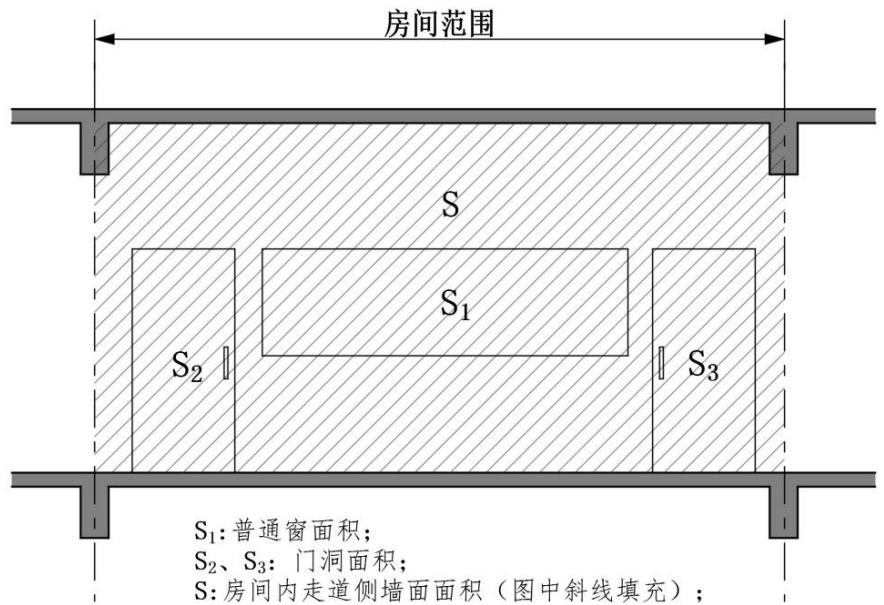

(1）门为普通玻璃门时， $\left( \mathrm { S } _ { 1 } { + } \mathrm { S } _ { 2 } { + } \mathrm { S } _ { 3 } \right) / \mathrm { S } { \leqslant } 2 5 \%$ ;

(2）门为非普通玻璃门时， $\mathrm { S _ { 1 } / S { \leqslant } 2 5 \% }$ ；

附图4.1.16 普通窗面积控制

〔说明〕本条为《指南（2020 版）》第 4.1.15 条修订，加强了建筑内走道设置侧 窗后仍按疏散门通过走道至安全出口的疏散方式时的要求。 

本条第 1 款强调的场所，主要是该类场所的疏散距离并不是以 $3 0 \mathrm { m }$ 为基数，应按 《建筑设计防火规范》表 5.5.17来控制。 

4.1.17 当厅室面积小于 $4 0 0 ~ \mathrm { { m } } ^ { 2 }$ 的展览厅、多功能厅、餐厅、营业厅、多厅 电影院的观众厅等疏散门不能直通室外地面或疏散楼梯间时，除可按照《建 筑设计防火规范》第 5.5.17 条第 4 款规定执行外（其中“长度不大于 $1 0 \mathrm { m }$ 的疏散走道”是指疏散距离不大于 $1 0 \mathrm { m }$ ）；也可按《建筑设计防火规范》 表 5.5.17 直通疏散走道的房间疏散门至最近安全出口的疏散距离要求执行， 但厅室内任一点至疏散门的距离应按照《建筑设计防火规范》第 5.5.17 条 第3 款规定执行。 

〔说明〕本条为《指南（2020 版）》第 4.1.16 条修订，设置自动喷水灭火系统后 的疏散距离统一按本《指南》第 4.1.15条的规定。虽然《建筑设计防火规范》第 5.5.17 条第4款并未要求按厅室面积区分疏散距离的计算方式，对于面积较大的营业厅这一类 的厅室还是推荐采用更直接的疏散模式。 

4.1.18 一、二级耐火等级建筑内的歌舞娱乐放映游艺场所，当房间的安全 出口不少于 2 个时，其室内任一点至最近安全出口的疏散直线距离不应大 于 $1 8 \mathrm { m }$ 。 

〔说明〕本条为《指南（2020 版）》第 4.1.17 条修订，明确本条所指场所中的房 间疏散门即为安全出口时，疏散直线距离的要求。符合本条规定的情况下，疏散距离在 《建筑设计防火规范》第 5.5.17条第3款规定的 $9 \mathrm { m }$ 基础上增加1倍，当设置自动喷水 灭火系统后的疏散距离统一按本《指南》第4.1.15条的规定。 

4.1.19 《建筑设计防火规范》第3.7.2条、第5.5.8 第2款规定的设置1 部 疏散楼梯的面积要求中，当建筑首层与其余各层建筑、疏散楼梯完全分隔 时且首层疏散满足规范要求时，首层建筑面积可不限，但疏散门数量等应 符合《建筑设计防火规范》其他相关条文的要求。 

〔说明〕本条为《指南（2020 版）》第 4.1.18 条修订，调整部分文字。 

4.1.20 符合下列条件之一的房间可设置1 个疏散门： 

1 建筑面积不大于 $2 0 0 ~ \mathrm { { m } } ^ { 2 }$ 的设备间（现行国家标准《建筑电气与智能 化通用规范》GB 55024、《民用建筑电气设计标准》GB 51348、《20kV 及以下变电所设计规范》GB 50053、《低压配电设计规范》GB 50054、《3～ 110kV高压配电装置设计规范》GB 50060 另有规定的除外）； 

2 符合《建筑防火通用规范》第7.4.2条要求的位于建筑底部（地上） 直接对外或二层直接开门至敞开外廊、室外平台（此敞开外廊、室外平台 应通过2部及以上疏散楼梯通至室外地面）的商铺。 

〔说明〕本条为《指南（2020 版）》第 4.1.19 条修订，调整规范名称和引用条文。 

4.1.21 同一楼层的三个及以上防火分区不得共用同一部疏散楼梯。一部共 用疏散楼梯的疏散宽度不得超过 $3 \mathrm { m }$ 。 

4.1.22 多个单元组合的住宅建筑各单元的高度不同且较低一单元屋顶无 天窗或洞口（不包括屋面透气管、通风口）、屋顶耐火极限不低于 1.00h 时，可按各独立单元的高度来确定其楼梯间形式、消防电梯的设置，高度 大于 $2 7 \mathrm { m }$ 的各单元（已设置两个安全出口者除外）疏散楼梯间应通至屋面， 且应在相邻的高度大于 $2 7 \mathrm { m }$ 的较低单元屋面连通。（附图4.1.22） 

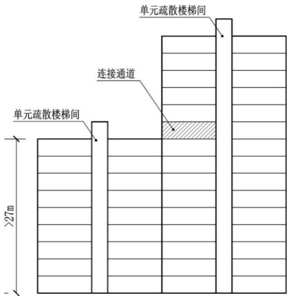

附图4.1.22 单元间疏散楼梯连通

4.1.23 汽车停车位的设置不得影响消防设备用房、室内消火栓箱、消防管 道井的正常使用，也不应影响进出安全出口的疏散通道。计算地下车库内 最远疏散直线距离时，可不考虑车辆对路线的阻挡，但应考虑实体墙、机 械式停车装置等障碍物对路线的阻挡。 

〔说明〕本条为《指南（2020版）》第4.1.22条修订，原条文关于汽车坡道防火分 区面积计算和疏散距离的相关内容，改至本《指南》第 3.1.3 条。停车位布置不应影响 消防设备用房的开门、消火栓箱开启净空，也不应影响进出安全出口的疏散通道宽度等。 

4.1.24 《建筑设计防火规范》第 3.8.2 条规定的仓库的多个防火分区可以 通过疏散走道通至安全出口，疏散走道两侧应采用耐火极限不低于 3.00h 的防火隔墙。 

〔说明〕本条为《指南（2020 版）》第 4.1.23 条修订，提高了相关部位走道防火 隔墙的耐火极限。 

4.1.25 为商场服务的附属库房，应采用耐火极限不低于2.00h 的不燃烧体 隔墙分隔，如隔墙上需要开设相互连通的门时，应采用乙级防火门。该附 属库房不得储存甲、乙类物品。 

4.1.26 同一防火分区总面积超过 $5 0 0 \mathrm { m } ^ { 2 }$ 的地上和超过 $2 0 0 \mathrm { m } ^ { 2 }$ 地下附属库房 应设置一个独立的安全出口，在商场内第二安全出口可利用商业营业厅疏 散；同一防火分区总面积不超过 $5 0 0 ~ \mathrm { m } ^ { 2 }$ 的地上和 $2 0 0 \ \mathrm { m } ^ { 2 }$ 地下附属库房可不 设置独立的安全出口，可利用商业营业厅疏散。上述商业营业厅所在防火 分区和利用该商业营业厅疏散附属库房的建筑面积之和不应超过商业营业 

厅的防火分区最大允许建筑面积。 

4.1.27 同一防火分区内采用防火措施分隔开的仓储、设备房、工具间、办 公、非服务于营业厅的卫生间等可不计入营业厅面积，但应根据实际情况 进行核定人数和宽度。 

〔说明〕本条为《指南（2020 版）》第 4.1.26 条修订。 

4.1.28 高层建筑（裙房除外）直通室外的安全出口上方应设置挑出宽度不 小于 $1 . 0 \mathrm { m }$ 的防护挑檐。 

4.1.29 红外线感应自动门、旋转门设于安全出口时，该门附近应另设便于 人员疏散的平开门。按《建筑与市政工程无障碍通用规范》GB 55019 -2021 第3.2.3 条第3 款设置的水平滑动式门，可作为无障碍厕所的疏散门，此门 在火灾时应能自动解锁，人员应不需使用任何工具即能容易地从内部打开， 并应在门内一侧的显著位置设置明显的标识；当设有火灾自动报警系统时， 应与火灾自动报警系统联动。 

〔说明〕本条为《指南（2020 版）》第 4.1.28 条修订，明确水平滑动式门作为无 障碍厕所疏散门的要求。 

4.1.30 地下一层非机动车库直通室外的自用坡道口与非机动车库之间可 不设防火门，可作为人员安全疏散使用，但坡道口应设置挡烟设施，挡烟 设施下部距地面的净空高度不应小于 $2 . 0 \mathrm { m }$ 。大开间的非机动车库室内最远 点到疏散出口的直线距离不应大于 $3 0 \mathrm { m }$ 。非机动车库应按相关规定设置排 烟设施。 

〔说明〕本条为《指南（2020 版）》第 4.1.29 条修订。地下一层非机动车库直通 室外且无顶盖的坡道，可不按室外疏散楼梯控制其与周边洞口距离。 

当该坡道不是非机动车库自用的或其他功能需利用该坡道进行疏散时，应设置防火 门。设置自动喷水灭火系统后的疏散距离统一按本《指南》第4.1.15条的规定。 

4.1.31 “丁”字型内走道上的房间门的安全疏散距离计算方法如下： 

1 当 $\mathsf { a } \leqslant \mathsf { b } \leqslant \mathsf { c }$ 时，需满足下列要求之一：（附图 4.1.31） 

（1） $2 \mathsf { a } + \mathsf { b } \leqslant \mathbf { X }$ ，X为《建筑设计防火规范》表 5.5.17 位于两个安全出 口之间的疏散门至最近安全出口的直线距离； 

（2） $\mathsf { a } + \mathsf { b } \leqslant \mathrm { Y }$ ，Y为《建筑设计防火规范》表5.5.17 位于袋形走道两侧 或尽端的疏散门至最近安全出口的直线距离。 

2 当 $\mathbf { a } > \mathbf { b }$ 时，需满足 $\mathsf { a } + \mathsf { b } \leqslant \mathrm { Y }$ ，Y 为《建筑设计防火规范》表 5.5.17 

位于袋形走道两侧或尽端的疏散门至最近安全出口的直线距离。 

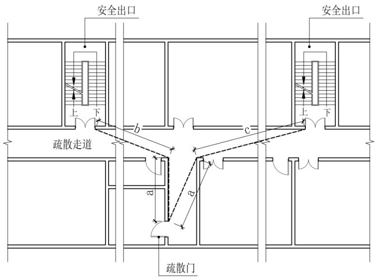

附图 4.1.31 丁字型走道疏散距离

4.1.32 单个面积不大于 $2 0 0 \mathrm { ~ m } ^ { 2 }$ 且同一防火分区内总面积不大于 $4 0 0 \mathrm { ~ m } ^ { 2 }$ 的 $2 0 \mathrm { k V }$ 及以下变配电房等类似小型设备用房（不包括柴油发电机房、锅炉房、 消防水泵房、消防控制室），可附设在汽车库防火分区内，但应采用耐火 极限不低于3.00h的防火隔墙和甲级防火门与停车区之间进行防火分隔，其 疏散门可直接开向汽车库。 

〔说明〕本条为《指南（2020 版）》第 4.1.31 条修订，调整总面积控制要求。柴 油发电机房、锅炉房、消防水泵房、消防控制室等为建筑整体服务的重要设备用房，不 应附设在其下部（含地下）组合建造的汽车库防火分区。仅附设在其中且仅为该汽车库、 修车库服务的消防水泵房、消防控制室、自动灭火系统的设备室，才允许和汽车库划分 在同一防火分区内。 

类似小型设备用房还包括：生活水泵房、报警阀间、污水提升间、雨水收集机房、 电信运营商机房等。 

4.1.33 地下锅炉房、消防水泵房的疏散门可直接开向疏散楼梯间，当地下 锅炉房、消防水泵房不能直通室外地面或疏散楼梯间时，应采用长度不大 于 $1 5 \mathrm { m }$ 的疏散走道（走道应与用房之间采取耐火极限不低于 2.00h 的防火 隔墙和乙级防火门分隔）通至最近的安全出口。 

〔说明〕本条为《指南（2020 版）》第 4.1.32 条修订，调整部分内容。“长度不 大于 $1 5 \mathrm { m }$ 的疏散走道”是指疏散距离不大于 $1 5 \mathrm { m }$ 。 

4.1.34《建筑设计防火规范》第5.5.20条关于影院等的疏散宽度只适用于单 独建造的相应场所。 

4.1.35 疏散出口门的净宽度应符合下列规定： 

1 新建住宅建筑的户门净宽不应小于 $0 . 9 0 \mathrm { m }$ ； 

2 住宅建筑的疏散楼梯间在首层开向门厅内的门及疏散楼梯间直通 室外的门，其净宽度不应小于 $0 . 8 0 \mathrm { m }$ ； 

3 高层建筑内，仅供地下室疏散楼梯使用的首层疏散外门可不按高层 公共建筑首层疏散外门宽度要求设置，其净宽度不应小于 $0 . 8 0 \mathrm { m }$ ； 

4 疏散楼梯间在首层直通室外的门，可按《建筑防火通用规范》第 7.1.4 条第 1 款执行； 

5 辅助房间（例如卫生间、设备间、垃圾间、储藏间、小型管理用房） 在首层直通室外的疏散门的净宽度，可按《建筑防火通用规范》第7.1.4条 第1 款执行。 

〔说明〕修订条文内容，《建筑防火通用规范》已明确的内容不再重复要求，同时 合并《指南（2020 版）》第 4.2.13、4.2.14 条内容。 

第1款，《住宅项目规范》GB 55038-2025第 4.1.14条对新建住宅建筑的户门通行 净宽进行了规定，比《建筑防火通用规范》第7.1.4条第1款提高了要求。 

疏散出口门净宽度的计算方法：对于单扇门，门的净宽度为门扇呈 $9 0 ^ { \circ }$ 角打开时门 框内缘至门表面的水平距离；对于双扇门，为两扇门同时呈 $9 0 ^ { \circ }$ 角打开时，两扇门相对 表面之间的水平距离。门的把手等附件，当凸出门表面不大于 $8 0 \mathrm { m m }$ 时，可以不考虑其 对疏散的影响。 

4.1.36 住宅户内开向非封闭阳台（可兼前室）的门窗可采用普通门窗，其 门洞最小尺寸应满足《住宅设计规范》GB 50096的要求。 

4.1.37 疏散走道、疏散楼梯设置扶手时，其净宽度可按《民用建筑通用规 范》GB 55031-2022（以下简称《民用建筑通用规范》）的规定计算至扶手 中心线。 

民用建筑中平时基本无人经常停留及使用或使用人数较少的设备用房、 储藏室等房间，疏散门开向疏散走道时，可不考虑对疏散走道宽度的影响。 

〔说明〕新增条文，明确疏散宽度设计的相关内容。 

疏散门开启方向满足规范且不影响房间使用功能时，可考虑房间门内开。平时基本 无人经常停留及使用或使用人数较少的房间一般包括管道井上的检修类门、附属库房 （储藏室、档案室、资料室、工具间）、设备用房、公共卫生间、茶水间、母婴室等类 似功能房间。 

4.1.38 疏散通道、疏散走道、疏散出口的净高度可按下列规定执行： 

1 当确有困难时，疏散通道、疏散走道上局部设置的挡烟垂壁、梁等 

突出部位的净高可按《民用建筑通用规范》第3.2.7 条执行； 

2 疏散楼梯休息平台上部及下部过道处的净高可按《民用建筑通用规 范》第5.3.7条执行； 

3 机动车库、非机动车库、无人值守或无人员长时间停留的设备间的 疏散出口门净高可按《民用建筑通用规范》第3.2.7 条执行； 

4 人防门和防火门不宜同框设置。人防防护设备的规格及其选用应按 相关主管部门的规定执行。 

〔说明〕新增条文，明确部分场所、局部位置的净高度要求。 

# 4.1.39 当建筑屋面设置有室外活动场地时，应至少设置一部疏散楼梯直接 通至地面，该疏散楼梯间的门应开向屋面。

〔说明〕新增条文，明确屋面、露台有室外使用功能如球场、活动场地时的疏散要 求。本条所指活动场地不含儿童活动场所。 

# 4.2 疏散楼梯

4.2.1 用于敞开楼梯间疏散的门厅，与建筑中其他部分之间可不采取防火 分隔措施，该敞开楼梯梯段踏步前缘不超过梯段宽度的位置起算到室外的 距离不应大于 $1 5 \mathrm { m }$ 。 

办公建筑或住宅建筑按规范设置的两个敞开楼梯间，可通过同一个门 厅通至室外，该门厅应设置两个直通室外的疏散门，间距不应小于 $5 \mathrm { m }$ 。 

不用于其他疏散楼梯间疏散的门厅，与建筑其他部分之间可不采取防 火分隔措施。 

〔说明〕调整文字表述和内容，提高相关门厅疏散门设置要求。 

4.2.2 当建筑可直通室外的门距离疏散楼梯间不超过 $3 0 \mathrm { m }$ 时，可采用扩大 封闭楼梯间、扩大前室（含合用前室）、火灾危险性低且仅作为人员通行 的门厅（以下简称“低危门厅”）通至室外。采用“低危门厅”时应符合 下列规定： 

1 该门厅应采用不燃材料装修； 

2 与该门厅连通的配套小商铺、服务用房、设备用房应采取耐火极限 不低于3.00h的防火隔墙和甲级防火门与门厅进行防火分隔，不应采用防火 

卷帘替代；与“低危门厅”连通的配套小商铺总建筑面积不应大于 $6 0 \ \mathrm { m } ^ { 2 }$ ， 单处小商铺建筑面积不应大于 $3 0 ~ \mathrm { { m } } ^ { 2 }$ ；确有需要时，该商铺与门厅之间的开 口部位可采用设置长度不大于 $6 \mathrm m$ 的特级防火卷帘与门厅进行分隔，多个商 铺时防火卷帘总长度不应大于 $9 \mathrm { m }$ ； 

3 当办公和住宅建筑设置的“低危门厅”为通高空间时，仅可在二层 回廊设置特级防火卷帘与首层门厅进行分隔，该部位防火卷帘的总长度不 应大于 $1 5 \mathrm { m }$ ； 

4 当“低危门厅”确需与相邻的商业营业厅连通时，应在连通部位设 置防火隔间，防火隔间的设置尚应符合现行《建筑设计防火规范》GB 50016 的相关规定； 

5 变配电间、垃圾间等服务和设备用房，可按本条的规定与“低危门 厅”连通。当有餐厅或厨房与该门厅连通时，应根据餐厅包含厨房的整体 规模确定其为商铺或相邻商业营业厅。 

〔说明〕修订条文内容，细化“低危门厅”的设置要求。第3款当“低危门厅”为 通高空间且连通的层数超过两层时，3层以上不允许设置防火卷帘。 

4.2.3 当建筑可直通室外的门距离疏散楼梯间大于 $3 0 \mathrm { m }$ （从梯段踏步前缘 不超过梯段宽度的位置起算）时，应设置避难走道通至室外。通向该避难 走道的出入口应在入口设置防烟前室。避难走道的设置尚应符合现行《建 筑防火通用规范》GB 50037和《建筑设计防火规范》GB 50016的相关规 定。（附图4.2.3） 

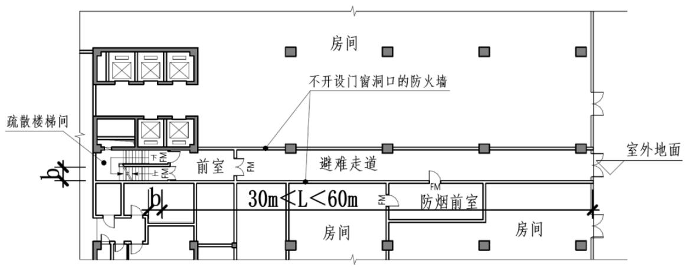

附图 4.2.3

〔说明〕《指南（2020 版）》第 4.2.2 条中关于避难走道的做法单独表述为本条。 

4.2.4 住宅建筑和办公建筑的一个剪刀楼梯间的两个梯段或两部疏散楼梯 

在首层可利用同一“低危门厅”通至室外，该门厅应设置两个直通室外的 疏散门，间距不应小于 $5 \mathrm { m }$ 。该门厅尚应符合本《指南》第4.2.2 条的规定。 

〔说明〕提高低危门厅疏散门设置要求。对于办公建筑，未来有可能改为复合功能 的，应慎用本条做法。 

4.2.5 疏散楼梯的地下部分与地上部分，在首层通过同一条疏散走道直通 室外时，该疏散走道的净宽度不应小于疏散楼梯的地下部分与地上部分各 自承担的通至该走道的疏散净宽度两者中的较大值；但按此计算时，该走 道不得开设与首层其他空间连通的门、窗洞口，该走道墙体耐火极限不应 低于 2.00h。 

〔说明〕明确疏散楼梯的地上与地下部分通过同一条疏散走道直通室外时疏散宽度 计算。当此走道开设有与首层其他空间连通的门、窗洞口时，则疏散宽度应把地上、地 下部分的楼梯承担的疏散宽度及首层连通的疏散宽度叠加计算，门、窗均应为乙级防火 门、窗。 

4.2.6 根据《建筑防火通用规范》第7.4.5 条第5 款规定，5 层及5层以下 的办公楼、教学楼等其他建筑（宿舍建筑除外）可为敞开楼梯间。该敞开 楼梯间可以不按上、下层相连通的开口考虑（敞开楼梯间应为三面围合的 楼梯，仅进出的短边敞开）。 

〔说明〕规范名称和条文引用更新。另外，关于饮食建筑的楼梯间形式，一般认为 除位于住宅底商外应参照商店建筑，采用封闭楼梯间。 

4.2.7 关于住宅剪刀楼梯间的设置，可以按以下除附图4.2.7-3，附图4.2.7-5 外的几类图例设计住宅建筑的剪刀楼梯间。对于附图4.2.7-6的情况，户门 数不应大于3 樘。 

其中三合一前室短边不应小于 $2 . 4 \mathrm { m }$ 是指消防电梯相对应的部分，最小 空间不应小于 $2 . 4 ~ \mathrm { m } { \times } 2 . 4 \mathrm { m }$ 。 

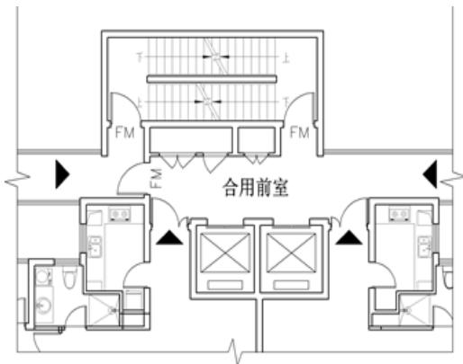

附图 4.2.7-1（）

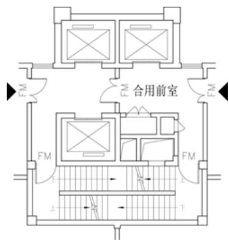

附图 4.2.7-2（）

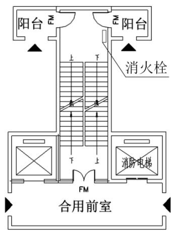

附图 4.2.7-3（×）

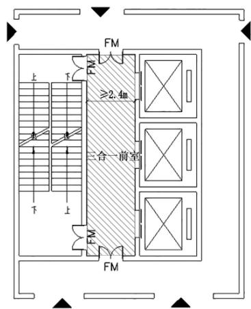

附图 4.2.7-4（）

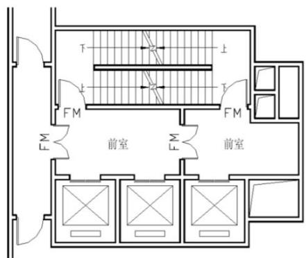

附图 4.2.7-5（×）

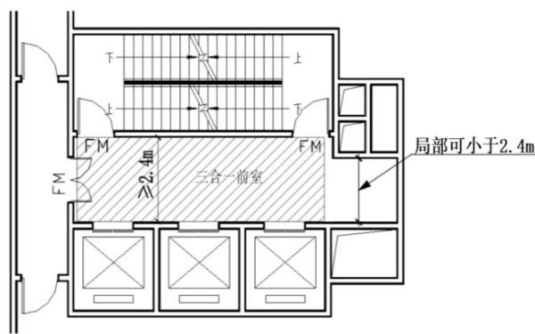

附图 4.2.7-6（）

〔说明〕附图 4.2.7-3、4.2.7-5 不能使用。附图 4.2.7-2 和附图 4.2.7-5 比较，为单个 和两个疏散方向的区别；附图 4.2.7-5 电梯间，当短边大于 $2 . 4 \mathrm { m }$ 且从一个方向进入时， 不需设置中间的分隔门。 

三合一前室短边不应小于 $2 . 4 \mathrm { m }$ 主要针对消防救援时消防队员从消防电梯进入时的 缓冲空间（ $2 . 4 \ : \mathrm { m } \times 2 . 4 \mathrm { m }$ ），不与消防电梯相对部位的局部管道井处可小于 $2 . 4 \mathrm { m }$ 。 

4.2.8 住宅建筑的配套地下车库、储藏室也可与上部建筑一致设置三合一 

前室的剪刀楼梯间。 

4.2.9 住宅建筑的地下车库、储藏室、自行车库，与上部建筑共用同一楼 梯间的，其楼梯最小净宽可与上部住宅楼梯净宽一致。 

4.2.10 多层公共建筑（不含商场、展厅）的疏散楼梯，当分散设置确有困 难且从任一疏散门至最近疏散楼梯间入口的距离不大于 $1 0 \mathrm { m }$ 时，可采用剪 刀楼梯间作为两个安全出口使用，但应符合下列规定： 

1 楼梯间应为防烟楼梯间； 

2 梯段之间应设置耐火极限不低于l.00h 的防火隔墙； 

3 防烟楼梯间的前室应分别设置。 

4.2.11 商场、展厅可设置剪刀楼梯间，但一个防火分区内不得仅设一部剪 刀楼梯间作为两个安全出口使用。 

4.2.12 地下车库可设置剪刀楼梯间，但一个防火分区内不得仅设一部剪刀 楼梯间作为两个安全出口使用。 

4.2.13 用于解决疏散宽度采用的剪刀楼梯间，当其位于多层、裙房或符合 本《指南》第1.5.3条要求的主体建筑投影范围内的附属部分时可采用封闭 楼梯间，两个梯段之间可不设置防火隔墙。 

4.2.14 用于疏散的室外台阶，可不按室外疏散楼梯定性；该室外台阶宽度 应与疏散宽度匹配，当贴临建筑外窗等开口部位时宽度不应小于 $3 \mathrm { m }$ 。 

〔说明〕新增条文。《建筑术语标准（征求意见稿）》中，对台阶和楼梯的概念进 行了区分——“台阶”为“连接不同标高的楼面、地面的阶梯式踏步”，“楼梯”为“由 连续行走的梯级、休息平台以及相应的支承结构组成的作为楼层之间垂直交通用的建筑 部件，一般有围护安全的栏杆（或栏板）、扶手”。室外台阶一般不涉及竖向多个楼层 的连续疏散。 

4.2.15 防烟楼梯间的前室、合用前室、消防电梯前室内允许设置普通电梯 的门，该普通电梯的线缆及装修应符合消防电梯的要求；地下室楼梯间及 前室、合用前室、消防电梯前室内允许设置人防防爆活门。 

〔说明〕增加明确普通电梯的线缆及装修要求。 

4.2.16 防烟楼梯间及封闭楼梯间内不得设置管道井、电缆井，当符合下列 条件时，建筑高度 $3 3 \mathrm { m }$ 及以下住宅建筑的楼梯间内以及住宅建筑的防烟楼 

梯间前室、消防电梯前室、合用前室内（含地下室）可设置管道井和电缆 井：竖井每层封堵；检修门采用乙级防火门；开向敞开楼梯间和防烟楼梯 间前室的户门为乙级防火门。 

4.2.17 当住宅户门为乙级防火门时，住宅的电表箱可设置在防烟楼梯间前 室的管道井内或其他形式的楼梯间内，但电表箱外壳应采用不燃材料。 

4.2.18 除敞开楼梯间和作为防烟楼梯间前室的阳台、凹廊外，其他楼梯间 及前室的内墙上均不得开设与疏散无关的门、窗及洞口。当户门为乙级防 火门时，建筑高度 $3 3 \mathrm { m }$ 及以下住宅建筑的楼梯间（含埋深不超过 $1 0 \mathrm { m }$ 的地 下层且不超过地下二层）内可设置电梯及管道井、电缆井。 

4.2.19 疏散楼梯间、前室或合用前室、消防控制室、消防水泵房、消防电 梯机房等直接开向室外或室外平台的疏散门，可采用普通门。 

当消防控制室、消防水泵房、消防电梯机房等的普通门与相邻疏散楼 梯间及其前室的开口间距小于 $1 . 0 \textrm { m }$ 时，应采取防止火势通过开口蔓延的 措施。 

〔说明〕根据《建筑防火通用规范》第7.1.8条第8款的要求补充明确。 

4.2.20 根据《建筑防火通用规范》第 7.1.8 条第 8 款，疏散楼梯间及其前 室上的开口与建筑外墙上的其他相邻开口最近边缘之间的水平距离，应按 下列规定控制： 

1 防烟楼梯间与其自身的前室（含合用前室）在外墙上的相邻开口间 距可不限； 

2 同一防火分区内不同的疏散楼梯间或前室（含合用前室）在外墙上 的相邻开口间距可不限；当疏散楼梯间或前室（含合用前室）位于防火墙 两侧时，两侧相邻洞口间距不应小于 $2 . 0 \mathrm { m }$ ； 

3 地上和地下疏散楼梯间在首层外墙上的相邻开口间距可不限，但窗 槛墙应符合《建筑设计防火规范》第6.2.5 条的规定； 

4 疏散楼梯间及其前室上的开口与两侧相邻的通风井、排烟井等开口 的间距不应小于 $1 . 0 \mathrm { m }$ 。 

〔说明〕新增条文，细化疏散楼梯间及其前室上的开口与建筑外墙上的其他相邻开 口最近边缘之间的水平距离的控制要求。 

# 4.3 消防电梯和屋顶直升机停机坪

4.3.1 住宅建筑的消防电梯在商业服务网点楼层可不停靠。 

4.3.2 住宅建筑与其他使用功能的建筑合建时，住宅部分和非住宅部分的 消防电梯配置，可根据各自的建筑高度分别按照《建筑设计防火规范》有 关住宅建筑和公共建筑的规定执行。 

4.3.3 当满足安全疏散距离时，住宅建筑设置的跃层所在楼层可不开设户 门，消防电梯可不在跃层停靠。 

4.3.4 需要设置消防电梯的建筑，在同一层内设有多个防火分区时，2 个 防火分区可以合用 1 台消防电梯；确有困难时，地下室的 1 台合用消防电 梯服务的防火分区数量不应超过3个且总面积不应超过 $4 0 0 0 \ \mathrm { m } ^ { 2 }$ 。当合用消 防电梯时尚应满足以下要求：（附图4.3.4） 

1 各防火分区应直接或通过走道进入消防电梯前室； 

2 消防电梯数量不少于 2 台（当其中一台消防电梯受阻时，还可利用 直接相邻防火分区的消防电梯）。 

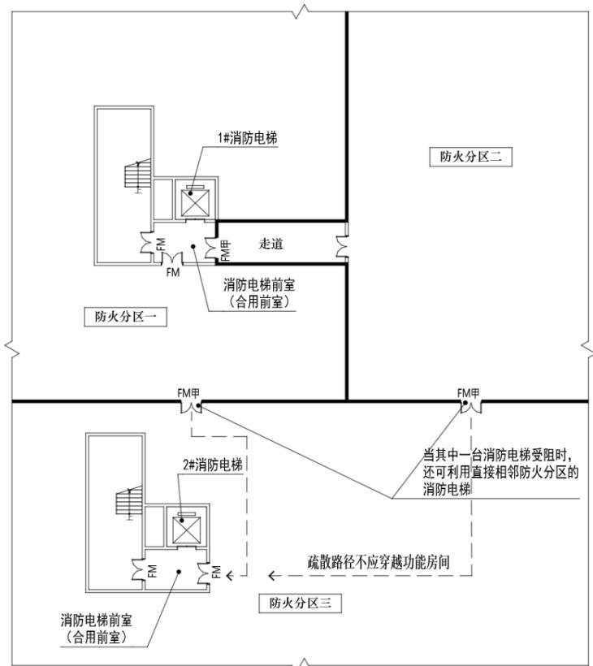

注：防火分区一、二、三的分区面积之和不应大于4000m。

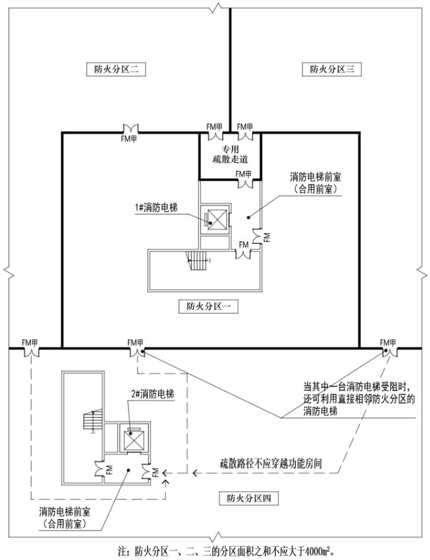

附图4.3.4 消防电梯的合用

〔说明〕修改附图。 

4.3.5 当地下、半地下建筑（室）埋深大于 $1 0 \mathrm { m }$ 的部分划分为独立的防火 分区，与不大于 $1 0 \mathrm { m }$ 的部分采用防火墙和甲级防火门分隔（不应采用防火 卷帘替代），且两部分疏散完全独立时，《建筑防火通用规范》第2.2.6 条 第 6 款中“埋深大于 $1 0 \mathrm { m }$ 且总建筑面积大于 $3 0 0 0 \mathrm { ~ m ~ } ^ { 2 }$ 的地下或半地下建筑 （室）”可仅计算埋深大于 $1 0 \mathrm { m }$ 的部分的总建筑面积。 

当埋深大于 $1 0 \mathrm { m }$ 的地下汽车库与不大于 $1 0 \mathrm { m }$ 的部分按本条前述要求划 分为独立的部分并单独计算总建筑面积时，埋深大于 $1 0 \mathrm { m }$ 的地下汽车库应 设置独立的汽车疏散出口。 

〔说明〕地下、半地下汽车库应计入埋深和总建筑面积，本条内容进行修订。 

4.3.6 直升机停机坪的尺寸为直径不小于 $2 1 \mathrm { m }$ ，直升机救助设施的场地尺 寸为长、宽分别不小于 $1 5 \mathrm { m }$ 、 $1 2 \mathrm { m }$ 。 

# 第五章 消防给水

# 5.1 消防水源

5.1.1 在供水管理部门同意且市政给水管网为环状管网，生产、生活用水 量达到最大且仍能满足室内外消防用水量时，除超高层建筑外消防泵可直 接从市政给水管网吸水。 

〔说明〕局部修改明确。 

5.1.2 符合当地消防车的供水能力，建筑高度不大于 $1 0 0 \mathrm { m }$ 的建筑当采用 可调式减压阀进行分区时，可只在高区设置水泵接合器。 

5.1.3 《消防给水及消火栓系统技术规范》GB 50974-2014（以下简称《消 防给水及消火栓系统技术规范》）第4.3.1条第2款中住宅建筑高度为 $5 4 \mathrm { m }$ 。 

5.1.4 当设消防水池储存室外消防用水时，如市政供水压力满足室外消火 栓要求，在入户引入给水管后应设置室外消火栓，其水量可按《消防给水 及消火栓系统技术规范》第 6.1.5 条的规定计入室外消火栓设计流量，并 应符合《消防给水及消火栓系统技术规范》第7.2.8 条的规定。 

5.1.5 《消防给水及消火栓系统技术规范》的表3.5.2 和第 7.3.4条涉及的 地下建筑、人防工程、地下工程是指独立建造的地下建筑、人防工程、地 下工程。非独立建造的地下室，除地下车库、设备用房、自行车库以及住 宅配套的储藏室外，室内消火栓系统设计流量应按地下建筑计算，且体积 按相应地下部分的体积计算。独立建造的地下汽车库消防用水量可按《汽 车库、修车库、停车场设计防火规范》执行。 

〔说明〕局部修改明确。 

5.1.6 除满足《建筑防火通用规范》第4.3.2 条第4 款住宅和商业设施合建 的情况外，住宅建筑与其他使用功能的建筑合建时，计算室外消防用水量 时火灾延续时间应根据建筑的总高度和建筑规模按公共建筑的规定执行。 

〔说明〕局部文字按规范用语修改。 

5.1.7 消防水箱进水管口最低点高出溢流边缘的空气间隙应按《建筑给水 排水与节水通用规范》GB 55020-2021第 3.2.8 条规定执行，不小于 $1 5 0 \mathrm { m m }$ 。 

〔说明〕引用规范名称及条文号修改。 

5.1.8 《消防给水及消火栓系统技术规范》第 6.1.10 条中的“仅采用稳压 泵稳压”是指未设置高位消防水箱的临时高压消防给水系统。 

5.1.9 体积不大于 $5 0 0 0 \mathrm { m } ^ { 3 }$ 的甲、乙、丙类厂房和体积不大于 $3 0 0 0 { \mathrm { m } } ^ { 3 }$ 的甲、 乙、丙类仓库当建筑内的水消防系统仅有室内消火栓系统时,如设置消防水 池、消防水泵确有困难时，可只设高位消防水箱和水泵接合器，水箱最低 有效水位高于最不利消火栓应不小于 $7 \mathrm { m }$ 。水箱高度不能满足要求时，应 设稳压泵和气压水罐，稳压泵流量不小于 5L/s，扬程应满足最不利点灭火 要求；气压水罐调节容积应保证稳压泵启泵次数不大于 15 次/h，并不小 于 450L。 

5.1.10 《消防设施通用规范》第 3.0.8 条第 4 款中消防水池的报警水位可 按如下规定： 

1 高报警水位高于设计水位 $5 0 \sim 1 0 0 \mathrm { m m }$ ； 

2 低报警水位低于设计水位 $5 0 \sim 1 0 0 \mathrm { m m }$ ； 

3 无水报警水位高于最低有效水位 $5 \mathrm { \sim } 1 0 \mathrm { m i n }$ 的消防用水量且不少于 $1 0 0 \mathrm { m m }$ 。 

〔说明〕引用规范名称、条文号以及相应的文字表达修改。 

5.1.11 室外消火栓系统采用消防水池和消防水泵加压供水时，如距离每幢 建筑外缘 $5 \sim 1 5 0 \mathrm { m }$ 范围内设有由市政给水管网直接供水的室外消火栓，消 防水池可不设取水口。 

5.1.12 大底盘地下室的多幢民用建筑按《消防给水及消火栓系统技术规范》 表3.3.2 计算室外消火栓设计流量时，体积应按地下室与地上最大一幢建筑 单体体积之和计算（可扣除汽车库的体积），并与汽车库的设计流量比较 取较大值。 

〔说明〕新增条文，对《指南（2020版）》第5.1.5条的拆分补充。 

5.1.13 储存室外消防用水量的消防水池取水口可视为《建筑防火通用规范》 第8.1.5 条中规定的室外消火栓。 

5.1.14 采用轻质屋面的中危险I 级及以下民用建筑，当高位消防水箱最低 有效水位高于自动喷水灭火系统最高点喷头确有困难时，可按《自动喷水 灭火系统设计规范》GB 50084-2017 第 10.3.3 条执行。 

〔说明〕上述2条为新增条文。 

# 5.2 消防水泵

5.2.1 消防水池最低有效水位标高不应低于消防水泵房的地坪标高（安装 轴流深井泵的泵房除外），并应符合在消防水池最低有效水位且流量为 1.5 倍设计流量时水泵入口处的负压值不大于 0.02MPa。 

〔说明〕局部修改明确。 

5.2.2 消防水泵出水干管上的压力开关和高位消防水箱出水管上的流量开 关应同时设置且都作为启泵条件。 

5.2.3 装配式水箱一体化消防给水泵站应符合《建筑防火通用规范》第4.1.7 条的相关规定，并应满足抗震、耐腐蚀、防冻、防潮、防淹、通风等要求。 其中地埋式箱泵一体化消防给水泵站仅可在既有建筑改造工程以及新建、 改建和扩建的建筑中的丁类和戊类厂房、室外消火栓设计流量不大于30L/s 的丙类厂房、无地下室且室外消火栓设计流量不大于 30L/s 的单多层民用 建筑中应用，且应符合以下规定： 

1 应根据地基承载力、地面荷载和地下水位高度进行泵站结构验算； 

2 钢结构水箱及泵房的结构承重构件均应采用热镀锌防腐处理，钢结 构及其附件之间应采用热浸镀锌高强度螺栓进行可拆卸连接安装，现场安 装严禁使用焊接工艺破坏镀锌防腐涂层； 

3 地埋式箱泵一体化消防给水泵站的防腐层厚度应满足建筑使用年 限的要求； 

4 地埋式泵站的疏散楼梯应采用不燃材料，楼梯栏杆扶手的高度不应 小于 $1 . 1 0 \mathrm { m }$ ，楼梯的净宽度不应小于 $0 . 8 0 \mathrm { m }$ ，楼梯的倾斜角度不应大于 $4 5 ^ { \circ }$ 。 

〔说明〕新增条文。一体化泵站应由设计单位各相关专业配套出图。钢结构一体化 泵站的水箱内尺寸高度不宜大于 $4 \mathrm { m }$ ，地埋式泵站的顶板覆土不应大于 $2 \mathrm { m }$ ，泵站的组成 部件及安装应符合相关标准，应为有资质专业厂家生产的成套设备，不应采用分散采购 由施工整合的建设模式。 

# 5.3 室内外消火栓系统

5.3.1 建筑高度大于 $5 4 \mathrm { m }$ 的高层住宅建筑当分别设置两个消火栓箱确有 困难时，可在同一个消火栓箱内设置两个栓口，但应分别由两根消火栓竖 

管接出。 

5.3.2 住宅、公共建筑或厂房配套的小型汽车的停车库布置室内消火栓确 有困难时，可采用宽度不小于 $5 0 0 \mathrm { m m }$ 的消火栓箱。 

5.3.3 室内消火栓栓口动压一般应按不大于 0.50MPa 控制压力；有特殊需 求的工程可适当放宽，当大于0.70MPa时必须设置减压装置。 

5.3.4 室内消火栓系统应采用竖向环网布置方式，当确有困难采用水平环 网布置时，系统管道布置及阀门设置应保证人员密集场所的每个防火分区 在检修时至少有 1 支消防水枪的 1 股充实水柱到达室内任何部位，其他场 所检修时关闭的消火栓数量不应超过5 个。 

〔说明〕局部修改明确。 

5.3.5 管径 DN65 的架空管道可以采用沟槽连接件连接、法兰连接或螺纹 连接。 

5.3.6 建筑耐火等级为一、二级的商店、图书馆、档案馆与其他功能合建 的单、多层公共建筑，当不同使用功能场所之间设置符合《建筑设计防火 规范》第 1.0.4 条规定的防火分隔，划分为独立的防火分区、安全疏散独 立设置时，室内消火栓设计流量可分别按不同类别的高度、体积和座位数 对照《消防给水及消火栓系统技术规范》表 3.5.2，选取最大值作为室内消 火栓设计流量。其他多种功能合建的单、多层公共建筑室内消火栓设计流 量，按总高度、总体积和总座位数，对照《消防给水及消火栓系统技术规 范》表 3.5.2，选取最大值作为室内消火栓设计流量。 

5.3.7 汽车库内室内消火栓布置应保证消火栓箱水平投影在划定车位范围 以外，消火栓应在正常停车状态下便于操作。 

# 5.4 自动灭火系统

5.4.1 住宅建筑（群）每个防火分区小于500 ㎡的地下室且分隔成供各住 户独立使用的储藏间或自行车库（住宅套内的地下室除外），当该建筑（群） 设有自动喷水灭火系统时应设自动喷水灭火系统，系统按中危险级 I 级设 计；当该建筑（群）未设自动喷水灭火系统时可不设自动喷水灭火系统， 

但电动自行车充停、充换场所应设置局部应用系统。 

〔说明〕局部修改明确。 

5.4.2 计算机械停车库自动喷水灭火系统设计流量时应附加车架内开启喷 头流量，当仅有 1 层车架内置喷头时，计算开启车架内喷头数量为 8 只， 当为 2 层及以上车架内置喷头时，计算开启车架内喷头数量为 14 只。 

5.4.3 《建筑防火通用规范》第8.1.9 条第7 款：“除本条上述规定外，设置 具有送回风道（管）系统的集中空气调节系统且总建筑面积大于 $3 0 0 0 ~ \mathrm { { m } } ^ { 2 }$ 的 其他单、多层公共建筑”中的总建筑面积可按设置具有送回风道（管）系统 的集中空气调节系统的建筑面积总和计算，当需要设置自动灭火系统时， 可仅在设置具有送回风道（管）系统的集中空气调节系统的防火分区设置； 当空调送回风道（管）不穿越楼板及所服务的房间隔墙可视为不属于具有 送回风道（管）系统的集中空气调节系统的场所，可不设置自动灭火系统。 

〔说明〕引用规范名称及条文编号修改，并修改关于适用范围说明。 

5.4.4 《建筑防火通用规范》第 $8 . 1 . 8 \sim 8 . 1 . 1 0$ 条要求需设置自动灭火系统的 建筑，其配电间、配电小间、弱电间、电信间、电表间、消防值班室等设 备用房可采用自动喷水灭火系统或其他自动灭火系统。 

〔说明〕新增条文。根据《建筑防火通用规范》要求，应采用自动灭火系统，但条 件限制时，可采用合适的灭火系统。 

5.4.5 消防控制室可不设自动灭火系统，但应按现行国家标准《建筑灭火 器配置设计规范》GB 50140 的要求配置灭火器。 

〔说明〕局部修改明确。 

5.4.6 超大城市综合体内的餐馆或食堂，其烹饪操作间的排油烟罩及烹饪 部位应设置专用自动灭火装置，并应在燃气或燃油管道上设置与自动灭火 装置联动的自动切断装置。 

5.4.7 自动喷水灭火系统配水干管最大压力可按不超过 1.60MPa。 

5.4.8 二类高层宿舍建筑的房间和走道应设置自动喷水灭火系统。 

5.4.9 屋顶排烟风机、加压送风机与其他通风机、空调机合用机房，当设 置自动喷水灭火系统有困难时，可不设置自动灭火系统。 

5.4.10 下列变配电所应设置自动灭火系统，并宜采用气体灭火系统： 

1 设置在高层民用建筑主体投影范围内的变配电所； 

2 设置在高层民用建筑裙房、地下室为高层民用建筑服务且有消防负 荷的其他变配电所； 

3 设置在建筑面积大于 10 万平方米的商业综合体内的变配电所； 

4 设置在地下室为建筑面积大于 10 万平方米的商业综合体服务且 有消防负荷的变配电所。 

〔说明〕《指南（2020版）》第5.5.2条移入本节并修改条文编号。 

# 5.5 其他灭火系统

5.5.1 地下汽车库的建筑灭火器配置可按 A 类火灾中危险级设计，集中布 置的充电设施区域应按严重危险级设计。 

〔说明〕局部删除后按现行标准执行。 

5.5.2 商业建筑灭火器配置的危险等级可按《建筑灭火器配置设计规范》 GB 50140-2005 附录 D 确定。 

〔说明〕《指南（2020版）》第5.5.3条，内容不变，序号调整。 

# 第六章 消防电气

# 6.1 消防电源及其配电

6.1.1 建筑物内10kV及以上供电线路电缆的设计和敷设，应满足设计火灾 延续时间内连续供电的需要。 

〔说明〕本条对《指南（2020版）》第6.2.1条做修订，用词根据《建筑防火通用 规范》第 10.1.5、10.1.7 条做适当修改，特别对 10kV 及以上供电线路提出了设计和敷 设的综合防火技术要求。 

6.1.2 设计火灾延续时间不小于 2 小时的建筑内，敷设在消防水泵房、消 防电梯机房和消防控制室内的由消防配电箱（柜）和控制箱（柜）引出的 消防线缆设计选型可采用耐火性能试验条件满足供火时间 90min 的耐火线 缆。 

〔说明〕本条为新增条文。《建筑防火通用规范》第10.1.7条对于消防配电线路的 设计和敷设提出了强制性规定，但是对消防配电箱（柜）的出线线缆和消防用电设备比 如风机、水泵等低压电动机的主回路线缆选型未做规定。其中“耐火性能试验条件供火 时间”表述，来自《阻燃及耐火电缆性能要求和试验方法》XF/T 306-2025 第 5.2 节相 关内容，但并没有规定要求的试验方法。 

6.1.3 除防火卷帘、消防潜污泵、活动挡烟垂壁、电动排烟窗、自动跟踪 定位射流灭火装置、无机房消防电梯等的控制箱外，设置在民用建筑内部 消防用电设备的配电箱和控制箱应安装在其消防用电设备机房或配电小间 内。 

〔说明〕本条修订注明了本条规定的适用范围，与《民用建筑电气设计标准》GB 51348-2019协调。其他建筑或场所消防用电设备的配电箱和控制箱的安装应符合现行相 关标准的规定。 

6.1.4 用于防火分隔且按一、二级消防负荷供电的多个防火卷帘，当涉及 3 个及以上防火分区时，应采用放射式供电。（附图6.1.4） 

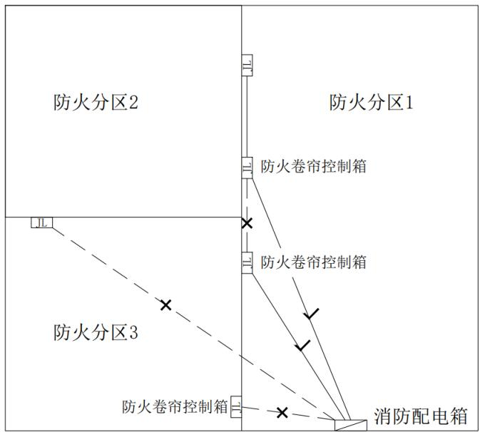

附图6.1.4 多个防火分区多个防火卷帘供电示意图

〔说明〕对示意图进行了修改，更加清晰地表达了对防火卷帘配电的要求。消防配 电箱应设置在配电小间或消防用电设备机房内。 

# 6.1.5 当同一消防风机房内设置两台及以上消防风机时，应采用以下两种 供电方式之一：

1 由设置在机房内消防双电源末端切换配电箱放射式供电（附图 6.1.5-1）； 

2 当一个机房内的消防风机仅服务于本防火分区时，每台消防风机由 相互独立的控制箱供电，各控制箱电源由消防风机房所在防火分区的消防 双电源切换配电箱放射式供电（附图6.1.5-2）。 

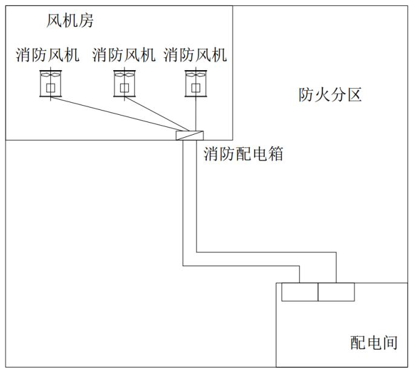

附图6.1.5-1 同一机房内多台消防风机供电示意图（一）

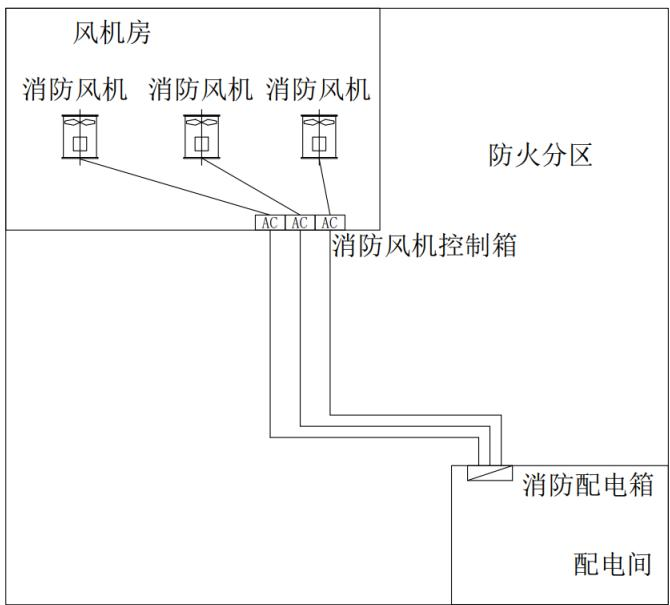

附图6.1.5-2 同一机房内多台消防风机供电示意图（二）

〔说明〕本条为新增条文，根据《建筑防火通用规范》第10.1.6条给出明确可行的 方案。对于一个机房的风机服务于多个防火分区时只能采用附图6.1.5-1方案。 

6.1.6 《建筑设计防火规范》第10.1.10条中的“电缆井、沟”是指除室外、 变电所及建筑物内低压总进线间以外的电缆竖井和电缆沟。 

〔说明〕本条对《指南（2020版）》第6.1.5 条做修订，明确电缆井和电缆沟的适 用范围。 

6.1.7 除另有规定外，公共建筑同一楼层相邻防火分区的消防风机、防火 卷帘、电动排烟窗、消防潜污泵、电动挡烟垂壁等设备的消防配电箱共用 配电间时，应符合下列规定： 

1 共用配电间应位于防火分区交界处，配电间的墙体除分区处的防火 墙外，应采用耐火极限不低于3.00h的防火隔墙，房间门应为甲级防火门； 

2 电气线路穿越墙体处应采取防火封堵措施，防火封堵组件的耐火性 能不应低于防火分隔部位的耐火性能要求； 

3 各防火分区的消防配电箱应单独设置； 

4 引至不同防火分区的线路应由配电间直接敷设至该防火分区。 

〔说明〕本条为新增条文。本条“交界处”是指同一楼层内相邻的防火分区的交界 处，且配电间与各防火分区贴邻布置。其中消防风机的控制要求需要满足本《指南》第 6.1.5 条第 2 款要求。 

# 6.2 消防应急照明和疏散指示系统

6.2.1 消防应急照明和疏散指示系统灯具设置部位和地面最低水平照度除 应符合现行国家标准《建筑防火通用规范》GB 55037、《建筑设计防火规 范》GB 50016、《消防应急照明和疏散指示系统技术标准》GB 51309 的规 定外，尚应符合国家、行业现行有关标准的规定。 

〔说明〕对于地面最低水平照度，应按各标准中照度较高的规定执行。 

6.2.2 除另有规定外，公共建筑同一楼层相邻防火分区的消防应急照明和 疏散指示系统集中电源共用配电间时，应符合下列规定： 

1 共用配电间应位于防火分区交界处，配电间的墙体除分区处的防火 墙外，应采用耐火极限不低于3.00h的防火隔墙，房间门应为甲级防火门； 

2 电气线路穿越墙体处应采取防火封堵措施，防火封堵组件的耐火性 能不应低于防火分隔部位的耐火性能要求； 

3 各防火分区的集中电源应单独设置； 

4 引至不同防火分区的消防应急照明及疏散指示系统的线路应由配 电间直接敷设至该防火分区。 

〔说明〕本条为新增条款。本条“交界处”是指同一楼层内相邻防火分区的交界处， 且配电间与各防火分区贴邻布置。 

6.2.3 独立建造的建筑面积不大于 $1 0 0 \mathrm { ~ m } ^ { 2 }$ 且内部无疏散通道的传达室、公 共厕所、垃圾房等单层民用建筑可不设置消防应急照明及疏散指示系统。 

〔说明〕本条为新增条款。对此种类型建筑内的消防应急照明和疏散指示标志提出 了可选择的技术措施。 

# 6.3 火灾自动报警系统

6.3.1 除规范规定的设置场所外，二类高层建筑中宿舍的房间及其公共活 动用房应设置火灾自动报警系统。 

建筑高度大于 $5 4 \mathrm { m }$ 的住宅建筑，其套内应设置具有声报警功能的火灾 探测器。 

〔说明〕修订删除了“旅馆的客房”，因为《建筑防火通用规范》第 8.3.2 条已做 了规定。本条强调了住宅套内火灾探测器声报警功能的要求。 

6.3.2 设置集中报警系统或控制中心报警系统的建筑应在楼梯间内设置火 灾探测器。 

6.3.3 设置火灾自动报警系统的建筑物内配电间、弱电间、UPS 间和电气 竖井等电气场所内的感烟火灾探测器不应少于2 只。 

〔说明〕本条为新增条款。对于提高小型电气和智能化机房火灾探测的可靠性提出 了更高要求。 

6.3.4 未设置火灾自动报警系统的建筑当设有防火卷帘时，应选择自带火 灾探测器的防火卷帘控制器，并在防火卷帘两侧设置火灾探测器，控制防 火卷帘动作。 

6.3.5 设置火灾自动报警系统的住宅建筑，火灾声警报器应每层设置。 

6.3.6 区域型火灾自动报警系统可以采用火灾报警控制器控制输出点直接 控制相关场所或部位的消防风机、电动排烟窗、活动挡烟垂壁或防火卷帘 等设备，并在火灾报警控制器上的手动直接控制按键上（或附近）设置明 显标识。 

〔说明〕本条对《指南（2020版）》第6.3.5条做修订，统一用语。 

6.3.7 建筑物内下列用电负荷可经人工确认后切断： 

1 生活水泵、安全防范系统设施等在火灾时可起到辅助作用的用电负 荷； 

2 断电后可能造成不良后果的特殊场所用电负荷。 

〔说明〕本条对《指南（2020版）》第6.3.6 条做修订，增加了对起辅助作用的用 电负荷需在必要时进行手动切除的要求。本条中的特殊场所指的广播电视中心、医院、 电厂、机场航站楼等重要建筑中的保障人员和重要财产安全的场所。 

6.3.8 设置电动汽车充电设施或存放电动汽车的汽车库应设置火灾自动报 警系统，并宜设置具备火灾图像识别功能的火灾自动报警系统；当汽车停 车数量不大于10 辆时，火灾自动报警系统可采用能够远程传输报警和故障 信号的独立式感烟火灾探测报警器。 

〔说明〕本条为新增条文。对停放电动汽车及设置电动汽车充电设施汽车库的防火 技术提出了要求。 

# 第七章 防烟、排烟及供暖、通风和空气调节

# 7.1 防烟系统

7.1.1 对于建筑高度超过 $5 0 \mathrm { m }$ 的高层公共建筑，其裙房中符合自然通风条 件的楼梯间，可采用自然通风方式防烟；设置于建筑主楼投影范围内且仅 服务于建筑高度 $2 4 \mathrm { m }$ 以下的附属部分以及附楼部分（建筑高度小于或等于 $5 0 \mathrm { m } )$ ）的封闭楼梯间、防烟楼梯间及其前室（含合用前室、消防电梯前室）， 当其符合自然通风条件时，也可采用自然通风方式防烟，但该楼梯间所服 务的附属部分与主楼其他部分之间、附楼与主楼之间应采取防火分隔措施 （防火墙、甲级防火门或特级防火卷帘），如附图7.1.1所示。 

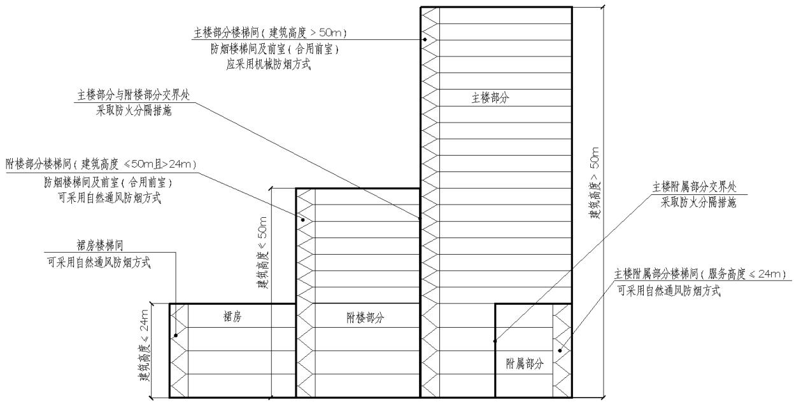

附图 7.1.1

该建筑主体地下室部分的防烟楼梯间及其前室（含合用前室、消防电 梯前室）应采用不低于其地上部分的防烟设计标准，但当地下楼梯间与其 相应的地上楼梯间之间采用无门窗洞口的防火墙或楼板完全分隔，且在首 层与地上楼梯间分别直通室外时，可按独立的地下楼梯间进行防烟设计。 

〔说明〕完善了本条相关内容的表述，附图补充了主楼附属部分的相关要求。地下 楼梯间在首层与地上楼梯间分别直通室外是指不通过同一个走道或门厅通至室外。 

7.1.2 与消防电梯前室合用的共用前室（即“三合一”前室）宜采用加压送 风的防烟方式；当采用自然通风防烟方式时，该前室应设置为全敞开的阳 

台或凹廊，或设置两个及以上不同朝向的可开启外窗且两个外窗面积分别 不小于 $3 . 0 \ \mathrm { m } ^ { 2 }$ 。 

〔说明〕本条删除了剪刀楼梯间的相关内容，新增了“三合一”前室采用自然通风 方式防烟时的要求。 

7.1.3 《防排烟标准》第 3.1.3 条第 2 款中，当防烟楼梯间采用自然通风防 烟方式时，其独立前室、共用前室及合用前室的加压送风口的布置应满足 以下要求： 

1 当送风口设置于前室顶部时，不应贴邻楼梯间疏散门布置；（如附 图 7.1.3-1 所示） 

2 对于住宅建筑，当送风口设置在前室墙面时，该送风口不应正对或 贴邻楼梯间疏散门（如附图 7.1.3-2、3 所示），也不应被门遮挡。（如附 图 7.1.3-4 所示） 

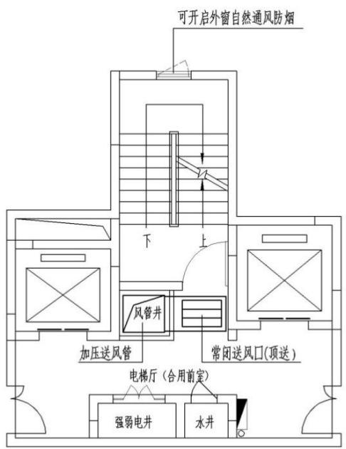

附图 7.1.3-1（×）

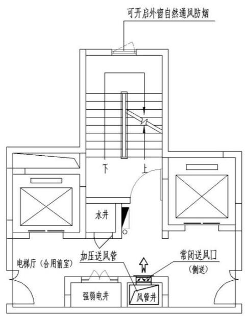

附图 7.1.3-2（×）

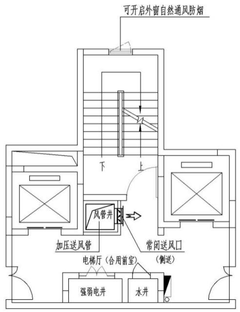

附图 7.1.3-3（×）

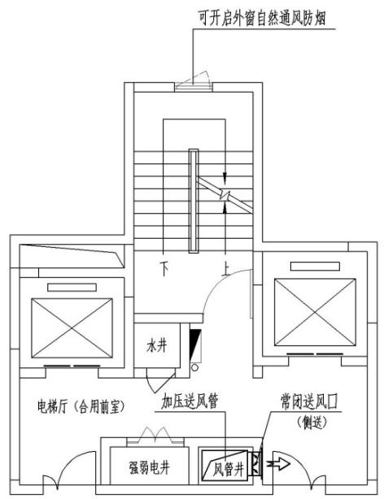

附图 7.1.3-4（×）

〔说明〕完善了本条相关内容的表述。

7.1.4《防排烟标准》第3.1.5条第1款中，当仅有一个门与走道或房间相通 的独立前室内设有电梯门时，该前室应按设有多个门考虑，设置机械加压 送风系统。 

〔说明〕新增条文，补充了当独立前室内设有电梯门的防烟要求，其送风量可参照 合用前室的要求确定。 

7.1.5 《防排烟标准》第3.2 节中，封闭楼梯间、防烟楼梯间、前室（或合 用前室、消防电梯前室）的可开启外窗面积是指外窗可开启部分的面积（应 为活动窗扇面积）。可开启外窗尚应按《防排烟标准》第4.3.5 条的规定核 算其开启的有效面积，且有效面积不应小于可开启外窗面积的三分之一。 

楼梯间、前室（或合用前室、消防电梯前室）的自然通风可开启外窗 的设置高度及开启方向除应符合《防排烟标准》相关规定外，前室（或合 用前室、消防电梯前室等）可开启外窗的上沿还应贴其上部梁底、上部层 间防火封堵部位的幕墙板块或吊顶底设置。 

〔说明〕本条为《指南（2020 版）》第 7.1.4 条修订，补充了“可开启外窗面积” 的含义，完善了相关内容的表述。 

7.1.6 《防排烟标准》第3.2.1条中，当建筑高度大于 $1 0 \mathrm { m }$ 时，楼梯间外墙 上每 5 层内可开启外窗或开口的总面积不应小于 $2 . 0 \mathrm { ~ m } ^ { 2 }$ （可包含顶部设置 

的面积不小于 $1 . 0 \mathrm { ~ m } ^ { 2 }$ 的可开启外窗或开口面积），且布置间隔应满足不设 置可开启外窗或开口的连续楼层数不多于2 层的要求。 

地上敞开楼梯间应按封闭楼梯间的要求设置可开启外窗（开口），且 应在疏散走道（敞开外廊除外）与其连接处上方设置挡烟设施（如挡烟垂 壁），其下缘距地面的净空高度不应小于 $2 . 0 \mathrm { m }$ 。 

〔说明〕局部补充完善《指南（2020版）》第7.1.5条，明确了当建筑高度大于 $1 0 \mathrm { m }$ 时，楼梯间外墙上可开启外窗或开口的设置要求；当疏散走道为敞开外廊时连接处可不 设置挡烟设施。 

7.1.7 当地下一、二层楼梯间的可开启外窗设置于楼梯间最高部位确有困 难时，可设于该楼梯间最高休息平台外墙上部（如附图7.1.7 所示），但应 满足以下条件： 

1 地下室使用功能仅为汽车库、设备用房或非机动车库； 

2 地下楼梯间在首层与地上部分按《建筑防火通用规范》第7.1.10 条 第3 款的规定进行了防火分隔； 

3 该可开启外窗应贴梁底布置。 

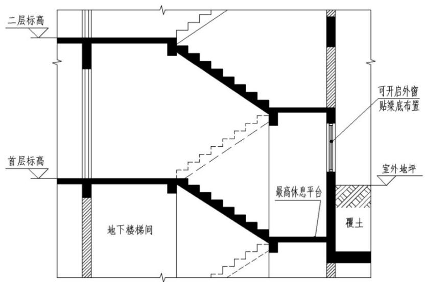

附图 7.1.7

〔说明〕补充、完善了《指南（2020版）》第7.1.6条的适用场所和相关表述。 

7.1.8 建筑地下部分的楼梯间及前室（或合用前室、消防电梯前室），其 防烟设计应符合《消防设施通用规范》、《防排烟标准》及下列规定： 

1 对于地下一、二层的封闭楼梯间，除了《防排烟标准》第 3.1.6 条 规定的情况外，当采用自然通风防烟方式时，应在楼梯间的外墙上设置不 小于 $2 ~ \mathrm { { m } } ^ { 2 }$ 可开启外窗，且其中在最高部位设置不小于1㎡可开启外窗； 

2 对于地下一、二层（且最底层室内地面与室外出入口地坪高差小于 或等于 $1 0 \mathrm { m }$ ）的防烟楼梯间，除本《指南》第7.1.9 条对住宅建筑有特殊规 定的情况外，当采用自然通风方式防烟时，应在地下楼梯间的外墙上设置 不小于 $2 ~ \mathrm { { m } } ^ { 2 }$ 可开启外窗，且其中在最高部位设置不小于 $1 ~ \mathrm { { m } } ^ { 2 }$ 可开启外窗； 

3 对于地下三层及以上（或最底层室内地面与室外出入口地坪高差大 于 $1 0 \mathrm { m }$ ）的防烟楼梯间及前室（或合用前室、消防电梯前室），除贴邻下 沉式广场等室外空间布置、层数不大于3 层且满足自然通风要求的情况外， 应采取机械加压送风的防烟方式。 

〔说明〕补充完善了《指南（2020版）》第7.1.7条的相关表述，具体内容未作调 整。 

7.1.9 对于地下一、二层（且最底层室内地面与室外出入口地坪高差小于 或等于 $1 0 \mathrm { m }$ ）的住宅建筑地下室，如该建筑防烟楼梯间的地上部分采用自 然通风方式防烟，则其不具备自然通风条件的地下部分可不设置机械加压 送风系统；如该楼梯间地上部分的前室（或合用前室、消防电梯前室）采 用自然通风方式防烟，则其地下部分相应的前室（或合用前室、消防电梯 前室）可不设置防烟设施。但应同时满足以下条件： 

1 该防烟楼梯间及前室（或合用前室、消防电梯前室）所服务的地下 室防火分区的使用功能仅为汽车库、设备用房； 

2 地下防烟楼梯间在首层与地上部分按《建筑防火通用规范》第7.1.10 条第3 款的规定进行了防火分隔； 

3 地下防烟楼梯间在首层设置了有效面积不小于 $1 . 2 ~ \mathrm { { m } } ^ { 2 }$ 的可开启外窗 或不与地上楼梯间共用的且直通室外的疏散门。 

〔说明〕补充、完善了《指南（2020版）》第7.1.8条第1款，明确了该部分地下 室是指楼梯间服务的相应地下室防火分区，当该防火分区内设有电动自行车库时，不适 用于本条；《指南（2020版）》第7.1.8 条第2款在《建筑防火通用规范》中已有规定， 故完善了表述，其他内容未作调整。 

7.1.10 建筑首层扩大封闭楼梯间、防烟楼梯间扩大前室（含独立前室、合 用前室、共用前室及“三合一”前室）或低危门厅，宜采用自然通风方式防 烟，不受建筑高度限制，其自然通风设施的设置应符合下列规定： 

1 当其建筑面积大于 $1 0 0 ~ \mathrm { { m } } ^ { 2 }$ 且小于等于 $3 0 0 ~ \mathrm { { m } } ^ { 2 }$ 时，其可开启外窗或开 口面积不应小于其地面面积的 $2 \%$ ，且不小于 $3 ~ \mathrm { { m } } ^ { 2 }$ ；当其建筑面积大于300 ㎡时，其可开启外窗或开口面积不应小于门厅地面面积的 $3 \%$ （当空间净高 

大于 6m 时不应小于其地面面积的 $5 \%$ ）； 

2 当其建筑面积小于等于 $1 0 0 ~ \mathrm { { m } } ^ { 2 }$ 时，可采用可开启外窗（口）或疏散 外门（不含防火门）作为自然通风设施，其中扩大封闭楼梯间、扩大独立 前室或消防电梯前室的可开启外窗（开口）的面积不应小于 $2 ~ \mathrm { { m } } ^ { 2 }$ ，扩大合 用前室、共用前室、“三合一”前室或低危门厅的可开启外窗（开口）面积 不应小于 $3 ~ \mathrm { { m } } ^ { 2 }$ ； 

3 上述可开启外窗应设置于该空间的上部。 

〔说明〕删除了《指南（2020版）》第7.1.9条的部分内容，补充、完善了首层由 门厅、走道形成的扩大封闭楼梯间、防烟楼梯间扩大前室及低危门厅采用自然通风方式 防烟时的相应要求。可开启外窗应设置于空间净高1/2以上的上部空间。 

7.1.11 建筑面积大于 $1 0 0 ~ \mathrm { { m } } ^ { 2 }$ 的首层低危门厅、扩大前室（或扩大封闭楼梯 间），当受条件限制采用防烟方式确有困难时，可采用机械排烟方式，但 排烟系统应独立设置，不应与其他场所合用。 

当空间净高大于6m时，排烟量应按《防排烟标准》第4.6.6条～第4.6.13 条的相关规定计算确定，且不应小于按门厅、扩大前室（或扩大封闭楼梯 间）体积不小于6次/h换气次数进行计算的排烟量。 

当空间净高小于或等于6m时，排烟量应按不小于60m³／（h·㎡）计 算，且不应小于 $1 5 0 0 0 \mathrm { m } ^ { 3 } / \mathrm { h }$ 。 

〔说明〕新增条文，建筑面积大于 $1 0 0 ~ \mathrm { { m } } ^ { 2 }$ 的首层低危门厅、扩大前室（或扩大封 闭楼梯间），由于空间较大且可能存在一定的火灾危险性，当受条件限制采用防烟方式 确有困难时，可采取排烟方式。 

当其净高大于 6m 时，可按《防排烟标准》第4.6.6 条～第4.6.13条进行排烟设计， 火灾热释放率Q可根据门厅的具体情况确定：4MW（无喷淋）/1.0MW（有喷淋）, 设 计清晰高度不应小于 $3 . 5 \mathrm { m }$ ；当中庭式门厅的连通空间（楼面开口）最大投影面积小于 或等于 $2 0 0 ~ \mathrm { m } ^ { 2 }$ 且符合相关规定时，也可按本《指南》第7.2.36条执行。 

条文还明确了空间净高小于或等于 6m 的门厅当受条件限制而采用机械排烟方式 时的相关要求。 

7.1.12 对于高层病房楼和老年人照料设施的避难间，当采用机械加压送风 方式防烟时，其加压送风量应按避难间的余压值（在门关闭状态下）不小 于 25Pa 计算，且不应小于 $3 0 \mathrm { ~ m } ^ { 3 } / \mathrm { m } ^ { 2 } \cdot \mathrm { h }$ 。加压送风系统的计算送风量应按 该系统服务的所有避难间同时送风的风量计算。避难间尚应设置可开启外 窗，其有效面积不应小于该避难间地面面积的 $1 \%$ ，且不小于 $0 . 7 ~ \mathrm { { m } } ^ { 2 }$ 。 

防火隔间可不设置防烟设施，但无关管线不应穿越，并符合本《指南》 

第 7.2.19 条的规定。 

〔说明〕本条删除了《指南（2020 版）》第 7.1.10 条中与《消防设施通用规范》 不一致的内容，并根据《建筑防火通用规范》第7.1.16条第5款的规定，补充了避难间 设置可开启外窗的面积要求；还明确了防火隔间的相关要求。 

7.1.13 《消防设施通用规范》第 11.2.2 条第 3 款、第 11.3.3 条第 2 款中的 机械加压送风系统、机械排烟系统的系统服务高度，均是指自系统所服务 楼层区段的最底层楼板至最高层顶板之间的高差，不含服务区段外的风管 高度。 

〔说明〕本条修订《指南（2020版）》第 7.1.11条，补充了《消防设施通用规范》 中机械加压送风系统、机械排烟系统中“系统服务高度”的含义。 

7.1.14 加压风机的进风口与排烟风机的出风口位置和间距应符合《防排烟 标准》及下列规定： 

1 进风口不宜与排烟出口设在同一面上，当确有困难需设在同一面且 两者边缘水平距离小于 $2 0 . 0 \mathrm { m }$ 时，进风口应低于排烟出口，且两者边缘垂 直距离不应小于下式计算值： 

$$
h = \frac {6}{2 0} \sqrt {2 0 ^ {2} - l ^ {2}}
$$

式中：h——送风机进风口与排烟风机出风口的边缘最小垂直距离（m）； 

1——送风机进风口与排烟风机出风口的边缘水平距离（m）。 

2 当两者处于相邻的建筑立面时，进风口不应高于排烟出口。如两个 面之间外夹角小于 $1 8 0 ^ { \circ }$ 或两个面之间外夹角大于 $1 8 0 ^ { \circ }$ 且小于 $2 2 5 ^ { \circ }$ ，则两者 之间的水平和垂直距离应符合《防排烟标准》第3.3.5条及本条第1 款的相 关规定，如附图 7.1.14-1 所示；如两个面之间外夹角大于或等于 $2 2 5 ^ { \circ }$ ，则 两者之间的水平折线距离不应小于 $1 0 \mathrm { m }$ ，或垂直距离不应小于 $3 \mathrm { m }$ 且水平 折线距离不应小于 $4 \mathrm { m }$ ，如附图 7.1.14-2 所示。 

3 补风系统的室外进风口不应高于机械排烟风机的出风口，两者水平 距离不应小于 $1 0 \mathrm { m }$ ，或垂直距离不应小于 $3 \mathrm { m }$ 。 

4 位于建筑架空层中的进风口应接至架空层外沿或安全区域，排烟口 应接至架空层外沿；应采取有效措施，防止火灾烟气被进风口吸入。 

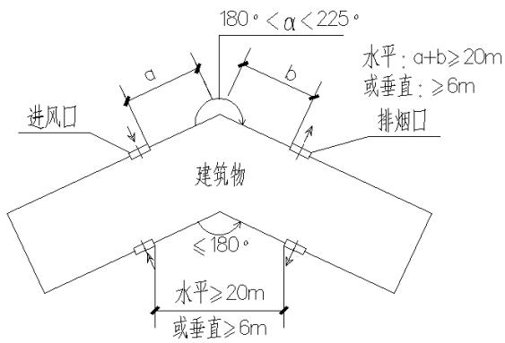

附图 7.1.14-1

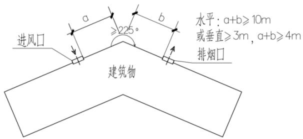

附图 7.1.14-2

〔说明〕本条修订《指南（2020 版）》第 7.1.12 条，调整、补充、完善了加压风 机进风口与排烟风机出风口设置的相关要求，补充了位于建筑架空层中的进风口、排烟 口的设置要求。“安全区域”的设置要求详见本《指南》第4.1.11条、第 4.1.12条。 

7.1.15 受条件限制设置专用机房确有困难的加压风机、补风机可设置于室 外，但其周围至少 6m 范围内不应布置可燃物，且必须设置满足防护（防 雨、防晒、抗风）、通风散热及检修要求的防护罩（应有制作大样图及安 装图），防护罩应采用不燃材料制作，且其耐火极限不应低于1.00h。 

当加压送风机独立布置确有困难时，可以与补风机合用机房。当受条 件限制加压送风机、补风机确需与其他通风机、空调机、水泵房等合用机 房时，除应符合专用机房的相关要求外，还应符合下列条件： 

1 机房内应设有自动喷水灭火系统； 

2 机房内不得设有用于排烟和事故通风的排风机与管道。 

当风机设置于机房内时，风机控制柜应放置在机房内；当风机设置于 室外时，风机控制柜宜设置在附近公共部位，并应采取防碰撞、防误操作 等防护措施。 

〔说明〕本条修订《指南（2020 版）》第 7.1.13 条，删除了《防排烟标准》已有 规定的内容，本条中受条件限制设置专用机房确有困难的情况，主要是指既有建筑改造 

工程、受航空或规划限高影响的工程等情形，补充明确了防护罩应采用不燃材料制作， 防护罩的耐火极限可通过采用具有相应耐火极限的复合板材（如镀锌钢板、岩棉、防火 板等材料复合制成的复合板等）制作来实现。其他内容未作调整。 

7.1.16 前室（或合用前室）的机械加压送风系统，当其所服务的楼层数小 于或等于 3 层时，前室（或合用前室）送风口可采用常开百叶风口，但应 在送风口附近设置送风机的手动启动信号按钮。 

〔说明〕本条为《指南（2020版）》第7.1.14条。 

7.1.17 机械加压送风系统、机械排烟系统及机械补风系统的管道应采用风 管，不应采用土建风道（地铁、城市交通隧道、水电工程、水利工程等采 用混凝土浇筑且内壁光滑的风道、风井除外），其中加压送风机、补风机 的吸入段及排烟风机的压出段，受条件限制采用风管确有困难时可采用土 建风道，但其中水平管道应采用满足耐火极限的风管或混凝土风道。 

〔说明〕本条修订《指南（2020 版）》第 7.1.15 条，根据《通风与空调工程施工 质量验收规范》GB 50243-2016中有关风管、风道的术语定义，完善了条文的相关表述。 

7.1.18 水平设置的加压送风管不宜穿越防火分区，当确需穿越时，穿越其 他防火分区送风管的耐火极限不应低于 1.50h。竖向设置的加压送风管道， 当仅与其他加压送风管或金属材质水管合用管道井时，加压送风管道的耐 火极限可不作要求；当与补风管道合用管道井时，加压送风管、补风管道 的耐火极限应符合《防排烟标准》的相关规定。 

〔说明〕本条修订《指南（2020 版）》第 7.1.16 条，补充了加压送风管与补风管 道合用管井时的设置要求。 

7.1.19 加压送风管在穿越楼梯间、前室等安全区域内的防火隔墙（不含相 邻其他区域与楼梯间、前室等安全区域交界处的防火隔墙）处以及加压送 风进风管在穿越外墙处可不设置 $7 0 \mathrm { { ^ \circ C } }$ 防火阀（如附图7.1.19 所示），但该 风管的耐火极限不应低于 $1 . 5 0 \mathrm { h }$ 。 

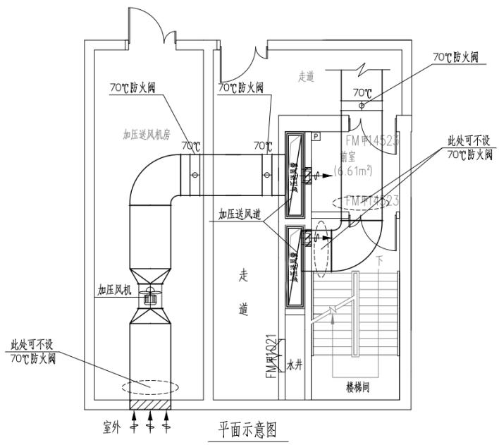

附图 7.1.19

〔说明〕新增条文，补充明确了加压送风系统管道在穿越防火隔墙（包括外墙）时 的相关要求。加压送风管在穿越楼梯间、前室等安全区域与相邻其他区域交界的防火隔 墙处应设置防火阀；穿越楼梯间、前室等安全区域内的防火隔墙时可不设置防火阀，但 该风管应具有一定的耐火极限。 

7.1.20 对于采用自然通风方式的住宅建筑剪刀楼梯间，其对应的共用前室 （或“三合一”前室）进行加压送风量计算时，采用的门洞风速应符合《防 排烟标准》第3.4.6条及本《指南》第7.1.22 条的规定，且不应小于 $1 . 8 \mathrm { m / s }$ 。 

〔说明〕本条为《指南（2020版）》第7.1.17条。 

7.1.21 对住宅建筑中的前室（或合用前室、共用前室及“三合一”前室等） 进行送风量设计（计算）时，子母门（户门）可以按单扇门考虑。 

〔说明〕本条为《指南（2020版）》第7.1.18条。 

7.1.22 楼梯间、前室（或合用前室、共用前室及“三合一”前室等）加压 送风量计算及其相关数据取值应符合《防排烟标准》及下列规定： 

1 进行送风量计算时，应按最不利的相邻 $\Nu _ { 1 }$ （设计疏散门开启的楼 层数）个楼层进行取值计算。所谓最不利楼层是指疏散门最多或疏散门尺 寸最大造成疏散门总断面面积最大的楼层。当住宅建筑地下室仅为汽车库、 设备用房、非机动车库时，其地下各层前室疏散门的截面面积 $\mathbf { A } _ { \mathbf { k } }$ 可分别按 该层前室最大一个门的面积取值。 

2 $\Nu _ { 1 }$ 取值除了应符合《防排烟标准》第 3.4.6 条的规定外，尚应满足 以下要求： 

当地下室功能仅为汽车库、非机动车库和设备用房时，地下楼梯间的 $\Nu _ { 1 }$ 值可按不小于 1 取值；当地下室功能除了汽车库、非机动车库和设备用 房外，还有其他功能（人员或可燃物较多）时，如地下室层数大于或等于 3 层，则地下楼梯间的 $\Nu _ { 1 }$ 值应按3 取值，如层数小于3，则 $\Nu _ { 1 }$ 值应按实际 楼层数量取值。 

对于加压送风系统服务楼层小于 3 层的前室（或合用前室、共用前室 及“三合一”前室等）， $\Nu _ { 1 }$ 值应按实际楼层数量取值。 

3 当楼梯间采用自然通风防烟而前室（或合用前室、共用前室及“三 合一”前室等）采用机械加压送风时，前室疏散门门洞断面风速 v 值计算 涉及的 $\mathrm { A _ { g } }$ 、 $\mathbf { A } _ { 1 }$ 值计算应满足以下要求： 

$\mathrm { A _ { g } }$ 是指单个计算楼层前室（或合用前室、共用前室及“三合一”前室等） 疏散门的计算总面积；对于公共建筑、工业建筑，该计算总面积为该楼层 前室（或合用前室、共用前室及“三合一”前室等）所有疏散门的面积之 和；对于住宅建筑，该计算总面积为该楼层前室（或合用前室、共用前室 及“三合一”前室等）尺寸最大一个疏散门的面积。 

$\mathbf { A } _ { 1 }$ 是指该计算楼层相应的楼梯间疏散门的总面积。 

4 封闭楼梯间与走道之间的压差应为 $2 5 { \sim } 3 0 \mathrm { P a }$ ，门开启时的门洞断面 风速不应小于 $1 . 0 \mathrm { m / s }$ 。 

〔说明〕本条修订《指南（2020 版）》第 7.1.19 条，补充、完善了条文的相关表 述，具体内容未作调整；把原第 7.1.20条中有关封闭楼梯间余压值等的要求整合于本条。 

7.1.23 对于户门直接开向前室的住宅，前室加压送风系统的余压传感器走 道侧的压差取压点可设置于自然通风的防烟楼梯间或室外。 

〔说明〕删除了《指南（2020 版）》第 7.1.20 条有关楼梯间、前室余压值的控制 要求，该要求在《消防设施通用规范》第 11.2.5 条中已有明确规定，把《指南（2020 版）》第7.1.20条中有关封闭楼梯间余压值的要求整合至本《指南》第7.1.22条；新增 了住宅前室加压送风系统的余压传感器走道侧的压差取压点的设置要求。 

7.1.24 加压送风机进风口宜设在机械加压送风系统的下部，当受条件限制， 进风口设于机械加压送风系统的上部时，进风口的设置应符合《防排烟标 准》第3.3.5条及本《指南》第7.1.14条的相关规定。 

对于超高层建筑，其加压送风系统应按规范标准要求结合避难层分段 设置，加压送风机进风口、排烟风机排烟口应布置在建筑不同朝向，进风 口宜低于相应分段的排烟口。 

〔说明〕本条为《指南（2020版）》第7.1.21条。 

7.1.25 当封闭楼梯间、防烟楼梯间及其前室（合用前室）采用可开启外窗 自然通风时，可开启外窗的室外侧不应设置遮挡楼梯间或前室（合用前室） 自然通风面积的广告牌、设备平台，或可燃、易燃材料制作的广告牌、外 装饰。 

〔说明〕本条为《指南（2020 版）》第 7.1.22 条修订，补充细化不应设置影响楼 梯间、前室安全的广告牌、设备平台等的具体要求。 

# 7.2 排烟系统

7.2.1 《建筑防火通用规范》第8.2.2 条第3 款规定的丁类生产场所是指“生 产厂房内任一使用空间（房间）的建筑面积大于 $5 0 0 0 ~ \mathrm { m } ^ { 2 }$ 的丁类场所”。 

〔说明〕本条为《指南（2020版）》第7.2.2条修订，补充明确了《建筑防火通用 规范》第 8.2.2条第3款相关内容的理解，具体要求没有变化。 

7.2.2《建筑防火通用规范》第8.2.2条第6 款中设置在其他楼层的歌舞娱乐 放映游艺场所，其排烟设施的设置要求可参照《建筑设计防火规范》第8.5.3 条第1 款执行。 

〔说明〕新增条文，由于对《建筑防火通用规范》第 8.2.2 条第 6 款关于歌舞娱乐 放映游艺场所设置在其他楼层（一、二、三层）时“总建筑面积大于 $1 0 0 ~ \mathrm { m } ^ { 2 } \cdot$ ”的排烟设 置要求，存在不同理解，较难把握，故其排烟设施的要求设置仍可参照《建筑设计防火 规范》第8.5.3条第1款的相关规定执行。 

7.2.3 民用建筑、工业建筑内需设置排烟设施的场所或部位，应按《建筑防 火通用规范》第8.2.2 条及第8.2.5 条的相关要求综合考虑确定。 

〔说明〕补充了民用建筑、工业建筑内相关场所或部位排烟设施的设置应同时符合 《建筑防火通用规范》第 8.2.2条及第8.2.5条的相关规定。 

7.2.4 《建筑防火通用规范》第 8.2.5 条中规定的“无可开启外窗房间”， 是指建筑的内区房间、虽靠外墙但无窗或设固定窗的房间。建筑首层有外 门、无外窗且建筑面积不大于 $1 0 0 ~ \mathrm { { m } } ^ { 2 }$ 的房间，可按有可开启外窗房间考虑。 

〔说明〕本条补充明确了《建筑防火通用规范》第8.2.5条中“无可开启外窗房间” 的含义；明确了建筑首层有外门、无外窗且建筑面积不大于 $1 0 0 ~ \mathrm { { m } } ^ { 2 }$ 的房间可按有外窗房 间的要求进行排烟设计。 

7.2.5公共建筑、工业建筑中采用套间（附图7.2.5-1）或跃层（附图7.2.5-2） 布置方式的房间，该房间总建筑面积应按通向疏散走道或室外的门以内所 

有房间或区域的面积之和计算，并以此面积作为确定该房间是否需设置排 烟设施的面积条件。 

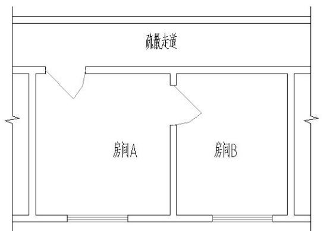

房间A、B合并计算面积

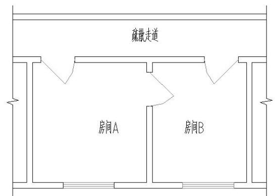

房间A、B分别计算面积

附图7.2.5-1 平面布置示意图

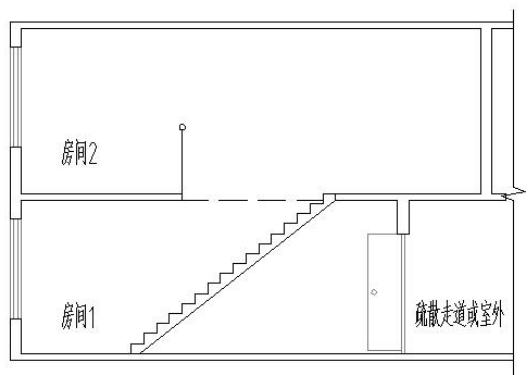

房间1、2合并计算面积

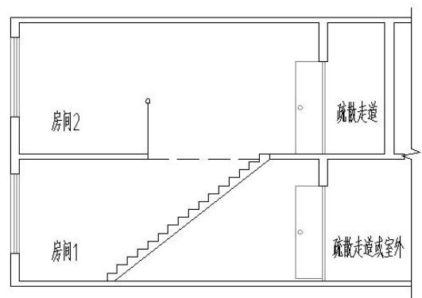

房间1、2分别计算面积

附图7.2.5-2 剖面布置示意图

〔说明〕新增条文，本条明确了采用套间或跃层布置方式的房间进行排烟设计时相 应房间建筑面积的计算要求，其中酒店客房、办公室、宿舍、教室等场所中的卫生间、 淋浴房等可不计入房间计算面积。住宅建筑的商业网点可参照本条执行。 

7.2.6 无疏散要求、无其他使用功能的敞开楼梯、自动扶梯区域，当其周 边各层均采取了防火卷帘分隔时，该区域可不设置排烟设施；当该区域在 首层（或底层）受条件限制未设置防火卷帘分隔时，应设置挡烟设施（挡 烟垂壁），挡烟设施的高度（储烟仓厚度）应满足设计要求，且不应小于 首层（底层）空间净空高度的 $20 \%$ 。 

〔说明〕本条为《指南（2020版）》第7.2.5条，局部表述进行了完善，内容未作 调整。 

7.2.7 水泵房、空调通风机房、建筑内配套的变配电间（室）、燃油（燃气） 锅炉（机组）的机房、制冷机房以及机房间建筑面积不大于 $3 0 0 \mathrm { ~ m } ^ { 2 }$ 的柴油 

发电机房等无人员经常停留的机电用房（有人员值班且面积大于等于 $5 0 ~ \mathrm { { m } } ^ { 2 }$ 的控制室除外），可不设置排烟设施。 

〔说明〕本条为《指南（2020 版）》第 7.2.6 条，局部表述完善，内容未作调整。 

7.2.8 建筑内的地下电梯厅、地下门厅（不含作为前室或合用前室使用的厅 室）等属于经常有人停留的场所，当其建筑面积大于 $5 0 ~ \mathrm { { m } } ^ { 2 }$ 时应设置排烟设 施。 

〔说明〕本条为《指南（2020 版）》第 7.2.7 条。 

7.2.9 设置气体灭火系统、细水雾灭火系统的场所（防护区），不应设置火 灾时的排烟设施，但应按规定设置灭火后的通风设施，并宜采用机械通风 系统，其风量应按换气次数 $5 { \sim } 8$ 次/小时确定，排风口应直接通至室外。 

〔说明〕本条为《指南（2020版）》第7.2.8条，主要内容未作调整，补充了灭火 后的通风设施宜采用机械通风系统。 

7.2.10 同一建筑空间宜采用同一种排烟方式；当其相邻的两个防烟分区采 用不同的排烟方式时，两个防烟分区之间的挡烟设施必须分隔到位，即采 用建筑墙体等围护结构进行分隔，或挡烟垂壁应能降至两个防烟分区中较 低的设计储烟仓底部及以下，且应按《防排烟标准》第 4.5 节的规定考虑 补风设施。 

7.2.11 对于矩形、L 形形状的房间（防烟分区），其任一边长度不应大于 《防排烟标准》第4.2.4 条中规定的防烟分区长边的最大允许长度；对于多 边形和圆形房间（防烟分区），能覆盖（包含）该房间（防烟分区）且覆 盖面积最小的矩形，该矩形的任一边长度不应大于防烟分区长边的最大允 许长度。 

对于走道或回廊（含单条或多条组合），其防烟分区的长边长度可按 分区内任意一点沿烟气扩散路径蔓延的最大沿程距离确定，常见走道或回 廊防烟分区的长边长度可参照附图 $7 . 2 . 1 1 - 1 \sim 5$ 确定，且应符合《防排烟标 准》第4.2.4条及本《指南》第7.2.12条的规定。 

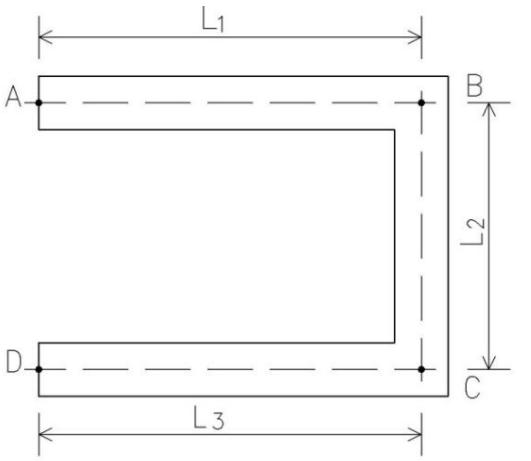

走道防烟分区长边长度：

附图 7.2.11-1

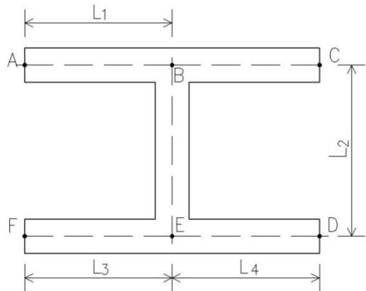

走道防烟分区长边长度：

附图 7.2.11-2

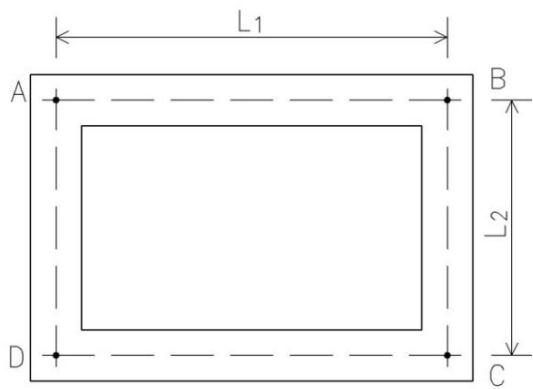

走道防烟分区长边长度：

$\mathsf { \Gamma } _ { m \mathrm { q x } } = \mathsf { L } _ { \mathsf { A C } } = \mathsf { L } _ { 1 } .$

附图 7.2.11-3

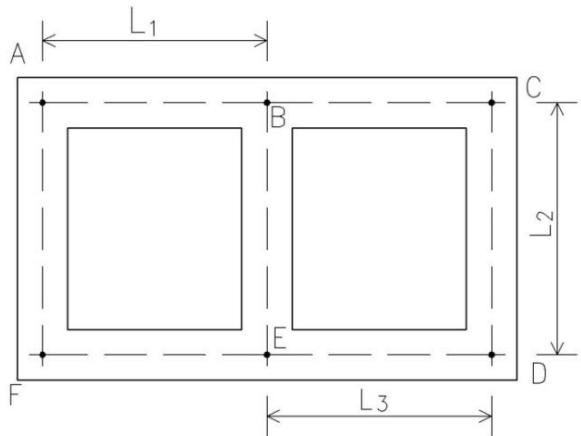

$L i m a x = L _ { A D } = L _ { 1 }$

附图 7.2.11-4 

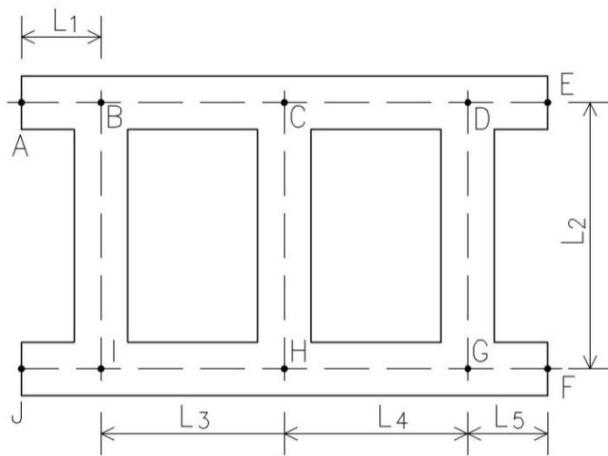

走道防烟分区长边长度：

$L _ { m a x } = L _ { A F } = L _ { 1 }$

附图 7.2.11-5

7.2.12 《防排烟标准》第 4.2.4 条附注中，对于主体宽度不大于 $2 . 5 \mathrm { m }$ （含 局部变宽）的走道或回廊，当其防烟分区面积不大于 $1 5 0 \ \mathrm { m } ^ { 2 }$ 时，该走道防 烟分区的长边长度不应大于 $6 0 \mathrm { m }$ ；对于主体宽度大于 $2 . 5 \mathrm { m }$ （含局部变宽） 的走道或回廊，当其防烟分区面积不大于 $1 8 0 ~ \mathrm { m } ^ { 2 }$ 时，防烟分区的长边长度 不应大于 $5 0 \mathrm { m }$ 。 

〔说明〕本条对走道或回廊防烟分区长边长度的控制要求进行了调整、完善，补充 了主体宽度大于 $2 . 5 \mathrm { m }$ 的走道或回廊，因其中的电梯厅等区域局部加宽且加宽后的走道 总面积不大于 $1 8 0 ~ \mathrm { m } ^ { 2 }$ 时走道或回廊防烟分区长边长度的控制要求。 

7.2.13 《防排烟标准》第4.2.4 条附注中，汽车库防烟分区的划分应符合《汽 车库、修车库、停车场设计防火规范》GB50067 的规定，且防烟分区的最 大允许长边长度不宜大于 $6 0 \mathrm { m }$ ，且不应大于 $7 5 \mathrm { m }$ ；当汽车坡道纳入汽车库 防火分区时，坡道长度可不计入其所在汽车库防烟分区的长边长度。 

对于建筑空间净高不大于 $3 \mathrm { m }$ 的非机动车库（大空间），其防烟分区 的最大允许长度不应大于 $3 6 \mathrm { m }$ 。 

〔说明〕本条对汽车库防烟分区最大允许长边长度的控制要求进行了补充、完善； 整合、完善了《指南（2020版）》第7.2.38条建筑空间净高不大于3m 的非机动车库防 烟分区最大允许长度的规定。 

7.2.14 对于采用自然排烟方式的丙类、丁类工业建筑，当建筑空间净高小 于或等于 $1 0 . 7 \mathrm { m }$ 时，其防烟分区内任一点与最近的自然排烟窗（口）的水 平距离不应大于 $3 0 \mathrm { m }$ ，其中空间净高大于或等于 $6 \mathrm m$ ，且具有自然对流条件 的场所，其防烟分区内任一点与最近的自然排烟窗（口）的水平距离不应 大于 $3 7 . 5 \mathrm { m }$ ；当建筑空间净高大于 $1 0 . 7 \mathrm { m }$ 时，该水平距离不应大于空间净 高的2.8倍，其中空间净高小于或等于 $1 3 . 4 \mathrm { m }$ ，且具有自然对流条件的场所， 其防烟分区内任一点与最近的自然排烟窗（口）的水平距离不应大于 $3 7 . 5 \mathrm { m }$ 。 

〔说明〕本条补充了工业建筑内空间净高大于或等于6m 且具有自然对流条件的场 所，其防烟分区内任一点与最近的自然排烟窗（口）的水平距离的控制要求。 

7.2.15 采用自然排烟的厂房、仓库的排烟窗（口），应结合防烟分区沿一 面或多面外墙均匀布置，且宜设置在防烟分区的两条对边。 

对于仅有一面外墙可设置排烟窗（口）且其他面为无窗实体分隔墙的 厂房、仓库，当采用自然排烟时，其防烟分区内任一点与最近的自然排烟 窗（口）的水平距离不宜大于其建筑空间净高的2.8 倍，且不应大于 $3 0 \mathrm { m }$ 。 

〔说明〕本条补充、完善了厂房、仓库自然排烟窗（口）的布置要求及相关表述。 

7.2.16 除《防排烟标准》第 4.3.6 条规定的场所外，建筑面积大于 $2 0 0 0 \ \mathrm { m } ^ { 2 }$ 的体育比赛厅（含观众厅）等厅室，其自然排烟窗也应分区、分组设置集 中手动开启装置和自动开启设施。 

自动排烟窗的功能、性能及选用应符合《防排烟标准》及《建筑通风 和排烟系统用防火阀门》GB15930-2024 的相关规定。 

〔说明〕本条补充、完善了自动排烟窗选用的相关要求，其他内容未作调整。 

7.2.17 对于建筑内沿垂直方向布置的排烟系统，其各楼层接至该系统垂直 主风管的排烟支管只能担负一个防火分区的排烟。 

〔说明〕局部表述进行了完善。 

7.2.18 受条件限制设置专用机房确有困难的部分排烟风机也可设置于室外， 但其周围至少 6m 范围内不应布置可燃物，且必须设置满足风机防护（防 雨、防晒）、通风散热及检修要求的防护罩（应有制作大样图及安装图）， 防护罩应采用不燃材料制作，且其耐火极限不应低于1.00h。 

消防排烟风机不应与消防补风风机、事故通风机共用机房。当受条件 限制消防排烟风机确需与其他通风机、空调机等合用机房时，除应符合专 用机房的相应要求外，还应符合《防排烟标准》第4.4.5条中合用机房的相 关规定。 

当风机设置于机房内时，风机控制柜应放置在机房内；当风机设置于 室外时，风机控制柜宜设置在附近公共部位，并应采取防碰撞、防误操作 等防护措施。 

工业建筑或采用钢结构体系且受条件限制无法在屋面设置风机房的公 共建筑中，满足国家相关标准要求的室外耐候性能（耐腐蚀、抗强风、抗 暴雨等性能）的屋顶式消防排烟风机可直接设置于室外，但其周围至少6m 范围内不应布置可燃物，且确保风机在火灾发生时不受烟火影响，能够正 常连续运行。 

〔说明〕本条为《指南（2020 版）》第 7.2.19 条修订，删除了《防排烟标准》已 有规定的内容，本条中受条件限制设置专用机房确有困难的情况，主要是指既有建筑改 造工程、受航空或规划限高影响的工程等情形，补充明确了防护罩应采用不燃材料制作， 防护罩的耐火极限可通过采用具有相应耐火极限的复合板材（如镀锌钢板、岩棉、防火 板等材料复合制成的复合板等）制作来实现。还明确了消防排烟风机不应与消防补风风 机、事故通风机共用机房，其他内容未作调整。 

7.2.19 通风（空调）风管、排烟管道不应穿越建筑内楼梯间、前室（含首 层扩大封闭楼梯间、防烟楼梯间扩大前室）、低危门厅、防火隔间、避难 区（间）及避难走道等防烟部位。当受条件限制确需穿越时，通风（空调） 风管、排烟管道应采用耐火极限不低于2.00h 的隔墙和1.50h的楼板进行防 火分隔。对于扩大封闭楼梯间、防烟楼梯间扩大前室、低危门厅及避难区 （间）等场所，当采用楼板进行防火分隔确有困难时，穿越的风管应采用 耐火极限不低于1.00h 的防火风管，且应采用耐火极限不低于1.00h 的防火 吊顶或防火板进行防火分隔保护。 

〔说明〕本条为《指南（2020版）》第7.2.20条修订，补充了通风（空调）风管、 排烟管道不应穿越防火隔间、避难间的要求；还明确了这些管道确需穿越扩大封闭楼梯 间、防烟楼梯间扩大前室、低危门厅及避难区（间）时应满足的相关要求，考虑到仅提 高风管耐火极限的做法可能存在一定的不确定性，故还应采取相应的防火分隔措施，其 他内容未作调整。 

7.2.20 金属（如镀锌钢板）风管可通过将防火隔热材料采用机械固定、柔 性包覆（裹）等方式固定在其表面，以满足《防排烟标准》对风管耐火极 限的要求；也可直接选用满足耐火极限要求的成品复合风管，或采用由满 足耐火极限要求的复合板材制作的复合风管。 

〔说明〕本条为《指南（2020 版）》第 7.2.21 条修订，局部表述进行了完善，内 容未作调整，明确了风管实现耐火极限的主要方法。防排烟风管的选用还应考虑以下因 素： 

防排烟风管应采用不燃材料制作，板材不应含有在高温下会产生烟气或释放有害气 体的 EPS 聚苯颗粒或木屑等有机物，金属风管外包覆及复合风管选用的隔热材料均应 采用能耐受 $8 0 0 \mathrm { { ‰} }$ 以上高温的隔热材料（如岩棉、硅酸铝纤维等）。 

对于彩钢板（或镀锌钢板）与隔热材料、防火板材等复合而成的复合风管，当复合 风管整体的耐火极限符合规定且风管强度满足《非金属及复合风管》JG/T 258-2018 要 求时，彩钢板（或镀锌钢板）的内板厚度可按不低于《通风管道技术规程》JG/T 141-2017 第3.6.3 条高压系统的相关要求确定。 

复合风管的性能及选择还应符合《建筑机电工程抗震设计规范》GB 50981的相关 规定。 

7.2.21 竖向设置的排烟管道应设置在独立的管道井内，不应与加压送风管 道或补风管道共用管道井；多个排烟管道可合用一个土建管道井，但排烟 管道的耐火完整性不应低于 $0 . 5 0 \mathrm { h }$ 。 

〔说明〕本条为《指南（2020 版）》第 7.2.22 条修订，补充完善了管道井内排烟 管道的耐火性能的相关要求。明确了当排烟管道的耐火完整性符合规定时多个排烟管道 

可合用一个土建管道井，管道耐火完整性的相关要求见《通风管道耐火试验方法》GB 17428。 

7.2.22 《建筑防火通用规范》第6.3.2条中的“排烟或通风道”是指排烟或 通风用的土建风道。 

当风管穿越的防火隔墙的耐火极限小于等于1.00h时，穿越处防火阀两 侧的风管可不按《建筑设计防火规范》第6.3.5条的规定采取防火保护措施。 

〔说明〕新增条文，补充明确了《建筑防火通用规范》第 6.3.2 条中“排烟或通风 道”的含义，是指排烟或通风用的土建风道，不含风管。有关风管、风道的术语定义详 见《通风与空调工程施工质量验收规范》GB 50243-2016。 

《建筑设计防火规范》第 6.3.5 条规定，风管穿越防火隔墙时，防火阀两侧 2m 范 围内风管采取防火保护措施的要求，主要是针对耐火极限大于等于 2.00h 的防火隔墙， 风管穿越耐火极限小于等于1.00h的防火隔墙时防火阀两侧的风管可不采取防火保护措 施。 

7.2.23 当同一防火分区内不同防烟分区均独立设置排烟系统时，一个防烟 分区的排烟管穿越另一防烟分区的穿越处可不设置排烟防火阀（ $2 8 0 \mathrm { { } ^ { \circ } C }$ ）。 

排烟风管和排烟口的设计风速是指满足其计算排烟量要求的风速，排 烟风管和排烟口的尺寸可按其计算风量确定。 

〔说明〕本条删除了《消防设施通用规范》已有规定的内容，其余未作调整。 

7.2.24 排烟管道穿越除《消防设施通用规范》第 11.3.5 条规定外的其他防 火隔墙处，可不设置排烟防火阀（ $2 8 0 \mathrm { { } ^ { \circ } C }$ ）（如附图7.2.24 所示），但水平 排烟管道的耐火极限不应低于1.50h。 

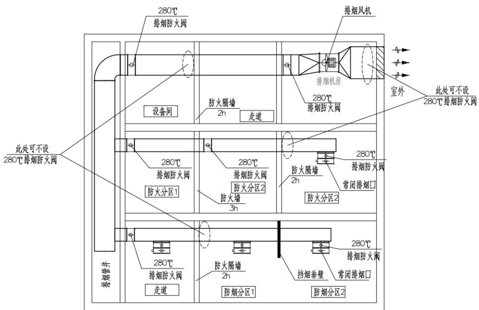

剖面示意图

附图 7.2.24 

〔说明〕新增条文，排烟系统的排烟防火阀（ $2 8 0 \mathrm { { ‰} }$ ）的设置应符合《消防设施通 用规范》第11.3.5条的规定，除此规定外，排烟管道在穿越其他防火隔墙处是否需设置 排烟防火阀，规范并不明确。本条进行了补充，明确了排烟管道在穿越其他防火隔墙（包 括外墙）处的相关要求。 

7.2.25 对于空间净高小于或等于 6m 的场所，其机械排烟系统的单个排烟 口的最大允许排烟量可按《防排烟标准》第 4.4.12 条第 7 款规定的排烟口 最大风速（ $1 0 \mathrm { m / s } )$ ）计算确定。 

〔说明〕本条对《指南（2020 版）》第 7.2.24 条中相关场所机械排烟系统单个排 烟口最大允许排烟量计算的相应要求进行了局部调整。根据《防排烟标准》第 4.6.3 条 规定，净高小于或等于 6m 场所的排烟量按指标法计算（ $6 0 \mathrm { m } ^ { 3 } / \mathrm { m } ^ { 2 } \cdot \mathrm { h } )$ ），可不采用火灾 模型法计算，故相应的械排烟系统单个排烟口的最大允许排烟量可不按《防排烟标准》 第 4.6.14 条计算，可按最大风速计算确定。对于整体净高大于 6m 的阶梯地面式场所， 当该场所最高地面处的净高不大于 $3 \mathrm { m }$ 时，最高地面处上部机械排烟口的最大允许排烟 量也可按本条执行。 

7.2.26 对于地下或地上无可开启外窗房间，当单个房间建筑面积均小于50 ㎡且与走道防烟分区相连通的多个该类房间的总建筑面积大于等于 $2 0 0 \mathrm { ~ m } ^ { 2 }$ 时，房间内可不设置排烟口，可通过相连通的走道防烟分区排烟；当该走 道采用机械排烟时，其计算排烟量不应小于 $2 0 0 0 0 \mathrm { m } ^ { 3 } / \mathrm { h }$ ；当采用自然排烟时， 应在走道两端（侧）均设置有效面积不小于 $2 . 0 \mathrm { ~ m } ^ { 2 }$ 的自然排烟窗（口）， 且两端（侧）自然排烟窗（口）的距离不应小于走道长度的 2/3 或应均匀 布置。 

〔说明〕本条对《指南（2020 版）》第 7.2.25 条进行了局部补充、完善。补充明 确了当与走道防烟分区相连通的多个建筑面积小于 $5 0 ~ \mathrm { ~ m ~ } ^ { 2 }$ 房间的总建筑面积大于等于 $2 0 0 ~ \mathrm { { m } } ^ { 2 }$ 时可通过相连通的走道防烟分区排烟，但走道的排烟要求应适当提高。增加了走 道自然排烟窗（口）的布置也可采取均匀布置（包括面积和位置）的方式。 

7.2.27 一个防烟分区内多个机械排烟口边缘之间的最小距离 $ \mathrm { { S } } _ { \mathrm { m i n } }$ 应满足以 下要求： 

$$
S _ {\min } = 0. 9 V _ {e} ^ {1 / 2} (m) ;
$$

公式中： $\mathrm { V _ { e } }$ 为一个排烟口的排烟量（ $\mathrm { m } ^ { 3 } / \mathrm { s } )$ ）。 

〔说明〕本条为《指南（2020版）》第7.2.26条。 

7.2.28 对于地上建筑，当房间建筑面积大于或等于 $5 0 0 \ \mathrm { m } ^ { 2 }$ ，或房间建筑面 积小于 $5 0 0 ~ \mathrm { m } ^ { 2 }$ 但大于 $3 0 0 ~ \mathrm { { m } } ^ { 2 }$ 且空间净高大于 6m 时，不论其采用机械排烟 

或自然排烟方式，均应设置直接补风设施；设置了排烟口且房间门为防火 门的其他无窗房间，也应设置补风设施，可直接补风，或通过相连走道上 设置的连通管间接补风，当通过走道间接补风时走道应设有直接补风设施。 

对于地下建筑，当房间建筑面积大于等于 $2 0 0 \mathrm { ~ m } ^ { 2 }$ 时，房间应设置直接 补风设施；当房间建筑面积小于 $2 0 0 \ \mathrm { m } ^ { 2 }$ 且设置了排烟口时，房间也应设置 补风设施，可直接补风，或通过相连的走道间接补风，当通过走道间接补 风时走道应设有直接补风设施。 

自然排烟系统应采用自然通风方式补风，自然补风口的有效面积宜通 过计算确定，且不宜小于所在防烟分区总自然排烟有效面积的1/2。 

〔说明〕本条对《指南（2020 版）》第 7.2.27 条进行了局部补充、完善，主要内 容未作调整。 

7.2.29 担负多个防烟分区的补风系统，其补风量不应小于系统排烟量的 $50 \%$ ，且不应大于该系统排烟量（宜小于或等于系统排烟量的 $8 0 \sim 9 0 \%$ ）。 

〔说明〕本条对《指南（2020 版）》第 7.2.28 条进行了补充、完善，该要求不仅 适用于地下汽车库，其余未作调整。 

7.2.30 对于建筑空间净高小于或等于 6m 且设置机械排烟系统的房间，当 房间建筑面积小于或等于 $1 0 0 ~ \mathrm { { m } } ^ { 2 }$ 时，其计算排烟量不应小于 $7 2 0 0 \mathrm { m } ^ { 3 } / \mathrm { h }$ ；当 房间建筑面积大于 $1 0 0 ~ \mathrm { m } ^ { 2 }$ 时，其排烟量应按不小于 $6 0 \mathrm { { m } ^ { 3 } / \mathrm { { m } ^ { 2 } \mathrm { ~ h } } }$ 计算，且不 应小于 $1 5 0 0 0 \mathrm { m } ^ { 3 } / \mathrm { h }$ 。 

〔说明〕本条对《指南（2020版）》第7.2.29条的局部表述进行了完善。 

7.2.31 对于公共建筑和工业建筑中的空间净高大于6m的场所（不含中庭）， 其每个防烟分区的排烟量应按《防排烟标准》第4.6.6条～第4.6.13 条的相 关规定计算确定，其中非阶梯式（水平）地面场所的排烟量，也可按《防 排烟标准》中表4.6.3 确定。 

当采用计算确定时，排烟量应根据设计清晰高度，按《防排烟标准》 的相关要求计算确定；对于非阶梯式（水平）地面的场所，其设计清晰高 度的取值应在最小清晰高度的基础上增加不小于 $1 . 0 \mathrm { m }$ ，且烟气层设计烟气 温度不宜大于 $2 0 0 \mathrm { { } ^ { \circ } C }$ ；对于阶梯式地面或类似的场所，其设计清晰高度应 满足该场所最高标高地面的最小清晰高度要求（应按最高标高地面处的空 间净高计算确定）。当采用机械排烟方式时，计算排烟量尚不应小于按该 场所地面面积与 $6 0 \mathrm { m } ^ { 3 } / \mathrm { m } ^ { 2 }$ .h乘积计算所得的排烟量；当采取自然排烟方式时， 

自然排烟窗（口）的有效面积可根据上述计算排烟量，按《防排烟标准》 第4.6.15条的规定计算确定，且不应小于该场所地面面积的 $2 \%$ 。 

〔说明〕本条对《指南（2020 版）》第 7.2.30 条进行了局部补充完善，在根据设 计清晰高度取值进行排烟量计算的基础上，增加了相应的烟气层最高设计烟气温度和最 小排烟量的限值要求。 

7.2.32 除相关专业规范有特殊规定外，工业建筑中的走道排烟设计可参照 《防排烟标准》第4.6.3 条中公共建筑走道的有关规定及本《指南》的有关 要求执行。 

〔说明〕本条为《指南（2020版）》第7.2.31条。 

7.2.33 公共建筑、工业建筑中，当走道或回廊周围的房间（不含配电小间、 卫生间、封闭茶水间等）均设置了满足《防排烟标准》要求的排烟设施时， 走道或回廊的机械排烟量可按 $6 0 \mathrm { { m } ^ { 3 } / \mathrm { { m } ^ { 2 } \mathrm { ~ h } } }$ 计算，且不小于 $1 3 0 0 0 \ \mathrm { m } ^ { 3 } / \mathrm { h }$ ，或 在走道或回廊两端（侧）设置总有效面积不小于走道或回廊地面面积的 $2 \%$ 的自然排烟窗（口），且两端（侧）自然排烟窗（口）之间的距离不应小 于走道或回廊长度的2/3 或均匀布置。 

〔说明〕本条为《指南（2020 版）》第 7.2.32 条，进行了局部补充、完善，明确 了本条涉及的走道或回廊周围的房间可不含配电小间、卫生间、封闭茶水间等房间，增 加了采用自然排烟的走道或回廊自然排烟窗（口）的布置方式，也可采取均匀布置（包 括面积和位置）的方式。 

7.2.34 对于负担多个防烟分区的机械排烟系统，当按其中最大一个防烟分 区计算系统排烟量时，系统计算排烟量应在按相关规定计算的基础上，附 加其它关闭状态的排烟口（排烟阀）的漏风量。排烟口（排烟阀）的漏风 量可参照现行国家标准《建筑通风和排烟系统用防火阀门》GB15930的相 关规定进行计算。 

〔说明〕本条删除了《防排烟标准》已有规定的内容，补充了负担多个防烟分区的 机械排烟系统排烟量的相关计算要求。当按其中最大一个防烟分区计算系统排烟量时， 在按相关规定计算的基础上，还应附加其它呈关闭状态的排烟口（排烟阀）的漏风量。 对于排烟口或排烟阀个数较多或面积较大的排烟系统，当进行系统设计时，应复核系统 排烟量，必要时应附加其它呈关闭状态的排烟口（排烟阀）的漏风量。 

7.2.35 建筑中庭应按《防排烟标准》的相关规定划分防烟分区，其排烟系 统宜独立设置。除本指南第7.2.36 条规定外，其排烟设计应符合以下规定： 

1 当中庭采用机械排烟方式时，其防烟分区排烟量应按《防排烟标准》 

第4.6.6 条～第4.6.13 条的要求计算确定，设计清晰高度应满足火灾时与中 庭连通的最高楼层回廊的最小清晰高度要求，计算排烟量尚不应小于按中 庭空间体积换气次数计算的排烟量： 

当中庭体积不大于 $1 7 0 0 0 \mathrm { m } ^ { 3 }$ 时，排烟量按中庭体积6 次/h换气计算； 

当中庭体积大于 $1 7 0 0 0 \mathrm { m } ^ { 3 }$ 时，排烟量按中庭体积的 4 次/h 换气计算， 且不应小于 $1 0 2 0 0 0 \mathrm { m } ^ { 3 } / \mathrm { h }$ ； 

2 当中庭采用自然排烟方式时，其自然排烟窗有效排烟面积应按《防 排烟标准》第4.6.15 条的要求计算确定，且不应小于中庭地面面积的 $5 \%$ 。 

〔说明〕新增条文，本条规定了建筑中庭的防烟分区划分、排烟系统设置及排烟量 （或自然排烟窗有效面积）计算的相关要求。当按《防排烟标准》第4.6.6条～第4.6.13 条进行设计计算时，火灾热释放率 Q 可根据中庭是否设置喷淋确定：4MW（无喷淋） /1.0MW（有喷淋）。 

7.2.36 对于连通空间（楼面开口）最大投影面积小于或等于 $2 0 0 \ \mathrm { m } ^ { 2 }$ 且空间 高度不大于 $2 4 \mathrm { m }$ 的办公、学校、住宅等功能场所中的中庭（含中庭回廊）， 可按以下要求进行排烟设计： 

1 当采用机械排烟时，其计算排烟量可按空间体积换气次数不小于6 次/小时确定，且不应小于 $4 0 0 0 0 { \mathrm { m } } ^ { 3 } / { \mathrm { h } }$ ； 

2 当采用自然排烟时，其自然排烟窗（口）开启的有效面积不应小于 该中庭或门厅等空间地面面积的 $5 \%$ 。 

〔说明〕本条对《指南（2020 版）》第 7.2.35 条进行了补充、完善。补充了上述 小型中庭空间的高度限制（不应大于 $2 4 \mathrm { m }$ ）；删除了不贯穿多个楼层的高大门厅（非中 庭式门厅）排烟设计的相应内容，其排烟设计可按《防排烟标准》及本《指南》的相关 规定进行。 

7.2.37 建筑空间的净高应按《防排烟标准》第4.6.9 条的条文说明确定，对 于其他不同类型屋面或顶棚的场所，其建筑空间净高可按以下确定： 

1 对于锯齿形屋顶的场所，当采用屋顶侧窗（口）排烟时，建筑空间 净高为侧窗（口）中心距地面的高度（如附图7.2.37-1所示）； 

2 对于人字形屋顶的场所，当排烟窗（口）设置于屋脊处时，建筑空 间净高为屋脊底面距地面的高度（如附图7.2.37-2所示）； 

3 对于斜坡屋面（或顶棚）的场所，当排烟窗（口）设置于斜坡屋面 （或顶棚）时，建筑空间净高为排烟窗（口）中心距地面的高度，当斜坡 屋面设有多个不同高度的窗（口）时，可按各排烟窗（口）中心距地面高 

度中的平均值确定（如附图 7.2.37-3 所示）； 

4 对于斜坡屋面（或顶棚）的场所，当排烟窗（口）设置于侧墙面时， 建筑空间净高可按空间的平均高度确定，即为坡底侧墙的檐口（或顶棚） 最低点距地面高度 $\mathrm { H } _ { 1 }$ 与坡顶侧墙的檐口（或顶棚）最高点距地面高度 $\mathrm { H } _ { 2 }$ 两者的平均值；当排烟窗（口）仅设置于坡底侧墙且檐口（或顶棚）最低 点距地面的高度大于 $3 \mathrm { m }$ 时，建筑空间净高可按檐口（或顶棚）最低点距 地面的高度 $\mathrm { H } _ { 1 }$ 确定（如附图7.2.37-4所示）； 

5 对于平顶顶棚、阶梯式地面的场所，建筑空间净高为平顶顶棚到阶 梯式地面的最低地面的高度（如附图7.2.37-5、7.2.37-6 所示）； 

6 当在屋顶和墙面均设置了排烟口时，应按屋顶、墙面分别计算相应 的建筑空间净高，最终的建筑空间净高可按两个计算空间净高的较低值确 定。 

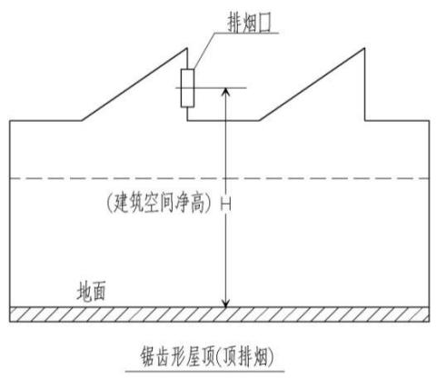

附图 7.2.37-1

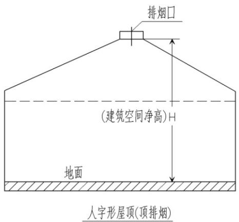

附图 7.2.37-2

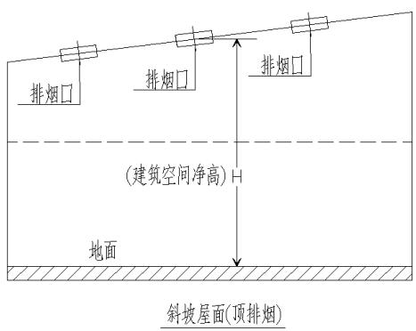

附图 7.2.37-3

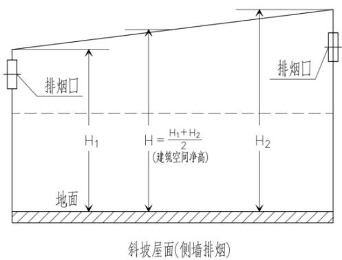

附图 7.2.37-4

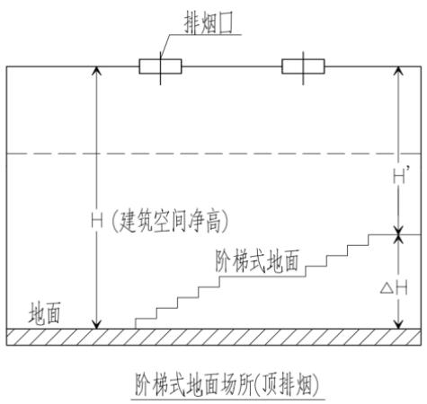

附图 7.2.37-5

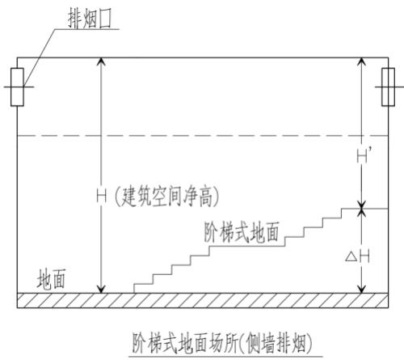

附图 7.2.37-6

〔说明〕本条对《指南（2020 版）》第 7.2.36 条进行了补充、完善。规定了多种 典型建筑场所的空间净高的确定方法。本条第4款中当斜坡屋面的坡底侧墙檐口（或顶 棚）最低点距地面的高度小于 $3 \mathrm { m }$ 时，不宜设置排烟口，排烟口宜设置在其他较高墙面。 附图 7.2.37-5、6 中的 H’为阶梯式地面场所最高地面处的空间净高，主要用于设计清晰 高度的计算，ΔH为最高地面与最低地面的高差。 

7.2.38 关于《防排烟标准》第 4.6.11 条火灾计算模型中的燃料面距地面高 度，当房间净高不大于 6m 时，如按火灾模型进行设计计算，则其燃料面 距地高度可按0m取值；当房间净高大于6m时，燃料面距地高度宜按燃料 着火面实际高度取值，如燃料面高度不确定的，则可按1m取值。 

〔说明〕本条为《指南（2020 版）》第 7.2.37 条，局部表述完善，其余未作调整。 

7.2.39 建筑面积大于 $5 0 ~ \mathrm { { m } } ^ { 2 }$ 的电动自行车充停、充换场所应设置独立的排烟 设施，不应与非电动自行车停车场所共用，当确需共用排烟系统时，应统 一按电动自行车充停、充换场所的要求进行排烟设计。 

电动自行车库应按充停、充换单元划分防烟分区。一个排烟系统担负 的防烟分区数量不宜大于4个。 

当采用机械排烟方式时，防烟分区的排烟量应按不小于 $9 0 \mathrm { m } ^ { 3 } / \mathrm { h } . \mathrm { m } ^ { 2 }$ 计算 确定，且不小于 $1 5 0 0 0 \mathrm { m } ^ { 3 } / \mathrm { h }$ ；系统排烟量可按一个充停、充换单元的排烟量 确定，但系统计算排烟量应在最大充停单元计算排烟量的基础上增加 $20 \%$ 。 

当采用自然排烟方式时，自然排烟窗（口）的有效面积应按不小于地 面面积的 $3 \%$ 确定。 

〔说明〕本条对《指南（2020 版）》第 7.2.38 条进行了调整、补充和完善。删除 了除电动自行车库外的其他非机动车库的相应内容，其排烟设计可按《建筑防火通用规 范》《消防设施通用规范》及《防排烟标准》的相关规定进行；完善了电动自行车充停、 

充换场所的排烟要求。 

根据《电动自行车集中充电设施 第1部分：技术规范》GB 42236.1-2022及《浙江 省电动自行车充停、充换场所建设技术导则》（2024 年 3 月）的规定，补充、完善了 电动自行车库排烟系统设置、排烟量计算等内容。条文中建筑面积大于 $5 0 ~ \mathrm { \ m } ^ { 2 }$ 的电动自 行车充停、充换场所，可由一个房间或多个房间组成，或是一个区域。 

《指南（2020 版）》第7.2.38条关于建筑空间净高不大于3m 的非机动车库防烟分 区最大允许长度的控制要求，已整合至本《指南》第7.2.13条。 

7.2.40 设置在四层及以上楼层、地下或半地下室的歌舞娱乐放映游艺场所， 当设置机械排烟系统时，其排烟设计除了应符合《防排烟标准》的相关规 定外，尚应满足以下要求： 

1 当房间建筑面积大于或等于 $5 0 ~ \mathrm { { m } } ^ { 2 }$ 时，其排烟量应按《防排烟标准》 第 4.6.3 条的相关要求计算确定，其中第 4.6.3 条第 1 款有关排烟量的计算 可按本《指南》第7.2.30条执行； 

2 当房间建筑面积均小于 $5 0 \ \mathrm { \ m } ^ { 2 }$ 但需设置排烟设施时，房间内可不设 置排烟口，可通过与其连通的走道防烟分区排烟，但该内走道排烟系统的 排烟量应符合本《指南》第7.2.26条的规定； 

3 长度小于 $2 0 \mathrm { m }$ 的内走道宜设置排烟口；条件具备时内走道排烟系 统宜独立设置，不宜与房间合用； 

4 内走道和设有排烟口的房间应设置补风口，补风口的布置应有利于 排烟和人员疏散；当采用机械补风时，该场所（含内走道和房间等）不应 与其他区域共用补风系统。 

〔说明〕《指南（2020 版）》第 7.2.39 条调整为本条。对原文的局部内容及表述 进行了补充、完善，规定了针对设置在四层及以上楼层、地下或半地下室的歌舞娱乐放 映游艺场所排烟设计的技术措施，主要内容未作调整。 

7.2.41 对于配建充电设施的新建地下汽车库，其排烟设计应符合《汽车库、 修车库、停车场设计防火规范》的相关规定及下列要求： 

1 除了位于地下一层且建筑面积小于 $5 0 0 ~ \mathrm { { m } } ^ { 2 }$ 的电动汽车库外，其他电 动汽车库均应划分防烟分区，设置排烟系统； 

2 电动汽车库的排烟系统应独立设置，不应与汽车库非充电停车区域 合用，当确需与其共用系统时，应统一按电动汽车充电场所的要求进行排 烟设计； 

3 电动汽车库应按《汽车库、修车库、停车场设计防火规范》的相关 

规定并结合停车单元划分防烟分区，防烟分区不应跨越停车单元，系统排 烟量应在《汽车库、修车库、停车场设计防火规范》相关规定的基础上增 加 $20 \%$ ； 

4 电动汽车库防烟分区的补风系统宜独立设置，当独立设置确有困难 时，也可利用同一防火分区内的相邻防烟分区进行补风。 

〔说明〕本条在建筑防火设计取消地下汽车库防火单元设置的基础上进行了相应修 改，并适当考虑了正在进行的《汽车库、修车库、停车场设计防火规范》修订提出的相 关要求。 

# 7.3 系统控制

7.3.1 《消防设施通用规范》第11.3.5条中，排烟风机入口处的排烟防火阀 应具备连锁关闭排烟风机和补风机的功能，其他部位的排烟防火阀可不与 排烟风机、补风机连锁关闭，如需联动时可通过控制模块实现。 

〔说明〕《指南（2020版）》第7.3.2条调整为本条。本条删除了原条文中《消防 设施通用规范》第11.3.5 条已规定的内容，补充、完善了排烟防火阀与排烟风机和补风 机的联锁控制相关要求。 

7.3.2 《防排烟标准》第 5.2.4 条中，担负多个防烟分区的机械排烟系统， 当火灾确认后，应能根据火灾探测器的报警信号依次打开着火防烟分区及 烟气蔓延至的相邻一个防烟分区的常闭排烟阀（口）进行排烟。 

〔说明〕《指南（2020版）》第7.3.3条调整为本条。本条补充、完善了担负多个 防烟分区的机械排烟系统的常闭排烟阀（口）的控制要求。当火灾确认后，除了打开着 火防烟分区的常闭排烟阀（口）外，还应能根据烟气蔓延和火灾探测器的报警信号打开 相邻的一个防烟分区的常闭排烟阀（口）。 

7.3.3 对于仅承担一个防烟分区排烟且全部采用常开排烟口的机械排烟系 统（如汽车库排烟系统等），可不增设常闭排烟口及其信号反馈功能，但 应由火灾报警信号联动启动排烟风机。 

〔说明〕本条为《指南（2020版）》第7.3.4条。 

# 7.4 施工、调试和验收

7.4.1 在《防排烟标准》第7.2.6 条以及第8.2.5 条中，当进行楼梯间和前室 （或合用前室、共用前室及“三合一”前室等）疏散门的门洞断面风速测 

试时，疏散门开启的楼层数量应符合《防排烟标准》第3.4.6条、本《指南》 第7.1.22条及设计文件等的相关规定。 

7.4.2 在《防排烟标准》第7.2.7 条以及第8.2.6 条中，当进行排烟口、补风 口的风速、风量测试时，系统开启的防烟分区排烟口、补风口应与其设计 的模式相对应，即与排烟量、补风量计算（按《防排烟标准》第 4.6.4 条、 第4.5.2 条）时开启的排烟口、补风口相对应。 

# 7.5 暖通空调系统

7.5.1 地下燃气（燃油）锅炉房、燃气型直燃式溴化锂冷（热）水机组机房 等的事故排风机应设置在地上建筑内或室外，当确有困难时，排风机可布 置于锅炉房（或机组机房）自然通风良好的竖井内，或设置于自然通风良 好的地下专用机房内，机房应采用耐火极限不低于 3.00h 的防火隔墙与相 邻区域分隔，机房自然进、排风开口有效面积均不应小于专用机房地面面 积的 $5 \%$ ，进风口应布置于机房底部，排风口应布置在机房顶部，排风口宜 通至室外。 

〔说明〕本条补充了地下专用机房防火隔墙的耐火极限要求，局部表述进行了完善， 主要内容未作调整。 

7.5.2 厨房使用燃气的部位或场所的事故通风系统应独立设置，当确有需要 时，可与该场所平时通风系统（不含厨房排油烟系统）合用，但通风系统 应满足事故通风的相关要求。事故通风系统管道的布置应符合《建筑防火 通用规范》第9.1.3条关于排除有燃烧或爆炸危险性物质管道的规定。 

〔说明〕新增条文，明确了厨房使用燃气的部位或场所的事故通风系统的设置要求， 厨房排油烟系统不应与事故通风系统合用。商业综合体中，同一楼层防火分区内相邻的 多个厨房，其燃气事故通风系统的通风管道及其事故通风机宜单独设置，当单独设置确 有困难时可合用，但应满足以下要求： 

1）当相邻的多个厨房合用事故通风系统时，通风主管道、排风机、室外排风口可 集中设置，但应采取措施，保证各厨房的事故通风量，避免相邻厨房水平排风支管之间 相互影响； 

2）当相邻的多个厨房分别设置事故排风机，其相应水平排风管独立设置时，排风 立管可合用，但各厨房水平排风支管接入立管处应采取防倒流措施，避免各厨房水平排 风管道之间相互影响； 

3）各楼层厨房的事故排风系统不应共用排风立管。 

# 第八章 热能动力

# 8.1 锅炉房、柴油发电机房

8.1.1 直燃式溴化锂冷（热）水机组和总容量大于 0.7MW 的常（负）压燃 油（燃气）热水机组的机房，其消防设计应按《建筑防火通用规范》第4.1.4 条、第4.1.5 条中有关锅炉房的规定执行，并应按规定采取有效防爆泄压措 施。 

〔说明〕针对直燃式溴化锂冷（热）水机组和总容量大于0.7MW的常（负）压燃 油（燃气）热水机组等使用燃气的设备机房，结合《建筑防火通用规范》的相关规定， 提出了本条的消防设计要求，本条具体内容未作调整。 

8.1.2 锅炉、柴油发电机的排烟管（烟囱）不应穿越防火分区及建筑内楼梯 间、前室、避难区和避难走道等防烟部位，当受条件限制确需穿越时，穿 越楼梯间、前室、避难区和避难走道等防烟部位的排烟管应采用耐火极限 不低于2.00h 的隔墙和1.50h的楼板进行防火分隔；穿越防火分区的排烟管 应采用耐火极限不低于1.00h 的防火分隔措施进行分隔。 

〔说明〕局部表述进行了完善，内容未作调整。 

8.1.3 附设于建筑内的燃油（燃气）锅炉房，其设置位置应符合《锅炉房设 计标准》GB 50041和《建筑防火通用规范》的有关规定，且单台蒸汽锅炉 的额定蒸发量不宜超过 $1 0 \mathrm { { t } / h }$ ，单台热水锅炉的额定出力（热功率）不宜大 于 7MW。 

〔说明〕本条补充明确了燃油（燃气）锅炉房的设置位置应满足《建筑防火通用规 范》的相关要求，其他未作调整。 

8.1.4 位于建筑地下室的常（负）压燃油或燃气锅炉房的设置，应符合下列 规定： 

1 锅炉房埋深不应大于8m；其上部不应设置地下楼层； 

2 当锅炉房埋深大于地下一层地面时，应设置一个独立的安全出口通 至室外。 

〔说明〕新增条文。补充明确了埋深较大锅炉房设置的相关要求。 

# 第九章 特殊建筑和场所

# 9.1 电影厅、法院审判厅等场所

9.1.1 电影厅、法院审判厅、报告厅、会议厅等为固定座位时，其厅室面 积及相关消防设计应参照观众厅要求执行。设置在四层及四层以上的电影 厅、法院审判厅、报告厅、会议厅、宴会厅等确有困难时，厅室面积可大 于 $4 0 0 ~ \mathrm { { m } } ^ { 2 }$ ，在符合规范要求的同时，还应符合下列规定： 

1 厅室应采用耐火极限不低于3.00h 的防火隔墙、甲级防火门与其他 部位分隔； 

2 厅室内任一点至疏散门的直线距离不应超过 $1 5 \mathrm { m }$ ； 

3 该场所至少应设置1 部独立的疏散楼梯或1个直通上人屋面、净宽 度不小于 $2 . 0 \mathrm { m }$ 的安全出口； 

4 当设置自动喷水灭火系统时, 厅室内的喷头应采用快速响应喷头； 

5 厅室应设置自然排烟设施或独立的机械排烟系统和补风系统； 

6 当厅室建筑面积不大于 $6 0 0 ~ \mathrm { { m } } ^ { 2 }$ ，该厅室座位数不得超过300 座；当 厅室建筑面积大于 $6 0 0 \ \mathrm { m } ^ { 2 }$ ，厅室座位数不得超过厅室面积的 1/2 且不得超 过 400 座； 

7 设置在四层及四层以上的酒店宴会厅，确有困难时，建筑面积不应 大于 $9 0 0 ~ \mathrm { { m } } ^ { 2 }$ ，疏散人数按规范中宴会厅人员密度计算。如采用第 3 款设置 直通上人屋面的安全出口时，安全出口净宽度不应小于 $3 . 0 \mathrm { m }$ 。 

〔说明〕修订条文，增加酒店宴会厅的相关规定。 

9.1.2 设置在四层及四层以上的餐厅、员工食堂、无观众席的体育比赛用 房（训练用房）等可在观众厅的基础上适当放宽厅室面积要求。 

〔说明〕修订条文，酒店宴会厅的内容移至第 9.1.1 条。本条 “观众厅的基础上” 适当放宽，是指可在 $6 0 0 ~ \mathrm { m } ^ { 2 }$ 的基础上按不超过 $50 \%$ 控制。 

# 9.2 儿童活动场所

9.2.1 《建筑防火通用规范》《建筑设计防火规范》和本《指南》中的“儿 童活动场所”是指供12周岁及以下婴幼儿和少儿活动的场所，包括幼儿园、 

托儿所中供婴幼儿生活和活动的房间，设置在建筑内的儿童游乐厅、儿童 乐园、儿童培训班、早教中心等儿童游乐、学习和培训等活动的场所。 

〔说明〕根据《建筑防火通用规范》关于“儿童活动场所”的定义，修订本条内容。 小学校的教学用房平面布置要求应符合现行国家标准《中小学校设计规范》GB 50099 的规定，托儿所、幼儿园的婴幼儿用房的布置要求应符合现行国家标准《托儿所、幼儿 园建筑设计标准》JGJ 39 的规定。 

9.2.2 任一层或任一防火分区内的建筑总面积小于 $5 0 \ \mathrm { \ m } ^ { 2 }$ 的儿童活动空间， 可不考虑独立疏散和防火分隔。 

9.2.3 当儿童活动场所设置在其他单、多层民用建筑内时，应设置不少于 1 个独立的安全出口或疏散楼梯，其疏散宽度不应少于该场所设计疏散总 宽度的 $70 \%$ 。 

当儿童活动场所设置在符合本《指南》第1.5.3 条第1~4 款规定的地上 附属部分时，允许按本条单、多层建筑内的规定执行。 

〔说明〕调整部分内容。老年人照料设施的安全出口和疏散楼梯设置按现行国家标 准《建筑防火通用规范》GB 55037、《建筑设计防火规范》GB 50016 的规定执行。 

# 9.3 菜市场

9.3.1 一、二级耐火等级菜市场的防火分区每层最大允许建筑面积，可按 规范规定增加1.0 倍，单层敞开式菜市场（四周敞开且满足自然排烟要求） 的防火分区最大允许建筑面积不限，但应符合下列规定： 

1 菜市场内设置百货等商店时，商店的总面积不应大于防火分区面积 的 $20 \%$ 且不应大于 $2 0 0 0 ~ \mathrm { m } ^ { 2 }$ ，并应设置防火分隔措施和防火分区内的其他部 位分隔； 

2 商店成组布置的面积不大于 $5 0 0 ~ \mathrm { m } ^ { 2 }$ ，且单间商店面积不大于 $5 0 ~ \mathrm { \ m } ^ { 2 }$ 时，单间商店之间可不设置防火分隔措施；当商店成组布置的面积大于500 ${ \mathfrak { m } } ^ { 2 }$ 时，单间商店之间应设置防火分隔措施（不应采用防火卷帘替代）； 

3 当商店总面积大于 $2 0 0 0 \mathrm { ~ m ~ } ^ { 2 }$ 时，商店部分应与菜市场分开设置防火 分区。 

〔说明〕修订条文，明确菜市场内的百货等商店的规模和防火分隔要求。 

9.3.2 单层敞开式菜市场的钢结构可不采取防火保护措施；单层菜市场总 面积不超过防火分区每层最大允许建筑面积时（含本《指南》第9.3.1 条允 许增加的面积要求），可不设置自动灭火系统和火灾报警系统。 

# 9.4 体育馆、游泳馆

9.4.1 体育场馆比赛大厅（含看台和场地）和观众休息厅可按一个防火分 区设计，看台人员可通过观众休息厅疏散至安全出口。但应满足以下要求： 

1 观众休息厅仅可用于人员通行和休息,观众休息厅应采用不燃、难 燃材料装修，休息桌椅应为不燃材料，且不得影响人员疏散； 

2 比赛大厅看台任一点至比赛大厅通至观众休息厅的疏散门距离不 应超过 $3 7 . 5 \mathrm { m }$ ；休息厅内任一点至安全出口的最大疏散距离不应超过 $4 0 \mathrm { m }$ ； 

3 休息厅与比赛大厅之间应采用耐火极限不低于2.00h的防火隔墙和 甲级防火门分隔； 

4 观众休息厅与相邻功能用房（卫生间和淋浴间除外）均应采用耐火 极限不低于2.00h 的防火隔墙、甲级防火门和防火卷帘分隔； 

5 观众休息厅和比赛大厅应分别设置独立的排烟设施；泳池看台区和 戏水池区在计算排烟量或自然排烟口开窗面积时，水区面积可不计入； 

6 建筑面积大于 2500 ㎡的体育馆，其休息厅应设置自动灭火系统， 喷头应采用快速响应喷头；游泳馆的泳池上空可不设置自动灭火系统和火 灾自动报警系统。 

〔说明〕该防火分区的面积可适当放宽要求，可按不超单个防火分区面积要求的 $50 \%$ 控制。体育场馆比赛大厅（含看台和场地）和观众休息厅确因结构形式和空间造型 等原因无法分开划分防火分区时，应严格按本条规定设置防火分隔措施。 

第2款，体育馆的疏散可按两级疏散方式，即 $3 7 . 5 \mathrm { m }$ （比赛大厅） $+ 4 0 \mathrm { m }$ （休息厅）， 但须分别满足，不能简单相加成 $7 7 . 5 \mathrm { m }$ 进行计算。 

本条内容仅针对体育馆、游泳馆，相邻功能用房包含小卖部等小型商业服务功能， 剧场建筑可参考执行。 

9.4.2 游泳馆的比赛或训练部位的屋盖承重钢结构的防火可按照《体育建 筑设计规范》JGJ 31-2003 第8.1.6条第3 款的规定不做防火保护。 

# 9.5 商业服务网点及类似功能建筑

9.5.1 商业服务网点在符合规范要求的同时，疏散楼梯设置形式可不限， 但还应做到以下几点： 

1 商业服务网点的总高度（建筑层高之和）不应大于 $7 . 8 \mathrm { m }$ （对于坡 屋顶建筑，建筑层高应计算至屋脊的高度）； 

2 商业服务网点的疏散楼梯宽度不应小于 $1 . 2 \mathrm { m }$ ； 

3 当商业服务网点设置封闭楼梯间时，封闭楼梯间在首层应直通室外， 二层的疏散距离可算到楼梯间的门。 

〔说明〕提高对底商网点采用坡屋顶时建筑高度计算的要求。 

9.5.2 与商业服务网点类似功能的物业用房、居委会办公、小型诊所、变 配电房、小区配套服务等用房，当符合《建筑设计防火规范》及本《指南》 第9.5.1 条关于商业服务网点要求时，其消防设计可以参照住宅建筑底部的 商业服务网点的要求执行。 

9.5.3 总高度（建筑层高之和）不超过 $7 . 8 \mathrm { m }$ 且建筑面积不大于 $3 0 0 ~ \mathrm { { m } } ^ { 2 }$ 的小 区配套的居家养老服务用房、儿童活动场所可以设置在住宅建筑的首层或 首层及二层，其防火设计尚应符合规范有关老年人照料设施或儿童活动场 所的规定。 

〔说明〕老年人和儿童使用的独立疏散楼梯宽度可按住宅疏散楼梯的要求，踏步尺 寸可按《民用建筑设计统一标准》GB 50352-2019执行。 

9.5.4 教育培训机构、棋牌室用房符合《建筑设计防火规范》及本《指南》 第 9.5.1 条关于商业服务网点要求的，可以参照商业服务网点的要求执行， 但应符合下列规定： 

1 教育培训机构、棋牌室用房设置在商业服务网点中且任一层建筑面 积大于 $1 2 0 \mathrm { ~ m } ^ { 2 }$ 时，或当教育培训机构涉及儿童培训场所且任一层建筑面积 大于 $5 0 ~ \mathrm { { m } } ^ { 2 }$ 时，该层应设置2个安全出口或疏散门； 

2 疏散楼梯设置形式可不限，采用敞开楼梯时应满足房间内任一点至 首层安全出口的疏散距离要求，楼梯按照梯段水平投影 1.5 倍计入疏散距 离； 

3 教育培训机构（除儿童活动场所外）、棋牌室用房设置在商业服务 网点中时，当该建筑（群）设有自动喷水灭火系统时应增设自动喷水灭火 

系统，当该建筑（群）未设自动喷水灭火系统时，应设置自动喷水灭火局 部应用系统，其保护区的总建筑面积不应超过 $1 0 0 0 ~ \mathrm { m } ^ { 2 }$ ，从消火栓系统接管 时消火栓系统的流量应能满足局部应用系统的设计流量。 

〔说明〕修订部分内容。 

9.5.5 如有部分商户拆除商业服务网点用房的分隔墙（造成单个商铺建筑 面积大于 $3 0 0 \mathrm { ~ m } ^ { 2 } )$ ），引起建筑类别改变，该建筑应严格按照《建筑设计防 火规范》关于多种功能组合的建筑来定性，适用相关规范条文。 

〔说明〕本条要求特别针对消防车道和消防登高操作场地应重新按照建筑定性进行 设计、审查、验收。 

9.5.6 下列建筑可参照商业服务网点的要求进行设计，设置在非住宅建筑 底部的商店参照住宅建筑底部的商业服务网点的要求执行时，其消防设施 仍应按整体建筑定性和要求进行设计： 

1 独立建造的不超过2 层的商店建筑，符合商业服务网点要求的，可 以参照住宅建筑底部的商业服务网点的要求执行； 

2 设置在非住宅建筑首层及二层的全部商店符合商业服务网点要求， 可以参照住宅建筑底部的商业服务网点的要求执行； 

3 设置在非住宅建筑首层及二层的部分商店符合商业服务网点要求 且与首层、二层其他功能之间采用不开设门窗洞口的防火墙分隔的商店， 可以参照住宅建筑底部的商业服务网点的要求执行。 

9.5.7 多个符合《建筑设计防火规范》第5.5.8条要求可设1 部疏散楼梯的 小型商业用房组合建造，当不符合《建筑设计防火规范》及本《指南》关 于商业服务网点要求时，其消防设计应按整体建筑的要求执行。 

〔说明〕明确底商或多个小商铺的组合建造的做法不可随意扩大适用范围。 

# 9.6 消防控制室

9.6.1 新建的消防控制室宜设置在地上一层靠外墙部位或贴临下沉式广场、 庭院等室外开敞空间。消防控制室净面积不应小于 $1 0 ~ \mathrm { { m } } ^ { 2 }$ ，每人使用面积不 应小于 $4 ~ \mathrm { { m } } ^ { 2 }$ 。 

〔说明〕消控室贴临下沉庭院应满足采光通风要求，庭院内宜设置直通地面的台阶 或楼梯；下沉庭院尺寸可按不小于本《指南》第2.3.6条的规定控制。 

9.6.2 为确保在机械应急启动时，消防水泵在报警后 5.0min 内正常工作， 消防控制室与消防水泵房的步行距离不宜超过 $1 8 0 \mathrm { m }$ 。 

〔说明〕根据《消防给水及消火栓系统技术规范》GB 50974-2014 第 11.0.12 条， 增加条文。 

# 9.7 其他特殊建筑和场所

9.7.1 “有顶步行街”（含步行街首层地面、二层及以上连廊、回廊区域， 以下简称“步行街”）在符合规范要求的同时，还应做到以下几点： 

1 “步行街”首层与地下层之间不应设置中庭、自动扶梯等上下连通的 开口；首层地面至顶棚下檐的净高不应超过 $2 4 \mathrm { m }$ ； 

2 与“步行街”贴邻超过 $3 0 0 ~ \mathrm { { m } } ^ { 2 }$ 的商业用房，与“有顶步行街”之间应采 取防火分隔措施，连通“步行街”的单个开口部位宽度不应大于 $9 \mathrm { m }$ ，应设置 与“步行街”独立的安全出口和疏散楼梯，不能利用“步行街”进行疏散，疏 散距离应按大开间商业考虑；不超过 $3 0 0 \ \mathrm { ~ m ~ } ^ { 2 }$ 的商业用房任一点至房间疏散 门的距离应符合《建筑设计防火规范》第5.5.17 条第3款的规定； 

3 当建筑局部突出物或相邻建筑的外墙高于“步行街”顶棚部分采用 防火墙和耐火极限不低于1.00h 的屋面板时，“步行街”顶棚与上述外墙距离 不限；当上述外墙高于“步行街”顶棚部分设置门窗洞口时，“步行街”顶棚 与上述外墙距离不小于 6m，排烟口与上述外墙距离不小于 $9 \mathrm { m }$ ； 

4 “步行街”（含两端楼板和屋顶）各层开口应上下对应并均匀布置， 楼板开口最狭处宽度不应小于 $9 \mathrm { m }$ （局部自动扶梯可除外）；连廊宽度不应 大于6m。“步行街”应按商业营业厅要求计算疏散人数； 

5 “步行街”的长度不应超过 $3 0 0 \mathrm { m }$ ；“步行街”的长度按“步行街”中心线 计算；“步行街地面面积”是指“步行街”与两侧商铺外墙的分隔线以内的区 域； 

6 地上二层及以上层回廊、连廊部分的人员疏散可直接（或利用前室） 通至疏散楼梯；疏散楼梯在首层可利用扩大前室或扩大楼梯间（扩大前室 或扩大楼梯间与其他功能用房之间应采用耐火极限不低于 2.00h 且不开设 门窗洞口的隔墙分隔）通至“步行街”，且疏散楼梯（从梯段踏步前缘不超 过梯段宽度的位置起算）至“步行街”的距离不得超过 $1 5 \mathrm { m }$ ； 

7 “步行街”首层地面及各层连廊、回廊可利用“步行街”的自然排烟窗 

进行排烟，与“步行街”相邻的商业用房应设置独立的排烟设施；各层“步 行街”的回廊、连廊应设置自动喷水灭火系统和火灾自动报警系统；“步 行街”内应设置室内消火栓。 

9.7.2 对于总建筑面积10 万平方米及以上（不包括住宅、写字楼部分及地 下车库的建筑面积）集购物、旅店、展览、餐饮、文娱、交通枢纽等两种 或两种以上功能于一体的超大城市综合体，尚应符合以下规定： 

1 餐饮场所食品加工区的明火部位应靠外墙设置，且不得设置在地下 室（靠下沉式广场外墙设置除外），并应与其他部位进行防火分隔； 

2 商业营业厅每层的附属库房应采用耐火极限不低于3.00h的防火隔 墙和甲级防火门与其他部位进行分隔； 

3 当采用自动排烟窗时，自动排烟窗的功能、性能及选用应符合《防 排烟标准》和《建筑通风和排烟系统用防火阀门》GB15930-2024的相关规 定。 

〔说明〕调整部分内容。 

9.7.3 排屋、别墅及其他住宅建筑的户内楼梯可采用敞开楼梯，该楼梯地 下与地上部分在首层可不作防火分隔。但应满足以下要求： 

1 排屋、别墅直通室外的安全出口应设置在离该楼梯小于等于 $1 5 \mathrm { m }$ 处； 

2 排屋、别墅户内任一点到室外出口的距离不应超过 $3 0 \mathrm { m }$ ，其他住宅 户内任一点到直通疏散走道的户门的距离应符合《建筑设计防火规范》第 5.5.29 条第3 款的规定，其中楼梯疏散距离按其水平投影1.5 倍计算； 

3 住宅户内的地下室部分可利用开向为住宅服务的地下车库防火分 区的甲级防火门进行疏散，但该地下车库防火分区应满足 2 个安全出口， 且不得利用住宅户内疏散；户内地下室部分任一点至该甲级防火门或户内 楼梯口（从梯段踏步前缘不超过梯段宽度的位置起算）的疏散距离不应大 于 $1 5 \mathrm { m }$ ； 

4 户内楼梯的宽度可按《住宅设计规范》GB 50096 关于套内楼梯的 要求执行。 

〔说明〕新增第3款，明确住宅户内的地下室部分疏散要求。 

9.7.4 汽车4S店整体应按照公共建筑进行消防设计，车辆销售、维修和停 放区等可组合或贴邻建造，但应符合以下规定： 

1 各功能区域之间应采取可靠的防火分隔措施；两侧的门、窗、洞口 最近边缘之间的实体墙（宽度）应不小于 $4 \mathrm { m }$ ； 

2 车辆销售区的防火设计应按照商业营业厅的要求，车辆维修区和停 放区应分别按照《汽车库、修车库、停车场设计防火规范》中有关修车库 和汽车库的要求设计； 

3 车辆销售区、维修区的安全出口应独立设置。 

〔说明〕加强了对防火分隔的要求。 

9.7.5 建筑内可设置多间符合《建筑防火通用规范》第4.1.5 条第2 款规定 的储油间；多个储油间可服务于同一发电机间的 1 台或多台柴油发电机， 但各储油间至柴油发电机的供油管道在进入发电机间之前不应相互连通。 

〔说明〕新增条文。明确柴油发电机房设置多间储油间时的相关要求。 

9.7.6 电竞酒店与建筑的其他功能用房之间应采取防火分隔措施，并应满 足：每个房间人数不应大于 6 人，每个房间应采取防火分隔措施，应设置 火灾自动报警系统和自动喷水灭火系统。 

〔说明〕新增条文，明确电竞酒店与其他功能用房之间的防火分隔及消防技术要求。 

9.7.7 在汽车库（不包括中型车、大型车汽车库）内设置或预留电动汽车 充电设施时，宜在每个防火分区内集中布置，且设置或预留电动汽车充电 设施的区域应划分停车单元。停车单元应符合下列规定：（附图9.7.7） 

1 每个停车单元的停车数量不宜大于12 辆，不应大于18辆（以标准 小型车为当量计算）；行车道本身不可作为停车单元划分边界； 

2 除行车道外，相邻两个停车单元之间、停车单元与其他停车位之间 应采用耐火极限不低于2.00h 的防火隔墙，隔墙高度不应小于 $1 . 8 \mathrm { m }$ ； 

3 机械式停车库内不宜设置充电设施，确需设置时，应采取可靠的防 护措施； 

4 停车区域顶部应至少设置两只感烟火灾探测器，每个停车位上部应 至少设置一个水喷淋头。 

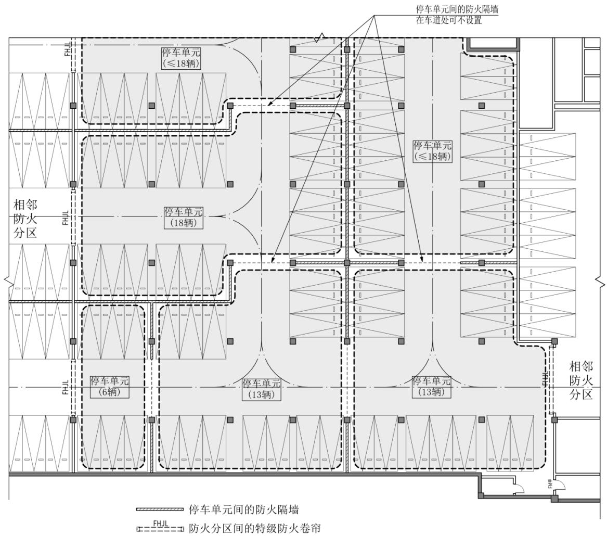

附图9.7.7 停车单元的设置

〔说明〕新增条文。明确汽车库内设置或预留电动汽车充电设施时的区域划分和防 火分隔的要求。 

需要注意的是，新能源汽车的火灾并不仅限于充电阶段，建议有可能停放电动汽车 的汽车库都按划分停车单元进行消防设计。 

9.7.8 在工业用地上建设的科研、软件生产等类似功能的工业厂房，其消 防设计应符合下列规定： 

1 项目总平面设计、防火间距等应按照规范有关丙类厂房的规定从严 执行； 

2 项目建筑单体（含改造、装修）的消防设计应根据其相应实际使用 功能（如办公建筑等）按照规范有关公共建筑的规定执行； 

3 建筑内可设置企业自用的厨房和员工餐厅，并应符合下列规定： 

（1）厨房操作间应布置在 $2 4 \mathrm { m }$ 以下，贴临外墙或下沉庭院、下沉广 场设置，并应设置可开启外窗； 

（2）厨房区域顶板及底板结构楼板的耐火极限不应小于 2.00h；厨房 

操作间与其他区域之间应采用耐火极限不低于 3.00h 的防火隔墙，确需连 通时，应设置甲级防火门； 

（3）厨房和员工餐厅应设置至少一个独立的安全出口； 

（4）厨房操作间的排油烟罩及烹饪部位应设置火灾自动灭火装置； 

4 当按本条第3 款设置的厨房使用燃气时，尚应符合下列规定： 

（1）厨房和员工餐厅设置的独立安全出口不应与上下层的生产性用房 共用； 

（2）燃气立管应沿建筑外墙外侧敷设，其对应的厨房外墙位置应设置 不燃烧体外墙，且燃气立管与周边门窗洞口距离不应小于 $1 . 0 \mathrm { m }$ ； 

（3）厨房操作间可开启外窗的面积不应小于其地面面积的 $5 \%$ ； 

（4）厨房操作间的燃气管道上应设置与自动灭火装置联动的自动切断 装置； 

（5）燃气厨房应设置机械事故排风系统，联动气体探测报警装置启闭。 事故排风的排风换气次数不应小于12次/h。 

〔说明〕新增条文。《建筑设计防火规范》术语中关于裙房的定义，适用于工业建 筑。对于本条所指的工业厂房的消防设计按照现行国家标准《建筑防火通用规范》GB 55037、《建筑设计防火规范》GB 50016的民用建筑从严考虑时，可按照民用建筑裙房 的相关规定执行，但总平面设计、消防间距等仍应按照本条第1款的规定执行。 

工业厂房是否属于本条的“类似功能”，需县（市、区）级政府相关主管部门认定。 

厨房区域的通风和泄压应满足国家标准对于燃气厨房的相关要求。本条中的厨房操 作间主要指副食加工间，不包括与副食加工间采用耐火极限不低于2.00h的防火隔墙和 乙级防火门分隔开的粗加工、清洗、储藏等房间。 

9.7.9 电动自行车锂电池服务网点（含电池健康评估、暂存服务和回收服 务）宜独立建造，并应符合下列规定： 

1 总建筑面积不应大于 $3 0 0 ~ \mathrm { { m } } ^ { 2 }$ ；当建筑面积大于 $2 0 0 ~ \mathrm { { m } } ^ { 2 }$ 时安全出口数 量不应少于2 个； 

2 应参照乙类仓库控制其与其他建筑的防火间距； 

3 建筑的耐火等级不应低于二级；服务网点内部的各功能区域之间应 设置耐火极限不低于 3.00h 的防火隔墙，隔墙上设置门扇时应为甲级防火 门；内部装修应采用不燃材料；应设置泄压设施，泄压设施的设置应避开 人员密集场所和主要交通道路； 

4 应设置室外和室内消火栓系统；设置室内消火栓确有困难时，应配 

置消防软管卷盘或轻便消防水龙；建筑物灭火器应按严重危险级配置； 

5 应设置包含CO探测器的火灾自动报警系统、消防应急照明及疏散 指示系统；照明灯具、开关、电源插座应采用防爆型产品，同时应设置可 燃气体探测报警装置； 

6 应设置平时通风系统和消防排烟系统，且应优先采用自然通风和自 然排烟系统。当采用自然通风（自然排烟）时，自然通风（自然排烟）窗 或开口的有效面积不应小于地面面积的 $3 \%$ ；当采用机械通风时，其换气次 数不应小于 6 次/h，且排风机应采用防爆型风机；当采用机械排烟时，机 械排烟量应按不小于 $9 0 ~ \mathrm { m } ^ { 3 } / \mathrm { ~ ( ~ h ~ } \cdot \mathrm { ~ m } ^ { 2 } )$ ）计算，且不小于 $1 5 0 0 0 \mathrm { m } ^ { 3 } / \mathrm { h }$ （当房间 建筑面积小于或等于 $1 0 0 ~ \mathrm { { m } } ^ { 2 }$ 时，其计算排烟量不小于 $7 2 0 0 \mathrm { m } ^ { 3 } / \mathrm { h } \dot { }$ ）。 

当独立建造确有困难时，电动自行车锂电池服务网点可附设在一、二 级耐火等级的其他单、多层建筑以及满足本《指南》第1.5.3 条第1~4款要 求时的高层建筑附属部分内，但应符合下列规定： 

1 不得贴临老年人照料设施、儿童活动场所、中小学校、歌舞娱乐放 映游艺场所、医疗建筑、居住建筑； 

2 总建筑面积不应大于 $5 0 \ \mathrm { \ m } ^ { 2 }$ ；应位于建筑首层并应设置独立安全出 口，门窗应直接向室外开启，且不应有通向楼梯间及前室的门或出口； 

3 与其他功能场所之间应采用耐火极限不低于 4.00h 的防火隔墙和 2.00h的不燃性楼板分隔，隔墙和楼板上不应开设门、窗、洞口；服务网点 内部的各功能区域之间应设置耐火极限不低于 3.00h 的防火隔墙，隔墙上 设置门扇时应为甲级防火门；内部装修应采用不燃材料；应设置泄压设施， 泄压设施的设置应避开人员密集场所和主要交通道路； 

4 应设置室外消火栓系统，并根据所在建筑的消防要求设置室内消火 栓和自动灭火系统；不设置室内消火栓系统时，应配置消防软管卷盘或轻 便消防水龙；灭火器应按严重危险级配置； 

5 本条前述独立建造时的第 $5 { \sim } 6$ 款规定。 

〔说明〕新增条文。明确电动自行车锂电池服务网点的消防设计技术要求。 

# 附录 A 本次修订时删除的《浙江省消防难点问题 操作技术指南（2020 版）》条文及说明

1.1.2 无楼梯到达且与其他建筑功能空间采取无洞口的墙体和楼板（采用耐火极限不低 于 2.00h 的防火隔墙和耐火极限不低于 1.50h 的楼板）完全分隔的内部无可燃物的建筑 屋顶的闷顶层可不计入高度和层数。 

〔说明〕删除《指南（2020版）》第1.1.2条。 

1.4.8 《建筑设计防火规范》条款中出现的“重要公共建筑”可参照《汽车加油加气站 设计与施工规范》GB 50156-2012（2014 年版）附录 B 关于重要公共建筑物认定的标准 来界定。 

〔说明〕删除《指南（2020版）》第1.4.8条。重要公共建筑在专项规范中有明确 规定的，本《指南》不再做特别说明，从其规定。 

2.1.4 住宅建筑消防登高操作场地、尽头式消防车道与环形消防车道距离大于 $1 8 \mathrm m$ 时， 应设置消防回车场地。（附图2.1.4） 

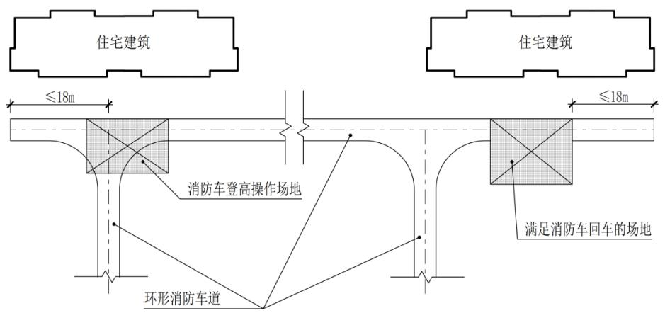

附图2.1.4 尽头式的消防回车场地

〔说明〕删除《指南（2020版）》第2.1.4条。尽头式消防车道的回车要求，按《建 筑防火通用规范》第3.4.5条第6款的规定执行。 

4.1.1 招待所（旅馆）、公共娱乐等场所不宜设置在集贸市场内。当必须设置时，招待 所（旅馆）、公共娱乐场所应与集贸市场采取防火分隔措施；招待所（旅馆）和集贸市 场的疏散楼梯应独立设置，公共娱乐场所和集贸市场的疏散楼梯宜独立设置，且在首层 均应能独立直通室外。 

〔说明〕删除《指南（2020版）》第4.1.1条。集贸市场一般指农副产品的交易场 所。服装批发市场按商店建筑进行消防设计。当与旅馆建筑等组合建造时，应分别满足 相应的防火设计要求。 

4.1.13 除甲、乙类厂房及本《指南》第1.3.1条规定的厂房外，当厂房内设置自动喷水 灭火系统时，一、二级耐火等级的厂房内任一点到最近安全出口的距离可增加 $2 5 \%$ 。 

〔说明〕删除《指南（2020 版）》第 4.1.13 条，从严要求。厂房疏散距离已经比 较长，疏散距离不再增加。 

4.1.34 利用架空层等空间直通室外时，当疏散外门至架空层投影外边缘的水平距离超 过6m 且大于架空层层高时，水平疏散距离应计算至架空层投影外边缘；住宅建筑架空 层仅作为景观、人员通行使用时，疏散外门至架空层投影外边缘的水平距离不应超过 $1 5 \mathrm { m }$ 。 

〔说明〕删除《指南（2020 版）》第 4.1.34 条，内容调整至第 4.1.11、4.1.12 条。 

4.2.13 高层建筑内，仅供地下室疏散楼梯使用的首层疏散外门可不按高层公共建筑首 层疏散外门宽度要求设置。 

4.2.14 住宅的疏散楼梯间首层开向门厅的门及楼梯间直通室外的门，净宽可按本《指 南》第4.1.35条第1款的规定控制。 

〔说明〕删除《指南（2020版）》第4.2.13条、第4.2.14条，将浙建设发〔2023 103 号《浙江消防技术指南（2020 版）》部分条文执行问题专家意见 第九条问题“关 于首层疏散外门名词相关的问题”及其内容合并入第4.1.35条。 

4.3.1 直通建筑内附设汽车库的普通电梯，应在汽车库部分设置电梯候梯厅，并应采用 耐火极限不低于2.00h的防火隔墙和乙级防火门与汽车库分隔，确需用防火卷帘替代时， 卷帘总长度不得超过6m。 

〔说明〕删除《指南（2020版）》第4.3.1条，修改后并入本《指南》第 3.4.13条。 

5.3.2 建筑高度大于 $5 4 \mathrm { m }$ 的高层住宅建筑的户内应配置轻便消防水龙。 

〔说明〕删除《指南（2020版）》第5.3.2条，删除后按现行标准执行。 

5.4.4 湿式报警阀不得设于消防控制室内。在确有困难时，湿式报警阀可设于管道井内， 但应便于操作并应设置排水设施。水力警铃的设置应符合规范要求。 

〔说明〕删除《指南（2020版）》第5.4.4条，删除后按现行标准执行。 

5.4.6 净高超过自动喷水灭火系统保护可达高度的中庭（无可燃物的中庭除外）需要设 置自动灭火系统时，宜采用自动跟踪定位射流灭火系统等。 

〔说明〕删除《指南（2020版）》第5.4.6条，删除后按现行标准执行。 

6.1.2 消防控制室、消防水泵、消防电梯、水幕泵等消防设备的供电线路，以及建筑高 度超过 $1 0 0 \mathrm { m }$ 民用建筑的消防应急照明和疏散指示系统、防排烟系统供电干线应满足火 灾时连续供电的需要。 

〔说明〕删除《指南（2020版）》第6.1.2条。 

6.1.6 消防控制室、消防水泵房的消防用电设备及消防电梯等的供电，应在其配电线路 的最末一级配电箱处设置自动切换装置。防烟和排烟风机房的消防用电设备以及其他消 防用电设备的供电，自动切换装置应设置在所在防火分区的配电小间内或其配电线路的 最末一级配电箱处。 

〔说明〕删除《指南（2020版）》第6.1.6条。 

6.2.2 消防应急照明和疏散指示系统的应急点亮控制模式设计应符合《消防应急照明和 疏散指示系统技术标准》GB 51309或《民用建筑电气设计标准》GB 51348的相关规定。 

〔说明〕删除《指南（2020 版）》第 6.2.2 条。 

6.2.3 采用集中电源系统时，同一平面内相邻的防火分区可共用集中电源，不同防火分 区不得共用同一分支回路。 

〔说明〕删除《指南（2020版）》第6.2.3条。 

6.2.4 不应采用蓄光型指示标志替代消防应急标志灯具。 

〔说明〕删除《指南（2020版）》第62.4条。 

7.2.1 《建筑设计防火规范》第8.5.2条第1款中“人员或可燃物较多的丙类生产场所”， 当该场所建筑面积大于 $3 0 0 ~ \mathrm { { m } } ^ { 2 }$ 时应设置排烟设施。 

〔说明〕删除《指南（2020 版）》第 7.2.1 条，本条内容在《建筑防火通用规范》 第8.2.2 条第1款中已明确。 

7.2.9 冷库的冷间（含冷藏间、冻结间等）可按《冷库设计标准》GB50072 的相关要求 设置排烟设施。 

〔说明〕删除《指南（2020 版）》第 7.2.9 条，《冷库设计标准》GB 50072-2021 中已有相应规定。 

7.2.18 《防排烟标准》第 4.4.2 条中，公共建筑（或工业建筑）排烟系统每段高度不应 超过 $5 0 \mathrm { m }$ ，此处的每段高度是指排烟系统每段的服务楼层高度。排烟风机宜设置于系统 最高服务楼层，或贴邻系统最高服务楼层布置，排烟风机房宜结合设备层合理布置；当 受条件限制排烟风机的设置位置（如屋面）远离系统最高服务楼层时，应复核风道阻力 和排烟风机的风压值，确保排烟效果。 

〔说明〕删除《指南（2020 版）》第 7.2.18 条，本条内容已整合至本《指南》第 7.1.13 条。 

7.2.33 《烟标》第 4.6.4 条中所谓“相同净高”，是指一个排烟系统所承担的多个防烟 分区的建筑空间净高均大于 6m，或均小于或等于6m；所谓“不同净高”，是指一个排 烟系统所承担的多个防烟分区的建筑空间净高，其中部分防烟分区的净高大于 6m，部 分防烟分区的净高小于或等于 $6 \mathrm m$ 。 

〔说明〕删除《指南（2020版）》第7.2.33条，本条规定已被普遍理解。 

7.2.40 设置在一、二、三层的歌舞娱乐放映游艺场所，其排烟设计应满足以下要求： 

1 当房间为无窗（或设固定窗）房间且单个房间面积大于或等于 $5 0 ~ \mathrm { \mathfrak { m } } ^ { 2 }$ （或多个无 窗房间总面积大于或等于 $2 0 0 \mathrm { ~ m } ^ { 2 } )$ ）时应设置排烟设施；当房间为有窗房间且单个房间面 积大于或等于 $1 0 0 ~ \mathrm { { m } } ^ { 2 }$ 时应设置排烟设施； 

2 当该场所采用机械排烟系统时，其排烟系统的防烟分区、排烟量、补风等设计应 参照本《指南》第7.2.39条的相关规定执行。 

〔说明〕删除《指南（2020 版）》第 7.2.40 条文，设置在一、二、三层歌舞娱乐 放映游艺场所的排烟设计可按相关规范、标准进行。 

7.3.1 加压送风系统的常闭加压送风口应具备现场手动开启、消防控制室手动开启及火 灾自动报警系统自动（联动）开启功能；当系统中任一常闭加压送风口开启后，应能通 过报警系统的控制模块自动（联动）启动（或通过其他方式启动）加压送风机。 

〔说明〕删除《指南（2020版）》第7.3.1条，《消防设施通用规范》第11.1.5 条 已有规定。 

9.2.2 除托儿所、幼儿园的儿童用房、小学校的教学用房外，其他儿童活动场所位于两 个安全出口之间或袋形走道两侧的房间，建筑面积不大于 $1 2 0 ~ \mathrm { ~ m ~ } ^ { 2 }$ 的房间可设置 1 个疏 散门。 

〔说明〕删除《指南（2020版）》第9.2.2条，原条文内容低于《建筑防火通用规 范》的要求，应按《建筑防火通用规范》第7.4.2条第1款的规定执行。 

# 附录 B 本指南部分用词和概念的说明

B.0.1 特级防火卷帘：源自《防火卷帘》 GB 14102-2005 等标准，对应指 国标《防火卷帘 第1 部分：通用技术条件》 GB 14102.1-2024 中的隔热防 火卷帘（A 类，代号 A3，耐火隔热性 $\geqslant 3 . 0 0 \mathrm { h }$ 且耐火完整性 $\geqslant 3 . 0 0 \mathrm { h }$ ）。本 《指南》从内容理解和表述习惯考虑，仍保留特级防火卷帘的用词。 

B.0.2 防火门、窗的甲、乙、丙等级：源自《建筑设计防火规范》GB 50016-2014 （2018 年版）《建筑防火通用规范》GB 55037-2022 等国家标准，对应指 国标《防火门》 GB 12955-2024 第 4.1.3 条、《防火窗》 GB 16809-2024 第4.2.4 条中相应的耐火性能分类。本《指南》从内容理解和表述习惯考虑， 仍保留防火门、窗的甲、乙、丙级的用词。 

# B.0.3 “人员密集场所”和“人员密集的场所”：

人员密集场所，指的是《中华人民共和国消防法》第七十三条所规定 的场所，即宾馆、饭店、商场、集贸市场、客运车站候车室、客运码头候 船厅、民用机场航站楼、体育场馆、会堂以及公共娱乐场所等，也包括医 院的门诊楼、病房楼，学校的教学楼、图书馆、食堂和集体宿舍，养老院， 福利院，托儿所，幼儿园，公共图书馆的阅览室，公共展览馆、博物馆的 展示厅，劳动密集型企业的生产加工车间和员工集体宿舍，旅游、宗教活 动场所等。该类场所区别于人员密集的场所。 

人员密集的场所，是指同一时间使用人数多的场所，在考虑锅炉房、 柴油发电机房的平面布置时，指人员密集的部位，在确定疏散门的净宽度 不小于 $1 . 4 0 \mathrm { m }$ 时，主要为设置在建筑内的观众厅、会议室、报告厅、多功 能厅、营业厅、餐厅或宴会厅、阅览室等同一时间可能具有较多人员使用 的某一特定房间。人员密集的场所 指的是 人员密集场所和其他场所 中人 员密集的部位。 